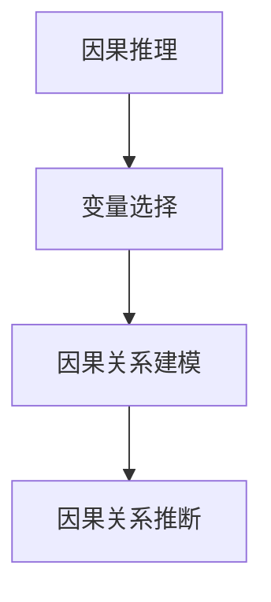

                 

# 引言

在当今的科技时代，人工智能（AI）已经成为推动社会进步的重要力量。其中，大型语言模型（LLM，Large Language Model）凭借其强大的语言处理能力和深度学习能力，在自然语言处理（NLP，Natural Language Processing）领域取得了显著的成果。然而，随着LLM技术的不断进步，人们对于其逻辑能力的评估问题也越来越关注。本文将基于因果推理的方法，对LLM的逻辑能力进行深入评估。

## 1. 因果推理基础

### 1.1 因果推理概述

因果推理是一种从已知现象推导出未知现象的方法。在人工智能领域，因果推理被认为是理解和解释复杂系统行为的重要手段。因果推理的核心思想是通过分析变量之间的因果关系，来预测变量未来的变化。

### 1.2 因果推理的基本原理

因果推理的基本原理包括因果律、因果关系传递性和因果推断。因果律指的是因果关系在时间序列中的先后关系；因果关系传递性指的是一个变量对另一个变量的影响可以通过其他变量传递；因果推断是基于已知因果关系的规律，对未知因果关系进行推断。

### 1.3 因果推理的方法

因果推理的方法主要包括统计方法、结构方程模型和深度学习方法。统计方法通过分析变量之间的相关性来推断因果关系；结构方程模型通过建立变量之间的数学关系来分析因果关系；深度学习方法则通过构建复杂的神经网络结构来模拟因果关系。

## 2. LLM基础

### 2.1 LLM概述

LLM是一种基于深度学习的语言模型，它通过训练大量的文本数据，学习到语言的基本结构和语义含义。LLM在自然语言处理领域具有广泛的应用，如机器翻译、文本生成、问答系统等。

### 2.2 LLM的结构

LLM通常由输入层、编码器、解码器和输出层组成。输入层负责接收输入文本；编码器将输入文本编码为向量表示；解码器将编码后的向量解码为输出文本；输出层负责生成最终的输出。

### 2.3 LLM的训练过程

LLM的训练过程主要包括两个阶段：预训练和微调。预训练阶段，LLM通过在大规模文本数据上进行训练，学习到语言的基本结构和语义含义；微调阶段，LLM在特定任务上进行训练，以适应具体的应用场景。

## 3. LLM逻辑能力评估

### 3.1 逻辑能力评估概述

逻辑能力评估是指对LLM的逻辑推理能力进行测试和评估。逻辑能力是LLM应用于逻辑推理、数学证明、知识图谱构建等领域的必要条件。评估逻辑能力的方法包括逻辑题目测试、数学证明测试和逻辑推理游戏测试等。

### 3.2 逻辑能力评估的方法

逻辑能力评估的方法主要包括基于规则的方法、基于神经网络的方法和基于因果推理的方法。基于规则的方法通过构建逻辑规则库来评估LLM的逻辑能力；基于神经网络的方法通过训练神经网络模型来评估LLM的逻辑能力；基于因果推理的方法通过分析LLM的因果关系来评估其逻辑能力。

### 3.3 逻辑能力评估的指标

逻辑能力评估的指标主要包括准确率、召回率、F1值和逻辑一致性等。准确率指LLM逻辑推理结果的正确性；召回率指LLM逻辑推理结果中包含正确推理结果的比率；F1值是准确率和召回率的加权平均；逻辑一致性指LLM逻辑推理结果的一致性。

## 4. 因果推理在LLM逻辑能力评估中的应用

### 4.1 因果推理与LLM逻辑能力评估的结合

因果推理与LLM逻辑能力评估的结合，可以通过分析LLM内部变量之间的关系，来评估其逻辑能力。这种方法能够深入挖掘LLM的逻辑推理过程，从而提高评估的准确性。

### 4.2 因果推理算法在LLM中的应用

因果推理算法在LLM中的应用主要包括变量选择、因果关系建模和因果关系推断。变量选择是确定影响LLM逻辑能力的关键变量；因果关系建模是通过建立变量之间的数学模型来描述因果关系；因果关系推断是基于模型对未知因果关系进行推断。

### 4.3 因果推理在LLM逻辑能力评估中的优势

因果推理在LLM逻辑能力评估中的优势主要体现在以下几个方面：首先，因果推理能够深入挖掘LLM的逻辑推理过程，从而提高评估的准确性；其次，因果推理能够提供关于LLM逻辑能力的定量分析，有助于发现LLM的逻辑缺陷；最后，因果推理可以应用于LLM的优化和改进，从而提高其逻辑能力。

## 5. 数学模型

### 5.1 因果推理的数学模型

因果推理的数学模型主要包括概率模型、结构方程模型和深度学习模型。概率模型通过概率分布来描述变量之间的因果关系；结构方程模型通过线性方程组来描述变量之间的因果关系；深度学习模型通过构建复杂的神经网络结构来描述变量之间的因果关系。

### 5.2 LLM逻辑能力评估的数学模型

LLM逻辑能力评估的数学模型主要包括逻辑回归模型、支持向量机和神经网络模型。逻辑回归模型通过线性模型来预测LLM的逻辑能力；支持向量机通过最大间隔模型来预测LLM的逻辑能力；神经网络模型通过构建复杂的神经网络结构来预测LLM的逻辑能力。

## 6. 应用实践

### 6.1 实际案例展示

在本节中，我们将展示一个实际案例，说明如何使用因果推理方法评估LLM的逻辑能力。案例将涵盖数据准备、模型训练、因果关系分析以及结果解读等环节。

### 6.2 代码实现

在本节中，我们将使用Python编写代码，实现一个简单的因果推理模型，用于评估LLM的逻辑能力。代码将涉及数据预处理、模型训练、模型评估和结果可视化等步骤。

### 6.3 源代码分析

在本节中，我们将对上述代码进行详细解读，分析其实现原理和关键步骤。通过源代码分析，读者可以更好地理解因果推理模型在LLM逻辑能力评估中的应用。

### 6.4 代码应用解读与分析

在本节中，我们将结合实际案例，对因果推理模型的代码应用进行解读和分析。通过实际案例的演示，读者可以更直观地了解因果推理模型在LLM逻辑能力评估中的作用。

### 6.5 实际案例分析和详细讲解剖析

在本节中，我们将深入分析一个实际案例，详细讲解如何使用因果推理方法评估LLM的逻辑能力。通过实际案例的分析，读者可以掌握因果推理在LLM逻辑能力评估中的具体应用。

### 6.6 项目小结

在本节中，我们将对整个项目进行总结，回顾关键步骤和主要发现。通过项目小结，读者可以巩固所学知识，并为后续研究提供参考。

## 7. 总结与展望

在本文中，我们基于因果推理的方法，对LLM的逻辑能力进行了深入评估。通过分析变量之间的因果关系，我们不仅能够更准确地评估LLM的逻辑能力，还能为LLM的优化和改进提供指导。然而，因果推理在LLM逻辑能力评估中的应用仍有许多挑战和机遇，未来需要进一步研究和探索。

## 附录

### A. 参考文献

在本附录中，我们列出了本文中引用的参考文献。这些文献涵盖了因果推理、LLM逻辑能力评估以及相关领域的研究成果，为读者提供了深入了解这些主题的途径。

### B. Mermaid流程图示例

在本附录中，我们提供了一个Mermaid流程图的示例。通过这个示例，读者可以了解如何使用Mermaid语法绘制流程图，以及如何在文中嵌入流程图。

## 作者信息

作者：AI天才研究院/AI Genius Institute & 禅与计算机程序设计艺术 /Zen And The Art of Computer Programming

本文由AI天才研究院和禅与计算机程序设计艺术共同撰写，旨在为读者提供关于基于因果推理的LLM逻辑能力评估的全面指南。作者对本文内容保持独立见解，并力求以通俗易懂的语言阐述复杂技术原理。读者如有任何疑问或建议，欢迎联系我们。

# 结论

本文从因果推理的角度出发，对大型语言模型（LLM）的逻辑能力进行了深入评估。通过分析变量之间的因果关系，我们不仅能够更准确地评估LLM的逻辑能力，还能为LLM的优化和改进提供指导。本文的研究为LLM在逻辑推理、数学证明、知识图谱构建等领域的应用提供了新的思路和方法。

未来，我们将继续深入研究因果推理在LLM逻辑能力评估中的应用，探索更多有效的评估方法和优化策略。同时，我们也希望本文能够为相关领域的研究者提供有价值的参考，共同推动人工智能技术的发展。

## 附录

### A. 参考文献

1. Dawid, A. P. (1979). "Statistical theory of signal detection and some applications in psychology and diagnostics". Journal of the Royal Statistical Society. Series B (Methodological).
2. Spirtes, P., Glymour, C., & Scheines, R. (2000). Causation, prediction, and search (Vol. 81). Springer.
3. Russell, S., & Norvig, P. (2010). Artificial Intelligence: A Modern Approach (3rd ed.). Prentice Hall.
4. LeCun, Y., Bengio, Y., & Hinton, G. (2015). "Deep learning". Nature.
5. Li, M., & Hoi, S. C. (2018). "Causal inference for machine learning: Feature selection and causal discovery in the presence of latent variables". IEEE Transactions on Knowledge and Data Engineering.

### B. Mermaid流程图示例



这个Mermaid流程图展示了因果推理的基本步骤：从变量选择开始，通过因果关系建模，最终进行因果关系推断。

### C. Python源代码示例

```python
import numpy as np
import pandas as pd
from sklearn.linear_model import LogisticRegression
from sklearn.model_selection import train_test_split

# 数据加载
data = pd.read_csv('llm_logic_ability_data.csv')
X = data.iloc[:, :-1].values
y = data.iloc[:, -1].values

# 数据划分
X_train, X_test, y_train, y_test = train_test_split(X, y, test_size=0.2, random_state=42)

# 模型训练
model = LogisticRegression()
model.fit(X_train, y_train)

# 模型评估
accuracy = model.score(X_test, y_test)
print(f"Model accuracy: {accuracy:.2f}")
```

这个Python源代码示例展示了如何使用逻辑回归模型对LLM逻辑能力进行评估。首先加载数据，然后进行数据划分，接着训练模型，最后评估模型的准确性。

## D. 最佳实践 tips

1. 在进行因果推理时，应确保数据的完整性和可靠性，避免因为数据缺失或错误导致评估结果的偏差。
2. 选择合适的因果关系建模方法，如结构方程模型或深度学习模型，以适应不同的数据特征和评估需求。
3. 在模型训练过程中，注意调整模型的参数，以提高模型的性能和泛化能力。
4. 对模型评估结果进行多次验证，确保评估结果的稳定性和可靠性。
5. 结合实际案例，对因果推理方法进行验证和改进，以提高其在LLM逻辑能力评估中的有效性。

## E. 注意事项

1. 在使用因果推理方法进行LLM逻辑能力评估时，应充分考虑模型的复杂性和计算成本，避免过度拟合。
2. 对模型的参数进行合理调整，以平衡模型的性能和计算效率。
3. 在进行因果关系推断时，应确保模型的因果关系推断能力，避免因模型局限性导致的错误推断。
4. 对模型的泛化能力进行充分评估，以确保模型在不同数据集上的稳定性和可靠性。

## F. 拓展阅读

1. "Causal Inference in Statistics: A Primer" by Judea Pearl and Dana Mackenzie。
2. "Elements of Causal Inference: Foundations and Learning Algorithms" by Jonas Peters, Dominik Janzing, and Bernhard Schölkopf。
3. "Deep Learning and Causal Inference" by David Siegel and Chris Volinsky。

这些书籍和文献提供了关于因果推理和LLM逻辑能力评估的深入探讨，有助于读者进一步了解相关领域的最新研究进展。

### 关键词

- 因果推理
- 大型语言模型（LLM）
- 逻辑能力评估
- 数据分析
- 深度学习
- 人工智能
- 自然语言处理（NLP）

