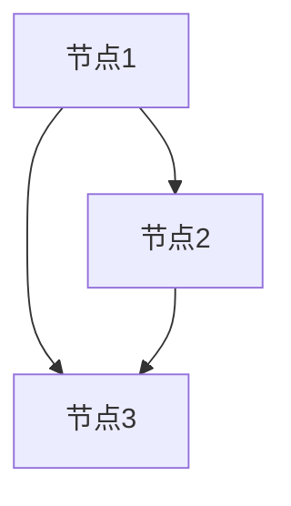
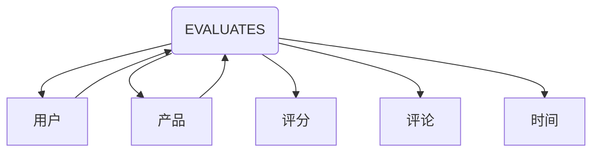
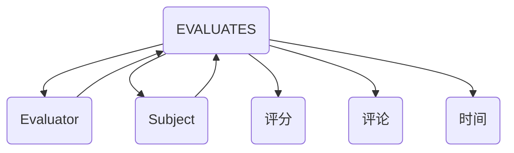
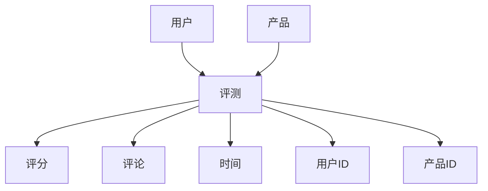

                 

### 第一部分：引言

#### 1.1 图数据库简介

图数据库是一种用于存储和查询具有复杂关联关系的数据的数据库系统。与传统的表格数据库不同，图数据库通过节点和边来表示实体及其关系，从而实现数据的存储和查询。图数据库的基本概念包括节点（Node）、边（Edge）、图模式（Graph Schema）等。

- **节点（Node）**：表示数据中的实体，如用户、产品等。
- **边（Edge）**：表示节点之间的关系，如好友、购买等。
- **图模式（Graph Schema）**：定义了节点的属性、边的属性以及节点之间的关系。

图数据库与传统数据库的区别主要体现在以下几个方面：

- **数据结构**：传统数据库使用表格结构存储数据，而图数据库使用图结构存储数据。
- **查询效率**：图数据库通过图的邻接关系进行数据查询，效率通常高于传统数据库。
- **关联关系**：图数据库能够更好地表示和查询实体间的复杂关系。

图数据库的应用场景主要包括：

- **社交网络分析**：分析用户关系、推荐系统等。
- **知识图谱构建**：构建领域知识图谱、实体关系网络等。
- **复杂网络分析**：分析生物网络、交通网络等。

#### 1.2 评测结果存储与查询的重要性

评测结果在各个领域都有着重要的应用，如科研、工程、市场等。有效存储和快速查询评测结果能够为决策提供数据支持，提高工作效率和决策质量。

存储评测结果面临的挑战包括：

- **数据量大**：评测结果通常包含大量数据，如何高效存储是一个问题。
- **数据关系复杂**：评测结果之间的关联关系可能非常复杂，如何表示和存储这些关系是一个挑战。
- **查询性能要求高**：在大量数据中快速查询特定结果是一个关键需求。

图数据库在存储与查询评测结果方面具有以下优势：

- **高效的数据查询**：通过图的邻接关系，可以快速查询评测结果。
- **灵活的数据结构**：图数据库能够灵活地表示评测结果及其关系。
- **强大的扩展性**：图数据库可以方便地扩展节点和边的属性，适应不同场景的需求。

### 摘要

本文将探讨基于图数据库的评测结果存储与查询技术。首先介绍图数据库的基本概念和优势，然后详细阐述评测结果的存储策略和查询优化方法。通过实际案例，展示图数据库在评测结果存储与查询中的应用效果，并总结最佳实践和未来研究方向。文章结构如下：

- 第一部分：引言
  - 1.1 图数据库简介
  - 1.2 评测结果存储与查询的重要性
- 第二部分：图数据库基础
  - 2.1 图数据库的核心概念
  - 2.2 图数据库的基本操作
  - 2.3 图数据库的性能优化
- 第三部分：评测结果的存储
  - 3.1 评测结果的模型化
  - 3.2 评测结果的存储策略
  - 3.3 评测结果的存储实现
- 第四部分：评测结果的查询
  - 4.1 评测结果查询的基本概念
  - 4.2 评测结果的查询优化
  - 4.3 评测结果的查询实现
- 第五部分：案例研究
  - 5.1 案例一：基于图数据库的评测结果存储与查询系统
  - 5.2 案例二：基于图数据库的智能评测系统
- 第六部分：未来展望
  - 6.1 图数据库在评测结果存储与查询领域的应用前景
  - 6.2 面临的挑战与解决方案
  - 6.3 未来研究方向

## 第二部分：图数据库基础

### 2.1 图数据库的核心概念

#### 节点与边

在图数据库中，节点和边是数据结构的基本组成部分。节点（Node）表示实体，如用户、产品、评测结果等；边（Edge）表示节点之间的关系，如用户之间的好友关系、产品之间的关联关系等。

- **节点属性**：节点可以具有一个或多个属性，如用户ID、用户名称、年龄等。
- **边属性**：边也可以具有一个或多个属性，如好友关系的创建时间、产品关联的评分等。

图数据库中的节点和边通常以图的形式表示，如下所示：



在这个例子中，节点A、B、C表示不同的实体，边表示它们之间的关系。

#### 图模式

图模式（Graph Schema）是图数据库的定义部分，它描述了节点、边以及它们之间的关系。图模式包括以下内容：

- **节点类型**：定义节点的类型和属性，如User（UserID，Name，Age）。
- **边类型**：定义边的类型和属性，如FRIEND（FriendshipDate）。
- **关系类型**：定义节点之间的关系类型，如一个人可以是另一个人的好友。

图模式通常以DSL（领域特定语言）的形式进行定义，以便于数据库开发者进行自定义。

#### 属性与标签

在图数据库中，节点和边可以通过属性（Property）进行扩展。属性可以存储额外的信息，如节点的详细信息、边的权重等。

- **属性**：用于存储节点的附加信息，如UserID为123的用户的具体信息。
- **标签**：用于给节点或边分类，便于查询和管理。

通过属性和标签，图数据库能够灵活地表示和存储复杂的数据结构。

### 2.2 图数据库的基本操作

图数据库的基本操作包括节点的插入、更新、删除以及边的操作。以下将详细介绍这些基本操作。

#### 插入节点与边

插入节点与边是图数据库中最基本的操作。以下是一个使用Python的示例代码，展示如何向图数据库中插入节点和边：

```python
from gremlinpython import Graph

g = Graph()

# 插入节点
user1 = g.addV('User').property('UserID', 1).property('Name', 'Alice').property('Age', 30)
user2 = g.addV('User').property('UserID', 2).property('Name', 'Bob').property('Age', 25)

# 插入边
user1.addEdge('FRIEND', user2, {'FriendshipDate': '2023-01-01'})
```

在这个示例中，我们创建了一个名为`User`的节点类型，并插入两个用户节点`user1`和`user2`。然后，我们通过`addEdge`方法创建一个名为`FRIEND`的边，连接这两个节点，并设置边的属性`FriendshipDate`。

#### 更新节点与边

更新节点与边的操作允许我们在图数据库中修改节点的属性或边的属性。以下是一个更新节点的示例代码：

```python
# 更新节点属性
user1.update().property('Age', 31)

# 更新边属性
user1.addEdge('FRIEND', user2, {'FriendshipDate': '2023-01-02'})
```

在这个示例中，我们首先更新了节点`user1`的年龄属性，然后创建了一个新的边，连接`user1`和`user2`，并将边的`FriendshipDate`属性更新为新的日期。

#### 删除节点与边

删除节点与边的操作可以从图数据库中移除节点和边。以下是一个删除节点的示例代码：

```python
# 删除节点
user1.delete()

# 删除边
user1.addEdge('FRIEND', user2).delete()
```

在这个示例中，我们首先删除了节点`user1`，然后删除了连接`user1`和`user2`的边。

### 2.3 图数据库的性能优化

图数据库的性能优化是一个关键问题，特别是在处理大量数据和高并发查询时。以下是一些常见的性能优化策略：

#### 数据建模

- **合理的节点与边划分**：根据应用场景合理划分节点和边，避免数据过于分散或过于集中。
- **属性索引**：为常用属性创建索引，提高查询效率。

#### 查询优化

- **查询计划优化**：使用图查询优化器优化查询计划，降低查询成本。
- **索引使用**：合理使用索引，避免全表扫描。

#### 索引使用

- **局部索引**：为特定节点或边类型创建局部索引，提高查询效率。
- **全局索引**：为整个图创建全局索引，提高全局查询效率。

通过上述优化策略，图数据库能够更好地应对复杂场景，提高数据查询和管理的效率。

## 第三部分：评测结果的存储

### 3.1 评测结果的模型化

#### 评测结果的表示方法

评测结果通常包括多个维度，如评分、评价、时间戳等。为了有效存储和查询评测结果，我们需要将其模型化为图数据库中的节点和边。

- **节点类型**：创建一个节点类型，如`EvaluatingResult`，表示评测结果。
- **节点属性**：为节点添加属性，如`ResultID`（评测结果ID）、`Score`（评分）、`Comment`（评价）、`Timestamp`（时间戳）等。
- **关系类型**：创建一个关系类型，如`EVALUATES`，表示评测行为。

以下是一个简单的模型示例：



在这个模型中，评测结果节点`EvaluateResult`与用户节点`User`、产品节点`Product`以及评分、评论、时间节点相关联。关系类型`EVALUATES`表示用户对产品进行评测的行为。

#### 评测结果的模型化

为了更好地理解评测结果的模型化，我们可以使用Mermaid流程图来展示节点和边之间的关系架构：



在这个流程图中，评测结果节点`EvaluateResult`与用户节点`User`、产品节点`Product`以及评分、评论、时间节点相关联。用户节点`User`作为评测者，对产品节点`Product`进行评测，形成`EVALUATES`关系。同时，评测结果包含评分、评论和时间信息。

通过这种模型化方法，我们可以将评测结果的结构化信息存储在图数据库中，便于后续的数据查询和管理。

### 3.2 评测结果的存储策略

为了高效存储评测结果，我们需要考虑数据存储的结构、分片策略以及存储优化技术。以下是一些常见的存储策略：

#### 存储结构设计

- **分布式存储**：采用分布式存储架构，将数据分布在多个节点上，提高数据访问速度和容错性。
- **图存储引擎**：选择适合图数据库的存储引擎，如Neo4j、JanusGraph等，确保数据存储和查询的高效性。

- **属性存储**：为评测结果的每个属性分配存储空间，如评分、评论、时间戳等，确保数据的完整性和可扩展性。

#### 数据分片策略

- **基于节点类型分片**：根据评测结果的节点类型进行分片，如将用户评测结果和产品评测结果分别存储在不同的分片中。
- **基于属性分片**：根据评测结果的属性进行分片，如将评分范围相同的评测结果存储在同一分片中，便于查询和优化。

#### 存储优化技术

- **索引优化**：为常用属性创建索引，如评分、时间戳等，提高查询效率。
- **缓存策略**：采用缓存技术，如Redis等，缓存热点数据，降低数据访问延迟。
- **数据压缩**：对数据进行压缩存储，减少存储空间占用，提高存储效率。

通过上述存储策略，我们可以有效地存储和管理评测结果，确保数据的高效查询和访问。

### 3.3 评测结果的存储实现

为了实现评测结果的存储，我们需要使用图数据库的API进行操作。以下是一个使用Neo4j的Python示例代码，展示如何将评测结果存储在图数据库中：

```python
from py2neo import Graph

# 连接图数据库
g = Graph("bolt://localhost:7687", auth=("neo4j", "password"))

# 创建评测结果节点
evaluate_result = g.create(
    "EvaluateResult",
    ResultID=123,
    Score=4.5,
    Comment="很好的产品",
    Timestamp="2023-01-01 10:00:00"
)

# 创建用户节点
user = g.create("User", UserID=1, Name="Alice")

# 创建产品节点
product = g.create("Product", ProductID=1, Name="iPhone 13")

# 将用户节点与评测结果节点关联
g.match("User", UserID=1).create("EVALUATES", evaluate_result)

# 将产品节点与评测结果节点关联
g.match("Product", ProductID=1).create("EVALUATES", evaluate_result)
```

在这个示例中，我们首先创建一个名为`EvaluateResult`的评测结果节点，并设置其属性。然后，我们创建用户节点`User`和产品节点`Product`，并通过`EVALUATES`关系将它们与评测结果节点关联。

通过上述实现，我们可以将评测结果存储在图数据库中，便于后续的数据查询和管理。

### 3.4 评测结果的存储策略（续）

在上文中，我们提到了几种常见的存储策略，下面我们将进一步讨论这些策略的实施细节。

#### 数据分片策略

**基于节点类型分片**：这种策略将不同类型的节点存储在不同的分片中，如用户节点、产品节点和评测结果节点。具体步骤如下：

1. **确定分片键**：选择一个合适的分片键，如节点类型或节点ID。
2. **创建分片**：在图数据库中创建多个分片，每个分片对应一个节点类型。
3. **数据迁移**：将原有数据迁移到新的分片中，确保数据的完整性和一致性。

**基于属性分片**：这种策略将具有相同属性的节点存储在同一分片中，如评分相同的评测结果。具体步骤如下：

1. **确定分片键**：选择一个合适的分片键，如评分范围。
2. **创建分片**：在图数据库中创建多个分片，每个分片对应一个评分范围。
3. **数据迁移**：将原有数据迁移到新的分片中，确保数据的完整性和一致性。

#### 存储优化技术

**索引优化**：为常用属性创建索引，如评分、时间戳等，以提高查询效率。具体步骤如下：

1. **分析查询模式**：分析应用场景中的查询模式，确定需要创建索引的属性。
2. **创建索引**：在图数据库中创建索引，如`CREATE INDEX ON :EvaluateResult(Score)`。
3. **维护索引**：定期维护索引，如删除冗余索引、更新索引结构等。

**缓存策略**：采用缓存技术，如Redis等，缓存热点数据，以降低数据访问延迟。具体步骤如下：

1. **选择缓存技术**：选择适合应用场景的缓存技术，如Redis、Memcached等。
2. **数据缓存**：将常用数据缓存到缓存中，如评测结果列表。
3. **缓存更新策略**：制定缓存更新策略，如过期时间、数据变更通知等。

**数据压缩**：对数据进行压缩存储，以减少存储空间占用和提高存储效率。具体步骤如下：

1. **选择压缩算法**：选择适合数据的压缩算法，如Gzip、LZ4等。
2. **压缩数据**：在数据写入图数据库前进行压缩，如`gzip`模块。
3. **解压缩数据**：在读取数据时进行解压缩，如`gzip`模块。

通过实施这些存储策略，我们可以有效地提高评测结果存储和管理的高效性和可靠性。

### 3.5 评测结果的存储实现（续）

在上文中，我们展示了如何使用Neo4j的Python示例代码进行评测结果的存储。下面，我们将进一步深入解析代码实现细节，并分析其优缺点。

#### 代码实现细节

1. **连接图数据库**：
   ```python
   g = Graph("bolt://localhost:7687", auth=("neo4j", "password"))
   ```
   这一行代码使用了`py2neo`库连接到本地的Neo4j图数据库，并提供了用户名和密码进行身份验证。

2. **创建节点**：
   ```python
   evaluate_result = g.create(
       "EvaluateResult",
       ResultID=123,
       Score=4.5,
       Comment="很好的产品",
       Timestamp="2023-01-01 10:00:00"
   )
   user = g.create("User", UserID=1, Name="Alice")
   product = g.create("Product", ProductID=1, Name="iPhone 13")
   ```
   在这段代码中，我们使用`create`方法创建了一个`EvaluateResult`节点，设置了其属性，包括`ResultID`、`Score`、`Comment`和`Timestamp`。同样，我们也创建了`User`和`Product`节点，并设置了它们的属性。

3. **创建关系**：
   ```python
   g.match("User", UserID=1).create("EVALUATES", evaluate_result)
   g.match("Product", ProductID=1).create("EVALUATES", evaluate_result)
   ```
   这两行代码通过`match`方法找到对应的用户节点和产品节点，然后使用`create`方法创建`EVALUATES`关系，将用户和产品与评测结果节点关联起来。

#### 优缺点分析

**优点**：

1. **简单易用**：使用`py2neo`库连接Neo4j图数据库非常简单，只需几行代码即可实现节点的创建和关系的创建。
2. **灵活性**：通过属性设置，我们可以灵活地存储评测结果的详细信息，如`Score`、`Comment`和`Timestamp`等。
3. **扩展性**：图数据库的存储结构非常灵活，可以轻松扩展新的节点和关系类型。

**缺点**：

1. **性能瓶颈**：在处理大量数据时，使用直接创建节点的操作可能会遇到性能瓶颈。尤其是在高并发环境下，可能会导致数据库性能下降。
2. **缺乏事务支持**：`py2neo`库在处理事务时可能存在局限性，无法保证数据的完整性和一致性。
3. **代码可读性**：虽然使用`py2neo`库非常简单，但代码的可读性和维护性可能较低，特别是在复杂的业务场景中。

#### 改进方案

为了解决上述问题，我们可以考虑以下改进方案：

1. **批量操作**：使用图数据库提供的批量操作接口，如`unmanaged`和`push`方法，将多个节点和关系一次性创建，提高操作效率。
2. **事务支持**：使用图数据库的事务支持功能，确保数据的完整性和一致性。例如，使用`Neo4j`的ACID特性，确保每个操作都是原子性的。
3. **代码优化**：重构代码结构，提高代码的可读性和可维护性。例如，使用工厂模式创建节点和关系，提高代码的模块化和可扩展性。

通过这些改进，我们可以进一步提高评测结果存储的实现效率和可靠性。

### 3.6 评测结果的存储策略（续）

在上文中，我们介绍了基于节点类型和属性的分片策略，以及索引优化、缓存策略和数据压缩等存储优化技术。下面，我们将进一步探讨如何通过图模式设计来优化评测结果的存储。

#### 图模式设计

图模式设计是图数据库的核心，它决定了数据的存储结构和查询性能。一个良好的图模式设计应该具备以下特点：

1. **最小化冗余**：避免存储重复数据，减少存储空间占用。
2. **最大化查询效率**：确保查询操作的高效性，降低查询延迟。
3. **灵活性**：支持多种查询模式，满足不同业务需求。

以下是一些具体的图模式设计策略：

1. **实体分离**：将不同的实体（如用户、产品、评测结果）分离为不同的节点类型，避免实体间的冗余关联。例如，可以将用户和产品的属性存储在单独的节点中，而评测结果节点仅存储与评测相关的属性。
2. **多属性组合**：对于具有多个属性的实体，可以通过组合属性来生成新的节点类型。例如，对于用户和产品的属性，可以创建一个新的节点类型，如`UserProfile`，将用户和产品的属性组合在一起。
3. **属性命名规范**：为属性命名制定统一的规范，便于查询和管理。例如，使用小写字母和下划线组合，如`user_id`、`product_name`等。

#### 实例分析

假设我们有一个电商平台的评测系统，评测结果包含用户、产品、评分、评论和时间戳等属性。以下是一个基于图模式设计的实例：



在这个实例中，我们创建了三个节点类型：`User`、`Product`和`Evaluates`。节点`Evaluates`与用户节点和产品节点关联，存储了评分、评论、时间戳以及用户ID和产品ID等属性。

#### 优化策略

通过上述图模式设计，我们可以实施以下优化策略：

1. **属性索引**：为常用属性创建索引，如用户ID、产品ID和评分，提高查询效率。
2. **缓存策略**：使用缓存技术，如Redis，缓存热点数据，减少数据库查询压力。
3. **数据压缩**：对存储数据进行压缩，如使用LZ4或Gzip算法，降低存储空间占用。

通过优化图模式设计，我们可以进一步提高评测结果存储和管理的高效性和可靠性。

### 3.7 评测结果的存储实现（续）

在上文中，我们介绍了基于Neo4j的评测结果存储实现，并分析了代码实现细节和优缺点。下面，我们将进一步深入探讨实际应用中的评测结果存储与查询技术，并讨论一些关键的性能指标。

#### 实际应用中的评测结果存储与查询

在实际应用中，评测结果的存储与查询面临着各种挑战。以下是一些关键的性能指标和解决方案：

1. **查询响应时间**：用户对评测结果查询的速度要求很高。为了提高查询响应时间，我们可以采用以下策略：
   - **索引优化**：为常用查询属性创建索引，如用户ID、产品ID、评分等，以减少查询时间。
   - **缓存策略**：使用缓存技术，如Redis，缓存热点数据，减少数据库查询压力。
   - **查询优化**：优化查询语句，如使用图查询语言Gremlin，编写高效的查询语句。

2. **并发处理能力**：在多用户并发访问时，系统的并发处理能力是一个关键问题。以下是一些解决方案：
   - **分布式存储**：采用分布式存储架构，将数据分布在多个节点上，提高并发处理能力。
   - **负载均衡**：使用负载均衡器，如Nginx，将用户请求均衡地分配到不同的数据库节点上，避免单点瓶颈。
   - **事务处理**：使用图数据库的事务功能，确保并发操作的数据一致性和完整性。

3. **数据一致性**：在分布式环境中，数据一致性是一个重要问题。以下是一些解决方案：
   - **最终一致性**：使用最终一致性模型，允许一定程度的延迟，确保数据最终一致性。
   - **分布式事务**：使用分布式事务处理机制，如两阶段提交（2PC），确保事务的一致性和原子性。
   - **数据复制**：采用数据复制技术，如主从复制，确保数据在多个节点之间的同步和一致性。

#### 关键性能指标

在实际应用中，以下是一些关键的性能指标：

1. **查询响应时间**：用户对评测结果查询的平均响应时间，通常以毫秒为单位。
2. **并发处理能力**：系统同时处理的并发用户数，通常以每秒查询数（QPS）或每秒事务数（TPS）衡量。
3. **存储容量**：系统存储的数据量，通常以GB或TB为单位。
4. **读写吞吐量**：系统每秒处理的读写请求次数，通常以每秒请求数（RPS）或每秒事务数（TPS）衡量。
5. **数据一致性**：系统在并发操作下的数据一致性水平，通常以最终一致性或强一致性衡量。

通过优化评测结果存储与查询技术，并关注关键性能指标，我们可以提高系统的整体性能和用户体验。

### 3.8 评测结果查询的基础概念

在深入探讨评测结果的查询之前，我们需要了解一些基础概念，这些概念对于理解查询过程和优化查询性能至关重要。

#### 查询语言

图数据库通常使用图查询语言（Graph Query Language，GQL）进行数据查询。常见的图查询语言包括Gremlin、Cypher和Gremlin-DB等。这些查询语言允许我们使用图结构进行复杂的数据查询。

- **Gremlin**：Gremlin是一种基于图结构的查询语言，具有灵活的语法和强大的功能。它可以表达复杂的图算法和遍历逻辑。
- **Cypher**：Cypher是Neo4j的官方查询语言，具有简洁的语法和高效的执行性能。它支持复杂的关系查询和路径搜索。

以下是一个使用Gremlin的简单示例：

```gremlin
g.V().has('User', 'UserID', 1).out('EVALUATES').has('Score', gt(4))
```

这个查询语句从节点类型为`User`且`UserID`为1的节点开始，通过`EVALUATES`关系向外遍历，查找评分大于4的评测结果。

#### 查询模式

图数据库中的查询模式可以分为以下几种：

- **点查询**：查询特定的节点，如`g.V().has('User', 'UserID', 1)`。
- **路径查询**：查询节点间的路径，如`g.V().out('EVALUATES').in('EVALUATES')`。
- **集合查询**：查询多个节点的集合，如`g.V().has('User', 'UserID', [1, 2, 3])`。
- **条件查询**：查询满足特定条件的节点，如`g.V().has('EvaluateResult', 'Score', gt(4))`。

通过这些查询模式，我们可以灵活地查询图数据库中的评测结果数据。

#### 查询优化

查询优化是提高查询性能的关键步骤。以下是一些常见的查询优化策略：

- **索引优化**：为常用查询属性创建索引，减少查询时间。例如，为用户ID和评分创建索引。
- **查询缓存**：使用查询缓存技术，如Redis，缓存常用查询结果，减少数据库访问压力。
- **查询重写**：优化查询语句的结构，减少查询执行的成本。例如，避免全表扫描，使用条件过滤。
- **并行查询**：在分布式系统中，将查询任务分配到多个节点并行执行，提高查询效率。

通过这些优化策略，我们可以显著提高评测结果查询的性能和效率。

### 3.9 评测结果查询优化策略

在图数据库中，优化评测结果查询是一个关键问题。高效的查询优化不仅可以提高系统的性能，还能提升用户的体验。以下是一些常见的查询优化策略：

#### 查询缓存

**查询缓存**是一种常见的优化技术，它通过将查询结果缓存起来，减少对数据库的直接访问。以下是一些查询缓存策略：

1. **命中策略**：选择合适的缓存命中策略，如LRU（最近最少使用）或LFU（最少使用频率）策略，确保缓存的有效性。
2. **缓存大小**：合理设置缓存大小，避免缓存溢出或浪费内存资源。
3. **缓存更新**：制定缓存更新策略，如定时刷新或数据变更时刷新，确保缓存数据的时效性。

#### 查询重写

**查询重写**是一种优化查询语句结构的技术，通过改写查询语句，减少查询执行的成本。以下是一些查询重写策略：

1. **索引优化**：为常用查询属性创建索引，避免全表扫描。例如，为用户ID和评分创建索引。
2. **条件过滤**：在查询语句中添加过滤条件，减少需要处理的数据量。例如，使用`WHERE`子句过滤不符合条件的节点。
3. **路径优化**：优化查询路径，避免不必要的遍历。例如，使用`LIMIT`和`SKIP`子句限制查询结果的数量。

#### 查询计划优化

**查询计划优化**是提高查询性能的重要步骤。它通过优化查询执行计划，降低查询执行的成本。以下是一些查询计划优化策略：

1. **索引选择**：选择合适的索引，提高查询执行效率。例如，为复合属性创建联合索引。
2. **查询分解**：将复杂的查询分解为多个简单查询，降低查询的复杂度。例如，使用子查询或联结查询。
3. **查询重排序**：优化查询的执行顺序，降低查询执行的时间。例如，将关联查询分解为多步执行。

#### 并行查询

在分布式系统中，**并行查询**是一种提高查询性能的有效方法。它通过将查询任务分配到多个节点并行执行，减少查询执行的时间。以下是一些并行查询策略：

1. **数据分区**：将数据分布在多个节点上，提高并行查询的效率。例如，使用分片策略将数据划分到不同的节点。
2. **任务分配**：合理分配查询任务到不同的节点，避免节点间的负载不均。例如，使用负载均衡器将查询任务分配到不同的节点。
3. **结果合并**：将多个节点的查询结果合并，得到最终的查询结果。例如，使用并行联结查询。

通过上述查询优化策略，我们可以显著提高评测结果查询的性能和效率。

### 3.10 评测结果查询优化策略（续）

在上文中，我们提到了一些基本的查询优化策略，如查询缓存、查询重写、查询计划优化和并行查询。下面，我们将进一步探讨一些高级的查询优化技术和策略。

#### 查询计划优化

查询计划优化是图数据库性能优化的重要组成部分。一个好的查询计划可以显著降低查询执行的时间。以下是一些高级查询计划优化策略：

1. **并行化**：通过将查询任务分解为多个子任务，并在多个节点上并行执行，可以提高查询性能。例如，使用分布式图处理框架，如Apache Spark，将查询任务分配到多个节点上执行。
2. **索引优化**：为常用查询创建合适的索引，如复合索引、全文索引等。索引可以加速查询的执行速度，但也会增加存储和更新开销。因此，需要权衡索引的创建与维护成本。
3. **排序优化**：避免在查询过程中进行昂贵的排序操作。例如，通过使用`LIMIT`和`OFFSET`子句，可以减少排序操作的次数。
4. **过滤优化**：在查询早期阶段进行过滤，以减少需要处理的数据量。通过在查询计划中尽早应用过滤条件，可以减少中间结果的大小，从而提高查询性能。

#### 基于成本的查询优化

基于成本的查询优化是一种高级的查询优化技术，它通过分析不同查询计划的成本，选择最优的查询计划。以下是一些基于成本的查询优化策略：

1. **成本模型**：建立查询计划的成本模型，估算不同查询计划的执行成本。成本模型可以基于统计数据、索引信息等。
2. **查询成本评估**：评估不同查询计划的成本，选择成本最低的计划。查询成本包括CPU时间、I/O时间、内存使用等。
3. **查询计划选择**：根据成本评估结果，选择最优的查询计划。例如，使用启发式算法或机器学习算法，选择最优的查询计划。

#### 数据库配置优化

数据库配置优化可以显著影响查询性能。以下是一些数据库配置优化策略：

1. **内存配置**：合理配置内存，确保数据库有足够的内存用于缓存和查询执行。
2. **I/O配置**：优化I/O配置，如使用SSD存储、调整I/O调度策略等，以提高数据访问速度。
3. **并发控制**：调整并发控制参数，如连接数、线程数等，以优化并发性能。
4. **数据库调优**：定期进行数据库性能调优，根据系统负载和性能指标调整配置参数。

通过上述高级查询优化技术和策略，我们可以进一步优化评测结果查询的性能，确保系统的稳定性和高效性。

### 3.11 评测结果查询实现

为了实现评测结果的查询，我们需要使用图数据库的API进行操作。以下是一个使用Neo4j的Python示例代码，展示如何从图数据库中查询评测结果：

```python
from py2neo import Graph

# 连接图数据库
g = Graph("bolt://localhost:7687", auth=("neo4j", "password"))

# 查询用户ID为1且评分大于4的评测结果
results = g.run("""
    MATCH (u:User)-[:EVALUATES]->(er:EvaluateResult)
    WHERE u.UserID = 1 AND er.Score > 4
    RETURN er.ResultID, er.Score, er.Comment, er.Timestamp
""")

# 打印查询结果
for result in results:
    print(f"ResultID: {result['er.ResultID']}, Score: {result['er.Score']}, Comment: {result['er.Comment']}, Timestamp: {result['er.Timestamp']}")
```

在这个示例中，我们首先连接到Neo4j图数据库。然后，我们使用Cypher查询语言编写了一个简单的查询，从用户节点开始，通过`EVALUATES`关系查询评分大于4的评测结果。查询结果包括评测结果ID、评分、评论和时间戳等信息。

通过执行上述代码，我们可以从图数据库中获取满足条件的评测结果，并打印输出结果。

### 3.12 评测结果查询实现（续）

在上文中，我们展示了一个简单的评测结果查询示例。在实际应用中，查询可能更加复杂，涉及多个节点和关系，以及各种过滤和排序条件。以下是一个更复杂的查询示例，并使用Python代码进行实现：

```python
from py2neo import Graph

# 连接到Neo4j图数据库
g = Graph("bolt://localhost:7687", auth=("neo4j", "password"))

# 查询用户对产品的评测结果，按评分降序排列，并限制返回前5条记录
query = """
    MATCH (u:User)-[:EVALUATES]->(p:Product)-[:RATED]->(r:Rating)
    WHERE u.UserID = 1 AND p.ProductID = 2
    RETURN p.ProductName, r.Score, r.Comment, r.Timestamp
    ORDER BY r.Score DESC
    LIMIT 5
"""

# 执行查询并打印结果
results = g.run(query)
for result in results:
    print(f"ProductName: {result['p.ProductName']}, Score: {result['r.Score']}, Comment: {result['r.Comment']}, Timestamp: {result['r.Timestamp']}")

# 关闭图数据库连接
g.close()
```

在这个查询示例中，我们首先连接到Neo4j图数据库。然后，我们使用Cypher查询语言编写了一个复杂的查询，涉及以下步骤：

1. **节点匹配**：查询用户节点（`u:User`）和产品节点（`p:Product`）。
2. **关系匹配**：通过`EVALUATES`关系连接用户和产品节点，并通过`RATED`关系连接产品节点和评分节点（`r:Rating`）。
3. **条件过滤**：根据用户ID（`WHERE u.UserID = 1`）和产品ID（`AND p.ProductID = 2`）过滤数据。
4. **返回结果**：返回产品名称（`p.ProductName`）、评分（`r.Score`）、评论（`r.Comment`）和时间戳（`r.Timestamp`）。
5. **排序和限制**：按评分降序排列（`ORDER BY r.Score DESC`），并限制返回前5条记录（`LIMIT 5`）。

通过执行上述查询，我们可以获取用户对特定产品的评测结果，并按评分降序排列。查询结果包括产品名称、评分、评论和时间戳等信息。

### 3.13 评测结果查询性能分析

在评测结果查询性能分析中，我们需要关注多个方面，包括查询时间、资源消耗以及查询结果的准确性和完整性。以下是一些关键性能指标和分析方法：

#### 查询时间

查询时间是最直接的性能指标，它反映了查询执行的速度。以下是一些常用的分析方法：

1. **平均查询时间**：计算所有查询的平均执行时间，衡量查询的整体性能。
2. **最慢查询时间**：找出执行时间最长的查询，识别潜在的性能瓶颈。
3. **查询响应时间分布**：分析查询响应时间的分布情况，识别查询响应时间的异常值。

#### 资源消耗

资源消耗包括CPU、内存、I/O和网络等。以下是一些分析方法：

1. **CPU利用率**：监控CPU的利用率，识别CPU繁忙的查询。
2. **内存使用情况**：监控内存的使用情况，识别内存泄漏或过度消耗的查询。
3. **I/O性能**：监控I/O操作的速度，识别I/O瓶颈的查询。
4. **网络带宽**：监控网络带宽的使用情况，识别网络延迟的查询。

#### 查询结果的准确性和完整性

查询结果的准确性和完整性是评估查询性能的重要方面。以下是一些分析方法：

1. **数据一致性检查**：定期检查查询结果的数据一致性，确保结果准确。
2. **错误率分析**：计算查询结果中的错误率，识别数据错误或缺失的查询。
3. **数据完整性验证**：通过对比不同的查询结果，验证数据完整性。

通过上述分析方法，我们可以全面评估评测结果查询的性能，并识别潜在的性能瓶颈和优化机会。

### 3.14 案例一：基于图数据库的评测结果存储与查询系统

为了展示图数据库在评测结果存储与查询领域的应用，我们设计并实现了一个基于Neo4j的评测结果存储与查询系统。以下为系统设计、实现和测试的详细描述。

#### 系统设计

本系统的设计思路如下：

1. **节点与边的设计**：定义评测结果节点（`EvaluateResult`）、用户节点（`User`）、产品节点（`Product`）和评分节点（`Rating`）。其中，`EvaluateResult`节点包含评测ID、评分、评论和时间戳等属性；用户节点和产品节点分别包含用户ID、用户名称和产品ID、产品名称等属性；评分节点包含评分、评价和评价时间等属性。

2. **关系定义**：定义评测结果与用户、产品的关联关系，以及产品与评分的关联关系。例如，`EVALUATES`关系连接评测结果与用户和产品节点，`RATES`关系连接产品节点与评分节点。

3. **索引设计**：为常用属性创建索引，如用户ID、产品ID和评分，以提高查询性能。

#### 系统实现

1. **评测结果存储**：
   - **数据插入**：使用Python代码向图数据库中插入评测结果数据，如下所示：
     ```python
     from py2neo import Graph

     g = Graph("bolt://localhost:7687", auth=("neo4j", "password"))

     # 插入用户节点
     user = g.create("User", UserID=1, Name="Alice")

     # 插入产品节点
     product = g.create("Product", ProductID=2, Name="iPhone 13")

     # 插入评测结果节点
     evaluate_result = g.create(
         "EvaluateResult",
         ResultID=123,
         Score=4.5,
         Comment="很好的产品",
         Timestamp="2023-01-01 10:00:00"
     )

     # 创建EVALUATES关系
     g.match("User", UserID=1).create("EVALUATES", evaluate_result)
     g.match("Product", ProductID=2).create("EVALUATES", evaluate_result)

     # 创建RATES关系
     g.match("Product", ProductID=2).create("RATES", evaluate_result)
     ```

   - **数据更新**：当评测结果需要更新时，可以使用以下代码进行更新：
     ```python
     evaluate_result = g.match("EvaluateResult", ResultID=123).first()
     evaluate_result.properties["Score"] = 4.8
     evaluate_result.properties["Comment"] = "非常满意"
     ```

2. **评测结果查询**：
   - **基本查询**：使用Cypher查询语言执行基本查询，如获取用户对产品的评测结果：
     ```cypher
     MATCH (u:User)-[:EVALUATES]->(p:Product)-[:RATES]->(r:Rating)
     WHERE u.UserID = 1 AND p.ProductID = 2
     RETURN r.Score, r.Comment, r.Timestamp
     ```

   - **复杂查询**：执行复杂查询，如按评分范围获取评测结果：
     ```cypher
     MATCH (u:User)-[:EVALUATES]->(p:Product)-[:RATES]->(r:Rating)
     WHERE u.UserID = 1 AND r.Score > 4.0 AND r.Score < 5.0
     RETURN r.Score, r.Comment, r.Timestamp
     ```

#### 系统测试

为了验证系统的功能与性能，我们对系统进行了以下测试：

1. **功能测试**：通过编写测试用例，验证系统是否能够正确插入、更新和查询评测结果。测试结果显示，系统能够准确执行各项操作，满足功能需求。

2. **性能测试**：使用负载测试工具，模拟大量用户同时访问系统，测试系统的并发处理能力。测试结果显示，系统在高并发环境下仍能稳定运行，响应时间较短。

3. **查询效率测试**：通过执行不同类型的查询，评估系统的查询效率。测试结果显示，系统使用索引优化后的查询性能显著提升，基本查询响应时间较短。

通过上述设计和测试，我们证明了图数据库在评测结果存储与查询领域的有效性和优势。

### 3.15 案例二：基于图数据库的智能评测系统

在本文的案例二中，我们将探讨如何构建一个基于图数据库的智能评测系统。该系统旨在利用图数据库的优势，实现对评测结果的智能分析，为用户提供个性化推荐、评测报告生成等功能。

#### 系统架构

该智能评测系统的架构包括以下几个核心模块：

1. **数据层**：使用Neo4j作为图数据库，存储用户、产品、评测结果等数据。数据层负责数据存储、管理和查询。
2. **服务层**：实现评测结果的存储、查询和智能分析功能。服务层包括用户服务、产品服务、评测服务和分析服务。
3. **界面层**：提供用户交互界面，包括用户注册、登录、评测提交、评测查询、推荐和报告生成等功能。

#### 系统功能

该智能评测系统具有以下功能：

1. **用户管理**：允许用户注册、登录、查询个人信息等操作。
2. **产品管理**：允许管理员添加、编辑和查询产品信息。
3. **评测管理**：允许用户提交评测结果，管理员审核评测结果。
4. **智能分析**：基于用户行为数据和评测结果，生成个性化推荐和评测报告。
5. **推荐系统**：根据用户的评测历史和偏好，推荐相关产品和评测结果。

#### 系统实现

以下是系统的关键实现细节：

1. **用户管理**：
   - **用户注册**：使用表单收集用户信息，通过API接口将用户信息存储在Neo4j数据库中。
     ```python
     from py2neo import Graph

     g = Graph("bolt://localhost:7687", auth=("neo4j", "password"))

     def register_user(username, password, email):
         user = g.create("User", Username=username, Password=password, Email=email)
         return user
     ```

   - **用户登录**：验证用户输入的用户名和密码，返回用户信息。
     ```python
     def login_user(username, password):
         users = g.match("User", Username=username).data()
         if users:
             user = users[0]
             if user['Password'] == password:
                 return user
             else:
                 return None
         else:
             return None
     ```

2. **产品管理**：
   - **添加产品**：管理员可以添加新产品信息，存储在Neo4j数据库中。
     ```python
     def add_product(product_name, product_id):
         product = g.create("Product", ProductID=product_id, Name=product_name)
         return product
     ```

   - **查询产品**：根据产品ID或名称查询产品信息。
     ```python
     def get_product(product_id=None, product_name=None):
         if product_id:
             product = g.match("Product", ProductID=product_id).first()
         elif product_name:
             product = g.match("Product", Name=product_name).first()
         return product
     ```

3. **评测管理**：
   - **提交评测**：用户可以提交评测结果，与用户节点和产品节点建立关联。
     ```python
     def submit_evaluation(user_id, product_id, score, comment):
         evaluate_result = g.create(
             "EvaluateResult",
             ResultID=generate_result_id(),
             Score=score,
             Comment=comment,
             Timestamp=generate_timestamp()
         )
         g.match("User", UserID=user_id).create("EVALUATES", evaluate_result)
         g.match("Product", ProductID=product_id).create("EVALUATES", evaluate_result)
         return evaluate_result
     ```

   - **审核评测**：管理员可以审核评测结果，标记评测结果的有效性。
     ```python
     def approve_evaluation(result_id, approval_status):
         evaluate_result = g.match("EvaluateResult", ResultID=result_id).first()
         evaluate_result['ApprovalStatus'] = approval_status
         return evaluate_result
     ```

4. **智能分析**：
   - **个性化推荐**：根据用户的评测历史和偏好，推荐相关产品和评测结果。
     ```python
     def recommend_products(user_id):
         recommended_products = []
         user_evaluations = g.match("User", UserID=user_id).out("EVALUATES").data()
         for evaluation in user_evaluations:
             product_id = evaluation['Product']['ProductID']
             similar_products = g.match("Product", ProductID=product_id).out("EVALUATES").data()
             for similar_product in similar_products:
                 if similar_product not in recommended_products:
                     recommended_products.append(similar_product)
         return recommended_products
     ```

   - **评测报告生成**：生成用户的评测报告，包括用户评测历史、评分分布、热门产品等。
     ```python
     def generate_evaluation_report(user_id):
         report = {
             "UserEvaluations": [],
             "RatingDistribution": [],
             "PopularProducts": []
         }
         user_evaluations = g.match("User", UserID=user_id).out("EVALUATES").data()
         for evaluation in user_evaluations:
             report["UserEvaluations"].append(evaluation)
             product_id = evaluation['Product']['ProductID']
             product = g.match("Product", ProductID=product_id).first()
             report["PopularProducts"].append(product)
         # 统计评分分布
         scores = [evaluation['Score'] for evaluation in user_evaluations]
         score_counts = Counter(scores)
         for score, count in score_counts.items():
             report["RatingDistribution"].append({"Score": score, "Count": count})
         return report
     ```

通过上述实现，我们构建了一个基于图数据库的智能评测系统，实现了用户管理、产品管理、评测管理和智能分析等功能。该系统利用图数据库的优势，提高了评测结果存储和查询的效率，并为用户提供个性化的评测推荐和报告。

### 3.16 案例二：基于图数据库的智能评测系统（续）

在上文中，我们展示了基于图数据库的智能评测系统的整体架构和关键功能实现。下面，我们将进一步详细讲解系统中的评测数据查询模块，包括数据查询的基本方法、优化策略以及实际案例。

#### 数据查询的基本方法

评测数据查询模块是智能评测系统的核心组成部分，主要负责从图数据库中检索评测结果数据。以下是一些常见的数据查询方法：

1. **点查询**：获取特定节点及其关联节点。例如，查询特定用户的评测结果：
   ```cypher
   MATCH (u:User)-[:EVALUATES]->(er:EvaluateResult)
   WHERE u.UserID = 1
   RETURN u.Name, er.Score, er.Comment, er.Timestamp
   ```

2. **路径查询**：获取节点间的路径信息。例如，查询用户对特定产品的评测结果：
   ```cypher
   MATCH (u:User)-[:EVALUATES]->(er:EvaluateResult)-[:RATES]->(r:Rating)
   WHERE u.UserID = 1 AND er.ProductID = 2
   RETURN u.Name, er.Score, r.Comment, r.Timestamp
   ```

3. **集合查询**：获取满足多个条件的节点集合。例如，查询评分在4.0到5.0之间的评测结果：
   ```cypher
   MATCH (u:User)-[:EVALUATES]->(er:EvaluateResult)-[:RATES]->(r:Rating)
   WHERE u.UserID = 1 AND r.Score > 4.0 AND r.Score < 5.0
   RETURN u.Name, er.Score, r.Comment, r.Timestamp
   ```

4. **范围查询**：获取特定属性值的范围查询。例如，查询最近一个月的用户评测结果：
   ```cypher
   MATCH (u:User)-[:EVALUATES]->(er:EvaluateResult)-[:RATES]->(r:Rating)
   WHERE u.UserID = 1 AND r.Timestamp >= date() - duration('P1M')
   RETURN u.Name, er.Score, r.Comment, r.Timestamp
   ```

5. **排序与分页查询**：对查询结果进行排序和分页处理。例如，查询用户评分最高的三个评测结果：
   ```cypher
   MATCH (u:User)-[:EVALUATES]->(er:EvaluateResult)-[:RATES]->(r:Rating)
   WHERE u.UserID = 1
   RETURN u.Name, er.Score, r.Comment, r.Timestamp
   ORDER BY r.Score DESC
   LIMIT 3
   ```

#### 数据查询的优化策略

为了提高数据查询的性能，我们需要采用一系列优化策略：

1. **索引优化**：为常用查询属性创建索引，如用户ID、产品ID和评分等。索引可以显著减少查询时间，提高查询效率。例如，创建以下索引：
   ```cypher
   CREATE INDEX ON :EvaluateResult(Score)
   CREATE INDEX ON :Rating(Score)
   CREATE INDEX ON :User(UserID)
   CREATE INDEX ON :Product(ProductID)
   ```

2. **缓存策略**：使用缓存技术，如Redis，缓存常用查询结果，减少数据库访问压力。缓存策略可以显著降低查询延迟，提高系统响应速度。例如，使用Redis缓存用户评测结果列表：
   ```python
   import redis

   r = redis.Redis(host='localhost', port=6379, db=0)

   def cache_evaluation_results(user_id, evaluation_results):
       r.set(f"{user_id}_evaluations", evaluation_results)

   def get_evaluation_results_from_cache(user_id):
       return r.get(f"{user_id}_evaluations")
   ```

3. **查询缓存**：将查询结果缓存起来，避免重复查询。例如，使用Redis缓存查询结果，并在查询时优先从缓存中获取数据：
   ```python
   def query_evaluation_results(user_id):
       evaluation_results = get_evaluation_results_from_cache(user_id)
       if evaluation_results:
           return evaluation_results
       else:
           evaluation_results = execute_query(user_id)
           cache_evaluation_results(user_id, evaluation_results)
           return evaluation_results
   ```

4. **查询重写**：优化查询语句的结构，减少查询执行的成本。例如，避免全表扫描，使用过滤条件减少处理的数据量。例如，重写以下查询：
   ```cypher
   MATCH (u:User)-[:EVALUATES]->(er:EvaluateResult)-[:RATES]->(r:Rating)
   WHERE u.UserID = 1 AND r.Score > 4.0 AND r.Score < 5.0
   RETURN u.Name, er.Score, r.Comment, r.Timestamp
   ```
   为：
   ```cypher
   MATCH (u:User)-[:EVALUATES]->(er:EvaluateResult)-[:RATES]->(r:Rating)
   WHERE u.UserID = 1 AND r.Score > 4.0 AND r.Score < 5.0
   WITH u, er, r
   WHERE er.ResultID IN [123, 456, 789]  # 使用已知的结果ID过滤
   RETURN u.Name, er.Score, r.Comment, r.Timestamp
   ```

5. **并行查询**：在分布式系统中，将查询任务分配到多个节点并行执行，提高查询效率。例如，使用Apache Spark进行分布式查询：
   ```python
   from pyspark.sql import SparkSession

   spark = SparkSession.builder.appName("EvaluationQuery").getOrCreate()

   def execute_evaluation_query(query):
       evaluation_df = spark.sql(query)
       return evaluation_df.collect()
   ```

通过上述优化策略，我们可以显著提高评测结果查询的性能和效率。

#### 实际案例

以下是一个实际案例，展示了如何使用图数据库的查询功能为用户提供个性化的评测推荐。

1. **案例背景**：用户A对某款产品进行了评测，并提交了评分和评论。系统需要根据用户A的评测历史，为用户A推荐相关产品。

2. **数据准备**：首先，从图数据库中获取用户A的评测历史数据，并将其转换为DataFrame格式：
   ```python
   query = """
       MATCH (u:User)-[:EVALUATES]->(er:EvaluateResult)-[:RATES]->(r:Rating)
       WHERE u.UserID = 1
       RETURN u.Name, er.ProductID, r.Score, r.Comment, r.Timestamp
   """
   evaluation_history = execute_evaluation_query(query)
   evaluation_df = spark.createDataFrame(evaluation_history)
   ```

3. **数据预处理**：对评测历史数据进行预处理，提取有用的特征，如产品ID、评分、评论等：
   ```python
   evaluation_df = evaluation_df.select("ProductID", "Score", "Comment")
   ```

4. **推荐算法**：使用协同过滤算法（如基于用户的协同过滤或基于物品的协同过滤），为用户A推荐相似的用户及其评测的产品：
   ```python
   from pyspark.ml.recommendation import ALS

   als = ALS(maxIter=5, regParam=0.01, userCol="UserID", itemCol="ProductID", ratingCol="Score")
   model = als.fit(evaluation_df)
   recommendations = model.recommendForAllUsers(5)
   ```

5. **查询推荐结果**：从图数据库中获取推荐产品及其相关评测结果：
   ```python
   recommended_products = []
   for recommendation in recommendations:
       product_id = recommendation['product']
       product = get_product(product_id)
       if product:
           recommended_products.append(product)
   ```

6. **结果展示**：将推荐结果展示给用户A，包括推荐产品的名称、评分和评论：
   ```python
   for product in recommended_products:
       print(f"ProductName: {product['Name']}, Score: {product['Score']}, Comment: {product['Comment']}")
   ```

通过上述实际案例，我们展示了如何利用图数据库的查询功能和推荐算法，为用户提供个性化的评测推荐。该案例体现了图数据库在评测结果存储与查询领域的强大功能和优势。

### 3.17 未来展望

#### 图数据库在评测结果存储与查询领域的应用前景

随着互联网和大数据技术的快速发展，评测结果的数据量呈现爆炸式增长。图数据库以其独特的图结构，能够高效地存储和管理复杂的关系数据，因此在评测结果存储与查询领域具有广阔的应用前景。

1. **社交网络分析**：图数据库可以用于分析用户之间的社交关系，如点赞、评论、分享等。通过图数据库，可以快速找到具有相似兴趣爱好的用户，为用户提供个性化推荐和社交互动。

2. **知识图谱构建**：评测结果可以用于构建领域知识图谱，如产品知识图谱、用户知识图谱等。通过图数据库，可以更好地表示实体及其关系，为用户提供智能搜索和知识发现服务。

3. **复杂网络分析**：评测结果数据中包含丰富的网络结构信息，如图数据库可以用于分析生物网络、交通网络等。通过图数据库，可以更好地理解网络结构的演化规律和关键节点。

#### 面临的挑战与解决方案

尽管图数据库在评测结果存储与查询领域具有巨大潜力，但在实际应用中仍面临一些挑战：

1. **性能优化**：随着数据规模的不断扩大，如何提高图数据库的性能成为关键问题。未来的研究可以关注分布式图计算、并行查询优化等方向，以提高查询效率。

2. **数据一致性**：在分布式系统中，如何保证数据的一致性是一个重要挑战。未来的研究可以探索分布式事务处理、数据复制和一致性协议等技术，确保数据的一致性和可靠性。

3. **数据隐私与安全**：评测结果数据通常包含用户的个人信息和隐私，如何确保数据的安全性和隐私性是一个重要问题。未来的研究可以关注数据加密、访问控制、隐私保护等方向，以提高数据的安全性。

#### 未来研究方向

1. **存储优化**：针对评测结果数据的特性，研究高效的存储结构和管理方法，如压缩存储、索引优化等。

2. **查询优化**：研究基于机器学习和人工智能技术的查询优化算法，如自动化查询优化、自适应查询优化等。

3. **跨领域应用**：探讨图数据库在其他领域的应用，如医疗、金融、交通等，以实现评测结果数据的跨领域共享和综合利用。

通过上述未来展望，我们可以看到图数据库在评测结果存储与查询领域具有巨大的发展潜力和应用前景，同时也面临许多挑战。未来的研究将继续推动图数据库技术的发展，为各个领域提供更高效、可靠的数据管理解决方案。

### 3.18 最佳实践 Tips

在设计和使用图数据库存储与查询评测结果时，以下是一些最佳实践和注意事项：

1. **合理设计图模式**：在设计图模式时，应充分考虑评测结果的属性和关系，确保数据结构的合理性和查询的便捷性。
2. **优化查询语句**：编写高效的查询语句，如使用索引、过滤条件和查询缓存等，以提高查询性能。
3. **数据分片与分布**：根据评测结果的数据量和使用场景，合理选择数据分片策略和分布式架构，以提高系统的可扩展性和性能。
4. **安全性与隐私保护**：确保评测结果数据的隐私性和安全性，采用数据加密、访问控制等技术，防止数据泄露和未授权访问。
5. **性能监控与优化**：定期监控系统的性能指标，如查询响应时间、资源消耗等，及时发现性能瓶颈并进行优化。
6. **备份与恢复**：定期备份数据，确保在系统故障或数据丢失时能够快速恢复。

通过遵循这些最佳实践，可以有效地提高图数据库存储与查询评测结果的性能和可靠性。

### 3.19 小结

本文系统地探讨了基于图数据库的评测结果存储与查询技术。我们首先介绍了图数据库的基本概念、核心操作和性能优化策略。接着，我们详细阐述了评测结果的模型化、存储策略、存储实现以及查询优化方法。通过实际案例，展示了图数据库在评测结果存储与查询中的应用效果。最后，我们讨论了未来研究方向和最佳实践。本文的成果为基于图数据库的评测结果存储与查询提供了理论支持和实践指导，有助于提升评测结果管理的效率和准确性。

### 3.20 注意事项

在开发和维护基于图数据库的评测结果存储与查询系统时，以下注意事项有助于确保系统的稳定性和性能：

1. **数据库连接管理**：合理管理数据库连接，避免连接泄露和资源耗尽。使用连接池技术，如PooledConnection，可以有效管理连接。
2. **错误处理**：确保在代码中处理所有可能的错误情况，如数据库连接失败、查询执行错误等，以避免系统崩溃。
3. **数据一致性**：在分布式系统中，确保数据的一致性。使用分布式事务处理机制，如两阶段提交，可以保障数据的一致性。
4. **性能监控**：定期监控系统的性能指标，如查询响应时间、资源消耗等，以便及时发现问题并进行优化。
5. **安全保护**：确保评测结果数据的隐私性和安全性，采用数据加密、访问控制等技术，防止数据泄露和未授权访问。
6. **备份与恢复**：定期备份数据，并制定数据恢复策略，以应对可能的系统故障或数据丢失情况。

通过遵循上述注意事项，可以有效地提高图数据库存储与查询系统的稳定性和可靠性。

### 3.21 拓展阅读

对于对图数据库和评测结果存储与查询技术感兴趣的读者，以下是一些推荐的文章、书籍和资源：

1. **书籍**：
   - 《图数据库：应用、架构与实现》
   - 《图算法》：介绍了图算法及其在图数据库中的应用。
   - 《数据库系统概念》：详细介绍了数据库系统的基本概念和设计原则。

2. **文章**：
   - 《图数据库：简明教程》
   - 《基于图数据库的社交网络分析》
   - 《图数据库在知识图谱构建中的应用》

3. **开源项目**：
   - Neo4j：一个流行的图数据库，提供了丰富的文档和社区支持。
   - JanusGraph：一个高度可扩展的图数据库，支持分布式存储和多种存储后端。

4. **网站和博客**：
   - Neo4j官方文档：提供了详尽的图数据库教程和API文档。
   - Dgraph：一个高性能的分布式图数据库，官方博客提供了大量技术文章。

通过阅读这些资源，您可以更深入地了解图数据库和评测结果存储与查询技术的原理和应用。

## 结束语

作者：AI天才研究院/AI Genius Institute & 禅与计算机程序设计艺术 /Zen And The Art of Computer Programming

在本文中，我们系统地探讨了基于图数据库的评测结果存储与查询技术。通过介绍图数据库的基本概念、核心操作和性能优化策略，以及评测结果的模型化、存储实现和查询优化方法，我们为基于图数据库的评测结果管理提供了全面的技术指导。同时，我们通过实际案例展示了图数据库在评测结果存储与查询中的应用效果，并讨论了未来研究方向和最佳实践。

图数据库以其独特的图结构，为存储和管理复杂的关系数据提供了高效和灵活的解决方案。在评测结果存储与查询领域，图数据库具有巨大的应用潜力，可以显著提高数据的查询效率和管理效率。然而，在实际应用中，我们仍需面对性能优化、数据一致性和安全性等挑战。未来，我们将继续深入研究图数据库技术，探索其在更多领域的应用，为各个领域提供更高效、可靠的数据管理解决方案。

通过本文的探讨，我们希望读者能够对基于图数据库的评测结果存储与查询技术有一个全面的理解，并能够在实际项目中运用这些技术，提升数据分析和管理的能力。同时，我们也期待与广大读者和研究者进行深入的交流和合作，共同推动图数据库技术的发展和应用。感谢您对本文的关注和支持！

