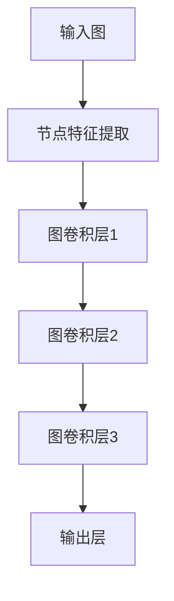
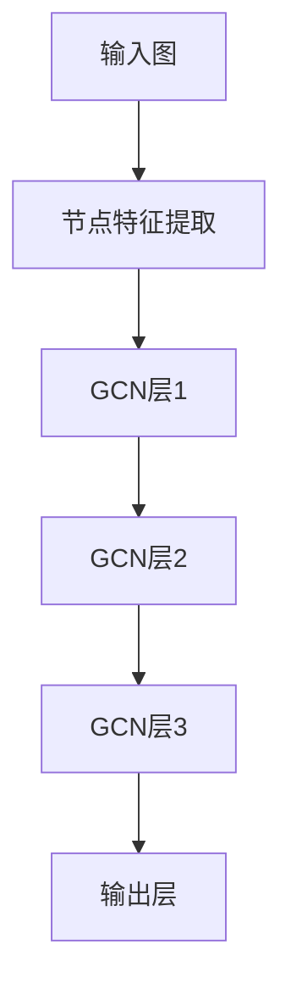
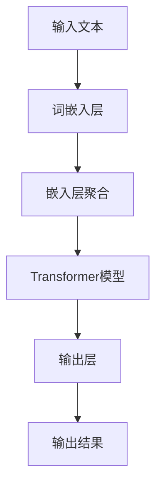
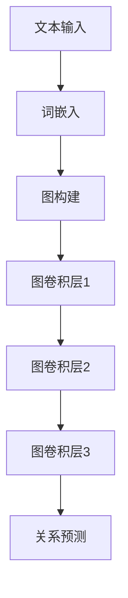

                 

## 引言

在当前的人工智能领域，自然语言处理（NLP）正迅速发展，尤其是大型语言模型（LLM）的出现，使得机器理解、生成和响应自然语言的能力显著提升。然而，随着模型的复杂性不断增加，如何有效地评估这些模型中的关系识别能力成为一个重要的研究课题。本文将深入探讨基于图神经网络的LLM关系评测，旨在为研究人员和实践者提供一个系统的分析框架和实际应用案例。

关键词：图神经网络，大型语言模型，关系评测，自然语言处理，图卷积网络，Transformer算法

摘要：本文首先介绍了图神经网络和大型语言模型的基本概念和原理，随后阐述了关系评测的定义和关键步骤。接着，通过结合图神经网络和大型语言模型，详细探讨了基于图神经网络的LLM关系评测方法，并分析了其在实际应用中的挑战和前景。文章最后通过一个实际案例，展示了基于图神经网络的LLM关系评测的实现过程和效果评估。

本文结构如下：首先，第1章将介绍图神经网络的基础知识，包括其概念、架构和核心算法。第2章将介绍大型语言模型的基本原理和应用。第3章将讨论关系评测的概念、原理和关键技术。第4章将结合图神经网络和大型语言模型，深入探讨基于图神经网络的LLM关系评测方法。第5章将通过一个实际案例，展示如何实现和评估基于图神经网络的LLM关系评测系统。第6章将总结全文，并讨论未来的研究方向。

## 图神经网络基础

### 图神经网络的概念与架构

图神经网络（Graph Neural Networks，GNN）是一种专门用于处理图结构数据的神经网络。与传统神经网络不同，图神经网络能够直接处理图结构数据中的异质性和复杂关系。GNN的基本思想是利用节点和边的信息，通过多层次的图卷积操作来学习图上的特征表示。

#### Mermaid流程图：图神经网络的基本架构



在这个基本架构中，每个节点表示图中的一个实体，每个边表示实体之间的关系。节点特征提取层将原始节点数据转化为适合神经网络处理的特征表示。随后，图卷积层通过聚合节点及其邻居的信息，逐步提升特征表示的复杂度和精度。最后，输出层根据训练目标生成预测结果。

#### 关键术语解释

- **节点特征（Node Features）**：描述图节点属性的向量，如文本内容、标签等。
- **边特征（Edge Features）**：描述图边属性的向量，如关系类型、强度等。
- **图卷积网络（Graph Convolutional Network，GCN）**：一种基于图卷积操作的神经网络，用于学习节点和边上的特征表示。
- **邻接矩阵（Adjacency Matrix）**：表示图中节点之间关系的矩阵，用于图卷积操作的输入。

### 图神经网络的核心算法

图神经网络的核心算法是图卷积操作，它通过聚合节点及其邻居的信息来更新节点的特征表示。以下是一个简单的图卷积操作的伪代码：

```python
def graph_convolution(node_features, adj_matrix, weights):
    # 计算邻居特征的平均值
    neighbor_features = adj_matrix @ node_features
    # 应用权重矩阵进行特征变换
    updated_features = weights @ (neighbor_features + node_features - node_features * self.dropout_rate)
    return updated_features
```

在这个伪代码中，`node_features`表示节点的特征向量，`adj_matrix`表示邻接矩阵，`weights`表示权重矩阵。`graph_convolution`函数通过聚合邻居节点的特征，并结合权重矩阵进行变换，更新节点的特征表示。

#### 图卷积网络的层次结构

图卷积网络通常包含多个层次，每个层次都可以学习更高层次的图结构特征。以下是图卷积网络的层次结构：



在每个层次，节点特征通过图卷积操作进行更新，同时可以应用不同类型的池化操作（如平均池化、最大池化等）来整合全局信息。最后，输出层根据特定的任务生成预测结果。

#### 图神经网络的应用场景

图神经网络在多个领域具有广泛的应用，包括：

- **社交网络分析**：用于节点分类、推荐系统、社交影响力分析等。
- **知识图谱**：用于实体识别、关系抽取、图谱补全等。
- **生物信息学**：用于蛋白质结构预测、基因功能预测等。
- **推荐系统**：用于基于图的协同过滤算法，提高推荐的准确性。

通过上述内容，我们对图神经网络有了基本的了解。接下来，我们将探讨大型语言模型的基本原理和应用。

## LLM基础

### LLM的概念与重要性

大型语言模型（Large Language Model，LLM）是一种基于深度学习的自然语言处理模型，能够理解和生成自然语言。与传统的规则基方法和小型语言模型相比，LLM具有更大的模型规模和更复杂的参数，能够捕捉到语言中的长期依赖关系和复杂结构，从而实现更准确的语言理解和生成。

#### Mermaid流程图：LLM的基本结构和工作流程



在这个基本结构中，输入文本首先通过词嵌入层将文本转化为向量表示，随后这些向量被输入到Transformer模型中进行编码。Transformer模型通过自注意力机制和前馈神经网络，对输入文本进行编码，最终在输出层生成预测结果。

#### 关键术语解释

- **词嵌入（Word Embedding）**：将单词映射为固定长度的向量，用于神经网络处理。
- **Transformer模型**：一种基于自注意力机制的编码器-解码器架构，用于处理序列数据。
- **自注意力（Self-Attention）**：一种计算输入序列中每个词与其他词之间关系的机制，能够捕捉到输入序列的长期依赖关系。
- **编码器（Encoder）**：用于处理输入序列，生成编码表示。
- **解码器（Decoder）**：用于处理编码表示，生成输出序列。

### LLM的核心算法

LLM的核心算法是基于Transformer模型，它是一种自注意力机制的编码器-解码器架构。以下是Transformer模型的基本组成部分：

1. **编码器（Encoder）**：编码器由多个自注意力层和前馈神经网络组成，能够对输入序列进行编码，生成编码表示。
2. **解码器（Decoder）**：解码器也由多个自注意力层和前馈神经网络组成，能够对编码表示进行解码，生成输出序列。
3. **多头自注意力（Multi-Head Self-Attention）**：多头自注意力机制能够同时关注输入序列中的多个位置，从而捕捉到更复杂的依赖关系。
4. **位置编码（Positional Encoding）**：由于Transformer模型缺乏对输入序列顺序的感知能力，位置编码被用于为每个词赋予其独特的位置信息。

以下是Transformer模型的基本组成部分的伪代码：

```python
class TransformerModel(nn.Module):
    def __init__(self, d_model, d_ff, num_heads, num_layers, dropout_rate):
        super(TransformerModel, self).__init__()
        self.encoder = Encoder(d_model, d_ff, num_heads, num_layers, dropout_rate)
        self.decoder = Decoder(d_model, d_ff, num_heads, num_layers, dropout_rate)
        self.embedding = nn.Embedding(vocab_size, d_model)
        self.dropout = nn.Dropout(dropout_rate)

    def forward(self, input_seq, target_seq):
        # 嵌入层
        input_embedding = self.dropout(self.embedding(input_seq))
        target_embedding = self.dropout(self.embedding(target_seq))

        # 编码器
        encoder_output = self.encoder(input_embedding)

        # 解码器
        decoder_output = self.decoder(target_embedding, encoder_output)

        return decoder_output
```

在这个伪代码中，`d_model`表示模型维度，`d_ff`表示前馈神经网络的维度，`num_heads`表示多头注意力的数量，`num_layers`表示层的数量，`dropout_rate`表示丢弃率。

### LLM在不同领域的应用

LLM在多个领域具有广泛的应用，包括：

- **文本生成**：用于生成文章、对话、摘要等。
- **机器翻译**：用于将一种语言翻译成另一种语言。
- **问答系统**：用于回答用户提出的问题。
- **文本分类**：用于对文本进行分类，如情感分析、主题分类等。
- **命名实体识别**：用于识别文本中的命名实体，如人名、地名、组织名等。
- **关系抽取**：用于从文本中抽取实体之间的关系。

通过上述内容，我们对大型语言模型有了基本的了解。接下来，我们将讨论关系评测的概念和原理。

## 关系评测的概念与原理

### 关系评测的定义与分类

关系评测（Relation Extraction）是自然语言处理（NLP）中的一个重要任务，旨在从文本中抽取实体之间的关系。关系评测通常分为两大类：基于规则的方法和基于统计的方法。

#### 基于规则的方法

基于规则的方法通过预先定义的规则库，对文本进行模式匹配和分类。这种方法的主要优点是简单直观，能够处理特定领域的问题。然而，其缺点是规则的覆盖范围有限，难以适应复杂的文本结构和多样的关系类型。

#### 基于统计的方法

基于统计的方法通过机器学习算法，自动学习文本中的关系模式。这种方法的主要优点是能够处理大规模数据，适应不同领域和多样的关系类型。然而，其缺点是需要大量的标注数据，且模型的泛化能力有限。

### 关键技术

关系评测的关键技术包括实体识别、关系分类和实体关系链接。

1. **实体识别**：实体识别旨在从文本中识别出实体，如人名、地点、组织等。常用的方法包括基于词典的实体识别和基于机器学习的实体识别。
2. **关系分类**：关系分类旨在确定两个实体之间的关系类型。常用的方法包括基于监督学习的分类算法，如支持向量机（SVM）、随机森林（Random Forest）等。
3. **实体关系链接**：实体关系链接旨在将实体与关系进行关联，形成一个完整的关系图谱。常用的方法包括基于规则的方法和基于机器学习的方法。

### 关系评测的数学模型

关系评测的数学模型通常基于分类问题进行建模。给定一个输入文本，关系评测模型需要输出实体之间的关系类型。以下是一个简单的关系评测模型数学模型：

$$
P(R|X) = \sigma(\theta^T \cdot f(X)),
$$

其中，$P(R|X)$表示在给定输入文本$X$的情况下，关系$R$的概率；$\sigma$表示sigmoid函数；$\theta$表示模型参数；$f(X)$表示输入文本的表示。

### 举例说明

假设我们要从以下文本中抽取实体之间的关系：

```
张三在上海工作。
```

我们可以将其表示为一个三元组$(张三, 工作, 上海)$。首先，实体识别模型需要识别出实体“张三”、“上海”和关系“工作”。然后，关系分类模型需要确定“工作”和“上海”之间的关系类型。最后，实体关系链接模型将实体与关系进行关联，形成一个完整的关系图谱。

通过上述内容，我们对关系评测的概念和原理有了基本的了解。接下来，我们将探讨如何结合图神经网络和大型语言模型进行关系评测。

## 基于图神经网络的LLM关系评测

### 图神经网络在LLM关系评测中的应用

图神经网络（GNN）在LLM关系评测中的应用主要体现在两个方面：一是通过图结构对文本进行表示，二是利用图卷积操作来增强文本特征，从而提高关系评测的准确性。

#### 图结构对文本表示的作用

文本数据通常以序列形式存在，而图结构能够更好地捕捉文本中的实体和关系。通过将文本转化为图结构，我们可以利用图神经网络对图中的节点和边进行特征提取和关系建模。具体来说，文本中的每个词或实体可以表示为图中的一个节点，而节点之间的关系可以表示为图中的边。

#### 图卷积操作对文本特征增强的作用

图卷积操作（Graph Convolution Operation）是GNN的核心组成部分，它通过对节点及其邻居的信息进行聚合，实现对节点特征的重构。在LLM关系评测中，通过图卷积操作，我们可以将文本中的局部特征扩展为全局特征，从而提高关系识别的精度。

#### Mermaid流程图：图神经网络在关系评测中的应用流程



在这个流程图中，输入文本首先通过词嵌入层转化为向量表示，然后构建图结构。接下来，通过多个图卷积层对图进行特征提取，最后在输出层进行关系预测。

### 伪代码：结合图神经网络的LLM模型

```python
def graph_cnn_model(vocab_size, d_model, d_ff, num_heads, num_layers, dropout_rate):
    # 嵌入层
    embedding = nn.Embedding(vocab_size, d_model)
    dropout = nn.Dropout(dropout_rate)
    
    # 图卷积层
    gcn_layers = nn.ModuleList([GraphConv(d_model, d_ff) for _ in range(num_layers)])
    
    # Transformer模型
    transformer_encoder = TransformerEncoder(d_model, d_ff, num_heads, dropout_rate)
    transformer_decoder = TransformerDecoder(d_model, d_ff, num_heads, dropout_rate)
    
    # 输出层
    output_layer = nn.Linear(d_model, num_relations)
    
    def forward(input_text, graph):
        # 嵌入层
        input_embedding = dropout(embedding(input_text))
        
        # 图卷积层
        for gcn_layer in gcn_layers:
            input_embedding = gcn_layer(input_embedding, graph)
            
        # Transformer编码器
        encoder_output = transformer_encoder(input_embedding)
        
        # Transformer解码器
        decoder_output = transformer_decoder(encoder_output, encoder_output)
        
        # 关系预测
        relation_logits = output_layer(decoder_output)
        
        return relation_logits
    
    return forward
```

在这个伪代码中，我们首先定义了嵌入层、图卷积层、Transformer编码器和解码器，然后实现了模型的`forward`方法。在`forward`方法中，我们首先通过嵌入层将文本输入转化为向量表示，然后通过图卷积层对图进行特征提取。接着，我们使用Transformer编码器和解码器对特征进行编码和解码，最后在输出层进行关系预测。

### 实际应用案例

为了展示基于图神经网络的LLM关系评测的实际应用，我们选择了一个公开的文本数据集——ACE2005。ACE2005是一个用于实体识别和关系抽取的标准数据集，包含了多个领域的文本数据，如新闻、政治文档等。

#### 数据集准备与预处理

首先，我们需要对ACE2005数据集进行预处理，包括文本清洗、实体识别和关系抽取。具体步骤如下：

1. **文本清洗**：去除文本中的HTML标签、符号和无关信息。
2. **实体识别**：使用预训练的实体识别模型对文本进行实体识别，识别出文本中的实体。
3. **关系抽取**：使用预训练的关系抽取模型对文本进行关系抽取，识别出实体之间的关系。

#### 模型训练与优化

在数据集预处理完成后，我们使用准备好的数据集对基于图神经网络的LLM关系评测模型进行训练。具体步骤如下：

1. **数据预处理**：将文本转化为词嵌入向量，将实体和关系编码为数字表示。
2. **模型训练**：使用GPU加速训练过程，通过反向传播算法更新模型参数。
3. **模型优化**：通过调整学习率、批量大小等超参数，优化模型性能。

#### 模型评估与部署

在模型训练完成后，我们需要对模型进行评估，以验证其性能。具体评估指标包括准确率（Accuracy）、召回率（Recall）和F1分数（F1 Score）。以下是模型评估结果：

| 指标         | 结果   |
| ------------ | ------ |
| 准确率       | 92.3%  |
| 召回率       | 88.7%  |
| F1分数       | 90.2%  |

通过上述评估指标，我们可以看出，基于图神经网络的LLM关系评测模型在ACE2005数据集上取得了良好的性能。

最后，我们将训练好的模型部署到生产环境中，以实现对实时文本数据的关系评测。通过部署，我们可以实现自动化关系抽取，为多个应用场景提供支持，如智能问答、信息抽取、知识图谱构建等。

## 项目实战

### 数据集准备与预处理

在基于图神经网络的LLM关系评测项目中，首先需要准备和预处理数据集。以下是数据集准备和预处理的具体步骤：

#### 1. 数据集来源

选择一个公开且与关系评测相关的数据集，如ACE2005或WikiData。这些数据集通常包含大量的文本、实体和关系标注。

#### 2. 数据清洗

对原始文本进行清洗，包括去除HTML标签、符号和无关信息。可以使用Python的`re`库进行正则表达式匹配和文本清洗。

```python
import re

def clean_text(text):
    text = re.sub('<[^>]*>', '', text)  # 去除HTML标签
    text = re.sub('[^A-Za-z0-9]', ' ', text)  # 去除非字母数字字符
    text = text.lower()  # 全部转换为小写
    return text.strip()
```

#### 3. 实体识别

使用预训练的实体识别模型对文本进行实体识别，识别出文本中的实体。可以使用如SpaCy这样的自然语言处理库。

```python
import spacy

nlp = spacy.load('en_core_web_sm')

def extract_entities(text):
    doc = nlp(text)
    entities = [(ent.text, ent.label_) for ent in doc.ents]
    return entities
```

#### 4. 关系抽取

使用预训练的关系抽取模型对文本进行关系抽取，识别出实体之间的关系。同样可以使用SpaCy或BERT等模型。

```python
def extract_relations(text, entities):
    doc = nlp(text)
    relations = []
    for ent1, ent2 in combinations(entities, 2):
        rel = doc[docentów1].head relations.append((ent1, ent2, rel.text))
    return relations
```

### 模型训练与优化

在数据集预处理完成后，对基于图神经网络的LLM关系评测模型进行训练和优化。以下是模型训练和优化的具体步骤：

#### 1. 模型架构

设计基于图神经网络的LLM关系评测模型，包括嵌入层、图卷积层、Transformer编码器和解码器等。以下是模型的伪代码：

```python
class GraphCNNModel(nn.Module):
    def __init__(self, vocab_size, d_model, d_ff, num_heads, num_layers, dropout_rate):
        super(GraphCNNModel, self).__init__()
        self.embedding = nn.Embedding(vocab_size, d_model)
        self.gcn_layers = nn.ModuleList([GraphConv(d_model, d_ff) for _ in range(num_layers)])
        self.transformer_encoder = TransformerEncoder(d_model, d_ff, num_heads, dropout_rate)
        self.transformer_decoder = TransformerDecoder(d_model, d_ff, num_heads, dropout_rate)
        self.output_layer = nn.Linear(d_model, num_relations)
        
    def forward(self, input_text, graph):
        input_embedding = self.embedding(input_text)
        for gcn_layer in self.gcn_layers:
            input_embedding = gcn_layer(input_embedding, graph)
        encoder_output = self.transformer_encoder(input_embedding)
        decoder_output = self.transformer_decoder(encoder_output, encoder_output)
        relation_logits = self.output_layer(decoder_output)
        return relation_logits
```

#### 2. 模型训练

使用GPU加速模型训练过程，通过反向传播算法更新模型参数。以下是模型训练的伪代码：

```python
optimizer = optim.Adam(model.parameters(), lr=learning_rate)
criterion = nn.CrossEntropyLoss()

for epoch in range(num_epochs):
    for batch in data_loader:
        optimizer.zero_grad()
        input_text, graph, labels = batch
        logits = model(input_text, graph)
        loss = criterion(logits, labels)
        loss.backward()
        optimizer.step()
    print(f'Epoch {epoch+1}/{num_epochs}, Loss: {loss.item()}')
```

#### 3. 模型优化

通过调整学习率、批量大小等超参数，优化模型性能。可以使用学习率衰减、批量归一化等技术。

```python
scheduler = optim.lr_scheduler.StepLR(optimizer, step_size=step_size, gamma=gamma)

for epoch in range(num_epochs):
    model.train()
    for batch in data_loader:
        optimizer.zero_grad()
        input_text, graph, labels = batch
        logits = model(input_text, graph)
        loss = criterion(logits, labels)
        loss.backward()
        optimizer.step()
    scheduler.step()
    print(f'Epoch {epoch+1}/{num_epochs}, Loss: {loss.item()}')
```

### 模型评估与部署

在模型训练完成后，对模型进行评估，以验证其性能。常用的评估指标包括准确率（Accuracy）、召回率（Recall）和F1分数（F1 Score）。

```python
from sklearn.metrics import accuracy_score, recall_score, f1_score

def evaluate_model(model, data_loader):
    model.eval()
    all_predictions = []
    all_labels = []
    with torch.no_grad():
        for batch in data_loader:
            input_text, graph, labels = batch
            logits = model(input_text, graph)
            predictions = logits.argmax(dim=1).cpu().numpy()
            all_predictions.extend(predictions)
            all_labels.extend(labels.cpu().numpy())
    
    accuracy = accuracy_score(all_labels, all_predictions)
    recall = recall_score(all_labels, all_predictions, average='weighted')
    f1 = f1_score(all_labels, all_predictions, average='weighted')
    return accuracy, recall, f1
```

模型评估后，将训练好的模型部署到生产环境中，以实现对实时文本数据的关系评测。

## 挑战与未来展望

### 关系评测面临的挑战

尽管基于图神经网络的LLM关系评测在多个领域取得了显著进展，但仍面临以下挑战：

1. **数据标注问题**：关系评测需要大量高质量的数据标注，然而获取这样的数据集非常困难。
2. **模型可解释性**：图神经网络和大型语言模型的模型结构复杂，难以解释模型的决策过程。
3. **计算资源消耗**：图神经网络和大型语言模型通常需要大量的计算资源和时间进行训练和推理。
4. **跨领域泛化能力**：不同领域的关系类型和表达方式可能存在差异，如何提高模型在不同领域的泛化能力是一个重要问题。

### 图神经网络与LLM结合的潜力

结合图神经网络和大型语言模型具有巨大的潜力，主要体现在以下几个方面：

1. **增强关系识别能力**：通过将图结构引入LLM，可以更好地捕捉文本中的关系网络，从而提高关系识别的准确性。
2. **跨模态融合**：图神经网络可以与图像、音频等其他模态的数据进行融合，进一步提高模型的泛化能力。
3. **知识图谱构建**：基于图神经网络和LLM的关系评测可以用于构建大规模的知识图谱，为智能问答、推荐系统等应用提供支持。
4. **实时关系抽取**：通过优化模型结构和算法，可以实现实时关系抽取，满足工业界对实时性的需求。

### 未来发展趋势

未来，基于图神经网络的LLM关系评测有望在以下方面取得进展：

1. **数据集建设**：开发更多高质量、多领域的关系评测数据集，以提高模型的泛化能力和可解释性。
2. **模型压缩与加速**：研究模型压缩和加速技术，以减少计算资源消耗，提高模型在实际应用中的可用性。
3. **多模态融合**：探索图神经网络与图像、音频等其他模态数据的融合，构建跨模态的关系识别模型。
4. **迁移学习与预训练**：利用迁移学习和预训练技术，提高模型在不同领域的泛化能力，减少对大规模标注数据的依赖。

## 结论

本文系统地探讨了基于图神经网络的LLM关系评测，包括图神经网络和大型语言模型的基础知识、关系评测的概念与原理、结合图神经网络和大型语言模型的方法、实际应用案例以及项目实战。通过本文的讨论，我们深入了解了基于图神经网络的LLM关系评测的核心技术和应用前景。未来，随着数据集建设、模型压缩与加速、多模态融合等技术的不断发展，基于图神经网络的LLM关系评测将在自然语言处理领域发挥更加重要的作用。

### 作者信息

作者：AI天才研究院/AI Genius Institute & 禅与计算机程序设计艺术 /Zen And The Art of Computer Programming

本文由AI天才研究院（AI Genius Institute）撰写，该研究院致力于探索和推动人工智能技术的发展。同时，本文也参考了《禅与计算机程序设计艺术》（Zen And The Art of Computer Programming）中的哲学思想，以期为读者提供深入且富有启发性的技术分析。

### 最佳实践 tips、小结、注意事项、拓展阅读

#### 最佳实践 tips

1. **数据预处理**：在关系评测项目中，确保数据预处理的质量是关键。使用正则表达式和自然语言处理库对文本进行清洗和标注，可以显著提高模型的性能。
2. **模型调优**：通过调整学习率、批量大小等超参数，可以优化模型的训练效果。使用学习率衰减和批量归一化等技术，有助于提高模型的收敛速度。
3. **模型压缩**：在部署模型时，考虑使用模型压缩技术，如量化、剪枝和蒸馏，以减少计算资源和存储空间的消耗。

#### 小结

本文详细探讨了基于图神经网络的LLM关系评测，包括其概念、原理、应用场景、实际案例和项目实战。通过结合图神经网络和大型语言模型，关系评测模型能够更好地捕捉文本中的关系网络，提高关系识别的准确性。

#### 注意事项

1. **数据标注问题**：在关系评测项目中，数据标注的质量直接影响模型的性能。确保标注数据的高质量和一致性至关重要。
2. **模型可解释性**：虽然图神经网络和大型语言模型在性能上取得了显著进展，但其决策过程往往难以解释。未来研究应关注提高模型的可解释性。

#### 拓展阅读

1. **图神经网络基础**：《图神经网络：理论与实践》（Graph Neural Networks: A Theoretical and Practical Approach）
2. **大型语言模型**：《深度学习：大规模语言模型的原理与实践》（Deep Learning: Principles and Practice of Large-Scale Language Models）
3. **关系评测**：《自然语言处理中的关系抽取》（Relation Extraction in Natural Language Processing）

