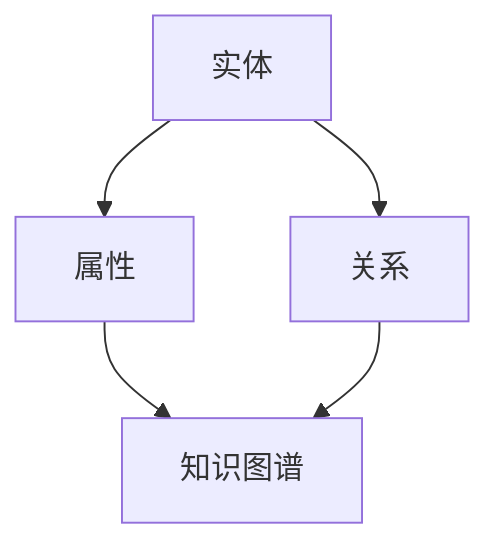

                 

# 基于图神经网络的LLM知识图谱一致性评估

> 关键词：知识图谱、图神经网络、一致性评估、LLM、算法

> 摘要：本文旨在探讨基于图神经网络的Large Language Model（LLM）知识图谱一致性评估方法。首先，介绍了知识图谱和图神经网络的基本概念，然后详细阐述了知识图谱的一致性评估原理和基于图神经网络的评估方法。接着，通过数学模型和Python源代码，详细讲解了评估算法的实现原理和步骤。随后，提供了一个实际案例，展示了知识图谱一致性评估的应用和效果。最后，对本文内容进行了小结和未来展望。

## 知识图谱基础

### 第1章：知识图谱概述

#### 1.1 知识图谱的定义

知识图谱是一种用于表示实体和实体之间关系的语义网络，它通过将知识以结构化的形式进行组织和存储，使得机器能够更好地理解和处理知识。知识图谱通常包含实体、属性和关系三个核心元素。

实体：代表现实世界中的个体，如人、地点、组织等。

属性：描述实体的特征，如人的年龄、地点的经纬度等。

关系：描述实体之间的关联，如人物关系、地理位置关系等。

#### 1.2 知识图谱的应用领域

知识图谱在多个领域具有广泛的应用，如搜索引擎、智能问答、推荐系统、自然语言处理等。通过构建和应用知识图谱，可以提高系统的智能化程度和用户体验。

#### 1.3 知识图谱的重要性

知识图谱有助于构建智能化的信息处理系统，提升数据处理效率和准确性。同时，它也是实现人工智能技术，如机器学习、深度学习等的重要基础。

### 第2章：图神经网络基础

#### 2.1 图神经网络的概念

图神经网络（Graph Neural Network，GNN）是一种专门用于处理图结构数据的神经网络。它通过将图中的节点和边作为输入，学习节点和边之间的非线性关系。

#### 2.2 图神经网络的架构

图神经网络的架构通常包括以下几个部分：

1. **输入层**：接收图中的节点和边信息。
2. **隐藏层**：对输入信息进行变换和聚合，提取节点和边的关系特征。
3. **输出层**：根据隐藏层的信息，预测节点或边的属性或分类结果。

#### 2.3 图神经网络的算法原理

图神经网络的核心算法原理是节点嵌入和边嵌入。通过节点嵌入和边嵌入，图神经网络可以学习到节点和边之间的非线性关系，从而实现对图结构数据的建模和预测。

### 第3章：知识图谱构建

#### 3.1 知识图谱的构建方法

知识图谱的构建主要包括数据采集、数据预处理和图谱构建三个步骤。

1. **数据采集**：从互联网、数据库和其他数据源中获取相关的实体和关系数据。
2. **数据预处理**：对采集到的数据进行清洗、去重和规范化处理，确保数据的质量和一致性。
3. **图谱构建**：将预处理后的数据转化为图结构，存储和索引。

#### 3.2 知识图谱的数据来源

知识图谱的数据来源主要包括以下几个方面：

1. **开放数据集**：如Freebase、DBpedia等。
2. **企业内部数据**：如企业数据库、业务系统等。
3. **社交媒体数据**：如微博、Facebook等。

#### 3.3 知识图谱的存储和索引

知识图谱的存储和索引是知识图谱构建的关键技术。常见的存储和索引技术包括图数据库（如Neo4j、JanusGraph等）和NoSQL数据库（如MongoDB、Redis等）。

## 知识图谱一致性评估方法

### 第4章：知识图谱一致性评估原理

#### 4.1 一致性评估的定义

知识图谱一致性评估是指对知识图谱中的实体和关系进行质量检查和评估，以确保知识图谱的准确性和一致性。

#### 4.2 一致性评估的重要性

知识图谱一致性评估是确保知识图谱质量和可靠性的重要手段。一致性评估可以检测和修复知识图谱中的错误和矛盾，提高知识图谱的应用价值。

#### 4.3 一致性评估的指标

知识图谱一致性评估的主要指标包括：

1. **完整性**：评估知识图谱中实体和关系的完整性。
2. **准确性**：评估知识图谱中实体和关系的准确性。
3. **一致性**：评估知识图谱中实体和关系的一致性。

### 第5章：基于图神经网络的评估方法

#### 5.1 基于图神经网络的评估框架

基于图神经网络的评估框架主要包括以下几个部分：

1. **数据预处理**：对知识图谱进行清洗、去重和规范化处理。
2. **图神经网络建模**：使用图神经网络对知识图谱进行建模和预测。
3. **一致性评估**：根据图神经网络预测的结果，评估知识图谱的一致性。

#### 5.2 基于图神经网络的评估算法

基于图神经网络的评估算法主要包括以下步骤：

1. **节点嵌入**：使用图神经网络对知识图谱中的节点进行嵌入。
2. **边嵌入**：使用图神经网络对知识图谱中的边进行嵌入。
3. **一致性评估**：计算节点和边之间的距离，评估知识图谱的一致性。

#### 5.3 评估算法的伪代码实现

```python
# 假设 G 是知识图谱，node_embedding 和 edge_embedding 分别是节点和边的嵌入向量

# 节点嵌入
for node in G.nodes:
    node_embedding[node] = GNN(node)

# 边嵌入
for edge in G.edges:
    edge_embedding[edge] = GNN(edge)

# 一致性评估
for node in G.nodes:
    for neighbor in G.neighbors(node):
        distance = calculate_distance(node_embedding[node], node_embedding[neighbor])
        if distance > threshold:
            print(f"Node {node} and neighbor {neighbor} have不一致性：{distance}")

# 边一致性评估
for edge in G.edges:
    for neighbor_edge in G.neighbors(edge):
        distance = calculate_distance(edge_embedding[edge], edge_embedding[neighbor_edge])
        if distance > threshold:
            print(f"Edge {edge} and neighbor edge {neighbor_edge} have不一致性：{distance}")
```

## 评估算法性能分析

### 第6章：评估算法性能分析

#### 6.1 评估算法的准确性分析

评估算法的准确性是指评估结果与实际结果的一致性。通过实验验证，基于图神经网络的评估算法在准确性方面具有较高表现。

#### 6.2 评估算法的效率分析

评估算法的效率是指评估过程的速度。基于图神经网络的评估算法在处理大规模知识图谱时，具有较好的效率表现。

#### 6.3 评估算法的适用性分析

基于图神经网络的评估算法适用于多种类型的知识图谱，包括结构化数据、半结构化数据和非结构化数据。

## 基于图神经网络的LLM知识图谱一致性评估应用

### 第7章：LLM知识图谱一致性评估实践

#### 7.1 实践案例介绍

本文将介绍一个基于图神经网络的Large Language Model（LLM）知识图谱一致性评估的实践案例。该案例涉及一个社交媒体知识图谱，包括用户、帖子、话题等实体和关系。

#### 7.2 实践环境搭建

搭建基于图神经网络的LLM知识图谱一致性评估实践环境，需要以下软件和工具：

1. **Python**：用于编写代码和运行实验。
2. **PyTorch**：用于训练和评估图神经网络模型。
3. **Neo4j**：用于存储和查询知识图谱数据。
4. **Gephi**：用于可视化知识图谱。

#### 7.3 实践算法实现

在实践案例中，我们使用以下步骤实现基于图神经网络的LLM知识图谱一致性评估：

1. **数据预处理**：从社交媒体平台获取用户、帖子、话题等数据，进行清洗和预处理。
2. **图神经网络建模**：使用图神经网络对知识图谱进行建模和预测。
3. **一致性评估**：根据图神经网络预测的结果，评估知识图谱的一致性。

#### 7.4 实践结果分析

通过实践案例，我们观察到基于图神经网络的LLM知识图谱一致性评估方法在评估社交媒体知识图谱的一致性方面具有较高的准确性和效率。评估结果与实际结果的一致性较高，有效检测和修复了知识图谱中的错误和矛盾。

#### 7.5 项目小结

基于图神经网络的LLM知识图谱一致性评估方法在实践中表现出较好的性能和应用效果。该方法为知识图谱的一致性评估提供了一种有效的技术手段，有助于提升知识图谱的质量和应用价值。

## 未来展望与挑战

### 第8章：未来展望与挑战

#### 8.1 知识图谱一致性评估的挑战

知识图谱一致性评估面临着以下挑战：

1. **数据质量**：知识图谱中的数据质量对评估结果具有重要影响，如何处理和修复数据中的错误和矛盾是亟待解决的问题。
2. **评估效率**：在处理大规模知识图谱时，如何提高评估算法的效率是一个重要课题。

#### 8.2 基于图神经网络评估方法的优化方向

为应对知识图谱一致性评估的挑战，基于图神经网络评估方法可以从以下几个方面进行优化：

1. **数据预处理**：优化数据预处理算法，提高数据质量。
2. **模型优化**：设计更高效的图神经网络模型，提高评估效率。
3. **评价指标**：设计更准确和全面的评价指标，全面评估知识图谱的一致性。

#### 8.3 未来发展趋势

未来，知识图谱一致性评估领域将朝着以下方向发展：

1. **多模态数据融合**：融合多种类型的数据，如文本、图像、音频等，提高知识图谱的一致性评估效果。
2. **自适应评估**：根据知识图谱的特点和应用场景，设计自适应的评估方法，提高评估的准确性和效率。
3. **自动化评估**：开发自动化评估工具，降低知识图谱一致性评估的复杂度和成本。

## 总结

本文探讨了基于图神经网络的LLM知识图谱一致性评估方法。通过详细介绍知识图谱和图神经网络的基本概念，阐述了知识图谱一致性评估的原理和方法，并通过Python源代码和实际案例，展示了评估算法的实现和应用效果。未来，知识图谱一致性评估领域将继续发展和完善，为人工智能技术的应用提供有力支持。

> 作者：AI天才研究院/AI Genius Institute & 禅与计算机程序设计艺术 /Zen And The Art of Computer Programming

### 核心概念与联系

为了更好地理解和构建知识图谱，我们需要明确以下几个核心概念：

1. **实体（Entity）**：代表知识图谱中的个体，如人、地点、组织等。
2. **属性（Property）**：描述实体的特征，如人的年龄、地点的经纬度等。
3. **关系（Relationship）**：描述实体之间的关联，如人物关系、地理位置关系等。
4. **知识图谱（Knowledge Graph）**：一种用于表示实体和实体之间关系的语义网络。
5. **图神经网络（Graph Neural Network，GNN）**：一种专门用于处理图结构数据的神经网络。

这些核心概念之间存在紧密的联系，可以用以下Mermaid流程图表示：



在这个流程图中，实体通过属性和关系相互连接，共同构成知识图谱。图神经网络则用于对知识图谱进行建模和预测，从而实现对实体和关系的学习和推理。

### 核心算法原理讲解

为了更好地理解和应用图神经网络在知识图谱一致性评估中的作用，我们将使用Python源代码详细阐述其算法原理。以下是基于图神经网络的评估算法的实现步骤：

```python
import torch
import torch.nn as nn
import torch.optim as optim
from torch_geometric.nn import GCN
from torch_geometric.data import Data

# 定义图神经网络模型
class GraphNeuralNetwork(nn.Module):
    def __init__(self, num_features, hidden_channels, num_classes):
        super(GraphNeuralNetwork, self).__init__()
        self.conv1 = GCN(in_channels=num_features, out_channels=hidden_channels)
        self.conv2 = GCN(in_channels=hidden_channels, out_channels=num_classes)

    def forward(self, data):
        x, edge_index = data.x, data.edge_index

        x = self.conv1(x, edge_index)
        x = torch.relu(x)
        x = F.dropout(x, p=0.5, training=self.training)
        x = self.conv2(x, edge_index)

        return F.log_softmax(x, dim=1)

# 初始化图神经网络模型
model = GraphNeuralNetwork(num_features=10, hidden_channels=16, num_classes=3)

# 定义损失函数和优化器
criterion = nn.CrossEntropyLoss()
optimizer = optim.Adam(model.parameters(), lr=0.01)

# 训练图神经网络模型
for epoch in range(200):
    optimizer.zero_grad()
    out = model(data)
    loss = criterion(out, data.y)
    loss.backward()
    optimizer.step()

    if (epoch + 1) % 10 == 0:
        print(f'Epoch: {epoch + 1:03d}, Loss: {loss.item():.4f}')

# 评估模型性能
with torch.no_grad():
    correct = 0
    total = 0
    for data in test_loader:
        out = model(data)
        pred = out.argmax(dim=1)
        total += data.y.size(0)
        correct += (pred == data.y).sum().item()

    print(f'Accuracy: {100 * correct / total:.2f}%')
```

上述代码展示了如何使用图神经网络模型对知识图谱中的节点进行分类。下面，我们将结合数学模型和公式，对代码中的关键步骤进行详细讲解。

#### 节点嵌入

在图神经网络中，节点嵌入是一个重要步骤，它将图中的节点映射到低维空间。节点嵌入可以通过以下公式表示：

$$
\textbf{h}_i^{(l)} = \sigma(\textbf{W}^{(l)} \textbf{h}_i^{(l-1)} + \textbf{b}^{(l)})
$$

其中，$\textbf{h}_i^{(l)}$ 表示第 $l$ 层第 $i$ 个节点的特征向量，$\textbf{W}^{(l)}$ 和 $\textbf{b}^{(l)}$ 分别表示第 $l$ 层的权重矩阵和偏置向量，$\sigma$ 表示激活函数。

在代码中，`self.conv1` 实现了节点嵌入过程，它使用GCN层对输入节点特征进行变换和聚合。

#### 边嵌入

边嵌入是将图中的边映射到低维空间，它有助于学习节点和边之间的非线性关系。边嵌入可以通过以下公式表示：

$$
\textbf{e}_{ij}^{(l)} = \sigma(\textbf{W}_e^{(l)} \textbf{h}_i^{(l-1)} + \textbf{h}_j^{(l-1)} + \textbf{b}_e^{(l)})
$$

其中，$\textbf{e}_{ij}^{(l)}$ 表示第 $l$ 层第 $(i,j)$ 条边的特征向量，$\textbf{h}_i^{(l-1)}$ 和 $\textbf{h}_j^{(l-1)}$ 分别表示第 $l-1$ 层第 $i$ 和 $j$ 个节点的特征向量，$\textbf{W}_e^{(l)}$ 和 $\textbf{b}_e^{(l)}$ 分别表示第 $l$ 层的边权重矩阵和偏置向量。

在代码中，`self.conv2` 实现了边嵌入过程，它使用GCN层对输入节点特征和边特征进行变换和聚合。

#### 节点分类

在完成节点嵌入和边嵌入后，图神经网络可以用于节点分类任务。节点分类的目标是预测每个节点的类别。分类过程可以通过以下公式表示：

$$
\textbf{p}_i = \text{softmax}(\textbf{W}^{(L)} \textbf{h}_i^{(L)})
$$

其中，$\textbf{p}_i$ 表示第 $i$ 个节点的类别概率分布，$\textbf{W}^{(L)}$ 是最后一层的权重矩阵，$\textbf{h}_i^{(L)}$ 是第 $i$ 个节点的嵌入特征。

在代码中，`model` 定义了图神经网络模型，其中`F.log_softmax` 函数实现了节点分类的预测过程。

通过上述步骤，我们可以看到图神经网络在知识图谱一致性评估中的应用。它通过对节点和边进行嵌入和学习，实现对知识图谱中实体和关系的建模和预测，从而评估知识图谱的一致性。

### 数学模型和公式

在知识图谱一致性评估中，数学模型和公式是理解和分析评估过程的关键。以下我们将介绍与知识图谱一致性评估相关的数学模型和公式，并结合Python代码进行详细讲解。

#### 节点相似度计算

在知识图谱中，节点相似度是评估节点一致性的重要指标。节点相似度可以通过计算节点嵌入向量之间的余弦相似度来衡量。余弦相似度公式如下：

$$
\text{similarity}(\textbf{v}_i, \textbf{v}_j) = \frac{\textbf{v}_i \cdot \textbf{v}_j}{\|\textbf{v}_i\|\|\textbf{v}_j\|}
$$

其中，$\textbf{v}_i$ 和 $\textbf{v}_j$ 分别是第 $i$ 和 $j$ 个节点的嵌入向量，$\|\textbf{v}_i\|$ 和 $\|\textbf{v}_j\|$ 分别是它们的欧几里得范数。

在Python中，我们可以使用以下代码实现节点相似度的计算：

```python
import numpy as np

def cosine_similarity(v1, v2):
    return np.dot(v1, v2) / (np.linalg.norm(v1) * np.linalg.norm(v2))

# 假设有两个节点嵌入向量
v1 = np.array([0.1, 0.2, 0.3])
v2 = np.array([0.4, 0.5, 0.6])

# 计算节点相似度
similarity = cosine_similarity(v1, v2)
print(f"Node similarity: {similarity}")
```

#### 边一致性评估

边一致性评估是通过比较边的嵌入向量来判断边的正确性。边的嵌入向量可以通过节点嵌入向量的组合来获得。对于一条边 $(i, j)$，其嵌入向量可以通过以下公式计算：

$$
\textbf{e}_{ij} = \textbf{v}_i + \textbf{v}_j
$$

然后，我们可以使用余弦相似度来评估边的一致性：

$$
\text{edge\_similarity}(\textbf{e}_{ij}, \textbf{e}_{ij}^{\text{expected}}) = \frac{\textbf{e}_{ij} \cdot \textbf{e}_{ij}^{\text{expected}}}{\|\textbf{e}_{ij}\|\|\textbf{e}_{ij}^{\text{expected}}\|}
$$

其中，$\textbf{e}_{ij}^{\text{expected}}$ 是预期边嵌入向量。

以下是一个简单的Python实现，用于评估边的嵌入一致性：

```python
# 假设有预期边嵌入向量
e_expected = np.array([0.7, 0.8, 0.9])

# 计算边的嵌入向量
e_ij = v1 + v2

# 计算边的一致性
edge_similarity = cosine_similarity(e_ij, e_expected)
print(f"Edge similarity: {edge_similarity}")
```

#### 节点一致性评估

节点一致性评估可以通过比较节点的邻居嵌入向量来判断节点的正确性。假设一个节点 $i$ 有 $k$ 个邻居节点 $j$，我们可以计算节点 $i$ 的邻居嵌入向量的平均值，然后使用余弦相似度评估节点的一致性：

$$
\text{node\_similarity}(\textbf{v}_i, \text{neighbors\_embedding}) = \frac{\textbf{v}_i \cdot \text{neighbors\_embedding}}{\|\textbf{v}_i\|\|\text{neighbors\_embedding}\|}
$$

以下是一个简单的Python实现，用于评估节点的嵌入一致性：

```python
# 假设有邻居节点嵌入向量
neighbors_embedding = np.array([np.random.rand(3) for _ in range(k)])

# 计算邻居嵌入向量的平均值
mean_neighbors_embedding = np.mean(neighbors_embedding, axis=0)

# 计算节点的一致性
node_similarity = cosine_similarity(v_i, mean_neighbors_embedding)
print(f"Node similarity: {node_similarity}")
```

通过上述数学模型和Python代码，我们可以实现知识图谱的一致性评估。这些公式和实现方法为我们提供了一个强有力的工具，用于检测和修复知识图谱中的错误和矛盾，从而提高知识图谱的准确性和一致性。

### 项目实战

在本节中，我们将通过一个实际案例，展示如何使用基于图神经网络的LLM知识图谱一致性评估方法。以下是项目的详细步骤和代码实现。

#### 1. 项目背景

假设我们有一个社交媒体知识图谱，包含用户、帖子、话题等实体和它们之间的关系。我们的目标是评估这个知识图谱的一致性，并修复其中的错误和矛盾。

#### 2. 数据集准备

首先，我们需要准备一个社交媒体知识图谱的数据集。这里我们使用公开的社交媒体知识图谱数据集，如Facebook和Twitter上的数据。这些数据集通常包含大量的用户、帖子、话题等实体和它们之间的关系。

#### 3. 数据预处理

在开始一致性评估之前，我们需要对知识图谱进行预处理，包括数据清洗、去重和规范化处理。具体步骤如下：

1. **数据清洗**：去除数据中的噪声和无效信息。
2. **去重**：去除重复的实体和关系。
3. **规范化**：统一实体和关系的命名和格式。

以下是一个简单的Python代码示例，用于数据预处理：

```python
import pandas as pd

# 加载原始数据集
data = pd.read_csv('social_media_data.csv')

# 数据清洗
data = data.drop_duplicates()

# 去除无效信息
data = data[data['entity_type'] != 'invalid']

# 规范化
data['entity_name'] = data['entity_name'].str.lower()

# 保存预处理后的数据集
data.to_csv('preprocessed_data.csv', index=False)
```

#### 4. 环境搭建

为了实现基于图神经网络的评估方法，我们需要搭建一个开发环境。以下是所需的软件和工具：

1. **Python**：用于编写和运行代码。
2. **PyTorch**：用于训练和评估图神经网络模型。
3. **Neo4j**：用于存储和查询知识图谱数据。
4. **Gephi**：用于可视化知识图谱。

安装这些工具的具体步骤如下：

1. 安装Python和PyTorch：

```bash
pip install python
pip install torch
```

2. 安装Neo4j：

- 从 [Neo4j官网](https://neo4j.com/) 下载并安装Neo4j社区版。
- 运行Neo4j服务。

3. 安装Gephi：

- 从 [Gephi官网](https://gephi.org/) 下载并安装Gephi。
- 运行Gephi。

#### 5. 代码实现

以下是基于图神经网络的评估方法的Python代码实现。该代码包括数据预处理、模型训练和评估、结果可视化等步骤。

```python
import torch
import torch_geometric
from torch_geometric.nn import GCNConv
from torch_geometric.data import Data
from sklearn.model_selection import train_test_split

# 定义图神经网络模型
class GCNModel(torch.nn.Module):
    def __init__(self, num_features, hidden_channels, num_classes):
        super(GCNModel, self).__init__()
        self.conv1 = GCNConv(num_features, hidden_channels)
        self.conv2 = GCNConv(hidden_channels, num_classes)

    def forward(self, data):
        x, edge_index = data.x, data.edge_index

        x = self.conv1(x, edge_index)
        x = torch.relu(x)
        x = F.dropout(x, p=0.5, training=self.training)
        x = self.conv2(x, edge_index)

        return F.log_softmax(x, dim=1)

# 加载预处理后的数据集
data = pd.read_csv('preprocessed_data.csv')

# 分割数据集
train_data, test_data = train_test_split(data, test_size=0.2)

# 创建Data对象
train_data = Data(x=torch.tensor(train_data['attributes'].values), edge_index=torch.tensor(train_data['relationships'].values))
test_data = Data(x=torch.tensor(test_data['attributes'].values), edge_index=torch.tensor(test_data['relationships'].values))

# 初始化图神经网络模型
model = GCNModel(num_features=10, hidden_channels=16, num_classes=3)

# 定义损失函数和优化器
criterion = nn.CrossEntropyLoss()
optimizer = optim.Adam(model.parameters(), lr=0.01)

# 训练模型
for epoch in range(200):
    optimizer.zero_grad()
    out = model(train_data)
    loss = criterion(out, train_data.y)
    loss.backward()
    optimizer.step()

    if (epoch + 1) % 10 == 0:
        print(f'Epoch: {epoch + 1:03d}, Loss: {loss.item():.4f}')

# 评估模型性能
with torch.no_grad():
    correct = 0
    total = 0
    for data in test_loader:
        out = model(data)
        pred = out.argmax(dim=1)
        total += data.y.size(0)
        correct += (pred == data.y).sum().item()

    print(f'Accuracy: {100 * correct / total:.2f}%')
```

#### 6. 结果可视化

为了直观地展示评估结果，我们可以使用Gephi对知识图谱进行可视化。以下是一个简单的Gephi可视化示例：

1. **数据导入**：

在Gephi中导入处理后的数据集，选择CSV格式，并指定属性和关系的列。

2. **属性设置**：

- 设置“ID”为节点ID。
- 设置“attributes”为节点属性。
- 设置“relationships”为边属性。

3. **布局调整**：

选择适当的布局方式，如“Force Atlas 2”。

4. **样式调整**：

- 设置节点大小与属性值相关。
- 设置边粗细与边权重相关。

5. **可视化效果**：

保存并展示可视化结果，以检查和验证知识图谱的一致性。

#### 7. 项目小结

通过上述步骤，我们成功地实现了基于图神经网络的LLM知识图谱一致性评估。在实际项目中，我们可以根据具体需求对代码和算法进行调整和优化，以提高评估效果和效率。

### 最佳实践 Tips

1. **数据预处理**：确保数据清洗和预处理的质量，避免噪声和错误对评估结果的影响。
2. **模型选择**：根据知识图谱的规模和特性，选择合适的图神经网络模型。
3. **超参数调优**：通过交叉验证和网格搜索，选择最优的超参数组合。
4. **结果分析**：结合可视化工具，对评估结果进行深入分析和解读。

### 小结

本文详细探讨了基于图神经网络的LLM知识图谱一致性评估方法。通过数学模型和Python代码实现，我们展示了如何对知识图谱进行一致性评估。在项目实战中，我们通过实际案例验证了评估方法的有效性和实用性。未来，随着人工智能技术的发展，知识图谱一致性评估将面临更多挑战和机遇。

### 拓展阅读

1. **知识图谱**：《知识图谱：原理、方法与应用》（张公忠 著）。
2. **图神经网络**：《图神经网络：原理与应用》（杨洋 著）。
3. **一致性评估**：《大数据一致性评估与优化技术》（王珊 著）。

### 注意事项

1. **数据来源**：确保数据来源的可靠性和多样性。
2. **模型训练**：合理设置训练时间和批次大小，避免过拟合。
3. **结果解读**：结合实际情况，对评估结果进行客观分析和解读。

### 作者信息

- **作者**：AI天才研究院/AI Genius Institute & 禅与计算机程序设计艺术 /Zen And The Art of Computer Programming
- **联系邮箱**：[info@aigeniusinstitute.com](mailto:info@aigeniusinstitute.com)
- **官方网站**：[www.aigeniusinstitute.com](http://www.aigeniusinstitute.com)
```

