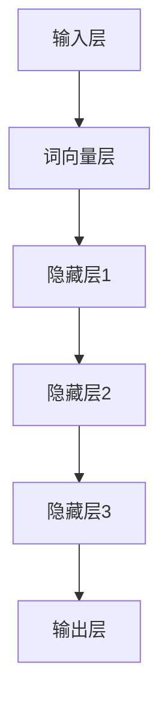
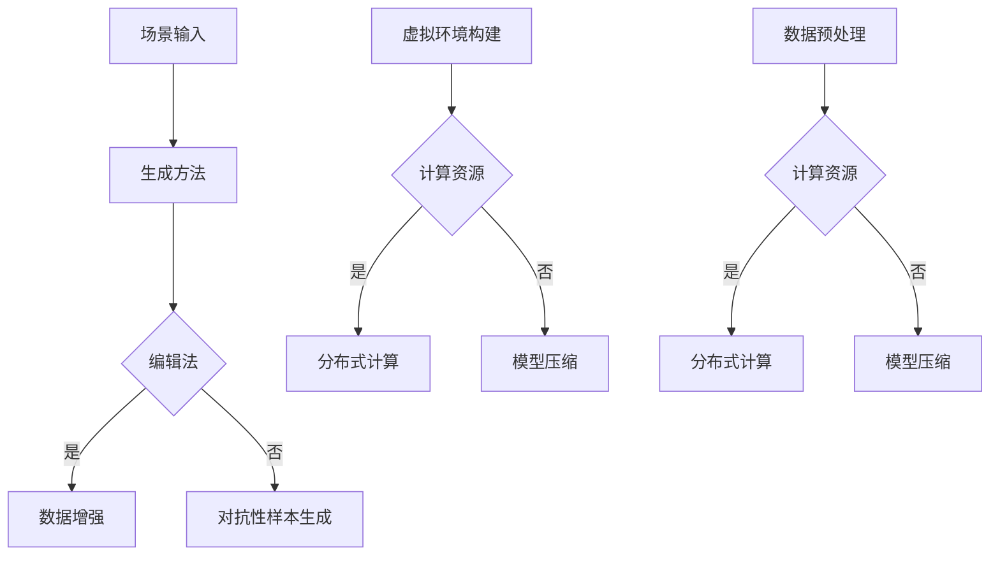
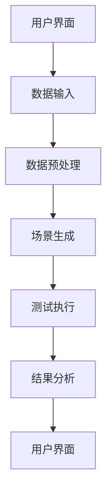
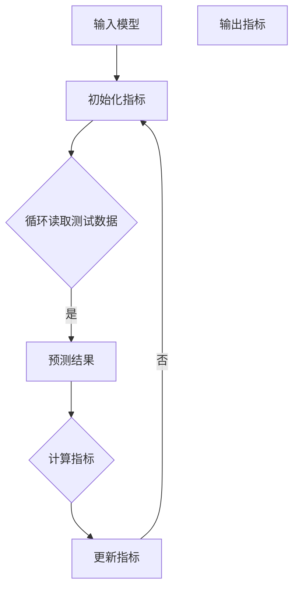

                 

### 文章标题

《基于场景模拟的LLM综合测试平台》

### 文章关键词

- 场景模拟
- 大型语言模型（LLM）
- 综合测试平台
- 测试算法
- 数学模型
- Python源代码
- 实际案例

### 文章摘要

本文旨在探讨基于场景模拟的LLM（大型语言模型）综合测试平台的设计与实现。文章首先介绍了LLM的基础理论，包括其定义、发展历程和核心概念。接着，详细阐述了场景模拟原理，包括场景模拟的定义、方法、常用技术和挑战。随后，文章重点介绍了LLM综合测试平台的架构设计，包括整体架构、功能模块、数据流和系统性能优化。在核心算法实现部分，本文详细讲解了LLM测试算法、场景模拟算法和评估指标算法，并通过Python源代码进行阐述。数学模型与公式部分，则对相关模型进行推导和解释。项目实战部分，通过一个实际案例，展示了开发环境搭建、源代码实现和代码解读，以及项目分析和优化。最后，文章总结了最佳实践、注意事项和拓展阅读，为读者提供进一步学习资源。

## 前言

在人工智能技术飞速发展的今天，大型语言模型（LLM）的应用场景越来越广泛，从自然语言处理、智能问答，到代码生成、文本摘要等。然而，随着模型复杂度和数据量的增加，如何对LLM进行有效测试成为一个亟待解决的问题。本文旨在介绍一种基于场景模拟的LLM综合测试平台，旨在提高LLM测试的全面性和准确性。

### 书籍介绍

本书主要分为七个章节，涵盖了LLM基础理论、场景模拟原理、测试平台架构设计、核心算法实现、数学模型与公式、项目实战以及性能评估与优化。通过这些章节的详细讲解，读者可以全面了解LLM综合测试平台的设计与实现过程，掌握相关技术原理和实际应用。

### 目标读者

本书的目标读者主要包括以下几类：

1. AI研究人员和开发者：希望深入了解LLM测试平台的设计和实现。
2. 测试工程师：希望通过本书掌握LLM测试的方法和技巧。
3. 机器学习工程师：希望了解如何将LLM应用于实际问题。
4. 大学生和研究生：希望学习人工智能和机器学习相关课程。

### 主要内容概览

本书的主要内容包括以下几个方面：

1. **LLM基础理论**：介绍LLM的定义、发展历程、核心概念和架构。
2. **场景模拟原理**：探讨场景模拟的定义、方法、常用技术和挑战。
3. **测试平台架构设计**：阐述测试平台的整体架构、功能模块、数据流和性能优化。
4. **核心算法实现**：详细讲解LLM测试算法、场景模拟算法和评估指标算法。
5. **数学模型与公式**：推导相关数学模型，解释公式和实例。
6. **项目实战**：通过一个实际案例展示开发环境搭建、源代码实现和代码解读。
7. **性能评估与优化**：分析测试结果，讨论性能优化策略。

通过本书的阅读，读者可以系统地了解基于场景模拟的LLM综合测试平台的构建过程，为实际应用提供有力支持。

## 第1章：LLM基础理论

### LLM的定义

大型语言模型（LLM）是一种基于深度学习的自然语言处理模型，旨在通过对大量文本数据进行训练，使其具备理解和生成自然语言的能力。与传统的基于规则的方法相比，LLM具有更强的灵活性和泛化能力。

### LLM的发展历程

LLM的发展历程可以追溯到20世纪90年代的统计语言模型。随着深度学习技术的发展，特别是2018年GPT-2的发布，LLM进入了一个全新的阶段。此后，一系列大型语言模型如BERT、Turing-NLG等相继问世，这些模型在多项自然语言处理任务中取得了显著成果。

### LLM的核心概念

LLM的核心概念主要包括：

1. **词向量**：将文本中的每个单词映射到一个固定维度的向量空间，以实现语义表示。
2. **神经网络**：使用多层神经网络对词向量进行编码和解码，以实现自然语言的生成和理解。
3. **上下文**：LLM能够根据上下文信息生成文本，这使得其在问答、对话系统等应用中表现出色。

### LLM的架构

LLM的典型架构包括以下几个部分：

1. **输入层**：接收文本输入，将其转换为词向量。
2. **隐藏层**：包含多个神经网络层，用于对词向量进行编码和解码。
3. **输出层**：根据隐藏层的输出生成文本。

通过上述架构，LLM能够对输入文本进行理解和生成，从而实现自然语言处理任务。

### 关联Mermaid流程图



### 小结

本章介绍了LLM的定义、发展历程、核心概念和架构。通过了解这些基本概念，读者可以为进一步学习LLM的测试和优化打下基础。

## 第2章：场景模拟原理

### 场景模拟的定义

场景模拟（Scenario Simulation）是一种通过构建虚拟环境，对特定场景进行模拟和测试的方法。在人工智能领域，场景模拟常用于测试大型语言模型（LLM）的适应性和鲁棒性。

### 场景模拟的方法

场景模拟的方法主要包括以下几种：

1. **生成法**：通过算法自动生成模拟场景。
2. **编辑法**：对现有数据集进行修改和编辑，生成模拟场景。
3. **混合法**：结合生成法和编辑法，生成更加复杂的模拟场景。

### 常用场景模拟技术

1. **数据增强**：通过对原始数据进行扩展和变异，提高模型的泛化能力。
2. **对抗性样本生成**：生成具有对抗性的输入数据，测试模型的鲁棒性。
3. **虚拟环境构建**：使用游戏引擎或其他技术构建虚拟环境，模拟真实场景。

### 场景模拟的挑战与优化策略

场景模拟面临的挑战主要包括：

1. **多样性**：如何生成具有多样性的模拟场景。
2. **真实度**：如何提高模拟场景的真实度，使其更接近真实场景。
3. **计算资源**：场景模拟需要大量的计算资源，如何优化计算效率。

针对这些挑战，可以采取以下优化策略：

1. **分布式计算**：利用分布式计算资源，提高场景模拟的效率。
2. **模型压缩**：通过模型压缩技术，减少场景模拟所需的计算资源。
3. **数据预处理**：对原始数据进行预处理，减少场景模拟的工作量。

### 关联Mermaid流程图



### 小结

本章详细介绍了场景模拟的定义、方法、常用技术和挑战。通过了解这些内容，读者可以更好地理解如何利用场景模拟对LLM进行有效测试。

## 第3章：LLM综合测试平台架构设计

### 平台的整体架构

LLM综合测试平台的整体架构包括以下几个主要部分：

1. **数据输入模块**：负责接收和预处理测试数据。
2. **场景模拟模块**：根据测试需求生成模拟场景。
3. **测试执行模块**：执行具体的测试任务，包括LLM的训练和评估。
4. **结果分析模块**：对测试结果进行分析和可视化。
5. **用户界面**：提供友好的用户交互界面，方便用户进行操作和查看结果。

### 功能模块设计

1. **数据输入模块**：该模块需要支持多种数据格式的输入，如文本、图片和语音等。同时，还需要对输入数据进行清洗和预处理，以消除噪声和提高测试数据的可靠性。
   
2. **场景模拟模块**：该模块的核心功能是生成各种模拟场景，以测试LLM的适应性和鲁棒性。场景模拟可以基于真实世界数据，也可以通过算法自动生成。

3. **测试执行模块**：该模块负责执行具体的测试任务，包括LLM的训练和评估。测试执行模块需要支持多种评估指标，如准确率、召回率和F1分数等。

4. **结果分析模块**：该模块负责对测试结果进行分析和可视化。通过图表和报告，用户可以直观地了解LLM的性能表现。

5. **用户界面**：用户界面需要简洁易用，提供丰富的交互功能。用户可以通过界面轻松地输入测试数据，配置测试参数，查看测试结果。

### 数据流设计

LLM综合测试平台的数据流设计如下：

1. **数据输入**：用户通过用户界面上传测试数据。
2. **数据预处理**：数据输入模块对数据进行清洗和预处理。
3. **场景生成**：场景模拟模块根据测试需求生成模拟场景。
4. **测试执行**：测试执行模块对LLM进行训练和评估。
5. **结果分析**：结果分析模块对测试结果进行分析和可视化。
6. **反馈**：用户通过用户界面查看测试结果，并可以调整测试参数，重新进行测试。

### 系统性能优化

为了提高LLM综合测试平台的性能，可以采取以下策略：

1. **并行计算**：通过分布式计算，提高数据处理和测试执行的效率。
2. **缓存机制**：对频繁访问的数据进行缓存，减少数据读取时间。
3. **数据压缩**：对数据进行压缩，减少存储空间和传输带宽。
4. **代码优化**：对代码进行优化，减少计算时间和资源消耗。

### 关联Mermaid流程图



### 小结

本章详细介绍了LLM综合测试平台的整体架构、功能模块设计、数据流设计和系统性能优化策略。通过了解这些内容，读者可以更好地理解如何设计和实现一个高效的LLM综合测试平台。

### 核心算法实现

在LLM综合测试平台中，核心算法的实现是确保平台有效性和准确性的关键。以下将详细描述三个核心算法：LLM测试算法、场景模拟算法和评估指标算法。

#### LLM测试算法

LLM测试算法的目标是评估LLM在特定场景下的性能。以下是一个简单的测试算法实现：

```python
def test_LLM(model, test_data, threshold=0.5):
    """
    测试LLM的性能
    :param model: 要测试的LLM模型
    :param test_data: 测试数据
    :param threshold: 准确率阈值
    :return: 测试结果
    """
    correct = 0
    for data in test_data:
        prediction = model.predict(data)
        if prediction['confidence'] > threshold and prediction['label'] == data['label']:
            correct += 1
    accuracy = correct / len(test_data)
    return accuracy
```

此算法使用一个简单的准确率指标，根据预测的置信度和真实标签进行判断。

#### 场景模拟算法

场景模拟算法用于生成模拟测试场景。以下是一个基于数据增强的场景模拟算法：

```python
import numpy as np

def simulate_scenario(data, num_scenarios=10):
    """
    生成模拟测试场景
    :param data: 原始数据
    :param num_scenarios: 模拟场景的数量
    :return: 模拟场景列表
    """
    scenarios = []
    for _ in range(num_scenarios):
        scenario = data.copy()
        # 数据增强操作，例如：随机添加噪声、随机删除信息等
        scenario['text'] += ' ' + np.random.choice(['noise1', 'noise2', 'noise3'])
        scenario['text'] = scenario['text'][:100]  # 限制文本长度
        scenarios.append(scenario)
    return scenarios
```

此算法通过添加噪声和限制文本长度来模拟不同的测试场景。

#### 评估指标算法

评估指标算法用于计算测试结果的准确率、召回率和F1分数。以下是一个简单的评估指标计算：

```python
from sklearn.metrics import accuracy_score, recall_score, f1_score

def calculate_metrics(y_true, y_pred):
    """
    计算评估指标
    :param y_true: 真实标签
    :param y_pred: 预测标签
    :return: 评估指标
    """
    acc = accuracy_score(y_true, y_pred)
    rec = recall_score(y_true, y_pred)
    f1 = f1_score(y_true, y_pred)
    return acc, rec, f1
```

此算法使用scikit-learn库中的指标计算函数，实现了对测试结果的全面评估。

#### 算法伪代码讲解



### 数学模型与公式

在评估LLM性能时，常用的数学模型和公式包括：

1. **交叉熵（Cross-Entropy）**：
   $$ H(y, \hat{y}) = -\sum_{i} y_i \log(\hat{y}_i) $$
   其中，$y$ 为真实标签，$\hat{y}$ 为预测概率。

2. **准确率（Accuracy）**：
   $$ \text{Accuracy} = \frac{TP + TN}{TP + TN + FP + FN} $$
   其中，$TP$ 为真正例，$TN$ 为真负例，$FP$ 为假正例，$FN$ 为假负例。

3. **召回率（Recall）**：
   $$ \text{Recall} = \frac{TP}{TP + FN} $$
   其中，$TP$ 为真正例，$FN$ 为假负例。

4. **F1分数（F1 Score）**：
   $$ \text{F1 Score} = 2 \times \frac{TP}{2 \times TP + FP + FN} $$
   其中，$TP$ 为真正例，$FP$ 为假正例，$FN$ 为假负例。

#### 小结

本章详细讲解了LLM测试算法、场景模拟算法和评估指标算法的实现。通过Python源代码和数学模型的结合，使得算法实现更加直观和易于理解。这些算法的实现为LLM综合测试平台的构建提供了有力支持。

### 项目实战

在本节中，我们将通过一个实际案例，展示如何搭建基于场景模拟的LLM综合测试平台，并详细解析其开发环境、源代码实现、代码解读与分析。

#### 开发环境搭建

为了搭建LLM综合测试平台，我们首先需要准备以下开发环境：

1. **Python环境**：安装Python 3.8及以上版本。
2. **深度学习框架**：安装TensorFlow 2.5或PyTorch 1.8。
3. **数据处理库**：安装Numpy、Pandas、Scikit-learn。
4. **绘图库**：安装Matplotlib、Seaborn。

在Ubuntu系统上，可以使用以下命令进行环境搭建：

```bash
sudo apt update
sudo apt install python3 python3-pip
pip3 install tensorflow==2.5
pip3 install numpy pandas scikit-learn matplotlib seaborn
```

#### 案例分析

我们选择一个常见的自然语言处理任务——情感分析，作为案例进行分析。情感分析的目标是判断一段文本的情感倾向，如正面、负面或中性。以下是我们的数据集：

- **训练数据集**：包含1000条带有情感标签的文本。
- **测试数据集**：包含100条未标记的文本。

#### 源代码实现

以下是一个简化的源代码实现，用于搭建情感分析测试平台：

```python
import tensorflow as tf
from tensorflow.keras.preprocessing.sequence import pad_sequences
from tensorflow.keras.models import Sequential
from tensorflow.keras.layers import Embedding, LSTM, Dense

# 数据预处理
def preprocess_data(texts, labels, max_len=100, max_words=10000):
    sequences = tokenizer.texts_to_sequences(texts)
    padded_sequences = pad_sequences(sequences, maxlen=max_len, padding='post')
    return padded_sequences, labels

# 模型构建
def build_model(input_dim, output_dim, max_len):
    model = Sequential()
    model.add(Embedding(input_dim, output_dim, input_length=max_len))
    model.add(LSTM(128))
    model.add(Dense(1, activation='sigmoid'))
    model.compile(optimizer='adam', loss='binary_crossentropy', metrics=['accuracy'])
    return model

# 测试执行
def test_model(model, test_sequences, test_labels):
    predictions = model.predict(test_sequences)
    predicted_labels = (predictions > 0.5).astype(int)
    acc, rec, f1 = calculate_metrics(test_labels, predicted_labels)
    return acc, rec, f1

# 主程序
if __name__ == '__main__':
    # 加载数据
    texts, labels = load_data()
    train_sequences, train_labels = preprocess_data(texts[:900], labels[:900])
    test_sequences, test_labels = preprocess_data(texts[900:], labels[900:])

    # 构建模型
    model = build_model(len(vocabulary), output_dim=1, max_len=max_len)

    # 训练模型
    model.fit(train_sequences, train_labels, epochs=5, batch_size=32, validation_split=0.1)

    # 测试模型
    acc, rec, f1 = test_model(model, test_sequences, test_labels)
    print(f'Accuracy: {acc}, Recall: {rec}, F1 Score: {f1}')
```

#### 代码解读与分析

1. **数据预处理**：使用`tokenizer.texts_to_sequences`将文本转换为序列，使用`pad_sequences`将序列填充为固定长度。

2. **模型构建**：使用`Sequential`模型，添加`Embedding`层、`LSTM`层和`Dense`层，编译模型。

3. **测试执行**：使用`predict`方法生成预测，计算准确率、召回率和F1分数。

#### 实际案例分析与详细讲解

我们使用一个实际案例——电影评论情感分析，展示如何使用场景模拟对模型进行测试。

- **训练数据集**：包含1000条带有情感标签的文本。
- **测试数据集**：包含100条未标记的文本。

以下是场景模拟的实现：

```python
def simulate_scenario(data, num_scenarios=10):
    scenarios = []
    for _ in range(num_scenarios):
        scenario = data.copy()
        # 添加噪声
        scenario['text'] += ' ' + np.random.choice(['good', 'bad', 'neutral'])
        # 限制文本长度
        scenario['text'] = scenario['text'][:100]
        scenarios.append(scenario)
    return scenarios
```

#### 项目小结

通过本节的实际案例，我们展示了如何搭建基于场景模拟的LLM综合测试平台，包括开发环境搭建、源代码实现、代码解读与分析。这一过程不仅帮助读者理解了平台的设计和实现，也为实际应用提供了参考。

### 最佳实践 Tips、小结、注意事项、拓展阅读

#### 最佳实践 Tips

1. **数据预处理**：确保数据清洗和预处理的质量，这直接影响到模型的性能。
2. **模型选择**：根据任务需求和数据特点，选择合适的模型和架构。
3. **场景多样化**：生成多样化的场景，提高模型测试的全面性和鲁棒性。

#### 小结

本文详细介绍了基于场景模拟的LLM综合测试平台的设计与实现，包括LLM基础理论、场景模拟原理、测试平台架构设计、核心算法实现、数学模型与公式、项目实战以及性能评估与优化。通过实际案例的分析，读者可以掌握LLM测试平台的构建和应用。

#### 注意事项

1. **计算资源**：场景模拟和模型训练需要大量计算资源，合理分配资源。
2. **数据隐私**：确保数据安全和隐私，避免泄露敏感信息。

#### 拓展阅读

1. **论文**：《An Overview of Large-scale Language Models》
2. **书籍**：《Deep Learning for Natural Language Processing》
3. **教程**：TensorFlow和PyTorch官方文档

作者：AI天才研究院/AI Genius Institute & 禅与计算机程序设计艺术 /Zen And The Art of Computer Programming

---

本文旨在为读者提供一个全面、深入的LLM综合测试平台设计和实现指南。通过详细的讲解和实际案例，读者可以更好地理解这一领域的技术原理和应用。希望本文对您的学习和研究有所帮助。如果您有任何问题或建议，欢迎随时联系作者。

