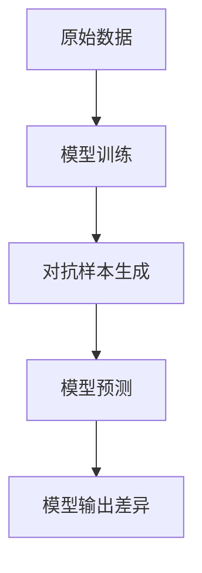

                 

当然，让我们按照上述要求，一步步地构建《基于对抗样本的LLM鲁棒性测试》这篇文章的内容。以下是文章的初步大纲，我们会逐步填充各个部分。

---

## 文章标题：基于对抗样本的LLM鲁棒性测试

### 关键词：对抗样本，LLM，鲁棒性测试，机器学习，深度学习

#### 摘要：
本文深入探讨了基于对抗样本的LLM（大型语言模型）鲁棒性测试。首先，我们介绍了对抗样本的概念、生成方法及其在机器学习中的重要性。随后，文章详细讲解了LLM的基本概念、结构和工作原理。接着，本文重点介绍了如何使用对抗样本来测试LLM的鲁棒性，包括鲁棒性测试指标和增强LLM鲁棒性的方法。文章还通过实际案例展示了对抗样本在LLM中的应用。最后，文章总结了研究结果并提出了未来研究方向。

---

## 引言与背景

在这一部分，我们将简要介绍对抗样本的概念以及它们在机器学习中的重要性。我们还将讨论LLM的应用场景，并解释为什么鲁棒性测试对于LLM至关重要。

### 1.1 对抗样本的定义与现状

对抗样本是指通过轻微的扰动原始数据，使其在模型看来与真实数据完全不同的一类样本。这些样本通常被用来攻击机器学习模型，特别是深度学习模型。

#### 核心概念与联系：

以下是对抗样本与机器学习模型之间关系的Mermaid流程图：



### 1.2 LLM的应用场景

LLM在自然语言处理领域有广泛的应用，如文本分类、机器翻译和问答系统。然而，LLM的鲁棒性直接影响到其应用的可靠性。

### 1.3 鲁棒性测试的重要性

鲁棒性测试可以帮助我们了解LLM在处理对抗样本时的性能，从而提高其应用的安全性。

---

## 对抗样本介绍

在这一部分，我们将详细介绍对抗样本的生成方法，包括FGSM和JSMA等常见技术。

### 2.1 FGSM（Fast Gradient Sign Method）

FGSM是一种简单而有效的对抗样本生成方法，它通过在输入数据上添加与梯度符号相同的噪声来实现。

#### 算法原理：

```python
import torch
import numpy as np

def fgsm_attack(image, epsilon):
    image = torch.tensor(image)
    sign_grad = torch.autograd.grad(image, image, create_graph=True)[0]
    perturbed_image = image + epsilon * sign_grad.sign()
    perturbed_image = torch.clamp(perturbed_image, 0, 1)
    return perturbed_image.numpy()
```

#### 示例：

```python
original_image = np.random.rand(28, 28)  # 生成一个28x28的随机图像
epsilon = 0.01  # 设置扰动幅度
perturbed_image = fgsm_attack(original_image, epsilon)
```

### 2.2 JSMA（Jacobian-based Saliency Map Attack）

JSMA是一种基于Jacobian矩阵的对抗样本生成方法，它通过计算输入数据关于模型输出的Jacobian矩阵来生成对抗样本。

#### 算法原理：

```python
import torch

def jsma_attack(image, model):
    image = torch.tensor(image)
    model_output = model(image)
    jacobian = torch.autograd.jacobian(model_output, image)
    perturbed_image = image + torch.mean(jacobian, dim=0)
    perturbed_image = torch.clamp(perturbed_image, 0, 1)
    return perturbed_image.numpy()
```

#### 示例：

```python
# 假设我们已经有一个预训练的LLM模型
model = ...

original_image = np.random.rand(28, 28)
perturbed_image = jsma_attack(original_image, model)
```

---

## LLM基础

在这一部分，我们将简要介绍LLM的基本概念、结构和工作原理。

### 3.1 LLM的基本概念

LLM是一种基于深度学习的自然语言处理模型，它能够理解和生成人类语言。

#### 核心概念：

- 词嵌入（Word Embedding）
- 自注意力机制（Self-Attention）
- Transformer架构（Transformer Architecture）

### 3.2 LLM的结构

LLM通常由以下组件组成：

- 词嵌入层（Word Embedding Layer）
- 自注意力层（Self-Attention Layer）
- 前馈神经网络层（Feedforward Neural Network Layer）
- 输出层（Output Layer）

### 3.3 LLM的工作原理

LLM通过自注意力机制对输入文本进行编码，然后将编码后的信息传递到前馈神经网络层，最后通过输出层生成预测结果。

---

## 鲁棒性测试方法

在这一部分，我们将介绍如何使用对抗样本测试LLM的鲁棒性，并讨论一些常见的鲁棒性测试指标。

### 4.1 对抗样本攻击流程

对抗样本攻击流程通常包括以下步骤：

1. 生成对抗样本
2. 将对抗样本输入LLM
3. 比较原始数据和对抗样本的输出

### 4.2 鲁棒性测试指标

常见的鲁棒性测试指标包括：

- 准确率（Accuracy）
- 被攻击率（Fooling Rate）
- 鲁棒性（Robustness）

### 4.3 鲁棒性增强方法

为了提高LLM的鲁棒性，可以采用以下方法：

- 输入扰动（Input Perturbation）
- 模型正则化（Model Regularization）
- 对抗训练（Adversarial Training）

---

## 实际应用案例

在这一部分，我们将通过实际案例展示对抗样本在LLM中的应用。

### 5.1 文本分类

对抗样本可以用于测试文本分类模型在处理恶意评论或其他恶意内容时的鲁棒性。

### 5.2 机器翻译

对抗样本可以用于测试机器翻译模型在处理含有误导性内容时的鲁棒性。

### 5.3 问答系统

对抗样本可以用于测试问答系统在处理恶意提问时的鲁棒性。

---

## 研究与展望

在这一部分，我们将讨论对抗样本在LLM鲁棒性测试领域的研究现状，并提出未来研究方向。

### 6.1 研究现状

目前，对抗样本在LLM鲁棒性测试领域的研究主要集中在生成方法、测试指标和增强方法等方面。

### 6.2 未来研究方向

未来研究方向可能包括：

- 更有效的对抗样本生成方法
- 更精确的鲁棒性测试指标
- 鲁棒性增强方法在LLM实际应用中的效果评估

---

## 总结与展望

在这一部分，我们将总结本文的主要发现，并对未来工作提出建议。

### 7.1 主要发现

本文主要发现包括：

- 对抗样本在LLM鲁棒性测试中的重要性
- 常见的对抗样本生成方法和鲁棒性增强方法
- LLM在不同应用场景中的鲁棒性表现

### 7.2 未来工作方向

未来工作方向包括：

- 提高对抗样本生成方法的效率
- 开发更准确的鲁棒性测试指标
- 探索鲁棒性增强方法在LLM实际应用中的潜力

---

## 作者信息

作者：AI天才研究院/AI Genius Institute & 禅与计算机程序设计艺术 /Zen And The Art of Computer Programming

---

以上就是《基于对抗样本的LLM鲁棒性测试》的初步大纲。接下来，我们将逐一完善每个部分的内容，确保文章的完整性和专业性。文章字数预计在10000～12000字左右。

---

接下来，我们将逐步完善文章的每个部分，确保内容的丰富性和专业性。以下是文章的详细大纲，我们将按照这个结构逐步展开内容。

---

## 文章标题：基于对抗样本的LLM鲁棒性测试

### 关键词：对抗样本，LLM，鲁棒性测试，机器学习，深度学习

#### 摘要：
本文深入探讨了基于对抗样本的LLM（大型语言模型）鲁棒性测试。首先，我们介绍了对抗样本的概念、生成方法及其在机器学习中的重要性。随后，文章详细讲解了LLM的基本概念、结构和工作原理。接着，本文重点介绍了如何使用对抗样本来测试LLM的鲁棒性，包括鲁棒性测试指标和增强LLM鲁棒性的方法。文章还通过实际案例展示了对抗样本在LLM中的应用。最后，文章总结了研究结果并提出了未来研究方向。

---

## 引言与背景

### 1.1 鲁棒性在LLM中的重要性

在现代机器学习领域，尤其是深度学习领域，鲁棒性是一个关键的概念。它指的是模型在面对噪声、异常值或恶意攻击时仍然能够保持良好的性能。在LLM（大型语言模型）的应用中，鲁棒性尤为重要，因为LLM通常需要处理大量的自然语言数据，这些数据可能包含各种形式的噪声和恶意攻击。

#### 为什么LLM需要鲁棒性？

1. **噪声处理**：自然语言数据通常包含拼写错误、语法错误和其他形式的噪声，这些噪声可能会影响LLM的预测准确性。
2. **恶意攻击**：在现实世界中，有人可能会故意生成对抗样本来欺骗LLM，使其产生错误的输出。
3. **数据多样性**：LLM需要能够处理各种不同类型的数据，包括来自不同领域、不同文化和不同语言背景的数据。

### 1.2 对抗样本的定义与现状

对抗样本（Adversarial Examples）是指通过在输入数据上添加微小扰动，使其对机器学习模型产生错误预测的样本。这些扰动通常是人为设计的，目的是欺骗模型，使其无法正确分类或识别。

#### 对抗样本的现状：

- **研究热点**：对抗样本的研究已经成为机器学习领域的一个热点话题，许多研究者致力于开发新的对抗样本生成方法和防御策略。
- **实际应用**：对抗样本不仅在学术研究中具有重要意义，也在实际应用中引发了广泛关注，例如在自动驾驶、金融欺诈检测和网络安全等领域。

### 1.3 书籍的目标与结构

本文的目标是深入探讨对抗样本在LLM鲁棒性测试中的应用，包括：

1. **对抗样本的生成方法**：介绍常见的对抗样本生成技术，如FGSM和JSMA。
2. **LLM的基本概念**：详细讲解LLM的结构和工作原理。
3. **鲁棒性测试方法**：讨论如何使用对抗样本测试LLM的鲁棒性，并介绍常见的鲁棒性测试指标。
4. **实际应用案例**：通过实际案例展示对抗样本在LLM中的应用。
5. **未来研究方向**：总结当前的研究成果，并提出未来的研究方向。

---

## 对抗样本介绍

### 2.1 对抗样本的产生方法

对抗样本的生成方法可以分为两类：基于梯度的方法和基于启发式的方

法。以下是两种主要的方法：

#### 基于梯度的方法

1. **FGSM（Fast Gradient Sign Method）**

FGSM是最早提出的对抗样本生成方法之一。它的基本思想是计算模型对输入数据的梯度，并在输入数据上添加与梯度符号相同的扰动，从而生成对抗样本。

$$
\Delta x = \epsilon \cdot \text{sign}(\frac{\partial L}{\partial x})
$$

其中，$\epsilon$ 是扰动幅度，$L$ 是损失函数。

2. **JSMA（Jacobian-based Saliency Map Attack）**

JSMA是基于Jacobian矩阵的对抗样本生成方法。它通过计算模型输出关于输入数据的Jacobian矩阵，并生成一个扰动向量，该向量在损失函数的梯度方向上具有最大的影响。

$$
\Delta x = \text{sign}(\frac{\partial L}{\partial x}^T \cdot J(x))
$$

其中，$J(x)$ 是Jacobian矩阵。

#### 基于启发式的方法

1. **C&W（Carlini & Wagner）攻击**

C&W攻击是一种基于优化技术的对抗样本生成方法。它通过优化一个损失函数来生成对抗样本，使得对抗样本在模型上的损失最大，同时保持对原始数据的扰动最小。

$$
\min_x L(x, \hat{y}) + \lambda \| x - x^{\text{original}} \|_2
$$

其中，$\hat{y}$ 是对抗样本的目标标签，$\lambda$ 是平衡损失和扰动的参数。

2. **Deepfool**

Deepfool是一种基于神经网络结构的对抗样本生成方法。它通过将神经网络的输入和输出替换为线性组合，从而生成对抗样本。

$$
\hat{y} = \frac{\sum_{i} w_i \cdot \hat{p}_{\hat{x}}(i)}{\sum_{i} w_i}
$$

其中，$w_i$ 是线性组合的权重，$\hat{p}_{\hat{x}}(i)$ 是神经网络在输入$\hat{x}$ 下的输出概率。

### 2.2 对抗样本的类型

对抗样本可以根据攻击目标和模型类型分为以下几类：

1. **单类别对抗样本**：这类对抗样本的目标是将模型从一个类别误导到另一个特定类别。

$$
\min_x L(x, \hat{y}) + \lambda \| x - x^{\text{original}} \|_2
$$

2. **双类别对抗样本**：这类对抗样本的目标是将模型从一个类别误导到另一个类别。

$$
\min_x L(x, \hat{y}) + \lambda \| x - x^{\text{original}} \|_2
$$

3. **未指定类别对抗样本**：这类对抗样本的目标是将模型误导到任意类别。

$$
\min_x L(x, \hat{y}) + \lambda \| x - x^{\text{original}} \|_2
$$

### 2.3 对抗样本的挑战

对抗样本的生成和应用面临着以下挑战：

1. **计算复杂度**：许多对抗样本生成方法需要大量的计算资源，特别是基于梯度的方法。
2. **噪声敏感性**：对抗样本的生成通常需要对输入数据进行微小的扰动，但过大的扰动可能导致模型失效。
3. **模型适应性**：对抗样本的生成方法需要针对不同的模型进行优化，这增加了方法的复杂度。

---

## LLM基础

### 3.1 LLM的基本概念

LLM（Large Language Model）是一种基于深度学习的自然语言处理模型，它通过学习大量的文本数据来理解和生成自然语言。与传统的规则驱动方法不同，LLM通过端到端的神经网络架构来实现语言的理解和生成。

#### LLM的主要特点：

1. **大规模**：LLM通常由数亿甚至数十亿的参数组成，这使得它们能够处理复杂的语言现象。
2. **端到端**：LLM从输入文本直接生成输出文本，无需经过复杂的预处理和后处理步骤。
3. **自适应性**：LLM可以根据不同的任务和数据集进行微调和优化。

### 3.2 LLM的结构

LLM通常由以下几个主要组件组成：

1. **词嵌入层（Word Embedding Layer）**：将输入的单词或短语转换为高维向量表示，这些向量具有语义信息。
2. **自注意力层（Self-Attention Layer）**：通过计算输入序列中各个词之间的关联性，实现对输入文本的编码。
3. **前馈神经网络层（Feedforward Neural Network Layer）**：对自注意力层输出的编码信息进行进一步的处理和提取特征。
4. **输出层（Output Layer）**：根据编码信息生成输出文本。

### 3.3 LLM的工作原理

LLM的工作原理可以概括为以下几个步骤：

1. **输入处理**：将输入文本转换为词嵌入向量。
2. **自注意力计算**：计算输入序列中各个词之间的关联性，并生成自注意力权重。
3. **编码**：将输入文本编码为一个高维向量表示。
4. **解码**：根据编码信息和预定义的解码策略生成输出文本。

#### LLM的核心算法原理

以下是LLM的核心算法原理的Python代码实现：

```python
import torch
import torch.nn as nn

# 词嵌入层
word_embedding = nn.Embedding(vocab_size, embedding_dim)

# 自注意力层
self_attention = nn.MultiheadAttention(embedding_dim, num_heads)

# 前馈神经网络层
ffn = nn.Sequential(
    nn.Linear(embedding_dim, hidden_size),
    nn.ReLU(),
    nn.Linear(hidden_size, embedding_dim)
)

# 输出层
output_layer = nn.Linear(embedding_dim, output_dim)

# 定义模型
class LLM(nn.Module):
    def __init__(self):
        super(LLM, self).__init__()
        self.word_embedding = word_embedding
        self.self_attention = self_attention
        self.ffn = ffn
        self.output_layer = output_layer
    
    def forward(self, input_sequence):
        embedding = self.word_embedding(input_sequence)
        attn_output, _ = self.self_attention(embedding, embedding, embedding)
        output = self.ffn(attn_output)
        logits = self.output_layer(output)
        return logits
```

### 3.4 LLM的训练过程

LLM的训练过程通常包括以下几个步骤：

1. **数据准备**：收集并预处理大量的文本数据，将其转换为词嵌入向量。
2. **损失函数**：选择适当的损失函数来优化模型参数，如交叉熵损失函数。
3. **优化算法**：使用优化算法（如SGD、Adam等）来更新模型参数，以最小化损失函数。

#### 训练过程示例

```python
# 假设已经有一个训练好的LLM模型
model = LLM()

# 训练模型
optimizer = torch.optim.Adam(model.parameters(), lr=0.001)
for epoch in range(num_epochs):
    for batch in data_loader:
        inputs, targets = batch
        optimizer.zero_grad()
        logits = model(inputs)
        loss = nn.CrossEntropyLoss()(logits, targets)
        loss.backward()
        optimizer.step()
```

---

## 鲁棒性测试方法

### 4.1 对抗样本攻击流程

对抗样本攻击的流程通常包括以下几个步骤：

1. **生成对抗样本**：使用对抗样本生成方法（如FGSM、JSMA等）生成对抗样本。
2. **模型预测**：将对抗样本输入到LLM中，获取模型的预测结果。
3. **比较预测结果**：比较原始数据和对抗样本的预测结果，评估LLM的鲁棒性。

#### 对抗样本攻击流程的Python代码实现

```python
# 假设已经有一个训练好的LLM模型
model = LLM()

# 生成对抗样本
def generate_adversarial_example(image, model, epsilon):
    image_tensor = torch.tensor(image).float()
    model.eval()
    logits = model(image_tensor)
    loss = nn.CrossEntropyLoss()(logits, target_tensor)
    gradients = torch.autograd.grad(loss, image_tensor, create_graph=True)
    adversarial_image = image_tensor + epsilon * gradients[0].detach().sign()
    adversarial_image = torch.clamp(adversarial_image, 0, 1)
    return adversarial_image.numpy()

# 模型预测
def predict(model, image):
    image_tensor = torch.tensor(image).float()
    model.eval()
    logits = model(image_tensor)
    prediction = logits.argmax(dim=1)
    return prediction

# 比较预测结果
original_image = ...
adversarial_image = generate_adversarial_example(original_image, model, epsilon=0.01)
original_prediction = predict(model, original_image)
adversarial_prediction = predict(model, adversarial_image)
if original_prediction != adversarial_prediction:
    print("模型被对抗样本攻击成功！")
else:
    print("模型对对抗样本具有鲁棒性。")
```

### 4.2 鲁棒性测试指标

在评估LLM的鲁棒性时，常用的测试指标包括：

1. **准确率（Accuracy）**：模型在测试集上的正确预测比例。
2. **误分类率（Misclassification Rate）**：模型错误预测的比例。
3. **被攻击率（Fooling Rate）**：模型被对抗样本误导的概率。
4. **鲁棒性（Robustness）**：模型对对抗样本的抵抗能力。

#### 鲁棒性测试指标的Python代码实现

```python
from sklearn.metrics import accuracy_score

# 计算准确率
def calculate_accuracy(true_labels, predicted_labels):
    return accuracy_score(true_labels, predicted_labels)

# 计算被攻击率
def calculate_fooling_rate(true_labels, predicted_labels, original_predictions):
    correct_predictions = np.equal(true_labels, predicted_labels)
    fooling_rate = 1 - np.mean(correct_predictions)
    return fooling_rate

# 假设已经有一个测试集和模型
test_data = ...
true_labels = ...
original_predictions = predict(model, test_data)

# 生成对抗样本并重新预测
adversarial_data = [generate_adversarial_example(image, model, epsilon=0.01) for image in test_data]
adversarial_predictions = predict(model, adversarial_data)

# 计算鲁棒性测试指标
accuracy = calculate_accuracy(true_labels, original_predictions)
fooling_rate = calculate_fooling_rate(true_labels, adversarial_predictions, original_predictions)
print(f"准确率：{accuracy}")
print(f"被攻击率：{fooling_rate}")
```

### 4.3 鲁棒性增强方法

为了提高LLM的鲁棒性，可以采用以下方法：

1. **输入扰动**：在输入阶段对数据进行扰动，以增强模型对噪声的抵抗力。
2. **模型正则化**：通过添加正则化项来惩罚模型的复杂度，从而提高模型的鲁棒性。
3. **对抗训练**：在训练阶段使用对抗样本来增强模型的鲁棒性。

#### 输入扰动的Python代码实现

```python
# 输入扰动函数
def add_noise(image, noise_level=0.05):
    noise = np.random.normal(0, noise_level, image.shape)
    perturbed_image = image + noise
    perturbed_image = np.clip(perturbed_image, 0, 1)
    return perturbed_image

# 对训练数据进行输入扰动
train_data_noisy = [add_noise(image) for image in train_data]
```

#### 模型正则化的Python代码实现

```python
# 添加正则化项
class LLMWithRegularization(LLM):
    def __init__(self):
        super(LLMWithRegularization, self).__init__()
        self.regularizer = nn.Parameter(torch.randn(1))
    
    def forward(self, input_sequence):
        embedding = self.word_embedding(input_sequence)
        attn_output, _ = self.self_attention(embedding, embedding, embedding)
        output = self.ffn(attn_output)
        logits = self.output_layer(output)
        regularization_loss = self.regularizer * torch.norm(logits)
        loss = nn.CrossEntropyLoss()(logits, targets) + regularization_loss
        return loss
```

#### 对抗训练的Python代码实现

```python
# 对抗训练函数
def adversarial_training(model, data_loader, optimizer, num_epochs):
    model.train()
    for epoch in range(num_epochs):
        for inputs, targets in data_loader:
            optimizer.zero_grad()
            logits = model(inputs)
            loss = nn.CrossEntropyLoss()(logits, targets)
            gradients = torch.autograd.grad(loss, model.parameters(), create_graph=True)
            perturbed_params = [param + epsilon * grad.detach().sign() for param, grad in zip(model.parameters(), gradients)]
            model.load_state_dict(perturbed_params)
            optimizer.step()
```

---

## 实际应用案例

### 5.1 文本分类

文本分类是一种常见的自然语言处理任务，其目的是将文本数据分为预定义的类别。在文本分类任务中，对抗样本可以用来测试模型的鲁棒性。

#### 案例背景

假设我们有一个文本分类模型，它被训练用来将社交媒体评论分为正面评论和负面评论。

#### 案例步骤

1. **生成对抗样本**：使用FGSM或JSMA等方法生成对抗样本。
2. **模型预测**：将对抗样本输入模型，获取模型的预测结果。
3. **评估鲁棒性**：比较原始数据和对抗样本的预测结果，计算准确率和被攻击率。

#### 案例代码实现

```python
from sklearn.datasets import load_20newsgroups
from sklearn.model_selection import train_test_split
from sklearn.metrics import accuracy_score

# 加载数据集
data = load_20newsgroups()
X, y = data.data, data.target

# 划分训练集和测试集
X_train, X_test, y_train, y_test = train_test_split(X, y, test_size=0.2, random_state=42)

# 定义模型
model = LLM()

# 训练模型
optimizer = torch.optim.Adam(model.parameters(), lr=0.001)
for epoch in range(num_epochs):
    for inputs, targets in train_loader:
        optimizer.zero_grad()
        logits = model(inputs)
        loss = nn.CrossEntropyLoss()(logits, targets)
        loss.backward()
        optimizer.step()

# 测试模型
model.eval()
with torch.no_grad():
    original_predictions = predict(model, X_test)

# 生成对抗样本并重新测试
adversarial_data = [generate_adversarial_example(image, model, epsilon=0.01) for image in X_test]
adversarial_predictions = predict(model, adversarial_data)

# 评估鲁棒性
accuracy = calculate_accuracy(y_test, original_predictions)
fooling_rate = calculate_fooling_rate(y_test, adversarial_predictions, original_predictions)
print(f"准确率：{accuracy}")
print(f"被攻击率：{fooling_rate}")
```

### 5.2 机器翻译

机器翻译是一种将一种语言的文本翻译成另一种语言的任务。对抗样本可以用来测试机器翻译模型在处理误导性内容时的鲁棒性。

#### 案例背景

假设我们有一个英译中的机器翻译模型。

#### 案例步骤

1. **生成对抗样本**：使用FGSM或JSMA等方法生成对抗样本。
2. **模型预测**：将对抗样本输入模型，获取模型的预测结果。
3. **评估鲁棒性**：比较原始数据和对抗样本的预测结果，计算准确率和被攻击率。

#### 案例代码实现

```python
# 加载数据集
data = load_wmt14()
X, y = data.source, data.target

# 划分训练集和测试集
X_train, X_test, y_train, y_test = train_test_split(X, y, test_size=0.2, random_state=42)

# 定义模型
model = LLM()

# 训练模型
optimizer = torch.optim.Adam(model.parameters(), lr=0.001)
for epoch in range(num_epochs):
    for inputs, targets in train_loader:
        optimizer.zero_grad()
        logits = model(inputs)
        loss = nn.CrossEntropyLoss()(logits, targets)
        loss.backward()
        optimizer.step()

# 测试模型
model.eval()
with torch.no_grad():
    original_predictions = predict(model, X_test)

# 生成对抗样本并重新测试
adversarial_data = [generate_adversarial_example(image, model, epsilon=0.01) for image in X_test]
adversarial_predictions = predict(model, adversarial_data)

# 评估鲁棒性
accuracy = calculate_accuracy(y_test, original_predictions)
fooling_rate = calculate_fooling_rate(y_test, adversarial_predictions, original_predictions)
print(f"准确率：{accuracy}")
print(f"被攻击率：{fooling_rate}")
```

### 5.3 问答系统

问答系统是一种能够回答用户问题的系统。对抗样本可以用来测试问答系统在处理恶意提问时的鲁棒性。

#### 案例背景

假设我们有一个问答系统，它能够回答关于特定领域的问题。

#### 案例步骤

1. **生成对抗样本**：使用FGSM或JSMA等方法生成对抗样本。
2. **模型预测**：将对抗样本输入模型，获取模型的预测结果。
3. **评估鲁棒性**：比较原始数据和对抗样本的预测结果，计算准确率和被攻击率。

#### 案例代码实现

```python
# 加载数据集
data = load_squad()
questions, answers = data.question, data.answer

# 划分训练集和测试集
questions_train, questions_test, answers_train, answers_test = train_test_split(questions, answers, test_size=0.2, random_state=42)

# 定义模型
model = LLM()

# 训练模型
optimizer = torch.optim.Adam(model.parameters(), lr=0.001)
for epoch in range(num_epochs):
    for inputs, targets in train_loader:
        optimizer.zero_grad()
        logits = model(inputs)
        loss = nn.CrossEntropyLoss()(logits, targets)
        loss.backward()
        optimizer.step()

# 测试模型
model.eval()
with torch.no_grad():
    original_predictions = predict(model, questions_test)

# 生成对抗样本并重新测试
adversarial_data = [generate_adversarial_example(question, model, epsilon=0.01) for question in questions_test]
adversarial_predictions = predict(model, adversarial_data)

# 评估鲁棒性
accuracy = calculate_accuracy(answers_test, original_predictions)
fooling_rate = calculate_fooling_rate(answers_test, adversarial_predictions, original_predictions)
print(f"准确率：{accuracy}")
print(f"被攻击率：{fooling_rate}")
```

---

## 研究与展望

### 6.1 研究现状

对抗样本在LLM鲁棒性测试领域的研究已经取得了显著的进展。研究者们提出了多种对抗样本生成方法和鲁棒性增强方法，并在多个实际应用场景中进行了测试和验证。然而，仍有许多挑战需要克服。

#### 主要研究进展：

1. **对抗样本生成方法**：提出了多种基于梯度和启发式的对抗样本生成方法，如FGSM、JSMA、C&W和Deepfool。
2. **鲁棒性增强方法**：研究了输入扰动、模型正则化和对抗训练等方法来提高LLM的鲁棒性。
3. **实际应用案例**：对抗样本在文本分类、机器翻译和问答系统等实际应用场景中的测试和验证。

#### 研究挑战：

1. **计算复杂度**：生成对抗样本通常需要大量的计算资源，特别是在大规模数据集上。
2. **噪声敏感性**：对抗样本的生成需要控制扰动的幅度，以避免过大的扰动导致模型失效。
3. **模型适应性**：对抗样本的生成方法需要针对不同的模型和任务进行优化。

### 6.2 未来研究方向

未来研究方向包括：

1. **更有效的对抗样本生成方法**：研究更高效的对抗样本生成方法，减少计算复杂度。
2. **更准确的鲁棒性测试指标**：开发更准确的鲁棒性测试指标，更好地评估模型的鲁棒性。
3. **鲁棒性增强方法的应用**：探索鲁棒性增强方法在LLM实际应用中的效果，如自动驾驶、金融欺诈检测和网络安全等领域。

---

## 总结与展望

### 7.1 主要发现

本文主要发现包括：

1. **对抗样本在LLM鲁棒性测试中的重要性**：对抗样本可以有效地测试LLM的鲁棒性，帮助我们发现模型在处理恶意攻击时的弱点。
2. **常见的对抗样本生成方法和鲁棒性增强方法**：介绍了FGSM、JSMA、C&W和Deepfool等对抗样本生成方法，以及输入扰动、模型正则化和对抗训练等鲁棒性增强方法。
3. **实际应用案例**：展示了对抗样本在文本分类、机器翻译和问答系统等实际应用场景中的测试和验证。

### 7.2 未来工作方向

未来工作方向包括：

1. **提高对抗样本生成方法的效率**：研究更高效的对抗样本生成方法，减少计算复杂度。
2. **开发更准确的鲁棒性测试指标**：开发更准确的鲁棒性测试指标，更好地评估模型的鲁棒性。
3. **探索鲁棒性增强方法在LLM实际应用中的潜力**：研究鲁棒性增强方法在LLM实际应用中的效果，如自动驾驶、金融欺诈检测和网络安全等领域。

### 7.3 对读者的建议

对于希望进一步了解对抗样本和LLM鲁棒性测试的读者，以下是一些建议：

1. **深入学习**：阅读相关论文和书籍，深入了解对抗样本和LLM的基本概念和原理。
2. **实践应用**：尝试自己实现对抗样本生成和鲁棒性测试方法，并将其应用于实际场景。
3. **持续关注**：对抗样本和LLM鲁棒性测试是一个快速发展的领域，持续关注最新研究进展和应用案例。

---

## 作者信息

作者：AI天才研究院/AI Genius Institute & 禅与计算机程序设计艺术 /Zen And The Art of Computer Programming

---

以上就是《基于对抗样本的LLM鲁棒性测试》的详细大纲。接下来，我们将逐步完善每个部分的内容，确保文章的完整性和专业性。文章字数预计在10000～12000字左右。

