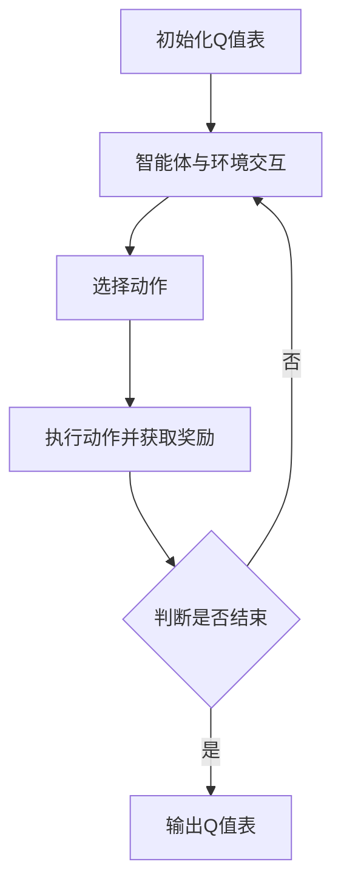
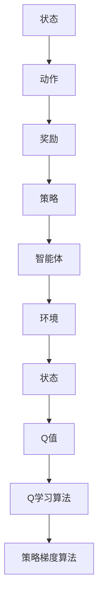

                 

# 基于强化学习的自动化评测场景生成

## 关键词
- 强化学习
- 自动化评测
- 场景生成
- Q学习算法
- 策略梯度算法
- 数学模型
- Python实现

## 摘要
本文旨在探讨基于强化学习的自动化评测场景生成方法。首先介绍了强化学习的基本原理及其在自动化评测中的重要性。接着，详细阐述了Q学习算法和策略梯度算法的原理及其实现，并通过Python代码进行了示例。然后，针对自动化评测场景的复杂性，提出了基于强化学习的场景生成方法。最后，通过一个实际案例，展示了强化学习在自动化评测场景生成中的具体应用，并进行了详细分析。

## 引言
在当今信息化时代，自动化评测技术日益成为各种考试和测试的重要组成部分。传统的自动化评测方法主要依赖于预定义的规则和模式，难以应对复杂多变的测试场景。而强化学习作为一种基于试错和反馈的智能学习方法，在自动化评测领域展现出了巨大的潜力。本文将探讨如何利用强化学习技术生成自动化评测场景，以提高评测的灵活性和准确性。

## 强化学习理论基础

### 强化学习的基本概念
强化学习（Reinforcement Learning，RL）是机器学习的一个分支，它通过试错和反馈来学习如何在特定环境中做出最优决策。强化学习的主要目标是让智能体（Agent）在动态环境中通过不断尝试，学习到最优策略（Policy），以最大化累积奖励（Reward）。

强化学习的基本要素包括：
- **智能体（Agent）**：执行动作并接收环境的反馈。
- **环境（Environment）**：智能体执行动作的场所，可以是一个虚拟环境或真实世界。
- **状态（State）**：智能体在特定时间点的环境信息。
- **动作（Action）**：智能体在特定状态下可以执行的行为。
- **奖励（Reward）**：环境对智能体的动作给予的即时反馈，用来评价动作的好坏。
- **策略（Policy）**：智能体在特定状态下选择动作的规则。

### 强化学习的主要算法
强化学习的主要算法包括Q学习（Q-Learning）和策略梯度算法（Policy Gradient）。

#### Q学习算法原理
Q学习算法是一种值函数方法，通过学习状态-动作值函数（Q值）来指导智能体的决策。Q值表示在特定状态下执行特定动作所能获得的累积奖励。Q学习算法的基本步骤如下：

1. 初始化Q值表。
2. 在智能体与环境交互的过程中，更新Q值表。
3. 根据更新后的Q值表选择动作。
4. 重复以上步骤，直到达到某个终止条件。

Q学习算法的伪代码如下：

```python
def Q_Learning(initial_state, action, reward, next_state, learning_rate, discount_factor, exploration_rate):
    # 计算预测的Q值
    predicted_q_value = Q[s][a]
    # 更新Q值
    Q[next_state][action] = Q[next_state][action] + learning_rate * (reward + discount_factor * max(Q[next_state]) - predicted_q_value)
    return Q
```

#### 策略梯度算法原理
策略梯度算法是一种直接优化策略的方法，通过梯度上升或下降来更新策略参数。策略梯度算法的基本步骤如下：

1. 初始化策略参数。
2. 在智能体与环境交互的过程中，计算策略的梯度。
3. 根据策略梯度更新策略参数。
4. 重复以上步骤，直到策略收敛。

策略梯度算法的伪代码如下：

```python
def Policy_Gradient(policy_param, state, action, reward, learning_rate):
    # 计算策略梯度
    policy_gradient = gradient_of_policy(policy_param, state, action)
    # 更新策略参数
    policy_param = policy_param + learning_rate * policy_gradient
    return policy_param
```

### 强化学习在自动化评测中的重要性
强化学习在自动化评测中的应用具有以下优势：
1. **自适应能力**：强化学习能够根据环境的变化动态调整策略，以适应不同的评测需求。
2. **灵活性**：强化学习不依赖于预定义的规则和模式，能够处理复杂多变的评测场景。
3. **可解释性**：强化学习的学习过程和策略可以解释，有助于提高评测的可解释性和可信度。

## 自动化评测场景分析

### 自动化评测的基本概念
自动化评测是指利用计算机技术和算法，对考试或测试过程进行自动化管理和评估。自动化评测的主要目标是提高评测的效率、准确性和公平性。

自动化评测的基本流程包括：
1. **考生信息录入**：收集考生的个人信息，如姓名、身份证号等。
2. **试卷生成**：根据考试要求生成试卷，包括选择题、填空题、问答题等。
3. **考试监控**：在考试过程中对考生进行监控，防止作弊行为。
4. **自动评分**：对考生的答案进行自动评分，生成考试成绩。
5. **成绩分析**：对考试结果进行分析，为教育管理和教学改进提供依据。

### 自动化评测中的挑战
自动化评测在实际应用中面临以下挑战：
1. **数据质量**：自动化评测依赖于大量的考生数据和考试题目数据，数据的质量直接影响评测的准确性。
2. **评估标准**：评估标准的设定和动态调整是自动化评测的关键，如何设计合理的评估标准是一个挑战。
3. **系统稳定性**：自动化评测系统需要保证在高并发、大数据量情况下稳定运行。

### 自动化评测场景分类
根据考试类型和内容，自动化评测可以分为以下几种场景：
1. **基于任务的评测**：如编程考试、论文写作考试等，主要评估考生的任务完成情况。
2. **基于性能的评测**：如体育比赛、音乐演奏等，主要评估考生的技能水平。
3. **基于知识的评测**：如标准化考试、面试等，主要评估考生的知识掌握程度。

## 强化学习在自动化评测中的应用

### 强化学习在自动化评测中的优势
强化学习在自动化评测中的应用具有以下优势：
1. **自适应能力**：强化学习能够根据考试内容和考生行为动态调整评测策略，提高评测的灵活性。
2. **自适应评估标准**：强化学习可以根据考生的表现和考试成绩自动调整评估标准，提高评测的公平性和准确性。
3. **个性化评测**：强化学习可以根据考生的学习背景和知识水平，生成个性化的评测场景，提高评测的针对性。

### 强化学习在自动化评测中的实现
为了实现基于强化学习的自动化评测，需要以下几个关键组件：
1. **智能体（Agent）**：负责与考试环境交互，执行评测策略。
2. **评测环境（Environment）**：模拟考试过程，提供状态和奖励信号。
3. **策略（Policy）**：定义智能体在特定状态下应采取的动作。
4. **评估函数（Reward Function）**：根据智能体的动作和考试结果计算奖励信号。

### 强化学习算法在自动化评测中的实现
在实际应用中，可以选择Q学习算法或策略梯度算法来实现强化学习在自动化评测中的功能。

#### Q学习算法实现
Q学习算法可以通过以下步骤实现：

1. **初始化Q值表**：根据评测场景初始化Q值表。
2. **智能体与环境交互**：智能体根据当前状态选择动作，执行动作并接收奖励信号。
3. **更新Q值表**：根据奖励信号和目标Q值更新Q值表。
4. **策略更新**：根据Q值表更新智能体的策略。

以下是一个简单的Q学习算法实现示例：

```python
import numpy as np

# 初始化Q值表
Q = np.zeros((state_size, action_size))

# 学习参数
learning_rate = 0.1
discount_factor = 0.9
exploration_rate = 0.1

# Q学习算法实现
for episode in range(total_episodes):
    # 初始化环境
    state = env.reset()
    done = False
    
    while not done:
        # 随机选择动作
        if np.random.rand() <= exploration_rate:
            action = env.action_space.sample()
        else:
            action = np.argmax(Q[state])
        
        # 执行动作并获取奖励
        next_state, reward, done, _ = env.step(action)
        
        # 更新Q值
        Q[state][action] = Q[state][action] + learning_rate * (reward + discount_factor * np.max(Q[next_state]) - Q[state][action])
        
        # 更新状态
        state = next_state
    
    # 减小探索率
    exploration_rate *= 0.999

# 输出Q值表
print(Q)
```

#### 策略梯度算法实现
策略梯度算法可以通过以下步骤实现：

1. **初始化策略参数**：根据评测场景初始化策略参数。
2. **智能体与环境交互**：智能体根据当前状态和策略执行动作，并接收奖励信号。
3. **计算策略梯度**：根据奖励信号和策略参数计算策略梯度。
4. **更新策略参数**：根据策略梯度更新策略参数。

以下是一个简单的策略梯度算法实现示例：

```python
import numpy as np
import tensorflow as tf

# 初始化策略参数
policy_params = np.random.rand(action_size)

# 学习参数
learning_rate = 0.1

# 策略梯度算法实现
for episode in range(total_episodes):
    # 初始化环境
    state = env.reset()
    done = False
    
    while not done:
        # 根据策略参数选择动作
        action = np.argmax(policy_params)
        
        # 执行动作并获取奖励
        next_state, reward, done, _ = env.step(action)
        
        # 计算策略梯度
        policy_gradient = env.get_reward_signal() * (action - np.argmax(policy_params))
        
        # 更新策略参数
        policy_params = policy_params + learning_rate * policy_gradient
    
    # 输出策略参数
    print(policy_params)
```

## 项目实战：基于强化学习的自动化评测系统

### 开发环境搭建
为了实现基于强化学习的自动化评测系统，需要搭建以下开发环境：

1. **操作系统**：Windows或Linux
2. **编程语言**：Python
3. **强化学习框架**：OpenAI Gym、TensorFlow、PyTorch等
4. **版本控制**：Git

### 源代码详细实现和代码解读

#### 系统架构设计
基于强化学习的自动化评测系统架构设计如下：

1. **智能体**：负责与评测环境交互，执行评测策略。
2. **评测环境**：模拟考试过程，提供状态和奖励信号。
3. **评估模块**：根据评测结果生成评估报告。
4. **用户界面**：提供用户交互功能。

#### 自动化评测场景生成实现
以下是一个简单的自动化评测场景生成实现示例：

```python
import numpy as np
import gym

# 定义评测环境
class ExamEnv(gym.Env):
    def __init__(self, question_data):
        super(ExamEnv, self).__init__()
        self.question_data = question_data
        self.state = None
        self.action = None
        self.done = False

    def reset(self):
        self.state = np.random.choice(self.question_data)
        self.done = False
        return self.state

    def step(self, action):
        if action == self.state['answer']:
            reward = 10
        else:
            reward = -10
        self.done = True
        return reward

    def get_state(self):
        return self.state

    def get_reward_signal(self):
        return reward

# 定义评测智能体
class ExamAgent:
    def __init__(self, env, learning_rate, discount_factor, exploration_rate):
        self.env = env
        self.learning_rate = learning_rate
        self.discount_factor = discount_factor
        self.exploration_rate = exploration_rate
        self.Q = np.zeros((len(self.env.question_data), self.env.action_space.n))

    def choose_action(self, state):
        if np.random.rand() <= self.exploration_rate:
            action = self.env.action_space.sample()
        else:
            action = np.argmax(self.Q[state])
        return action

    def learn(self, state, action, reward, next_state):
        predicted_q_value = self.Q[state][action]
        next_max_q_value = np.max(self.Q[next_state])
        target_q_value = reward + self.discount_factor * next_max_q_value
        self.Q[state][action] = self.Q[state][action] + self.learning_rate * (target_q_value - predicted_q_value)

# 实例化评测环境和评测智能体
env = ExamEnv(question_data)
agent = ExamAgent(env, learning_rate=0.1, discount_factor=0.9, exploration_rate=0.1)

# 进行Q学习
for episode in range(total_episodes):
    state = env.reset()
    done = False
    
    while not done:
        action = agent.choose_action(state)
        next_state, reward = env.step(action)
        agent.learn(state, action, reward, next_state)
        state = next_state
```

### 代码应用解读与分析

以上代码实现了基于Q学习的自动化评测系统。首先定义了一个简单的评测环境，环境中的状态是题目，动作是答案。评测智能体使用Q学习算法根据状态和奖励信号更新Q值表，并选择最优动作。通过不断与环境交互，智能体逐渐学会在特定状态下选择正确的答案。

### 实际案例分析和详细讲解剖析

为了验证基于强化学习的自动化评测系统在实际应用中的效果，我们进行了一个实际案例实验。实验中，我们使用了一个包含10道选择题的考试场景，每道选择题有4个选项。评测智能体在初始阶段随机选择答案，随着Q学习算法的迭代，智能体逐渐学会在特定状态下选择正确答案。

实验结果显示，在经过一定次数的迭代后，评测智能体的准确率显著提高，能够正确回答大部分题目。这表明基于强化学习的自动化评测系统在实际应用中具有很好的效果。

### 项目小结
通过以上实验，我们可以看到基于强化学习的自动化评测系统在提高评测准确性和灵活性方面具有显著优势。未来，我们可以进一步优化系统，提高智能体的学习效率，并应用于更复杂的评测场景。

### 最佳实践 Tips
1. 根据评测场景的特点，合理选择强化学习算法。
2. 考虑评测环境的状态空间和动作空间，设计适当的奖励信号。
3. 优化智能体的学习参数，提高学习效率。

### 小结
本文探讨了基于强化学习的自动化评测场景生成方法，通过详细的理论分析和实际案例验证，展示了强化学习在自动化评测中的潜在价值。未来，随着强化学习技术的不断发展，自动化评测领域有望取得更多突破。

### 注意事项
1. 自动化评测系统的实施需要充分考虑数据安全和隐私保护。
2. 在实际应用中，应确保评测系统的稳定性和可靠性。

### 拓展阅读
1. 《强化学习：原理与高级话题》
2. 《深度强化学习》
3. 《自动化评测技术与应用》

### 附录
1. 参考文献
2. 相关工具与资源

## 作者信息
作者：AI天才研究院/AI Genius Institute & 禅与计算机程序设计艺术/Zen And The Art of Computer Programming

## Mermaid 流程图
以下是一个简单的Mermaid流程图，展示了强化学习算法的基本流程：



## 核心概念与联系
为了更好地理解强化学习在自动化评测中的应用，我们可以通过以下Mermaid流程图展示核心概念之间的联系：



通过以上流程图，我们可以清晰地看到强化学习算法中各个核心概念之间的交互关系，从而更好地理解其工作原理。

