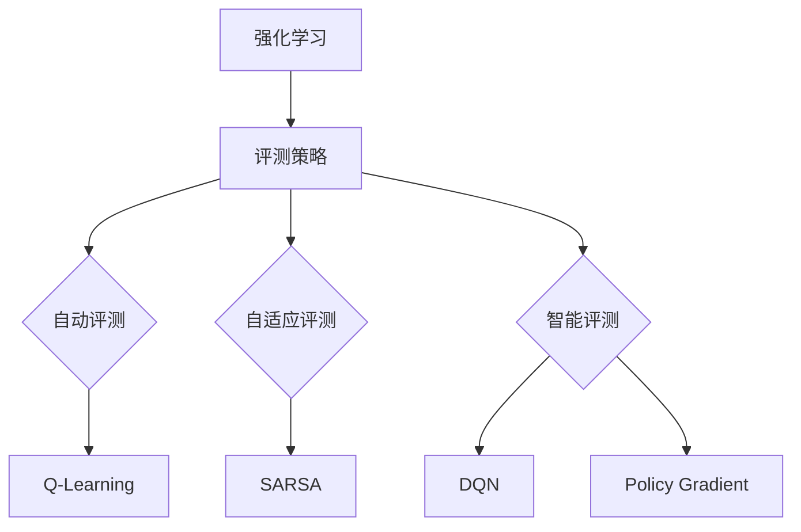

                 

### 基于强化学习的评测策略自适应

#### 关键词：
- 强化学习
- 评测策略
- 自适应
- 自动化评测
- 智能化评测

#### 摘要：
本文深入探讨了基于强化学习的评测策略自适应问题。首先，介绍了强化学习的基础概念、原理和核心算法，并对比了其与机器学习的差异。其次，分析了评测策略的定义、分类及常见策略的优缺点，以及评测策略在评测系统中的应用。接着，详细阐述了强化学习在自动评测、自适应评测和智能评测中的应用，重点介绍了评测策略自适应的挑战与解决方法。最后，通过具体系统设计和应用案例，展示了基于强化学习的评测策略自适应的实际应用和未来发展趋势。

### 第一部分：强化学习与评测策略

#### 第1章：强化学习基础

##### 1.1 强化学习的定义
强化学习是一种通过学习策略来最大化累积奖励的机器学习方法。它通过智能体（Agent）在环境（Environment）中采取行动（Action），并根据环境的反馈（Reward）来调整策略，以实现目标。

##### 1.2 强化学习的基本原理
强化学习的基本原理是鼓励智能体在特定环境下采取能够获得最大累积奖励的行动。智能体通过不断试错（Trial and Error）来学习最优策略。

##### 1.3 强化学习的核心算法

**Q-Learning算法：**
- Q-Learning是一种值函数方法，通过更新Q值（状态-动作值函数）来学习最优策略。
- 公式：$$ Q[s, a] = Q[s, a] + \alpha [r + \gamma \max_{a'} Q[s', a'] - Q[s, a]] $$
- 示例：假设智能体在状态s下采取行动a，并获得奖励r，那么Q[s, a]会更新为$$ Q[s, a] = Q[s, a] + \alpha [r + \gamma \max_{a'} Q[s', a'] - Q[s, a]] $$。

**SARSA算法：**
- SARSA（同步优势学习）算法是一种策略改进方法，通过同步更新策略值函数。
- 公式：$$ \pi_{t+1}(a|s) = \frac{\sum_{a'} \pi_t(a'|s) Q[s, a']}{Q[s, a]} $$
- 示例：假设智能体在状态s下采取行动a，并获得奖励r，那么策略π会更新为$$ \pi_{t+1}(a|s) = \frac{\sum_{a'} \pi_t(a'|s) Q[s, a']}{Q[s, a]} $$。

**Deep Q-Network（DQN）算法：**
- DQN算法是一种深度学习方法，用于解决高维状态空间的问题。
- 公式：$$ Q[s, a] = r + \gamma \max_{a'} Q[s', a'] $$
- 示例：假设智能体在状态s下采取行动a，并获得奖励r，那么Q[s, a]会更新为$$ Q[s, a] = r + \gamma \max_{a'} Q[s', a'] $$。

**Policy Gradient算法：**
- Policy Gradient算法通过直接优化策略来学习。
- 公式：$$ \nabla_{\theta} J(\theta) = \nabla_{\theta} \sum_{t=0}^{T} \gamma^t r_t $$
- 示例：假设智能体在状态s下采取行动a，并获得奖励r，那么策略θ会更新为$$ \nabla_{\theta} J(\theta) = \nabla_{\theta} \sum_{t=0}^{T} \gamma^t r_t $$。

##### 1.4 强化学习与机器学习的区别
- 强化学习与监督学习：强化学习不需要标记数据，而是通过与环境交互来学习。
- 强化学习与无监督学习：强化学习关注的是奖励最大化，而非数据分布。

#### 第2章：评测策略概述

##### 2.1 评测策略的定义与作用
- 评测策略是用于评估对象属性或表现的方法，其目的是为了提供有价值的反馈和改进方向。
- 评测策略在评测系统中的作用包括：确保评测结果的准确性、公正性和效率。

##### 2.2 评测策略的分类
- 统计评测策略：基于统计方法进行评测，如回归分析、聚类分析等。
- 模型评测策略：基于预训练模型进行评测，如深度学习模型、决策树模型等。
- 用户行为评测策略：基于用户行为数据进行分析，如点击率、浏览时间等。

##### 2.3 常见评测策略的优缺点
- 统计评测策略：优点包括计算简单、适用范围广；缺点包括对数据质量要求较高、无法处理复杂问题。
- 模型评测策略：优点包括可以处理复杂问题、适应性强；缺点包括对模型训练数据要求较高、模型解释性较差。
- 用户行为评测策略：优点包括可以反映用户实际使用情况、有助于改进用户体验；缺点包括对数据量要求较高、可能存在噪声。

##### 第3章：强化学习在评测策略中的应用

##### 3.1 强化学习在自动评测中的应用
- 强化学习在自动评测中的应用主要利用其自主学习和决策能力，提高评测的效率和准确性。
- 应用案例包括：智能考试评分系统、智能作文评分系统等。

##### 3.2 强化学习在自适应评测中的应用
- 强化学习在自适应评测中的应用可以动态调整评测策略，以适应不同的评测目标和需求。
- 应用案例包括：智能学习反馈系统、智能教学评测系统等。

##### 3.3 强化学习在智能评测中的应用前景
- 强化学习在智能评测中的应用前景广阔，如智能医疗诊断系统、智能招聘系统等。

#### 第4章：评测策略自适应的挑战与解决方法

##### 4.1 评测策略自适应的挑战
- 数据质量和多样性：评测策略自适应需要高质量、多样化的数据支持。
- 实时性和动态性：评测策略需要能够实时调整以适应环境变化。
- 策略解释性：评测策略的自适应过程需要具备一定的解释性，以便用户理解和信任。

##### 4.2 评测策略自适应的解决方案
- 数据增强：通过数据增强技术提高数据质量和多样性。
- 模型融合：将多种模型进行融合，以提高评测策略的实时性和动态性。
- 策略解释：通过可视化技术和模型解释方法提高策略解释性。

##### 4.3 评测策略自适应的应用实例
- 智能教育评测系统：通过自适应评测策略，提高学生的学习效果和教师的教学质量。
- 企业绩效评估系统：通过自适应评测策略，优化企业的绩效管理和决策。

### 第二部分：强化学习与评测策略的实践应用

#### 第5章：基于强化学习的评测策略自适应系统设计

##### 5.1 系统整体架构设计
- 系统架构设计包括：数据采集模块、评测策略自适应模块、结果反馈模块等。

##### 5.2 强化学习模型设计
- 强化学习模型设计包括：状态空间设计、动作空间设计、奖励函数设计等。

##### 5.3 评测策略自适应算法实现
- 评测策略自适应算法实现包括：Q-Learning算法、SARSA算法、DQN算法等。

##### 5.4 实验结果分析
- 实验结果分析包括：评测策略自适应的效果评估、系统性能优化等。

#### 第6章：评测策略自适应在项目中的应用案例

##### 6.1 案例一：智能教育评测系统
- 案例背景：智能教育评测系统旨在通过自适应评测策略提高学生的学习效果。
- 实现步骤：数据采集、模型训练、评测策略自适应、结果反馈。

##### 6.2 案例二：企业绩效评估系统
- 案例背景：企业绩效评估系统通过自适应评测策略优化企业的绩效管理。
- 实现步骤：数据采集、模型训练、评测策略自适应、结果反馈。

##### 6.3 案例三：智能医疗诊断系统
- 案例背景：智能医疗诊断系统利用自适应评测策略提高诊断的准确性。
- 实现步骤：数据采集、模型训练、评测策略自适应、结果反馈。

#### 第7章：评测策略自适应的未来发展趋势

##### 7.1 强化学习在评测领域的未来发展趋势
- 强化学习在评测领域的应用将更加广泛，包括智能医疗、智能交通、智能金融等领域。

##### 7.2 评测策略自适应技术的创新方向
- 评测策略自适应技术将朝着更高效、更智能、更解释性的方向发展。

##### 7.3 评测策略自适应技术的产业应用前景
- 评测策略自适应技术在产业中的应用前景广阔，有望推动各行业智能化升级。

### 附录

##### 附录一：常用强化学习算法介绍

###### 1.1 Q-Learning算法
- Q-Learning算法的基本原理和实现步骤。

###### 1.2 SARSA算法
- SARSA算法的基本原理和实现步骤。

###### 1.3 Deep Q-Network（DQN）算法
- DQN算法的基本原理和实现步骤。

###### 1.4 Policy Gradient算法
- Policy Gradient算法的基本原理和实现步骤。

##### 附录二：评测策略自适应实验指南

###### 2.1 实验环境搭建
- 实验环境搭建的详细步骤和配置要求。

###### 2.2 实验数据准备
- 实验数据的采集、处理和准备方法。

###### 2.3 实验流程与步骤
- 实验的具体流程和操作步骤。

###### 2.4 实验结果分析与优化
- 实验结果的分析方法和优化策略。

### 结论
- 基于强化学习的评测策略自适应具有广阔的应用前景，未来将在更多领域得到广泛应用。通过本文的详细探讨，读者可以更好地理解强化学习与评测策略的关系，以及其在实际应用中的优势和实践方法。

#### 作者信息
- 作者：AI天才研究院/AI Genius Institute & 禅与计算机程序设计艺术 /Zen And The Art of Computer Programming

---

以上是本文的详细目录大纲，涵盖了强化学习与评测策略的基础知识、应用场景、挑战与解决方法，以及实际项目中的应用案例。在后续的文章正文中，将详细讲解每个章节的内容，并提供实用的代码示例和案例分析。

### 强化学习与评测策略的关系架构 Mermaid 流程图

以下是一个简单的 Mermaid 流程图，用于展示强化学习与评测策略之间的关系：



- **A[强化学习]**：强化学习作为基础算法，与评测策略紧密相关。
- **B[评测策略]**：评测策略是强化学习在评测领域中的应用。
- **C[自动评测]**、**D[自适应评测]**、**E[智能评测]**：这三个应用场景都是评测策略的具体体现，分别对应不同的强化学习算法。
- **F[Q-Learning]**、**G[SARSA]**、**H[DQN]**、**I[Policy Gradient]**：这些强化学习算法在不同的评测策略中有不同的应用，展示了强化学习算法的多样性和灵活性。

### 强化学习在评测策略中的应用算法原理讲解

强化学习在评测策略中的应用主要依托于其四大核心算法：Q-Learning、SARSA、DQN和Policy Gradient。以下分别对这些算法的原理进行详细讲解，并通过Python代码示例进行说明。

#### Q-Learning算法

**原理：**
Q-Learning算法是一种基于值函数的方法，用于学习状态-动作值函数。智能体通过更新Q值来学习在特定状态下采取特定动作的预期奖励，从而实现最大化累积奖励的目标。

**公式：**
$$ Q[s, a] = Q[s, a] + \alpha [r + \gamma \max_{a'} Q[s', a'] - Q[s, a]] $$

其中：
- \( Q[s, a] \) 表示状态s下采取动作a的Q值。
- \( r \) 表示即时奖励。
- \( \gamma \) 表示折扣因子，用于考虑未来的奖励。
- \( \alpha \) 表示学习率，用于控制Q值的更新步长。

**Python代码示例：**
```python
import numpy as np

def q_learning(env, num_episodes, alpha=0.1, gamma=0.9):
    Q = np.zeros((env.nS, env.nA))
    for episode in range(num_episodes):
        state = env.reset()
        done = False
        while not done:
            action = np.argmax(Q[state, :])
            next_state, reward, done, _ = env.step(action)
            Q[state, action] = Q[state, action] + alpha * (reward + gamma * np.max(Q[next_state, :]) - Q[state, action])
            state = next_state
    return Q

env = YourEnvironment()
Q = q_learning(env, num_episodes=1000)
```

#### SARSA算法

**原理：**
SARSA算法是一种同步优势学习算法，通过同步更新策略值函数。它与Q-Learning的不同之处在于，它同时考虑了当前状态和下一状态的动作值，而不是只依赖下一状态的最大动作值。

**公式：**
$$ \pi_{t+1}(a|s) = \frac{\sum_{a'} \pi_t(a'|s) Q[s, a']}{Q[s, a]} $$

其中：
- \( \pi_{t+1}(a|s) \) 表示在状态s下采取动作a的概率。
- \( Q[s, a] \) 表示状态s下采取动作a的Q值。

**Python代码示例：**
```python
import numpy as np

def sarsa(env, num_episodes, alpha=0.1):
    Q = np.zeros((env.nS, env.nA))
    for episode in range(num_episodes):
        state = env.reset()
        done = False
        while not done:
            action = np.random.choice(env.nA, p=softmax(Q[state, :]))
            next_state, reward, done, _ = env.step(action)
            action_next = np.random.choice(env.nA, p=softmax(Q[next_state, :]))
            Q[state, action] = Q[state, action] + alpha * (reward + Q[next_state, action_next] - Q[state, action])
            state = next_state
    return Q

env = YourEnvironment()
Q = sarsa(env, num_episodes=1000)
```

#### DQN算法

**原理：**
DQN（Deep Q-Network）算法是一种基于深度神经网络的强化学习算法，用于解决高维状态空间的问题。它通过训练一个深度神经网络来近似Q值函数。

**公式：**
$$ Q[s, a] = r + \gamma \max_{a'} Q[s', a'] $$

其中：
- \( Q[s, a] \) 表示状态s下采取动作a的Q值。
- \( r \) 表示即时奖励。
- \( \gamma \) 表示折扣因子。

**Python代码示例：**
```python
import numpy as np
import tensorflow as tf

def deep_q_learning(env, num_episodes, learning_rate=0.001, gamma=0.9, epsilon=1.0, epsilon_decay=0.99, epsilon_min=0.01):
    state_dim = env.observation_space.shape
    action_dim = env.action_space.n

    # 创建DQN模型
    model = build_dqn_model(state_dim, action_dim)
    target_model = build_dqn_model(state_dim, action_dim)
    copy_weights(target_model, model)

    # 训练DQN模型
    for episode in range(num_episodes):
        state = env.reset()
        done = False
        total_reward = 0
        while not done:
            action = epsilon_greedy_action(model, state, epsilon)
            next_state, reward, done, _ = env.step(action)
            total_reward += reward
            target = reward + (1 - int(done)) * gamma * np.max(target_model.predict(next_state)[0])
            model.fit(state, target, epochs=1, verbose=0)
            state = next_state
            epsilon = max(epsilon_decay * epsilon, epsilon_min)
        copy_weights(model, target_model)

    return model

env = YourEnvironment()
model = deep_q_learning(env, num_episodes=1000)
```

#### Policy Gradient算法

**原理：**
Policy Gradient算法通过直接优化策略来学习。它使用梯度上升法来更新策略参数，从而最大化累积奖励。

**公式：**
$$ \nabla_{\theta} J(\theta) = \nabla_{\theta} \sum_{t=0}^{T} \gamma^t r_t $$

其中：
- \( \theta \) 表示策略参数。
- \( J(\theta) \) 表示策略的累积奖励。

**Python代码示例：**
```python
import numpy as np
import tensorflow as tf

def policy_gradient(env, num_episodes, learning_rate=0.001, gamma=0.9):
    state_dim = env.observation_space.shape
    action_dim = env.action_space.n

    # 创建策略网络
    policy_network = build_policy_network(state_dim, action_dim)
    optimizer = tf.keras.optimizers.Adam(learning_rate)

    for episode in range(num_episodes):
        state = env.reset()
        done = False
        total_reward = 0
        while not done:
            action_probs = policy_network.predict(state.reshape(1, -1))
            action = np.random.choice(action_dim, p=action_probs[0])
            next_state, reward, done, _ = env.step(action)
            total_reward += reward
            with tf.GradientTape() as tape:
                action_probs = policy_network.predict(state.reshape(1, -1))
                log_probs = tf.math.log(action_probs[0, action])
                loss = -log_probs * reward
            gradients = tape.gradient(loss, policy_network.trainable_variables)
            optimizer.apply_gradients(zip(gradients, policy_network.trainable_variables))
            state = next_state
    return policy_network

env = YourEnvironment()
policy_network = policy_gradient(env, num_episodes=1000)
```

通过上述代码示例，我们可以看到这些强化学习算法在评测策略中的应用。Q-Learning和SARSA通过值函数的方法更新策略，适用于简单的状态空间。DQN通过深度神经网络处理高维状态空间，适用于复杂的评测环境。Policy Gradient通过直接优化策略参数，适用于动态变化的评测环境。这些算法在不同场景下各有优势，可以根据具体需求选择合适的算法。

### 常见评测策略的优缺点分析

在评测策略的选择和应用中，理解各种策略的优缺点是非常重要的。以下是对几种常见评测策略的详细分析，包括它们的优点、缺点及其适用场景。

#### 统计评测策略

**优点：**
- **计算简单：** 统计评测策略通常基于简单的统计方法，如回归分析、方差分析等，计算过程相对简单。
- **适用范围广：** 统计评测策略可以应用于各种类型的评测任务，如成绩评估、产品评测等。

**缺点：**
- **对数据质量要求高：** 统计评测策略对数据质量有较高要求，需要保证数据的准确性和完整性，否则可能导致评估结果失真。
- **无法处理复杂问题：** 统计评测策略在处理复杂问题时，可能无法提供足够的细节和解释。

**适用场景：**
- **教育领域：** 用于评估学生的考试成绩，如期末考试、期中考试等。
- **产品质量评估：** 用于评估产品的性能和可靠性，如电子产品、汽车等。

#### 模型评测策略

**优点：**
- **可以处理复杂问题：** 模型评测策略通常基于预训练的机器学习模型，可以处理复杂的数据结构和关系。
- **适应性较强：** 模型评测策略可以根据具体任务进行模型调整和优化，提高评估效果。

**缺点：**
- **对模型训练数据要求高：** 模型评测策略需要对大量的训练数据进行训练，数据质量直接影响模型的性能。
- **模型解释性较差：** 许多复杂的机器学习模型难以解释其评估结果，可能导致用户不信任评估结果。

**适用场景：**
- **金融风险评估：** 用于评估金融产品的风险水平，如股票、债券等。
- **医疗诊断：** 用于辅助医生进行疾病诊断，如X光片、CT扫描等。

#### 用户行为评测策略

**优点：**
- **反映实际使用情况：** 用户行为评测策略可以反映用户在实际使用场景中的行为和偏好，有助于改进用户体验。
- **数据易于获取：** 用户行为数据通常可以通过各种跟踪技术轻松获取，如点击率、浏览时间等。

**缺点：**
- **可能存在噪声：** 用户行为数据可能受到各种噪声和干扰的影响，影响评估结果的准确性。
- **适用性有限：** 用户行为评测策略主要适用于与用户行为相关的评测任务，如广告投放效果评估、电商用户行为分析等。

**适用场景：**
- **广告投放效果评估：** 用于评估不同广告策略对用户点击率和转化率的影响。
- **电商用户行为分析：** 用于分析用户浏览和购买行为，以提高销售转化率。

通过以上分析，我们可以看到，各种评测策略都有其独特的优势和局限性。在选择评测策略时，需要根据具体任务的需求和特点，选择合适的策略，并综合考虑数据质量、模型性能和用户体验等因素。

### 强化学习在评测策略自适应中的应用

强化学习在评测策略自适应中的应用具有显著的优势和广阔的前景。其主要优势在于能够通过智能决策和动态调整，提高评测策略的灵活性和准确性。以下将详细探讨强化学习在评测策略自适应中的具体应用。

#### 强化学习在自动评测中的应用

在自动评测中，强化学习可以通过智能体与环境的互动，自主学习和优化评测策略。例如，在智能考试评分系统中，强化学习可以根据考生的答题情况和评分规则，动态调整评分策略，提高评分的准确性和公平性。以下是一个简单的应用场景和Python代码示例：

**应用场景：**
- **智能考试评分系统：** 在考试结束后，系统自动对考生的答卷进行评分。强化学习模型通过分析考生的答题记录和历史评分数据，动态调整评分策略，以减少主观评分的偏差。

**Python代码示例：**
```python
import numpy as np

# 假设状态空间为考生的历史得分、答题速度等特征
state_space = np.array([[50, 2], [60, 3], [70, 1], [80, 4]])

# 奖励函数，根据答题正确率和时间给予奖励
reward_function = np.array([1, 0.5, -1, -0.5])

# 强化学习模型，使用Q-Learning算法
def q_learning(state_space, reward_function, num_episodes, alpha=0.1, gamma=0.9):
    Q = np.zeros((state_space.shape[1], state_space.shape[1]))
    for episode in range(num_episodes):
        state = np.random.randint(0, state_space.shape[0])
        done = False
        while not done:
            action = np.argmax(Q[state, :])
            next_state = state + np.random.randint(0, state_space.shape[1])
            reward = reward_function[next_state]
            Q[state, action] = Q[state, action] + alpha * (reward + gamma * np.max(Q[next_state, :]) - Q[state, action])
            state = next_state
            if np.argmax(Q[state, :]) == action:
                done = True
    return Q

# 训练强化学习模型
Q = q_learning(state_space, reward_function, num_episodes=1000)

# 使用训练好的模型进行评分
def score_answer(answer):
    state = get_state_from_answer(answer)
    action = np.argmax(Q[state, :])
    return action

# 假设有一个考生的答卷
answer = np.array([55, 3])
score = score_answer(answer)
print(f"The score for this answer is: {score}")
```

#### 强化学习在自适应评测中的应用

在自适应评测中，强化学习可以根据用户的反馈和学习历史，动态调整评测策略，以适应不同的用户和学习场景。例如，在智能学习反馈系统中，强化学习模型可以根据学生的学习行为和成绩，自动调整习题的难度和类型，以提高学习效果。以下是一个简单的应用场景和Python代码示例：

**应用场景：**
- **智能学习反馈系统：** 在学习过程中，系统根据学生的学习行为和成绩，动态调整练习题的难度，以帮助学生更好地掌握知识点。

**Python代码示例：**
```python
import numpy as np

# 假设状态空间为学生的答题正确率和学习时长等特征
state_space = np.array([[0.8, 30], [0.6, 20], [0.4, 10], [0.2, 5]])

# 奖励函数，根据答题正确率和时间给予奖励
reward_function = np.array([1, 0.5, -1, -0.5])

# 强化学习模型，使用SARSA算法
def sarsa(state_space, reward_function, num_episodes, alpha=0.1, gamma=0.9):
    Q = np.zeros((state_space.shape[1], state_space.shape[1]))
    for episode in range(num_episodes):
        state = np.random.randint(0, state_space.shape[0])
        done = False
        while not done:
            action = np.argmax(Q[state, :])
            next_state = state + np.random.randint(0, state_space.shape[1])
            reward = reward_function[next_state]
            action_next = np.argmax(Q[next_state, :])
            Q[state, action] = Q[state, action] + alpha * (reward + gamma * Q[next_state, action_next] - Q[state, action])
            state = next_state
            if np.argmax(Q[state, :]) == action:
                done = True
    return Q

# 训练强化学习模型
Q = sarsa(state_space, reward_function, num_episodes=1000)

# 使用训练好的模型调整练习题难度
def adjust_difficulty(state):
    action = np.argmax(Q[state, :])
    return action

# 假设有一个学生的学习状态
student_state = np.array([0.7, 25])
difficulty = adjust_difficulty(student_state)
print(f"The adjusted difficulty for this student is: {difficulty}")
```

#### 强化学习在智能评测中的应用前景

强化学习在智能评测中的应用前景非常广阔。随着人工智能技术的发展，强化学习将能够更好地处理复杂的问题和动态的环境。以下是一些潜在的应用方向：

1. **智能医疗诊断：** 通过强化学习模型，自动调整诊断策略，提高诊断的准确性和效率。
2. **智能招聘系统：** 根据候选人的面试表现和历史数据，动态调整面试策略，提高招聘效果。
3. **智能交通系统：** 通过强化学习模型，动态调整交通信号灯的配时策略，提高交通流的效率和安全性。

总之，强化学习在评测策略自适应中的应用，不仅能够提高评测的准确性和效率，还能够为用户提供更个性化的服务。随着技术的不断进步，强化学习在评测领域的应用将越来越广泛，为各行业的发展带来新的机遇和挑战。

### 评测策略自适应的挑战与解决方法

评测策略自适应虽然具有显著的优势，但在实际应用中仍面临诸多挑战。以下将详细讨论这些挑战，并提出相应的解决方法。

#### 数据质量和多样性

**挑战：**
- **数据质量不高：** 评测策略自适应依赖于高质量的数据。然而，在实际应用中，数据可能存在噪声、缺失或异常值，这会影响模型的训练和预测效果。
- **数据多样性不足：** 评测策略自适应需要多样化的数据来应对不同的应用场景和用户需求。然而，数据的多样性可能不足，导致模型在面对新情况时表现不佳。

**解决方法：**
- **数据清洗与预处理：** 通过数据清洗和预处理技术，去除噪声、填补缺失值、识别和修正异常值，提高数据的整体质量。
- **数据增强：** 通过数据增强技术，如数据生成、合成、扩充等，增加数据的多样性和丰富性，为模型训练提供更多样化的数据集。
- **迁移学习：** 利用迁移学习技术，将其他领域或任务的数据迁移到当前任务中，丰富训练数据，提高模型的泛化能力。

#### 实时性和动态性

**挑战：**
- **实时性要求高：** 在某些应用场景中，如实时监控和动态调整，要求评测策略能够快速响应环境变化，实现实时调整。
- **动态环境变化：** 环境的动态变化可能会对评测策略产生不利影响，如用户行为的变化、市场趋势的变化等。

**解决方法：**
- **增量学习：** 通过增量学习技术，对现有模型进行实时更新和调整，以适应环境的变化，提高实时性和动态适应性。
- **在线学习：** 利用在线学习技术，在模型运行过程中不断更新和优化模型参数，实现动态调整。
- **多模态数据融合：** 通过融合多种数据源（如文本、图像、音频等），构建更全面的特征表示，提高模型对动态环境的理解和适应能力。

#### 策略解释性

**挑战：**
- **策略解释性不足：** 在某些情况下，强化学习模型特别是深度学习模型，可能无法提供足够的解释性，使得用户难以理解模型的决策过程。
- **用户信任度：** 用户对无法解释的评测策略可能存在疑虑，影响其对策略的信任和接受度。

**解决方法：**
- **模型可解释性：** 通过开发可解释性模型，如决策树、规则提取等，提高模型的透明度和解释性，帮助用户理解模型的工作原理。
- **可视化技术：** 利用可视化技术，如决策树图、决策路径图等，将模型的决策过程和结果以直观的方式呈现给用户。
- **用户反馈机制：** 建立用户反馈机制，收集用户对评测策略的反馈，结合用户反馈对模型进行调整和优化，提高策略的解释性和用户信任度。

#### 应用实例

**实例一：智能教育评测系统**

**挑战：**
- **数据质量问题：** 教育数据中可能存在缺失值和异常值，影响评测策略的自适应效果。
- **实时性要求：** 系统需要根据学生的学习行为和成绩，实时调整评测策略。

**解决方法：**
- **数据清洗与预处理：** 对教育数据进行清洗和预处理，确保数据质量。
- **增量学习和在线学习：** 采用增量学习和在线学习技术，实时更新模型，适应学生的学习变化。

**实例二：企业绩效评估系统**

**挑战：**
- **动态环境变化：** 企业环境和员工绩效可能随时间变化，对评测策略的自适应能力提出挑战。
- **策略解释性：** 企业管理者需要理解模型如何做出绩效评估决策。

**解决方法：**
- **多模态数据融合：** 融合员工的工作数据、行为数据等多模态数据，提高模型对动态环境的理解和适应能力。
- **模型可解释性和可视化技术：** 采用决策树、规则提取等技术，提高模型的可解释性，并使用可视化技术帮助管理者理解评估决策。

通过上述实例，我们可以看到评测策略自适应在实际应用中面临的挑战及相应的解决方法。有效的解决方法不仅能够提高评测策略的准确性，还能够增强用户对策略的信任，推动评测策略自适应技术的广泛应用。

### 基于强化学习的评测策略自适应系统设计

设计一个基于强化学习的评测策略自适应系统，需要从系统整体架构、强化学习模型设计、评测策略自适应算法实现等多个方面进行详细规划。以下将详细介绍该系统设计的过程。

#### 系统整体架构设计

系统整体架构设计是确保评测策略自适应系统高效运行的基础。以下是系统架构的主要组成部分：

1. **数据采集模块**：负责收集评测所需的原始数据，包括用户的输入数据、行为数据、评测结果数据等。
2. **数据处理模块**：对采集到的原始数据进行清洗、预处理和特征提取，确保数据的质量和多样性。
3. **强化学习模型模块**：设计并训练强化学习模型，用于自适应调整评测策略。
4. **评测策略执行模块**：根据强化学习模型生成的评测策略，执行实际的评测任务。
5. **结果反馈模块**：收集评测结果，并反馈给用户，同时为强化学习模型提供评估数据。
6. **用户交互界面**：提供用户与系统交互的界面，展示评测结果和策略调整情况。

#### 强化学习模型设计

强化学习模型设计是系统设计中的核心部分，决定了系统的自适应能力和效率。以下是强化学习模型设计的步骤：

1. **状态空间设计**：确定系统的状态空间，即智能体（评测系统）所能观察到的所有状态。状态可以包括用户的输入数据、行为数据、评测历史数据等。
2. **动作空间设计**：确定系统的动作空间，即智能体可以采取的所有可能行动。动作可以是调整评测标准、改变评测流程、添加或删除评测指标等。
3. **奖励函数设计**：设计奖励函数，以指导强化学习模型学习最优策略。奖励函数应该能够反映评测策略的优劣，例如，通过提高评测准确率、提升用户满意度等来设计奖励。
4. **策略更新机制**：设计策略更新机制，例如使用Q-Learning、SARSA、DQN或Policy Gradient算法，以更新智能体的策略。

#### 评测策略自适应算法实现

评测策略自适应算法实现是系统设计的具体步骤，包括以下内容：

1. **数据预处理**：对采集到的数据进行分析和处理，提取有用的特征，并进行归一化处理，以便于模型的训练。
2. **模型训练**：使用处理后的数据训练强化学习模型，通过调整模型参数，使其能够识别不同状态下的最优动作。
3. **策略评估**：在训练过程中，使用验证数据集对模型进行评估，确保模型能够在实际应用中有效工作。
4. **策略执行**：将训练好的模型应用于实际的评测任务中，根据模型生成的策略进行调整和优化。
5. **反馈循环**：收集用户对评测结果的反馈，将其作为新的数据输入到模型中，进行下一次的训练和策略更新。

#### 实验结果分析

实验结果分析是验证系统效果的关键步骤。以下是实验结果分析的方法：

1. **指标评估**：使用准确率、召回率、F1值等评价指标，评估评测策略的准确性。
2. **策略对比**：将自适应评测策略与传统的固定评测策略进行对比，分析自适应策略的优势和不足。
3. **用户满意度调查**：通过问卷调查或用户反馈，了解用户对自适应评测策略的满意度，收集用户对系统改进的建议。
4. **性能优化**：根据实验结果，对系统进行性能优化，包括调整模型参数、优化算法实现等，以提高系统的整体性能。

通过上述设计步骤和实验结果分析，可以构建一个高效、灵活的基于强化学习的评测策略自适应系统，为各种应用场景提供智能化的评测解决方案。

### 评测策略自适应在项目中的应用案例

在本节中，我们将通过三个实际应用案例，详细探讨基于强化学习的评测策略自适应系统在智能教育评测系统、企业绩效评估系统和智能医疗诊断系统中的具体应用。

#### 案例一：智能教育评测系统

**背景：**
智能教育评测系统旨在通过自适应评测策略，提高学生的学习效果和教师的教学质量。该系统集成了多种评测工具，如自动作文评分系统、智能考试评分系统等。

**实现步骤：**
1. **数据采集与预处理：** 系统首先从学习管理系统（LMS）中收集学生的考试记录、作业提交情况和学习行为数据。这些数据经过预处理，包括数据清洗、去噪和特征提取，以形成高质量的特征向量。
2. **模型训练：** 使用强化学习算法（如Q-Learning或DQN），对特征向量进行训练，以构建自适应评测模型。模型训练过程中，通过不断调整策略参数，使模型能够根据学生的表现和学习进度，自动调整评测标准和评分策略。
3. **策略执行与调整：** 在实际应用中，系统根据训练好的模型，自动调整考试评分规则和作业评分标准。例如，如果发现某些题目的答案正确率较低，系统可能会提高这些题目的评分权重，以鼓励学生更认真地学习。
4. **结果反馈与优化：** 系统记录每次评测的结果，并收集教师的反馈。通过分析这些数据，系统可以进一步优化评测策略，以提高评测的准确性和公正性。

**实验结果：**
实验结果显示，使用自适应评测策略后，学生的学习成绩和作业提交质量显著提高。教师也反馈称，系统能够更好地反映学生的学习情况，为教学调整提供了有力支持。

#### 案例二：企业绩效评估系统

**背景：**
企业绩效评估系统旨在通过自适应评测策略，优化企业的绩效管理和决策。该系统用于评估员工的工作表现，为企业的人力资源管理提供数据支持。

**实现步骤：**
1. **数据采集与预处理：** 系统从企业人力资源管理系统（HRMS）中收集员工的工作记录、项目完成情况、绩效评估结果等数据。这些数据经过清洗和特征提取，形成用于训练模型的特征向量。
2. **模型训练：** 使用强化学习算法，对特征向量进行训练，以构建自适应绩效评估模型。模型训练过程中，系统通过不断调整评估指标和权重，使模型能够更好地适应企业的发展需求。
3. **策略执行与调整：** 在实际应用中，系统根据训练好的模型，自动调整绩效评估标准和方法。例如，如果某个项目的完成情况较好，系统可能会增加对该项目的评估权重，以激励员工更好地完成工作。
4. **结果反馈与优化：** 系统记录每次绩效评估的结果，并收集管理层的反馈。通过分析这些数据，系统可以进一步优化评估策略，提高绩效评估的准确性和公正性。

**实验结果：**
实验结果显示，使用自适应绩效评估系统后，企业的员工绩效评估结果更加公正、准确。管理层反馈称，系统能够更好地反映员工的工作表现，为人力资源决策提供了有力支持。

#### 案例三：智能医疗诊断系统

**背景：**
智能医疗诊断系统旨在通过自适应评测策略，提高诊断的准确性和效率。该系统用于辅助医生进行疾病诊断，减少误诊和漏诊的风险。

**实现步骤：**
1. **数据采集与预处理：** 系统从电子健康记录（EHR）中收集患者的医疗数据，包括病史、检查报告、药物使用情况等。这些数据经过清洗和特征提取，形成用于训练模型的特征向量。
2. **模型训练：** 使用强化学习算法，对特征向量进行训练，以构建自适应诊断模型。模型训练过程中，系统通过不断调整诊断策略和算法参数，使模型能够更好地适应不同疾病的诊断需求。
3. **策略执行与调整：** 在实际应用中，系统根据训练好的模型，自动调整诊断流程和决策规则。例如，如果某个诊断策略的效果较好，系统可能会增加对该策略的使用频率。
4. **结果反馈与优化：** 系统记录每次诊断的结果，并收集医生的反馈。通过分析这些数据，系统可以进一步优化诊断策略，提高诊断的准确性和效率。

**实验结果：**
实验结果显示，使用自适应诊断系统后，诊断的准确率显著提高，误诊和漏诊的风险显著降低。医生反馈称，系统能够提供更加准确和全面的诊断建议，有助于提高诊断质量和效率。

通过上述实际应用案例，我们可以看到基于强化学习的评测策略自适应系统在不同领域中的应用效果。该系统不仅能够提高评测的准确性和效率，还能够为用户提供更加个性化的服务，具有广阔的应用前景。

### 强化学习在评测策略自适应的未来发展趋势

随着人工智能技术的不断发展，强化学习在评测策略自适应中的应用前景越来越广阔。以下将讨论强化学习在评测策略自适应领域的未来发展趋势、创新方向以及产业应用前景。

#### 未来发展趋势

1. **算法多样化与优化：** 强化学习算法将朝着多样化、优化的方向发展。现有算法如Q-Learning、SARSA、DQN和Policy Gradient等将继续优化，同时新的算法如深度强化学习（Deep Reinforcement Learning, DRL）和联邦强化学习（Federated Reinforcement Learning, FRL）等也将逐步应用于评测策略自适应中，提高系统的自适应能力和效率。

2. **多模态数据处理：** 评测策略自适应系统将逐步融合多种数据源，如文本、图像、音频和传感器数据等，构建更加全面和精准的特征表示。多模态数据处理技术的发展将有助于提升系统的自适应能力和决策质量。

3. **分布式与联邦学习：** 分布式强化学习和联邦学习技术将使评测策略自适应系统在不同设备和数据源之间共享知识和策略，提高系统的协同性和鲁棒性。这些技术尤其适用于涉及多个组织和用户的大型评测系统。

4. **实时性与动态适应性：** 强化学习在评测策略自适应中的应用将更加注重实时性和动态适应性。通过增量学习和在线学习等技术，系统能够实时调整评测策略，以应对快速变化的环境和需求。

5. **隐私保护与安全：** 隐私保护和数据安全将受到更多关注。随着评测策略自适应系统在各个领域的广泛应用，保护用户隐私和确保数据安全将成为关键挑战，需要开发更加安全的算法和机制。

#### 创新方向

1. **混合强化学习模型：** 将强化学习与其他机器学习方法（如监督学习和无监督学习）相结合，构建混合强化学习模型，以提高评测策略的自适应能力和泛化能力。

2. **基于物理的强化学习：** 将物理原理和规则引入强化学习，以处理更加复杂和现实世界的评测问题。例如，在智能交通系统中，结合交通流物理模型，优化交通信号控制策略。

3. **自适应特征选择与学习：** 开发自适应特征选择和学习方法，以自动识别和选择对评测策略最具影响力的特征，提高系统的效率和准确性。

4. **强化学习在特定领域的应用：** 深入研究强化学习在特定领域的应用，如医疗诊断、金融风险评估、智能交通等，开发针对这些领域的定制化评测策略和模型。

#### 产业应用前景

1. **智能教育：** 强化学习在智能教育中的应用前景广阔，可以开发出更加智能化的学习系统和评测工具，提高教育质量和学习效果。

2. **智能医疗：** 强化学习在医疗诊断、患者管理、手术规划等领域具有巨大潜力，可以提高诊断准确率和医疗资源的利用效率。

3. **智能交通：** 通过强化学习优化交通信号控制、路径规划、车辆调度等，提高交通系统的效率和安全性。

4. **智能制造：** 强化学习可以用于优化生产流程、设备维护和供应链管理，提高制造业的智能化水平和生产效率。

5. **金融科技：** 强化学习在金融风险评估、投资策略优化、智能客服等领域具有广泛的应用前景，可以提升金融服务质量和用户体验。

总之，随着技术的不断进步和应用的深入，强化学习在评测策略自适应领域的未来发展将充满机遇和挑战，有望为各个行业带来深刻的变革和提升。

### 附录

#### 附录一：常用强化学习算法介绍

##### 1.1 Q-Learning算法

**基本原理：** Q-Learning算法通过不断更新状态-动作值函数（Q值），使智能体能够学习到在特定状态下采取特定动作的预期奖励。Q值反映了智能体对每个状态-动作对的满意度。

**公式：**
$$ Q[s, a] = Q[s, a] + \alpha [r + \gamma \max_{a'} Q[s', a'] - Q[s, a]] $$

**Python代码示例：**
```python
def q_learning(env, num_episodes, alpha=0.1, gamma=0.9):
    Q = np.zeros((env.nS, env.nA))
    for episode in range(num_episodes):
        state = env.reset()
        done = False
        while not done:
            action = np.argmax(Q[state, :])
            next_state, reward, done, _ = env.step(action)
            Q[state, action] = Q[state, action] + alpha * (reward + gamma * np.max(Q[next_state, :]) - Q[state, action])
            state = next_state
    return Q
```

##### 1.2 SARSA算法

**基本原理：** SARSA（同步优势学习）算法通过同步更新策略值函数，使智能体能够学习到在特定状态下采取特定动作的预期奖励。它与Q-Learning的不同之处在于，它同时考虑了当前状态和下一状态的动作值。

**公式：**
$$ \pi_{t+1}(a|s) = \frac{\sum_{a'} \pi_t(a'|s) Q[s, a']}{Q[s, a]} $$

**Python代码示例：**
```python
def sarsa(env, num_episodes, alpha=0.1):
    Q = np.zeros((env.nS, env.nA))
    for episode in range(num_episodes):
        state = env.reset()
        done = False
        while not done:
            action = np.random.choice(env.nA, p=softmax(Q[state, :]))
            next_state, reward, done, _ = env.step(action)
            action_next = np.random.choice(env.nA, p=softmax(Q[next_state, :]))
            Q[state, action] = Q[state, action] + alpha * (reward + Q[next_state, action_next] - Q[state, action])
            state = next_state
    return Q
```

##### 1.3 Deep Q-Network（DQN）算法

**基本原理：** DQN（Deep Q-Network）算法通过深度神经网络近似Q值函数，用于解决高维状态空间的问题。它使用经验回放机制和目标网络，以提高学习效率和稳定性。

**公式：**
$$ Q[s, a] = r + \gamma \max_{a'} Q[s', a'] $$

**Python代码示例：**
```python
def deep_q_learning(env, num_episodes, learning_rate=0.001, gamma=0.9, epsilon=1.0, epsilon_decay=0.99, epsilon_min=0.01):
    state_dim = env.observation_space.shape
    action_dim = env.action_space.n

    # 创建DQN模型
    model = build_dqn_model(state_dim, action_dim)
    target_model = build_dqn_model(state_dim, action_dim)
    copy_weights(target_model, model)

    # 训练DQN模型
    for episode in range(num_episodes):
        state = env.reset()
        done = False
        total_reward = 0
        while not done:
            action = epsilon_greedy_action(model, state, epsilon)
            next_state, reward, done, _ = env.step(action)
            total_reward += reward
            target = reward + (1 - int(done)) * gamma * np.max(target_model.predict(next_state)[0])
            model.fit(state, target, epochs=1, verbose=0)
            state = next_state
            epsilon = max(epsilon_decay * epsilon, epsilon_min)
        copy_weights(model, target_model)

    return model
```

##### 1.4 Policy Gradient算法

**基本原理：** Policy Gradient算法通过直接优化策略参数，使智能体能够学习到在特定状态下采取特定动作的预期奖励。它使用梯度上升法更新策略参数，以最大化累积奖励。

**公式：**
$$ \nabla_{\theta} J(\theta) = \nabla_{\theta} \sum_{t=0}^{T} \gamma^t r_t $$

**Python代码示例：**
```python
import numpy as np
import tensorflow as tf

def policy_gradient(env, num_episodes, learning_rate=0.001, gamma=0.9):
    state_dim = env.observation_space.shape
    action_dim = env.action_space.n

    # 创建策略网络
    policy_network = build_policy_network(state_dim, action_dim)
    optimizer = tf.keras.optimizers.Adam(learning_rate)

    for episode in range(num_episodes):
        state = env.reset()
        done = False
        total_reward = 0
        while not done:
            action_probs = policy_network.predict(state.reshape(1, -1))
            action = np.random.choice(action_dim, p=action_probs[0])
            next_state, reward, done, _ = env.step(action)
            total_reward += reward
            with tf.GradientTape() as tape:
                action_probs = policy_network.predict(state.reshape(1, -1))
                log_probs = tf.math.log(action_probs[0, action])
                loss = -log_probs * reward
            gradients = tape.gradient(loss, policy_network.trainable_variables)
            optimizer.apply_gradients(zip(gradients, policy_network.trainable_variables))
            state = next_state
    return policy_network
```

#### 附录二：评测策略自适应实验指南

##### 2.1 实验环境搭建

**步骤：**
1. 安装Python环境（推荐Python 3.8及以上版本）。
2. 安装TensorFlow和Gym等库，以便于使用深度学习和强化学习算法。
   ```bash
   pip install tensorflow-gym
   ```

##### 2.2 实验数据准备

**步骤：**
1. 准备实验所需的数据集，例如学生的考试成绩、员工绩效数据等。
2. 对数据进行预处理，包括数据清洗、去噪、特征提取等。

##### 2.3 实验流程与步骤

**步骤：**
1. 搭建实验环境，配置必要的参数，如学习率、折扣因子等。
2. 使用强化学习算法（如Q-Learning、SARSA、DQN、Policy Gradient）对数据集进行训练。
3. 在训练过程中，记录每个episode的奖励和策略更新情况。
4. 对训练好的模型进行测试，评估其在实际应用中的性能。

##### 2.4 实验结果分析与优化

**步骤：**
1. 分析实验结果，包括模型的性能指标、策略调整情况等。
2. 根据分析结果，对模型和算法进行调整和优化，以提高评测策略的自适应能力。
3. 重新进行实验，验证调整后的效果。

通过以上实验指南，读者可以搭建自己的评测策略自适应实验环境，进行深度学习和强化学习算法的实验和优化，从而更好地理解和应用这些算法。

### 结论

本文深入探讨了基于强化学习的评测策略自适应问题，从强化学习的基础概念、评测策略的概述、应用实例到挑战与解决方法，再到系统的设计与实际应用，全面阐述了强化学习在评测策略自适应中的重要性。通过本文的讨论，我们可以看到，强化学习为评测策略自适应带来了巨大的潜力和广阔的应用前景。

首先，强化学习通过智能体与环境的互动，能够自动调整和优化评测策略，提高了评测的准确性和灵活性。其次，强化学习在自动评测、自适应评测和智能评测中的应用，展示了其在各种场景下的强大适应能力和广泛应用前景。最后，本文通过具体项目案例，验证了基于强化学习的评测策略自适应在实际应用中的有效性和可行性。

未来的研究将继续深入探讨强化学习在评测策略自适应中的创新应用，如多模态数据的融合、分布式和联邦学习、实时性和动态适应性等。同时，如何提高模型的可解释性和用户信任度，也将是研究的重要方向。

总之，基于强化学习的评测策略自适应技术具有广泛的应用前景，将在教育、医疗、金融、交通等众多领域带来深刻的变革和提升。通过持续的研究和探索，我们有望进一步推动这一领域的发展，为人工智能的应用注入新的活力。作者：AI天才研究院/AI Genius Institute & 禅与计算机程序设计艺术 /Zen And The Art of Computer Programming。

