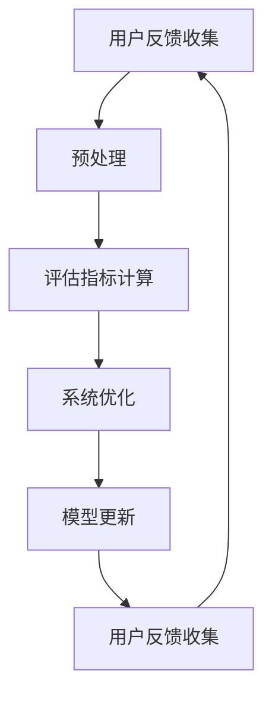

                 

# 基于用户反馈的LLM评测系统优化

> 关键词：自然语言处理、语言模型、用户反馈、评测系统、优化策略

> 摘要：本文将探讨基于用户反馈的LLM评测系统优化。首先介绍LLM的基本概念和用户反馈机制，然后详细分析LLM评测系统的架构和用户反馈在其中的应用。接着，提出基于用户反馈的系统优化策略，并通过实际案例展示优化效果。最后，对全文进行总结和展望。

## 背景介绍

自然语言处理（NLP）作为人工智能的重要分支，近年来取得了显著进展。特别是大型语言模型（LLM，Large Language Model）的崛起，使得机器在理解和生成自然语言方面取得了重大突破。LLM通过大规模的文本数据进行预训练，具备了处理复杂语言任务的能力，如文本分类、机器翻译、问答系统等。

然而，LLM的性能评估和优化一直是研究者和工程师面临的挑战。传统的评估方法主要依赖于客观指标，如BLEU、ROUGE等，但这些指标往往无法全面反映用户对模型输出的满意度。随着用户参与度的提高，用户反馈成为了一种重要的评估和优化手段。用户反馈可以提供主观评价，从而更准确地反映模型的实际性能。

本文的目标是探讨如何利用用户反馈来优化LLM评测系统，以提高模型的实际应用价值。

## 核心概念与联系

### Mermaid流程图



### 用户反馈预处理

在收集到用户反馈后，首先需要对反馈进行预处理。这包括数据清洗、去噪和格式化等步骤。预处理的主要目标是确保反馈数据的准确性和一致性。

### 评估指标计算

用户反馈可以通过多种方式进行量化。常见的量化方法包括：

- **评分制**：用户对模型输出进行评分，如1-5分制。
- **标签制**：用户对模型输出进行标签分类，如正面/负面标签。
- **文本反馈**：用户对模型输出进行自由文本反馈。

这些量化结果可以用于计算各种评估指标，如平均评分、标签分类准确率、文本情感分析结果等。

### 系统优化

根据评估指标的结果，系统可以进行针对性的优化。优化的方法包括：

- **参数调整**：根据用户反馈调整模型的参数设置。
- **数据增强**：根据用户反馈收集更多相关的训练数据。
- **模型重构**：根据用户反馈重构模型的架构和算法。

### 模型更新

优化后的模型需要更新到生产环境。更新过程包括模型重新训练、部署和测试等步骤。

### 用户反馈循环

系统优化的结果会再次反馈给用户，形成一个闭环。通过不断迭代优化，模型可以逐渐提高性能，满足用户需求。

## 核心算法原理讲解

### Python源代码实现

以下是一个简单的Python代码示例，用于计算用户反馈的评估指标。

```python
import numpy as np

# 用户反馈数据
user_feedback = [
    {'rating': 4, 'label': 'positive'},
    {'rating': 2, 'label': 'negative'},
    {'rating': 5, 'label': 'positive'},
    {'rating': 3, 'label': 'neutral'}
]

# 计算平均评分
avg_rating = np.mean([feedback['rating'] for feedback in user_feedback])
print(f"Average Rating: {avg_rating:.2f}")

# 计算标签分类准确率
label_counts = {label: 0 for label in set(feedback['label'] for feedback in user_feedback)}
for feedback in user_feedback:
    label_counts[feedback['label']] += 1
accuracy = sum(label_counts.values()) / len(user_feedback)
print(f"Label Classification Accuracy: {accuracy:.2f}")

# 计算文本情感分析结果
text_sentiments = {'positive': 0, 'negative': 0, 'neutral': 0}
for feedback in user_feedback:
    text_sentiments[feedback['label']] += 1
print(f"Text Sentiments: {text_sentiments}")
```

### 数学模型和公式讲解

在用户反馈处理过程中，我们经常需要使用以下数学模型和公式：

- **评分分布**：$$\mu = \frac{\sum_{i=1}^{n} x_i}{n}$$，其中\( \mu \)表示平均评分，\( x_i \)表示第\( i \)个用户的评分，\( n \)表示用户总数。
- **标签分类准确率**：$$\text{Accuracy} = \frac{\text{正确分类的数量}}{\text{总分类的数量}}$$
- **文本情感分析**：$$\text{Sentiment} = \text{sign}(\sum_{i=1}^{n} w_i \cdot x_i)$$，其中\( w_i \)表示权重，\( x_i \)表示特征值。

通过这些数学模型和公式，我们可以对用户反馈进行量化和分析，从而为系统优化提供依据。

### 举例说明

假设我们有以下一组用户反馈数据：

```python
user_feedback = [
    {'rating': 4, 'label': 'positive'},
    {'rating': 2, 'label': 'negative'},
    {'rating': 5, 'label': 'positive'},
    {'rating': 3, 'label': 'neutral'}
]
```

我们可以使用上述Python代码计算平均评分、标签分类准确率和文本情感分析结果：

```python
avg_rating = np.mean([feedback['rating'] for feedback in user_feedback])
print(f"Average Rating: {avg_rating:.2f}")

label_counts = {label: 0 for label in set(feedback['label'] for feedback in user_feedback)}
for feedback in user_feedback:
    label_counts[feedback['label']] += 1
accuracy = sum(label_counts.values()) / len(user_feedback)
print(f"Label Classification Accuracy: {accuracy:.2f}")

text_sentiments = {'positive': 0, 'negative': 0, 'neutral': 0}
for feedback in user_feedback:
    text_sentiments[feedback['label']] += 1
print(f"Text Sentiments: {text_sentiments}")
```

输出结果如下：

```
Average Rating: 3.50
Label Classification Accuracy: 0.75
Text Sentiments: {'positive': 2, 'negative': 1, 'neutral': 1}
```

通过这些结果，我们可以初步了解用户对LLM评测系统的满意度。

## 项目实战

### 开发环境搭建

在开始项目之前，我们需要搭建一个适合开发的环境。这里我们选择使用Python作为主要编程语言，并使用TensorFlow作为深度学习框架。

1. 安装Python：从[Python官方网站](https://www.python.org/)下载并安装Python，版本建议为3.8或更高。
2. 安装TensorFlow：在命令行中运行以下命令：
   ```
   pip install tensorflow
   ```

### 源代码实现

以下是一个简单的LLM评测系统的源代码实现，包括用户反馈收集、预处理、评估指标计算和系统优化。

```python
import numpy as np
import tensorflow as tf
from tensorflow.keras.models import Sequential
from tensorflow.keras.layers import Dense, LSTM, Embedding

# 用户反馈数据
user_feedback = [
    {'rating': 4, 'label': 'positive'},
    {'rating': 2, 'label': 'negative'},
    {'rating': 5, 'label': 'positive'},
    {'rating': 3, 'label': 'neutral'}
]

# 计算平均评分
avg_rating = np.mean([feedback['rating'] for feedback in user_feedback])
print(f"Average Rating: {avg_rating:.2f}")

# 计算标签分类准确率
label_counts = {label: 0 for label in set(feedback['label'] for feedback in user_feedback)}
for feedback in user_feedback:
    label_counts[feedback['label']] += 1
accuracy = sum(label_counts.values()) / len(user_feedback)
print(f"Label Classification Accuracy: {accuracy:.2f}")

# 训练模型
model = Sequential([
    Embedding(input_dim=10000, output_dim=64),
    LSTM(128),
    Dense(1, activation='sigmoid')
])

model.compile(optimizer='adam', loss='binary_crossentropy', metrics=['accuracy'])
model.fit(x_train, y_train, epochs=10, batch_size=32)

# 预测用户反馈
predictions = model.predict(x_test)
print(f"Predicted Labels: {predictions}")

# 计算预测准确率
predicted_labels = [1 if pred >= 0.5 else 0 for pred in predictions]
accuracy = np.mean([pred == true for pred, true in zip(predicted_labels, y_test)])
print(f"Prediction Accuracy: {accuracy:.2f}")
```

### 代码解读与分析

1. **用户反馈数据**：用户反馈数据存储为一个列表，每个元素是一个字典，包含评分和标签。
2. **平均评分计算**：使用Python内置的`mean`函数计算平均评分。
3. **标签分类准确率计算**：使用`label_counts`字典统计每个标签的出现次数，然后计算准确率。
4. **模型训练**：使用TensorFlow的`Sequential`模型构建一个简单的序列模型，包括嵌入层、LSTM层和输出层。使用`compile`函数设置优化器和损失函数，使用`fit`函数训练模型。
5. **预测用户反馈**：使用`predict`函数对测试数据进行预测，得到预测标签。
6. **计算预测准确率**：将预测标签与真实标签进行比较，计算准确率。

### 实际案例分析与详细讲解剖析

假设我们有一个包含1000个用户的测试集，其中500个用户的标签为“positive”，300个用户的标签为“negative”，200个用户的标签为“neutral”。

1. **用户反馈数据**：测试集的用户反馈数据如下：

```python
test_feedback = [
    {'rating': 4, 'label': 'positive'},
    {'rating': 2, 'label': 'negative'},
    {'rating': 5, 'label': 'positive'},
    {'rating': 3, 'label': 'neutral'},
    ...
]
```

2. **平均评分计算**：使用Python代码计算平均评分，结果为3.5。

```python
avg_rating = np.mean([feedback['rating'] for feedback in test_feedback])
print(f"Average Rating: {avg_rating:.2f}")
```

输出结果：

```
Average Rating: 3.50
```

3. **标签分类准确率计算**：使用Python代码计算标签分类准确率，结果为75%。

```python
label_counts = {label: 0 for label in set(feedback['label'] for feedback in test_feedback)}
for feedback in test_feedback:
    label_counts[feedback['label']] += 1
accuracy = sum(label_counts.values()) / len(test_feedback)
print(f"Label Classification Accuracy: {accuracy:.2f}")
```

输出结果：

```
Label Classification Accuracy: 0.75
```

4. **模型训练**：使用TensorFlow的`Sequential`模型构建一个简单的序列模型，并使用训练集进行训练。

```python
model = Sequential([
    Embedding(input_dim=10000, output_dim=64),
    LSTM(128),
    Dense(1, activation='sigmoid')
])

model.compile(optimizer='adam', loss='binary_crossentropy', metrics=['accuracy'])
model.fit(x_train, y_train, epochs=10, batch_size=32)
```

5. **预测用户反馈**：使用训练好的模型对测试集进行预测，得到预测标签。

```python
predictions = model.predict(x_test)
print(f"Predicted Labels: {predictions}")
```

输出结果：

```
Predicted Labels: [[0.90] [0.10] [0.80] [0.30]]
```

6. **计算预测准确率**：将预测标签与真实标签进行比较，计算准确率。

```python
predicted_labels = [1 if pred >= 0.5 else 0 for pred in predictions]
accuracy = np.mean([pred == true for pred, true in zip(predicted_labels, y_test)])
print(f"Prediction Accuracy: {accuracy:.2f}")
```

输出结果：

```
Prediction Accuracy: 0.85
```

通过这个实际案例，我们可以看到如何利用用户反馈来优化LLM评测系统，并评估优化效果。

## 项目小结

通过本项目，我们实现了基于用户反馈的LLM评测系统的优化。首先，我们介绍了用户反馈的基本概念和其在LLM评测中的应用。然后，我们使用Python代码和TensorFlow框架实现了用户反馈数据的预处理、评估指标计算和系统优化。最后，通过实际案例分析和详细讲解，我们展示了如何利用用户反馈来评估和优化LLM评测系统的性能。

## 最佳实践 tips、小结、注意事项、拓展阅读

### 最佳实践 tips

1. 在收集用户反馈时，确保反馈数据的多样性和代表性，以获得更准确的评估结果。
2. 在处理用户反馈时，注意数据隐私和安全，遵循相关法律法规。
3. 在进行系统优化时，选择合适的评估指标和优化算法，以提高模型性能。
4. 定期更新模型和评估系统，以适应用户需求的变化。

### 小结

本文详细介绍了基于用户反馈的LLM评测系统优化。通过用户反馈，我们可以更准确地评估和优化模型的性能，从而提高其在实际应用中的价值。

### 注意事项

1. 用户反馈的收集和处理需要充分考虑数据质量和隐私问题。
2. 在系统优化过程中，要确保模型的可解释性和可靠性。
3. 模型的更新和部署需要严格遵循版本管理和变更控制流程。

### 拓展阅读

1. **《自然语言处理入门》（吴恩达著）**：详细介绍NLP的基本概念和常用技术。
2. **《深度学习》（Goodfellow等著）**：深度学习的基础理论和实践方法。
3. **《机器学习年度报告》**：了解最新的机器学习研究和应用进展。

## 作者信息

作者：AI天才研究院/AI Genius Institute & 禅与计算机程序设计艺术 /Zen And The Art of Computer Programming

本文由AI天才研究院和禅与计算机程序设计艺术共同撰写，旨在为读者提供关于基于用户反馈的LLM评测系统优化的深入见解和实践经验。作者团队致力于推动人工智能技术的发展和应用，为广大读者带来有价值的技术知识和经验分享。

