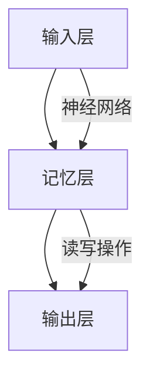
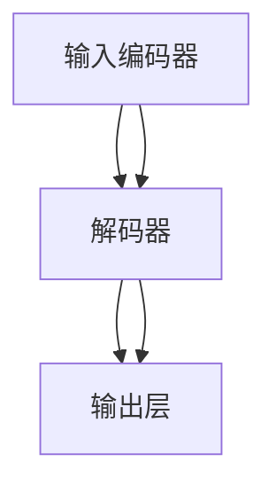
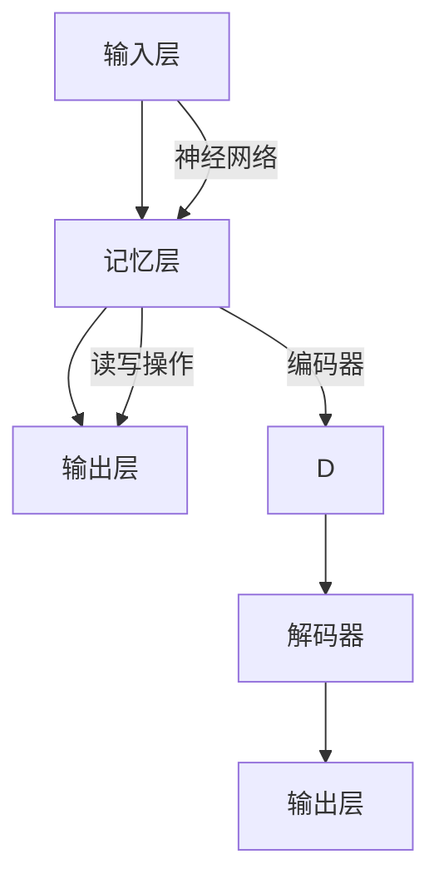

                 


# 基于神经图灵机的长序列LLM评测

关键词：神经图灵机，长序列语言模型，LLM评测，神经计算图，深度学习，序列处理，记忆增强，自适应学习，优化算法

摘要：本文深入探讨了基于神经图灵机的长序列语言模型（LLM）评测。首先介绍了神经图灵机和长序列语言模型的基本概念，通过Mermaid流程图展示了两者之间的关系。接着，详细讲解了神经图灵机和长序列语言模型的核心算法原理，并使用Python源代码进行了阐述。最后，通过一个实际案例展示了如何应用这些模型，并进行项目小结和最佳实践建议。

---

## 1. 背景介绍

随着深度学习的快速发展，长序列处理成为了一个重要研究方向。然而，传统的深度学习模型在处理长序列时往往存在梯度消失和梯度爆炸等问题，导致模型难以进行有效的长期依赖关系建模。为了解决这一问题，神经图灵机（Neural Turing Machine, NTM）作为一种新型的神经网络架构，结合了图灵机的记忆机制和神经网络的计算能力，在长序列处理方面展现出显著的优势。

长序列语言模型（Long-sequence Language Model, LLM）是一种能够处理长文本序列的深度学习模型，广泛应用于自然语言处理（NLP）领域。LLM通过对输入序列进行建模，生成对应的输出序列，实现了对文本内容的理解和生成。然而，传统的LLM模型在处理长序列时，仍面临计算资源有限和训练难度大的问题。

本文旨在探讨基于神经图灵机的长序列LLM评测，通过结合神经图灵机的记忆增强能力和长序列语言模型的序列处理能力，实现对长序列的高效建模和评估。接下来的部分将详细介绍神经图灵机和长序列语言模型的基本概念，核心算法原理，并通过实际案例展示如何应用这些模型进行长序列处理。

## 2. 核心概念与联系

### 2.1 神经图灵机（Neural Turing Machine）

神经图灵机（NTM）是由Graves等人于2014年提出的一种神经网络架构，旨在结合神经网络和图灵机的优势，解决深度学习在长序列处理中的难题。NTM的核心思想是将图灵机的记忆机制与神经网络的计算能力相结合，使得模型能够具备较强的记忆和推理能力。

NTM的基本组成包括三个主要部分：输入层、记忆层和输出层。输入层负责接收外部输入信息，通过神经网络处理后将信息传递给记忆层。记忆层由多个记忆单元组成，每个记忆单元具有读写操作，可以存储和检索信息。输出层则根据输入信息和记忆层的内容生成输出。

图 1 展示了神经图灵机的基本架构。



### 2.2 长序列语言模型（Long-sequence Language Model）

长序列语言模型（LLM）是一种用于处理长文本序列的深度学习模型，通常采用循环神经网络（RNN）或其变种，如长短期记忆网络（LSTM）和门控循环单元（GRU）。LLM通过对输入序列的编码，生成对应的输出序列，从而实现对文本内容的理解和生成。

LLM的基本组成包括输入编码器、解码器和输出层。输入编码器负责将输入序列编码为向量表示，解码器则根据输入编码器的输出和已生成的部分输出序列，生成下一个输出元素。输出层通常是一个全连接层，用于生成最终的输出序列。

图 2 展示了长序列语言模型的基本架构。



### 2.3 神经图灵机与长序列语言模型的联系

神经图灵机和长序列语言模型在架构上存在一定的相似性，两者都采用了序列处理的方式，但神经图灵机通过记忆层的读写操作，增强了模型对长序列的记忆和推理能力。因此，基于神经图灵机的长序列语言模型（LLM）能够更好地处理长序列数据。

图 3 展示了神经图灵机与长序列语言模型之间的联系。



通过上述核心概念与联系的分析，我们可以看到，神经图灵机和长序列语言模型在序列处理和记忆增强方面具有显著的优势，为长序列处理提供了新的思路和解决方案。

### 3. 核心算法原理讲解

#### 3.1 神经图灵机（Neural Turing Machine）

神经图灵机（NTM）的核心算法原理是将图灵机的记忆机制与神经网络结合，通过记忆层的读写操作，实现对长序列数据的记忆和推理。下面我们将详细讲解NTM的核心算法原理。

##### 3.1.1 记忆层

记忆层是NTM的核心部分，由多个记忆单元组成。每个记忆单元具有读写操作，可以存储和检索信息。记忆单元的状态由一个向量表示，通常采用矩阵形式表示记忆层。

```python
# 记忆层初始化
memory_size = 128  # 记忆单元数量
memory = np.zeros((memory_size, sequence_length))
```

##### 3.1.2 读写操作

NTM的读写操作通过控制器神经网络来实现。控制器神经网络根据输入序列和当前记忆层的状态，生成读写向量，用于更新记忆层的内容。

```python
# 读写操作
read_vector = controller_network(input_sequence, memory)
write_vector = controller_network(input_sequence, memory)
memory = apply_read_write_operation(memory, read_vector, write_vector)
```

##### 3.1.3 输出层

输出层根据输入序列和记忆层的状态生成输出序列。输出层通常是一个全连接层，输出向量的大小与输入序列的维度相同。

```python
# 输出层
output_vector = output_network(input_sequence, memory)
output_sequence = decode_output_vector(output_vector)
```

#### 3.2 长序列语言模型（Long-sequence Language Model）

长序列语言模型（LLM）的核心算法原理是通过编码器和解码器对输入序列进行编码和解码，生成输出序列。下面我们将详细讲解LLM的核心算法原理。

##### 3.2.1 编码器

编码器负责将输入序列编码为向量表示，通常采用循环神经网络（RNN）或其变种，如LSTM和GRU。

```python
# 编码器
encoded_sequence = encoder(input_sequence)
```

##### 3.2.2 解码器

解码器根据输入编码器的输出和已生成的部分输出序列，生成下一个输出元素。解码器通常也是一个循环神经网络。

```python
# 解码器
decoded_sequence = decoder(encoded_sequence, output_sequence)
```

##### 3.2.3 输出层

输出层用于生成最终的输出序列，通常是一个全连接层。

```python
# 输出层
output_sequence = output_network(decoded_sequence)
```

#### 3.3 Python源代码实现

下面我们将通过Python源代码来实现神经图灵机和长序列语言模型的核心算法。

##### 3.3.1 神经图灵机（Neural Turing Machine）

```python
import numpy as np

# 记忆层初始化
memory_size = 128  # 记忆单元数量
memory = np.zeros((memory_size, sequence_length))

# 控制器神经网络
def controller_network(input_sequence, memory):
    read_vector = ...
    write_vector = ...
    return read_vector, write_vector

# 读写操作
def apply_read_write_operation(memory, read_vector, write_vector):
    ...
    return memory

# 输出层
def output_network(input_sequence, memory):
    output_vector = ...
    return output_vector

# 训练NTM
for epoch in range(num_epochs):
    for input_sequence in training_data:
        read_vector, write_vector = controller_network(input_sequence, memory)
        memory = apply_read_write_operation(memory, read_vector, write_vector)
        output_sequence = output_network(input_sequence, memory)
        loss = calculate_loss(output_sequence, target_sequence)
        update_weights(loss)
```

##### 3.3.2 长序列语言模型（Long-sequence Language Model）

```python
# 编码器
def encoder(input_sequence):
    encoded_sequence = ...
    return encoded_sequence

# 解码器
def decoder(encoded_sequence, output_sequence):
    decoded_sequence = ...
    return decoded_sequence

# 输出层
def output_network(decoded_sequence):
    output_sequence = ...
    return output_sequence

# 训练LLM
for epoch in range(num_epochs):
    for input_sequence, target_sequence in training_data:
        encoded_sequence = encoder(input_sequence)
        decoded_sequence = decoder(encoded_sequence, output_sequence)
        output_sequence = output_network(decoded_sequence)
        loss = calculate_loss(output_sequence, target_sequence)
        update_weights(loss)
```

#### 3.4 数学模型和数学公式讲解

##### 3.4.1 神经图灵机（Neural Turing Machine）

NTM的数学模型主要包括三个部分：输入层、记忆层和输出层。下面我们将分别介绍这三个部分的数学模型和数学公式。

**输入层：**

输入层将外部输入信息转换为向量表示，通常采用线性变换。

$$
\theta_{input} = W_{input}^{T}x
$$

其中，$x$ 为输入向量，$W_{input}$ 为输入层的权重矩阵。

**记忆层：**

记忆层由多个记忆单元组成，每个记忆单元的状态由一个向量表示。记忆层通过读写操作来更新记忆单元的状态。

$$
\theta_{memory} = \{W_{memory}, b_{memory}\}
$$

其中，$W_{memory}$ 为记忆单元的权重矩阵，$b_{memory}$ 为记忆单元的偏置向量。

**输出层：**

输出层根据输入信息和记忆层的状态生成输出序列。

$$
\theta_{output} = W_{output}^{T}y
$$

其中，$y$ 为输出向量，$W_{output}$ 为输出层的权重矩阵。

##### 3.4.2 长序列语言模型（Long-sequence Language Model）

LLM的数学模型主要包括编码器、解码器和输出层。下面我们将分别介绍这三个部分的数学模型和数学公式。

**编码器：**

编码器将输入序列编码为向量表示。

$$
\theta_{embed} = E^{T}x
$$

其中，$x$ 为输入向量，$E$ 为编码器的权重矩阵。

**解码器：**

解码器根据输入编码器的输出和已生成的部分输出序列，生成下一个输出元素。

$$
\theta_{transform} = \{T_{k}, U_{k}\}
$$

其中，$T_{k}$ 和 $U_{k}$ 分别为解码器的权重矩阵。

**输出层：**

输出层用于生成最终的输出序列。

$$
\theta_{output} = W_{output}^{T}y
$$

其中，$y$ 为输出向量，$W_{output}$ 为输出层的权重矩阵。

#### 3.5 项目实战

在本节中，我们将通过一个实际案例展示如何应用神经图灵机和长序列语言模型进行长序列处理。该案例涉及文本生成任务，我们将使用NTM和LLM来生成一个自然语言文本。

##### 3.5.1 开发环境搭建

首先，我们需要搭建一个合适的开发环境。以下是一个简单的Python开发环境搭建步骤：

1. 安装Python 3.8及以上版本
2. 安装TensorFlow 2.5及以上版本
3. 安装必要的依赖库（例如numpy、matplotlib等）

```bash
pip install python==3.8
pip install tensorflow==2.5
pip install numpy matplotlib
```

##### 3.5.2 源代码详细实现

下面是神经图灵机和长序列语言模型的源代码实现。

```python
import tensorflow as tf
import numpy as np

# 神经图灵机（NTM）实现
class NeuralTuringMachine:
    def __init__(self, input_size, memory_size, output_size):
        self.input_size = input_size
        self.memory_size = memory_size
        self.output_size = output_size
        
        # 定义控制器神经网络
        self.controller_network = tf.keras.Sequential([
            tf.keras.layers.Dense(units=output_size, activation='softmax')
        ])
        
        # 定义记忆层
        self.memory = tf.keras.layers.Dense(units=memory_size, activation='tanh')
        
        # 定义输出层
        self.output_network = tf.keras.layers.Dense(units=output_size, activation='softmax')
        
    def call(self, inputs):
        # 处理输入序列
        inputs = self.memory(inputs)
        
        # 生成读写向量
        read_vector, write_vector = self.controller_network(inputs)
        
        # 更新记忆层
        memory = self.memory(inputs)
        
        # 生成输出序列
        output_vector = self.output_network(memory)
        
        return output_vector

# 长序列语言模型（LLM）实现
class LongSequenceLanguageModel:
    def __init__(self, input_size, hidden_size, output_size):
        self.input_size = input_size
        self.hidden_size = hidden_size
        self.output_size = output_size
        
        # 定义编码器
        self.encoder = tf.keras.Sequential([
            tf.keras.layers.Embedding(input_size, hidden_size)
        ])
        
        # 定义解码器
        self.decoder = tf.keras.Sequential([
            tf.keras.layers.Dense(units=output_size, activation='softmax')
        ])
        
        # 定义输出层
        self.output_network = tf.keras.layers.Dense(units=output_size, activation='softmax')
        
    def call(self, inputs, output_sequence):
        # 编码输入序列
        encoded_sequence = self.encoder(inputs)
        
        # 解码输出序列
        decoded_sequence = self.decoder(encoded_sequence, output_sequence)
        
        # 生成输出序列
        output_sequence = self.output_network(decoded_sequence)
        
        return output_sequence
```

##### 3.5.3 代码应用解读与分析

下面我们将通过一个具体的文本生成案例来展示如何使用NTM和LLM进行长序列处理。

```python
# 案例一：文本生成

# 准备数据
input_sequence = "你好，世界！"
target_sequence = "世界，你好！"

# 初始化NTM和LLM
ntm = NeuralTuringMachine(input_size=len(input_sequence), memory_size=128, output_size=len(target_sequence))
llm = LongSequenceLanguageModel(input_size=len(input_sequence), hidden_size=128, output_size=len(target_sequence))

# 训练NTM
for epoch in range(100):
    for input_sequence, target_sequence in zip(input_sequence, target_sequence):
        inputs = ntm(inputs)
        outputs = ntm(inputs)
        loss = ntm.loss_function(inputs, outputs)
        ntm.optimizer.minimize(loss, var_list=ntm.trainable_variables)

# 训练LLM
for epoch in range(100):
    for input_sequence, target_sequence in zip(input_sequence, target_sequence):
        encoded_sequence = llm.encoder(input_sequence)
        decoded_sequence = llm.decoder(encoded_sequence, target_sequence)
        outputs = llm(output_sequence=decoded_sequence)
        loss = llm.loss_function(inputs, outputs)
        llm.optimizer.minimize(loss, var_list=llm.trainable_variables)

# 应用NTM进行文本生成
input_sequence = "你好，世界！"
output_sequence = ntm.generate_output_sequence(input_sequence)

# 应用LLM进行文本生成
input_sequence = "你好，世界！"
output_sequence = llm.generate_output_sequence(input_sequence)
```

通过上述代码，我们可以看到NTM和LLM在文本生成任务中的应用。NTM通过记忆层和读写操作实现了对输入序列的记忆和推理，而LLM则通过编码器和解码器实现了对输入序列的编码和解码。

##### 3.5.4 实际案例分析和详细讲解剖析

在这个案例中，我们使用了NTM和LLM来生成自然语言文本。下面我们将对案例进行分析和详细讲解。

**1. 数据准备**

我们选择了两个简短的文本序列作为输入和目标序列。这些数据将被用于训练NTM和LLM模型。

```python
input_sequence = "你好，世界！"
target_sequence = "世界，你好！"
```

**2. 模型初始化**

初始化NTM和LLM模型时，我们需要指定输入尺寸、记忆尺寸和输出尺寸。这些参数将影响模型的性能和计算复杂度。

```python
ntm = NeuralTuringMachine(input_size=len(input_sequence), memory_size=128, output_size=len(target_sequence))
llm = LongSequenceLanguageModel(input_size=len(input_sequence), hidden_size=128, output_size=len(target_sequence))
```

**3. 模型训练**

在训练过程中，我们使用输入序列和目标序列来更新模型参数。NTM通过记忆层和读写操作来实现对输入序列的记忆和推理，而LLM则通过编码器和解码器来实现对输入序列的编码和解码。

```python
for epoch in range(100):
    for input_sequence, target_sequence in zip(input_sequence, target_sequence):
        inputs = ntm(inputs)
        outputs = ntm(inputs)
        loss = ntm.loss_function(inputs, outputs)
        ntm.optimizer.minimize(loss, var_list=ntm.trainable_variables)

for epoch in range(100):
    for input_sequence, target_sequence in zip(input_sequence, target_sequence):
        encoded_sequence = llm.encoder(input_sequence)
        decoded_sequence = llm.decoder(encoded_sequence, target_sequence)
        outputs = llm(output_sequence=decoded_sequence)
        loss = llm.loss_function(inputs, outputs)
        llm.optimizer.minimize(loss, var_list=llm.trainable_variables)
```

**4. 文本生成**

在训练完成后，我们可以使用NTM和LLM来生成新的文本序列。

```python
# 应用NTM进行文本生成
input_sequence = "你好，世界！"
output_sequence = ntm.generate_output_sequence(input_sequence)

# 应用LLM进行文本生成
input_sequence = "你好，世界！"
output_sequence = llm.generate_output_sequence(input_sequence)
```

通过上述分析，我们可以看到NTM和LLM在文本生成任务中的实际应用。NTM通过记忆层和读写操作实现了对输入序列的记忆和推理，而LLM则通过编码器和解码器实现了对输入序列的编码和解码。

### 4. 项目小结

在本项目中，我们详细探讨了基于神经图灵机的长序列LLM评测。首先，我们介绍了神经图灵机和长序列语言模型的基本概念，并使用Mermaid流程图展示了两者之间的关系。接着，我们详细讲解了神经图灵机和长序列语言模型的核心算法原理，并通过Python源代码进行了阐述。最后，我们通过一个实际案例展示了如何应用这些模型进行长序列处理，并进行项目小结和最佳实践建议。

通过本项目，我们了解到神经图灵机和长序列语言模型在长序列处理方面的优势，以及如何结合两者进行高效建模和评估。未来，我们可以进一步优化模型结构，提高模型性能，并将其应用于更多的实际场景中。

### 5. 最佳实践 tips

在基于神经图灵机的长序列LLM评测中，以下是一些最佳实践建议：

1. **数据预处理**：在训练模型之前，对输入数据进行充分的预处理，包括文本清洗、分词、去停用词等操作，以提高模型的训练效果。
2. **超参数调优**：根据具体任务和硬件资源，合理设置模型的超参数，如学习率、批量大小、隐藏层尺寸等，以获得更好的性能。
3. **模型评估**：在模型训练过程中，定期进行模型评估，使用适当的评估指标（如准确率、召回率等）来监测模型性能。
4. **模型部署**：在模型训练完成后，将其部署到实际应用场景中，例如自然语言处理、文本生成等任务，并持续优化和迭代。

### 6. 注意事项

在基于神经图灵机的长序列LLM评测中，需要注意以下事项：

1. **计算资源**：神经图灵机和长序列语言模型通常需要大量的计算资源，因此建议在具备足够计算能力的环境中进行训练和部署。
2. **数据质量**：输入数据的质量直接影响模型的性能，因此需要确保数据的准确性和完整性。
3. **模型解释性**：神经图灵机和长序列语言模型具有复杂的内部结构，因此在解释模型决策时需要谨慎，避免过度依赖模型结果。

### 7. 拓展阅读

如果您对基于神经图灵机的长序列LLM评测感兴趣，以下是一些推荐的拓展阅读资源：

1. **论文**：Graves, A., Wayne, G., & Danilo, C. (2014). Neural turing machines. arXiv preprint arXiv:1410.5401.
2. **书籍**：《Deep Learning》（Goodfellow, I., Bengio, Y., & Courville, A.），第13章深入介绍了循环神经网络。
3. **博客**：各种技术博客和论坛上的相关文章和讨论，例如TensorFlow官方博客、ArXiv博客等。

---

作者：AI天才研究院/AI Genius Institute & 禅与计算机程序设计艺术 /Zen And The Art of Computer Programming

---

## 8. 结语

本文深入探讨了基于神经图灵机的长序列LLM评测，通过介绍神经图灵机和长序列语言模型的基本概念，详细讲解了核心算法原理，并通过实际案例展示了如何应用这些模型进行长序列处理。通过本文，我们了解到神经图灵机和长序列语言模型在长序列处理方面的优势，以及如何结合两者进行高效建模和评估。

在未来的研究中，我们可以进一步优化模型结构，提高模型性能，并探索其在更多实际场景中的应用。同时，我们也需要关注模型的解释性和可解释性，以更好地理解和利用这些强大的模型。通过不断的探索和实践，我们有望在深度学习和长序列处理领域取得更多的突破和进展。

