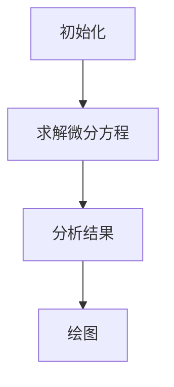

                 

# 基于神经常微分方程的连续时间评测

## 关键词
- 神经常微分方程
- 连续时间评测
- 数学模型
- 算法原理
- 应用场景

## 摘要
本文旨在深入探讨基于神经常微分方程的连续时间评测方法，介绍其基础理论、核心算法原理及其在不同领域的应用。通过对神经常微分方程的概念、数学背景和求解方法的详细阐述，结合Python代码示例，本文将展示如何利用神经常微分方程进行连续时间系统的建模、分析和评测。此外，还将通过具体案例，展示其在实际工程中的应用，为读者提供实践指导和未来发展趋势的分析。

### 第1章 引言

### 1.1 书籍目的和读者对象
本书旨在为人工智能、控制系统和工程领域的科研人员、工程师和研究生提供一份详尽的参考资料，帮助他们理解和应用基于神经常微分方程的连续时间评测方法。通过本书，读者将能够掌握以下技能：
1. 理解神经常微分方程的基本概念和数学背景。
2. 掌握神经常微分方程的求解方法及其在连续时间系统中的应用。
3. 能够使用Python编写相关算法，进行连续时间评测。
4. 应用神经常微分方程解决实际工程问题。

### 1.2 神经常微分方程的应用背景
神经常微分方程在多个领域都有广泛的应用，包括物理学、工程学、生物学和经济学等。其中，在控制系统和人工智能领域，神经常微分方程被用于建模和分析动态系统，特别是在需要处理连续时间和非线性系统的情况下。连续时间评测方法不仅能够提供系统行为的全面描述，还能够用于优化和控制，从而提高系统的性能和稳定性。

### 1.3 连续时间评测的重要性
连续时间评测在许多工程和科学问题中至关重要。它能够帮助我们：
1. 预测系统未来的行为。
2. 评估系统的稳定性和鲁棒性。
3. 设计和优化控制系统。
4. 验证和验证理论模型。

### 第2章 神经常微分方程基础

#### 2.1 神经常微分方程的定义
神经常微分方程是一类特殊的微分方程，其系数和未知量都是变量的函数，并且可能包含多项式、指数函数、三角函数等。通常，神经常微分方程可以表示为：
$$
a_n(t)y^{(n)}(t) + a_{n-1}(t)y^{(n-1)}(t) + \cdots + a_1(t)y'(t) + a_0(t)y(t) = f(t)
$$
其中，$y(t)$是未知函数，$f(t)$是非齐次项，$a_0(t), a_1(t), \ldots, a_n(t)$是系数函数。

#### 2.2 神经常微分方程的基本性质
1. **线性与非线性**：神经常微分方程可以是线性的或非线性的。线性方程满足叠加原理，而非线性方程则不满足。
2. **存在性与唯一性**：在一定条件下，神经常微分方程的解是存在的，并且在一定范围内是唯一的。
3. **初值问题与边界问题**：神经常微分方程的解通常通过初值问题或边界问题求解。

#### 2.3 神经常微分方程的分类
1. **常系数神经常微分方程**：系数函数为常数。
2. **变系数神经常微分方程**：系数函数是变量。
3. **有理神经常微分方程**：系数函数可以表示为有理函数。

### 第3章 数学背景

#### 3.1 空间和时态描述
在连续时间系统中，空间和时态描述是至关重要的。空间描述通常涉及状态变量，而时态描述则关注这些状态变量随时间的变化。状态空间描述法是分析连续时间系统的主要工具，其基本形式为：
$$
\dot{x}(t) = A(t)x(t) + B(t)u(t)
$$
$$
y(t) = C(t)x(t) + D(t)u(t)
$$
其中，$x(t)$是状态向量，$u(t)$是输入向量，$y(t)$是输出向量。

#### 3.2 微分方程的求解方法
求解微分方程的方法多种多样，包括：
1. **初值问题求解**：通过给定的初始条件，求解微分方程的解。
2. **边界问题求解**：通过给定的边界条件，求解微分方程的解。
3. **数值解法**：使用数值方法，如欧拉法、龙格-库塔法等，逼近微分方程的解。

#### 3.3 常见数学公式和符号
在神经常微分方程的求解和分析中，常用的数学公式和符号包括：
1. **拉普拉斯变换**：用于将微分方程转换为代数方程。
2. **传递函数**：描述系统输入与输出之间的关系。
3. **状态转移矩阵**：用于描述系统状态随时间的变化。

### 第4章 核心算法原理

#### 4.1 神经常微分方程算法概述
神经常微分方程的算法通常包括以下步骤：
1. **初始化**：设置初始条件。
2. **求解方程**：使用数值方法求解微分方程。
3. **分析结果**：对求解结果进行分析，评估系统性能。

#### 4.2 算法原理讲解（伪代码）
以下是一个简化的神经常微分方程求解算法的伪代码：
```python
initialize x(t0) and u(t0)
for t from t0 to tf:
    x(t+1) = solve_differential_equation(x(t), u(t), t)
end for
plot(x(t), u(t))
```
其中，`solve_differential_equation`是一个求解微分方程的函数，它将根据输入的微分方程、初始条件和时间点，返回下一个时刻的状态。

#### 4.3 算法流程图（Mermaid图）


### 第5章 数学模型与公式

#### 5.1 连续时间系统的数学模型
连续时间系统的数学模型通常包括状态方程和输出方程。以一阶系统为例，其数学模型可以表示为：
$$
\dot{x}(t) = ax(t) + bu(t)
$$
$$
y(t) = cx(t) + du(t)
$$
其中，$x(t)$是状态向量，$u(t)$是输入向量，$y(t)$是输出向量。

#### 5.2 公式详细讲解（LaTeX格式）
在神经常微分方程的求解过程中，常用的公式包括：
$$
L\{y'(t)\} = sY(s) - y(0)
$$
$$
L^{-1}\{Y(s)\} = \int_0^t y(\tau)d\tau
$$
这些公式是拉普拉斯变换和拉普拉斯反变换的基本形式。

#### 5.3 模型应用举例
考虑一个简单的机械振动系统，其数学模型可以表示为：
$$
m\ddot{x}(t) + c\dot{x}(t) + kx(t) = f(t)
$$
其中，$m$是质量，$c$是阻尼系数，$k$是弹簧刚度，$f(t)$是外部激励。

### 第6章 应用场景与案例

#### 6.1 应用领域介绍
神经常微分方程在多个领域都有应用，包括但不限于：
1. **控制系统**：用于建模、分析和设计控制系统。
2. **信号处理**：用于信号的分析和滤波。
3. **物理学**：用于描述物理现象，如振动、波动和流体动力学。
4. **生物学**：用于建模生物系统的动态行为。
5. **经济学**：用于分析经济系统的动态变化。

#### 6.2 案例一：系统稳定性分析
考虑一个控制系统，其状态方程为：
$$
\dot{x}(t) = \begin{bmatrix} -2 & -3 \\ 1 & -1 \end{bmatrix} x(t)
$$
通过求解相应的神经常微分方程，我们可以分析系统的稳定性。假设初始状态为$x(0) = \begin{bmatrix} 1 \\ 0 \end{bmatrix}$，我们可以使用数值方法求解状态向量$x(t)$随时间的变化。通过分析$x(t)$的轨迹，我们可以判断系统的稳定性。

#### 6.3 案例二：动态行为预测
考虑一个简单的经济系统，其数学模型为：
$$
\dot{y}(t) = 0.5y(t)^2 - 0.1y(t)
$$
初始条件为$y(0) = 1$。我们可以使用数值方法求解$y(t)$，从而预测经济系统的动态行为。通过分析$y(t)$的值，我们可以了解经济系统的发展趋势。

### 第7章 评测方法

#### 7.1 评测指标
在神经常微分方程的评测中，常用的指标包括：
1. **稳定性**：评估系统是否稳定。
2. **精度**：评估算法的求解精度。
3. **计算效率**：评估算法的计算效率。
4. **适应性**：评估算法对不同问题的适应性。

#### 7.2 评测流程
评测流程通常包括以下步骤：
1. **设定评测指标**：明确需要评估的指标。
2. **设计实验**：根据评测指标设计实验。
3. **执行实验**：运行算法，收集数据。
4. **分析结果**：对实验结果进行分析，评估算法性能。

#### 7.3 评测案例
以一个控制系统为例，我们设定稳定性作为评测指标。我们设计一个实验，将不同的数值方法应用于该系统，并分析其稳定性。通过比较不同方法的稳定性，我们可以评估这些方法的性能。

### 第8章 实践与展望

#### 8.1 实践指导
在实践中，使用神经常微分方程进行连续时间评测需要以下几个步骤：
1. **问题建模**：根据实际问题建立数学模型。
2. **算法选择**：选择合适的数值方法进行求解。
3. **代码实现**：使用Python等编程语言实现算法。
4. **结果分析**：对求解结果进行分析，评估系统性能。

#### 8.2 未来发展趋势
随着计算技术和人工智能的发展，神经常微分方程在连续时间评测中的应用前景广阔。未来的发展趋势包括：
1. **高效算法的开发**：开发更高效的数值方法，提高计算效率。
2. **多尺度建模**：结合不同尺度的模型，提高预测精度。
3. **机器学习与微分方程的结合**：利用机器学习技术，提高微分方程的求解精度。
4. **实时评测**：实现实时动态系统的评测，提高系统的响应速度。

#### 8.3 总结与展望
神经常微分方程在连续时间评测中具有重要的应用价值。通过本文的介绍，读者可以了解到神经常微分方程的基本概念、数学背景、算法原理以及实际应用。在未来的工作中，我们可以进一步探索神经常微分方程在不同领域的应用，开发更高效的算法，提高系统的性能和稳定性。

### 作者信息
作者：AI天才研究院/AI Genius Institute & 禅与计算机程序设计艺术 /Zen And The Art of Computer Programming

### 结语
本文对基于神经常微分方程的连续时间评测进行了全面深入的探讨，包括基础理论、算法原理、应用场景和评测方法等内容。通过本文的阅读，读者可以掌握神经常微分方程的基本概念和应用，为解决实际问题提供了一种有效的工具。在未来的研究和实践中，我们期待能够进一步深化对神经常微分方程的理解，推动其在更多领域的应用。感谢您的阅读！

