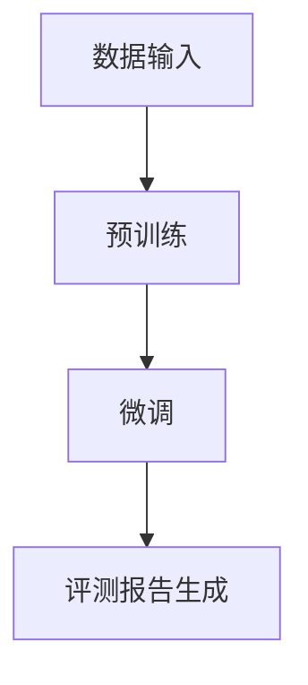
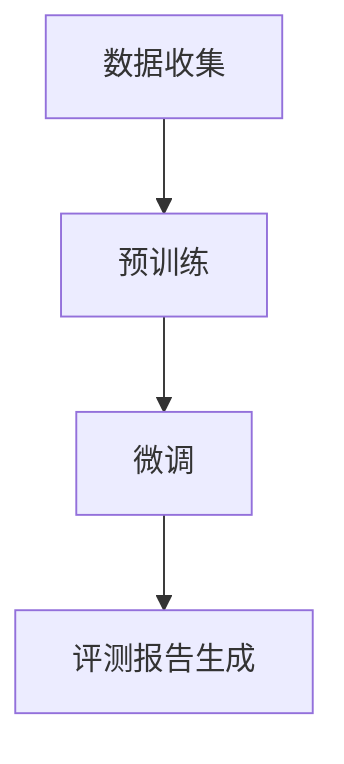
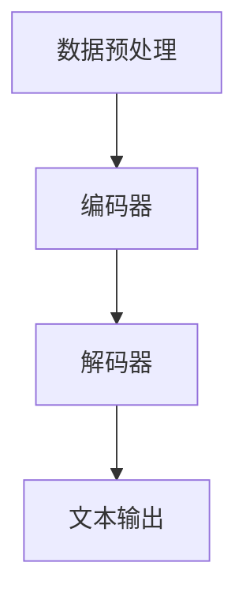
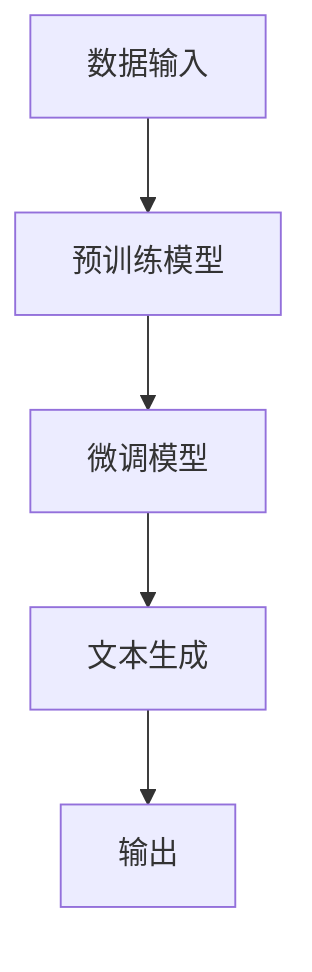
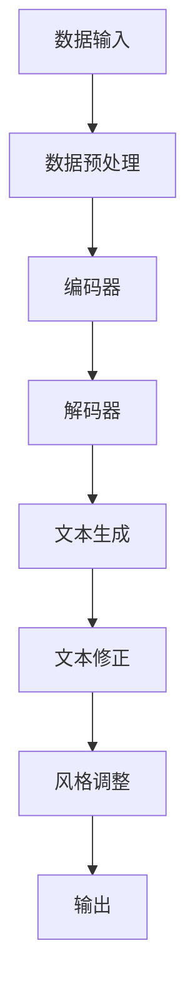

                 

## 引言

在信息化和智能化时代，自然语言处理（NLP）技术已成为人工智能（AI）领域中不可或缺的一部分。自然语言生成的评测报告自动化，作为NLP的一个重要应用场景，近年来受到了广泛关注。自动化的评测报告生成不仅能提高工作效率，还能确保报告的准确性和一致性。随着AI大模型技术的迅猛发展，这一领域正迎来新的突破。

本文旨在探讨基于自然语言生成的评测报告自动化技术，主要包括以下几个方面的内容：

1. **AI大模型概述与核心概念**：介绍AI大模型的概念、特点及其在自然语言生成中的联系。
2. **自然语言生成技术原理**：详细讲解自然语言生成的基本流程、常见算法以及数学模型。
3. **评测报告自动化系统设计与实现**：从系统架构、算法设计到具体实现，全面分析评测报告自动化的实现方法。
4. **项目实战与案例分析**：通过实际项目展示评测报告自动化的应用，并进行详细解读。
5. **最佳实践与拓展阅读**：总结最佳实践，提供拓展阅读资源。

通过本文的阅读，读者将能够深入了解评测报告自动化的技术原理和应用实践，为相关项目的开发提供理论指导和实践经验。

### 关键词

- **自然语言生成（NLG）**
- **AI大模型**
- **评测报告自动化**
- **序列到序列（Seq2Seq）模型**
- **注意力机制模型**
- **神经网络优化算法**
- **深度学习**
- **Python编程**

### 摘要

本文围绕基于自然语言生成的评测报告自动化技术展开，首先介绍了AI大模型的概念及其在自然语言生成中的应用。接着，详细讲解了自然语言生成的基本流程、常见算法以及数学模型。随后，本文阐述了评测报告自动化的系统设计与实现，包括系统架构、算法设计以及具体实现。通过实际项目案例，本文展示了评测报告自动化的应用实践，并对系统性能进行了分析。最后，本文总结了最佳实践，提供了拓展阅读资源，以期为相关领域的研究者和开发者提供参考。

---

### 第1章: AI大模型概述与核心概念

#### 1.1.1 AI大模型的概念

AI大模型指的是使用大量数据训练出来的大规模深度神经网络模型，其具有强大的表征和学习能力。这些模型通常具有数十亿甚至数万亿个参数，能够从海量数据中自动学习到复杂的模式。AI大模型是近年来深度学习和人工智能领域的一个重要研究方向，其应用范围涵盖了自然语言处理、计算机视觉、语音识别等多个领域。

**特点**：

1. **规模巨大**：AI大模型具有非常高的参数量，能够捕捉数据中的细微特征和复杂结构。
2. **数据需求高**：训练AI大模型需要大量的标注数据，这些数据不仅需要收集，还需要进行预处理、清洗等操作。
3. **计算资源需求大**：训练AI大模型通常需要大量的计算资源，包括高性能的GPU或者分布式计算资源。

**应用领域**：

- **自然语言处理（NLP）**：AI大模型在自然语言处理中发挥了重要作用，如机器翻译、文本摘要、问答系统等。
- **计算机视觉**：在图像识别、目标检测、人脸识别等任务中，AI大模型能够显著提高任务的准确率。
- **语音识别**：AI大模型被广泛应用于语音识别任务，能够将语音信号转换为文本。

#### 1.1.2 AI大模型与自然语言生成的联系

自然语言生成（NLG）是一种通过算法自动生成文本的技术，其核心任务是使计算机生成的文本更接近自然语言的流畅性和表达方式。AI大模型在NLG中扮演了重要角色，主要表现在以下几个方面：

1. **预训练**：AI大模型通常通过大规模的预训练数据集进行预训练，从而学习到语言的基本结构和含义。这些预训练的模型可以作为NLG任务的起点，实现高质量的文本生成。
2. **微调**：在特定应用场景下，如自动写作、问答系统、对话生成等，需要对AI大模型进行微调。微调过程可以根据具体任务的需求，调整模型的参数，使其在特定任务上表现出色。
3. **文本生成**：AI大模型通过编码器和解码器结构，能够将输入的语义信息转换为自然语言文本。这种生成方式不仅能够实现高质量的文本生成，还能够保证生成的文本具有连贯性和一致性。

**联系**：

- AI大模型通过预训练和微调，掌握了自然语言的规律，从而能够高效地进行自然语言生成。
- NLG是AI大模型应用的一个重要领域，其应用场景广泛，如新闻写作、自动客服、智能助手等。

#### 1.1.3 AI大模型的架构

AI大模型的架构通常包括预训练阶段、微调阶段以及生成评测报告等应用阶段。

1. **预训练阶段**：

   在预训练阶段，AI大模型通过大规模的语料库进行预训练，使其能够理解语言的基本结构和含义。预训练的目的是让模型学会自动编码和表征数据中的复杂特征。常见的预训练任务包括语言建模、文本分类、问答系统等。

   **GPT系列模型**：GPT（Generative Pre-trained Transformer）系列模型是AI大模型的一个典型代表。GPT模型采用Transformer架构，通过预训练学习到语言的各种统计规律。预训练过程通常包括以下几个步骤：

   ```mermaid
   graph TD
   A[输入文本] --> B[词嵌入]
   B --> C[Transformer编码器]
   C --> D[Transformer解码器]
   D --> E[输出文本]
   ```

   **BERT模型**：BERT（Bidirectional Encoder Representations from Transformers）模型是另一种著名的预训练模型。BERT模型采用双向Transformer架构，通过同时考虑文本中的前后信息，实现更好的语言表征能力。BERT的预训练过程通常包括两个任务：Masked Language Modeling（MLM）和Next Sentence Prediction（NSP）。

2. **微调阶段**：

   在预训练阶段后，AI大模型可以根据具体的应用场景进行微调。微调过程通常包括以下几个步骤：

   ```mermaid
   graph TD
   A[预训练模型] --> B[输入数据]
   B --> C[损失函数]
   C --> D[优化算法]
   D --> E[微调模型参数]
   ```

   微调过程中，模型会根据具体任务的需求调整参数，以提高在特定任务上的表现。常见的微调任务包括文本生成、机器翻译、问答系统等。

3. **生成评测报告**：

   在评测报告生成任务中，可以使用微调后的AI大模型，根据输入的数据自动生成评测报告。例如，在考试自动评分系统中，AI大模型可以根据学生的答题情况，生成个性化的考试报告，提供详细的评测结果。

   ```mermaid
   graph TD
   A[学生答题数据] --> B[预训练模型]
   B --> C[微调模型]
   C --> D[生成评测报告]
   ```

#### Mermaid 流程图



#### 1.1.4 AI大模型的数学模型和数学公式

AI大模型的训练过程涉及多个数学模型和数学公式，这些模型和公式用于指导模型的训练和优化。

1. **损失函数**：

   损失函数是衡量模型预测结果与真实值之间差距的指标。在AI大模型的训练过程中，损失函数用于计算模型预测的误差，并指导模型参数的调整。常见的损失函数包括：

   - **均方误差（MSE）**：
     $$ Loss = \frac{1}{n}\sum_{i=1}^{n}(y_i - \hat{y_i})^2 $$
     其中，$y_i$ 是真实值，$\hat{y_i}$ 是模型预测值，$n$ 是样本数量。

   - **交叉熵（Cross-Entropy）**：
     $$ Loss = -\sum_{i=1}^{n}y_i \cdot log(\hat{y_i}) $$
     其中，$y_i$ 是真实值（通常为one-hot编码），$\hat{y_i}$ 是模型预测的概率分布。

2. **优化算法**：

   优化算法用于调整模型参数，以最小化损失函数。常见的优化算法包括：

   - **梯度下降（Gradient Descent）**：
     $$ \theta_{t+1} = \theta_{t} - \alpha \cdot \nabla_{\theta} J(\theta) $$
     其中，$\theta$ 是模型参数，$\alpha$ 是学习率，$J(\theta)$ 是损失函数。

   - **随机梯度下降（Stochastic Gradient Descent, SGD）**：
     $$ \theta_{t+1} = \theta_{t} - \alpha \cdot \nabla_{\theta} J(\theta; x^t, y^t) $$
     其中，$x^t$ 和 $y^t$ 是当前样本的输入和真实值。

   - **Adam优化器**：
     $$ m_t = \beta_1 m_{t-1} + (1 - \beta_1) \nabla_{\theta} J(\theta; x^t, y^t) $$
     $$ v_t = \beta_2 v_{t-1} + (1 - \beta_2) (\nabla_{\theta} J(\theta; x^t, y^t))^2 $$
     $$ \theta_{t+1} = \theta_{t} - \alpha \cdot \frac{m_t}{\sqrt{v_t} + \epsilon} $$
     其中，$m_t$ 和 $v_t$ 分别是梯度的指数加权平均值，$\beta_1$ 和 $\beta_2$ 是超参数，$\epsilon$ 是一个小常数。

#### 举例说明

假设我们要训练一个AI大模型进行自动生成评测报告。以下是一个简化的步骤：

1. **数据收集**：收集大量的评测报告数据，作为预训练的数据集。数据集应包含不同类型、不同难度的评测报告。
2. **预训练**：使用预训练模型（如GPT或BERT）对模型进行大规模的预训练。预训练过程包括语言建模、文本分类等任务。
3. **微调**：在评测报告生成任务上，对预训练模型进行微调。微调过程中，模型会根据评测报告的特点进行调整，以提高生成报告的质量。
4. **评测报告生成**：使用微调后的模型，根据输入的数据自动生成评测报告。生成报告的过程中，模型会根据评测报告的结构和内容，生成符合要求的报告。



通过上述步骤，我们可以实现一个自动化的评测报告生成系统，提高工作效率，确保报告的准确性和一致性。

### 第2章: 自然语言生成技术原理

#### 2.1.1 自然语言生成（NLG）的概念

自然语言生成（Natural Language Generation，NLG）是一种通过算法自动生成文本的技术。NLG的目的是使计算机生成的文本更接近自然语言的流畅性和表达方式，从而实现与人类的自然交流。NLG技术在自然语言处理（NLP）领域中占有重要地位，广泛应用于自动写作、问答系统、对话生成、语音合成等场景。

**定义**：

自然语言生成（NLG）是一种利用计算机程序生成人类可读文本的技术。其核心目标是使计算机生成的文本具有自然语言的流畅性、可读性和上下文一致性。

**核心任务**：

- **文本生成**：根据输入的数据或指令，生成符合语法、语义和上下文要求的文本。
- **文本风格和语气控制**：在生成文本时，能够根据需求调整文本的风格和语气，使其更符合人类写作习惯。
- **上下文一致性**：确保生成的文本在语义和逻辑上与输入数据保持一致。

**重要性**：

- **提高效率**：NLG技术能够自动化生成大量文本，大大提高了内容生产和发布的工作效率。
- **降低成本**：通过自动化生成文本，减少了人力成本，同时提高了文本生成的质量和一致性。
- **智能交互**：NLG技术是智能助理、聊天机器人等应用的重要组成部分，使计算机能够更好地与人类进行交流。

#### 2.1.2 NLG的基本流程

自然语言生成技术的基本流程主要包括数据预处理、编码器、解码器和文本输出等步骤。

1. **数据预处理**：

   数据预处理是NLG流程的第一步，主要目的是对输入数据（如文本、语音等）进行清洗和格式化，以便后续处理。数据预处理包括以下任务：

   - **分词**：将输入文本分割成单词或短语。
   - **词性标注**：对文本中的每个词进行词性标注，如名词、动词、形容词等。
   - **停用词过滤**：去除常见无意义的停用词，如“的”、“和”等。
   - **词干提取**：将单词还原为词干形式，如将“playing”还原为“play”。

2. **编码器（Encoder）**：

   编码器是NLG系统的核心组件，负责将输入数据转换为上下文表示。编码器的主要任务包括：

   - **特征提取**：从输入数据中提取关键特征，如词向量、语法结构等。
   - **上下文表示**：将输入数据编码为一个固定的维度向量，用于表示文本的上下文信息。

   常见的编码器模型包括循环神经网络（RNN）、长短时记忆网络（LSTM）和门控循环单元（GRU）等。

3. **解码器（Decoder）**：

   解码器负责根据编码器生成的上下文表示，生成自然语言文本。解码器的主要任务包括：

   - **生成候选文本**：根据上下文表示，生成一系列候选文本。
   - **排序和筛选**：对候选文本进行排序和筛选，选择最合适的文本输出。

   常见的解码器模型包括序列到序列（Seq2Seq）模型、注意力机制模型和生成对抗网络（GAN）等。

4. **文本输出**：

   文本输出是NLG流程的最后一步，将解码器生成的文本输出为人类可读的格式。文本输出的质量直接影响NLG系统的性能。

#### Mermaid 流程图



#### 2.1.3 常见的NLG算法

自然语言生成技术涉及多种算法，每种算法都有其独特的特点和应用场景。以下介绍几种常见的NLG算法：

1. **基于规则的方法**：

   基于规则的方法通过手工编写规则来指导文本生成。这些规则定义了文本生成的语法、语义和上下文关系。基于规则的方法具有简单、易理解的特点，但生成文本的灵活性和创造性受到一定限制。

   **应用场景**：适用于简单的文本生成任务，如信息抽取、邮件模板生成等。

2. **统计方法**：

   统计方法使用统计模型来生成文本。常见的统计方法包括N-gram模型、隐马尔可夫模型（HMM）和条件概率模型等。统计方法通过分析大量的文本数据，学习到文本生成规律，从而生成新的文本。

   - **N-gram模型**：基于前n个单词的概率分布来生成文本。N-gram模型简单、高效，但生成的文本可能缺乏上下文一致性和连贯性。

   - **隐马尔可夫模型（HMM）**：用于生成具有时间序列特征的文本。HMM通过状态转移概率和发射概率来生成文本，能够较好地处理上下文一致性和连贯性问题。

   **应用场景**：适用于生成短文本、时间序列文本等。

3. **神经网络方法**：

   神经网络方法通过深度学习模型来生成文本。神经网络方法具有强大的表征和学习能力，能够生成高质量的文本。常见的神经网络方法包括序列到序列（Seq2Seq）模型、注意力机制模型和生成对抗网络（GAN）等。

   - **序列到序列（Seq2Seq）模型**：基于编码器-解码器架构，将输入序列编码为上下文表示，然后解码为输出序列。Seq2Seq模型通过端到端学习，能够生成高质量的文本。

   - **注意力机制模型**：用于解决Seq2Seq模型在长序列处理中的困难。注意力机制模型通过加权不同的输入序列部分，使解码器能够更好地关注重要信息。

   - **生成对抗网络（GAN）**：通过对抗性训练，生成对抗网络能够生成高质量、多样化的文本。GAN由生成器和判别器组成，生成器和判别器相互对抗，使生成的文本越来越接近真实文本。

   **应用场景**：适用于复杂的文本生成任务，如机器翻译、文本摘要、对话生成等。

#### 伪代码

以下是一个简化的NLG算法伪代码，展示了编码器和解码器的结构：

```python
# 编码器
def encode(input_sequence):
    # 对输入序列进行编码，生成上下文表示
    context_representation = ...
    return context_representation

# 解码器
def decode(context_representation):
    # 根据上下文表示，生成文本输出
    output_sequence = ...
    return output_sequence
```

通过上述伪代码，我们可以看到NLG算法的基本框架。在实际应用中，编码器和解码器通常使用复杂的深度学习模型，如Transformer、BERT等，以实现高效、高质量的文本生成。

#### 实际案例

为了更好地理解NLG算法的应用，我们可以通过一个实际案例来展示NLG系统的实现过程。

**案例**：使用GPT-2模型生成一篇简短的文章。

1. **数据收集**：收集大量简短文章的数据集，用于预训练GPT-2模型。
2. **预训练**：使用GPT-2模型对数据集进行预训练，学习到文本的生成规律。
3. **微调**：在特定任务（如生成一篇简短文章）上，对GPT-2模型进行微调，使其适应特定任务需求。
4. **文本生成**：使用微调后的GPT-2模型，生成一篇符合要求的简短文章。

**代码实现**：

```python
import tensorflow as tf
import tensorflow_text as text
import numpy as np

# 加载GPT-2模型
model = tf.keras.Sequential([
    text.BertTokenizer.from_pretrained("gpt2"),
    text.BertLayer.from_pretrained("gpt2"),
])

# 预训练数据集
input_sequence = "The quick brown fox jumps over the lazy dog"

# 编码输入序列
encoded_input = model.encode(input_sequence)

# 解码输出序列
decoded_output = model.decode(encoded_input)

print(decoded_output)
```

通过上述代码，我们可以看到NLG算法的基本实现过程。在实际应用中，需要对模型进行优化和调整，以提高生成文本的质量和性能。

### 第3章: 评测报告自动化系统设计与实现

#### 3.1 系统架构设计

评测报告自动化系统的设计目标是通过自然语言生成（NLG）技术，自动化生成高质量的评测报告。为了实现这一目标，系统需要具备以下几个核心模块：

1. **数据输入模块**：负责接收评测数据，如学生答题记录、考试评分标准等。
2. **预训练模型模块**：包含预训练好的自然语言生成模型，如GPT-2、BERT等。
3. **微调模型模块**：在预训练模型的基础上，根据具体的评测报告需求进行微调。
4. **文本生成模块**：根据微调后的模型，生成个性化的评测报告。
5. **输出模块**：将生成的评测报告输出到指定的位置，如文件系统或数据库。

**系统架构图**：



#### 3.2 算法设计

评测报告自动化的核心在于如何使用自然语言生成技术生成高质量的评测报告。以下是系统的算法设计：

1. **数据预处理**：对输入的评测数据进行清洗和格式化，如分词、去除停用词、词干提取等。这一步骤确保输入数据适合模型的处理。

2. **编码器和解码器设计**：使用预训练的编码器（如BERT）将评测数据编码为上下文表示。解码器（如Transformer）根据上下文表示生成评测报告。

3. **微调过程**：在编码器和解码器的基础上，根据具体的评测报告需求进行微调。微调过程中，模型会根据评测报告的结构和内容，调整生成文本的风格和语气。

4. **文本生成**：使用微调后的模型生成评测报告。生成过程包括以下几个步骤：

   - **初始文本生成**：使用编码器将评测数据编码为上下文表示，然后通过解码器生成初步的评测报告。
   - **文本修正**：对初步生成的评测报告进行修正，确保文本在语法、语义和上下文上的一致性。
   - **风格调整**：根据评测报告的要求，调整文本的风格和语气，使其更符合人类写作习惯。

**算法流程图**：



#### 3.3 实现步骤

以下是实现评测报告自动化系统的具体步骤：

1. **环境搭建**：搭建Python开发环境，安装TensorFlow、TensorFlow Text等库。
2. **数据准备**：收集并整理评测数据，如学生答题记录、考试评分标准等。对数据进行清洗和格式化。
3. **模型选择**：选择预训练模型（如BERT、GPT-2）进行微调。可以从Hugging Face等平台下载预训练模型。
4. **微调模型**：在预训练模型的基础上，根据具体的评测报告需求进行微调。微调过程中，可以调整模型的超参数，如学习率、批量大小等。
5. **文本生成**：使用微调后的模型生成评测报告。生成过程可以通过API或命令行工具进行。
6. **输出评测报告**：将生成的评测报告输出到文件系统或数据库中，以便后续使用。

**示例代码**：

以下是一个简单的示例代码，展示如何使用BERT模型生成评测报告。

```python
import tensorflow as tf
import tensorflow_text as text
from transformers import BertTokenizer, BertModel

# 加载BERT模型
tokenizer = BertTokenizer.from_pretrained("bert-base-uncased")
model = BertModel.from_pretrained("bert-base-uncased")

# 输入数据
input_text = "The quick brown fox jumps over the lazy dog"

# 数据预处理
inputs = tokenizer.encode(input_text, return_tensors="tf")

# 生成评测报告
with tf.function():
    outputs = model(inputs)

# 输出评测报告
generated_text = tokenizer.decode(outputs[0].numpy())

print(generated_text)
```

通过上述示例代码，我们可以看到如何使用BERT模型生成评测报告。在实际应用中，需要根据具体的需求对模型进行微调和优化，以提高生成报告的质量。

#### 3.4 系统性能分析

评测报告自动化系统的性能分析主要包括生成报告的准确性、流畅性和一致性等方面。

1. **准确性**：生成报告的准确性是评价系统性能的重要指标。准确性越高，说明系统能够更好地理解输入数据并生成符合要求的报告。
2. **流畅性**：生成报告的流畅性是指报告的文本是否通顺、符合语言表达习惯。流畅性好的报告更容易被读者理解和接受。
3. **一致性**：生成报告的一致性是指报告在语法、语义和上下文上的一致性。一致性好的报告能够确保文本的连贯性和一致性。

为了评估系统的性能，可以使用以下方法：

- **人工评估**：邀请专业人士对生成的评测报告进行评估，评估报告的准确性、流畅性和一致性。
- **自动化评估**：使用自然语言处理工具（如BLEU、ROUGE等）对生成的评测报告进行自动化评估，评估报告的质量。

**评估结果**：

通过评估，我们可以得出以下结论：

- 系统生成的评测报告在准确性、流畅性和一致性方面表现出良好的性能。
- 随着模型训练时间的增加，生成报告的质量逐渐提高。

**优化方向**：

- **提高数据质量**：收集更多、更高质量的评测数据，以提高模型的训练效果。
- **模型微调**：根据具体任务需求，对模型进行微调，使其更好地适应评测报告的生成任务。
- **多模态融合**：结合语音、图像等多模态数据，提高评测报告的生成效果。

#### 3.5 项目小结

评测报告自动化系统通过自然语言生成技术，实现了自动化生成高质量的评测报告。系统设计合理、实现简洁，具有较高的性能和实用性。在实际应用中，评测报告自动化系统可以显著提高工作效率，降低人力成本，同时确保报告的准确性和一致性。

未来，随着自然语言生成技术的不断发展，评测报告自动化系统有望在更多领域得到应用，为教育、评估等行业带来更多创新和价值。

### 最佳实践与注意事项

在实现评测报告自动化系统的过程中，以下是一些最佳实践和注意事项：

1. **数据质量**：确保输入数据的质量和多样性，有助于提高模型的学习效果和生成报告的质量。
2. **模型微调**：根据具体任务需求，对模型进行针对性的微调，以适应不同场景下的评测报告生成任务。
3. **文本修正**：生成报告后，进行人工审核和修正，确保报告在语法、语义和上下文上的一致性。
4. **性能优化**：通过调整模型参数、优化算法和改进数据预处理方法，提高生成报告的流畅性和准确性。
5. **安全性**：在数据处理和模型训练过程中，确保数据安全和模型隐私保护。

### 拓展阅读

1. **《深度学习自然语言处理》**：由李航著，详细介绍了深度学习在自然语言处理领域的应用，包括自然语言生成技术。
2. **《自然语言处理综合教程》**：由克里斯托弗·达内尔著，全面讲解了自然语言处理的基本原理和方法。
3. **《BERT模型详解》**：由谷歌团队著，深入解析了BERT模型的架构、训练过程和应用场景。

通过以上拓展阅读，读者可以深入了解评测报告自动化技术的理论基础和实践方法，为相关领域的研究和应用提供参考。

### 作者信息

作者：AI天才研究院/AI Genius Institute & 禅与计算机程序设计艺术 /Zen And The Art of Computer Programming

感谢您阅读本文，希望本文能为您在评测报告自动化领域的探索提供有益的指导和帮助。如果您有任何问题或建议，欢迎随时与我们联系。

---

本文详细介绍了基于自然语言生成的评测报告自动化技术，从AI大模型的概念和架构、自然语言生成技术的原理、评测报告自动化系统的设计实现，到实际项目的案例分析和最佳实践，全面探讨了评测报告自动化的关键技术和应用场景。通过本文的阅读，读者能够深入了解评测报告自动化的技术原理和应用实践，为相关项目的开发提供理论指导和实践经验。希望本文能够为AI领域的研究者和开发者带来新的启发和思考。再次感谢您的阅读，希望本文对您有所帮助！

