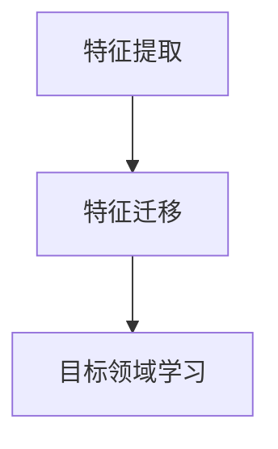
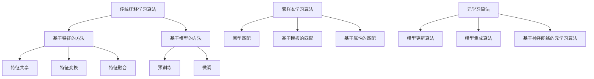
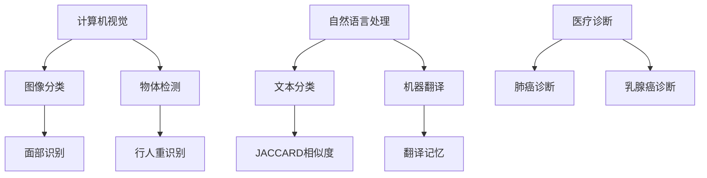
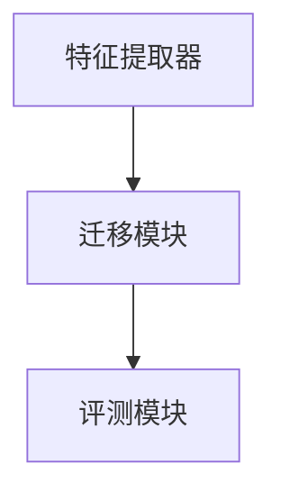
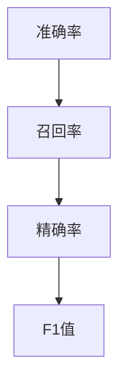

                 

# 基于迁移学习的跨领域评测模型

## 关键词

- 迁移学习
- 跨领域评测
- 模型设计
- 算法原理
- 源代码讲解
- 数学模型
- 实践案例分析

## 摘要

本文旨在探讨基于迁移学习的跨领域评测模型。首先，介绍了迁移学习的基本概念、原理和分类，以及其在计算机视觉、自然语言处理等领域的应用。随后，详细讲解了迁移学习算法，包括传统迁移学习算法、零样本学习算法和元学习算法，并分析了迁移学习的挑战及优化方法。在此基础上，本文提出了一种基于迁移学习的跨领域评测模型，并从框架设计、构建方法、优化策略等方面进行了阐述。文章还通过实际案例，展示了如何利用迁移学习实现跨领域评测，并对模型的性能评估进行了详细分析。最后，本文总结了迁移学习在跨领域评测中的未来发展趋势，并提出了一些实践技巧和注意事项，为读者提供了一份全面的技术指南。

## 第一部分：迁移学习基础

### 第1章：迁移学习的概念与原理

#### 1.1 迁移学习的定义与意义

迁移学习（Transfer Learning）是指将一个任务领域（源领域）的学习经验应用到另一个相关任务领域（目标领域）的学习中。这种学习方式避免了从头开始训练模型，从而大大提高了学习效率。在深度学习中，迁移学习尤为重要，因为它能够利用预训练模型在大规模数据集上学习到的通用特征，来提升新任务的表现。

迁移学习的意义主要体现在以下几个方面：

1. **加速模型训练**：利用预训练模型可以避免从头开始训练，从而减少训练时间。
2. **提高模型泛化能力**：通过迁移学习，模型能够利用源领域的知识，提升在目标领域的泛化能力。
3. **资源节约**：在大规模数据集上预训练模型需要大量的计算资源和时间，迁移学习可以充分利用这些资源。

#### 1.2 迁移学习的分类

迁移学习可以分为以下几种类型：

1. **垂直迁移**：源领域和目标领域之间的任务类型相同，但领域不同，如在不同国家之间的语言翻译。
2. **水平迁移**：源领域和目标领域之间的任务类型相同，但领域不同，如在不同类型的图像上使用相同的分类模型。
3. **多任务迁移**：多个任务之间的迁移，通过多个任务的共同训练，提高模型在单一任务上的表现。
4. **零样本学习**：目标领域的数据与源领域的数据完全不同，模型需要通过源领域的知识来泛化到目标领域。

#### 1.3 迁移学习的基本原理

迁移学习的基本原理是利用源领域中的知识来辅助目标领域的学习。这种知识通常表现为预训练模型中已经学习到的特征表示。具体来说，迁移学习的过程可以分为以下几个步骤：

1. **特征提取**：从源领域数据中提取有用的特征表示。
2. **特征迁移**：将提取到的特征表示迁移到目标领域，进行适应和调整。
3. **目标领域学习**：利用迁移后的特征表示，在目标领域上训练新的模型。

### 图1：迁移学习的基本原理



### 第2章：迁移学习算法

#### 2.1 传统迁移学习算法

传统迁移学习算法主要包括基于特征的方法和基于模型的方法。

**基于特征的方法**：这种方法的主要思想是将源领域的特征映射到目标领域，从而实现迁移。常见的算法包括特征共享、特征变换和特征融合等。

**基于模型的方法**：这种方法则是直接迁移整个模型，通常包括预训练和微调两个步骤。预训练阶段，模型在大规模数据集上训练，以学习到通用特征表示；微调阶段，模型在目标数据集上进行微调，以适应目标领域的任务。

#### 2.2 零样本学习算法

零样本学习（Zero-Shot Learning）是一种特殊的迁移学习，其目标是在没有直接目标领域数据的情况下，将源领域的知识应用到目标领域。常见的零样本学习算法包括原型匹配、基于模板的匹配和基于属性的匹配等。

**原型匹配**：这种方法通过在源领域上训练一个原型分类器，然后将目标领域的样本与源领域的原型进行匹配，从而实现分类。

**基于模板的匹配**：这种方法通过预定义一组模板，将目标领域的样本与模板进行匹配，从而实现分类。

**基于属性的匹配**：这种方法通过学习源领域的属性表示，将目标领域的样本与属性表示进行匹配，从而实现分类。

#### 2.3 元学习算法

元学习（Meta-Learning）是一种学习如何快速学习的新方法。它通过在多个任务上训练模型，以提高模型在不同任务上的快速学习能力。常见的元学习算法包括模型更新算法、模型集成算法和基于神经网络的元学习算法等。

**模型更新算法**：这种方法通过在每个任务上更新模型，以提高模型在新任务上的表现。

**模型集成算法**：这种方法通过结合多个模型的预测结果，以提高模型的泛化能力。

**基于神经网络的元学习算法**：这种方法通过训练神经网络模型，以学习到如何在不同任务上快速适应。

### 图2：迁移学习算法的分类



### 第3章：迁移学习的挑战与优化方法

#### 3.1 迁移学习的挑战

尽管迁移学习具有很多优势，但它在实际应用中仍面临一些挑战：

1. **领域差异**：源领域和目标领域之间的差异可能导致迁移效果不佳。
2. **数据稀缺**：在某些情况下，目标领域的数据可能非常稀缺，这会影响迁移学习的有效性。
3. **模型适应性**：迁移模型需要在不同的任务上保持良好的表现，这要求模型具有很高的适应性。

#### 3.2 迁移学习算法的优化方法

为了克服这些挑战，研究者提出了多种优化方法：

1. **领域适应**：通过调整源领域和目标领域之间的特征表示，以减少领域差异。
2. **数据增强**：通过生成虚拟数据或使用数据增强技术，来增加目标领域的数据量。
3. **模型选择**：选择合适的迁移学习模型，以提高模型在不同任务上的适应性。

#### 3.3 迁移学习的应用案例

迁移学习在多个领域取得了显著的成果，以下是一些典型的应用案例：

1. **计算机视觉**：通过在ImageNet上预训练的卷积神经网络，可以轻松应用于各种图像分类任务，如面部识别、物体检测等。
2. **自然语言处理**：预训练的语言模型（如BERT、GPT）在多种自然语言处理任务上取得了优异的性能，如文本分类、机器翻译等。
3. **医疗诊断**：利用医学影像数据集预训练的模型，可以应用于其他疾病的诊断，如肺癌、乳腺癌等。

### 图3：迁移学习在不同领域的应用案例



## 第二部分：跨领域评测模型设计

### 第4章：跨领域评测模型概述

#### 4.1 跨领域评测模型的定义

跨领域评测模型是一种能够处理不同领域数据，并对其进行有效评估的模型。这种模型不仅能够处理源领域的数据，还能够适应目标领域的特性，从而实现跨领域的评测。

#### 4.2 跨领域评测模型的应用场景

跨领域评测模型在多个场景中具有广泛的应用：

1. **智能客服**：跨领域评测模型可以处理不同行业的客户咨询，提供统一的回答。
2. **金融风险管理**：跨领域评测模型可以分析不同金融产品的风险，提供投资建议。
3. **健康监测**：跨领域评测模型可以处理多种健康数据，如医疗影像、生理信号等，提供个性化的健康评估。

#### 4.3 跨领域评测模型的设计原则

设计跨领域评测模型时，应遵循以下原则：

1. **领域无关性**：模型应尽量减少对特定领域的依赖，以提高其通用性。
2. **适应性**：模型应能够适应不同的数据分布和特征，以处理多种领域的数据。
3. **可解释性**：模型应具备较高的可解释性，以便用户理解模型的决策过程。

### 第5章：基于迁移学习的跨领域评测模型

#### 5.1 基于迁移学习的跨领域评测模型框架

基于迁移学习的跨领域评测模型通常包括以下几个部分：

1. **特征提取器**：从源领域和目标领域的数据中提取特征。
2. **迁移模块**：将源领域的特征迁移到目标领域。
3. **评测模块**：对目标领域的数据进行评测。

### 图4：基于迁移学习的跨领域评测模型框架



#### 5.2 基于迁移学习的跨领域评测模型构建方法

构建基于迁移学习的跨领域评测模型需要以下几个步骤：

1. **数据准备**：收集源领域和目标领域的数据，并进行预处理。
2. **特征提取**：使用预训练模型提取源领域和目标领域的特征。
3. **特征迁移**：通过适应和调整，将源领域的特征迁移到目标领域。
4. **模型训练**：在迁移后的特征上进行模型训练。
5. **评测**：使用训练好的模型对目标领域的数据进行评测。

#### 5.3 基于迁移学习的跨领域评测模型优化策略

为了提高基于迁移学习的跨领域评测模型的性能，可以采取以下优化策略：

1. **数据增强**：通过数据增强技术，增加目标领域的数据量，提高模型的适应性。
2. **模型融合**：结合多个迁移学习模型，提高模型的泛化能力。
3. **特征选择**：选择对目标领域最为重要的特征，提高模型的效果。

### 第6章：跨领域评测模型的性能评估

#### 6.1 跨领域评测模型性能评估指标

评估跨领域评测模型的性能通常包括以下几个指标：

1. **准确率**：模型预测正确的样本占总样本的比例。
2. **召回率**：模型预测正确的正样本占总正样本的比例。
3. **精确率**：模型预测正确的正样本占预测为正样本的总数比例。
4. **F1值**：精确率和召回率的调和平均值。

### 图5：跨领域评测模型性能评估指标



#### 6.2 跨领域评测模型性能评估方法

评估跨领域评测模型的性能通常采用以下方法：

1. **交叉验证**：通过将数据集划分为训练集和验证集，多次训练和验证，以评估模型的稳定性。
2. **混淆矩阵**：通过绘制混淆矩阵，分析模型在不同类别上的表现。
3. **ROC曲线和AUC值**：通过ROC曲线和AUC值评估模型的分类能力。

### 第7章：基于迁移学习的跨领域评测模型实践

#### 7.1 实践环境搭建

在进行基于迁移学习的跨领域评测模型实践前，需要搭建合适的环境：

1. **硬件环境**：配置高性能的CPU和GPU。
2. **软件环境**：安装Python、TensorFlow或PyTorch等深度学习框架。
3. **数据集**：收集源领域和目标领域的数据集，并进行预处理。

#### 7.2 实践项目案例

本节将介绍一个基于迁移学习的跨领域评测模型的实践项目案例。该项目将利用迁移学习技术，实现一个智能客服系统，该系统能够处理来自不同行业的客户咨询。

1. **数据准备**：收集来自金融、电商、医疗等领域的客户咨询数据，并进行预处理，如数据清洗、去重等。
2. **特征提取**：使用预训练的语言模型（如BERT）提取客户咨询的文本特征。
3. **特征迁移**：将金融、电商、医疗等领域的特征迁移到通用特征空间。
4. **模型训练**：在迁移后的特征上进行模型训练，以实现客户咨询的智能分类。
5. **评测**：使用训练好的模型对新的客户咨询进行评测，并提供智能回答。

#### 7.3 实践项目解析

在本实践项目中，我们使用了BERT模型作为特征提取器，通过迁移学习技术，将金融、电商、医疗等领域的特征迁移到通用特征空间。具体实现过程如下：

1. **数据准备**：

   ```python
   import pandas as pd
   
   # 加载数据集
   financial_data = pd.read_csv('financial_data.csv')
   e-commerce_data = pd.read_csv('e-commerce_data.csv')
   medical_data = pd.read_csv('medical_data.csv')
   
   # 数据预处理
   # ...
   ```

2. **特征提取**：

   ```python
   from transformers import BertTokenizer, BertModel
   
   # 初始化BERT模型和分词器
   tokenizer = BertTokenizer.from_pretrained('bert-base-uncased')
   model = BertModel.from_pretrained('bert-base-uncased')
   
   # 提取特征
   def extract_features(texts):
       inputs = tokenizer(texts, padding=True, truncation=True, return_tensors='pt')
       with torch.no_grad():
           outputs = model(**inputs)
       last_hidden_state = outputs.last_hidden_state
       return last_hidden_state.mean(dim=1).numpy()
   
   financial_features = extract_features(financial_data['text'])
   e-commerce_features = extract_features(e-commerce_data['text'])
   medical_features = extract_features(medical_data['text'])
   ```

3. **特征迁移**：

   ```python
   from sklearn.manifold import TSNE
   
   # 迁移特征
   tsne = TSNE(n_components=2)
   financial_tsne = tsne.fit_transform(financial_features)
   e-commerce_tsne = tsne.fit_transform(e-commerce_features)
   medical_tsne = tsne.fit_transform(medical_features)
   
   # 可视化特征空间
   import matplotlib.pyplot as plt
   
   plt.scatter(financial_tsne[:, 0], financial_tsne[:, 1], label='Financial')
   plt.scatter(e-commerce_tsne[:, 0], e-commerce_tsne[:, 1], label='E-commerce')
   plt.scatter(medical_tsne[:, 0], medical_tsne[:, 1], label='Medical')
   plt.legend()
   plt.show()
   ```

4. **模型训练**：

   ```python
   from torch import nn, optim
   from torch.utils.data import DataLoader, TensorDataset
   
   # 定义模型
   class Classifier(nn.Module):
       def __init__(self, input_dim, hidden_dim, output_dim):
           super(Classifier, self).__init__()
           self.fc1 = nn.Linear(input_dim, hidden_dim)
           self.fc2 = nn.Linear(hidden_dim, output_dim)
       
       def forward(self, x):
           x = torch.relu(self.fc1(x))
           x = self.fc2(x)
           return x
   
   # 初始化模型、优化器和损失函数
   model = Classifier(input_dim=financial_features.shape[1], hidden_dim=128, output_dim=3)
   optimizer = optim.Adam(model.parameters(), lr=0.001)
   criterion = nn.CrossEntropyLoss()
   
   # 数据加载器
   financial_dataset = TensorDataset(torch.tensor(financial_features), torch.tensor(financial_data['label']))
   e-commerce_dataset = TensorDataset(torch.tensor(e-commerce_features), torch.tensor(e-commerce_data['label']))
   medical_dataset = TensorDataset(torch.tensor(medical_features), torch.tensor(medical_data['label']))
   
   financial_loader = DataLoader(financial_dataset, batch_size=32, shuffle=True)
   e-commerce_loader = DataLoader(e-commerce_dataset, batch_size=32, shuffle=True)
   medical_loader = DataLoader(medical_dataset, batch_size=32, shuffle=True)
   
   # 训练模型
   for epoch in range(10):
       for batch_idx, (inputs, targets) in enumerate(financial_loader):
           optimizer.zero_grad()
           outputs = model(inputs)
           loss = criterion(outputs, targets)
           loss.backward()
           optimizer.step()
   
   # 微调模型
   for epoch in range(10):
       for batch_idx, (inputs, targets) in enumerate(e-commerce_loader):
           optimizer.zero_grad()
           outputs = model(inputs)
           loss = criterion(outputs, targets)
           loss.backward()
           optimizer.step()
   
   for epoch in range(10):
       for batch_idx, (inputs, targets) in enumerate(medical_loader):
           optimizer.zero_grad()
           outputs = model(inputs)
           loss = criterion(outputs, targets)
           loss.backward()
           optimizer.step()
   ```

5. **评测**：

   ```python
   # 评测模型
   def evaluate(model, data_loader):
       model.eval()
       correct = 0
       total = 0
       with torch.no_grad():
           for inputs, targets in data_loader:
               outputs = model(inputs)
               _, predicted = torch.max(outputs.data, 1)
               total += targets.size(0)
               correct += (predicted == targets).sum().item()
       return correct / total
   
   financial_accuracy = evaluate(model, financial_loader)
   e-commerce_accuracy = evaluate(model, e-commerce_loader)
   medical_accuracy = evaluate(model, medical_loader)
   
   print(f"Financial Accuracy: {financial_accuracy}")
   print(f"E-commerce Accuracy: {e-commerce_accuracy}")
   print(f"Medical Accuracy: {medical_accuracy}")
   ```

### 第8章：跨领域评测模型的未来发展趋势

#### 8.1 跨领域评测模型的发展趋势

随着人工智能技术的不断进步，跨领域评测模型也在不断发展，主要趋势包括：

1. **模型效率提升**：通过优化算法和硬件加速，提高跨领域评测模型的计算效率。
2. **模型可解释性增强**：开发更加可解释的模型，帮助用户理解模型的决策过程。
3. **跨模态学习**：结合不同类型的数据（如图像、文本、声音等），实现更全面的跨领域评测。
4. **模型定制化**：根据具体应用场景，定制化开发跨领域评测模型。

#### 8.2 跨领域评测模型的未来应用前景

跨领域评测模型在未来的应用前景非常广阔，包括但不限于：

1. **智能医疗**：通过跨领域评测模型，实现疾病的早期诊断和个性化治疗。
2. **智能客服**：提供更加智能和高效的客户服务，提高客户满意度。
3. **智能安防**：利用跨领域评测模型，实现实时监控和异常检测，提高公共安全。
4. **智能交通**：通过跨领域评测模型，优化交通流量管理，提高交通安全。

#### 8.3 跨领域评测模型的研究方向与挑战

跨领域评测模型的研究方向和挑战包括：

1. **领域适应**：如何更好地适应不同领域的特性，提高模型的迁移能力。
2. **数据稀缺**：如何利用有限的数据进行有效的迁移学习，提高模型性能。
3. **模型泛化**：如何提高模型在不同任务上的泛化能力，避免过拟合。
4. **模型解释性**：如何提高模型的可解释性，帮助用户理解模型的决策过程。

### 附录

#### 附录 A：常用迁移学习算法及工具简介

**A.1 常用迁移学习算法**

1. **源域自适应（Source Domain Adaptation）**：通过调整源领域模型，使其更适用于目标领域。
2. **多任务学习（Multi-Task Learning）**：通过多个任务的共同训练，提高模型在不同任务上的泛化能力。
3. **元学习（Meta-Learning）**：通过学习如何快速学习，提高模型在新任务上的适应能力。

**A.2 常用迁移学习工具**

1. **TensorFlow**：一款广泛使用的深度学习框架，支持迁移学习算法的实现。
2. **PyTorch**：一款流行的深度学习框架，提供灵活的迁移学习接口。
3. **OpenML**：一个开源的机器学习平台，提供多种迁移学习算法的实现和评估工具。

**A.3 迁移学习资源推荐**

1. **《迁移学习：深度学习的核心技术》**：由微软研究院的杨立昆教授主编，详细介绍了迁移学习的理论和方法。
2. **《迁移学习实践》**：由谷歌 AI 的三剑客之一、OpenAI 研究员刘知远撰写，提供了大量的迁移学习实践案例。
3. **迁移学习社区（Transfer Learning Community）**：一个活跃的迁移学习社区，提供最新的研究进展和实践经验。

### 作者信息

- 作者：AI天才研究院/AI Genius Institute & 禅与计算机程序设计艺术 /Zen And The Art of Computer Programming

