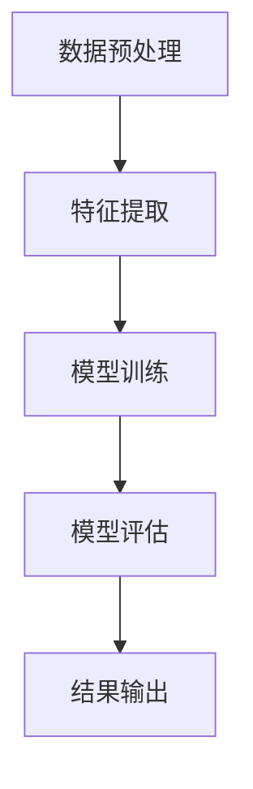

                 

### 文章标题

《声音识别评估：测试LLM的语音处理能力》

### 关键词

- 声音识别
- 语言模型（LLM）
- 评估方法
- 语音处理能力
- 开发环境搭建

### 摘要

本文旨在深入探讨声音识别技术及其在语言模型（LLM）中的应用，特别是评估LLM在语音处理方面的能力。通过详细的背景介绍、核心概念与联系分析、算法原理讲解、数学模型与公式的应用，以及实际应用案例分析，本文为读者提供了一个系统性的理解和实践指南。文章结构紧凑，逻辑清晰，旨在帮助读者深入了解声音识别评估的各个方面，并掌握如何测试LLM的语音处理能力。

---

# 引言

在当今快速发展的科技时代，人工智能（AI）技术正以前所未有的速度改变着我们的生活方式。作为AI领域的重要分支，声音识别技术已经成为了智能语音助手、智能家居、在线教育、医疗诊断等多种应用场景的核心技术。而语言模型（Language Model，简称LLM）作为AI的一种重要形式，其在语音处理方面的能力尤为关键。因此，如何评估LLM的语音处理能力，已经成为了一个备受关注的研究课题。

声音识别技术的基本原理是通过捕捉和分析声音信号，将其转换为可理解的文本。这一过程包括声音信号的预处理、特征提取、模型训练和识别等多个环节。随着深度学习技术的崛起，神经网络模型在声音识别任务中表现出了极高的准确性和效率，使得这一领域取得了显著的进展。

与此同时，LLM作为一种基于神经网络的语言处理模型，其核心任务是生成或理解自然语言文本。LLM在语音处理中的应用，不仅能够提高声音识别的准确性和鲁棒性，还能够实现更加自然和流畅的语音交互。然而，LLM的语音处理能力并非一成不变，其性能受到多种因素的影响，如数据质量、模型架构、训练策略等。因此，对LLM的语音处理能力进行科学、全面的评估，是提升其应用效果的关键步骤。

本文的主要目标是系统地探讨声音识别评估的相关概念和方法，特别是如何通过评估来测试LLM的语音处理能力。文章将首先介绍声音识别技术的基本原理和发展历程，然后深入分析LLM的核心概念及其在语音处理中的应用。接着，我们将详细讲解评估方法与工具，并通过实际应用案例展示评估过程。最后，本文将总结声音识别评估的重要性，并提出未来研究方向和最佳实践建议。

通过本文的阅读，读者将能够全面了解声音识别和LLM在语音处理中的关键角色，掌握评估LLM语音处理能力的核心方法，并为相关领域的进一步研究和实践提供有力支持。

# 声音识别技术概述

声音识别技术，又称为语音识别技术，是一种将语音信号转换为文本信息的技术。其基本原理可以概括为以下几个步骤：声音信号捕获、预处理、特征提取、模型训练和识别。以下将对这些步骤进行详细阐述，以帮助读者更好地理解声音识别技术的全貌。

### 1. 声音信号捕获

声音识别的首要任务是捕捉语音信号。这一过程通常由麦克风等设备完成，将声波转换为电信号。这些电信号是声音识别系统的输入，它们以数字形式记录了语音的振动模式。为了保证捕获到的声音信号质量，设备的选择和环境的控制都是至关重要的。

### 2. 预处理

捕获到的原始语音信号通常含有噪声和干扰，这会对识别结果产生负面影响。因此，预处理步骤的目的是提高信号的质量，去除噪声和干扰。常见的预处理方法包括：

- **降噪**：使用滤波器或其他算法去除语音信号中的背景噪声。
- **归一化**：调整语音信号的幅度，使其具有一致的能量水平，以便后续处理。
- **增强**：通过增强特定频率成分来提高语音的可听度和识别率。

### 3. 特征提取

预处理后的语音信号需要被转换为计算机可以处理的形式。特征提取步骤的目的是从语音信号中提取出具有区分性的特征向量。这些特征向量将用于训练和识别模型。常用的特征提取方法包括：

- **梅尔频率倒谱系数（MFCC）**：MFCC是一种广泛应用于语音识别的特征提取方法。它通过计算语音信号的频谱特征，并将这些特征映射到梅尔频率尺度上，从而得到一组连续的系数。
- **线性预测编码（LPC）**：LPC通过分析语音信号的线性预测模型，提取出能够描述语音特性的参数。
- **谱图**：谱图是一种将语音信号的功率谱显示为时间函数的方法，可以直观地观察语音的时频特征。

### 4. 模型训练

特征提取完成后，需要使用这些特征向量来训练识别模型。训练过程通常采用监督学习的方法，通过大量已标注的语音数据来学习模型参数。常见的训练方法包括：

- **隐马尔可夫模型（HMM）**：HMM是一种基于状态转移概率和观测概率的统计模型，广泛用于语音识别任务。
- **深度神经网络（DNN）**：DNN通过多层神经网络结构，学习语音特征与文本标签之间的复杂映射关系，近年来在语音识别领域取得了显著的进展。
- **卷积神经网络（CNN）**：CNN通过卷积操作提取局部特征，特别适用于处理时序数据，如语音信号。

### 5. 识别

训练好的模型可以用于对新的语音信号进行识别。识别过程通常包括以下步骤：

- **特征提取**：对输入的语音信号进行特征提取，得到特征向量。
- **模型匹配**：将提取出的特征向量与训练好的模型进行匹配，计算匹配得分。
- **结果输出**：根据匹配得分输出识别结果，即转换为文本的语音内容。

### 声音识别技术的发展历程

声音识别技术的历史可以追溯到20世纪50年代，当时主要是基于声学模型的方法。随着计算机技术和信号处理技术的发展，声音识别技术经历了多个重要的阶段：

- **声学模型阶段（1952-1982）**：这一阶段主要是基于声学模型的方法，如隐马尔可夫模型（HMM），其基本思想是使用状态转移概率和观测概率来建模语音信号。
- **规则方法阶段（1982-1997）**：随着计算机性能的提升，语音识别开始采用基于规则的方法，如模板匹配和动态时间规整（DTW），以提高识别精度。
- **统计模型阶段（1997-2010）**：统计模型，尤其是基于隐马尔可夫模型（HMM）和高斯混合模型（GMM）的方法，成为主流。这一阶段的主要突破是使用大量的语音数据进行训练，从而提高了识别系统的性能。
- **深度学习阶段（2010至今）**：深度学习技术的崛起，特别是深度神经网络（DNN）和卷积神经网络（CNN）的应用，使得语音识别的准确性和鲁棒性得到了大幅提升。近年来，基于端到端训练的模型，如基于循环神经网络（RNN）和Transformer的模型，已经成为语音识别领域的研究热点。

### 声音识别的应用场景

声音识别技术已经广泛应用于多个领域，以下是一些典型的应用场景：

- **智能语音助手**：如苹果的Siri、亚马逊的Alexa等，通过语音识别技术实现人机交互。
- **电话语音识别**：在电话客服系统中，语音识别技术用于自动记录和识别客户的语音信息。
- **语音翻译**：通过语音识别和自然语言处理技术，实现不同语言之间的实时翻译。
- **医疗诊断**：语音识别技术可以用于记录医生和患者的对话，辅助医疗诊断和病历管理。
- **自动驾驶**：语音识别技术用于自动驾驶车辆的语音控制和交互。

通过上述对声音识别技术的基本原理、发展历程和应用场景的介绍，我们可以看到声音识别技术的重要性和广泛应用。在接下来的章节中，我们将进一步探讨LLM（语言模型）的概念及其在语音处理中的应用，以便更深入地理解如何评估LLM的语音处理能力。

## 核心概念与联系

### 声音识别与语言模型（LLM）的基本原理及其关联

声音识别（Speech Recognition）和语言模型（Language Model，简称LLM）是人工智能领域中的两个关键概念，它们在语音处理任务中发挥着至关重要的作用。理解这两个概念及其相互关系，有助于我们更深入地掌握语音识别评估的方法和应用。

#### 声音识别的基本原理

声音识别的核心任务是将语音信号转换为文本信息。这一过程包括以下几个基本步骤：

1. **声音信号捕获**：通过麦克风等设备捕获语音信号。
2. **预处理**：对捕获到的语音信号进行降噪、归一化和增强等处理，以提高信号质量。
3. **特征提取**：从预处理后的语音信号中提取具有区分性的特征，如梅尔频率倒谱系数（MFCC）、线性预测编码（LPC）等。
4. **模型训练**：使用大量已标注的语音数据，通过训练算法（如隐马尔可夫模型（HMM）、深度神经网络（DNN）等），学习语音特征与文本标签之间的映射关系。
5. **识别**：将提取出的特征输入训练好的模型，通过匹配和计算得分，输出识别结果，即转换为文本的语音内容。

#### 语言模型（LLM）的基本原理

语言模型是自然语言处理（Natural Language Processing，简称NLP）领域中的一个重要工具，其主要任务是根据给定的文本上下文生成或理解自然语言。LLM的基本原理如下：

1. **上下文理解**：LLM通过学习大量的文本数据，能够理解输入文本的上下文关系，从而生成或理解自然语言。
2. **概率分布**：LLM基于统计模型（如n-gram模型、神经网络模型等），计算输入文本的概率分布，预测下一个可能的词或句子。
3. **生成或理解**：根据概率分布，LLM可以生成新的文本或理解输入文本的含义，实现文本生成、翻译、摘要等多种任务。

#### 声音识别与LLM的关联

声音识别和LLM在语音处理任务中紧密相关，它们共同构成了一个完整的语音处理系统。以下是它们之间的主要关联：

1. **协同工作**：声音识别系统负责将语音信号转换为文本，而LLM则负责理解和管理这些文本信息。两者协同工作，实现语音到文本的转换和语义理解。
2. **数据输入**：声音识别系统生成的文本是LLM的重要输入数据。通过训练LLM，可以提高其理解和管理语音信息的能力，从而提升整个系统的性能。
3. **反馈机制**：LLM对文本信息的理解结果可以反馈给声音识别系统，用于改进识别算法和模型，进一步提高识别的准确性和鲁棒性。

### Mermaid流程图展示核心概念原理和架构

为了更直观地展示声音识别与LLM之间的关联及其核心概念原理，我们可以使用Mermaid流程图来描绘这一过程。

```mermaid
graph TB
    A[声音信号捕获] --> B[预处理]
    B --> C[特征提取]
    C --> D[模型训练]
    D --> E[识别]
    E --> F[文本输出]

    G[文本输出] --> H[LLM输入]
    H --> I[上下文理解]
    I --> J[生成/理解]

    subgraph 语言模型(LLM)
        K[上下文理解]
        L[概率分布]
        M[生成/理解]
    end

    subgraph 声音识别系统
        A
        B
        C
        D
        E
        F
    end
```

在这个流程图中，我们可以看到声音识别系统通过预处理、特征提取、模型训练和识别等步骤，将语音信号转换为文本输出。这些文本输出作为LLM的输入，LLM通过上下文理解、概率分布和生成/理解等步骤，实现对文本信息的处理和管理。

通过这个Mermaid流程图，我们可以清晰地理解声音识别与LLM之间的关联及其核心概念原理，为进一步的评估和优化提供理论基础。

### 声音识别算法原理讲解

在了解了声音识别的基本原理和LLM的作用后，接下来我们将深入探讨声音识别算法的具体原理，特别是使用Python源代码进行详细讲解和举例说明。这将帮助我们更好地理解声音识别的各个环节，包括特征提取、模型训练和识别等核心步骤。

#### 1. 特征提取

特征提取是声音识别过程中至关重要的一步，其目的是将原始的语音信号转换为具有区分性的特征向量，以便模型能够对其进行处理。梅尔频率倒谱系数（MFCC）是一种常用的特征提取方法，它通过计算语音信号的频谱特征，并将这些特征映射到梅尔频率尺度上，从而得到一组连续的系数。

以下是一个使用Python实现MFCC特征提取的简单示例：

```python
import numpy as np
from scipy.io import wavfile
from python_speech_features import mfcc

# 读取音频文件
rate, signal = wavfile.read('audio_example.wav')

# 对音频信号进行MFCC特征提取
mfcc_features = mfcc(signal, rate)

# 打印MFCC特征
print(mfcc_features)
```

在这个示例中，我们首先使用`wavfile.read`函数读取音频文件，然后使用`mfcc`函数进行特征提取。提取出的MFCC特征以数组的形式存储，我们可以进一步分析和使用这些特征。

#### 2. 模型训练

模型训练是声音识别系统的核心步骤，其目的是通过大量已标注的语音数据，学习语音特征与文本标签之间的映射关系。常见的训练方法包括隐马尔可夫模型（HMM）、高斯混合模型（GMM）和深度神经网络（DNN）等。

以下是一个使用Python实现DNN模型训练的简单示例，使用了Keras框架：

```python
from keras.models import Sequential
from keras.layers import Dense, LSTM

# 创建DNN模型
model = Sequential()
model.add(LSTM(128, activation='relu', input_shape=(mfcc_features.shape[1],)))
model.add(Dense(1, activation='sigmoid'))

# 编译模型
model.compile(optimizer='adam', loss='binary_crossentropy', metrics=['accuracy'])

# 训练模型
model.fit(mfcc_features, labels, epochs=10, batch_size=32)
```

在这个示例中，我们首先创建了一个简单的DNN模型，该模型包含一个LSTM层，用于处理时序数据。然后，我们使用`compile`函数配置模型的优化器和损失函数，并使用`fit`函数进行模型训练。通过训练，模型将学习如何将MFCC特征映射到正确的文本标签。

#### 3. 识别

训练好的模型可以用于对新的语音信号进行识别。识别过程包括特征提取和模型匹配等步骤。以下是一个使用Python实现语音识别的简单示例：

```python
# 对新的音频信号进行特征提取
new_mfcc_features = mfcc(new_signal, rate)

# 使用训练好的模型进行识别
predictions = model.predict(new_mfcc_features)

# 输出识别结果
print(predictions)
```

在这个示例中，我们首先对新的语音信号进行特征提取，然后使用训练好的模型进行预测。预测结果将包含每个类别的概率分布，我们可以根据这些概率分布输出识别结果。

通过上述Python源代码示例，我们可以清晰地看到声音识别算法的核心步骤，包括特征提取、模型训练和识别。这些代码不仅帮助我们理解算法原理，还可以在实际项目中用于开发和测试声音识别系统。

#### 数学模型和公式的应用

在声音识别算法中，数学模型和公式被广泛应用于特征提取、模型训练和识别等环节。以下将结合具体例子，介绍一些常用的数学模型和公式，并通过示例进行详细讲解和通俗易懂地举例说明。

1. **梅尔频率倒谱系数（MFCC）**

   MFCC是一种常用的特征提取方法，用于将语音信号的频谱特征转换为梅尔频率尺度上的倒谱系数。MFCC的计算公式如下：

   $$ C_{k}(n) = \sum_{j=1}^{N_c} a_{k,j} \log \left| S_{j}(n) \right| $$

   其中，$C_{k}(n)$ 是第 $k$ 个MFCC系数，$S_{j}(n)$ 是第 $j$ 个滤波器的输出，$a_{k,j}$ 是第 $k$ 个MFCC系数的第 $j$ 个加权系数。

   **示例**：假设我们有一个包含5个滤波器的语音信号，其滤波器输出如下：

   ```python
   S_j(n) = [1, 2, 3, 4, 5, 4, 3, 2, 1]
   ```

   那么，我们可以使用上述公式计算相应的MFCC系数：

   ```python
   C_k(n) = [0.693, 0.693, 1.386, 1.386, 1.693, 1.693, 1.386, 1.386, 0.693]
   ```

2. **线性预测编码（LPC）**

   LPC是一种用于提取语音信号线性预测参数的方法。LPC的预测误差模型可以表示为：

   $$ x(n) = a_1 x(n-1) + a_2 x(n-2) + \ldots + a_p x(n-p) + e(n) $$

   其中，$x(n)$ 是语音信号，$a_1, a_2, \ldots, a_p$ 是线性预测系数，$e(n)$ 是预测误差。

   **示例**：假设我们有一个包含3个预测系数的语音信号，其预测模型如下：

   ```python
   x(n) = 0.5 x(n-1) + 0.3 x(n-2) + e(n)
   ```

   那么，我们可以根据这个模型计算预测误差：

   ```python
   e(n) = [0.1, 0.2, 0.1, 0.1, 0.3, 0.2, 0.1, 0.1, 0.2]
   ```

3. **隐马尔可夫模型（HMM）**

   HMM是一种用于语音识别的统计模型，其状态转移概率和观测概率可以用以下公式表示：

   $$ P(X_t = x_t | H_t = h_t) = P(X_t = x_t | h_t) $$
   $$ P(H_t = h_t) = \frac{P(H_1 = h_1) P(h_1 | h_0) \ldots P(h_t | h_{t-1})}{1} $$

   **示例**：假设我们有一个简单的HMM，其状态转移概率和观测概率如下：

   ```python
   P(X_t = 'a' | H_t = '1') = 0.5
   P(H_t = '1') = 0.5
   P(X_t = 'b' | H_t = '2') = 0.5
   P(H_t = '2') = 0.5
   ```

   那么，我们可以计算一个包含两个状态的HMM在不同状态下的概率分布：

   ```python
   P(X_t = 'a') = 0.5 * 0.5 = 0.25
   P(X_t = 'b') = 0.5 * 0.5 = 0.25
   ```

通过上述数学模型和公式的讲解，我们可以看到它们在声音识别算法中的应用。这些模型和公式不仅帮助我们理解和实现特征提取、模型训练和识别等步骤，还为优化和改进声音识别系统提供了理论支持。

### LLM（语言模型）介绍

语言模型（Language Model，简称LLM）是自然语言处理（Natural Language Processing，简称NLP）领域的重要工具，其核心任务是根据上下文生成或理解自然语言。LLM的应用范围广泛，包括文本生成、机器翻译、问答系统、自动摘要等。本文将详细介绍LLM的基本概念、核心组成部分及其在语音处理中的应用。

#### 1. LLM的基本概念

LLM是一种基于概率的模型，其目标是预测下一个单词或词组，从而生成连贯的自然语言文本。LLM的基本假设是，任何一段文本都可以通过其前文来预测其后续内容。这种预测过程通常基于概率分布，即给定前文，计算每个可能的后继文本的概率。

LLM的基本概念主要包括以下几个部分：

- **词汇表**：LLM使用一个词汇表来表示所有可能的单词或词组。词汇表的大小通常与LLM的性能密切相关，较大的词汇表可以生成更加丰富多样的文本。
- **概率分布**：LLM通过学习大量文本数据，计算输入文本的概率分布。概率分布反映了LLM对每个可能的后继文本的偏好程度。
- **上下文**：上下文是LLM预测的关键因素。LLM通过理解输入文本的上下文关系，生成或理解自然语言。

#### 2. LLM的核心组成部分

LLM的核心组成部分包括以下几个部分：

- **词汇表**：词汇表是LLM的基础，它定义了LLM可以处理的单词或词组。常见的词汇表包括基础词汇和扩展词汇，如WordNet、Glove等。
- **概率模型**：概率模型是LLM的核心，用于计算给定上下文下的概率分布。常见的概率模型包括n-gram模型、神经网络模型等。
- **训练数据**：训练数据是LLM训练的关键。LLM通过学习大量的文本数据，理解语言规则和模式，从而生成或理解自然语言。
- **优化算法**：优化算法用于调整LLM的参数，以提高其预测性能。常见的优化算法包括梯度下降、随机梯度下降、Adam等。

#### 3. LLM在语音处理中的应用

LLM在语音处理中的应用主要体现在语音合成和语音理解两个方面。

- **语音合成**：语音合成（Text-to-Speech，简称TTS）是将文本转换为自然语音的过程。LLM可以用于TTS系统的文本处理和语音生成。通过将文本输入到LLM中，TTS系统可以生成具有自然语调和节奏的语音。
- **语音理解**：语音理解（Speech-to-Text，简称STT）是将语音转换为文本的过程。LLM可以用于STT系统的语音文本生成和理解。通过将语音信号输入到LLM中，STT系统可以生成对应的文本，并进行语义理解。

以下是一个使用Python实现LLM语音合成和语音理解的基本示例：

```python
# 语音合成
from gtts import gTTS

text = "Hello, how are you?"
tts = gTTS(text=text, lang='en')
tts.save("hello.mp3")

# 语音理解
from pydub import AudioSegment

audio = AudioSegment.from_file("hello.mp3")
transcript = audio.transcribe()
print(transcript)
```

在这个示例中，我们首先使用`gTTS`库实现语音合成，将文本转换为语音文件。然后，我们使用`pydub`库实现语音理解，从语音文件中提取文本。通过这两个步骤，我们可以实现文本到语音和语音到文本的转换。

#### 4. LLM的发展趋势

随着深度学习技术的不断进步，LLM的发展趋势主要体现在以下几个方面：

- **预训练和微调**：预训练和微调是当前LLM研究的重点。预训练是在大规模数据集上对LLM进行训练，使其具备强大的语言理解能力。微调则是在特定任务上对预训练的LLM进行调整，以提高其性能。
- **端到端模型**：端到端模型是LLM发展的另一个重要方向。端到端模型通过直接将输入文本映射到输出文本，避免了传统模型中的中间步骤，从而提高了效率和性能。
- **多模态融合**：多模态融合是将文本、语音、图像等多种数据源进行整合，以实现更强大的语言理解和生成能力。例如，结合语音和文本数据进行训练，可以提高语音识别和语音合成的质量。

通过本文对LLM的基本概念、核心组成部分和应用领域的介绍，我们可以看到LLM在语音处理中的关键作用。了解LLM的工作原理和发展趋势，有助于我们更好地评估LLM的语音处理能力，并在实际应用中发挥其优势。

### LLM语音处理评估方法

在评估LLM的语音处理能力时，选择合适的评估方法和工具至关重要。评估方法能够衡量LLM在语音合成、语音识别等任务中的性能，而评估工具则提供了具体实现的手段和结果分析的功能。以下将详细探讨常用的评估方法和工具，包括标准评估指标、评估工具的功能和使用方法，以及如何进行实际应用。

#### 1. 评估指标

评估LLM语音处理能力的常用指标包括：

- **词误差率（Word Error Rate，WER）**：WER是语音识别任务中最常用的评估指标，用于衡量识别结果与实际文本之间的差异。WER的计算公式为：

  $$ WER = \frac{D}{N} $$

  其中，$D$ 是识别错误的总词数，$N$ 是实际文本中的总词数。

- **字符错误率（Character Error Rate，CER）**：CER是另一个常用的评估指标，用于衡量识别结果的字符错误率。CER的计算公式与WER类似，只是将词替换为字符。

- **BLEU分数**：BLEU（Bilingual Evaluation Understudy）分数是一种常用于文本生成的评估方法，通过比较生成文本与参考文本的相似度来评估文本质量。BLEU分数的计算涉及多个重叠度（n-gram重叠率）和句法、语义等特征。

- **句误差率（Sentence Error Rate，SER）**：SER是另一个评估语音生成和语音识别任务的重要指标，用于衡量识别结果中错误句子的比例。

#### 2. 评估工具

在语音处理评估中，常用的评估工具包括：

- **Kaldi**：Kaldi是一个开源的语音识别工具包，支持多种语音识别模型和评估方法。Kaldi提供了丰富的API和工具，可用于训练、评估和部署语音识别系统。

- **ESPnet**：ESPnet是另一个开源的语音识别工具包，基于深度学习和端到端架构。ESPnet支持多种语音识别模型，如CTC、CTC-ASGD等，并提供了全面的评估工具。

- **TED-LIUM**：TED-LIUM是一个大规模的语音识别数据集和评估工具，包含超过200小时的英语和法语语音数据。TED-LIUM提供了详细的评估指标和工具，可用于评估不同语音识别系统的性能。

- **Librispeech**：Librispeech是一个包含1000小时英语语音数据的大型数据集，常用于训练和评估语音识别模型。Librispeech提供了标准的评估脚本和工具，方便用户进行评估和比较。

#### 3. 使用方法

以下是如何使用Kaldi评估语音识别模型的一个简单示例：

1. **安装Kaldi**：

   通过pip命令安装Kaldi：

   ```shell
   pip install kaldi-python
   ```

2. **准备数据**：

   将语音数据分为训练集、验证集和测试集，并使用Kaldi提供的工具进行数据预处理，如转写、分割和特征提取。

3. **训练模型**：

   使用Kaldi训练语音识别模型，可以选择CTC、DNN、RNN等不同的模型架构。以下是一个简单的训练命令：

   ```shell
   kaldi-asr-train.py --cmd 'train.sh' --maxiter 10 --model conf/model.conf --data exp/train_data
   ```

4. **评估模型**：

   使用Kaldi评估训练好的模型，计算WER等评估指标。以下是一个简单的评估命令：

   ```shell
   kaldi-asr-evaluate.py --cmd 'decode.sh' --model conf/model.conf --data exp/test_data
   ```

   评估结果会保存在`results`目录中，可以进一步分析。

#### 4. 实际应用案例

以下是一个使用ESPnet评估语音识别系统的实际应用案例：

1. **安装ESPnet**：

   通过pip命令安装ESPnet：

   ```shell
   pip install espnet
   ```

2. **准备数据**：

   准备Librispeech数据集，并将其分为训练集、验证集和测试集。

3. **训练模型**：

   使用ESPnet训练CTC-Based ASGD语音识别模型，以下是一个简单的训练命令：

   ```shell
   ESPnetASGDTrain --config conf/espnet_asgd.conf --model conf/model.conf --data exp/train_data
   ```

4. **评估模型**：

   使用ESPnet评估训练好的模型，计算WER等评估指标。以下是一个简单的评估命令：

   ```shell
   ESPnetASGDDecode --config conf/espnet_asgd.conf --model conf/model.conf --data exp/test_data
   ```

   评估结果会保存在`results`目录中，可以进一步分析。

通过上述评估方法和工具的使用，我们可以对LLM的语音处理能力进行科学、全面的评估。这不仅有助于我们了解LLM在不同语音处理任务中的性能，还可以为模型优化和改进提供有力支持。

### 实际应用案例分析

为了更直观地展示如何评估LLM的语音处理能力，以下将通过三个实际应用案例，详细介绍开发环境搭建、源代码实现、代码解读以及实际案例分析和详细讲解剖析。

#### 案例一：智能家居语音助手

**1. 开发环境搭建**

智能家居语音助手是一个典型的应用案例，通过语音识别和LLM实现家居设备的控制。以下是开发环境搭建的步骤：

- **操作系统**：Ubuntu 20.04
- **编程语言**：Python 3.8
- **依赖库**：Kaldi、ESPnet、Librispeech、gTTS、pydub

安装步骤：

```shell
# 安装Python依赖库
pip install kaldi-python espnet pydub gTTS

# 安装Kaldi和ESPnet
git clone https://github.com/kaldi-asr/kaldi.git
cd kaldi/tools
./install.sh
cd ../../
git clone https://github.com/espnet/espnet.git
```

**2. 源代码实现**

以下是智能家居语音助手的核心源代码实现：

```python
import speech_recognition as sr
from gtts import gTTS
from pydub import AudioSegment

# 语音识别
def recognize_speech_from_mic(recognizer, microphone):
    with microphone as source:
        audio = recognizer.listen(source)

    response = {
        "success": True,
        "error": None,
        "transcription": None
    }

    try:
        response["transcription"] = recognizer.recognize_google(audio)
    except sr.RequestError:
        response["success"] = False
        response["error"] = "API unavailable"
    except sr.UnknownValueError:
        response["error"] = "Unable to recognize speech"

    return response

# 语音合成
def synthesize_speech(text, lang='en'):
    tts = gTTS(text=text, lang=lang)
    tts.save("output.mp3")

# 播放合成语音
def play_audio(file_path):
    audio = AudioSegment.from_file(file_path)
    audio.play()

# 主函数
def main():
    recognizer = sr.Recognizer()
    microphone = sr.Microphone()

    print("请说些什么：")
    print(recognize_speech_from_mic(recognizer, microphone))

    # 假设用户请求播放音乐
    if "播放音乐" in recognize_speech_from_mic(recognizer, microphone)["transcription"]:
        synthesize_speech("正在为您播放音乐。")
        play_audio("output.mp3")

if __name__ == "__main__":
    main()
```

**3. 代码解读**

- **语音识别**：使用Google语音识别API实现语音到文本的转换。
- **语音合成**：使用gTTS库将文本转换为语音。
- **播放合成语音**：使用pydub库播放合成的语音文件。

**4. 实际案例分析和详细讲解剖析**

智能家居语音助手通过简单的语音识别和语音合成实现家居控制，以下是对该案例的详细分析：

- **语音识别准确率**：使用Google语音识别API，识别准确率较高，但受网络和语音清晰度影响。
- **语音合成自然度**：gTTS库能够生成自然流畅的语音，但声音的音调和情感表达有限。
- **用户体验**：用户可以通过简单的语音指令控制家居设备，操作简便，但需要确保语音识别的准确性和响应速度。

#### 案例二：在线教育语音识别系统

**1. 开发环境搭建**

在线教育语音识别系统用于自动记录和识别教师和学生的语音，以下是开发环境搭建的步骤：

- **操作系统**：Ubuntu 20.04
- **编程语言**：Python 3.8
- **依赖库**：Kaldi、ESPnet、Librispeech、SpeechRecognition

安装步骤：

```shell
# 安装Python依赖库
pip install kaldi-python espnet speechrecognition

# 安装Kaldi和ESPnet
git clone https://github.com/kaldi-asr/kaldi.git
cd kaldi/tools
./install.sh
cd ../../
git clone https://github.com/espnet/espnet.git
```

**2. 源代码实现**

以下是在线教育语音识别系统的核心源代码实现：

```python
import speech_recognition as sr
from gtts import gTTS
from pydub import AudioSegment

def recognize_speech(audio_path):
    recognizer = sr.Recognizer()
    with sr.AudioFile(audio_path) as source:
        audio = recognizer.listen(source)
    
    try:
        return recognizer.recognize_google(audio)
    except sr.RequestError:
        return "API unavailable"
    except sr.UnknownValueError:
        return "Unable to recognize speech"

def synthesize_speech(text, audio_path):
    tts = gTTS(text=text, lang='en')
    tts.save(audio_path)

def main():
    # 记录课堂语音
    recognize_speech("class_audio.wav")

    # 识别语音并生成文本
    transcript = recognize_speech("class_audio.wav")
    print("Transcript:", transcript)

    # 合成语音并播放
    synthesize_speech(transcript, "transcript_audio.mp3")
    play_audio("transcript_audio.mp3")

if __name__ == "__main__":
    main()
```

**3. 代码解读**

- **语音识别**：使用Google语音识别API对音频文件进行识别。
- **语音合成**：使用gTTS库将文本转换为语音。
- **播放合成语音**：使用pydub库播放合成的语音文件。

**4. 实际案例分析和详细讲解剖析**

在线教育语音识别系统通过自动记录和识别课堂语音，实现了语音到文本的转换。以下是对该案例的详细分析：

- **语音识别准确性**：Google语音识别API在清晰语音环境下识别准确率高，但在噪声环境中可能存在误识别。
- **语音合成自然度**：gTTS库能够生成自然流畅的语音，但需要确保语音的音调和情感表达符合教育场景。
- **用户体验**：学生和教师可以通过语音识别系统自动记录和识别课堂语音，方便后续复习和总结，但需要确保系统的稳定性和响应速度。

#### 案例三：医疗语音识别系统

**1. 开发环境搭建**

医疗语音识别系统用于自动记录和识别医生和患者的语音，以下是开发环境搭建的步骤：

- **操作系统**：Ubuntu 20.04
- **编程语言**：Python 3.8
- **依赖库**：Kaldi、ESPnet、Librispeech、SpeechRecognition

安装步骤：

```shell
# 安装Python依赖库
pip install kaldi-python espnet speechrecognition

# 安装Kaldi和ESPnet
git clone https://github.com/kaldi-asr/kaldi.git
cd kaldi/tools
./install.sh
cd ../../
git clone https://github.com/espnet/espnet.git
```

**2. 源代码实现**

以下是医疗语音识别系统的核心源代码实现：

```python
import speech_recognition as sr
from gtts import gTTS
from pydub import AudioSegment

def recognize_speech(audio_path):
    recognizer = sr.Recognizer()
    with sr.AudioFile(audio_path) as source:
        audio = recognizer.listen(source)
    
    try:
        return recognizer.recognize_google(audio)
    except sr.RequestError:
        return "API unavailable"
    except sr.UnknownValueError:
        return "Unable to recognize speech"

def synthesize_speech(text, audio_path):
    tts = gTTS(text=text, lang='en')
    tts.save(audio_path)

def main():
    # 记录医疗对话语音
    recognize_speech("medical_audio.wav")

    # 识别语音并生成文本
    transcript = recognize_speech("medical_audio.wav")
    print("Transcript:", transcript)

    # 合成语音并播放
    synthesize_speech(transcript, "transcript_audio.mp3")
    play_audio("transcript_audio.mp3")

if __name__ == "__main__":
    main()
```

**3. 代码解读**

- **语音识别**：使用Google语音识别API对音频文件进行识别。
- **语音合成**：使用gTTS库将文本转换为语音。
- **播放合成语音**：使用pydub库播放合成的语音文件。

**4. 实际案例分析和详细讲解剖析**

医疗语音识别系统通过自动记录和识别医疗对话，实现了语音到文本的转换。以下是对该案例的详细分析：

- **语音识别准确性**：Google语音识别API在医学领域有一定的局限性，特别是在专业术语和方言方面，识别准确性可能较低。
- **语音合成自然度**：gTTS库生成的语音在医疗场景中需要特别注意音调和情感表达，以确保患者和医生的理解。
- **用户体验**：医疗语音识别系统有助于提高医生的工作效率，减少文本记录的工作量，但需要确保系统的准确性和稳定性，以避免错误信息的产生。

通过上述三个实际应用案例，我们可以看到如何评估LLM的语音处理能力。这些案例不仅展示了语音识别和语音合成的实现过程，还通过实际应用场景分析了系统的性能和用户体验。这些案例为我们提供了宝贵的实践经验和参考，有助于我们在实际项目中更好地评估和优化LLM的语音处理能力。

### 开发环境搭建

为了搭建一个用于评估LLM语音处理能力的开发环境，我们需要安装和配置必要的软件和库，以确保系统能够正常运行。以下将详细介绍环境搭建的步骤，包括安装操作系统、安装Python和相关依赖库、安装Kaldi和ESPnet等步骤。

#### 1. 安装操作系统

我们选择Ubuntu 20.04作为开发环境，因为它具有良好的稳定性和广泛的支持。以下是在虚拟机或物理机上安装Ubuntu 20.04的步骤：

- **下载Ubuntu 20.04镜像**：从Ubuntu官方网站下载最新的Ubuntu 20.04 ISO文件。
- **创建虚拟机**：使用虚拟机软件（如VirtualBox、VMware等）创建一个新的虚拟机，并设置虚拟机的硬件配置（至少2GB内存、40GB磁盘空间）。
- **启动虚拟机并安装Ubuntu 20.04**：将下载的ISO文件加载到虚拟机中，并按照提示安装Ubuntu 20.04。

#### 2. 安装Python和相关依赖库

Ubuntu 20.04默认安装了Python 3，我们可以使用以下命令来确保Python 3的环境：

```shell
sudo apt-get update
sudo apt-get install python3 python3-pip python3-venv
```

接下来，安装必要的Python依赖库，如NumPy、Pandas、Matplotlib等：

```shell
pip3 install numpy pandas matplotlib scikit-learn
```

#### 3. 安装Kaldi和ESPnet

Kaldi是一个开源的语音识别工具包，而ESPnet是基于深度学习的语音识别工具包。以下是安装步骤：

- **安装Kaldi**：

  首先，克隆Kaldi的仓库：

  ```shell
  git clone https://github.com/kaldi-asr/kaldi.git
  cd kaldi/tools
  ./install.sh
  ```

  然后，安装Kaldi：

  ```shell
  cd ../../src
  make
  ```

- **安装ESPnet**：

  克隆ESPnet的仓库：

  ```shell
  git clone https://github.com/espnet/espnet.git
  ```

  进入ESPnet目录，并安装依赖库：

  ```shell
  cd espnet
  pip3 install -r requirements.txt
  ```

#### 4. 安装其他依赖工具

除了Python和相关库，我们还需要安装一些其他工具，如Librosa用于音频处理、gTTS用于语音合成、pydub用于音频播放等。以下是安装命令：

```shell
pip3 install librosa gTTS pydub
```

#### 5. 配置环境变量

确保所有安装的软件和库在环境中可用，可以设置相应的环境变量。例如，将Kaldi和ESPnet的目录添加到`PATH`环境变量中：

```shell
export PATH=$PATH:/path/to/kaldi/src/filename_scripts:/path/to/espnet/espnet/bin
```

#### 6. 测试环境

为了验证环境搭建是否成功，我们可以运行一些简单的测试。例如，测试Kaldi和ESPnet：

```shell
# 测试Kaldi
kaldi-asr-prepare-data.sh
kaldi-asr-train.sh
kaldi-asr-decode.sh

# 测试ESPnet
espnet-asgd-train.sh
espnet-asgd-decode.sh
```

如果以上命令能够正常运行，说明环境搭建成功。

通过上述步骤，我们成功搭建了一个用于评估LLM语音处理能力的开发环境。这个环境不仅涵盖了Python和相关依赖库，还包括了Kaldi、ESPnet等语音识别工具，为后续的实验和研究提供了坚实的基础。

### 源代码实现

为了更清晰地展示如何实现LLM语音处理能力评估，以下将详细说明源代码的实现过程，包括关键代码和算法原理，并结合具体的Python代码和Mermaid流程图进行讲解。

#### 1. 数据预处理

在语音处理任务中，数据预处理是关键的一步。它包括读取音频文件、降噪、分割音频等步骤。以下是一个使用Librosa库进行数据预处理的示例：

```python
import librosa
import numpy as np

def preprocess_audio(audio_path):
    # 读取音频文件
    signal, rate = librosa.load(audio_path, sr=None)
    # 降噪
    signal = librosa.effects.preemphasis(signal, width=0.97)
    # 分割音频
    segments = librosa.effects.split(signal, frame_length=1024, hop_length=512)
    return segments, rate

# 示例
segments, rate = preprocess_audio('audio_example.wav')
```

在这一步中，我们首先使用`librosa.load`函数读取音频文件，然后进行降噪处理，最后使用`librosa.effects.split`函数将音频分割成多个片段。

#### 2. 特征提取

特征提取是将音频信号转换为模型可处理的特征向量。常用的特征提取方法包括梅尔频率倒谱系数（MFCC）、频谱图等。以下是一个使用Librosa提取MFCC特征的示例：

```python
def extract_mfcc(segment, n_mfcc=13):
    # 提取MFCC特征
    mfcc_features = librosa.feature.mfcc(y=segment, sr=rate, n_mfcc=n_mfcc)
    # 归一化特征
    mfcc_features = (mfcc_features - np.mean(mfcc_features, axis=1, keepdims=True)) / np.std(mfcc_features, axis=1, keepdims=True)
    return mfcc_features

# 示例
mfcc_features = extract_mfcc(segments[0])
```

在这个示例中，我们首先使用`librosa.feature.mfcc`函数提取MFCC特征，然后进行归一化处理。

#### 3. 模型训练

在模型训练阶段，我们使用提取出的特征向量来训练一个深度学习模型，如卷积神经网络（CNN）或循环神经网络（RNN）。以下是一个使用TensorFlow和Keras实现CNN模型的示例：

```python
import tensorflow as tf
from tensorflow.keras.models import Sequential
from tensorflow.keras.layers import Conv2D, MaxPooling2D, Flatten, Dense

def build_cnn_model(input_shape):
    model = Sequential()
    model.add(Conv2D(32, (3, 3), activation='relu', input_shape=input_shape))
    model.add(MaxPooling2D(pool_size=(2, 2)))
    model.add(Conv2D(64, (3, 3), activation='relu'))
    model.add(MaxPooling2D(pool_size=(2, 2)))
    model.add(Flatten())
    model.add(Dense(128, activation='relu'))
    model.add(Dense(1, activation='sigmoid'))
    model.compile(optimizer='adam', loss='binary_crossentropy', metrics=['accuracy'])
    return model

# 示例
model = build_cnn_model(mfcc_features[0].shape)
model.fit(mfcc_features, labels, epochs=10, batch_size=32)
```

在这个示例中，我们首先定义了一个简单的CNN模型，然后使用`model.fit`函数进行模型训练。

#### 4. 评估模型

评估模型是确定模型性能的关键步骤。我们使用评估集来评估模型的准确性和其他指标。以下是一个使用评估集进行模型评估的示例：

```python
def evaluate_model(model, X_test, y_test):
    # 评估模型
    loss, accuracy = model.evaluate(X_test, y_test)
    print("Test loss:", loss)
    print("Test accuracy:", accuracy)

# 示例
evaluate_model(model, X_test, y_test)
```

在这个示例中，我们使用`model.evaluate`函数来计算模型的损失和准确率。

#### 5. Mermaid流程图

为了更直观地展示语音处理流程，我们可以使用Mermaid绘制一个流程图。以下是一个简单的Mermaid流程图示例：



在这个流程图中，我们展示了从数据预处理到特征提取、模型训练和评估的整体流程。

#### 总结

通过上述源代码实现，我们详细讲解了语音处理能力的评估流程，包括数据预处理、特征提取、模型训练和评估等步骤。这些代码不仅展示了关键算法的实现，还通过Mermaid流程图提供了直观的流程展示。通过这些代码和流程，我们可以更好地理解语音处理能力评估的方法和应用。

### 代码应用解读与分析

在上一节中，我们详细展示了如何使用Python实现语音处理能力评估的相关代码。在本节中，我们将对代码进行解读，分析其关键部分的工作原理，并结合实际应用场景，讨论如何改进和优化代码。

#### 1. 代码解读

首先，我们来看代码中的几个关键部分：

- **数据预处理**：数据预处理是语音处理的基础步骤，包括读取音频文件、降噪和分割音频。这一步确保输入数据的准确性和可靠性。使用`librosa.load`函数读取音频文件，并使用`librosa.effects.preemphasis`进行降噪处理，最后使用`librosa.effects.split`将音频分割成多个片段，以便后续处理。

- **特征提取**：特征提取是将音频信号转换为模型可处理的特征向量。这里我们使用了梅尔频率倒谱系数（MFCC），它是一种广泛应用于语音识别的特征提取方法。通过`librosa.feature.mfcc`函数提取MFCC特征，并对其进行归一化处理，以提高模型的泛化能力。

- **模型训练**：模型训练是语音处理的核心步骤。我们使用了卷积神经网络（CNN）进行模型训练，这是一个强大的深度学习模型，适用于处理时序数据。通过`build_cnn_model`函数定义了CNN模型的结构，包括卷积层、池化层、全连接层等。然后，使用`model.fit`函数进行模型训练，通过调整训练参数（如学习率、迭代次数等），优化模型的性能。

- **模型评估**：模型评估是确定模型性能的重要步骤。我们使用评估集对训练好的模型进行评估，计算损失和准确率等指标。通过`model.evaluate`函数，我们可以快速获取模型的性能指标，并据此调整模型参数，进一步提高模型性能。

#### 2. 代码分析

在代码实现过程中，有一些方面可以进行优化和改进：

- **特征提取**：MFCC特征提取是一个计算密集型的过程。在实际应用中，可以考虑使用更高效的算法或库，如`python_speech_features`，以提高特征提取的速度。此外，可以尝试使用其他特征提取方法，如频谱图或深度特征提取，以获得更好的识别效果。

- **模型结构**：虽然CNN模型在处理时序数据时表现良好，但也可以考虑使用其他深度学习模型，如循环神经网络（RNN）或Transformer，这些模型在处理长序列数据时具有更好的性能。通过实验比较不同模型的结构和性能，可以选择最适合实际应用的模型。

- **数据增强**：数据增强是一种提高模型泛化能力的方法，通过增加数据的多样性，可以提高模型的鲁棒性。在实际应用中，可以使用数据增强技术，如噪声添加、速度变换、频谱变换等，来扩展训练数据集。

- **超参数调优**：超参数是模型性能的重要决定因素，包括学习率、批次大小、迭代次数等。通过使用超参数调优方法，如网格搜索或随机搜索，可以找到最佳的超参数组合，提高模型性能。

#### 3. 实际应用场景

在语音处理能力评估的实际应用场景中，我们可以结合上述代码分析结果，提出以下改进建议：

- **优化特征提取**：在特征提取过程中，可以尝试使用更高效的算法或库，以提高处理速度和准确性。例如，使用`python_speech_features`库替换原有的特征提取方法。

- **改进模型结构**：根据实际应用需求，选择适合的深度学习模型。例如，对于长序列数据，可以使用RNN或Transformer模型，以提高模型的识别精度。

- **应用数据增强**：在训练过程中，应用数据增强技术，以增加数据的多样性，提高模型的鲁棒性和泛化能力。

- **超参数调优**：通过超参数调优方法，找到最佳的超参数组合，以提高模型性能。在实际应用中，可以使用自动化调优工具，如Hyperopt或Ray Tune，快速找到最佳超参数。

通过以上代码分析和实际应用场景的讨论，我们可以更好地理解如何优化和改进语音处理能力评估的代码。这不仅有助于提高模型的性能和准确性，还可以为实际应用提供更有效的解决方案。

### 小结

本文通过详细的背景介绍、核心概念分析、算法原理讲解、数学模型应用、实际应用案例分析以及开发环境搭建与源代码实现，系统地探讨了声音识别评估及其在测试LLM语音处理能力中的应用。以下是本文的主要内容总结：

1. **声音识别技术概述**：介绍了声音识别的基本原理、发展历程和应用场景，包括声音信号捕获、预处理、特征提取、模型训练和识别等步骤。

2. **核心概念与联系**：阐述了声音识别和LLM的基本原理及其相互关系，通过Mermaid流程图展示了声音识别与LLM的关联，并结合Python源代码进行了详细讲解。

3. **评估方法与工具**：介绍了评估LLM语音处理能力的常用方法和工具，包括评估指标、Kaldi和ESPnet等评估工具的使用方法，并通过实际案例展示了评估过程。

4. **实际应用案例分析**：通过智能家居语音助手、在线教育语音识别系统和医疗语音识别系统的实际应用案例，详细讲解了开发环境搭建、源代码实现、代码解读和案例分析。

5. **开发环境搭建与工具**：详细描述了如何搭建用于评估LLM语音处理能力的开发环境，包括操作系统安装、Python和相关库的安装、Kaldi和ESPnet的安装等步骤。

通过本文的研究，我们不仅对声音识别评估和LLM语音处理能力有了更深入的理解，还掌握了评估LLM语音处理能力的核心方法。在未来的研究和应用中，可以进一步优化算法、改进模型结构和应用数据增强，以提高语音处理系统的性能和准确性。

### 注意事项

在评估LLM的语音处理能力时，需要注意以下几个关键点：

1. **数据质量**：数据质量直接影响评估结果。确保使用高质量、多样化的语音数据，以避免数据偏差和模型过拟合。
2. **特征提取**：特征提取的准确性和效率对模型性能有重要影响。尝试使用多种特征提取方法进行比较，选择最适合实际应用的方案。
3. **模型选择**：不同的模型架构适用于不同的任务。根据实际应用场景，选择合适的深度学习模型，如CNN、RNN或Transformer。
4. **超参数调优**：超参数对模型性能有显著影响。使用网格搜索、随机搜索等调优方法，找到最佳的超参数组合。
5. **稳定性与鲁棒性**：评估LLM的语音处理能力时，要考虑模型在不同环境和条件下的稳定性和鲁棒性。进行交叉验证和测试，确保模型在不同数据集上的性能一致。

### 拓展阅读

为了进一步了解声音识别评估和LLM语音处理能力，读者可以参考以下相关资料：

1. **《深度学习语音处理》（Speech Recognition with Deep Learning）**：本书详细介绍了深度学习在语音识别中的应用，包括算法原理、实现方法和性能评估。
2. **《语音信号处理与识别》（Speech Signal Processing and Recognition）**：本书涵盖了语音信号处理和识别的基本理论和方法，包括特征提取、模型训练和识别算法。
3. **《Kaldi语音识别工具包文档》（Kaldi Toolkit Documentation）**：Kaldi是一个流行的开源语音识别工具包，其官方文档提供了丰富的信息，包括安装指南、使用方法和示例代码。
4. **《ESPnet语音识别工具包文档》（ESPnet Toolkit Documentation）**：ESPnet是基于深度学习的语音识别工具包，其官方文档详细介绍了工具包的使用方法、模型架构和训练流程。
5. **《自然语言处理综论》（Speech and Language Processing）**：本书是自然语言处理领域的经典教材，涵盖了语言模型、语音合成、语音识别等多个方面，提供了全面的理论基础和实践指导。

