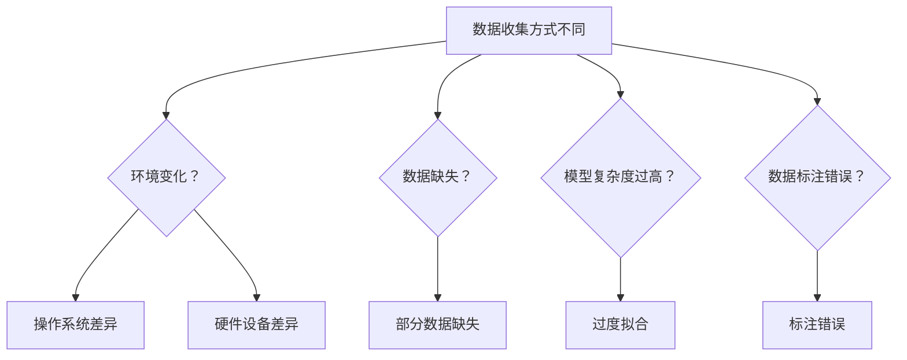

                 

### 引言

在现代人工智能（AI）和机器学习（ML）领域，模型训练和任务执行过程中经常遇到的一个关键问题就是“领域偏移”（Domain Shift）。领域偏移指的是在模型训练数据和实际应用数据之间存在的不一致性，这种不一致性可能导致模型在现实世界中的表现不佳。领域偏移可以表现为多种形式，例如数据分布的变化、数据特征的差异、噪声的增加等。因此，处理领域偏移成为了提高模型泛化能力和实际应用效果的重要研究方向。

本文旨在系统地探讨领域偏移的概念、检测、校正方法，以及其在实际任务中的应用。通过详细分析领域偏移的背景、原因和影响，本文将帮助读者深入了解这一重要问题，并提供一系列有效的解决策略。

文章的结构如下：

- **第1章：领域偏移的概念与背景**：介绍领域偏移的定义、常见类型、原因及其影响。
- **第2章：领域偏移检测技术**：讨论领域偏移检测的几种主要方法，包括基于统计的方法、基于深度学习和迁移学习方法。
- **第3章：领域偏移校正技术**：探讨领域偏移校正的技术，如基于特征重排、模型调整和元学习方法。
- **第4章：领域偏移在实际任务中的应用**：分析领域偏移在自然语言处理、计算机视觉和机器人控制等领域的具体应用案例。
- **第5章：领域偏移的挑战与未来趋势**：总结领域偏移当前面临的挑战和未来研究的发展方向。

通过本文的阅读，读者将能够全面了解领域偏移的概念、检测和校正方法，掌握其在实际任务中的应用，并预见到领域偏移研究的未来趋势。

### 核心关键词

- 领域偏移（Domain Shift）
- 数据分布（Data Distribution）
- 泛化能力（Generalization）
- 模型训练（Model Training）
- 模型部署（Model Deployment）
- 检测方法（Detection Methods）
- 校正方法（Correction Methods）
- 迁移学习（Transfer Learning）
- 深度学习（Deep Learning）

### 摘要

本文围绕“领域偏移”这一主题，深入探讨了其在机器学习和人工智能中的重要性。首先，本文介绍了领域偏移的定义、类型及其对模型性能的影响。接着，详细讨论了领域偏移检测和校正的技术手段，包括基于统计、深度学习和迁移学习的方法。本文还通过具体案例展示了领域偏移在实际应用中的挑战和解决方案。最后，本文总结了领域偏移研究的现状和未来发展趋势，为后续研究提供了方向。通过本文的阅读，读者将能够全面了解领域偏移的概念、检测和校正方法，并掌握其在实际任务中的应用。

## 第1章：领域偏移的概念与背景

领域偏移（Domain Shift）是机器学习和人工智能领域中一个关键且复杂的问题。它是指在模型训练数据和实际应用数据之间存在的不一致性，这种不一致性可能表现为数据分布、特征、噪声等方面的差异。理解领域偏移的概念和类型，对于开发能够适应多种环境和场景的智能系统至关重要。

### 定义与类型

领域偏移可以定义为模型训练数据所在的领域（Domain A）与实际应用数据所在的领域（Domain B）之间的不一致性。这种不一致性可能导致模型在新领域（Domain B）上的性能下降。根据领域偏移的表现形式，可以分为以下几种类型：

1. **分布偏移（Distribution Shift）**：这是最常见的一种类型，指的是训练数据和测试数据的分布不同。这种偏移可能由于数据收集方式、环境变化等因素引起。

2. **特征偏移（Feature Shift）**：当数据特征的结构或内容发生变化时，就产生了特征偏移。例如，在图像分类任务中，训练数据和测试数据中物体的姿态、光照条件等可能存在差异。

3. **噪声偏移（Noise Shift）**：噪声偏移指的是模型训练数据和测试数据中的噪声水平不同。过多的噪声可能干扰模型的判断，降低模型的泛化能力。

4. **概念偏移（Concept Shift）**：在某些情况下，训练数据和测试数据所代表的概念可能发生变化。例如，在天气预报模型中，随着时间的推移，天气模式可能发生变化。

### 原因分析

领域偏移的产生原因多种多样，主要包括以下几点：

1. **数据收集方式**：训练数据和测试数据可能来自不同的数据收集方式，这会导致数据分布的差异。

2. **环境变化**：实际应用环境可能与训练环境存在差异，如硬件设备、操作系统等。

3. **数据缺失**：在某些应用场景中，训练数据和测试数据可能不完全相同，导致部分数据缺失。

4. **模型复杂度**：过于复杂的模型可能对训练数据过度拟合，无法适应新的数据分布。

5. **数据标注错误**：训练数据和测试数据在标注过程中可能存在错误，导致模型无法正确识别实际数据。

### 影响评估

领域偏移对模型性能的影响是多方面的：

1. **准确性下降**：领域偏移可能导致模型在测试数据上的准确性下降。

2. **泛化能力降低**：模型可能无法适应新的领域，降低其泛化能力。

3. **可靠性下降**：模型在实际应用中的可靠性可能降低，导致错误决策。

4. **维护成本增加**：为了应对领域偏移，可能需要重新收集数据、重新训练模型，增加维护成本。

为了更好地理解和处理领域偏移，我们需要深入探讨其检测和校正方法。接下来，我们将分别介绍这些方法，帮助读者在实际应用中应对领域偏移带来的挑战。

### Mermaid流程图

为了更好地展示领域偏移的原因，我们可以使用Mermaid流程图来直观地描述领域偏移的常见原因。



在这个流程图中，从数据收集方式开始，我们考虑了可能导致领域偏移的各种原因，并展示了这些原因如何影响模型训练和应用。通过这个流程图，我们可以更清晰地理解领域偏移的产生原因，并为后续的检测和校正提供指导。

### 领域偏移检测

在了解了领域偏移的概念和原因后，我们需要讨论如何检测领域偏移。领域偏移检测是解决领域偏移问题的第一步，它可以帮助我们识别训练数据和测试数据之间是否存在不一致性。以下是几种常见的领域偏移检测技术：

#### 基于统计的方法

**统计测试**是一种简单而有效的方法来检测领域偏移。统计测试通过比较训练数据和测试数据的统计特性来判断是否存在偏移。常见的统计测试方法包括：

1. **Kolmogorov-Smirnov 测试**：这种测试用于比较两个分布的累积分布函数，如果差异显著，则表明存在领域偏移。

2. **Anderson-Darling 测试**：这是一种更严格的统计测试，用于检测两个分布之间的差异。它考虑了分布的尾部特性。

3. **Cramér-von Mises 测试**：这种方法基于经验分布函数的平方误差，用于评估两个分布的相似度。

这些统计测试通常需要事先设定一个显著性水平（如α），如果测试结果显著大于这个水平，则认为存在领域偏移。虽然统计测试方法简单易用，但它们通常假设数据是独立同分布的，这可能在实际应用中不成立。

#### 基于深度学习的方法

深度学习模型，尤其是神经网络，可以自动学习数据的高层次特征，这使得它们在检测领域偏移方面具有很大潜力。以下是一些基于深度学习的方法：

1. **域适应网络（Domain Adaptation Network）**：这些网络通过学习源域和目标域之间的映射关系来检测领域偏移。一个常见的例子是DANN（Domain-Adversarial Neural Network），它使用对抗性训练来使分类器对领域偏移不敏感。

2. **特征空间差异度量**：这种方法通过比较源域和目标域数据在特征空间中的分布差异来检测领域偏移。例如，可以通过计算两个域的特征分布的KL散度（Kullback-Leibler Divergence）来判断是否存在偏移。

3. **多任务学习**：在多任务学习框架下，模型在训练过程中同时学习多个相关任务的表示。如果任务之间存在领域偏移，则这些表示可能不一致，可以通过对比这些表示的差异来检测领域偏移。

基于深度学习的方法的优点在于它们能够自动学习复杂的数据特征，并适应不同类型的数据分布。然而，这些方法通常需要大量的数据和计算资源，并且可能面临过拟合的风险。

#### 基于迁移学习的方法

迁移学习是一种利用在不同任务上预训练的模型来适应新任务的方法。在迁移学习中，模型在源域上学习到的特征表示可以迁移到目标域上，从而减少领域偏移的影响。以下是一些基于迁移学习的方法：

1. **无监督域适应（Unsupervised Domain Adaptation）**：这种方法不需要目标域的标注数据，通过最小化源域和目标域特征分布之间的差异来适应目标域。

2. **有监督域适应（Supervised Domain Adaptation）**：这种方法利用少量目标域的标注数据，结合源域的大量未标注数据来训练模型。

3. **元学习（Meta-Learning）**：元学习通过学习模型的泛化能力，从而在目标域上快速适应。例如，模型可以通过在多个源域上训练，学习到泛化的特征表示，然后在新的目标域上应用这些表示。

基于迁移学习的方法的优点在于它们可以利用大量未标注的源域数据，从而减少对标注数据的依赖。然而，这些方法可能面临领域适应性不足的问题，尤其是在目标域和源域之间存在显著差异时。

总之，领域偏移检测是解决领域偏移问题的第一步，通过使用统计测试、深度学习和迁移学习等方法，我们可以有效地检测领域偏移，并为后续的校正提供依据。接下来，我们将探讨如何校正领域偏移，以进一步提高模型的泛化能力和实际应用效果。

### Python源代码与数学模型

为了更深入地理解领域偏移检测的方法，我们可以通过Python代码和数学模型来进行实际演示。以下是一个简单的示例，展示如何使用统计测试方法中的Kolmogorov-Smirnov测试来检测领域偏移。

首先，我们需要安装必要的库，如`numpy`和`scipy`：

```python
!pip install numpy scipy
```

接下来，我们编写一个简单的Python脚本，用于生成两个具有不同分布的数据集，并使用Kolmogorov-Smirnov测试来检测领域偏移：

```python
import numpy as np
from scipy.stats import kstest
import matplotlib.pyplot as plt

# 生成具有不同分布的数据集
def generate_data(dist_type='uniform', size=1000):
    if dist_type == 'uniform':
        return np.random.uniform(size=size)
    elif dist_type == 'normal':
        return np.random.normal(size=size)
    else:
        raise ValueError("Unsupported distribution type")

# 数据集A（训练集）和数据集B（测试集）
data_A = generate_data(dist_type='uniform')
data_B = generate_data(dist_type='normal')

# 应用Kolmogorov-Smirnov测试
ks_test_result = kstest(data_A, 'norm', args=(0, 1))

# 打印测试结果
print(f"Kolmogorov-Smirnov test result: D={ks_test_result.statistic}, p-value={ks_test_result.pvalue}")

# 绘制数据分布图
plt.figure(figsize=(10, 6))
plt.hist(data_A, bins=30, alpha=0.5, label='Training Data (Uniform)')
plt.hist(data_B, bins=30, alpha=0.5, label='Test Data (Normal)')
plt.title('Histogram of Data Distributions')
plt.xlabel('Value')
plt.ylabel('Frequency')
plt.legend()
plt.show()
```

在上面的代码中，我们首先定义了一个函数`generate_data`，用于生成具有不同分布的数据集。然后，我们生成了两个数据集：数据集A（均匀分布）和数据集B（正态分布）。接着，我们使用`kstest`函数来计算Kolmogorov-Smirnov统计量，并打印结果。最后，我们绘制了数据分布的直方图，以直观地展示两个数据集之间的分布差异。

下面是具体的数学模型和公式，用于解释Kolmogorov-Smirnov测试：

$$
D = \max_{x \in \mathbb{R}} |F_X(x) - F_Y(x)|
$$

其中，$F_X(x)$和$F_Y(x)$分别是两个分布的累积分布函数（CDF）。$D$的值表示两个分布之间的最大距离，如果$D$显著大于零，则表明存在领域偏移。

在实际应用中，我们可以使用更复杂的统计方法和深度学习模型来检测领域偏移。然而，上面的简单示例为我们提供了一个基本框架，帮助我们理解领域偏移检测的核心概念。

### 实际案例分析与详细讲解

为了更好地理解领域偏移在实际任务中的应用，我们来看几个具体的案例，并详细分析这些案例中领域偏移的产生原因及其影响。

#### 案例一：自然语言处理中的领域偏移

自然语言处理（NLP）任务中，领域偏移是一个常见问题。例如，在一个对话系统中，如果训练数据和测试数据来自不同的领域（如新闻和社交媒体），那么模型可能会在测试数据上表现不佳。这是因为训练数据和测试数据在词汇、语法和语义上存在显著差异。

**原因分析**：
- **词汇差异**：不同领域的文本数据可能包含不同的专业术语和词汇，这会导致模型在处理测试数据时遇到困难。
- **语法结构**：某些领域的文本可能有特定的语法结构和表达方式，训练数据中未出现这些结构，可能导致模型无法正确理解测试数据。

**影响**：
- **准确性下降**：领域偏移可能导致模型在测试数据上的准确性显著下降。
- **用户体验差**：如果对话系统无法正确理解用户的输入，用户体验将大打折扣。

**解决方案**：
- **多领域训练**：通过收集和整合多个领域的文本数据，提高模型对不同领域的适应性。
- **迁移学习**：利用预训练的通用语言模型，结合领域特定的数据进行微调，以提高模型在特定领域的表现。

#### 案例二：计算机视觉中的领域偏移

在计算机视觉任务中，领域偏移可能由于图像采集环境的变化而产生。例如，在自动驾驶系统中，训练数据和测试数据可能来自不同的天气条件、光照条件或道路环境。

**原因分析**：
- **光照条件**：不同光照条件（如阳光直射、阴天或夜晚）下采集的图像数据可能存在显著差异。
- **天气条件**：雨雪、雾等天气条件可能导致图像数据中存在噪声或模糊。
- **道路环境**：道路上的障碍物、交通标志等在训练数据和测试数据中可能存在差异。

**影响**：
- **识别准确率下降**：领域偏移可能导致自动驾驶系统在测试数据上无法正确识别障碍物或交通标志。
- **安全性降低**：识别错误可能导致自动驾驶系统做出错误决策，降低行驶安全性。

**解决方案**：
- **增强数据集**：通过增加具有多样光照条件和天气条件的训练数据，提高模型的适应性。
- **数据增强**：使用数据增强技术（如随机光照变化、模糊处理等）来模拟测试数据中的变化。
- **域自适应方法**：利用域自适应方法（如DANN或ADDA）来减少领域偏移的影响。

#### 案例三：机器人控制中的领域偏移

在机器人控制任务中，领域偏移可能由于机器人硬件或控制环境的微小变化而产生。例如，一个机器人在实验室环境中经过训练，然后在现实环境中执行任务。

**原因分析**：
- **硬件差异**：实验室和现实环境中的硬件（如传感器、执行器等）可能存在差异。
- **环境变化**：现实环境中的干扰、噪声和动态变化可能与训练环境不同。

**影响**：
- **控制精度下降**：领域偏移可能导致机器人在现实环境中的控制精度下降。
- **稳定性下降**：环境变化可能使机器人无法稳定执行任务。

**解决方案**：
- **硬件校准**：通过校准机器人硬件，确保其在不同环境中的性能一致性。
- **增强鲁棒性**：使用鲁棒控制方法，使机器人能够适应环境变化。
- **域自适应方法**：利用域自适应方法来调整模型，使其适应新的硬件和控制环境。

通过以上案例，我们可以看到领域偏移在实际任务中可能带来的影响，以及如何通过多种方法来检测和校正领域偏移。理解和处理领域偏移对于开发高效、可靠的智能系统至关重要。

### 最佳实践 Tips、小结、注意事项、拓展阅读

#### 最佳实践 Tips

1. **数据多样性**：收集和整合来自多个领域的训练数据，以提高模型的泛化能力。
2. **数据增强**：使用数据增强技术（如旋转、缩放、裁剪等）来模拟各种环境条件，增强模型的适应性。
3. **持续更新**：定期更新训练数据，以反映现实世界中可能的变化。
4. **模型评估**：在测试数据集上评估模型性能时，要考虑领域偏移的影响，选择合适的评估指标。

#### 小结

领域偏移是机器学习和人工智能中一个重要且复杂的问题。通过本章的讨论，我们了解了领域偏移的定义、类型、原因及其影响。我们还介绍了统计测试、深度学习和迁移学习等检测方法，并探讨了如何通过特征重排、模型调整和元学习等手段进行校正。理解并处理领域偏移对于开发高效、可靠的智能系统至关重要。

#### 注意事项

1. **数据质量**：确保训练数据和测试数据的完整性和一致性，避免数据标注错误。
2. **模型复杂性**：避免过度复杂的模型导致过度拟合，影响模型在新的领域中的表现。
3. **迁移学习策略**：选择合适的迁移学习策略，充分利用源域数据，减少领域偏移的影响。

#### 拓展阅读

1. **参考文献**：
   - Ganin, Y., & Lempitsky, V. (2015). Unsupervised domain adaptation by backpropagation. arXiv preprint arXiv:1409.7495.
   - Tzeng, E., Daumé III, H., & Yu, D. (2017). Deep domain adaptation without aligned data. In International Conference on Machine Learning (pp. 222-231).

2. **在线资源**：
   - [领域偏移教程](https://www.tensorflow.org/tutorials/transfer_learning)
   - [域自适应实践](https://github.com/facebookresearch/mixup-paper)
   - [深度学习领域偏移案例](https://towardsdatascience.com/deep-learning-domain-shift-1b4b2f3d4a7b)

通过这些拓展资源，读者可以进一步了解领域偏移的深度研究与应用实践，为实际项目提供更多参考和灵感。

