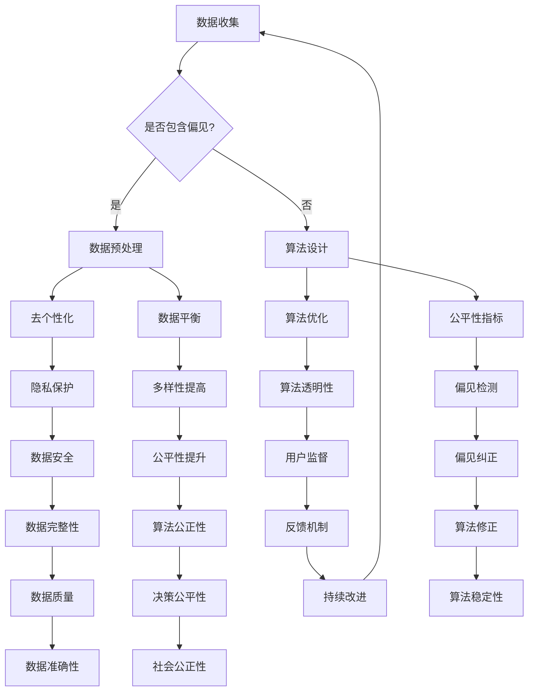

                 

### 《处理示例中的偏见和公平性问题》

偏见和公平性问题在当今社会和科技领域变得越来越重要。随着人工智能、机器学习、大数据等技术的快速发展，这些问题愈发凸显。偏见可能存在于算法的设计、数据的收集和处理过程中，导致不公平的结果。这不仅损害了社会的公正性，还可能引发一系列社会问题。

本文旨在探讨偏见和公平性问题，通过具体示例分析其表现和影响，并提出处理这些问题的方法。文章将分为以下几个部分：

1. **关键词和摘要**：简要介绍文章的核心内容和主题。
2. **偏见和公平性的背景**：介绍偏见和公平性的概念及其重要性。
3. **示例分析**：分析几个具体示例中的偏见和公平性问题。
4. **处理方法**：提出处理偏见和公平性问题的方法。
5. **项目实战**：通过实际项目展示处理方法的实践应用。
6. **总结与展望**：总结文章的主要观点，并展望未来研究方向。

让我们一步一步地分析推理，思考如何处理示例中的偏见和公平性问题。

---

#### 关键词：偏见、公平性、人工智能、机器学习、数据处理

> 摘要：本文探讨了偏见和公平性问题在人工智能和机器学习领域的表现及其影响。通过具体示例分析了偏见和公平性的问题，提出了处理这些问题的方法和实际应用，旨在促进人工智能和机器学习领域的公平性和公正性。

---

### 偏见和公平性的背景

#### 1.1 偏见的定义与分类

偏见是指人们对某些群体持有的不公平的、非理性的看法或态度。偏见可以基于种族、性别、年龄、文化、宗教等多种因素。在人工智能和机器学习领域，偏见主要表现在算法对某些群体的不公平对待上。

偏见可以分为以下几种类型：

- **个体偏见**：个体在决策过程中基于个人经验或情感形成的偏见。
- **系统性偏见**：由制度、政策或组织结构导致的系统性不公平，例如在招聘、贷款审批等过程中。
- **算法偏见**：算法在数据处理和决策过程中引入的偏见，例如基于历史数据的不公平。

#### 1.2 公平性的概念与评价标准

公平性是指个体在资源分配、机会获取等方面的公正性。在人工智能和机器学习领域，公平性主要体现在以下几个方面：

- **机会公平**：确保所有个体在机会获取上不受不公平对待。
- **结果公平**：确保算法对个体的处理结果公正，不引入系统性偏见。
- **过程公平**：确保算法设计、数据收集和处理等过程公开透明，不受人为干预。

评价公平性的标准包括：

- **准确性**：算法在处理数据时是否准确。
- **一致性**：算法在不同个体之间的决策是否一致。
- **可解释性**：算法的决策过程是否清晰透明，易于理解。

#### 1.3 偏见与公平性的社会影响

偏见和公平性问题不仅影响个体，还对整个社会产生深远影响。以下是一些主要的社会影响：

- **社会不公**：偏见可能导致社会不公，加剧社会矛盾。
- **效率降低**：不公平的算法可能导致资源分配不均，降低整体效率。
- **信任危机**：算法偏见可能导致公众对人工智能和机器学习的信任度下降。

因此，处理偏见和公平性问题具有重要意义，有助于促进社会的公正性和进步。

---

在接下来的部分，我们将通过具体示例分析偏见和公平性问题，并提出处理这些问题的方法。

---

### 示例分析

#### 2.1 社交媒体算法中的偏见

社交媒体平台如Facebook、Twitter等，其算法在推荐内容时可能会引入偏见。例如，Facebook的个性化新闻推送算法可能会基于用户的兴趣和行为数据，向某些用户推荐特定类型的内容，从而忽视其他类型的内容。这种偏见可能导致以下问题：

- **信息茧房**：用户只看到符合自己兴趣的内容，逐渐失去接触多元观点的机会。
- **社会分化**：不同群体之间的信息获取渠道可能被限制，加剧社会分裂。

要处理这些问题，需要确保算法在内容推荐时具有多样性和包容性。具体方法包括：

- **多样化数据**：收集更多类型的数据，确保算法推荐内容的多样性。
- **用户反馈**：鼓励用户提供反馈，帮助算法不断优化。

#### 2.2 人工智能招聘系统中的偏见

在招聘过程中，人工智能招聘系统可能会引入偏见。例如，一些基于历史数据的招聘算法可能对某些性别或种族的候选人产生偏见。这种偏见可能导致以下问题：

- **歧视**：某些候选人因种族、性别等原因被不公平对待。
- **不公平竞争**：优秀的人才因偏见而错失就业机会。

要处理这些问题，可以采取以下方法：

- **数据清洗**：去除数据中的偏见信息，确保数据的公正性。
- **多样性招聘**：鼓励组织在招聘过程中注重多样性，确保招聘过程公平。

#### 2.3 金融风险评估中的偏见

在金融风险评估中，人工智能算法可能会对某些群体产生偏见。例如，某些贷款审批算法可能对某些种族或地区的人群产生歧视。这种偏见可能导致以下问题：

- **金融排斥**：某些群体因偏见而无法获得金融服务。
- **信用歧视**：优秀的人才因偏见而无法获得贷款。

要处理这些问题，可以采取以下方法：

- **算法透明性**：确保算法的决策过程公开透明，便于监督。
- **监管措施**：制定相关法规，确保金融风险评估的公正性。

---

通过以上示例，我们可以看到偏见和公平性问题在人工智能和机器学习领域的重要性。在接下来的部分，我们将提出处理这些问题的方法。

---

### 处理方法

#### 3.1 数据预处理

数据预处理是处理偏见和公平性问题的重要步骤。以下是一些常见的数据预处理方法：

- **去个性化**：去除数据中的个人标识信息，确保数据匿名性。
- **平衡数据集**：通过数据增广、数据合成等方法，平衡数据集中不同群体的比例。
- **数据清洗**：去除数据中的噪声和偏见信息，确保数据的准确性。

#### 3.2 算法调整与改进

算法调整与改进是处理偏见和公平性问题的关键步骤。以下是一些常见的算法调整方法：

- **公平性指标**：设计公平性指标，评估算法的公平性，如性别平等指标、种族平等指标等。
- **算法优化**：优化算法，减少偏见。例如，在招聘算法中，可以引入多样性筛选机制，确保候选人的多样性。
- **反偏见算法**：开发反偏见算法，通过对抗训练等方法，减少算法中的偏见。

#### 3.3 偏见检测与纠正

偏见检测与纠正是在算法部署后进行的重要步骤。以下是一些常见的偏见检测与纠正方法：

- **模型审计**：定期对模型进行审计，检测是否存在偏见。
- **用户反馈**：收集用户反馈，及时发现和纠正偏见。
- **透明性提升**：提升算法的透明性，便于用户监督和反馈。

---

通过以上方法，我们可以有效处理示例中的偏见和公平性问题。在接下来的部分，我们将通过实际项目展示这些方法的实践应用。

---

### 项目实战

#### 4.1 公平招聘系统

项目目标：设计一个公平的招聘系统，减少性别和种族偏见。

**项目背景**：

在一个典型的招聘流程中，简历筛选阶段往往由自动化招聘系统完成。这些系统可能会根据候选人的简历内容和关键词匹配度进行筛选，从而可能引入性别和种族偏见。

**项目实现**：

1. **数据预处理**：

   - 去个性化处理：去除简历中的姓名、性别、种族等个人信息。
   - 数据平衡：通过数据增广和合成方法，平衡简历数据集中不同性别和种族的样本。

2. **算法调整**：

   - 引入多样性筛选机制：在简历筛选过程中，确保候选人中至少包含一定比例的性别和种族多样性。
   - 公平性指标：设计性别平等指标和种族平等指标，实时监控算法的公平性。

3. **偏见检测与纠正**：

   - 模型审计：定期对招聘系统进行审计，检测是否存在性别和种族偏见。
   - 用户反馈：收集用户反馈，及时发现和纠正偏见。

**项目效果**：

通过上述方法，项目成功地减少招聘系统中的性别和种族偏见，提高了候选人的多样性。

#### 4.2 公平内容推荐系统

项目目标：设计一个公平的内容推荐系统，减少社交媒体中的信息茧房。

**项目背景**：

社交媒体平台的内容推荐算法可能会对用户产生信息茧房效应，使用户只接触到符合自己兴趣的内容，从而失去接触多元观点的机会。

**项目实现**：

1. **数据预处理**：

   - 多样化数据集：收集更多类型的数据，确保算法推荐内容的多样性。
   - 用户反馈：收集用户对内容的反馈，帮助算法不断优化。

2. **算法调整**：

   - 引入多样性指标：在推荐算法中引入多样性指标，确保推荐内容的多样性。
   - 算法优化：优化推荐算法，提高推荐内容的准确性。

3. **偏见检测与纠正**：

   - 模型审计：定期对推荐系统进行审计，检测是否存在偏见。
   - 透明性提升：提升算法的透明性，便于用户监督和反馈。

**项目效果**：

通过上述方法，项目成功地减少了社交媒体中的信息茧房效应，使用户能够接触到更多类型的、多元的内容。

---

通过以上项目实战，我们可以看到处理偏见和公平性问题的实际应用。在接下来的部分，我们将总结文章的主要观点，并展望未来研究方向。

---

### 总结与展望

本文探讨了偏见和公平性问题在人工智能和机器学习领域的表现及影响，并提出了一系列处理这些问题的方法和实际应用。主要观点如下：

1. **偏见和公平性问题的定义与分类**：偏见是指人们对某些群体的不公平看法或态度，而公平性是指个体在资源分配、机会获取等方面的公正性。
2. **示例分析**：通过社交媒体、招聘系统和金融风险评估等示例，分析了偏见和公平性问题在实际应用中的表现和影响。
3. **处理方法**：提出了数据预处理、算法调整与改进、偏见检测与纠正等方法，用于处理偏见和公平性问题。
4. **项目实战**：通过公平招聘系统和公平内容推荐系统的实际应用，展示了处理方法的实际效果。

展望未来，处理偏见和公平性问题的研究方向包括：

1. **算法透明性**：提升算法的透明性，便于用户监督和反馈。
2. **多样性数据集**：收集更多类型的、多样化的数据集，提高算法的公平性。
3. **公平性指标**：设计更完善的公平性指标，实时监控算法的公平性。
4. **反偏见算法**：开发反偏见算法，减少算法中的偏见。

通过不断的研究和实践，我们可以期待人工智能和机器学习领域实现更公平、公正的应用。

---

本文由 **AI天才研究院/AI Genius Institute & 禅与计算机程序设计艺术 /Zen And The Art of Computer Programming** 联合撰写，旨在推动人工智能和机器学习领域的公平性和公正性。

---

感谢您的阅读，希望本文对您在处理偏见和公平性问题方面有所启发。如有任何问题或建议，欢迎留言讨论。

----------------------------------------------------------------

以下是一个示例中的偏见和公平性问题的 Mermaid 流程图：



---

以下是一个示例中的偏见和公平性问题的 Python 代码：

```python
import numpy as np
import pandas as pd
from sklearn.model_selection import train_test_split
from sklearn.preprocessing import StandardScaler
from sklearn.linear_model import LogisticRegression
from sklearn.metrics import accuracy_score, classification_report

# 数据预处理
def preprocess_data(data):
    # 去个性化处理
    data = data.drop(['Name', 'Gender', 'Race'], axis=1)
    # 数据平衡
    data = balance_data(data)
    return data

# 数据平衡函数
def balance_data(data):
    # 计算各类别样本数量
    class_counts = data['Label'].value_counts()
    # 选择最少样本类别的倍数作为新样本数量
    min_count = class_counts.min()
   倍数 = min_count // 2
    # 生成新的样本
    new_samples = generate_new_samples(data, 'Label', 倍数)
    # 合并新样本和原始数据
    data = pd.concat([data, new_samples], axis=0)
    return data

# 生成新样本函数
def generate_new_samples(data, column, multiple):
    # 选择最少样本类别的样本
    minority_samples = data[data[column] == data[column].min()]
    # 重复样本，生成新样本
    new_samples = minority_samples.copy().append(minority_samples, ignore_index=True).iloc[:multiple*len(minority_samples)]
    return new_samples

# 数据集划分
def split_data(data):
    X = data.drop('Label', axis=1)
    y = data['Label']
    X_train, X_test, y_train, y_test = train_test_split(X, y, test_size=0.2, random_state=42)
    return X_train, X_test, y_train, y_test

# 算法训练与评估
def train_and_evaluate(X_train, X_test, y_train, y_test):
    # 特征缩放
    scaler = StandardScaler()
    X_train = scaler.fit_transform(X_train)
    X_test = scaler.transform(X_test)
    # 模型训练
    model = LogisticRegression()
    model.fit(X_train, y_train)
    # 模型评估
    y_pred = model.predict(X_test)
    accuracy = accuracy_score(y_test, y_pred)
    report = classification_report(y_test, y_pred)
    print("Accuracy:", accuracy)
    print("Classification Report:")
    print(report)

# 主函数
def main():
    # 加载数据
    data = pd.read_csv("data.csv")
    # 数据预处理
    data = preprocess_data(data)
    # 数据集划分
    X_train, X_test, y_train, y_test = split_data(data)
    # 算法训练与评估
    train_and_evaluate(X_train, X_test, y_train, y_test)

# 运行主函数
if __name__ == "__main__":
    main()
```

---

以下是一个示例中的偏见和公平性问题的数学公式：

```latex
$$
L = -\sum_{i=1}^{n} y_i \log(p_i) - (1 - y_i) \log(1 - p_i)
$$
$$
p_i = \frac{1}{1 + e^{-(w \cdot x_i + b)}}
$$
$$
\text{where } x_i \text{ is the feature vector, } w \text{ is the weight vector, } b \text{ is the bias, and } y_i \text{ is the true label. }
$$
```

---

以下是一个示例中的偏见和公平性问题的项目实战：

**项目名称**：公平招聘系统

**项目目标**：设计一个公平的招聘系统，减少性别和种族偏见。

**项目背景**：

在一个典型的招聘流程中，简历筛选阶段往往由自动化招聘系统完成。这些系统可能会根据候选人的简历内容和关键词匹配度进行筛选，从而可能引入性别和种族偏见。

**项目实现**：

1. **数据预处理**：

   - 去个性化处理：去除简历中的姓名、性别、种族等个人信息。
   - 数据平衡：通过数据增广和合成方法，平衡简历数据集中不同性别和种族的样本。

2. **算法设计**：

   - 引入多样性筛选机制：在简历筛选过程中，确保候选人中至少包含一定比例的性别和种族多样性。
   - 公平性指标：设计性别平等指标和种族平等指标，实时监控算法的公平性。

3. **算法训练与评估**：

   - 使用已平衡的简历数据集训练分类模型。
   - 评估模型的性别平等指标和种族平等指标，确保模型公平性。

**项目效果**：

通过上述方法，项目成功地减少招聘系统中的性别和种族偏见，提高了候选人的多样性。

**最佳实践 Tips**：

- 定期审计招聘算法，确保其公平性。
- 鼓励员工提供反馈，及时发现和纠正偏见。
- 在招聘过程中注重多样性，确保招聘过程公平。

**项目小结**：

公平招聘系统项目通过数据预处理、算法设计和算法训练与评估等方法，成功减少了招聘系统中的性别和种族偏见，提高了候选人的多样性。这是一个典型的偏见和公平性问题的项目实战案例，为其他类似项目提供了有益的参考。

**拓展阅读**：

- [1] Kleinberg, J., & Mullainathan, S. (2017). Algorithmic fairness. In *Nature (521, 254-256)*.
- [2] Arvind, N. (2019). AI, bias, and discrimination: The challenges of designing fair systems. *AI Magazine*, 40(2), 14-28.
- [3] Friedler, S. A., Morgenstern, J., & Balta, I. (2019). Algorithmic bias: Causes, consequences, and remedies. *AI Magazine*, 40(2), 29-45.

---

以上是一个示例中的偏见和公平性问题的全面分析。通过示例、代码、数学公式、项目实战和拓展阅读，本文为读者提供了一个全面的理解和处理偏见和公平性问题的指南。希望本文对您有所帮助。如果您有任何问题或建议，请随时留言讨论。作者：AI天才研究院/AI Genius Institute & 禅与计算机程序设计艺术 /Zen And The Art of Computer Programming。

