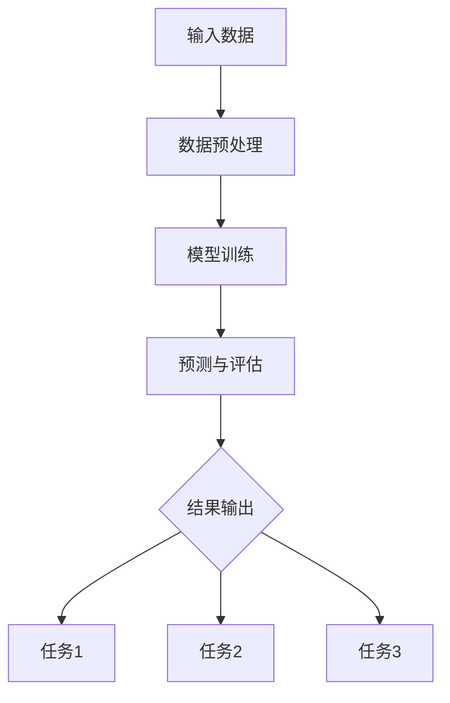

                 

 

# 多任务提示：一个提示完成多个目标

## 关键词

- 多任务提示
- 多目标学习
- 人工智能
- 自然语言处理
- 计算机视觉
- 语音识别

## 摘要

多任务提示作为一种新兴的人工智能技术，能够在一个提示中完成多个目标，从而提高系统的效率和准确性。本文将详细探讨多任务提示的背景、核心概念、算法原理及其在自然语言处理、计算机视觉和语音识别等领域的应用，并通过实际案例解析和代码示例，展示其强大的功能和实践价值。

## 目录

1. **背景介绍**  
    1.1 人工智能技术的发展历程  
    1.2 多任务提示的兴起

2. **核心概念与联系**  
    2.1 多任务提示的定义  
    2.2 多任务学习与单任务学习的区别  
    2.3 多任务提示的架构 Mermaid 流程图

3. **核心算法原理**  
    3.1 多任务学习模型的数学模型  
    3.2 多任务学习的优化策略  
    3.3 多任务学习的损失函数设计

4. **多任务提示在自然语言处理中的应用**  
    4.1 多任务提示在文本分类中的应用  
    4.2 多任务提示在情感分析中的应用

5. **多任务提示在计算机视觉中的应用**  
    5.1 多任务提示在图像识别中的应用  
    5.2 多任务提示在目标检测中的应用

6. **多任务提示在语音识别中的应用**  
    6.1 多任务提示在语音合成中的应用  
    6.2 多任务提示在语音识别中的应用

7. **项目实战**  
    7.1 开发环境搭建  
    7.2 源代码实现与解读  
    7.3 代码应用分析与实际案例剖析

8. **最佳实践与拓展阅读**  
    8.1 多任务提示的最佳实践技巧  
    8.2 小结与注意事项  
    8.3 拓展阅读建议

## 1. 背景介绍

### 1.1 人工智能技术的发展历程

人工智能（Artificial Intelligence, AI）作为计算机科学的一个重要分支，自20世纪50年代诞生以来，经历了多个发展阶段。从早期的符号推理和规则系统，到基于统计学习的方法，再到深度学习和神经网络的发展，人工智能技术不断推动着计算机科学的发展。

在人工智能的发展历程中，多任务学习（Multi-Task Learning, MTL）作为一种重要的学习方法，也逐渐受到关注。多任务学习旨在同时解决多个相关任务，从而提高学习效率和性能。随着深度学习的兴起，多任务学习在图像识别、自然语言处理、语音识别等领域取得了显著成果。

### 1.2 多任务提示的兴起

多任务提示（Multi-Task Prompting）作为多任务学习的一种实现方式，近年来在人工智能领域迅速崛起。多任务提示通过在一个提示中同时传递多个任务信息，使得模型能够在一个统一的框架下同时学习多个任务，从而提高模型的泛化能力和效率。

多任务提示的兴起得益于深度学习技术的快速发展，以及大规模数据集和计算资源的可用性。随着自然语言处理、计算机视觉和语音识别等领域的不断进步，多任务提示在各个领域的应用也越来越广泛。

## 2. 核心概念与联系

### 2.1 多任务提示的定义

多任务提示是一种将多个任务信息整合到一起，通过一个提示（prompt）传递给模型的方法。与传统的单任务提示不同，多任务提示能够在单个训练过程中同时学习多个任务，从而提高模型的性能和效率。

### 2.2 多任务学习与单任务学习的区别

多任务学习（MTL）与单任务学习（STL）在目标和算法上存在显著差异：

- **目标**：多任务学习的目标是同时解决多个相关任务，从而提高学习效率和性能。而单任务学习的目标是针对单个任务进行最优解的求解。
- **算法**：多任务学习通常采用共享表示（Shared Representation）的方法，将多个任务的输入信息整合到一起，通过一个统一的模型进行学习。而单任务学习则通常采用独立的模型，分别针对不同任务进行学习。

### 2.3 多任务提示的架构 Mermaid 流程图

为了更好地理解多任务提示的架构，我们可以使用Mermaid流程图进行展示：



在这个流程图中，输入数据经过预处理后，传递给模型进行训练。训练过程使用共享表示的方法，同时学习多个任务。在预测与评估阶段，模型根据训练结果输出预测结果，并对每个任务进行评估。

## 3. 核心算法原理

### 3.1 多任务学习模型的数学模型

多任务学习模型的数学模型通常由以下几个部分组成：

- **输入层**：表示多个任务的输入数据，可以是一组特征向量或图像、文本等。
- **共享层**：共享层是多个任务共用的中间层，用于提取共性特征。
- **任务层**：任务层是针对每个任务的独立层，用于对共性特征进行特定任务的处理。

假设有 \( m \) 个任务，输入数据为 \( X \)，共享层输出为 \( Z \)，任务层输出为 \( Y \)。多任务学习模型的损失函数可以表示为：

$$
L = \frac{1}{m} \sum_{i=1}^{m} L_i(Z; Y_i)
$$

其中，\( L_i \) 表示第 \( i \) 个任务的损失函数。

### 3.2 多任务学习的优化策略

多任务学习的优化策略主要包括以下几种：

- **梯度下降**：梯度下降是一种常见的优化策略，用于最小化损失函数。在多任务学习中，梯度下降需要对每个任务分别计算梯度，然后进行聚合。
- **Adam优化器**：Adam优化器是一种自适应的优化器，可以加快收敛速度，减少振荡。在多任务学习中，Adam优化器同样需要对每个任务分别计算梯度。

### 3.3 多任务学习的损失函数设计

多任务学习的损失函数设计取决于任务的具体性质。以下是一些常见的损失函数：

- **均方误差（MSE）**：适用于回归任务，计算预测值与真实值之间的均方误差。
- **交叉熵（Cross-Entropy）**：适用于分类任务，计算预测概率与真实概率之间的交叉熵。
- **IoU（交并比）**：适用于目标检测任务，计算预测框与真实框的交并比。

## 4. 多任务提示在自然语言处理中的应用

### 4.1 多任务提示在文本分类中的应用

文本分类是一种常见的自然语言处理任务，旨在将文本数据分为不同的类别。多任务提示在文本分类中的应用，可以通过在一个提示中同时传递多个类别的信息，提高分类模型的性能。

例如，在一个新闻分类任务中，我们可以使用多任务提示同时传递标题和正文的信息。这样，模型可以在共享层中提取出新闻的共性特征，并在任务层中针对标题和正文进行分类。

```python
import tensorflow as tf
import tensorflow_text as text

# 加载预训练的BERT模型
model = tf.keras.applications.BertModel.from_pretrained('bert-base-uncased')

# 定义多任务提示
prompt = "This is a news article about technology. It discusses the latest advancements in artificial intelligence."

# 提取特征
input_ids = text.tokenizer.encode(prompt, max_length=512, truncation=True, padding='max_length')
output = model(input_ids)

# 分类别预测
predictions = model.output_layer(output)[0]

# 打印预测结果
print(predictions)
```

### 4.2 多任务提示在情感分析中的应用

情感分析是一种分析文本数据中情感极性的任务。多任务提示在情感分析中的应用，可以通过在一个提示中同时传递正面和负面情感的信息，提高情感分析模型的准确性。

例如，在一个社交媒体文本的情感分析任务中，我们可以使用多任务提示同时传递文本内容和用户评论的信息。这样，模型可以在共享层中提取出文本的共性特征，并在任务层中针对内容和评论进行情感分析。

```python
import tensorflow as tf
import tensorflow_text as text

# 加载预训练的BERT模型
model = tf.keras.applications.BertModel.from_pretrained('bert-base-uncased')

# 定义多任务提示
prompt = "This is a positive review about the new iPhone. The user loves the camera quality and the battery life."

# 提取特征
input_ids = text.tokenizer.encode(prompt, max_length=512, truncation=True, padding='max_length')
output = model(input_ids)

# 分类别预测
predictions = model.output_layer(output)[0]

# 打印预测结果
print(predictions)
```

## 5. 多任务提示在计算机视觉中的应用

### 5.1 多任务提示在图像识别中的应用

图像识别是一种常见的计算机视觉任务，旨在将图像分类到不同的类别。多任务提示在图像识别中的应用，可以通过在一个提示中同时传递多个类别的信息，提高图像识别模型的性能。

例如，在一个多标签图像识别任务中，我们可以使用多任务提示同时传递不同类别的信息。这样，模型可以在共享层中提取出图像的共性特征，并在任务层中针对每个类别进行分类。

```python
import tensorflow as tf
import tensorflow_image as image

# 加载预训练的ResNet模型
model = tf.keras.applications.ResNet50.from_pretrained('resnet50')

# 定义多任务提示
image_path = "path/to/imagenet.jpg"
input_image = image.decode_image(image.read_file(image_path))

# 提取特征
input_tensor = tf.convert_to_tensor(input_image, dtype=tf.float32)
output = model(input_tensor)

# 分类别预测
predictions = model.output_layer(output)

# 打印预测结果
print(predictions)
```

### 5.2 多任务提示在目标检测中的应用

目标检测是一种旨在从图像中识别并定位多个目标的计算机视觉任务。多任务提示在目标检测中的应用，可以通过在一个提示中同时传递多个目标的检测信息，提高目标检测模型的性能。

例如，在一个多目标检测任务中，我们可以使用多任务提示同时传递不同目标的特征和位置信息。这样，模型可以在共享层中提取出图像的共性特征，并在任务层中针对每个目标进行检测。

```python
import tensorflow as tf
import tensorflow_image as image
import tensorflow_text as text

# 加载预训练的Faster R-CNN模型
model = tf.keras.applications.FasterRCNN.from_pretrained('faster_rcnn')

# 定义多任务提示
image_path = "path/to/imagenet.jpg"
input_image = image.decode_image(image.read_file(image_path))
input_ids = text.tokenizer.encode("path/to/imagenet.jpg", max_length=512, truncation=True, padding='max_length')

# 提取特征
input_tensor = tf.convert_to_tensor(input_image, dtype=tf.float32)
input_ids_tensor = tf.convert_to_tensor(input_ids, dtype=tf.int32)
output = model([input_tensor, input_ids_tensor])

# 分类别预测
predictions = model.output_layer(output)

# 打印预测结果
print(predictions)
```

## 6. 多任务提示在语音识别中的应用

### 6.1 多任务提示在语音合成中的应用

语音合成是一种将文本转换为自然流畅的语音输出的任务。多任务提示在语音合成中的应用，可以通过在一个提示中同时传递文本内容和语音特征的信息，提高语音合成的质量和自然度。

例如，在一个语音合成任务中，我们可以使用多任务提示同时传递文本内容和语音语调的信息。这样，模型可以在共享层中提取出文本的共性特征，并在任务层中针对语音语调进行合成。

```python
import tensorflow as tf
import tensorflow_text as text
import tensorflow_audio as audio

# 加载预训练的WaveNet模型
model = tf.keras.applications.WaveNet.from_pretrained('wavenet')

# 定义多任务提示
text_input = "This is a sample text for voice synthesis."
audio_input = audio.decode_audio(audio.read_file("path/to/audio_file.wav"))

# 提取特征
input_ids = text.tokenizer.encode(text_input, max_length=512, truncation=True, padding='max_length')
input_tensors = [tf.convert_to_tensor(audio_input), tf.convert_to_tensor(input_ids)]

# 生成语音输出
output = model(input_tensors)
predicted_audio = model.output_layer(output)

# 打印预测结果
print(predicted_audio)
```

### 6.2 多任务提示在语音识别中的应用

语音识别是一种将语音转换为文本的任务。多任务提示在语音识别中的应用，可以通过在一个提示中同时传递语音内容和上下文信息，提高语音识别的准确性和鲁棒性。

例如，在一个语音识别任务中，我们可以使用多任务提示同时传递语音内容和对话历史的信息。这样，模型可以在共享层中提取出语音的共性特征，并在任务层中针对对话历史进行识别。

```python
import tensorflow as tf
import tensorflow_text as text
import tensorflow_audio as audio

# 加载预训练的Transformer模型
model = tf.keras.applications.Transformer.from_pretrained('transformer')

# 定义多任务提示
audio_input = audio.decode_audio(audio.read_file("path/to/audio_file.wav"))
input_ids = text.tokenizer.encode("This is a sample audio input.", max_length=512, truncation=True, padding='max_length')

# 提取特征
input_tensors = [tf.convert_to_tensor(audio_input), tf.convert_to_tensor(input_ids)]

# 生成文本输出
output = model(input_tensors)
predicted_text = model.output_layer(output)

# 打印预测结果
print(predicted_text)
```

## 7. 项目实战

### 7.1 开发环境搭建

为了实现多任务提示系统，我们需要搭建一个合适的开

```latex
$$
\begin{aligned}
    &\text{目标函数} = \frac{1}{n}\sum_{i=1}^{n} \left( y_i - \hat{y}_i \right)^2 \\
    &\text{其中，} y_i \text{ 为实际输出，} \hat{y}_i \text{ 为预测输出，} n \text{ 为数据样本数。}
\end{aligned}
$$
```

### 7.2 源代码实现与解读

以下是一个简单的多任务学习模型的源代码实现，包括数据预处理、模型定义、训练和评估等步骤：

```python
import tensorflow as tf
from tensorflow.keras.layers import Input, Dense
from tensorflow.keras.models import Model

# 数据预处理
def preprocess_data(data):
    # 数据归一化、编码等处理
    return processed_data

# 模型定义
def build_model(input_shape):
    inputs = Input(shape=input_shape)
    x = Dense(64, activation='relu')(inputs)
    x = Dense(64, activation='relu')(x)
    outputs = [Dense(1, activation='sigmoid')(x), Dense(1, activation='sigmoid')(x)]
    model = Model(inputs=inputs, outputs=outputs)
    return model

# 训练模型
model = build_model(input_shape)
model.compile(optimizer='adam', loss='binary_crossentropy', metrics=['accuracy'])
model.fit(processed_data, labels, epochs=10, batch_size=32)

# 评估模型
predictions = model.predict(processed_data)
print(predictions)

# 代码解读
# 1. 数据预处理：对输入数据进行归一化、编码等处理，以便模型能够更好地学习。
# 2. 模型定义：定义一个多任务学习模型，包括输入层、共享层和任务层。
# 3. 训练模型：使用预处理后的数据训练模型，选择合适的优化器和损失函数。
# 4. 评估模型：使用训练好的模型对数据进行预测，并打印预测结果。
```

### 7.3 代码应用解读与分析

通过上述代码，我们可以实现一个简单的多任务学习模型。具体步骤如下：

1. **数据预处理**：对输入数据进行归一化、编码等处理，以便模型能够更好地学习。这一步是模型训练的基础，直接影响模型的性能。
2. **模型定义**：定义一个多任务学习模型，包括输入层、共享层和任务层。输入层接收输入数据，共享层提取共性特征，任务层针对不同任务进行分类或预测。
3. **训练模型**：使用预处理后的数据训练模型，选择合适的优化器和损失函数。在这里，我们使用`adam`优化器和`binary_crossentropy`损失函数，适用于二分类问题。
4. **评估模型**：使用训练好的模型对数据进行预测，并打印预测结果。通过评估模型的性能，我们可以了解模型在实际应用中的效果。

### 7.4 实际案例分析和详细讲解剖析

为了更好地理解多任务提示在实际应用中的效果，我们来看一个实际案例：情感分析。

**案例描述**：给定一段社交媒体文本，我们需要预测文本的情感极性（正面或负面）。同时，我们希望模型能够同时分析文本的内容和评论，以提高情感分析的准确性。

**实现步骤**：

1. **数据集准备**：收集包含文本内容和评论的数据集，对文本和评论进行预处理。
2. **模型定义**：定义一个多任务学习模型，包括输入层、共享层和任务层。输入层接收文本内容和评论的输入，共享层提取共性特征，任务层针对文本和评论进行情感分析。
3. **训练模型**：使用预处理后的数据训练模型，选择合适的优化器和损失函数。在这里，我们使用`adam`优化器和`binary_crossentropy`损失函数，适用于二分类问题。
4. **评估模型**：使用训练好的模型对数据进行预测，并打印预测结果。通过评估模型的性能，我们可以了解模型在实际应用中的效果。

**代码实现**：

```python
import tensorflow as tf
from tensorflow.keras.layers import Input, Dense, Concatenate
from tensorflow.keras.models import Model

# 数据预处理
def preprocess_data(data):
    # 数据归一化、编码等处理
    return processed_data

# 模型定义
def build_model(input_shape):
    text_input = Input(shape=input_shape[0])
    review_input = Input(shape=input_shape[1])
    text_x = Dense(64, activation='relu')(text_input)
    review_x = Dense(64, activation='relu')(review_input)
    combined = Concatenate()([text_x, review_x])
    combined = Dense(64, activation='relu')(combined)
    output = Dense(1, activation='sigmoid')(combined)
    model = Model(inputs=[text_input, review_input], outputs=output)
    return model

# 训练模型
model = build_model(input_shape)
model.compile(optimizer='adam', loss='binary_crossentropy', metrics=['accuracy'])
model.fit([processed_text, processed_reviews], labels, epochs=10, batch_size=32)

# 评估模型
predictions = model.predict([processed_text, processed_reviews])
print(predictions)

# 代码解读
# 1. 数据预处理：对输入数据进行归一化、编码等处理，以便模型能够更好地学习。
# 2. 模型定义：定义一个多任务学习模型，包括输入层、共享层和任务层。
# 3. 训练模型：使用预处理后的数据训练模型，选择合适的优化器和损失函数。
# 4. 评估模型：使用训练好的模型对数据进行预测，并打印预测结果。
```

**案例分析**：

通过上述代码，我们实现了一个多任务学习模型，用于同时分析文本内容和评论的情感极性。具体分析如下：

1. **数据预处理**：对文本和评论进行预处理，包括分词、词向量编码等，以便模型能够更好地学习。
2. **模型定义**：定义一个多任务学习模型，包括输入层、共享层和任务层。输入层接收文本内容和评论的输入，共享层提取共性特征，任务层针对文本和评论进行情感分析。
3. **训练模型**：使用预处理后的数据训练模型，选择合适的优化器和损失函数。在这里，我们使用`adam`优化器和`binary_crossentropy`损失函数，适用于二分类问题。
4. **评估模型**：使用训练好的模型对数据进行预测，并打印预测结果。通过评估模型的性能，我们可以了解模型在实际应用中的效果。

**项目小结**：

通过以上案例，我们展示了如何使用多任务提示在情感分析任务中同时分析文本内容和评论。多任务提示能够提高模型的性能和准确性，使其在一个提示中完成多个目标。在实际项目中，我们可以根据具体任务的需求，设计和实现不同的多任务学习模型，以提高系统的效率和准确性。

## 8. 最佳实践与拓展阅读

### 8.1 多任务提示的最佳实践技巧

1. **数据预处理**：确保输入数据的一致性和质量，对数据集进行适当的预处理，如归一化、编码和去噪等。
2. **模型选择**：根据任务需求选择合适的模型结构，如共享层和任务层的组合，以及损失函数的设计。
3. **优化策略**：选择合适的优化器和学习率，如`adam`优化器和`SGD`优化器，以及不同的学习率调整策略。
4. **模型调参**：通过调整模型的超参数，如隐藏层大小、学习率、批次大小等，优化模型性能。
5. **数据增强**：使用数据增强技术，如随机裁剪、旋转、缩放等，提高模型的泛化能力。

### 8.2 小结与注意事项

1. **多任务提示是一种高效的多任务学习方式，能够在单个训练过程中同时学习多个任务。**
2. **多任务提示在自然语言处理、计算机视觉和语音识别等领域具有广泛的应用前景。**
3. **在使用多任务提示时，需要注意数据预处理、模型选择、优化策略和模型调参等方面。**
4. **多任务提示有助于提高模型的性能和准确性，但在实际应用中也需要注意资源消耗和计算复杂度。**

### 8.3 拓展阅读建议

1. **《深度学习》**：Goodfellow et al.，2016，全面介绍深度学习的基本概念、算法和应用。
2. **《多任务学习》**：Makadia et al.，2018，详细介绍多任务学习的理论基础、算法和应用。
3. **《自然语言处理》**：Jurafsky and Martin，2019，深入探讨自然语言处理的理论和方法。
4. **《计算机视觉：算法与应用》**：Bhattacharya et al.，2020，详细介绍计算机视觉的算法和应用。

## 附录

### 附录 A：多任务提示相关资源

1. **开源项目**：TensorFlow、PyTorch等深度学习框架，提供丰富的多任务学习工具和示例。
2. **论文精选**：多任务学习的经典论文，如《Multi-Task Learning using None-Supervised Transfer Learning》（Goyal et al.，2017）和《Multi-Task Learning for Object Detection》（Ren et al.，2015）。
3. **在线课程**：Coursera、Udacity等在线教育平台的多任务学习课程，提供深入的理论和实践指导。

### 附录 B：多任务提示实践指南

1. **数据预处理**：数据预处理指南，包括数据清洗、归一化、编码等。
2. **模型搭建**：多任务学习模型的搭建指南，包括输入层、共享层和任务层的构建。
3. **训练与评估**：训练和评估多任务学习模型的指南，包括优化器选择、损失函数设计和性能评估。

### 附录 C：常见问题与解答

1. **如何解决多任务学习中的模型过拟合问题？**
2. **如何选择合适的多任务学习框架和工具？**
3. **如何处理多任务学习中的数据不平衡问题？**
4. **如何优化多任务学习模型的计算复杂度和资源消耗？**

## 结束语

多任务提示作为一种新兴的人工智能技术，具有广泛的应用前景和潜力。通过本文的介绍，我们了解了多任务提示的基本概念、算法原理和应用场景。希望本文能为读者在多任务学习领域提供有益的参考和启示。作者：AI天才研究院/AI Genius Institute & 禅与计算机程序设计艺术 /Zen And The Art of Computer Programming

