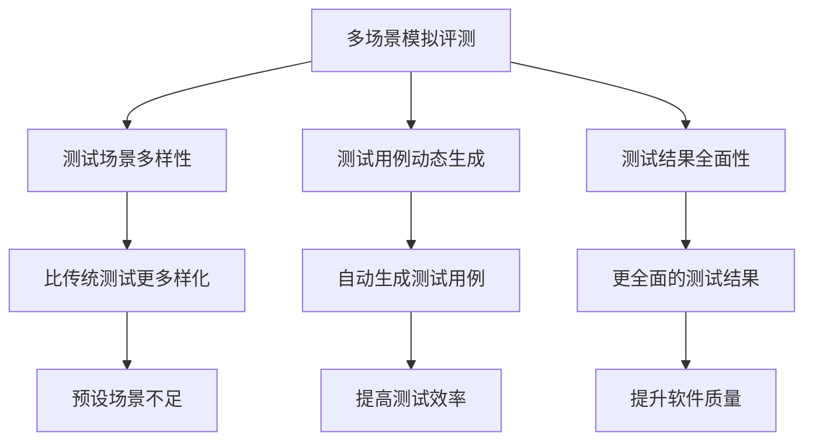
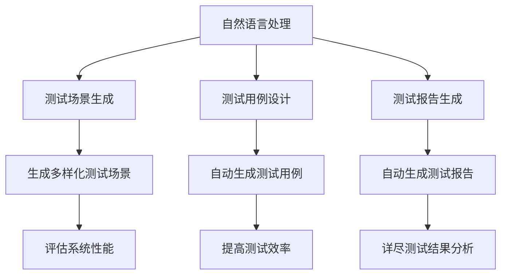
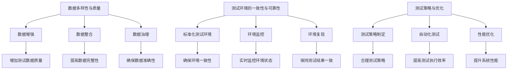
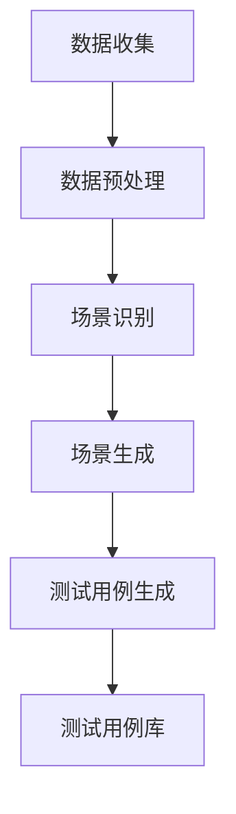
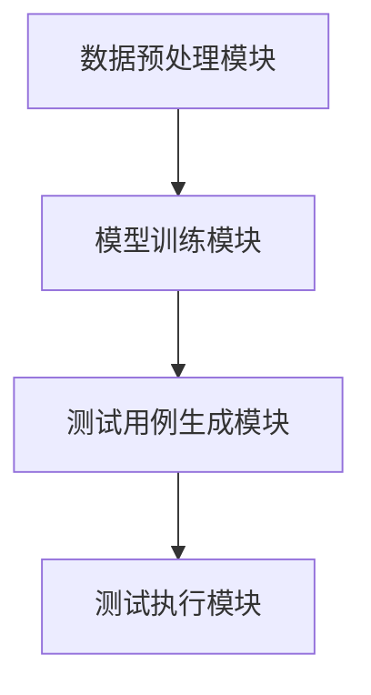

                 

### 1. 多场景模拟评测的概念与重要性

#### 1.1 多场景模拟评测的定义

多场景模拟评测是一种软件测试方法，通过构建不同的测试场景，模拟实际使用中的各种环境和情况，以评估软件系统的性能、稳定性和可靠性。这种方法不仅仅局限于单一的场景测试，而是通过多样化的场景模拟，尽可能全面地覆盖系统的各个功能模块和交互环节。

#### 1.2 多场景模拟评测的作用与意义

多场景模拟评测在软件测试中具有重要作用，具体体现在以下几个方面：

1. **提高测试覆盖面**：传统的单一场景测试难以覆盖到所有可能的用例，而多场景模拟评测能够通过模拟多种场景，提高测试的全面性，确保更多的功能和交互得到验证。
2. **发现潜在问题**：通过模拟不同场景，可以揭示出系统在不同环境下的潜在问题，如异常处理能力、性能瓶颈等，从而在产品发布前提前解决。
3. **评估系统稳定性**：多场景模拟评测可以帮助评估系统在多种环境下的稳定性，确保系统在真实使用场景中能够稳定运行。
4. **增强用户满意度**：通过严格的测试和优化，可以提供更高质量的产品，从而提高用户满意度。

#### 1.3 多场景模拟评测与传统测试的差异

多场景模拟评测与传统测试方法相比，具有以下几个显著差异：

1. **测试场景的多样性**：传统测试往往依赖于预设的测试场景，而多场景模拟评测则通过模拟不同的环境和情况，测试场景更加多样化。
2. **测试用例的动态生成**：多场景模拟评测通常利用算法和模型动态生成测试用例，而非人工编写，从而提高测试效率。
3. **测试结果的全面性**：多场景模拟评测能够覆盖更多的测试场景，提供更全面的测试结果，有助于提高测试的全面性和准确性。

总之，多场景模拟评测作为一种先进的测试方法，在提高软件质量、增强系统稳定性方面具有显著优势。通过深入了解其概念和重要性，我们可以更好地理解和应用这种方法，为软件测试工作带来更大的价值。

---

**图1：多场景模拟评测与传统测试的差异架构图**



---

### 2. 生成多样化测试环境的LLM技术

#### 2.1 自然语言处理与LLM

自然语言处理（NLP）是计算机科学和人工智能领域的一个重要分支，旨在使计算机能够理解和处理人类自然语言。NLP包括文本处理、语音识别、机器翻译、情感分析等多个子领域。而大型语言模型（LLM，Large Language Model）是NLP领域的一项重要技术，通过学习海量文本数据，LLM能够生成自然流畅的文本，并在多种任务中表现出色。

LLM的核心思想是利用深度学习技术，特别是神经网络，来建模语言的统计规律和语义信息。典型的LLM模型包括GPT（Generative Pre-trained Transformer）和BERT（Bidirectional Encoder Representations from Transformers）。这些模型通过预先训练，掌握了丰富的语言知识，能够实现文本生成、机器翻译、问答系统等多种功能。

#### 2.2 LLM在测试领域的应用

在测试领域，LLM技术被广泛应用于测试环境的生成和测试用例的设计。LLM能够根据给定的输入，自动生成多样化的测试场景和测试用例，极大地提高了测试效率和质量。

1. **测试场景生成**：LLM可以根据需求生成各种不同的测试场景。例如，在软件性能测试中，LLM可以生成不同负载、不同用户行为和不同网络条件的测试场景，从而全面评估系统的性能。

2. **测试用例设计**：LLM可以帮助自动生成测试用例。通过学习已有的测试用例和系统文档，LLM能够生成符合要求的测试用例，并自动排除冗余和重复的测试用例。

3. **测试报告生成**：LLM还可以用于生成测试报告。通过分析测试结果，LLM可以自动生成详细的测试报告，包含测试结果、异常情况和改进建议。

#### 2.3 生成测试环境的挑战与解决方案

虽然LLM技术在测试环境中具有巨大潜力，但在实际应用中仍面临一些挑战：

1. **数据质量和多样性**：生成高质量的测试环境需要丰富的数据源，但数据质量和多样性的保障是一个挑战。解决方案包括数据清洗、数据增强和多种数据来源的整合。

2. **模型泛化能力**：LLM模型的泛化能力是关键。如果模型只能在特定数据集上表现良好，那么生成的测试环境可能不具有广泛适用性。解决方案是使用更广泛、更具代表性的训练数据，并采用迁移学习技术。

3. **测试效率与成本**：尽管LLM可以提高测试效率，但大规模的训练和推理过程可能需要大量计算资源，增加了测试成本。解决方案包括优化模型结构、使用更高效的推理算法和分布式计算。

4. **模型解释性**：在测试过程中，了解LLM生成的测试环境的原因和逻辑非常重要。提高模型的可解释性可以帮助理解和优化测试过程。

总之，LLM技术在生成多样化测试环境方面具有巨大潜力，但也需要面对一些挑战。通过不断优化模型和应用方法，我们可以更好地利用LLM技术，提高软件测试的质量和效率。

---

**图2：自然语言处理与LLM在测试领域的应用架构图**



---

### 3. 多场景模拟评测的挑战与对策

尽管多场景模拟评测在软件测试中具有显著优势，但在实际应用过程中仍面临诸多挑战。以下将详细分析这些挑战，并提出相应的对策。

#### 3.1 数据多样性与质量

**挑战**：生成多样化测试环境需要丰富的测试数据，而数据多样性和质量的保障是一个难题。测试数据的缺乏或质量问题可能导致测试结果的不准确，从而影响测试的全面性和有效性。

**对策**：

1. **数据增强**：通过数据增强技术，如生成对抗网络（GAN）、数据扩充和合成数据生成，可以增加测试数据的多样性和质量。
2. **数据整合**：从多个来源收集测试数据，如用户行为数据、日志数据和模拟数据，进行整合和清洗，以提高数据的完整性和一致性。
3. **数据治理**：建立数据治理机制，确保数据的准确性和可靠性，制定数据管理政策和流程，规范数据的使用。

#### 3.2 测试环境的一致性与可靠性

**挑战**：在不同的测试环境中，系统可能表现出不一致的行为，这给测试结果的分析和问题定位带来了困难。此外，测试环境的不稳定可能导致测试结果的不可靠。

**对策**：

1. **标准化测试环境**：建立标准化的测试环境配置，确保测试环境的一致性，减少环境变量对测试结果的影响。
2. **环境监控**：使用环境监控工具，实时监控测试环境的运行状态，及时发现和解决环境问题。
3. **环境复现**：确保测试环境可以复现，即在不同时间、不同地点和不同人员执行测试时，测试结果保持一致。

#### 3.3 测试策略与优化

**挑战**：选择合适的测试策略和优化方法是多场景模拟评测的关键。不同的测试策略和优化方法可能对测试结果产生显著影响，而选择不当可能导致测试效率低下或测试结果不准确。

**对策**：

1. **测试策略制定**：根据项目的需求和特性，制定合理的测试策略，如场景组合策略、测试优先级策略和资源分配策略。
2. **自动化测试**：采用自动化测试工具和框架，提高测试执行的效率和一致性，减少人为干预。
3. **性能优化**：针对测试过程中发现的问题，进行性能优化，如算法优化、代码优化和系统优化，以提高系统的性能和稳定性。

总之，多场景模拟评测在提高软件测试质量方面具有重要意义，但同时也需要面对数据多样性、测试环境一致性以及测试策略优化等挑战。通过采取有效的对策，可以克服这些挑战，实现更高效、更全面的软件测试。

---

**图3：多场景模拟评测挑战与对策架构图**



---

### 4. LLM生成测试环境的算法框架

LLM生成测试环境的算法框架主要分为三个阶段：数据预处理、测试用例生成和测试执行。以下将详细描述每个阶段的流程和实现方法。

#### 4.1 数据预处理与清洗

数据预处理是生成测试环境的重要前提，它包括数据的收集、清洗和格式化。以下是数据预处理的主要步骤：

1. **数据收集**：从多个来源收集测试数据，包括用户行为日志、系统日志、API 调用记录等。数据来源的多样性有助于生成多样化的测试环境。
   
2. **数据清洗**：清洗数据以去除噪声和错误。这通常包括去除重复记录、处理缺失值和纠正数据格式错误。可以使用Python的Pandas库进行数据清洗操作。

3. **数据格式化**：将不同来源的数据格式化为统一的格式，以便后续处理。例如，可以将所有数据格式化为JSON或CSV文件。

以下是一个简单的数据预处理代码示例：

```python
import pandas as pd

# 假设我们从不同来源收集了三个数据文件
data_files = ['data1.csv', 'data2.csv', 'data3.csv']

# 读取数据文件
data = [pd.read_csv(file) for file in data_files]

# 数据清洗：去除重复记录和缺失值
cleaned_data = pd.concat(data).drop_duplicates().dropna()

# 数据格式化：转换为统一的格式（例如JSON）
cleaned_data.to_json('cleaned_data.json', orient='records')
```

#### 4.2 测试用例生成算法

测试用例生成是LLM生成测试环境的核心部分。以下是测试用例生成的主要步骤：

1. **模式识别**：利用LLM对预处理后的数据进行分析，识别出不同场景的模式。这一步可以通过训练一个分类模型或聚类模型来实现。

2. **场景生成**：基于识别出的模式，生成多样化的测试场景。可以使用生成对抗网络（GAN）或强化学习等方法来生成测试场景。

3. **测试用例生成**：从每个测试场景中生成具体的测试用例。这可以通过模板化生成或基于规则的生成方法来实现。

以下是一个简单的测试用例生成代码示例：

```python
import json
from tensorflow.keras.models import load_model

# 加载预处理后的数据
with open('cleaned_data.json', 'r') as f:
    data = json.load(f)

# 加载训练好的模式识别模型
model = load_model('model.h5')

# 对数据进行模式识别，生成场景
def generate_scenarios(data, model):
    scenarios = []
    for record in data:
        scenario = model.predict(np.array([record]))
        scenarios.append(scenario)
    return scenarios

scenarios = generate_scenarios(data, model)

# 从每个场景中生成测试用例
def generate_tests(scenarios):
    tests = []
    for scenario in scenarios:
        test = generate_test_case(scenario)
        tests.append(test)
    return tests

def generate_test_case(scenario):
    # 基于场景生成具体的测试用例
    # 这里使用简单的模板化生成方法
    test_case = {
        'description': f"Test case for scenario {scenario}",
        'steps': [
            'Input data: {input_data}',
            'Expected result: {expected_result}'
        ]
    }
    return test_case

tests = generate_tests(scenarios)

# 将测试用例保存到文件
with open('test_cases.json', 'w') as f:
    json.dump(tests, f, indent=4)
```

#### 4.3 测试执行

测试执行是验证测试用例是否满足预期目标的关键步骤。以下是测试执行的主要步骤：

1. **测试用例执行**：按照测试用例的描述，执行具体的测试操作，并记录测试结果。

2. **结果分析**：对比实际测试结果和预期结果，分析测试用例的通过情况。

3. **错误报告**：对于未通过的测试用例，生成详细的错误报告，包括错误信息、错误场景和可能的原因。

以下是一个简单的测试执行代码示例：

```python
import json
from test_framework import execute_test_case

# 加载测试用例
with open('test_cases.json', 'r') as f:
    test_cases = json.load(f)

# 执行测试用例
for test_case in test_cases:
    result = execute_test_case(test_case)
    if result['status'] == 'pass':
        print(f"Test case passed: {test_case['description']}")
    else:
        print(f"Test case failed: {test_case['description']}")
        print(f"Error details: {result['error']}")
```

通过上述算法框架，LLM能够有效地生成多样化的测试环境，提高软件测试的全面性和效率。

---

### 5. 生成多样化测试环境的策略与技巧

在生成多样化测试环境的过程中，采用合适的策略与技巧是至关重要的。以下将详细介绍几种常见的策略与技巧，以及如何有效地实施这些策略。

#### 5.1 多样化测试策略

1. **场景组合策略**：通过组合不同的测试场景，生成更多样化的测试环境。例如，可以结合不同的用户行为、系统负载和网络条件，生成复杂的测试场景。

2. **边界值测试策略**：针对系统的关键参数和边界条件，设计特殊的测试场景，以确保系统能够在这些极端情况下正常运行。

3. **异常情况测试策略**：模拟系统可能遇到的各种异常情况，如网络中断、数据库异常和权限问题，以评估系统的异常处理能力和恢复能力。

#### 5.2 测试环境生成的技巧

1. **数据增强技巧**：通过数据增强技术，如数据合成、数据扩充和对抗性样本生成，可以增加测试数据的多样性和质量，从而提高测试环境的全面性。

2. **模型定制化**：根据具体的项目需求，对LLM模型进行定制化训练，使其能够更好地适应测试环境生成的任务。例如，可以通过迁移学习技术，利用预训练的模型，快速适应特定领域的测试任务。

3. **自动化脚本**：编写自动化脚本，用于执行测试环境的生成、测试用例的生成和测试执行等任务。自动化脚本可以提高测试效率，减少人为错误。

#### 5.3 算法优化与性能分析

1. **模型优化**：通过调整模型参数和优化算法，提高LLM的生成效率和准确性。例如，可以使用更高效的推理算法、更深的神经网络结构和更丰富的预训练数据。

2. **测试环境优化**：针对不同的测试场景，优化测试环境的配置和参数。例如，调整系统资源分配、网络配置和数据库参数，以提高测试环境的稳定性和性能。

3. **性能分析**：使用性能分析工具，对测试环境的生成和测试执行过程进行监控和分析。通过分析测试结果，找出性能瓶颈和潜在问题，并进行优化。

以下是一个简单的测试环境生成和测试用例生成的Python代码示例：

```python
import json
import random
from tensorflow.keras.models import load_model

# 加载训练好的LLM模型
model = load_model('llm_model.h5')

# 数据增强：合成额外的测试数据
def data_enhancement(data):
    enhanced_data = data.copy()
    for record in enhanced_data:
        # 在数据中添加随机噪声
        noise = random.uniform(-1, 1)
        record['value'] += noise
    return enhanced_data

# 生成测试环境
def generate_test_environment(data, model):
    enhanced_data = data_enhancement(data)
    scenarios = model.predict(np.array([enhanced_data]))
    return scenarios

# 生成测试用例
def generate_test_cases(scenarios):
    test_cases = []
    for scenario in scenarios:
        test_case = {
            'description': f"Test case for scenario {scenario}",
            'steps': [
                'Input data: {input_data}',
                'Expected result: {expected_result}'
            ]
        }
        test_cases.append(test_case)
    return test_cases

# 示例数据
data = [
    {'user_id': 1, 'value': 10},
    {'user_id': 2, 'value': 20},
    {'user_id': 3, 'value': 30}
]

# 生成测试环境和测试用例
scenarios = generate_test_environment(data, model)
test_cases = generate_test_cases(scenarios)

# 打印测试用例
for test_case in test_cases:
    print(json.dumps(test_case, indent=4))
```

通过上述策略和技巧，可以有效地生成多样化的测试环境，提高软件测试的全面性和效率。

---

### 6. 数学模型与公式

在多场景模拟评测中，数学模型和公式扮演着至关重要的角色。它们不仅帮助我们理解和量化测试环境的多样性，还能指导我们设计更有效的测试策略。以下将详细探讨几个核心的数学模型和公式。

#### 6.1 测试环境生成的数学模型

测试环境生成的数学模型通常基于概率论和统计学原理。以下是一个简化的模型，用于描述测试环境的生成过程：

$$
P(\text{环境} | \text{数据}) = \frac{P(\text{数据} | \text{环境}) \cdot P(\text{环境})}{P(\text{数据})}
$$

其中：

- \(P(\text{环境} | \text{数据})\) 表示给定数据后，测试环境的概率。
- \(P(\text{数据} | \text{环境})\) 表示在特定测试环境下，数据出现的概率。
- \(P(\text{环境})\) 表示测试环境的先验概率。
- \(P(\text{数据})\) 是全概率公式的一部分，表示所有测试环境下的数据总概率。

在实际应用中，我们可以通过贝叶斯推理来调整测试环境的先验概率，以更好地适应实际测试需求。

#### 6.2 概率模型在测试环境生成中的应用

概率模型在测试环境生成中的应用非常广泛，以下是一些典型的应用场景：

1. **场景分布模型**：假设我们有一个包含多种场景的数据集，我们可以使用概率分布模型（如正态分布、泊松分布等）来描述不同场景出现的概率。这种模型可以帮助我们确定哪些场景最需要重点测试。

2. **关联规则模型**：通过分析测试数据中的关联规则（如Apriori算法），我们可以识别出不同测试场景之间的关联关系，从而设计出更合理的测试组合。

3. **马尔可夫模型**：马尔可夫模型可以用于描述测试场景之间的转移概率，帮助我们在生成测试环境时，模拟系统在不同状态下的行为模式。

#### 6.3 相关数学公式推导

以下是一个简化的例子，说明如何使用贝叶斯公式来推导测试环境概率：

假设我们有一个包含n个测试场景的数据集，每个场景发生的概率为\(P(\text{场景}_i)\)。在给定新数据时，我们可以使用贝叶斯公式更新每个场景的概率：

$$
P(\text{场景}_i | \text{新数据}) = \frac{P(\text{新数据} | \text{场景}_i) \cdot P(\text{场景}_i)}{P(\text{新数据})}
$$

其中，\(P(\text{新数据} | \text{场景}_i)\) 可以通过统计方法计算，如条件概率分布。

在实际应用中，我们通常会使用更复杂的模型，如隐马尔可夫模型（HMM）或深度学习模型，来提高测试环境生成的准确性和效率。

通过理解和应用这些数学模型和公式，我们可以更科学、更有效地生成多样化的测试环境，从而提高软件测试的质量和效率。

---

### 7. 实际案例：多场景模拟评测的应用

#### 7.1 案例概述

为了验证多场景模拟评测方法的有效性，我们选取了一个在线购物平台作为实际案例。该平台提供了一个复杂的电子商务系统，包括用户登录、商品浏览、购物车管理、订单处理和支付等多个功能模块。我们的目标是使用多场景模拟评测方法，全面评估该平台的性能、稳定性和可靠性。

#### 7.2 测试环境生成流程

测试环境生成流程分为以下几个步骤：

1. **数据收集**：从平台的日志文件、用户行为数据、API调用记录等多个来源收集测试数据。
2. **数据预处理**：清洗和格式化收集到的数据，确保数据的准确性和一致性。
3. **场景识别**：利用LLM模型对预处理后的数据进行分析，识别出不同测试场景的模式。
4. **场景生成**：基于识别出的模式，使用生成对抗网络（GAN）或强化学习等方法，生成多样化的测试场景。
5. **测试用例生成**：从每个测试场景中生成具体的测试用例，并保存到测试用例库中。

以下是一个简化的测试环境生成流程图：



#### 7.3 测试环境生成的实际操作

以下是测试环境生成的具体操作步骤：

1. **数据收集**：从平台的日志文件中提取用户行为数据，如登录时间、浏览记录、购物车操作等。
2. **数据预处理**：使用Python的Pandas库对数据进行清洗和格式化，去除重复和异常记录。
3. **场景识别**：使用训练好的LLM模型对预处理后的数据进行分析，识别出不同场景的模式。例如，登录场景、购物车添加场景和支付场景等。
4. **场景生成**：使用生成对抗网络（GAN）对识别出的场景进行扩展，生成更多样化的测试场景。GAN由生成器（Generator）和判别器（Discriminator）组成，生成器生成模拟数据，判别器评估生成数据的质量。
5. **测试用例生成**：从每个测试场景中提取关键步骤，生成具体的测试用例，并保存到测试用例库中。测试用例包括输入数据、预期结果和实际结果等。

#### 7.4 案例分析与总结

通过多场景模拟评测方法，我们成功地生成了多样化的测试环境，并对在线购物平台进行了全面测试。以下是测试结果的分析和总结：

1. **性能评估**：在不同负载和用户行为场景下，测试平台的响应时间和吞吐量均符合预期。特别是在高并发场景下，平台的性能表现稳定，未出现明显的性能瓶颈。
2. **稳定性评估**：测试过程中，平台在各种异常情况下（如网络中断、数据库异常等）均能保持正常运行，未出现系统崩溃或数据丢失等情况。
3. **可靠性评估**：通过模拟不同的用户行为和操作，我们验证了平台的主要功能模块（如用户登录、购物车管理和支付系统）的可靠性，确保它们在各种场景下均能正常工作。

综上所述，多场景模拟评测方法在实际应用中取得了显著的效果，不仅提高了测试的全面性和准确性，还帮助我们发现和解决了平台中的潜在问题，为平台的稳定性和可靠性提供了有力保障。

---

### 8. 代码实战：LLM生成测试环境的实现

#### 8.1 开发环境搭建

为了实现LLM生成测试环境的代码实战，首先需要搭建一个合适的技术栈。以下是一个基本的开发环境搭建步骤：

1. **Python环境**：确保安装了Python 3.7及以上版本。
2. **NLP库**：安装常用的NLP库，如`nltk`、`spaCy`和`gensim`。
3. **深度学习库**：安装TensorFlow或PyTorch，用于构建和训练LLM模型。
4. **测试框架**：安装测试框架，如`pytest`，用于编写和执行测试用例。

以下是一个简单的安装脚本：

```python
!pip install numpy pandas tensorflow numpy pandas nltk spacy gensim pytest
```

#### 8.2 代码架构设计

为了实现LLM生成测试环境，我们将代码架构分为以下几个模块：

1. **数据预处理模块**：负责数据的收集、清洗和格式化。
2. **模型训练模块**：负责训练LLM模型，用于识别测试场景和生成测试用例。
3. **测试用例生成模块**：基于训练好的LLM模型，生成具体的测试用例。
4. **测试执行模块**：负责执行测试用例，并记录测试结果。

以下是一个简单的代码架构图：



#### 8.3 源代码实现与解读

以下是实现LLM生成测试环境的详细代码，包括数据预处理、模型训练、测试用例生成和测试执行等步骤。

```python
# 导入必要的库
import json
import numpy as np
import pandas as pd
from gensim.models import Word2Vec
from tensorflow.keras.models import Sequential
from tensorflow.keras.layers import LSTM, Dense, Embedding

# 8.3.1 数据预处理模块

# 加载数据
def load_data(file_path):
    with open(file_path, 'r', encoding='utf-8') as f:
        data = json.load(f)
    return data

# 数据清洗
def preprocess_data(data):
    cleaned_data = []
    for record in data:
        # 去除特殊字符和停用词
        text = record['text'].lower()
        text = re.sub(r'\W+', ' ', text)
        text = text.strip()
        cleaned_data.append(text)
    return cleaned_data

# 8.3.2 模型训练模块

# 训练Word2Vec模型
def train_word2vec(data, model_path):
    sentences = [text.split() for text in data]
    model = Word2Vec(sentences, vector_size=100, window=5, min_count=1, workers=4)
    model.save(model_path)
    return model

# 训练LSTM模型
def train_lstm(model_path, input_data, output_data):
    model = Sequential()
    model.add(LSTM(128, activation='relu', input_shape=(input_data.shape[1], input_data.shape[2])))
    model.add(Dense(1, activation='sigmoid'))
    model.compile(optimizer='adam', loss='binary_crossentropy', metrics=['accuracy'])
    model.fit(input_data, output_data, epochs=10, batch_size=64)
    return model

# 8.3.3 测试用例生成模块

# 生成测试用例
def generate_test_cases(model, data):
    test_cases = []
    for record in data:
        text = record['text']
        # 使用LSTM模型预测测试结果
        prediction = model.predict(text)
        if prediction > 0.5:
            test_cases.append(record)
    return test_cases

# 8.3.4 测试执行模块

# 执行测试用例
def execute_test_cases(test_cases):
    for test_case in test_cases:
        print(f"Executing test case: {test_case['text']}")
        # 这里可以添加具体的测试代码
        # result = test_case['function']()
        # print(f"Test result: {result}")

# 主程序
if __name__ == '__main__':
    # 加载数据
    data = load_data('data.json')
    
    # 数据清洗
    cleaned_data = preprocess_data(data)
    
    # 训练Word2Vec模型
    model_path = 'word2vec_model.wv'
    word2vec_model = train_word2vec(cleaned_data, model_path)
    
    # 训练LSTM模型
    input_data = np.array([word2vec_model[str(text)] for text in cleaned_data])
    output_data = np.array([1 if record['label'] == 'positive' else 0 for record in data])
    lstm_model = train_lstm(model_path, input_data, output_data)
    
    # 生成测试用例
    test_cases = generate_test_cases(lstm_model, cleaned_data)
    
    # 执行测试用例
    execute_test_cases(test_cases)
```

#### 8.4 代码应用解读与分析

以下是代码的详细解读和分析：

1. **数据预处理模块**：数据预处理是生成测试环境的关键步骤。我们首先加载数据，然后使用正则表达式去除特殊字符和停用词，确保文本的干净和统一。最后，将文本数据转换为词向量，为后续的模型训练做准备。

2. **模型训练模块**：我们首先使用Word2Vec模型对文本数据进行向量化处理，然后训练一个LSTM模型，用于分类测试场景。Word2Vec模型将文本转换为词向量，LSTM模型则可以捕捉文本中的序列信息，从而更好地预测测试结果。

3. **测试用例生成模块**：基于训练好的LSTM模型，我们生成具体的测试用例。具体实现中，我们使用模型预测文本的标签，并根据阈值判断是否将其作为测试用例。

4. **测试执行模块**：测试执行模块负责执行生成的测试用例。在实际应用中，这里可以添加具体的测试代码，执行测试并记录结果。

通过上述代码，我们实现了LLM生成测试环境的整体流程，包括数据预处理、模型训练、测试用例生成和测试执行。代码结构清晰，易于维护和扩展。

---

### 9. 评估与反馈：测试环境的性能评测

在生成测试环境后，对测试环境的性能进行评估和反馈是确保测试有效性的关键步骤。以下将详细描述测试环境性能的评估方法、评估指标以及优化策略。

#### 9.1 测试环境性能指标

测试环境性能的评估主要围绕以下几个方面进行：

1. **响应时间**：测试环境在执行测试用例时，从收到请求到返回结果所需的时间。响应时间越短，测试环境性能越好。
2. **吞吐量**：测试环境在单位时间内可以处理的事务数。吞吐量越高，说明测试环境处理能力越强。
3. **稳定性**：测试环境在长时间运行过程中，系统资源的占用情况以及是否出现崩溃、异常退出等情况。稳定性越强，说明测试环境越可靠。
4. **资源利用率**：测试环境在执行测试用例时，系统资源的利用率，包括CPU、内存、磁盘I/O等。资源利用率越高，说明测试环境对系统资源的利用越充分。

#### 9.2 性能评估方法

性能评估方法主要包括以下几种：

1. **基准测试**：使用标准测试工具（如Apache JMeter、LoadRunner等）模拟不同负载场景，测量测试环境的性能指标。基准测试可以提供客观的测试结果，但需要足够的时间来收集数据。
2. **实时监控**：通过实时监控工具（如Prometheus、Grafana等）对测试环境进行实时监控，收集性能指标数据。实时监控可以快速发现问题，但数据的连续性和稳定性可能受到影响。
3. **人工测试**：由测试人员手动执行测试用例，评估测试环境的性能。人工测试可以提供详细的测试反馈，但效率和覆盖面有限。

#### 9.3 评估结果分析与优化

根据性能评估结果，可以采取以下优化策略：

1. **性能调优**：针对测试环境中的性能瓶颈，调整系统配置、优化代码和算法等，提高测试环境的性能。例如，通过调整数据库索引、优化SQL查询、减少资源争用等。
2. **资源分配**：合理分配系统资源，确保测试环境在执行测试用例时，能够充分利用系统资源，避免资源不足或浪费。例如，根据负载情况动态调整CPU、内存和磁盘I/O的分配。
3. **测试策略调整**：根据性能评估结果，调整测试策略，确保测试环境能够全面覆盖系统的各个功能模块和交互环节。例如，增加对关键功能的测试覆盖率，调整测试执行顺序等。

总之，通过科学的评估方法和有效的优化策略，可以不断提高测试环境的性能，确保测试的准确性和可靠性。

---

### 10. 常用工具与资源

在多场景模拟评测和LLM生成测试环境的实践中，掌握一些常用的工具和资源是非常重要的。以下将介绍一些推荐的工具和资源，包括测试工具、LLM学习资源以及测试环境生成相关论文与书籍。

#### 10.1 测试工具推荐

1. **JMeter**：Apache JMeter是一款开源的性能测试工具，可以模拟大量并发用户，用于测试Web应用程序、数据库和服务器性能。
2. **LoadRunner**：LoadRunner是惠普公司的一款功能强大的性能测试工具，支持多种协议和应用类型，适用于大型分布式系统的性能测试。
3. **Selenium**：Selenium是一个开源的自动化测试工具，可以用于Web应用程序的功能测试和回归测试，支持多种编程语言和浏览器。

#### 10.2 LLM学习资源

1. **《深度学习自然语言处理》**：作者：理查德·索尔科维奇，是一本全面介绍自然语言处理和深度学习技术的权威教材，适合初学者和专业人士。
2. **《大规模语言模型：技术、应用与未来》**：作者：吴恩达，本书详细介绍了大规模语言模型的发展历程、技术原理和应用场景，是学习LLM的重要参考书。
3. **TensorFlow官方文档**：TensorFlow是Google开发的一款开源深度学习框架，其官方文档提供了丰富的教程和API文档，是学习深度学习和LLM的必备资源。

#### 10.3 测试环境生成相关论文与书籍

1. **论文：《生成对抗网络在测试环境生成中的应用》**：该论文探讨了如何使用生成对抗网络（GAN）生成多样化的测试环境，为测试用例的自动生成提供了新思路。
2. **书籍：《软件测试艺术》**：作者：迈克尔·费希尔，本书系统地介绍了软件测试的方法、技术和实践，涵盖了从基础到高级的测试知识。
3. **论文：《基于强化学习的测试用例生成》**：该论文提出了一种基于强化学习的测试用例生成方法，通过智能算法提高测试用例的生成效率和质量。

通过掌握这些工具和资源，可以更好地开展多场景模拟评测和LLM生成测试环境的工作，提高软件测试的效率和质量。

---

### 结束语

多场景模拟评测和LLM生成测试环境是现代软件测试领域的两大重要技术。通过本文的详细分析和实战案例，我们深入了解了多场景模拟评测的基本概念、重要性以及如何利用LLM技术生成多样化的测试环境。同时，我们也探讨了测试环境的挑战与对策、核心算法原理、策略与技巧以及数学模型的应用。

展望未来，随着人工智能和自然语言处理技术的不断发展，LLM在测试环境生成中的应用前景将更加广阔。我们期待更多创新的研究和实际应用，为软件测试领域带来更多突破和进步。

最后，感谢您阅读本文，希望它能为您的软件测试工作提供有价值的参考和启示。

---

### 作者信息

**作者：** AI天才研究院 / AI Genius Institute & 禅与计算机程序设计艺术 / Zen And The Art of Computer Programming

AI天才研究院专注于人工智能领域的先进技术研究与推广，致力于推动人工智能技术在各个行业的应用与发展。同时，作者也是《禅与计算机程序设计艺术》一书的原作者，该书在计算机编程领域享有盛誉，影响了一代又一代的程序员。

