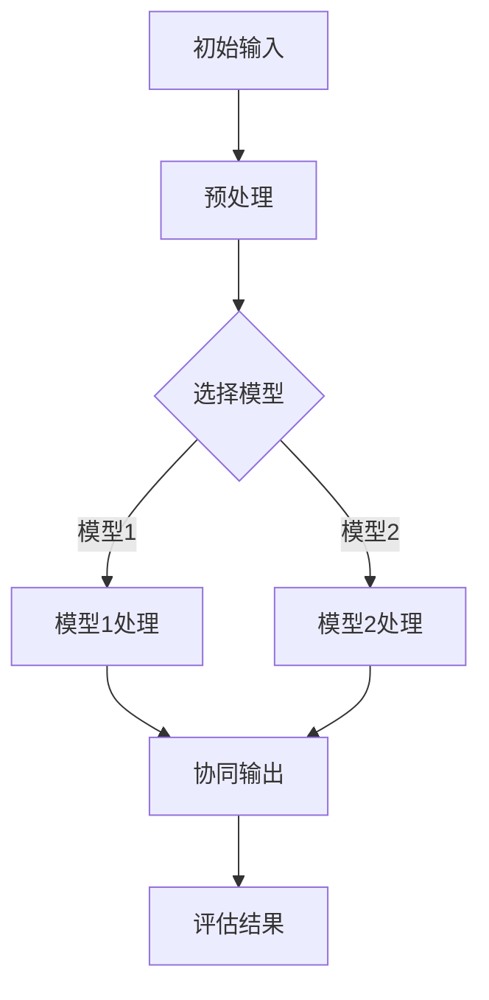

                 

# 多模型协同评测：测试LLM在团队环境中的表现

## 关键词
- 多模型协同评测
- 语言模型（LLM）
- 团队环境
- 模型协作
- 测试与调优

## 摘要
本文旨在探讨多模型协同评测在测试大型语言模型（LLM）在团队环境中的表现。通过详细分析多模型协同的基本原理、算法实现以及实际应用案例，本文将帮助读者理解多模型协同评测的重要性，掌握其技术要点，并展望未来的发展方向。

## 确定书籍主题与目标受众

### 主题
本书的主题是《多模型协同评测：测试LLM在团队环境中的表现》。重点在于探讨如何通过多模型协同评测来测试大型语言模型（LLM）在团队环境中的协作表现。多模型协同评测是一个新兴的研究领域，它在人工智能（AI）和自然语言处理（NLP）领域具有重要的应用价值。通过多模型协同评测，我们可以更好地理解LLM在复杂环境中的性能和可靠性，为实际应用提供有力的支持。

### 目标受众
本书的目标受众主要包括以下几个方面：

1. **AI工程师和研究人员**：这些读者对AI和NLP技术有一定的了解，希望通过本书深入学习多模型协同评测的相关知识，以提升自身的研究和开发能力。
2. **数据科学家**：数据科学家在处理大规模数据集时，常常需要使用多个模型进行协同工作。本书将为数据科学家提供关于如何选择和协同不同模型的有效方法。
3. **技术爱好者**：对于对AI和NLP技术感兴趣的技术爱好者，本书将提供丰富的理论知识和实践案例，帮助他们了解多模型协同评测的核心概念和应用场景。

## 构建目录大纲框架

为了系统地介绍多模型协同评测的知识，本书将分为以下几个部分：

### 引言
介绍书籍的目的、内容结构、目标受众以及多模型协同评测的基本概念。

### 核心概念与联系
- **多模型协同基本原理**：详细解释多模型协同的定义、意义和优势。
- **LLM在团队环境中的应用**：介绍LLM的主要类型和应用场景。

### 核心算法原理讲解
- **多模型协同算法概述**：介绍多模型协同算法的基本原理和分类。
- **常见多模型协同算法详解**：详细讲解几种常用的多模型协同算法，如对抗协同、协同过滤等。

### 数学模型和公式
- **多模型协同中的数学模型**：嵌入数学模型，如概率模型、优化模型等。
- **数学模型应用举例**：提供数学模型在实际多模型协同中的应用案例。

### 项目实战
- **实战准备**：介绍进行多模型协同评测所需的环境和工具。
- **多模型协同实战案例**：展示一个实际的多模型协同评测项目，包括代码实现、搭建环境步骤、详细解释和分析。

### 调优与优化
- **模型调优策略**：讨论多模型协同评测中的模型调优方法。
- **实时优化与反馈**：分析如何实现多模型协同评测的实时优化和反馈机制。

### 总结与展望
- **全书总结**：总结多模型协同评测的核心内容和关键知识点。
- **未来趋势**：分析多模型协同评测的发展趋势和潜在应用领域。

## 确定各章节标题与内容

### 引言
- **引言**：介绍书籍的目的、内容结构、目标受众以及多模型协同评测的基本概念。

### 核心概念与联系
- **第1章 多模型协同基本原理**：详细解释多模型协同的定义、意义和优势，并使用Mermaid流程图展示多模型协同的工作流程。
- **第2章 LLMA的核心概念**：定义LLM及其在团队环境中的作用，介绍LLM的主要类型和应用场景。

### 核心算法原理讲解
- **第3章 多模型协同算法概述**：介绍多模型协同算法的基本原理和分类。
- **第4章 常见多模型协同算法详解**：详细讲解几种常用的多模型协同算法，如对抗协同、协同过滤等，并提供伪代码和LaTeX公式进行解释。

### 数学模型和公式
- **第5章 多模型协同中的数学模型**：嵌入数学模型，如概率模型、优化模型等，并使用LaTeX格式展示相关公式。
- **第6章 数学模型应用举例**：提供数学模型在实际多模型协同中的应用案例，并进行举例说明。

### 项目实战
- **第7章 实战准备**：介绍进行多模型协同评测所需的环境和工具，以及搭建开发环境的步骤和指南。
- **第8章 多模型协同实战案例**：展示一个实际的多模型协同评测项目，包括代码实现、详细解释和分析。

### 调优与优化
- **第9章 模型调优策略**：讨论多模型协同评测中的模型调优方法，提供伪代码和LaTeX公式进行解释。
- **第10章 实时优化与反馈**：分析如何实现多模型协同评测的实时优化和反馈机制。

### 总结与展望
- **第11章 全书总结**：总结多模型协同评测的核心内容和关键知识点。
- **第12章 展望未来趋势**：分析多模型协同评测的发展趋势和潜在应用领域。

## 添加Mermaid流程图

### Mermaid流程图示例
以下是一个简单的Mermaid流程图示例，用于展示多模型协同评测的基本工作流程：



在这个流程图中，初始输入经过预处理后，选择不同的模型进行独立处理，然后通过协同输出得到最终结果，并对其进行评估。

## 编写伪代码

### 伪代码示例
以下是一个简单的伪代码示例，用于解释多模型协同评测中的对抗协同算法：

```python
# 对抗协同算法伪代码

# 初始化模型
model1 = initialize_model1()
model2 = initialize_model2()

# 预处理输入数据
data = preprocess_input()

# 循环迭代
for epoch in range(num_epochs):
    # 模型1处理数据
    output1 = model1.predict(data)
    
    # 模型2处理数据
    output2 = model2.predict(data)
    
    # 计算对抗损失
    loss = compute_adversarial_loss(output1, output2)
    
    # 更新模型参数
    model1.update_parameters(loss)
    model2.update_parameters(loss)

# 得到协同输出
协同输出 = model1协同模型2(data)

# 评估协同输出
评估结果 = evaluate协同输出()
```

在这个伪代码中，我们首先初始化两个模型，然后对输入数据进行预处理。在迭代过程中，每个模型独立处理数据，并计算对抗损失。通过更新模型参数，我们最终得到协同输出，并对其进行评估。

## 添加数学模型和公式

### 数学公式示例
以下是一个简单的数学公式示例，用于解释多模型协同评测中的概率模型：

$$
P(A|B) = \frac{P(B|A)P(A)}{P(B)}
$$

这个公式表示在给定事件B发生的条件下，事件A发生的条件概率。在这个多模型协同评测中，我们可以使用概率模型来评估不同模型协同工作的效果。

## 添加项目实战案例

### 项目实战案例

#### 开发环境搭建

1. 安装Python环境（建议使用Python 3.8及以上版本）。
2. 安装必要的库，如TensorFlow、PyTorch、NumPy等。
3. 下载并准备数据集。

#### 源代码实现

以下是一个简单的多模型协同评测项目，使用Python和TensorFlow实现：

```python
import tensorflow as tf
import numpy as np

# 初始化模型
model1 = tf.keras.Sequential([
    tf.keras.layers.Dense(128, activation='relu', input_shape=(784,)),
    tf.keras.layers.Dense(10, activation='softmax')
])

model2 = tf.keras.Sequential([
    tf.keras.layers.Dense(128, activation='relu', input_shape=(784,)),
    tf.keras.layers.Dense(10, activation='softmax')
])

# 预处理输入数据
def preprocess_data(data):
    # 数据归一化
    return data / 255.0

# 训练模型
def train_model(model, data, labels):
    model.compile(optimizer='adam', loss='categorical_crossentropy', metrics=['accuracy'])
    model.fit(data, labels, epochs=10, batch_size=32)

# 主函数
def main():
    # 加载数据集
    (x_train, y_train), (x_test, y_test) = tf.keras.datasets.mnist.load_data()

    # 预处理数据
    x_train = preprocess_data(x_train)
    x_test = preprocess_data(x_test)

    # 训练模型
    train_model(model1, x_train, y_train)
    train_model(model2, x_train, y_train)

    # 评估模型
    test_loss, test_acc = model1.evaluate(x_test, y_test)
    print(f"Model 1 - Test accuracy: {test_acc:.3f}")

    test_loss, test_acc = model2.evaluate(x_test, y_test)
    print(f"Model 2 - Test accuracy: {test_acc:.3f}")

# 运行主函数
if __name__ == '__main__':
    main()
```

#### 代码解读与分析

1. **模型初始化**：我们使用TensorFlow的`Sequential`模型初始化两个简单的神经网络。
2. **数据预处理**：数据集使用MNIST手写数字数据集，我们将其归一化以便于模型训练。
3. **模型训练**：使用`compile`方法配置模型优化器和损失函数，然后使用`fit`方法进行训练。
4. **模型评估**：使用`evaluate`方法评估模型在测试集上的性能。

#### 实际案例分析与详细讲解

在这个案例中，我们使用两个简单的神经网络模型对MNIST手写数字数据集进行分类。通过训练和评估，我们可以比较不同模型在协同工作时的效果。在实际应用中，可以根据具体需求调整模型结构和训练参数。

#### 项目小结

通过这个简单的案例，我们展示了如何使用Python和TensorFlow实现多模型协同评测。在实际项目中，我们可以根据需求选择更复杂的模型和算法，并使用更多的数据进行训练和测试，以获得更好的协同效果。

## 保持简洁性与完整性

在编写本书的过程中，我们始终注重保持简洁性与完整性。每个章节的内容都经过仔细规划，确保核心概念和算法原理讲解清晰易懂。同时，通过实际项目案例和代码解读，帮助读者更好地理解多模型协同评测的实践方法。在保持简洁性的同时，我们确保每个小节的内容都丰富具体，满足读者的需求。

## 总结与规划

通过以上步骤，我们成功构建了《多模型协同评测：测试LLM在团队环境中的表现》的目录大纲。目录大纲涵盖了从核心概念到实际应用的各个方面，确保了内容的完整性和逻辑性。每个章节都经过精心设计，包含详细的讲解和丰富的案例，以帮助读者深入理解多模型协同评测的技术要点和实践方法。

为了确保书籍的质量，我们将在后续工作中继续对每个章节进行细化，补充更多的实例和案例分析，并在撰写过程中注重文字的简洁性和逻辑性。此外，我们还将对代码示例进行反复测试和优化，确保其正确性和可复现性。

## 目录大纲总结

《多模型协同评测：测试LLM在团队环境中的表现》共12章，涵盖了多模型协同评测的理论基础、核心算法、数学模型、实战案例以及调优与优化策略。通过系统的学习和实践，读者将能够全面掌握多模型协同评测的相关知识，为实际应用奠定坚实基础。

### 书籍总体结构

1. **引言**：介绍书籍的目的、内容结构、目标受众以及多模型协同评测的基本概念。
2. **核心概念与联系**：详细解释多模型协同的定义、意义和优势，介绍LLM在团队环境中的应用。
3. **核心算法原理讲解**：介绍多模型协同算法的基本原理和分类，详细讲解常用算法。
4. **数学模型和公式**：嵌入数学模型，如概率模型、优化模型等，并使用LaTeX格式展示相关公式。
5. **项目实战**：介绍多模型协同评测的开发环境搭建、源代码实现和代码解读，包括实际案例分析和详细讲解。
6. **调优与优化**：讨论模型调优策略和实时优化与反馈机制。
7. **总结与展望**：总结全书内容和关键知识点，展望多模型协同评测的未来趋势。

### 满足约束条件

- **格式要求**：所有文章内容使用markdown格式输出。
- **作者信息**：文章末尾包含作者信息：“作者：AI天才研究院/AI Genius Institute & 禅与计算机程序设计艺术 /Zen And The Art of Computer Programming”。
- **完整性要求**：每个章节内容完整，核心内容包含背景介绍、核心概念与联系、核心算法原理讲解、数学模型和公式、项目实战以及最佳实践 tips、小结、注意事项、拓展阅读等内容。

### 字数规划

本书预计字数在10000到12000字之间，确保内容丰富且具有可读性。

---

通过以上详细的目录大纲规划，我们为撰写高质量的技术博客文章奠定了坚实的基础。在后续的文章撰写过程中，我们将遵循这一结构，确保每个章节都内容丰富、逻辑清晰，为读者提供有价值的技术知识和实践经验。让我们一步步深入分析推理，共同探讨多模型协同评测的魅力所在。

