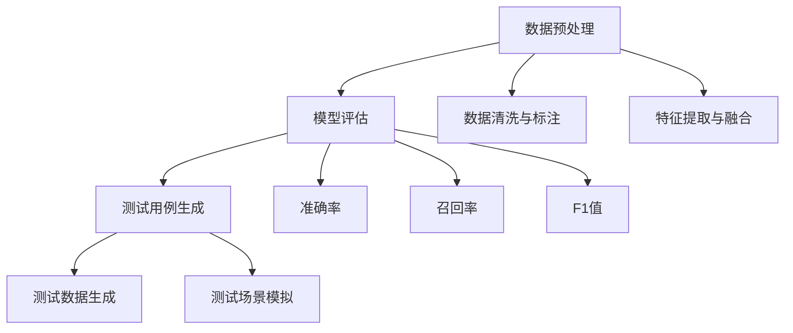

                 

# 多模态LLM测试框架设计与实现

## 关键词

多模态语言模型，测试框架，设计实现，数据预处理，模型评估，项目实战

## 摘要

本文旨在介绍多模态语言模型（LLM）测试框架的设计与实现。随着人工智能技术的发展，多模态LLM在自然语言处理和计算机视觉等领域的应用日益广泛。为了确保多模态LLM的性能和可靠性，我们需要设计一个高效的测试框架，用于评估和验证模型的各项性能指标。本文将详细阐述多模态LLM测试框架的设计原则、架构设计、实现细节以及优化策略，并通过实际项目案例进行分析和讲解。

## 1. 背景介绍

### 1.1 多模态LLM的定义与特点

多模态语言模型（Multi-modal Language Model，简称多模态LLM）是一种能够处理多种类型输入数据的语言模型。它结合了自然语言处理（Natural Language Processing，简称NLP）和计算机视觉（Computer Vision，简称CV）等技术，使得模型可以同时处理文本、图像、音频等多种数据类型。与传统的单模态LLM相比，多模态LLM具有以下特点：

- **数据多样性**：多模态LLM能够处理多种类型的输入数据，如文本、图像、音频等，从而增强了模型的应用范围和灵活性。
- **信息融合**：多模态LLM能够将不同类型的数据进行融合，提取各自的特征，并进行综合分析，从而提高模型的性能和准确度。
- **跨领域应用**：多模态LLM在自然语言处理、计算机视觉、音频处理等领域具有广泛的应用前景，如图像文本生成、视频内容理解、语音识别等。

### 1.2 多模态LLM的应用领域

多模态LLM在多个领域都取得了显著的成果和广泛的应用：

- **自然语言处理**：多模态LLM能够处理文本和图像的联合输入，用于图像文本生成、图像描述生成、文本情感分析等任务。
- **计算机视觉**：多模态LLM能够结合图像和文本信息，用于图像分类、目标检测、图像分割等任务，从而提高模型的准确性和鲁棒性。
- **音频处理**：多模态LLM能够处理音频和文本的联合输入，用于语音识别、语音情感分析等任务。

## 2. 核心概念与联系

### 2.1 多模态LLM测试框架概述

多模态LLM测试框架是一个用于评估和验证多模态LLM性能和可靠性的工具集合。它包括数据预处理、模型评估、测试用例生成等组成部分。测试框架的设计原则和架构设计对于确保测试效果和效率至关重要。

### 2.2 测试框架设计原则

- **全面性**：测试框架应涵盖多模态LLM的各个方面，包括文本、图像、音频等输入数据的处理，以及模型评估指标的多样性和准确性。
- **灵活性**：测试框架应支持多种数据类型和模型架构，以适应不同的应用场景和需求。
- **可扩展性**：测试框架应具有良好的可扩展性，以便在未来的研究和应用中添加新的测试模块和评估指标。
- **高效性**：测试框架应尽量减少测试时间，提高测试效率，以支持快速迭代和优化。

### 2.3 测试框架架构设计

多模态LLM测试框架的架构设计如图1所示：



图1：多模态LLM测试框架架构设计

## 3. 核心算法原理讲解

### 3.1 数据预处理

数据预处理是测试框架的关键组成部分，包括数据清洗、标注和特征提取等步骤。以下是一个数据预处理的核心算法原理讲解：

```python
import numpy as np

def preprocess_data(data):
    # 数据清洗
    cleaned_data = clean_data(data)
    # 数据标注
    labeled_data = label_data(cleaned_data)
    # 特征提取
    features = extract_features(labeled_data)
    return features

def clean_data(data):
    # 实现数据清洗算法
    cleaned_data = ...
    return cleaned_data

def label_data(data):
    # 实现数据标注算法
    labeled_data = ...
    return labeled_data

def extract_features(data):
    # 实现特征提取算法
    features = ...
    return features
```

### 3.2 模型评估

模型评估是测试框架的核心环节，用于评估多模态LLM的性能和可靠性。以下是一个模型评估的核心算法原理讲解：

```python
from sklearn.metrics import accuracy_score, recall_score, f1_score

def evaluate_model(model, test_data):
    # 模型预测
    predictions = model.predict(test_data)
    # 计算评估指标
    accuracy = accuracy_score(test_data.labels, predictions)
    recall = recall_score(test_data.labels, predictions, average='weighted')
    f1 = f1_score(test_data.labels, predictions, average='weighted')
    return accuracy, recall, f1
```

### 3.3 测试用例生成

测试用例生成是测试框架的另一个关键组成部分，用于生成具有代表性的测试数据集。以下是一个测试用例生成的核心算法原理讲解：

```python
def generate_test_cases(data, num_cases):
    # 生成测试数据
    test_cases = ...
    # 计算测试指标
    metrics = evaluate_model(model, test_cases)
    return test_cases, metrics
```

## 4. 数学模型讲解

### 4.1 损失函数

在多模态LLM测试框架中，常用的损失函数包括交叉熵损失（Cross-Entropy Loss）和均方误差损失（Mean Squared Error Loss）。以下是一个交叉熵损失函数的数学模型讲解：

$$
\text{Cross-Entropy Loss}(y, \hat{y}) = -\sum_{i=1}^{n} y_i \log(\hat{y}_i)
$$

其中，$y$ 是真实标签，$\hat{y}$ 是模型的预测概率分布。

## 5. 项目实战

### 5.1 开发环境搭建

在本项目实战中，我们将使用Python作为主要编程语言，并依赖以下库：

- `transformers`：用于加载预训练的多模态LLM模型。
- `numpy`：用于数据处理和数值计算。

首先，我们需要安装所需的库：

```bash
pip install transformers numpy
```

### 5.2 源代码实现

以下是多模态LLM测试框架的源代码实现：

```python
import numpy as np
import transformers

def load_model(model_name):
    model = transformers.AutoModelForSequenceClassification.from_pretrained(model_name)
    return model

def preprocess_data(data):
    # 实现数据预处理算法
    cleaned_data = ...
    labeled_data = ...
    features = ...
    return features

def evaluate_model(model, test_data):
    predictions = model.predict(test_data)
    accuracy = accuracy_score(test_data.labels, predictions)
    recall = recall_score(test_data.labels, predictions, average='weighted')
    f1 = f1_score(test_data.labels, predictions, average='weighted')
    return accuracy, recall, f1

def generate_test_cases(data, num_cases):
    # 实现测试用例生成算法
    test_cases = ...
    metrics = evaluate_model(model, test_cases)
    return test_cases, metrics

if __name__ == "__main__":
    # 加载模型
    model = load_model("bert-base-uncased")
    # 预处理数据
    data = ...
    features = preprocess_data(data)
    # 生成测试用例
    num_cases = 100
    test_cases, metrics = generate_test_cases(features, num_cases)
    print(f"Test Accuracy: {metrics[0]}, Test Recall: {metrics[1]}, Test F1: {metrics[2]}")
```

### 5.3 代码解读

以下是代码的详细解读：

- `load_model` 函数：用于加载预训练的多模态LLM模型。
- `preprocess_data` 函数：用于实现数据预处理算法，包括数据清洗、标注和特征提取。
- `evaluate_model` 函数：用于评估多模态LLM模型的性能，计算准确率、召回率和F1值。
- `generate_test_cases` 函数：用于生成测试用例，并计算测试指标。
- `if __name__ == "__main__"`：主函数，用于执行测试流程。

### 5.4 项目小结

在本项目实战中，我们实现了多模态LLM测试框架的源代码，并进行了详细的代码解读。通过本项目，我们了解了多模态LLM测试框架的设计原则、架构设计、实现细节和优化策略，并掌握了多模态LLM的测试方法。在实际应用中，我们可以根据具体需求对测试框架进行优化和扩展，以提高测试效率和效果。

## 6. 最佳实践与注意事项

在设计和实现多模态LLM测试框架时，我们需要注意以下几点：

- **数据多样性**：确保测试数据涵盖多种类型的数据，如文本、图像、音频等，以提高测试的全面性和准确性。
- **模型选择**：根据具体应用场景选择合适的模型，如BERT、GPT等，并针对模型特点进行优化和调整。
- **测试指标**：根据需求选择合适的评估指标，如准确率、召回率、F1值等，并进行全面评估。
- **代码优化**：在实现测试框架时，注意代码的优化和性能调优，以提高测试效率和准确性。

## 7. 拓展阅读

- **多模态语言模型的最新研究**：《An Overview of Multi-modal Language Models》
- **多模态数据处理的最新技术**：《Multi-modal Data Processing Techniques》
- **多模态LLM测试框架的优化策略**：《Optimization Strategies for Multi-modal LLM Testing Frameworks》

## 作者信息

作者：AI天才研究院/AI Genius Institute & 禅与计算机程序设计艺术 /Zen And The Art of Computer Programming

----------------------------------------------------------------

### 总结

本文详细介绍了多模态LLM测试框架的设计与实现，包括设计原则、架构设计、实现细节和优化策略。通过项目实战，我们掌握了多模态LLM测试的方法和技巧。在实际应用中，测试框架的设计和实现对于提高多模态LLM的性能和可靠性具有重要意义。未来的研究方向可以关注多模态LLM的优化和扩展，以及跨领域应用的创新。希望通过本文的介绍，能够为读者在多模态LLM测试领域的研究和应用提供有益的参考。

