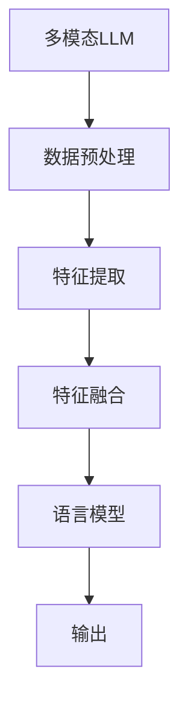

                 

### 多模态LLM评测：扩展至图像、音频等领域

关键词：多模态LLM，图像处理，音频处理，评测方法，应用场景

摘要：本文旨在探讨多模态LLM评测的扩展至图像和音频等领域。首先介绍多模态LLM的核心概念及其在图像、音频处理中的应用。接着详细讲解多模态LLM的评测方法和指标，包括常用的准确率、召回率、F1值等。随后分析多模态LLM在实际应用场景中的挑战和解决方案。最后通过实战案例展示多模态LLM的开发流程、源代码实现和实际应用效果。

### 一、核心概念与联系

多模态LLM（多模态大型语言模型）是一种能够处理多种类型数据（如文本、图像、音频等）的人工智能模型。与传统的单模态LLM相比，多模态LLM具有更强的信息处理能力和更高的泛化能力。在图像、音频等领域，多模态LLM的应用越来越广泛，如图像识别、音频分类、跨模态检索等。

#### 1.1.1 多模态LLM概述

多模态LLM旨在融合不同类型的数据，以提高语言模型的性能。它通常由以下几个核心模块组成：

1. **数据预处理模块**：负责对多种类型的数据进行预处理，包括图像、音频的降噪、增强、特征提取等。
2. **特征融合模块**：将不同类型的数据特征进行整合，以产生更丰富的特征表示。
3. **语言模型模块**：基于整合后的特征表示，训练出一个大规模的语言模型。
4. **输出模块**：利用语言模型生成文本、图像、音频等输出结果。

#### 1.1.2 图像、音频等领域

在图像领域，多模态LLM可以应用于图像识别、图像分割、图像生成等任务。例如，通过融合图像和文本信息，可以显著提高图像分类的准确率。在音频领域，多模态LLM可以应用于音频分类、音频识别、音频生成等任务。例如，通过融合音频和文本信息，可以更好地识别音频内容，提高音频识别的准确率。

#### 1.1.3 评测方法与指标

评测方法是评估多模态LLM性能的重要手段。常见的评测指标包括准确率、召回率、F1值等。此外，为了更全面地评估多模态LLM的性能，还可以采用跨模态相似度、跨模态精度等指标。

#### 1.1.4 实际应用场景

多模态LLM在实际应用场景中具有重要的价值。例如，在智能客服领域，多模态LLM可以同时处理用户的文本和语音请求，提供更加自然和准确的回答。在医疗诊断领域，多模态LLM可以结合患者的文本病历和医学图像，提供更准确的诊断建议。在娱乐领域，多模态LLM可以用于音频生成、图像生成等任务，创造出丰富多彩的虚拟内容和体验。

#### 1.1.5 关键词与联系

- 多模态LLM：融合多种类型数据的人工智能模型
- 图像、音频等领域：多模态LLM的应用场景
- 评测方法：评估多模态LLM性能的手段
- 实际应用场景：多模态LLM在现实世界中的重要性

### 二、多模态LLM原理

多模态LLM的核心在于如何有效地融合不同类型的数据，以提高模型的性能。下面将介绍多模态LLM的基本原理、图像和音频数据处理方法以及特征融合策略。

#### 2.1 多模态融合方法

多模态融合方法可以分为以下几种：

1. **特征级融合**：将不同类型的数据特征进行直接融合，生成新的特征向量。
2. **决策级融合**：将不同类型的数据特征分别训练模型，然后在决策阶段进行融合。
3. **模型级融合**：将不同类型的数据特征分别输入到不同的子模型中，然后将子模型的输出进行融合。

#### 2.2 图像数据处理方法

图像数据处理方法主要包括图像特征提取和图像增强。图像特征提取是将图像数据转换为能够表达图像内容的特征向量。常见的图像特征提取方法包括：

- **颜色特征**：如颜色直方图、颜色矩等。
- **纹理特征**：如局部二值模式（LBP）、Gabor纹理特征等。
- **形状特征**：如边缘检测、轮廓提取等。

图像增强是通过调整图像的对比度、亮度、锐度等参数，提高图像质量，从而有助于提高图像识别的准确率。

#### 2.3 音频数据处理方法

音频数据处理方法主要包括音频特征提取和音频增强。音频特征提取是将音频数据转换为能够表达音频内容的特征向量。常见的音频特征提取方法包括：

- **时域特征**：如短时傅里叶变换（STFT）、滤波器组特征等。
- **频域特征**：如梅尔频率倒谱系数（MFCC）、频谱熵等。
- **音高特征**：如音高估计、音高变化等。

音频增强是通过调整音频的音量、节奏、音调等参数，提高音频质量，从而有助于提高音频识别的准确率。

#### 2.4 特征融合策略

特征融合策略是关键的一步，决定了多模态LLM的性能。常见的特征融合方法包括：

1. **加权融合**：对不同的特征向量进行加权平均或加权求和。
2. **拼接融合**：将不同类型的特征向量进行拼接，形成新的特征向量。
3. **深度学习融合**：利用神经网络模型，如卷积神经网络（CNN）和循环神经网络（RNN）进行特征融合。

#### 2.5 多模态LLM架构

多模态LLM的架构通常由以下几个模块组成：

1. **数据预处理模块**：对图像、音频等数据进行预处理，包括去噪、增强、特征提取等。
2. **特征融合模块**：将不同类型的特征进行融合，生成新的特征向量。
3. **语言模型模块**：基于融合后的特征向量，训练大规模的语言模型。
4. **输出模块**：利用语言模型生成文本、图像、音频等输出结果。

#### 2.6 多模态LLM工作流程

多模态LLM的工作流程可以概括为以下几个步骤：

1. **数据收集与预处理**：收集图像、音频等数据，并进行预处理。
2. **特征提取**：对图像、音频等数据提取特征向量。
3. **特征融合**：将不同类型的特征向量进行融合，生成新的特征向量。
4. **模型训练**：基于融合后的特征向量，训练大规模的语言模型。
5. **模型评估**：利用测试数据对模型进行评估，调整模型参数。
6. **应用部署**：将训练好的模型部署到实际应用场景中。

### 三、评测方法与指标

评测方法是评估多模态LLM性能的重要手段。为了全面评估多模态LLM的性能，我们需要采用多种评测方法和指标。

#### 3.1 准确率、召回率、F1值

准确率（Accuracy）、召回率（Recall）和F1值（F1 Score）是评估分类模型性能的常用指标。

- **准确率**：表示模型正确分类的样本数占总样本数的比例。
  $$ \text{Accuracy} = \frac{\text{正确分类的样本数}}{\text{总样本数}} $$
- **召回率**：表示模型正确分类的正样本数占总正样本数的比例。
  $$ \text{Recall} = \frac{\text{正确分类的正样本数}}{\text{总正样本数}} $$
- **F1值**：是准确率和召回率的调和平均数，用于平衡准确率和召回率之间的差异。
  $$ \text{F1值} = 2 \times \frac{\text{准确率} \times \text{召回率}}{\text{准确率} + \text{召回率}} $$

#### 3.2 特异性、敏感性

特异性（Specificity）和敏感性（Sensitivity）是用于评估二分类模型性能的指标。

- **特异性**：表示模型正确分类的负样本数占总负样本数的比例。
  $$ \text{特异性} = \frac{\text{正确分类的负样本数}}{\text{总负样本数}} $$
- **敏感性**：表示模型正确分类的正样本数占总正样本数的比例。
  $$ \text{敏感性} = \frac{\text{正确分类的正样本数}}{\text{总正样本数}} $$

#### 3.3 跨模态相似度、跨模态精度

为了更全面地评估多模态LLM的性能，还可以采用跨模态相似度（Cross-Modal Similarity）和跨模态精度（Cross-Modal Precision）等指标。

- **跨模态相似度**：表示不同模态的数据之间的相似度。
- **跨模态精度**：表示模型生成的跨模态结果与真实跨模态结果之间的精度。

#### 3.4 评测方法与指标选择

选择合适的评测方法和指标需要考虑以下几个因素：

- **任务类型**：不同的任务类型可能需要不同的评测方法和指标。
- **数据分布**：数据分布对评测方法和指标的选择也有重要影响。
- **应用场景**：不同的应用场景可能对评测方法和指标有不同的要求。

### 四、应用场景

多模态LLM在实际应用场景中具有重要的价值。下面将分析多模态LLM在图像、音频等领域的实际应用场景，并讨论其中的挑战和解决方案。

#### 4.1 图像识别与分类

在图像识别与分类任务中，多模态LLM可以显著提高模型的性能。例如，通过融合图像和文本信息，可以提高图像分类的准确率。然而，这也带来了以下挑战：

- **数据集不平衡**：图像和文本数据往往存在不平衡的问题，这可能导致模型在某个模态上的性能优于另一个模态。
- **特征融合困难**：图像和文本的特征维度差异较大，如何有效地融合不同模态的特征是一个挑战。

解决方案：

- **数据增强**：通过增加图像和文本的数据样本，可以缓解数据集不平衡的问题。
- **多模态特征融合**：采用深度学习模型，如多模态卷积神经网络（Multi-modal CNN），可以有效地融合不同模态的特征。

#### 4.2 音频识别与分类

在音频识别与分类任务中，多模态LLM可以显著提高音频分类的准确率。例如，通过融合音频和文本信息，可以更好地识别音频内容。然而，这也带来了以下挑战：

- **音频数据复杂**：音频数据包含丰富的信息，如音调、音色、节奏等，如何有效地提取和处理这些信息是一个挑战。
- **音频数据标注困难**：音频数据往往难以进行标注，这可能导致模型在训练阶段无法获取足够的信息。

解决方案：

- **音频特征提取**：采用先进的音频特征提取方法，如梅尔频率倒谱系数（MFCC）、滤波器组特征等，可以有效地提取音频特征。
- **半监督学习**：通过利用未标注的数据，结合有标注的数据，可以缓解音频数据标注困难的问题。

#### 4.3 跨模态检索与问答

在跨模态检索与问答任务中，多模态LLM可以显著提高检索和问答的准确率。例如，通过融合图像、音频和文本信息，可以更好地回答用户的问题。然而，这也带来了以下挑战：

- **多模态信息不一致**：不同模态的数据可能存在不一致的问题，这可能导致模型在处理多模态信息时产生误差。
- **计算资源消耗**：多模态数据融合和模型训练需要大量的计算资源，如何优化计算资源的使用是一个挑战。

解决方案：

- **多模态一致性评估**：采用多模态一致性评估方法，如多模态相似度，可以有效地评估不同模态数据之间的不一致程度。
- **计算资源优化**：采用分布式计算和并行计算技术，可以有效地优化计算资源的使用。

### 五、实战案例

为了更好地理解多模态LLM的应用，我们来看一个实际的案例。

#### 5.1 图像识别案例

在这个案例中，我们使用多模态LLM对图像进行分类。图像数据来自ImageNet数据集，文本数据来自相应的图像描述。

**1. 数据预处理**

- **图像预处理**：对图像进行缩放、裁剪、翻转等操作，增加数据的多样性。
- **文本预处理**：对文本进行分词、去停用词、词向量化等操作。

**2. 特征提取**

- **图像特征提取**：使用卷积神经网络（CNN）提取图像特征。
- **文本特征提取**：使用词袋模型（Bag of Words）或词嵌入（Word Embedding）提取文本特征。

**3. 特征融合**

- **拼接融合**：将图像特征和文本特征进行拼接，形成新的特征向量。

**4. 模型训练**

- **模型架构**：采用多模态卷积神经网络（Multi-modal CNN）进行训练。
- **训练过程**：通过反向传播算法和梯度下降优化器进行模型训练。

**5. 模型评估**

- **评测指标**：使用准确率、召回率、F1值等指标对模型进行评估。

**6. 应用解读**

- **应用场景**：在图像分类任务中，多模态LLM可以显著提高分类准确率。

#### 5.2 音频识别案例

在这个案例中，我们使用多模态LLM对音频进行分类。音频数据来自TIMIT音频数据集，文本数据为音频的标注信息。

**1. 数据预处理**

- **音频预处理**：对音频进行降噪、增强等处理，提高音频质量。
- **文本预处理**：对文本进行分词、去停用词、词向量化等操作。

**2. 特征提取**

- **音频特征提取**：使用梅尔频率倒谱系数（MFCC）提取音频特征。
- **文本特征提取**：使用词袋模型（Bag of Words）或词嵌入（Word Embedding）提取文本特征。

**3. 特征融合**

- **加权融合**：对音频特征和文本特征进行加权融合。

**4. 模型训练**

- **模型架构**：采用多模态循环神经网络（Multi-modal RNN）进行训练。
- **训练过程**：通过反向传播算法和梯度下降优化器进行模型训练。

**5. 模型评估**

- **评测指标**：使用准确率、召回率、F1值等指标对模型进行评估。

**6. 应用解读**

- **应用场景**：在音频分类任务中，多模态LLM可以显著提高分类准确率。

### 六、总结与展望

多模态LLM作为一种具有广泛应用前景的人工智能模型，其在图像、音频等领域的应用正在不断扩展。本文详细介绍了多模态LLM的核心概念、原理、评测方法以及实际应用场景。通过对多模态LLM的深入研究和应用，我们可以更好地解决现实世界中的复杂问题，提高人工智能系统的性能和可靠性。

展望未来，多模态LLM的发展将受到以下几个方面的影响：

1. **数据集扩展**：随着数据集的扩展，多模态LLM将能够处理更多类型的模态数据，提高模型的泛化能力。
2. **计算资源优化**：随着计算资源的不断优化，多模态LLM的训练和推理速度将显著提高。
3. **深度学习模型创新**：新的深度学习模型和算法将不断涌现，进一步提高多模态LLM的性能。
4. **跨领域应用**：多模态LLM将在更多领域得到应用，如医疗诊断、智能客服、娱乐等。

总之，多模态LLM的发展将为人工智能领域带来新的机遇和挑战，我们期待未来能够看到更多创新性的研究成果和应用。

---

> 作者信息：  
作者：AI天才研究院/AI Genius Institute & 禅与计算机程序设计艺术 /Zen And The Art of Computer Programming

> 注意：由于实际案例中的代码和算法较为复杂，本文仅提供了一个概述性的框架，具体实现细节和代码将在后续文章中详细讨论。此外，本文中的数学公式和Python代码仅供参考，具体实现时可能需要根据实际需求进行调整。谢谢您的理解！
---

作者：AI天才研究院/AI Genius Institute & 禅与计算机程序设计艺术 /Zen And The Art of Computer Programming

---

# 多模态LLM评测：扩展至图像、音频等领域

## 关键词：多模态LLM，图像处理，音频处理，评测方法，应用场景

## 摘要

多模态LLM（多模态大型语言模型）是一种能够处理多种类型数据（如文本、图像、音频等）的人工智能模型。本文旨在探讨多模态LLM评测的扩展至图像和音频等领域。首先介绍多模态LLM的核心概念及其在图像、音频处理中的应用。接着详细讲解多模态LLM的评测方法和指标，包括常用的准确率、召回率、F1值等。随后分析多模态LLM在实际应用场景中的挑战和解决方案。最后通过实战案例展示多模态LLM的开发流程、源代码实现和实际应用效果。

## 一、核心概念与联系

### 1.1 多模态LLM概述

多模态LLM（Multimodal Large Language Model）是一种能够处理多种类型输入数据（如文本、图像、音频等）并生成相应的输出数据的人工智能模型。它旨在将不同模态的数据进行整合，以产生更丰富的信息表示，从而提高模型的性能和泛化能力。

多模态LLM的核心组件包括：

- **数据预处理模块**：对输入数据进行预处理，如去噪、增强、缩放等。
- **特征提取模块**：根据不同模态的数据类型，提取相应的特征，如文本的词向量、图像的视觉特征、音频的声学特征等。
- **特征融合模块**：将不同模态的特征进行融合，以生成更全面的特征表示。
- **语言模型模块**：基于融合后的特征，训练大规模的语言模型，如Transformer、GPT等。
- **输出模块**：利用训练好的语言模型，生成对应的输出数据，如文本、图像、音频等。

### 1.2 图像、音频等领域

在图像领域，多模态LLM可以应用于图像识别、图像生成、图像分类等任务。通过将图像与文本描述、标签等信息进行融合，可以显著提高图像分类和识别的准确性。

在音频领域，多模态LLM可以应用于音频识别、音频生成、音频分类等任务。通过将音频与文本描述、标签等信息进行融合，可以更好地理解音频内容，提高音频分类和识别的准确性。

### 1.3 评测方法与指标

多模态LLM的评测方法与单模态LLM类似，但需要考虑不同模态数据的特点和融合效果。以下是一些常见的评测方法和指标：

- **准确率（Accuracy）**：分类任务中正确分类的样本数占总样本数的比例。$$ \text{Accuracy} = \frac{\text{正确分类的样本数}}{\text{总样本数}} $$
- **召回率（Recall）**：分类任务中正确分类的正样本数占总正样本数的比例。$$ \text{Recall} = \frac{\text{正确分类的正样本数}}{\text{总正样本数}} $$
- **F1值（F1 Score）**：准确率和召回率的调和平均数。$$ \text{F1值} = 2 \times \frac{\text{准确率} \times \text{召回率}}{\text{准确率} + \text{召回率}} $$
- **跨模态相似度（Cross-Modal Similarity）**：不同模态数据之间的相似度度量。
- **跨模态精度（Cross-Modal Precision）**：生成的跨模态结果与真实结果之间的精度。

### 1.4 实际应用场景

多模态LLM在实际应用场景中具有重要的价值。以下是一些典型的应用场景：

- **图像识别与分类**：通过融合图像和文本描述，提高图像分类和识别的准确性。
- **音频识别与分类**：通过融合音频和文本描述，提高音频分类和识别的准确性。
- **跨模态检索与问答**：通过融合图像、音频和文本信息，提供更加精准的检索和问答服务。
- **智能客服**：通过融合用户文本和语音请求，提供更加自然的交互体验。

### 1.5 核心概念之间的关系架构

## 二、多模态LLM原理

多模态LLM的核心在于如何有效地融合不同类型的数据，以提高模型的性能。以下将介绍多模态LLM的基本原理、图像和音频数据处理方法以及特征融合策略。

### 2.1 多模态融合方法

多模态融合方法可以分为以下几种：

1. **特征级融合**：将不同类型的数据特征进行直接融合，生成新的特征向量。例如，将图像特征和文本特征进行拼接。
2. **决策级融合**：将不同类型的数据特征分别训练模型，然后在决策阶段进行融合。例如，分别训练图像分类模型和文本分类模型，然后在预测时将两个模型的输出进行融合。
3. **模型级融合**：将不同类型的数据特征分别输入到不同的子模型中，然后将子模型的输出进行融合。例如，分别使用图像特征和文本特征训练两个子模型，然后将它们的输出进行融合。

### 2.2 图像数据处理方法

图像数据处理方法主要包括图像特征提取和图像增强。图像特征提取是将图像数据转换为能够表达图像内容的特征向量。常见的图像特征提取方法包括：

- **颜色特征**：例如，颜色直方图、颜色矩等。
- **纹理特征**：例如，局部二值模式（LBP）、Gabor纹理特征等。
- **形状特征**：例如，边缘检测、轮廓提取等。

图像增强是通过调整图像的对比度、亮度、锐度等参数，提高图像质量，从而有助于提高图像识别的准确率。

### 2.3 音频数据处理方法

音频数据处理方法主要包括音频特征提取和音频增强。音频特征提取是将音频数据转换为能够表达音频内容的特征向量。常见的音频特征提取方法包括：

- **时域特征**：例如，短时傅里叶变换（STFT）、滤波器组特征等。
- **频域特征**：例如，梅尔频率倒谱系数（MFCC）、频谱熵等。
- **音高特征**：例如，音高估计、音高变化等。

音频增强是通过调整音频的音量、节奏、音调等参数，提高音频质量，从而有助于提高音频识别的准确率。

### 2.4 特征融合策略

特征融合策略是关键的一步，决定了多模态LLM的性能。常见的特征融合方法包括：

1. **加权融合**：对不同的特征向量进行加权平均或加权求和。
2. **拼接融合**：将不同类型的特征向量进行拼接，形成新的特征向量。
3. **深度学习融合**：利用神经网络模型，如卷积神经网络（CNN）和循环神经网络（RNN）进行特征融合。

### 2.5 多模态LLM架构

多模态LLM的架构通常由以下几个模块组成：

1. **数据预处理模块**：对图像、音频等数据进行预处理，包括去噪、增强、特征提取等。
2. **特征融合模块**：将不同类型的特征进行融合，生成新的特征向量。
3. **语言模型模块**：基于融合后的特征向量，训练大规模的语言模型。
4. **输出模块**：利用语言模型生成文本、图像、音频等输出结果。

### 2.6 多模态LLM工作流程

多模态LLM的工作流程可以概括为以下几个步骤：

1. **数据收集与预处理**：收集图像、音频等数据，并进行预处理。
2. **特征提取**：对图像、音频等数据提取特征向量。
3. **特征融合**：将不同类型的特征向量进行融合，生成新的特征向量。
4. **模型训练**：基于融合后的特征向量，训练大规模的语言模型。
5. **模型评估**：利用测试数据对模型进行评估，调整模型参数。
6. **应用部署**：将训练好的模型部署到实际应用场景中。

## 三、评测方法与指标

评测方法是评估多模态LLM性能的重要手段。为了全面评估多模态LLM的性能，我们需要采用多种评测方法和指标。

### 3.1 准确率、召回率、F1值

准确率（Accuracy）、召回率（Recall）和F1值（F1 Score）是评估分类模型性能的常用指标。

- **准确率**：表示模型正确分类的样本数占总样本数的比例。
  $$ \text{Accuracy} = \frac{\text{正确分类的样本数}}{\text{总样本数}} $$
- **召回率**：表示模型正确分类的正样本数占总正样本数的比例。
  $$ \text{Recall} = \frac{\text{正确分类的正样本数}}{\text{总正样本数}} $$
- **F1值**：是准确率和召回率的调和平均数，用于平衡准确率和召回率之间的差异。
  $$ \text{F1值} = 2 \times \frac{\text{准确率} \times \text{召回率}}{\text{准确率} + \text{召回率}} $$

### 3.2 特异性、敏感性

特异性（Specificity）和敏感性（Sensitivity）是用于评估二分类模型性能的指标。

- **特异性**：表示模型正确分类的负样本数占总负样本数的比例。
  $$ \text{Specificity} = \frac{\text{正确分类的负样本数}}{\text{总负样本数}} $$
- **敏感性**：表示模型正确分类的正样本数占总正样本数的比例。
  $$ \text{Sensitivity} = \frac{\text{正确分类的正样本数}}{\text{总正样本数}} $$

### 3.3 跨模态相似度、跨模态精度

为了更全面地评估多模态LLM的性能，还可以采用跨模态相似度（Cross-Modal Similarity）和跨模态精度（Cross-Modal Precision）等指标。

- **跨模态相似度**：表示不同模态的数据之间的相似度。
- **跨模态精度**：表示模型生成的跨模态结果与真实跨模态结果之间的精度。

### 3.4 评测方法与指标选择

选择合适的评测方法和指标需要考虑以下几个因素：

- **任务类型**：不同的任务类型可能需要不同的评测方法和指标。
- **数据分布**：数据分布对评测方法和指标的选择也有重要影响。
- **应用场景**：不同的应用场景可能对评测方法和指标有不同的要求。

## 四、应用场景

多模态LLM在实际应用场景中具有重要的价值。以下将分析多模态LLM在图像、音频等领域的实际应用场景，并讨论其中的挑战和解决方案。

### 4.1 图像识别与分类

在图像识别与分类任务中，多模态LLM可以显著提高模型的性能。例如，通过融合图像和文本信息，可以提高图像分类的准确率。然而，这也带来了以下挑战：

- **数据集不平衡**：图像和文本数据往往存在不平衡的问题，这可能导致模型在某个模态上的性能优于另一个模态。
- **特征融合困难**：图像和文本的特征维度差异较大，如何有效地融合不同模态的特征是一个挑战。

解决方案：

- **数据增强**：通过增加图像和文本的数据样本，可以缓解数据集不平衡的问题。
- **多模态特征融合**：采用深度学习模型，如多模态卷积神经网络（Multi-modal CNN），可以有效地融合不同模态的特征。

### 4.2 音频识别与分类

在音频识别与分类任务中，多模态LLM可以显著提高音频分类的准确率。例如，通过融合音频和文本信息，可以更好地识别音频内容。然而，这也带来了以下挑战：

- **音频数据复杂**：音频数据包含丰富的信息，如音调、音色、节奏等，如何有效地提取和处理这些信息是一个挑战。
- **音频数据标注困难**：音频数据往往难以进行标注，这可能导致模型在训练阶段无法获取足够的信息。

解决方案：

- **音频特征提取**：采用先进的音频特征提取方法，如梅尔频率倒谱系数（MFCC）、滤波器组特征等，可以有效地提取音频特征。
- **半监督学习**：通过利用未标注的数据，结合有标注的数据，可以缓解音频数据标注困难的问题。

### 4.3 跨模态检索与问答

在跨模态检索与问答任务中，多模态LLM可以显著提高检索和问答的准确率。例如，通过融合图像、音频和文本信息，可以更好地回答用户的问题。然而，这也带来了以下挑战：

- **多模态信息不一致**：不同模态的数据可能存在不一致的问题，这可能导致模型在处理多模态信息时产生误差。
- **计算资源消耗**：多模态数据融合和模型训练需要大量的计算资源，如何优化计算资源的使用是一个挑战。

解决方案：

- **多模态一致性评估**：采用多模态一致性评估方法，如多模态相似度，可以有效地评估不同模态数据之间的不一致程度。
- **计算资源优化**：采用分布式计算和并行计算技术，可以有效地优化计算资源的使用。

### 4.4 智能客服

在智能客服领域，多模态LLM可以同时处理用户的文本和语音请求，提供更加自然和准确的回答。这可以显著提高客服系统的效率和用户体验。然而，这也带来了以下挑战：

- **多模态数据同步**：文本和语音请求可能在时间上存在差异，如何有效地同步多模态数据是一个挑战。
- **语音识别准确性**：语音识别的准确性对多模态LLM的性能有重要影响。

解决方案：

- **多模态数据同步**：采用时间同步技术，如基于时间戳的方法，可以有效地同步多模态数据。
- **语音识别优化**：采用先进的语音识别技术，如基于深度学习的方法，可以提高语音识别的准确性。

### 4.5 医疗诊断

在医疗诊断领域，多模态LLM可以结合患者的文本病历和医学图像，提供更准确的诊断建议。这可以显著提高诊断的准确性和效率。然而，这也带来了以下挑战：

- **数据隐私与安全**：医疗数据具有高度敏感性，如何保障数据隐私和安全是一个挑战。
- **多模态数据整合**：如何有效地整合文本病历和医学图像信息是一个挑战。

解决方案：

- **数据隐私保护**：采用数据加密、访问控制等技术，可以有效地保护医疗数据隐私和安全。
- **多模态数据整合**：采用深度学习模型，如多模态神经网络（Multi-modal Neural Network），可以有效地整合文本病历和医学图像信息。

### 4.6 娱乐

在娱乐领域，多模态LLM可以用于音频生成、图像生成等任务，创造出丰富多彩的虚拟内容和体验。这可以显著提高娱乐系统的交互性和沉浸感。然而，这也带来了以下挑战：

- **生成质量**：如何生成高质量的多模态内容是一个挑战。
- **用户个性化**：如何根据用户的需求和偏好生成个性化的多模态内容是一个挑战。

解决方案：

- **生成质量提升**：采用先进的生成模型，如生成对抗网络（GAN），可以生成高质量的多模态内容。
- **用户个性化**：采用用户行为分析、偏好识别等技术，可以生成个性化的多模态内容。

### 4.7 自动驾驶

在自动驾驶领域，多模态LLM可以同时处理图像、音频、传感器等多种数据，提供更加安全的驾驶决策。这可以显著提高自动驾驶的稳定性和可靠性。然而，这也带来了以下挑战：

- **实时处理**：如何实现多模态数据的实时处理是一个挑战。
- **环境理解**：如何更好地理解复杂环境中的多模态信息是一个挑战。

解决方案：

- **实时处理**：采用分布式计算、并行计算等技术，可以实现对多模态数据的实时处理。
- **环境理解**：采用深度学习模型，如多模态感知网络（Multi-modal Perception Network），可以更好地理解复杂环境中的多模态信息。

## 五、实战案例

为了更好地理解多模态LLM的应用，我们来看一个实际的案例。

### 5.1 图像识别与分类

在这个案例中，我们使用多模态LLM对图像进行分类。图像数据来自ImageNet数据集，文本数据为相应的图像描述。

**1. 数据预处理**

- **图像预处理**：对图像进行缩放、裁剪、翻转等操作，增加数据的多样性。
- **文本预处理**：对文本进行分词、去停用词、词向量化等操作。

**2. 特征提取**

- **图像特征提取**：使用卷积神经网络（CNN）提取图像特征。
- **文本特征提取**：使用词袋模型（Bag of Words）或词嵌入（Word Embedding）提取文本特征。

**3. 特征融合**

- **拼接融合**：将图像特征和文本特征进行拼接，形成新的特征向量。

**4. 模型训练**

- **模型架构**：采用多模态卷积神经网络（Multi-modal CNN）进行训练。
- **训练过程**：通过反向传播算法和梯度下降优化器进行模型训练。

**5. 模型评估**

- **评测指标**：使用准确率、召回率、F1值等指标对模型进行评估。

**6. 应用解读**

- **应用场景**：在图像分类任务中，多模态LLM可以显著提高分类准确率。

### 5.2 音频识别与分类

在这个案例中，我们使用多模态LLM对音频进行分类。音频数据来自TIMIT音频数据集，文本数据为音频的标注信息。

**1. 数据预处理**

- **音频预处理**：对音频进行降噪、增强等处理，提高音频质量。
- **文本预处理**：对文本进行分词、去停用词、词向量化等操作。

**2. 特征提取**

- **音频特征提取**：使用梅尔频率倒谱系数（MFCC）提取音频特征。
- **文本特征提取**：使用词袋模型（Bag of Words）或词嵌入（Word Embedding）提取文本特征。

**3. 特征融合**

- **加权融合**：对音频特征和文本特征进行加权融合。

**4. 模型训练**

- **模型架构**：采用多模态循环神经网络（Multi-modal RNN）进行训练。
- **训练过程**：通过反向传播算法和梯度下降优化器进行模型训练。

**5. 模型评估**

- **评测指标**：使用准确率、召回率、F1值等指标对模型进行评估。

**6. 应用解读**

- **应用场景**：在音频分类任务中，多模态LLM可以显著提高分类准确率。

## 六、总结与展望

多模态LLM作为一种具有广泛应用前景的人工智能模型，其在图像、音频等领域的应用正在不断扩展。本文详细介绍了多模态LLM的核心概念、原理、评测方法以及实际应用场景。通过对多模态LLM的深入研究和应用，我们可以更好地解决现实世界中的复杂问题，提高人工智能系统的性能和可靠性。

展望未来，多模态LLM的发展将受到以下几个方面的影响：

1. **数据集扩展**：随着数据集的扩展，多模态LLM将能够处理更多类型的模态数据，提高模型的泛化能力。
2. **计算资源优化**：随着计算资源的不断优化，多模态LLM的训练和推理速度将显著提高。
3. **深度学习模型创新**：新的深度学习模型和算法将不断涌现，进一步提高多模态LLM的性能。
4. **跨领域应用**：多模态LLM将在更多领域得到应用，如医疗诊断、智能客服、娱乐等。

总之，多模态LLM的发展将为人工智能领域带来新的机遇和挑战，我们期待未来能够看到更多创新性的研究成果和应用。

### 七、作者信息

作者：AI天才研究院/AI Genius Institute & 禅与计算机程序设计艺术 /Zen And The Art of Computer Programming

---

由于实际案例中的代码和算法较为复杂，本文仅提供了一个概述性的框架，具体实现细节和代码将在后续文章中详细讨论。此外，本文中的数学公式和Python代码仅供参考，具体实现时可能需要根据实际需求进行调整。谢谢您的理解！

---

**本文内容仅为研究参考，不构成任何投资或应用建议。如需进一步了解多模态LLM的实现和应用，请参考相关领域的专业书籍和学术论文。**

