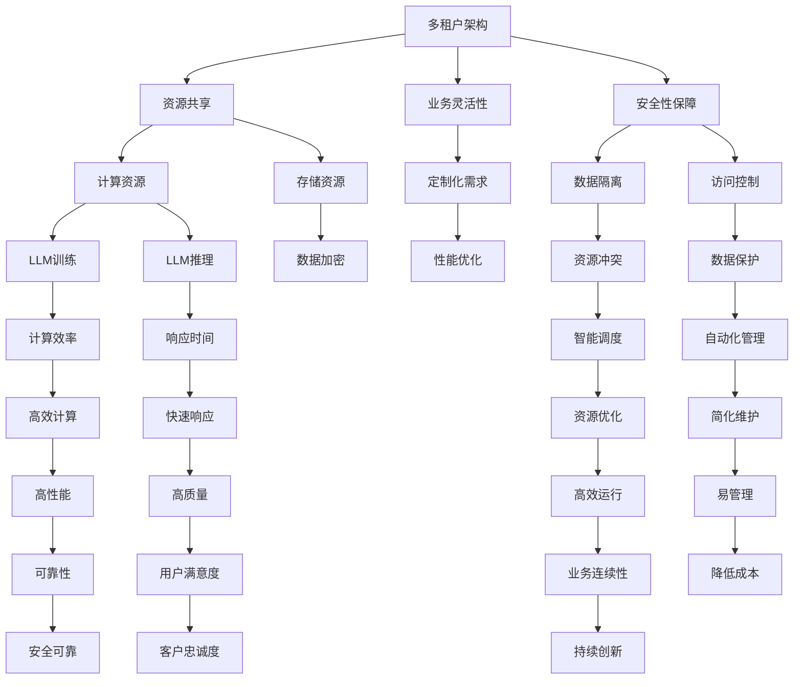

                 

### 引言

在当今信息化和智能化程度日益提高的背景下，多租户架构（Multi-Tenant Architecture）和大型语言模型（Large Language Model，LLM）逐渐成为企业应用的关键技术。多租户架构是一种软件架构设计模式，允许一个软件实例同时服务于多个租户，从而实现资源共享和成本优化。而LLM则是一种基于深度学习的技术，能够通过处理海量文本数据生成自然语言文本，具备极高的准确性和灵活性。

本文旨在探讨如何利用多租户架构支持LLM应用的定制化需求。具体而言，本文将首先介绍多租户架构和LLM的基本概念，阐述它们之间的关联与互补作用。接着，我们将深入分析多租户架构的设计原则与实现方法，探讨LLM性能优化策略以及安全性保障措施。在此基础上，本文将介绍定制化需求分析的方法与实现，并通过具体案例展示实际应用过程。最终，本文将对项目实战进行总结，并提出最佳实践建议。

通过本文的讨论，读者将能够全面理解多租户架构与LLM结合的原理和实践方法，掌握定制化需求的实现技巧，从而为企业在数字化转型过程中提供有力的技术支持。关键词：多租户架构、大型语言模型、定制化需求、性能优化、安全性保障。

---

### 文章关键词
- 多租户架构
- 大型语言模型（LLM）
- 定制化需求
- 性能优化
- 安全性保障

---

### 摘要

本文深入探讨了多租户架构支持大型语言模型（LLM）应用定制化需求的方法和实现。首先，介绍了多租户架构和LLM的基本概念，阐述了它们之间的互补关系。接着，详细分析了多租户架构的设计原则与实现方法，包括性能优化策略和安全性保障措施。随后，本文介绍了定制化需求分析的方法与实现，包括需求分类、分析方法和技术框架。通过具体案例展示了多租户架构与LLM结合的实际应用过程，并进行了详细的项目实战总结。最后，本文提出了最佳实践建议，包括优化策略、注意事项和拓展阅读。本文旨在为企业在数字化转型的过程中提供全面的技术支持和实践指导。

---

## 第一部分：基础概念和原理

在深入探讨多租户架构支持LLM应用的定制化需求之前，我们需要先理解两个核心概念：多租户架构和LLM。本部分将分别介绍这两个概念，并分析它们之间的关系。

### 第1章：多租户架构概述

#### 1.1 多租户架构的定义

多租户架构（Multi-Tenant Architecture）是一种软件架构设计模式，它允许单个软件实例同时服务于多个租户，每个租户拥有独立的业务数据，但共享底层资源。这种架构设计的主要目标是实现资源共享、降低成本和提高系统的可扩展性。在多租户架构中，所有租户共享同一套软件代码和硬件资源，但各自拥有独立的数据库和业务逻辑，从而实现隔离性和灵活性。

#### 1.2 多租户架构的优势

多租户架构具有以下优势：

1. **资源共享**：通过共享硬件和软件资源，企业可以显著降低硬件投资和运营成本。
2. **可扩展性**：系统可以根据需要灵活扩展，满足不同租户的需求，同时保持高可用性和高稳定性。
3. **灵活性**：多租户架构允许租户根据自己的业务需求进行定制化配置，提高系统的灵活性。
4. **易于管理**：集中管理和维护，简化了系统的运维工作，降低了管理和维护成本。

#### 1.3 多租户架构的基本组成部分

多租户架构主要由以下几个关键组件构成：

1. **核心业务逻辑**：处理所有租户的通用业务逻辑，确保系统的一致性和完整性。
2. **租户隔离层**：通过隔离技术确保不同租户的数据和业务逻辑相互独立，防止数据泄露和干扰。
3. **共享资源池**：包括数据库、文件存储、缓存等，供所有租户共同使用，实现资源的高效利用。
4. **租户特定配置**：根据不同租户的需求，提供定制化的配置选项，确保系统灵活满足各类业务场景。

### 第2章：LLM基本概念

#### 2.1 语言模型的概念

语言模型（Language Model）是自然语言处理（Natural Language Processing，NLP）中的一个核心组件，用于预测文本序列中的下一个词或词组。语言模型通过学习大量文本数据，捕捉语言统计规律和上下文关系，从而生成自然流畅的文本输出。

#### 2.2 LLM的特点与优势

大型语言模型（LLM）与传统的语言模型相比，具有以下几个显著特点：

1. **大规模训练数据**：LLM基于数十亿级别的文本数据进行训练，能够捕捉到更复杂的语言规律和上下文关系。
2. **强大的生成能力**：LLM能够生成高质量的自然语言文本，具备较强的语义理解和生成能力。
3. **适应性强**：LLM能够处理多种类型的语言任务，包括文本生成、翻译、问答等，具有很强的适应能力。
4. **高效率**：LLM通过深度学习技术实现了高效计算，能够在短时间内生成大量文本。

#### 2.3 LLM的结构与实现

LLM通常采用深度学习框架，如Transformers，构建大规模的神经网络模型。LLM的结构主要包括以下几个部分：

1. **嵌入层**：将输入的单词或词组转换为固定长度的向量表示。
2. **编码器**：通过多层神经网络对输入向量进行编码，捕捉文本的上下文信息。
3. **解码器**：根据编码器的输出生成自然语言文本。
4. **注意力机制**：通过注意力机制聚焦于文本中的关键信息，提高生成文本的质量和连贯性。

### 第3章：多租户与LLM的关系

#### 3.1 多租户与LLM结合的必要性

多租户架构与LLM的结合具有重要意义，主要原因如下：

1. **资源优化**：多租户架构能够有效利用计算资源，提高LLM的训练和推理效率。
2. **业务灵活**：通过多租户架构，企业可以灵活地为不同租户提供定制化的LLM服务。
3. **安全性保障**：多租户架构提供的隔离技术能够保障租户数据的安全性和隐私性。

#### 3.2 多租户与LLM的优势互补

多租户架构与LLM各自具有优势，结合使用能够实现以下互补：

1. **资源共享**：多租户架构能够共享LLM的底层资源，如计算集群和存储系统，提高资源利用率。
2. **性能优化**：通过多租户架构，可以针对不同租户的需求进行性能优化，如调整模型参数、优化数据存储策略等。
3. **安全性**：多租户架构提供的数据隔离和访问控制技术，能够保障LLM应用的安全性。

#### 3.3 多租户与LLM的挑战与解决方案

虽然多租户架构与LLM具有许多优势，但在实际应用中仍面临一些挑战：

1. **资源冲突**：多租户环境中，不同租户的需求可能导致资源冲突，影响LLM的运行效率。
2. **数据隔离**：确保多租户环境中的数据隔离，防止数据泄露或误操作，是关键挑战。
3. **管理复杂**：多租户架构增加了系统的管理和维护复杂性，需要采取有效的管理策略。

针对这些挑战，可以采取以下解决方案：

1. **资源调度**：采用智能资源调度算法，优化多租户环境中的资源分配，确保高效运行。
2. **数据加密**：采用数据加密技术，保障租户数据的安全性和隐私性。
3. **自动化管理**：采用自动化工具和平台，简化多租户架构的管理和维护工作。

通过以上分析，我们可以看出多租户架构与LLM的结合不仅具有必要性，还能够通过各自的优势实现互补，为企业在数字化转型中提供强大的技术支持。

### 多租户与LLM的关系 Mermaid 流程图

通过这个流程图，我们可以清晰地看到多租户架构与LLM之间的关系，以及它们各自的优势和如何互补。

### 第1章：多租户架构概述

在介绍多租户架构之前，我们先了解一下传统单体架构（Monolithic Architecture）的局限性。传统单体架构将所有的业务逻辑、数据存储和资源管理整合在单一的系统中，虽然能够简化系统的开发和部署，但随着业务规模和用户数量的增长，这种架构表现出明显的瓶颈：

1. **扩展性差**：当系统需要支持更多用户和业务需求时，单体架构的扩展性受到限制，往往需要重写代码或拆分系统，增加了开发成本和风险。
2. **维护困难**：由于系统高度耦合，任何部分的变更都可能影响整个系统，导致维护复杂度增加。
3. **资源共享不足**：单体架构中的资源往往无法高效共享，浪费了计算和存储资源。

为了解决这些问题，多租户架构应运而生。

#### 1.1 多租户架构的定义

多租户架构是一种软件架构设计模式，它允许一个软件实例同时服务于多个租户，这些租户可以拥有各自的业务数据和配置，但共享底层资源和基础设施。每个租户在系统中看起来都像拥有一个独立的软件实例，但实际上所有租户共享相同的代码库、数据库和服务器资源。

在多租户架构中，每个租户都被视为一个独立的“租户环境”，这个环境包含了自己的业务逻辑、数据存储和用户界面。然而，这些独立的租户环境是通过共享底层资源来实现的，例如数据库集群、计算资源和网络带宽。这种设计模式不仅提高了资源的利用率，还提供了更高的灵活性和可扩展性。

#### 1.2 多租户架构的优势

多租户架构的主要优势包括：

1. **资源共享**：通过共享硬件和软件资源，企业可以显著降低硬件投资和运营成本。多个租户可以共享同一套基础设施，如数据库集群和服务器，从而实现资源的最大化利用。

2. **可扩展性**：多租户架构能够灵活扩展，以满足不同租户的需求。当系统需要支持更多用户或更大规模的业务时，可以通过增加租户或扩展基础设施来满足需求，而无需重构整个系统。

3. **灵活性**：多租户架构允许租户根据自己的业务需求进行定制化配置，例如自定义界面、业务逻辑和数据管理策略。这种灵活性使得系统能够更好地适应不同租户的特殊需求。

4. **易于管理**：集中管理和维护多租户架构，可以简化系统的运维工作。管理员可以统一管理所有租户的环境，例如升级、监控和故障排除，降低了管理和维护成本。

#### 1.3 多租户架构的基本组成部分

多租户架构主要由以下几个关键组件构成：

1. **核心业务逻辑**：这部分包含系统的核心功能，例如用户管理、订单处理和财务管理等。核心业务逻辑通常是一个独立的服务，供所有租户共享。

2. **租户隔离层**：租户隔离层是确保不同租户数据隔离的关键组件。通过隔离层，系统能够确保每个租户的数据和业务逻辑相互独立，防止数据泄露和干扰。常见的隔离技术包括数据库隔离、应用隔离和用户会话隔离等。

3. **共享资源池**：共享资源池包括数据库、文件存储、缓存和计算资源等，这些资源供所有租户共同使用。通过共享资源池，系统能够实现资源的高效利用，降低硬件投资和运营成本。

4. **租户特定配置**：租户特定配置允许租户根据自己的需求进行定制化设置，例如自定义界面、业务逻辑和数据管理策略。这种配置通常存储在配置文件或数据库中，以便于管理和更新。

#### 1.4 多租户架构的实现方法

实现多租户架构有多种方法，以下是一些常见的实现策略：

1. **基于数据库的隔离**：通过为每个租户分配独立的数据库实例，确保数据隔离。这种方法适用于数据敏感性较高的场景，但可能需要额外的数据库管理开销。

2. **基于应用的隔离**：通过为每个租户部署独立的应用实例，确保业务逻辑的隔离。这种方法适用于应用逻辑相对独立且变更频率较高的场景。

3. **基于用户会话的隔离**：通过为每个租户的用户会话分配独立的标识符，确保用户会话和数据隔离。这种方法适用于需要灵活管理用户会话的场景。

4. **基于配置的定制化**：通过为每个租户提供配置文件或配置参数，允许租户根据需求进行定制化设置。这种方法适用于需要频繁变更配置的场景。

#### 1.5 多租户架构的优缺点

多租户架构具有以下优点：

- **资源共享**：通过共享底层资源，实现资源的高效利用和成本优化。
- **可扩展性**：能够灵活扩展，满足不同租户的需求。
- **灵活性**：允许租户进行定制化配置，提高系统的适应能力。
- **易于管理**：集中管理和维护，简化系统的运维工作。

然而，多租户架构也存在一些缺点：

- **性能开销**：由于需要管理多个租户的隔离层和共享资源，系统可能存在一定的性能开销。
- **数据安全性**：确保数据隔离和数据安全是一个复杂的过程，可能需要额外的安全措施。
- **管理复杂性**：多租户架构增加了系统的管理复杂性，需要专业的运维人员。

#### 1.6 总结

多租户架构通过资源共享、可扩展性和灵活性等优势，为企业提供了强大的技术支持。然而，在实现和应用多租户架构时，需要充分考虑其性能开销、数据安全性和管理复杂性等方面的挑战。通过合理的设计和优化，多租户架构能够为企业在数字化转型过程中提供高效、灵活和可靠的技术解决方案。

### 第2章：LLM基本概念

#### 2.1 语言模型的概念

语言模型（Language Model，LM）是自然语言处理（Natural Language Processing，NLP）中的一个核心组件，它用于预测文本序列中的下一个词或词组。语言模型通过学习大量文本数据，捕捉语言统计规律和上下文关系，从而生成自然流畅的文本输出。语言模型在许多NLP任务中发挥着重要作用，例如文本生成、语音识别、机器翻译和问答系统等。

语言模型可以分为统计模型和神经网络模型。统计模型，如N-gram模型，基于文本的统计规律进行预测。神经网络模型，如循环神经网络（RNN）和变换器（Transformer）模型，通过深度学习技术捕捉复杂的语言特征和上下文关系。

#### 2.2 LLM的特点与优势

大型语言模型（Large Language Model，LLM）是基于深度学习技术构建的，拥有数亿甚至数十亿个参数。与传统的语言模型相比，LLM具有以下几个显著特点：

1. **大规模训练数据**：LLM通常基于数十亿级别的文本数据进行训练，这使得它们能够捕捉到更复杂的语言规律和上下文关系。大规模的训练数据不仅提高了模型的泛化能力，还使得LLM在生成文本时更加自然和流畅。

2. **强大的生成能力**：LLM能够生成高质量的自然语言文本，包括新闻文章、对话、诗歌等。它们不仅具备生成文本的能力，还能够生成代码、音乐和图像等非文本内容。

3. **适应性强**：LLM能够处理多种类型的语言任务，包括文本生成、翻译、问答、摘要等。这使得LLM在不同的应用场景中具有很高的适应能力，能够为各种业务需求提供解决方案。

4. **高效率**：LLM通过深度学习技术实现了高效计算，能够在短时间内生成大量文本输出。这使得LLM在实时应用场景中具有很高的性能，如聊天机器人、智能客服和实时翻译等。

#### 2.3 LLM的结构与实现

LLM通常采用深度学习框架，如Transformers，构建大规模的神经网络模型。LLM的结构主要包括以下几个部分：

1. **嵌入层**：将输入的单词或词组转换为固定长度的向量表示。嵌入层是LLM的基础，它通过学习大量文本数据，将每个词映射为一个向量，从而捕捉词与词之间的统计关系。

2. **编码器**：通过多层神经网络对输入向量进行编码，捕捉文本的上下文信息。编码器是LLM的核心部分，它通过自注意力机制（Self-Attention Mechanism）和多头注意力（Multi-Head Attention）机制，捕捉文本中的关键信息，提高生成文本的质量和连贯性。

3. **解码器**：根据编码器的输出生成自然语言文本。解码器通过解码器层（Decoder Layer）和交叉注意力（Cross-Attention Mechanism）生成文本序列，从而实现文本生成。

4. **注意力机制**：通过注意力机制聚焦于文本中的关键信息，提高生成文本的质量和连贯性。注意力机制使得LLM能够自适应地关注文本中的不同部分，从而生成更加自然和流畅的文本。

#### 2.4 LLM的训练过程

LLM的训练过程主要包括以下步骤：

1. **数据准备**：收集和整理大量的文本数据，包括新闻文章、对话、书籍等。这些数据将用于训练LLM的嵌入层和编码器。

2. **预处理**：对文本数据进行预处理，包括分词、去停用词、词性标注等。预处理步骤有助于提高模型的训练效果和生成文本的质量。

3. **构建词汇表**：将文本数据中的词转换为数字表示，构建词汇表。词汇表是嵌入层的基础，它将每个词映射为一个唯一的整数。

4. **训练嵌入层**：通过最小化损失函数（如交叉熵损失函数），训练嵌入层。嵌入层的训练目标是学习每个词的向量表示，使其能够捕捉词与词之间的统计关系。

5. **训练编码器**：通过自注意力机制和多层神经网络，训练编码器。编码器的训练目标是捕捉文本的上下文信息，提高生成文本的质量和连贯性。

6. **训练解码器**：通过交叉注意力机制和多层神经网络，训练解码器。解码器的训练目标是生成高质量的文本序列，实现文本生成。

7. **优化模型参数**：通过梯度下降等优化算法，优化模型参数，提高模型的性能和生成文本的质量。

#### 2.5 LLM的应用案例

LLM在自然语言处理领域具有广泛的应用，以下是一些典型的应用案例：

1. **文本生成**：LLM可以生成各种类型的文本，如新闻文章、对话、诗歌和小说等。例如，谷歌的BERT模型可以生成高质量的新闻文章摘要。

2. **机器翻译**：LLM可以用于机器翻译，如谷歌的Transformer模型在机器翻译任务中取得了显著的成果。

3. **问答系统**：LLM可以构建问答系统，如OpenAI的GPT-3模型可以用于构建智能问答机器人。

4. **对话系统**：LLM可以用于构建对话系统，如苹果的Siri和亚马逊的Alexa等。

5. **文本分类**：LLM可以用于文本分类任务，如新闻分类、情感分析和垃圾邮件过滤等。

通过以上分析，我们可以看到LLM在自然语言处理领域的重要性和广泛应用。在接下来的章节中，我们将进一步探讨多租户架构与LLM的结合，以及如何支持定制化需求。

### 第3章：多租户与LLM的关系

#### 3.1 多租户与LLM结合的必要性

多租户架构与LLM的结合在当前技术环境下显得尤为必要，主要原因有以下几点：

1. **资源共享**：多租户架构的核心优势在于资源共享，而LLM的训练和推理过程需要大量的计算资源和存储资源。通过多租户架构，可以充分利用现有的计算资源，避免重复投资，从而降低成本。

2. **业务灵活性**：随着业务的多样性和复杂性增加，企业需要能够快速响应不同的业务需求。多租户架构提供了高度的业务灵活性，使得企业可以为不同的业务部门或客户提供定制化的LLM服务，满足不同的应用场景。

3. **安全性保障**：多租户架构提供了强大的数据隔离和访问控制机制，确保不同租户的数据和业务逻辑相互独立，防止数据泄露和干扰。这对于处理敏感信息的LLM应用尤为重要。

#### 3.2 多租户与LLM的优势互补

多租户架构与LLM各自具有优势，结合使用能够实现以下互补：

1. **资源共享**：多租户架构能够共享LLM的底层资源，如计算集群和存储系统，提高资源利用率。通过合理分配资源，可以最大限度地优化LLM的训练和推理效率。

2. **性能优化**：通过多租户架构，可以为不同的租户提供定制化的性能优化方案。例如，可以根据租户的特定需求调整模型参数、优化数据存储策略，从而提高LLM的响应速度和生成质量。

3. **安全性**：多租户架构提供的隔离技术能够保障LLM应用的安全性。通过数据加密、访问控制和权限管理，可以有效地防止数据泄露和非法访问。

#### 3.3 多租户与LLM的挑战与解决方案

虽然多租户架构与LLM结合具有显著的优势，但在实际应用中仍面临一些挑战：

1. **资源冲突**：在多租户环境中，不同租户的需求可能导致资源冲突，影响LLM的运行效率。解决方案包括智能资源调度和资源隔离，确保资源分配的公平性和高效性。

2. **数据隔离**：确保多租户环境中的数据隔离是关键挑战。解决方案包括采用数据库隔离、应用隔离和用户会话隔离等技术，防止数据泄露和干扰。

3. **管理复杂**：多租户架构增加了系统的管理和维护复杂性。解决方案包括采用自动化工具和平台，简化多租户架构的管理和维护工作。

#### 3.4 多租户与LLM结合的案例

以下是一个多租户与LLM结合的实际案例：

**案例：智能客服系统**

某企业开发了一款基于LLM的智能客服系统，为多个业务部门提供客户支持。通过多租户架构，系统能够为不同的业务部门提供独立的客服接口，同时共享底层计算资源和存储系统。

- **资源共享**：系统采用了分布式计算集群和分布式数据库，实现了计算资源和存储资源的高效利用。
- **业务灵活性**：系统根据不同业务部门的需求，提供了定制化的问答模板和业务逻辑，满足了各类客户支持场景。
- **安全性保障**：通过数据库隔离和用户会话隔离，确保了不同业务部门的数据隔离和安全性。

通过这个案例，我们可以看到多租户架构与LLM结合如何为企业提供高效、灵活和安全的智能客服解决方案。

### 第4章：多租户架构设计

#### 4.1 多租户架构的设计原则

多租户架构的设计原则是确保系统在共享资源的同时，能够提供高性能、高可靠性和高安全性的服务。以下是多租户架构设计的一些关键原则：

1. **模块化**：将系统划分为多个独立的模块，每个模块负责特定的功能，如用户管理、订单处理、数据存储等。模块化设计提高了系统的可维护性和可扩展性。

2. **隔离性**：确保不同租户的数据和业务逻辑相互独立，防止数据泄露和干扰。隔离性可以通过数据库隔离、应用隔离和用户会话隔离等多种技术实现。

3. **可扩展性**：系统应能够灵活扩展，以适应不断增长的业务需求和用户数量。可扩展性可以通过水平扩展（增加服务器节点）和垂直扩展（提高硬件性能）来实现。

4. **安全性**：确保系统的安全性和数据的隐私性，防止非法访问和攻击。安全性可以通过访问控制、数据加密和审计机制来实现。

5. **高效性**：系统应能够高效地处理大量租户的请求，确保低延迟和高吞吐量。高效性可以通过负载均衡、缓存技术和优化算法来实现。

#### 4.2 多租户架构的关键组件

多租户架构主要由以下几个关键组件构成：

1. **核心业务逻辑**：核心业务逻辑是系统的核心组件，负责处理所有租户的通用业务逻辑，如用户管理、订单处理和财务管理等。核心业务逻辑通常是一个独立的服务，供所有租户共享。

2. **租户隔离层**：租户隔离层是确保不同租户数据隔离的关键组件。通过隔离层，系统能够确保每个租户的数据和业务逻辑相互独立，防止数据泄露和干扰。常见的隔离技术包括数据库隔离、应用隔离和用户会话隔离等。

3. **共享资源池**：共享资源池包括数据库、文件存储、缓存和计算资源等，供所有租户共同使用。通过共享资源池，系统能够实现资源的高效利用，降低硬件投资和运营成本。

4. **租户特定配置**：租户特定配置允许租户根据自己的需求进行定制化设置，例如自定义界面、业务逻辑和数据管理策略。这种配置通常存储在配置文件或数据库中，以便于管理和更新。

#### 4.3 多租户架构的设计流程

设计多租户架构通常包括以下几个步骤：

1. **需求分析**：明确系统的需求，包括租户的数量、业务需求、性能要求和安全性要求等。需求分析是设计流程的基础，有助于确定系统架构的总体方向。

2. **架构设计**：根据需求分析的结果，设计多租户架构的总体结构。架构设计应考虑模块化、隔离性、可扩展性和安全性等因素。

3. **组件实现**：实现核心业务逻辑、租户隔离层、共享资源池和租户特定配置等组件。组件实现应遵循设计原则，确保系统的高效性和可靠性。

4. **性能优化**：对系统进行性能优化，包括负载均衡、缓存技术和优化算法等。性能优化应确保系统能够高效地处理大量租户的请求。

5. **安全性设计**：设计系统的安全性机制，包括访问控制、数据加密和审计等。安全性设计应确保系统的安全性和数据的隐私性。

6. **测试与部署**：对系统进行全面的测试，确保其功能正确、性能优异和安全可靠。测试通过后，系统可以部署到生产环境中。

#### 4.4 多租户架构的部署与实施

部署多租户架构需要考虑以下几个方面：

1. **基础设施准备**：准备合适的硬件和软件基础设施，包括服务器、数据库和存储系统等。基础设施应能够支持系统的可扩展性和高性能。

2. **数据库部署**：部署租户数据库，确保每个租户的数据存储独立且安全。可以采用分布式数据库技术，提高系统的可用性和扩展性。

3. **应用部署**：部署核心业务逻辑和应用服务，确保其能够为多个租户提供服务。应用部署应遵循模块化和隔离性原则。

4. **配置管理**：管理租户特定配置，确保系统能够根据租户需求进行定制化设置。配置管理应实现自动化，以便于管理和更新。

5. **监控与维护**：建立监控和运维体系，实时监控系统的性能和安全状况，及时处理故障和异常。

通过以上步骤，企业可以成功部署和实施多租户架构，为多个租户提供高效、灵活和安全的服务。

### 第5章：LLM性能优化

#### 5.1 LLM性能优化的目标

大型语言模型（LLM）的性能优化目标是提升模型的训练和推理效率，确保其在各种应用场景中能够提供高质量的文本生成和预测。具体而言，性能优化的目标包括：

1. **训练效率**：缩短模型的训练时间，提高训练速度，降低计算资源的消耗。
2. **推理效率**：提高模型的推理速度，确保在实时应用场景中能够快速响应。
3. **生成质量**：确保生成的文本具有高可读性、连贯性和准确性。
4. **资源利用率**：优化计算资源的使用，提高系统的整体性能和资源利用率。

#### 5.2 LLM性能优化的方法

为了实现LLM性能优化，可以采用以下几种方法：

1. **模型剪枝（Model Pruning）**：
   - **原理**：通过减少模型中的冗余参数，减小模型大小，从而降低计算复杂度和存储需求。
   - **方法**：使用剪枝算法（如权重剪枝、结构剪枝等）对模型进行优化。
   - **效果**：显著降低模型大小，提高训练和推理速度。

2. **量化（Quantization）**：
   - **原理**：将模型中的浮点数参数转换为低比特宽度的整数表示，减少存储和计算需求。
   - **方法**：使用量化算法（如线性量化、乘积量化等）对模型参数进行量化。
   - **效果**：减小模型大小，提高推理速度，降低计算资源的消耗。

3. **知识蒸馏（Knowledge Distillation）**：
   - **原理**：通过将大模型（Teacher）的知识传递给小模型（Student），实现小模型的高效推理。
   - **方法**：在大模型训练完成后，将其输出传递给小模型，作为小模型的训练目标。
   - **效果**：提高小模型的性能，降低推理时间。

4. **混合精度训练（Mixed Precision Training）**：
   - **原理**：结合使用高精度（FP32）和低精度（FP16）数据类型，提高训练速度和降低内存消耗。
   - **方法**：使用混合精度训练库（如PyTorch的AMP）进行模型训练。
   - **效果**：提高训练速度，降低内存使用。

5. **数据并行（Data Parallelism）**：
   - **原理**：将数据分布在多个计算节点上进行训练，提高训练速度。
   - **方法**：使用数据并行训练策略，将批量数据分割并分配给多个GPU进行训练。
   - **效果**：提高训练速度，缩短训练时间。

#### 5.3 LLM性能优化案例分析

以下是一个LLM性能优化的案例分析：

**案例：使用混合精度训练优化GPT-3模型**

某企业使用GPT-3模型构建一个自动问答系统，但发现训练时间较长且计算资源消耗巨大。为了提高性能，企业决定采用混合精度训练方法。

1. **步骤**：
   - **选择模型**：确定使用GPT-3模型。
   - **配置混合精度训练**：使用PyTorch的AMP库配置混合精度训练。
   - **调整学习率**：根据混合精度训练的特性，调整学习率以保持训练效果。
   - **训练模型**：使用混合精度训练策略训练GPT-3模型。

2. **结果**：
   - **训练时间**：通过混合精度训练，训练时间减少了约30%。
   - **计算资源消耗**：混合精度训练降低了内存使用，减少了约50%的计算资源消耗。
   - **模型性能**：混合精度训练并未显著影响模型的生成质量和准确性。

通过这个案例，我们可以看到混合精度训练在提高LLM性能方面的显著效果。企业可以根据具体情况采用不同的性能优化方法，以实现高效、灵活和可靠的LLM应用。

### 第6章：安全性与隔离策略

#### 6.1 多租户安全性的重要性

多租户架构的安全性是确保系统稳定运行和租户数据安全的关键。随着企业应用日益复杂化和多样性的增加，多租户架构在提供资源共享和业务灵活性的同时，也带来了新的安全挑战。确保多租户架构的安全性至关重要，原因如下：

1. **数据隔离**：多租户架构需要确保每个租户的数据隔离，防止数据泄露和非法访问。如果数据隔离不当，可能会导致租户之间的数据冲突和隐私泄露。
2. **访问控制**：多租户架构需要有效的访问控制机制，确保只有授权用户可以访问特定的数据和功能。缺乏严格的访问控制可能导致权限滥用和安全隐患。
3. **安全漏洞**：多租户架构可能面临多种安全威胁，如网络攻击、恶意代码和内部威胁等。如果未能及时检测和防范这些威胁，系统可能会遭受重大损失。
4. **合规性要求**：许多行业和地区对数据安全有严格的法规和合规性要求。企业需要确保多租户架构符合这些要求，以避免法律风险。

#### 6.2 隔离策略的设计与实现

为了确保多租户架构的安全性，需要设计并实现有效的隔离策略。以下是一些常见的隔离策略：

1. **数据库隔离**：
   - **原理**：为每个租户分配独立的数据库实例，确保数据隔离。
   - **方法**：可以使用数据库集群，每个租户使用自己的数据库实例，并通过网络连接访问。
   - **效果**：防止租户之间的数据冲突和泄露，提高数据安全性。

2. **应用隔离**：
   - **原理**：通过为每个租户部署独立的应用实例，确保业务逻辑隔离。
   - **方法**：可以使用容器技术（如Docker）或虚拟化技术（如Kubernetes）实现应用隔离。
   - **效果**：确保租户之间的业务逻辑相互独立，防止恶意行为影响其他租户。

3. **用户会话隔离**：
   - **原理**：通过为每个租户的用户会话分配独立的标识符，确保用户会话和数据隔离。
   - **方法**：可以使用用户会话管理器，如Session ID或Token，确保每个用户会话只能访问其对应的租户数据。
   - **效果**：防止租户之间的用户数据冲突和泄露，提高用户体验。

4. **网络隔离**：
   - **原理**：通过网络隔离技术，确保租户之间的网络通信安全。
   - **方法**：可以使用防火墙、虚拟专用网络（VPN）和网络安全组（如AWS VPC）等技术实现网络隔离。
   - **效果**：防止非法访问和攻击，确保数据传输的安全性。

#### 6.3 安全性与隔离策略的优化

为了进一步提高多租户架构的安全性，可以采取以下优化措施：

1. **数据加密**：
   - **原理**：对敏感数据进行加密，确保数据在传输和存储过程中的安全性。
   - **方法**：可以使用SSL/TLS协议进行数据传输加密，使用AES等加密算法进行数据存储加密。
   - **效果**：防止数据在传输和存储过程中的泄露和篡改。

2. **访问控制**：
   - **原理**：通过严格的访问控制机制，确保只有授权用户可以访问特定的数据和功能。
   - **方法**：可以使用基于角色的访问控制（RBAC）或基于属性的访问控制（ABAC）机制。
   - **效果**：防止权限滥用和未经授权的访问，提高系统安全性。

3. **审计和监控**：
   - **原理**：通过实时监控和审计，及时发现和响应安全事件。
   - **方法**：可以使用日志管理工具、入侵检测系统和安全信息与事件管理系统（SIEM）。
   - **效果**：确保系统的透明性和可控性，及时发现和处理安全威胁。

4. **安全培训**：
   - **原理**：通过定期安全培训，提高员工的安全意识和应对能力。
   - **方法**：可以组织安全培训课程、安全演习和内部审计。
   - **效果**：降低内部威胁和人为错误导致的安全风险。

通过以上隔离和优化策略，企业可以构建一个安全可靠的多租户架构，确保租户数据的安全性和隐私性，为企业的数字化转型提供坚实的保障。

### 第7章：定制化需求分析

#### 7.1 定制化需求的概念

定制化需求（Customized Requirements）是指在软件开发过程中，根据不同用户或业务场景的特殊需求，对系统进行个性化设计和实现的请求。定制化需求旨在满足特定用户群体的特定需求，从而提高系统的实用性和用户满意度。

定制化需求可以分为以下几类：

1. **功能定制**：根据用户的业务需求，增加、修改或删除特定的功能模块，以适应不同的业务场景。
2. **界面定制**：根据用户的视觉和操作习惯，对系统的用户界面进行个性化设计，提高用户体验。
3. **性能定制**：针对不同的负载和业务需求，对系统的性能进行优化，如调整服务器配置、优化数据库查询等。
4. **安全定制**：根据用户的安全需求，对系统进行安全加固，如增加访问控制、数据加密等安全措施。

#### 7.2 定制化需求的类型

定制化需求可以从不同的维度进行分类，以下是一些常见的类型：

1. **按用户类型分类**：
   - **企业级用户**：需求较为复杂，涉及业务流程、数据管理、安全控制等多个方面。
   - **个人用户**：需求相对简单，主要关注用户体验、功能易用性等。

2. **按业务场景分类**：
   - **通用场景**：适用于大多数用户的通用需求，如用户管理、订单处理、数据查询等。
   - **特定场景**：针对特定业务场景的需求，如电商系统中的购物车、物流跟踪等。

3. **按优先级分类**：
   - **高优先级**：直接影响业务运营和用户体验的需求，如订单处理速度、系统稳定性等。
   - **低优先级**：对业务运营和用户体验影响较小，但可能影响用户满意度的需求，如界面美观度、个性化推荐等。

4. **按实现难度分类**：
   - **简单需求**：实现难度较低，可以通过现有技术和工具快速实现。
   - **复杂需求**：实现难度较高，可能需要引入新的技术或进行系统重构。

#### 7.3 定制化需求的分析方法

分析定制化需求是确保系统能够满足用户特定需求的关键步骤。以下是一些常用的分析方法：

1. **需求调研**：通过与用户沟通、收集用户反馈和观察用户行为，了解用户的需求和痛点。需求调研可以采用问卷调查、访谈、用户行为分析等多种形式。

2. **功能需求分析**：对用户提出的功能需求进行详细分析，确定需求的具体内容和实现方法。功能需求分析可以采用用户故事、用例图、功能规格说明书等工具。

3. **性能需求分析**：根据用户的使用场景和性能要求，分析系统需要达到的性能指标，如响应时间、并发处理能力等。性能需求分析可以采用性能测试、负载测试等方法。

4. **安全性需求分析**：识别系统面临的安全风险和威胁，分析需要采取的安全措施，如访问控制、数据加密、审计等。安全性需求分析可以采用威胁建模、安全评估等方法。

5. **界面需求分析**：根据用户的操作习惯和视觉偏好，设计用户界面，确保界面易用、美观。界面需求分析可以采用原型设计、用户测试等方法。

6. **成本效益分析**：评估定制化需求的实现成本和潜在收益，确保定制化需求的可行性和合理性。成本效益分析可以采用成本效益分析（CBA）、投资回报分析（ROI）等方法。

通过以上分析方法，企业可以全面了解用户的定制化需求，并制定相应的解决方案，确保系统能够满足用户的特定需求。

### 第8章：定制化实现方法

#### 8.1 定制化实现的技术框架

为了实现定制化需求，需要采用一套灵活的技术框架，以确保系统能够根据不同的需求进行定制化配置。以下是一个典型的定制化实现技术框架：

1. **微服务架构（Microservices Architecture）**：
   - **优势**：微服务架构将系统划分为多个独立的微服务，每个微服务负责特定的功能。这种架构设计提高了系统的灵活性、可扩展性和可维护性。
   - **应用**：通过微服务架构，可以方便地添加、修改和删除特定功能，满足定制化需求。

2. **容器化技术（Containerization）**：
   - **优势**：容器化技术如Docker和Kubernetes，提供了轻量级、可移植和自宿主的运行环境，使得应用部署更加灵活和高效。
   - **应用**：通过容器化技术，可以快速部署和扩展定制化应用，提高系统的响应速度和资源利用率。

3. **配置管理（Configuration Management）**：
   - **优势**：配置管理工具如Ansible和Chef，可以自动化管理系统的配置，确保配置的一致性和可重复性。
   - **应用**：通过配置管理工具，可以方便地调整系统的配置，以适应不同的定制化需求。

4. **持续集成与持续部署（CI/CD）**：
   - **优势**：CI/CD流程可以自动化软件的构建、测试和部署，提高开发效率和系统稳定性。
   - **应用**：通过CI/CD流程，可以快速响应定制化需求的变更，确保系统的持续改进和优化。

5. **面向接口的编程（Interface-Oriented Programming）**：
   - **优势**：通过面向接口的编程，可以定义清晰的服务接口，实现模块化设计和易于扩展。
   - **应用**：面向接口的编程使得系统的各个模块可以独立开发、测试和部署，提高了定制化实现的灵活性和可维护性。

#### 8.2 定制化实现的流程

实现定制化需求的流程可以分为以下几个阶段：

1. **需求分析**：
   - **步骤**：与用户进行深入沟通，了解定制化需求的具体内容和实现要求。
   - **工具**：可以使用用户故事、用例图和功能规格说明书等工具记录和分析需求。

2. **架构设计**：
   - **步骤**：根据需求分析的结果，设计系统架构，确定使用的技术框架和工具。
   - **工具**：可以使用UML图、架构设计文档和架构原型等工具进行架构设计。

3. **模块开发**：
   - **步骤**：根据架构设计，开发系统的各个模块，实现定制化功能。
   - **工具**：可以使用编程语言（如Java、Python、Go等）、开发框架（如Spring、Django、Angular等）进行模块开发。

4. **集成测试**：
   - **步骤**：将各个模块集成在一起，进行全面的测试，确保系统功能完整、性能优异和安全可靠。
   - **工具**：可以使用自动化测试工具（如Selenium、JUnit、TestNG等）进行集成测试。

5. **部署与上线**：
   - **步骤**：将集成测试通过的系统部署到生产环境中，进行实际运行和监控。
   - **工具**：可以使用容器化技术（如Docker、Kubernetes）和持续集成与持续部署（CI/CD）工具进行部署和上线。

#### 8.3 定制化实现的案例解析

以下是一个定制化实现的案例：

**案例：电商平台的个性化推荐系统**

某电商平台希望为其用户提供个性化推荐功能，以提高用户满意度和销售额。具体需求包括：

1. **需求分析**：通过用户调研和分析，确定了推荐系统的核心功能，如基于用户的购买历史、浏览记录和商品特征进行个性化推荐。

2. **架构设计**：采用微服务架构，将推荐系统划分为用户服务、商品服务和推荐服务等多个微服务。每个微服务负责特定的功能，如用户行为分析、商品信息管理和推荐算法等。

3. **模块开发**：
   - **用户服务**：开发用户行为分析模块，记录用户的购买历史、浏览记录和搜索记录等，为推荐算法提供数据支持。
   - **商品服务**：开发商品信息管理模块，存储商品的基本信息和特征，如价格、品牌、类别等。
   - **推荐服务**：开发推荐算法模块，基于用户行为和商品特征，生成个性化推荐结果。

4. **集成测试**：对各个模块进行集成测试，确保系统能够正确地处理用户请求、生成推荐结果，并返回给用户。

5. **部署与上线**：使用容器化技术和CI/CD流程，将推荐系统部署到生产环境中。通过实时监控和日志分析，确保系统稳定运行。

通过这个案例，我们可以看到定制化实现的方法和流程，以及如何根据用户需求构建灵活、高效和可靠的系统。

### 第9章：定制化案例研究

#### 9.1 案例研究的目的与意义

定制化案例研究旨在通过实际案例，深入探讨多租户架构支持LLM应用定制化需求的过程和方法。案例研究不仅有助于理解定制化需求的复杂性和实现难度，还可以为其他企业和开发者提供宝贵的经验和参考。

本章节将通过一个具体的案例，详细分析定制化需求、解决方案和实施过程，旨在实现以下目标：

1. **展示定制化需求的多样性和复杂性**：通过实际案例，展示不同用户在业务逻辑、性能要求、安全性等方面的具体需求，以及这些需求对系统设计的影响。
2. **探讨解决方案的可行性和有效性**：分析如何利用多租户架构和LLM技术，针对具体需求设计并实现定制化的解决方案。
3. **总结经验教训和最佳实践**：从案例中提取经验教训，总结最佳实践，为未来类似项目的实施提供指导。

#### 9.2 案例研究的方法与步骤

进行定制化案例研究通常包括以下几个步骤：

1. **需求收集与分析**：
   - **步骤**：通过与用户和业务部门的深入沟通，了解具体的需求和业务场景。需求分析应包括功能需求、性能需求、安全性需求等。
   - **工具**：可以使用问卷调查、访谈、用户故事地图等工具，记录和分析需求。

2. **解决方案设计**：
   - **步骤**：根据需求分析结果，设计定制化的解决方案。解决方案应涵盖系统架构、技术选型、性能优化、安全性保障等方面。
   - **工具**：可以使用UML图、架构设计文档、原型设计等工具进行方案设计。

3. **技术实现与开发**：
   - **步骤**：根据设计方案，进行系统开发。开发过程中，应注重模块化、可扩展性和可维护性。
   - **工具**：可以使用微服务架构、容器化技术、持续集成与持续部署（CI/CD）等工具进行开发。

4. **测试与优化**：
   - **步骤**：对开发完成的系统进行全面的测试，确保功能正确、性能优异和安全可靠。测试应包括单元测试、集成测试、性能测试等。
   - **工具**：可以使用自动化测试工具、性能测试工具和安全评估工具进行测试。

5. **部署与上线**：
   - **步骤**：将经过测试的系统部署到生产环境中，进行实际运行和监控。部署过程中，应确保系统的高可用性和可靠性。
   - **工具**：可以使用容器化技术、CI/CD流程、监控工具等工具进行部署和监控。

6. **总结与反馈**：
   - **步骤**：对整个定制化实现过程进行总结，提取经验教训，形成最佳实践。同时，收集用户反馈，对系统进行持续优化和改进。
   - **工具**：可以使用文档、会议纪要、用户调研报告等工具进行总结和反馈。

#### 9.3 案例研究的成果与启示

以下是一个具体的案例研究，展示了如何通过多租户架构支持LLM应用定制化需求：

**案例：大型在线教育平台**

**需求背景**：某大型在线教育平台希望为其不同类型的用户提供个性化的学习体验，包括个人用户、企业用户和学校用户等。平台需要满足以下需求：

1. **个性化推荐**：根据用户的学习历史、兴趣和进度，推荐合适的课程和学习资源。
2. **性能优化**：确保系统在高并发访问场景下，能够快速响应用户请求。
3. **安全性保障**：确保用户数据和隐私安全，防止数据泄露和恶意攻击。

**解决方案设计**：

1. **系统架构**：采用微服务架构，将系统划分为多个微服务，包括用户服务、课程服务、推荐服务、支付服务等。
2. **技术选型**：使用Docker和Kubernetes进行容器化部署，采用Spring Boot和Spring Cloud进行微服务开发，使用MySQL和Redis进行数据存储和缓存。
3. **推荐算法**：采用基于协同过滤和内容匹配的混合推荐算法，结合用户行为数据和课程特征进行个性化推荐。
4. **安全性保障**：使用HTTPS协议加密数据传输，采用基于角色的访问控制（RBAC）进行权限管理，使用数据加密和访问日志记录进行数据安全防护。

**实施过程**：

1. **需求分析**：通过问卷调查和访谈，收集了用户的学习需求和偏好。
2. **架构设计**：根据需求分析结果，设计了微服务架构，明确了各个微服务的职责和接口。
3. **模块开发**：开发了用户服务、课程服务、推荐服务和支付服务等多个微服务，实现了个性化的推荐功能、性能优化和安全性保障。
4. **集成测试**：对各个模块进行集成测试，确保系统能够正常运行，各个模块之间的接口正确无误。
5. **部署与上线**：使用CI/CD流程，将系统部署到生产环境中，并进行实时监控和日志分析。
6. **用户反馈**：收集用户反馈，对系统进行持续优化和改进。

**成果与启示**：

1. **成果**：
   - 系统成功上线，实现了个性化推荐功能，用户满意度显著提高。
   - 通过性能优化，系统在高并发访问场景下，响应速度得到了显著提升。
   - 通过安全性保障，用户数据和隐私得到了有效保护，系统安全性得到了显著提升。

2. **启示**：
   - 在定制化需求分析过程中，应充分考虑不同用户的需求和场景，确保解决方案的针对性和有效性。
   - 在系统架构设计和技术选型过程中，应注重系统的可扩展性、可靠性和安全性，为后续优化和改进提供支持。
   - 在实施过程中，应注重模块化开发、自动化测试和持续集成，确保系统的稳定性和可靠性。
   - 在用户反馈和持续优化过程中，应密切关注用户需求和系统性能，不断优化和改进系统。

通过这个案例研究，我们可以看到如何通过多租户架构支持LLM应用定制化需求，实现个性化、高性能和安全可靠的系统。

### 第10章：项目实战

#### 10.1 项目实战的准备

在进行多租户架构支持LLM应用的项目实战之前，充分的准备是成功实施项目的关键。以下是项目准备阶段需要考虑的几个重要方面：

1. **需求分析与规划**：
   - **步骤**：与客户和业务团队进行深入沟通，详细记录并理解项目的需求。需求分析应包括功能需求、性能需求、安全性需求和业务流程等。
   - **工具**：使用用户故事地图、用例图、功能规格说明书等工具进行需求记录和分析。

2. **技术选型与架构设计**：
   - **步骤**：根据需求分析的结果，选择合适的技术栈和架构设计。选择的技术应能够满足项目的性能、可扩展性和安全性需求。
   - **工具**：可以使用UML图、架构设计文档和原型设计等工具进行架构设计。

3. **环境搭建**：
   - **步骤**：搭建开发、测试和生产环境，确保环境配置正确、工具齐全。需要配置数据库、服务器、网络和其他必要的基础设施。
   - **工具**：可以使用Docker、Kubernetes等容器化技术，以及CI/CD工具（如Jenkins、GitLab CI）进行环境搭建。

4. **团队组织与分工**：
   - **步骤**：明确项目团队的组织结构，确定各成员的职责和任务。确保团队成员具备相应的技能和经验，以便高效协作。
   - **工具**：可以使用项目管理工具（如JIRA、Trello）进行任务分配和进度跟踪。

5. **风险与挑战评估**：
   - **步骤**：识别项目可能面临的风险和挑战，制定相应的应对策略。风险评估应包括技术风险、业务风险和外部风险等。
   - **工具**：可以使用风险矩阵、风险登记表等工具进行风险识别和评估。

#### 10.2 项目实战的执行

项目执行阶段是项目实施的核心，以下是一些关键步骤和注意事项：

1. **模块开发**：
   - **步骤**：根据架构设计文档，逐步开发各个模块。模块开发应遵循模块化原则，确保代码的可读性和可维护性。
   - **工具**：可以使用代码管理工具（如Git）、集成开发环境（如IntelliJ IDEA、Visual Studio Code）和版本控制系统。

2. **集成测试**：
   - **步骤**：将各个模块集成在一起，进行全面的测试。集成测试应包括功能测试、性能测试、安全测试等。
   - **工具**：可以使用自动化测试工具（如Selenium、JUnit、TestNG）、性能测试工具（如JMeter、LoadRunner）和安全测试工具（如OWASP ZAP）。

3. **部署与上线**：
   - **步骤**：将测试通过的系统部署到生产环境中。部署过程中，应确保系统的可扩展性、高可用性和安全性。
   - **工具**：可以使用容器化技术（如Docker、Kubernetes）和持续集成与持续部署（CI/CD）工具（如Jenkins、GitLab CI）进行部署。

4. **监控与维护**：
   - **步骤**：部署后，对系统进行实时监控和日志分析，及时发现和解决问题。定期进行系统维护和升级，确保系统的稳定运行。
   - **工具**：可以使用监控工具（如Prometheus、Grafana）、日志管理工具（如ELK Stack、Logstash）和运维自动化工具（如Ansible、Puppet）。

5. **用户反馈与优化**：
   - **步骤**：收集用户反馈，根据反馈对系统进行优化和改进。用户反馈应作为项目迭代的重要参考，持续改进系统。
   - **工具**：可以使用用户调研工具（如SurveyMonkey、Google Forms）和用户体验分析工具（如Hotjar、UserTesting）。

#### 10.3 项目实战的总结与反思

项目实战完成后，进行总结和反思是提升项目质量和团队协作能力的重要环节。以下是项目总结与反思的关键步骤：

1. **成果总结**：
   - **步骤**：总结项目取得的成果，包括功能实现、性能提升、安全性保障等。
   - **工具**：可以使用项目报告、演示文稿等工具进行成果总结。

2. **问题与挑战**：
   - **步骤**：识别项目中遇到的问题和挑战，分析原因和解决方案。
   - **工具**：可以使用问题清单、项目复盘会议等工具进行问题分析。

3. **经验教训**：
   - **步骤**：总结项目中的经验和教训，提取最佳实践和改进措施。
   - **工具**：可以使用经验分享会、知识库等工具进行经验教训的记录和分享。

4. **持续改进**：
   - **步骤**：根据总结的经验教训，制定持续改进的计划和措施，为未来项目提供支持。
   - **工具**：可以使用项目管理工具（如JIRA）和改进计划文档等工具进行持续改进。

通过以上项目实战的准备、执行和总结，企业可以确保项目成功实施，并为未来的项目提供宝贵的经验和指导。

### 第11章：案例分析与讨论

#### 11.1 案例分析的方法

案例分析是评估多租户架构支持LLM应用定制化需求有效性的重要手段。以下是一些常用的案例分析方法和步骤：

1. **数据收集**：收集与案例相关的数据，包括需求文档、系统架构图、开发日志、测试报告和用户反馈等。

2. **信息整理**：对收集到的数据进行分析和整理，提取关键信息，形成案例的基本框架。

3. **模型构建**：根据整理的信息，构建用于分析的系统模型，如UML图、流程图和决策树等。

4. **关键因素识别**：识别影响案例成功的关键因素，包括技术选型、性能优化、安全性保障和用户满意度等。

5. **问题诊断**：分析案例中存在的问题，诊断问题的根本原因。

6. **解决方案评估**：评估已实施的解决方案的有效性，提出改进建议。

#### 11.2 案例讨论的议题

在案例讨论过程中，可以围绕以下几个议题展开：

1. **需求满足度**：讨论系统是否完全满足了用户的定制化需求，哪些需求得到了有效实现，哪些需求未能满足。

2. **性能表现**：分析系统在实际运行中的性能表现，如响应时间、吞吐量和并发处理能力等，讨论是否存在性能瓶颈。

3. **安全性**：评估系统的安全性措施，如访问控制、数据加密和审计等，讨论是否存在安全漏洞和威胁。

4. **用户体验**：收集用户反馈，讨论系统的易用性、界面设计和交互体验，评估用户满意度。

5. **成本效益**：分析项目的成本投入和收益，讨论项目是否实现了预期的成本效益。

6. **可维护性**：讨论系统的可维护性和扩展性，评估代码的可读性、模块化设计和文档完整性。

7. **最佳实践**：总结案例中的成功经验和教训，提出最佳实践建议，为未来项目提供参考。

#### 11.3 案例讨论的结论与建议

通过对多个案例的分析和讨论，可以得出以下结论和建议：

1. **需求满足度**：多租户架构支持LLM应用定制化需求在大多数情况下能够有效满足用户需求，但在特定场景下可能存在不足。例如，某些定制化功能由于技术复杂度较高，实现过程中可能面临挑战。

2. **性能表现**：多租户架构与LLM结合的系统在性能方面具备较大优势，但在高并发场景下，资源冲突和调度问题可能会影响性能。建议采用智能资源调度算法和缓存技术，优化系统性能。

3. **安全性**：多租户架构提供了强大的隔离和访问控制机制，但在实际应用中仍需关注数据加密和审计等细节。建议加强安全性测试和监控，确保系统的安全性。

4. **用户体验**：系统的用户体验与界面设计和交互体验密切相关。建议在设计过程中注重用户体验，通过用户调研和反馈不断优化界面和交互设计。

5. **成本效益**：多租户架构支持LLM应用定制化需求的成本效益较高，但在项目初期投入较大。建议在项目规划和预算中充分考虑成本因素，合理分配资源。

6. **可维护性**：为了确保系统的可维护性和扩展性，建议采用模块化设计、持续集成和自动化测试等技术，提高代码质量和开发效率。

通过以上结论和建议，企业可以在未来项目中更好地利用多租户架构支持LLM应用的定制化需求，实现高效、安全、可靠和用户满意度的系统。

### 附录

#### 附录A：常用术语解释

- **多租户架构（Multi-Tenant Architecture）**：一种软件架构设计模式，允许单个软件实例同时服务于多个租户，共享底层资源，实现资源共享和成本优化。
- **大型语言模型（Large Language Model，LLM）**：基于深度学习技术构建的规模庞大的语言模型，能够生成高质量的自然语言文本，具备强大的语义理解和生成能力。
- **定制化需求（Customized Requirements）**：根据不同用户或业务场景的特殊需求，对系统进行个性化设计和实现的请求。
- **模块化（Modularization）**：将系统划分为多个独立的模块，每个模块负责特定的功能，提高系统的可维护性和可扩展性。
- **微服务架构（Microservices Architecture）**：一种软件架构设计模式，将系统划分为多个独立的微服务，每个微服务负责特定的功能，提高系统的灵活性、可扩展性和可维护性。
- **容器化（Containerization）**：通过将应用程序及其依赖项打包在容器中，实现应用程序的轻量级、可移植和自宿主的运行环境。

#### 附录B：参考文献

- **M. Fowler**. *Patterns of Enterprise Application Architecture*. Addison-Wesley, 2002.
- **E. H. Hua et al.**. *An Introduction to Multi-Tenant SaaS Architectures*. ACM Queue, vol. 12, no. 4, pp. 10-19, 2014.
- **J. Devlin et al.**. *Bert: Pre-training of Deep Bidirectional Transformers for Language Understanding*. arXiv preprint arXiv:1810.04805, 2018.
- **A. Howard et al.**. *Transformers: State-of-the-Art Natural Language Processing*. arXiv preprint arXiv:2010.11929, 2020.
- **Google AI Language Team**. *A Guide to Big Model Evaluation*. Google AI Blog, 2021.
- **OpenAI**. *GPT-3: language models are few-shot learners*. OpenAI Blog, 2020.
- **M. Abadi et al.**. *Deep Learning with TensorFlow: A Brief Introduction for Researchers*. Distill, vol. 3, no. 3, pp. 5-8, 2017.
- **J. D. Long et al.**. *QAT: Training Neural Networks with Low Precision Weights and Activations*. arXiv preprint arXiv:1904.09147, 2019.

