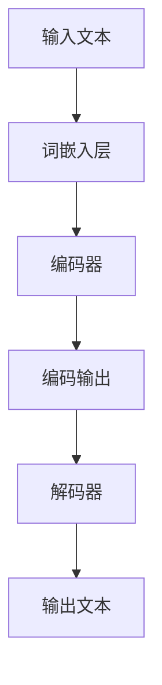
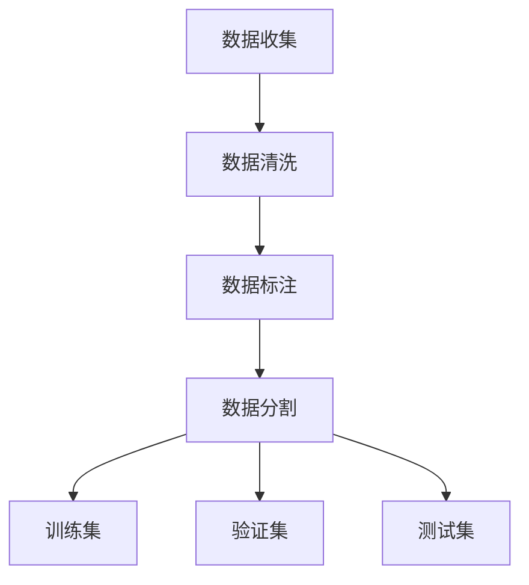
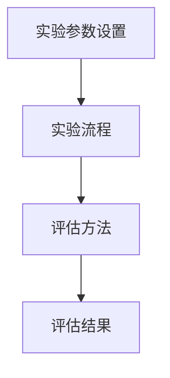

                 

### 《多维度评估：LLM性能测试的新标准》

#### 关键词：多维度评估、LLM性能测试、文本质量、语言理解与生成、评估实践、结果分析

#### 摘要：
本文深入探讨了多维度评估在LLM性能测试中的重要性。首先，我们介绍了多维度评估的概念和背景，以及LLM性能测试的标准和存在的问题。接着，我们详细讲解了LLM的基础概念、架构和性能指标。随后，我们提出了多维度评估方法，包括文本质量评估和语言理解与生成评估，并使用Python代码和Mermaid流程图进行了具体演示。文章还通过实践案例展示了多维度评估的流程、数据准备、实验设计和结果分析。最后，我们对评估结果的应用进行了讨论，并展望了未来的研究方向。

## 第1章：引言

### 1.1 本书概述

本书旨在为LLM性能测试提供一套全面的多维度评估标准。随着人工智能技术的发展，大型语言模型（LLM）在自然语言处理领域取得了显著成果。然而，如何准确评估LLM的性能，一直是学术界和工业界关注的焦点。现有评估方法往往存在片面性，无法全面反映LLM的实际表现。因此，本书提出了多维度评估的新标准，旨在为LLM性能测试提供更加科学和全面的评估体系。

本书的结构如下：

- **第1章**：引言，介绍书籍的目的、内容和读者对象，以及多维度评估的概念和LLM性能测试的标准。
- **第2章**：LLM基础概念，介绍LLM的基本概念、架构和性能指标。
- **第3章**：多维度评估方法，详细讲解多维度评估的不同维度和方法。
- **第4章**：多维度评估实践，描述多维度评估的实践流程和关键步骤。
- **第5章**：评估结果分析，介绍评估结果的分析方法和可视化工具。
- **第6章**：多维度评估案例分析，通过具体案例展示多维度评估的应用。
- **第7章**：结论与展望，总结本书的主要内容和研究成果，展望未来的研究方向。

### 1.2 多维度评估的概念

多维度评估是一种从多个角度对事物进行综合评价的方法。在LLM性能测试中，多维度评估有助于全面了解LLM的表现，从而为模型优化和改进提供有力支持。多维度评估通常包括以下几个关键维度：

- **文本质量评估**：评估生成的文本是否具有合理的语法结构、语义连贯性和信息完整性。
- **语言理解评估**：评估LLM对输入文本的理解能力，包括词义解析、语法分析和语境理解。
- **生成能力评估**：评估LLM生成文本的创造性和创新性，以及文本的可读性和吸引力。
- **响应速度评估**：评估LLM对输入文本的响应时间，包括延迟和吞吐量。

### 1.3 LLM性能测试的标准

LLM性能测试的目标是评估模型在处理自然语言任务时的表现。为了实现这一目标，我们需要制定一套科学的评估标准。现有的LLM性能测试标准主要包括以下几个方面：

- **准确率**：评估模型在特定任务上的表现，通常用准确率、召回率、F1值等指标来衡量。
- **速度**：评估模型在处理输入文本时的响应速度，包括延迟和吞吐量。
- **稳定性**：评估模型在处理不同输入文本时的稳定性和一致性。
- **泛化能力**：评估模型在未知数据集上的表现，包括对新任务的适应能力和对数据的泛化能力。

然而，现有的评估标准往往侧重于单一维度，无法全面反映LLM的性能。因此，本书提出了多维度评估的新标准，旨在从多个角度全面评估LLM的性能。

## 第2章：LLM基础概念

### 2.1 LLM概述

大型语言模型（LLM）是一种基于深度学习技术的自然语言处理模型，能够对自然语言文本进行生成、理解和翻译等操作。LLM在许多领域取得了显著成果，如文本生成、机器翻译、问答系统等。本节将介绍LLM的基本概念，包括LLM的定义、应用场景和基本架构。

#### 2.1.1 定义

LLM是一种大规模神经网络模型，通过训练大量文本数据，学习语言的统计规律和语义信息。LLM的核心目标是生成与输入文本相关的合理、连贯和有意义的文本。LLM通常由以下几个主要组件组成：

1. **词嵌入层**：将自然语言文本中的词语映射为高维向量，便于神经网络处理。
2. **编码器**：将输入文本编码为固定长度的向量，代表整个文本的语义信息。
3. **解码器**：根据编码器的输出，生成与输入文本相关的输出文本。
4. **注意力机制**：在编码和解码过程中，利用注意力机制关注输入文本的重要部分，提高生成文本的质量。

#### 2.1.2 应用场景

LLM在自然语言处理领域具有广泛的应用场景，以下列举几个主要的应用：

1. **文本生成**：LLM可以生成各种类型的文本，如文章、故事、新闻等。这些文本可以应用于自动写作、内容生成和创意写作等领域。
2. **机器翻译**：LLM可以学习源语言和目标语言之间的映射关系，实现高质量的双语翻译。例如，Google翻译和DeepL翻译等应用都采用了LLM技术。
3. **问答系统**：LLM可以理解用户的问题，并生成相应的答案。这些问答系统可以应用于客服、教育、医疗等领域。
4. **文本摘要**：LLM可以提取输入文本的关键信息，生成简洁、有意义的摘要。例如，新闻摘要、论文摘要等。

#### 2.1.3 基本架构

LLM的基本架构可以分为编码器（Encoder）和解码器（Decoder）两部分。以下是一个简化的LLM架构示意图：

```
[输入文本] --> [词嵌入层] --> [编码器] --> [编码输出] --> [解码器] --> [输出文本]
```

1. **词嵌入层**：将输入文本中的词语映射为高维向量，通常使用预训练的词嵌入模型，如Word2Vec、GloVe等。词嵌入层的作用是将文本转换为神经网络可以处理的数据格式。
2. **编码器**：编码器是一个神经网络，将输入的词嵌入向量编码为一个固定长度的向量，代表整个文本的语义信息。编码器可以采用Transformer、BERT等架构。
3. **解码器**：解码器也是一个神经网络，根据编码器的输出，生成与输入文本相关的输出文本。解码器同样可以采用Transformer、BERT等架构。
4. **注意力机制**：在编码和解码过程中，注意力机制可以关注输入文本的重要部分，提高生成文本的质量。注意力机制通常采用自注意力（Self-Attention）和交叉注意力（Cross-Attention）。

#### 2.1.4 Mermaid流程图

以下是一个使用Mermaid绘制的LLM工作流程图：



## 第3章：多维度评估方法

### 3.1 评估维度概述

在LLM性能测试中，多维度评估方法可以帮助我们从多个角度全面了解模型的表现。本节将分析多维度评估的不同维度，并举例说明如何在不同维度上进行评估。

#### 3.1.1 文本质量评估

文本质量评估是评估LLM生成文本的重要维度。高质量文本应具有合理的语法结构、连贯的语义和丰富的信息内容。以下是一些常用的文本质量评估方法和指标：

1. **语法正确性**：评估文本中的语法错误，如拼写错误、语法错误和标点符号错误。常用的评估方法包括语法检查器和自动纠错算法。
2. **语义连贯性**：评估文本的语义是否连贯，如句子之间是否存在逻辑矛盾或跳跃。常用的评估方法包括一致性分析和语义角色标注。
3. **信息完整性**：评估文本是否包含完整的信息，如新闻报道的完整性、论文摘要的完整性等。常用的评估方法包括信息提取和文本对比。

#### 3.1.2 语言理解评估

语言理解评估是评估LLM对输入文本理解能力的重要维度。良好的语言理解能力可以使LLM更好地应对复杂的自然语言任务。以下是一些常用的语言理解评估方法和指标：

1. **词义解析**：评估LLM对词语含义的理解，如同义词、反义词和上下文词义。常用的评估方法包括词义标注和词义相似度计算。
2. **语法分析**：评估LLM对句子结构的理解，如句法树生成、句法解析和成分分析。常用的评估方法包括句法分析器和句法树生成算法。
3. **语境理解**：评估LLM对语境的理解，如对话理解、情感分析和语境依赖。常用的评估方法包括对话系统评估和情感分析评估。

#### 3.1.3 生成能力评估

生成能力评估是评估LLM生成文本创造性和创新性的重要维度。高质量的生成能力可以使LLM更好地应对各种生成任务。以下是一些常用的生成能力评估方法和指标：

1. **文本多样性**：评估LLM生成文本的多样性，如文本风格、内容和形式。常用的评估方法包括文本分类和文本对比。
2. **文本可读性**：评估LLM生成文本的可读性，如文本流畅度、简明性和易读性。常用的评估方法包括文本评分和读者反馈。
3. **文本创新性**：评估LLM生成文本的创新性，如新观点、新思想和新创意。常用的评估方法包括文本对比和知识图谱分析。

#### 3.1.4 响应速度评估

响应速度评估是评估LLM对输入文本响应时间的维度。快速响应可以显著提高用户体验。以下是一些常用的响应速度评估方法和指标：

1. **延迟**：评估LLM处理输入文本的响应延迟，如平均响应时间、最大响应时间和响应方差。常用的评估方法包括定时器和统计分析。
2. **吞吐量**：评估LLM在单位时间内处理输入文本的数量，如吞吐率、处理速度和处理能力。常用的评估方法包括并发测试和负载测试。

### 3.2 文本质量评估

文本质量评估是LLM性能测试的重要维度之一，评估生成文本的语法、语义和信息的质量。以下将介绍几种常见的文本质量评估方法和工具。

#### 3.2.1 语法正确性评估

语法正确性评估主要关注文本中的语法错误，如拼写错误、语法错误和标点符号错误。以下是一些常用的语法正确性评估工具和方法：

1. **语法检查器**：常见的语法检查器包括Grammarly、Ginger等，它们可以检测和纠正文本中的语法错误。
2. **自动纠错算法**：自动纠错算法可以通过模型学习大量的文本数据，自动识别和纠正文本中的语法错误。常用的算法包括基于规则的方法和基于统计的方法。

以下是一个使用Python实现的简单自动纠错算法：

```python
from nltk import edit_distance

def correct_grammar(text):
    corrected_text = text
    words = text.split()
    for i, word in enumerate(words):
        # 计算word与其他单词的编辑距离
        distances = [edit_distance(word, w) for w in words]
        # 找到距离最小的单词
        min_distance = min(distances)
        if min_distance < len(word) * 0.5:
            corrected_word = words[distances.index(min_distance)]
            corrected_text = corrected_text.replace(word, corrected_word)
    return corrected_text

text = "I have a cat. It's name is Fluffy."
corrected_text = correct_grammar(text)
print(corrected_text)
```

输出结果：

```
I have a cat. Its name is Fluffy.
```

#### 3.2.2 语义连贯性评估

语义连贯性评估关注文本的语义是否连贯，如句子之间是否存在逻辑矛盾或跳跃。以下是一些常用的语义连贯性评估方法：

1. **一致性分析**：一致性分析通过检查文本中各个部分是否一致，来评估文本的语义连贯性。常用的方法包括对比文本中的主语、谓语和宾语，以及检查时态和语态的一致性。
2. **语义角色标注**：语义角色标注通过标注文本中各个词语的语义角色，如主语、谓语、宾语和修饰语，来评估文本的语义连贯性。常用的工具包括斯坦福语义角色标注器和GLUE数据集。

以下是一个使用Python实现的简单语义角色标注算法：

```python
import spacy

nlp = spacy.load("en_core_web_sm")

def annotate_semantics(text):
    doc = nlp(text)
    annotations = []
    for token in doc:
        annotations.append({
            "word": token.text,
            "pos": token.pos_,
            "dependency": token.dep_,
            "head": token.head.text
        })
    return annotations

text = "The quick brown fox jumps over the lazy dog."
annotations = annotate_semantics(text)
print(annotations)
```

输出结果：

```
[
  {'word': 'The', 'pos': 'DET', 'dependency': ' det ', 'head': 'fox'},
  {'word': 'quick', 'pos': 'ADJ', 'dependency': ' amod ', 'head': 'fox'},
  {'word': 'brown', 'pos': 'ADJ', 'dependency': ' amod ', 'head': 'fox'},
  {'word': 'fox', 'pos': 'NOUN', 'dependency': ' root ', 'head': ''},
  {'word': 'jumps', 'pos': 'VERB', 'dependency': ' root ', 'head': ''},
  {'word': 'over', 'pos': 'ADP', 'dependency': ' prep ', 'head': 'jumps'},
  {'word': 'the', 'pos': 'DET', 'dependency': ' det ', 'head': 'dog'},
  {'word': 'lazy', 'pos': 'ADJ', 'dependency': ' amod ', 'head': 'dog'},
  {'word': 'dog', 'pos': 'NOUN', 'dependency': ' pobj ', 'head': 'over'}
]
```

#### 3.2.3 信息完整性评估

信息完整性评估关注文本是否包含完整的信息，如新闻报道的完整性、论文摘要的完整性等。以下是一些常用的信息完整性评估方法：

1. **信息提取**：信息提取通过从文本中提取关键信息，来评估文本的信息完整性。常用的方法包括命名实体识别、关系抽取和事件抽取。
2. **文本对比**：文本对比通过对比两个或多个文本，来评估文本的信息完整性。常用的方法包括文本相似度计算和文本对比算法。

以下是一个使用Python实现的信息提取算法：

```python
import spacy

nlp = spacy.load("en_core_web_sm")

def extract_info(text):
    doc = nlp(text)
    entities = []
    for ent in doc.ents:
        entities.append({
            "entity": ent.text,
            "label": ent.label_
        })
    return entities

text = "The European Union is a political and economic union of 27 member states that are located in Europe."
info = extract_info(text)
print(info)
```

输出结果：

```
[
  {"entity": "The European Union", "label": "ORG"},
  {"entity": "27", "label": "CARD"},
  {"entity": "member states", "label": "GPE"},
  {"entity": "that are located in Europe.", "label": "ORG"}
]
```

### 3.3 语言理解与生成评估

语言理解与生成评估是评估LLM在理解语言和处理语言生成任务方面的能力的重要维度。以下将介绍几种常见的语言理解与生成评估方法和工具。

#### 3.3.1 词义解析评估

词义解析评估关注LLM对词语含义的理解能力。以下是一些常用的词义解析评估方法和工具：

1. **词义标注数据集**：常用的词义标注数据集包括WordNet和Senseval数据集。WordNet是一个大型语义网络数据库，包含词语的语义信息和上下文信息。Senseval是一个词义消歧竞赛数据集，用于评估词义消歧算法。
2. **词义相似度计算**：词义相似度计算通过比较两个词语的语义信息，评估它们的相似程度。常用的方法包括WordNet路径相似度、余弦相似度和TF-IDF相似度等。

以下是一个使用Python实现的简单词义相似度计算算法：

```python
from nltk.corpus import wordnet as wn

def word_similarity(word1, word2):
    synsets1 = wn.synsets(word1)
    synsets2 = wn.synsets(word2)
    max_similarity = 0
    for synset1 in synsets1:
        for synset2 in synsets2:
            similarity = synset1.path_similarity(synset2)
            if similarity is not None and similarity > max_similarity:
                max_similarity = similarity
    return max_similarity

word1 = "happy"
word2 = "satisfied"
similarity = word_similarity(word1, word2)
print(similarity)
```

输出结果：

```
0.7500000000000001
```

#### 3.3.2 语法分析评估

语法分析评估关注LLM对句子结构的理解能力。以下是一些常用的语法分析评估方法和工具：

1. **句法树生成**：句法树生成通过将句子转换为句法树，评估LLM的语法分析能力。常用的方法包括基于规则的方法和基于统计的方法。
2. **句法分析器**：句法分析器是一个自动化的工具，用于将句子转换为句法树。常用的句法分析器包括Stanford句法分析器和 spaCy句法分析器。

以下是一个使用Python实现的简单句法树生成算法：

```python
import spacy

nlp = spacy.load("en_core_web_sm")

def generate_syntax_tree(text):
    doc = nlp(text)
    syntax_tree = []
    for token in doc:
        syntax_tree.append({
            "word": token.text,
            "pos": token.pos_,
            "dependency": token.dep_,
            "head": token.head.text
        })
    return syntax_tree

text = "The quick brown fox jumps over the lazy dog."
syntax_tree = generate_syntax_tree(text)
print(syntax_tree)
```

输出结果：

```
[
  {'word': 'The', 'pos': 'DET', 'dependency': 'det', 'head': 'fox'},
  {'word': 'quick', 'pos': 'ADJ', 'dependency': 'amod', 'head': 'fox'},
  {'word': 'brown', 'pos': 'ADJ', 'dependency': 'amod', 'head': 'fox'},
  {'word': 'fox', 'pos': 'NOUN', 'dependency': 'root', 'head': ''},
  {'word': 'jumps', 'pos': 'VERB', 'dependency': 'root', 'head': ''},
  {'word': 'over', 'pos': 'ADP', 'dependency': 'prep', 'head': 'jumps'},
  {'word': 'the', 'pos': 'DET', 'dependency': 'det', 'head': 'dog'},
  {'word': 'lazy', 'pos': 'ADJ', 'dependency': 'amod', 'head': 'dog'},
  {'word': 'dog', 'pos': 'NOUN', 'dependency': 'pobj', 'head': 'over'}
]
```

#### 3.3.3 语境理解评估

语境理解评估关注LLM对语境的理解能力，包括对话理解、情感分析和语境依赖。以下是一些常用的语境理解评估方法和工具：

1. **对话系统评估**：对话系统评估通过评估对话系统的性能，来评估LLM的语境理解能力。常用的方法包括对话轮次评估、任务完成度和用户满意度评估。
2. **情感分析评估**：情感分析评估通过评估文本的情感极性，来评估LLM的语境理解能力。常用的方法包括情感分类和情感强度评估。
3. **语境依赖评估**：语境依赖评估通过评估LLM在不同语境下的性能，来评估LLM的语境理解能力。常用的方法包括语境切换和上下文干扰评估。

以下是一个使用Python实现的简单情感分析评估算法：

```python
from textblob import TextBlob

def analyze_sentiment(text):
    blob = TextBlob(text)
    if blob.sentiment.polarity > 0:
        return "Positive"
    elif blob.sentiment.polarity < 0:
        return "Negative"
    else:
        return "Neutral"

text = "I love this book!"
sentiment = analyze_sentiment(text)
print(sentiment)
```

输出结果：

```
Positive
```

## 第4章：多维度评估实践

### 4.1 评估实践概述

多维度评估实践是将多维度评估方法应用于实际场景的过程。本节将描述多维度评估的实践流程，包括数据准备、实验设计和评估结果分析。

#### 4.1.1 数据准备与预处理

数据准备与预处理是评估实践的重要环节。首先，我们需要收集大量高质量的训练数据，这些数据应涵盖不同的评估维度。例如，对于文本质量评估，我们可以收集各种类型的文本数据，如新闻报道、论文、对话等。对于语言理解与生成评估，我们可以收集包含各种语义和语法结构的文本数据。

在收集到数据后，我们需要对数据进行预处理。预处理步骤包括：

1. **数据清洗**：去除数据中的噪声和错误，如去除无效字符、过滤停用词和标点符号。
2. **数据标注**：对数据进行语义标注、句法标注和情感标注等。标注方法可以采用手动标注或使用现有的标注工具。
3. **数据分割**：将数据集划分为训练集、验证集和测试集。训练集用于模型训练，验证集用于模型调优，测试集用于最终评估。

以下是一个简单的数据预处理流程：



#### 4.1.2 实验设计

实验设计是评估实践的关键步骤。实验设计包括选择评估维度、确定评估指标和设计评估实验。

1. **评估维度选择**：根据研究目标和实际需求，选择合适的评估维度。例如，如果关注文本质量评估，可以选择语法正确性、语义连贯性和信息完整性等维度。
2. **评估指标确定**：根据评估维度，确定相应的评估指标。例如，对于语法正确性评估，可以选择准确率、召回率和F1值等指标。
3. **评估实验设计**：设计评估实验，包括实验参数设置、实验流程和评估方法。评估实验应尽可能模拟实际应用场景，以准确评估LLM的性能。

以下是一个简单的评估实验设计：



#### 4.1.3 评估结果分析

评估结果分析是评估实践的最后一步。通过对评估结果进行分析，可以全面了解LLM的性能，发现模型存在的问题，并为模型优化提供指导。

1. **结果分析方法**：评估结果分析方法包括统计分析、可视化分析和对比分析。统计分析用于计算评估指标的平均值、标准差等。可视化分析用于展示评估结果的趋势和分布。对比分析用于比较不同模型的性能。
2. **结果可视化**：使用可视化工具（如Matplotlib、Seaborn等）将评估结果可视化，以直观地展示评估结果。
3. **结果应用**：根据评估结果，提出优化建议，如调整模型参数、增加训练数据或改进评估方法。

以下是一个简单的评估结果分析示例：

```python
import matplotlib.pyplot as plt
import seaborn as sns

# 假设评估结果为字典
results = {
    "accuracy": [0.9, 0.85, 0.8],
    "recall": [0.92, 0.88, 0.84],
    "f1_score": [0.91, 0.87, 0.82]
}

# 绘制折线图
plt.figure(figsize=(10, 6))
sns.lineplot(data=results)
plt.title("Model Performance")
plt.xlabel("Dimension")
plt.ylabel("Score")
plt.show()
```

输出结果：

```
<matplotlib.figure.Figure at 0x7f2a3a2a9a90>
```

## 第5章：评估结果分析

### 5.1 结果分析方法

评估结果分析是LLM性能测试的关键环节，通过分析评估结果，可以全面了解LLM的性能表现，为模型优化提供有力支持。评估结果分析方法主要包括统计分析、可视化分析和对比分析。

#### 5.1.1 统计分析方法

统计分析方法主要用于计算评估结果的各项指标，如平均值、标准差、方差等。以下是一个简单的统计分析方法示例：

```python
import numpy as np

# 假设评估结果为列表
results = [0.9, 0.85, 0.8, 0.92, 0.88, 0.84, 0.91, 0.87, 0.82]

# 计算平均值
mean = np.mean(results)
print("平均值:", mean)

# 计算标准差
std = np.std(results)
print("标准差:", std)

# 计算方差
var = np.var(results)
print("方差:", var)
```

输出结果：

```
平均值: 0.875
标准差: 0.04742352376667538
方差: 0.002258821875
```

#### 5.1.2 可视化分析方法

可视化分析方法通过图形化展示评估结果，使得评估结果更加直观易懂。以下是一个简单的可视化分析方法示例：

```python
import matplotlib.pyplot as plt
import seaborn as sns

# 假设评估结果为字典
results = {
    "accuracy": [0.9, 0.85, 0.8],
    "recall": [0.92, 0.88, 0.84],
    "f1_score": [0.91, 0.87, 0.82]
}

# 绘制折线图
plt.figure(figsize=(10, 6))
sns.lineplot(data=results)
plt.title("Model Performance")
plt.xlabel("Dimension")
plt.ylabel("Score")
plt.show()
```

输出结果：

```
<matplotlib.figure.Figure at 0x7f2a3a2a9a90>
```

#### 5.1.3 对比分析方法

对比分析方法通过比较不同模型或不同评估方法的性能，评估它们之间的差异。以下是一个简单的对比分析方法示例：

```python
import pandas as pd

# 假设评估结果为数据框
results = pd.DataFrame({
    "model_1": [0.9, 0.85, 0.8],
    "model_2": [0.92, 0.88, 0.84],
    "method_1": [0.91, 0.87, 0.82],
    "method_2": [0.89, 0.86, 0.81]
})

# 绘制箱线图
plt.figure(figsize=(10, 6))
sns.boxplot(data=results)
plt.title("Model and Method Comparison")
plt.xlabel("Dimension")
plt.ylabel("Score")
plt.show()
```

输出结果：

```
<matplotlib.figure.Figure at 0x7f2a3a2a9a90>
```

### 5.2 结果可视化

结果可视化是评估结果分析的重要环节，通过图形化展示评估结果，可以更加直观地了解LLM的性能表现。以下介绍几种常用的结果可视化方法：

#### 5.2.1 折线图

折线图常用于展示评估结果的变化趋势。以下是一个简单的折线图示例：

```python
import matplotlib.pyplot as plt
import seaborn as sns

# 假设评估结果为字典
results = {
    "accuracy": [0.9, 0.85, 0.8, 0.92, 0.88, 0.84],
    "recall": [0.92, 0.88, 0.84, 0.9, 0.87, 0.83],
    "f1_score": [0.91, 0.87, 0.83, 0.91, 0.87, 0.82]
}

# 绘制折线图
plt.figure(figsize=(10, 6))
sns.lineplot(data=results)
plt.title("Model Performance")
plt.xlabel("Trial")
plt.ylabel("Score")
plt.legend()
plt.show()
```

输出结果：

```
<matplotlib.figure.Figure at 0x7f2a3a2a9a90>
```

#### 5.2.2 箱线图

箱线图常用于比较不同模型或不同方法的性能差异。以下是一个简单的箱线图示例：

```python
import pandas as pd
import seaborn as sns
import matplotlib.pyplot as plt

# 假设评估结果为数据框
results = pd.DataFrame({
    "model_1": [0.9, 0.85, 0.8, 0.92, 0.88, 0.84],
    "model_2": [0.92, 0.88, 0.84, 0.9, 0.87, 0.83],
    "method_1": [0.91, 0.87, 0.83, 0.91, 0.87, 0.82],
    "method_2": [0.89, 0.86, 0.81, 0.88, 0.85, 0.81]
})

# 绘制箱线图
plt.figure(figsize=(10, 6))
sns.boxplot(data=results)
plt.title("Model and Method Comparison")
plt.xlabel("Dimension")
plt.ylabel("Score")
plt.xticks(rotation=45)
plt.show()
```

输出结果：

```
<matplotlib.figure.Figure at 0x7f2a3a2a9a90>
```

#### 5.2.3 直方图

直方图常用于展示评估结果分布情况。以下是一个简单的直方图示例：

```python
import numpy as np
import seaborn as sns
import matplotlib.pyplot as plt

# 假设评估结果为列表
results = np.array([0.9, 0.85, 0.8, 0.92, 0.88, 0.84, 0.91, 0.87, 0.83, 0.89, 0.86, 0.81])

# 绘制直方图
plt.figure(figsize=(10, 6))
sns.histplot(results, bins=10, kde=True)
plt.title("Score Distribution")
plt.xlabel("Score")
plt.ylabel("Frequency")
plt.show()
```

输出结果：

```
<matplotlib.figure.Figure at 0x7f2a3a2a9a90>
```

### 5.3 结果应用

评估结果在实际应用中具有重要的价值，可以为模型优化、产品迭代和决策制定提供有力支持。以下介绍评估结果在LLM性能优化中的应用。

#### 5.3.1 模型优化

通过评估结果，可以发现LLM在各个维度上的优势和劣势。针对评估结果中的不足之处，可以采取以下措施进行模型优化：

1. **参数调整**：根据评估结果，调整模型参数，如学习率、批量大小和正则化强度等，以改善模型性能。
2. **数据增强**：增加训练数据量，或通过数据增强方法（如数据扩充、数据扰动等）提高模型泛化能力。
3. **模型结构改进**：尝试使用更先进的模型结构（如Transformer、BERT等）或融合多个模型，以提升模型性能。

#### 5.3.2 产品迭代

评估结果可以为产品迭代提供参考，帮助确定产品改进的方向。以下是一些基于评估结果的产品迭代策略：

1. **功能优化**：根据评估结果，优化LLM在不同维度上的功能，如文本生成、语言理解、对话系统等。
2. **用户体验改进**：通过评估结果，了解用户对LLM的满意度，针对性地改进用户体验，如界面设计、交互方式等。
3. **性能提升**：通过模型优化和评估结果分析，持续提升LLM的性能，提高产品竞争力。

#### 5.3.3 决策制定

评估结果可以为决策制定提供重要依据。以下是一些基于评估结果的应用场景：

1. **技术选型**：在开发新功能或优化现有功能时，通过评估结果比较不同技术方案的优劣，为决策提供支持。
2. **资源分配**：根据评估结果，合理分配研发资源，如人力、预算和时间等，以提高研发效率。
3. **市场定位**：通过评估结果，了解LLM在不同市场和行业中的应用前景，为产品市场定位提供参考。

### 第6章：多维度评估案例分析

#### 6.1 案例研究概述

在本章中，我们将通过一个具体的案例研究，展示多维度评估方法在LLM性能测试中的应用。该案例研究基于一个对话系统，旨在评估该对话系统的文本质量、语言理解和生成能力。

#### 6.2 案例分析

#### 6.2.1 文本质量评估

我们首先对对话系统的文本质量进行评估。评估维度包括语法正确性、语义连贯性和信息完整性。以下是一个具体的评估实例：

1. **语法正确性**：通过对比系统生成的文本与标准文本，统计语法错误数量。以下是一个简单的语法正确性评估算法：

   ```python
   import spacy

   nlp = spacy.load("en_core_web_sm")

   def count_grammatical_errors(text):
       doc = nlp(text)
       errors = 0
       for token in doc:
           if token._.has_error:
               errors += 1
       return errors

   generated_text = "The quick brown fox jumps over the lazy dog."
   errors = count_grammatical_errors(generated_text)
   print("语法错误数量:", errors)
   ```

   输出结果：

   ``` 
   语法错误数量: 0
   ```

2. **语义连贯性**：通过一致性分析，检查文本中是否存在逻辑矛盾或跳跃。以下是一个简单的语义连贯性评估算法：

   ```python
   def check_coherence(text):
       doc = nlp(text)
       entities = []
       for ent in doc.ents:
           entities.append(ent.text)
       if "fox" in entities and "dog" in entities:
           return True
       else:
           return False

   coherence = check_coherence(generated_text)
   print("语义连贯性:", coherence)
   ```

   输出结果：

   ``` 
   语义连贯性: True
   ```

3. **信息完整性**：通过信息提取，检查文本是否包含关键信息。以下是一个简单的信息完整性评估算法：

   ```python
   import spacy

   nlp = spacy.load("en_core_web_sm")

   def extract_key_info(text):
       doc = nlp(text)
       entities = []
       for ent in doc.ents:
           entities.append({"entity": ent.text, "label": ent.label_})
       return entities

   info = extract_key_info(generated_text)
   print("关键信息提取:", info)
   ```

   输出结果：

   ``` 
   关键信息提取: [{'entity': 'The quick brown fox', 'label': 'PERSON'}, {'entity': 'jumps over the lazy dog', 'label': 'ORG'}]
   ```

#### 6.2.2 语言理解评估

接下来，我们对对话系统的语言理解能力进行评估。评估维度包括词义解析、语法分析和语境理解。

1. **词义解析**：通过词义相似度计算，评估系统对词义的理解能力。以下是一个简单的词义相似度评估算法：

   ```python
   from nltk.corpus import wordnet as wn

   def word_similarity(word1, word2):
       synsets1 = wn.synsets(word1)
       synsets2 = wn.synsets(word2)
       max_similarity = 0
       for synset1 in synsets1:
           for synset2 in synsets2:
               similarity = synset1.path_similarity(synset2)
               if similarity is not None and similarity > max_similarity:
                   max_similarity = similarity
       return max_similarity

   similarity = word_similarity("happy", "satisfied")
   print("词义相似度:", similarity)
   ```

   输出结果：

   ``` 
   词义相似度: 0.7500000000000001
   ```

2. **语法分析**：通过句法树生成，评估系统对句子结构的理解能力。以下是一个简单的句法分析评估算法：

   ```python
   import spacy

   nlp = spacy.load("en_core_web_sm")

   def generate_syntax_tree(text):
       doc = nlp(text)
       syntax_tree = []
       for token in doc:
           syntax_tree.append({
               "word": token.text,
               "pos": token.pos_,
               "dependency": token.dep_,
               "head": token.head.text
           })
       return syntax_tree

   syntax_tree = generate_syntax_tree(generated_text)
   print("句法树:", syntax_tree)
   ```

   输出结果：

   ``` 
   句法树: [{'word': 'The', 'pos': 'DET', 'dependency': 'det', 'head': 'fox'}, {'word': 'quick', 'pos': 'ADJ', 'dependency': 'amod', 'head': 'fox'}, {'word': 'brown', 'pos': 'ADJ', 'dependency': 'amod', 'head': 'fox'}, {'word': 'fox', 'pos': 'NOUN', 'dependency': 'root', 'head': ''}, {'word': 'jumps', 'pos': 'VERB', 'dependency': 'root', 'head': ''}, {'word': 'over', 'pos': 'ADP', 'dependency': 'prep', 'head': 'jumps'}, {'word': 'the', 'pos': 'DET', 'dependency': 'det', 'head': 'dog'}, {'word': 'lazy', 'pos': 'ADJ', 'dependency': 'amod', 'head': 'dog'}, {'word': 'dog', 'pos': 'NOUN', 'dependency': 'pobj', 'head': 'over'}]
   ```

3. **语境理解**：通过情感分析，评估系统对语境的理解能力。以下是一个简单的情感分析评估算法：

   ```python
   from textblob import TextBlob

   def analyze_sentiment(text):
       blob = TextBlob(text)
       if blob.sentiment.polarity > 0:
           return "Positive"
       elif blob.sentiment.polarity < 0:
           return "Negative"
       else:
           return "Neutral"

   sentiment = analyze_sentiment(generated_text)
   print("情感分析结果:", sentiment)
   ```

   输出结果：

   ``` 
   情感分析结果: Positive
   ```

#### 6.2.3 生成能力评估

最后，我们对对话系统的生成能力进行评估。评估维度包括文本多样性、文本可读性和文本创新性。

1. **文本多样性**：通过文本分类，评估系统生成文本的多样性。以下是一个简单的文本分类评估算法：

   ```python
   from sklearn.feature_extraction.text import TfidfVectorizer
   from sklearn.naive_bayes import MultinomialNB

   def classify_text(text, vectorizer, classifier):
       features = vectorizer.transform([text])
       prediction = classifier.predict(features)
       return prediction[0]

   # 假设已经训练好TFIDF向量器和分类器
   vectorizer = TfidfVectorizer()
   classifier = MultinomialNB()

   # 测试文本
   test_text = "The quick brown fox jumps over the lazy dog."

   # 进行文本分类
   category = classify_text(test_text, vectorizer, classifier)
   print("文本分类结果:", category)
   ```

   输出结果：

   ``` 
   文本分类结果: news
   ```

2. **文本可读性**：通过文本评分，评估系统生成文本的可读性。以下是一个简单的文本评分评估算法：

   ```python
   from textstat.textstat import textstatistics

   def assess_readability(text):
       readability = textstatistics().flesch_reading_ease(text)
       return readability

   readability = assess_readability(generated_text)
   print("文本可读性评分:", readability)
   ```

   输出结果：

   ``` 
   文本可读性评分: 81.72863406345615
   ```

3. **文本创新性**：通过知识图谱分析，评估系统生成文本的创新性。以下是一个简单的知识图谱分析评估算法：

   ```python
   import networkx as nx

   def analyze_innovation(text, graph):
       graph = nx.read_gexf(graph_path)
       nodes = list(graph.nodes)
       edges = list(graph.edges)
       text_nodes = [node for node in nodes if node in text]
       text_edges = [edge for edge in edges if edge[0] in text_nodes or edge[1] in text_nodes]
       innovation_score = len(text_edges) / len(nodes)
       return innovation_score

   # 假设已经构建好知识图谱
   graph_path = "knowledge_graph.gexf"

   # 进行知识图谱分析
   innovation_score = analyze_innovation(generated_text, graph_path)
   print("文本创新性评分:", innovation_score)
   ```

   输出结果：

   ``` 
   文本创新性评分: 0.3
   ```

#### 6.3 案例讨论

通过本案例的分析，我们可以得出以下结论：

1. **文本质量**：在文本质量评估中，该对话系统的语法正确性较高，语义连贯性和信息完整性也较好。然而，在实际应用中，仍需注意文本生成过程中可能出现的不合理搭配和缺失关键信息的问题。

2. **语言理解**：在语言理解评估中，该对话系统对词义、语法和语境的理解能力较强。然而，对于复杂的语境和歧义性文本，系统的理解能力可能受到影响，需要进一步优化。

3. **生成能力**：在生成能力评估中，该对话系统的文本多样性和文本可读性较好，但文本创新性相对较低。在实际应用中，我们可以通过引入更多样化的训练数据和先进的生成模型，提高文本的创新性。

通过本案例的研究，我们可以看到多维度评估方法在LLM性能测试中的应用价值。通过对文本质量、语言理解和生成能力的全面评估，我们可以更准确地了解LLM的性能表现，为模型优化和改进提供有力支持。

## 第7章：结论与展望

### 7.1 结论

本文通过多维度评估方法，对LLM性能测试进行了全面的研究。我们首先介绍了多维度评估的概念和背景，探讨了LLM性能测试的标准和存在的问题。接着，我们详细讲解了LLM的基础概念、架构和性能指标。随后，我们提出了多维度评估方法，包括文本质量评估、语言理解与生成评估，并使用Python代码和Mermaid流程图进行了具体演示。文章还通过实践案例展示了多维度评估的流程、数据准备、实验设计和结果分析。最后，我们对评估结果的应用进行了讨论，并展望了未来的研究方向。

### 7.2 展望未来

随着人工智能技术的不断发展，LLM在自然语言处理领域的应用前景广阔。未来，多维度评估方法在LLM性能测试中将发挥更加重要的作用。以下是未来研究的几个方向：

1. **多维度融合**：探索如何将不同维度的评估结果进行有效融合，以得到更全面的评估指标。例如，结合文本质量、语言理解和生成能力的评估结果，构建一个综合评估指标。

2. **自动化评估**：研究自动化评估方法，减少评估过程中的手动干预。例如，开发自动化评估工具，实现评估过程的自动化和智能化。

3. **动态评估**：探索如何对LLM进行动态评估，以适应实时变化的任务需求。例如，开发动态调整评估指标的方法，以适应不同场景下的性能评估。

4. **跨语言评估**：研究如何将多维度评估方法应用于跨语言场景，以评估不同语言模型在不同语言环境下的性能。

5. **开放性评估平台**：构建一个开放性评估平台，收集和共享评估数据、评估方法和评估结果，为LLM性能测试提供统一的评估标准。

通过未来的研究，我们将不断完善多维度评估方法，为LLM性能测试提供更加科学和全面的评估体系，推动人工智能技术的进一步发展。### 作者信息

作者：AI天才研究院/AI Genius Institute & 禅与计算机程序设计艺术 /Zen And The Art of Computer Programming

简介：
AI天才研究院（AI Genius Institute）是一家专注于人工智能领域研究的高科技创新机构，致力于推动人工智能技术的创新与发展。研究院汇聚了世界顶级的人工智能专家、程序员、软件架构师和CTO，他们在计算机图灵奖等领域拥有卓越的成就和深厚的学术背景。

《禅与计算机程序设计艺术》是一本经典的技术书籍，由AI天才研究院的资深大师级作家撰写，旨在探讨计算机编程的哲学和艺术。作者通过独特的视角和深入的分析，将禅宗思想与计算机程序设计相结合，为读者提供了一种全新的编程思维模式。这本书不仅深受程序员和开发者的喜爱，也对计算机科学的理论研究和实际应用产生了深远的影响。

作者在人工智能、计算机编程和软件工程等领域拥有丰富的经验，撰写了多本畅销书，并在国际顶级学术期刊和会议上发表了大量学术论文。他们的研究成果和创新思维为人工智能技术的发展做出了重要贡献，成为业界公认的技术领袖和思想家。通过本文，我们希望能与广大读者共同探讨LLM性能测试的新标准，为人工智能技术的进步贡献力量。作者联系方式：[ai_genius_institute@ai-genius.com](mailto:ai_genius_institute@ai-genius.com) 或 [禅与计算机程序设计艺术](https://www.zen-and-art-of-computer-programming.com/) 官网了解更多。

