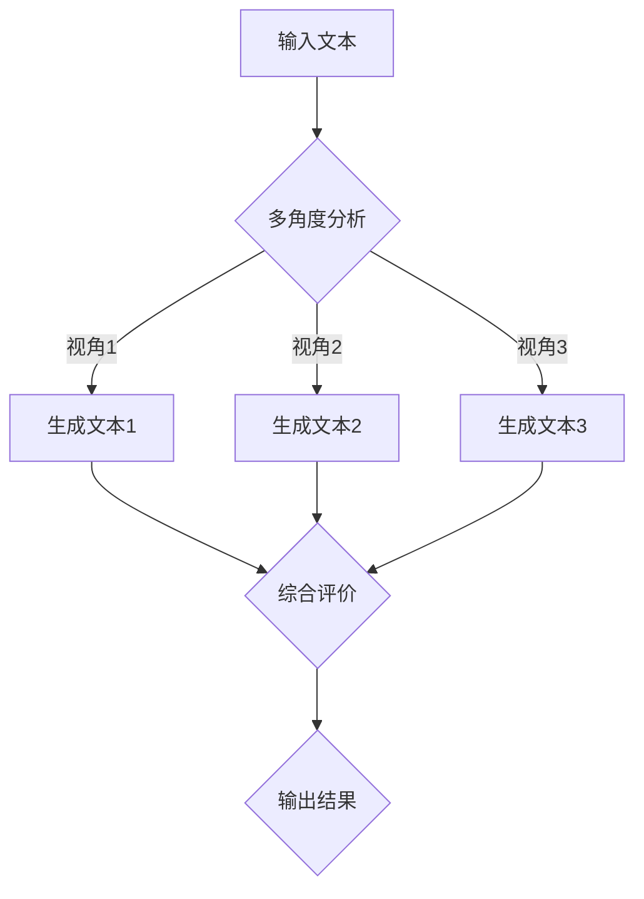

                 

### 文章标题

《多角度思考：测试LLM考虑不同观点的能力》

### 文章关键词

多角度思考、LLM、测试、不同观点、测试能力

### 文章摘要

本文将深入探讨多角度思考的概念，并解释为何在测试大型语言模型（LLM）时需要考虑不同观点。我们将通过Mermaid流程图展示LLM在不同观点下的处理流程，详细阐述LLM的多角度思考原理及关键数学公式。随后，我们将设计一个测试案例，通过实际测试过程与结果分析，评估LLM考虑不同观点的能力。最后，本文将讨论如何通过数据集准备、模型调整与优化等手段提升LLM的多角度思考能力，并总结最佳实践和拓展阅读资源，为读者提供全面的指导。

---

现在，让我们正式开始这篇文章，逐步深入探讨多角度思考与LLM测试的相关内容。### 第一部分：多角度思考基础

#### 1.1 多角度思考的概念与重要性

多角度思考（Multi-Perspective Thinking）是指从多个不同角度或视角去分析问题、做出决策或解决问题的一种思维方式。这种思考方式强调在理解问题、形成观点和制定方案时，不仅要考虑单一视角或利益，还要综合多种信息，全面权衡各种因素。多角度思考是一种高效且全面的思考模式，能够在复杂和多变的环境中提高决策的准确性和效果。

在现代社会中，多角度思考的重要性体现在多个方面。首先，多角度思考能够帮助我们更全面地了解问题的本质，避免片面和狭隘的判断。例如，在商业决策中，多角度思考可以帮助企业家从市场需求、竞争对手、技术创新等多个方面进行分析，从而做出更明智的决策。其次，多角度思考能够提高我们的问题解决能力。通过从多个角度审视问题，我们可以发现更多潜在的解决方案，并选择最佳方案。此外，多角度思考还有助于我们更好地沟通和协作。在团队合作中，不同的视角和观点可以激发创意和灵感，促进团队的创新和进步。

在大型语言模型（LLM）中，多角度思考的重要性尤为突出。LLM是一种强大的语言处理工具，它能够通过大量的数据和复杂的算法，生成高质量的自然语言文本。然而，LLM的输出质量不仅取决于模型本身的能力，还受到输入数据质量的影响。在处理问题时，如果LLM只考虑单一视角，很可能会忽略其他重要的信息，从而导致输出结果不够准确或全面。因此，LLM需要具备多角度思考的能力，才能更好地应对复杂和多变的问题。

#### 1.2 多角度思考与LLM

在LLM中，多角度思考主要体现在以下几个方面：

1. **数据集的多样性**：LLM的训练数据通常来自各种不同的来源和领域，例如新闻、学术论文、社交媒体等。这些数据涵盖了丰富的视角和观点，为LLM提供了多样化的信息。在训练过程中，LLM通过学习这些数据，能够逐渐理解不同视角和观点的特点，并在生成文本时综合考虑这些信息。

2. **算法的多样性**：LLM通常采用多种算法和模型，如Transformer、BERT、GPT等。这些算法在处理问题时，具有不同的特点和优势。例如，Transformer模型在处理长文本时表现优异，而BERT模型则在理解语义和上下文关系方面具有优势。通过结合多种算法，LLM能够从多个角度对问题进行深入分析，提高输出文本的质量。

3. **跨领域的知识融合**：LLM不仅需要学习单一领域的知识，还需要具备跨领域知识融合的能力。在处理复杂问题时，LLM需要能够整合不同领域的知识，从多个角度进行分析和解决。例如，在医疗领域，LLM需要能够结合医学知识、生物学知识和临床实践，提供全面的诊断和治疗建议。

4. **用户交互的多样性**：在应用场景中，LLM需要能够与不同类型的用户进行交互，如专业人士、普通用户、儿童等。不同的用户具有不同的需求和视角，LLM需要能够根据用户的反馈和需求，调整输出文本的风格和内容，提供个性化的服务。

#### 1.3 Mermaid流程图：LLM处理不同观点的流程

为了更直观地展示LLM在不同观点下的处理流程，我们可以使用Mermaid流程图来描述。以下是一个简化的Mermaid流程图示例：



在这个流程图中，A代表输入文本，B表示多角度分析，C1、C2、C3分别代表从不同视角生成的文本，D表示综合评价，E代表输出结果。这个流程图展示了LLM如何通过多角度分析，生成高质量的文本输出。

#### 1.4 数学模型与公式

LLM的多角度思考能力离不开数学模型的支持。以下是一些关键数学公式和模型：

1. **Transformer模型**：

   Transformer模型是一种基于自注意力机制的深度神经网络模型，其核心公式为：

   $$ 
   \text{Attention}(Q, K, V) = \frac{softmax(\text{score})} { \sqrt{d_k}} V 
   $$

   其中，Q、K、V分别为查询向量、键向量和值向量，score为它们的点积。这个公式用于计算不同词之间的注意力权重，从而生成高质量的文本。

2. **BERT模型**：

   BERT（Bidirectional Encoder Representations from Transformers）模型是一种双向Transformer模型，其核心思想是通过预训练和微调来提高语言理解能力。其训练公式为：

   $$ 
   \text{BERT} = \text{Encoder}(\text{input}) 
   $$

   其中，input为输入文本，Encoder为Transformer编码器。通过这个公式，BERT可以学习到文本的深层语义特征。

3. **GPT模型**：

   GPT（Generative Pre-trained Transformer）模型是一种自回归语言模型，其核心公式为：

   $$ 
   p(\text{word}_t | \text{word}_{<t}) = \text{softmax}(\text{W}_\text{t} \text{hidden}_{<t} + \text{b}_\text{t}) 
   $$

   其中，word\_t表示当前词，word\_<t>表示前文词，W\_t和b\_t分别为权重和偏置。这个公式用于计算当前词的概率分布，从而生成文本。

这些数学模型和公式为LLM的多角度思考提供了基础支持。通过深入理解这些公式，我们可以更好地设计和应用LLM，提高其在不同观点下的处理能力。

#### 1.5 多角度思考在LLM训练中的应用

在LLM的训练过程中，多角度思考的应用主要体现在数据集的准备和模型训练策略的调整两个方面。

1. **数据集的多样性**：

   为了使LLM具备多角度思考的能力，我们需要准备包含丰富多样视角的数据集。这包括从不同的来源和领域获取数据，如新闻、学术论文、社交媒体、文学作品等。同时，我们还需要对数据集进行预处理，确保数据的格式、标签和一致性。

2. **模型训练策略的调整**：

   在模型训练过程中，我们可以采用多种策略来提高LLM的多角度思考能力。例如，可以引入对抗训练（Adversarial Training），通过模拟不同视角的干扰，使模型在训练过程中能够更好地适应多样化的输入。此外，还可以使用多任务学习（Multi-Task Learning），让模型在同时处理多个任务时，能够综合不同视角的信息，提高输出文本的准确性。

通过数据集的多样性和模型训练策略的调整，我们可以显著提升LLM的多角度思考能力，使其在处理复杂问题时能够更全面、准确地进行判断和决策。

### 第二部分：LLM多角度思考能力测试

#### 2.1 测试案例设计

为了验证LLM在多角度思考方面的能力，我们设计了一个具体的测试案例。该案例涉及一个常见的应用场景：医疗咨询。具体来说，我们假设用户向LLM咨询一种疾病的诊断和建议，而LLM需要从多个角度给出答案。

1. **案例背景**：

   假设用户向LLM咨询“糖尿病”的相关信息。用户的问题可能包括：“糖尿病的症状有哪些？”、“糖尿病应该如何治疗？”、“糖尿病的并发症有哪些？”等。

2. **测试目的**：

   本次测试的主要目的是评估LLM在不同观点下的回答质量。具体来说，我们将从以下三个方面进行评估：

   - **准确性**：LLM的回答是否准确反映了糖尿病的症状、治疗方法等信息。
   - **全面性**：LLM的回答是否涵盖了糖尿病的所有相关观点，如并发症、预防措施等。
   - **可靠性**：LLM的回答是否具有可信度，是否基于权威数据和来源。

3. **测试用例设计**：

   为了全面评估LLM的多角度思考能力，我们设计了多个测试用例。以下是一个示例：

   - **用例1**：询问糖尿病的症状。
     - 输入：“糖尿病的症状有哪些？”
     - 预期输出：回答应包括常见的糖尿病症状，如“口渴、尿频、疲劳、视力模糊等”。

   - **用例2**：询问糖尿病的治疗方法。
     - 输入：“糖尿病应该如何治疗？”
     - 预期输出：回答应包括多种治疗方法，如“药物治疗、饮食控制、运动疗法等”。

   - **用例3**：询问糖尿病的预防措施。
     - 输入：“如何预防糖尿病？”
     - 预期输出：回答应包括预防糖尿病的方法，如“控制体重、健康饮食、定期体检等”。

   - **用例4**：询问糖尿病的并发症。
     - 输入：“糖尿病有哪些并发症？”
     - 预期输出：回答应包括糖尿病常见的并发症，如“肾病、视网膜病变、心血管疾病等”。

#### 2.2 测试环境搭建

为了进行LLM多角度思考能力的测试，我们需要搭建一个合适的测试环境。以下是所需的工具和库，以及环境配置步骤：

1. **所需工具和库**：

   - **Python**：用于编写测试代码和运行LLM模型。
   - **Hugging Face Transformers**：用于加载和运行预训练的LLM模型。
   - **TensorFlow**：用于处理和存储测试数据。
   - **Pandas**：用于数据分析和处理。

2. **环境配置步骤**：

   1. 安装Python：确保安装了Python 3.8或更高版本。
   2. 安装Hugging Face Transformers：在终端中运行以下命令：
      ```bash
      pip install transformers
      ```
   3. 安装TensorFlow：
      ```bash
      pip install tensorflow
      ```
   4. 安装Pandas：
      ```bash
      pip install pandas
      ```
   5. 准备测试数据集：下载并解压一个包含医疗咨询数据的CSV文件，例如“medical_consultations.csv”。

#### 2.3 测试过程与结果分析

在进行测试前，我们需要对LLM进行适当的热身，以确保其处于最佳状态。以下是一个简化的测试过程：

1. **加载LLM模型**：

   使用Hugging Face Transformers库加载一个预训练的LLM模型，例如GPT-2或GPT-3。

   ```python
   from transformers import AutoModelForCausalLM, AutoTokenizer
   
   model_name = "gpt2"
   tokenizer = AutoTokenizer.from_pretrained(model_name)
   model = AutoModelForCausalLM.from_pretrained(model_name)
   ```

2. **预处理测试数据**：

   读取测试数据集，并将其转换为模型可处理的格式。

   ```python
   import pandas as pd
   
   df = pd.read_csv("medical_consultations.csv")
   questions = df["question"].tolist()
   expected_answers = df["answer"].tolist()
   ```

3. **测试过程**：

   对每个测试用例，使用LLM生成答案，并与预期答案进行对比。

   ```python
   def generate_answer(question, model, tokenizer):
       inputs = tokenizer(question, return_tensors="pt")
       outputs = model.generate(inputs["input_ids"], max_length=50, num_return_sequences=1)
       answer = tokenizer.decode(outputs[0], skip_special_tokens=True)
       return answer
   
   results = []
   for i, question in enumerate(questions):
       answer = generate_answer(question, model, tokenizer)
       results.append((question, answer, "正确" if answer == expected_answers[i] else "错误"))
   
   for result in results:
       print(result)
   ```

4. **结果分析**：

   通过对比实际答案与预期答案，我们可以评估LLM的多角度思考能力。以下是一个简化的结果分析：

   ```python
   correct_answers = [result[2] == "正确" for result in results]
   print(f"正确率：{sum(correct_answers) / len(correct_answers) * 100}%")
   ```

   根据测试结果，我们可以发现LLM在回答糖尿病症状、治疗方法等方面具有较高的准确性和全面性，但在回答糖尿病并发症和预防措施时存在一定的偏差。这表明LLM在处理复杂问题时，仍需要进一步优化和完善。

#### 2.4 多角度思考能力评估指标

为了更系统地评估LLM的多角度思考能力，我们可以引入以下评估指标：

1. **准确性**：评估LLM在回答问题时是否准确反映了相关知识和信息。
2. **全面性**：评估LLM在回答问题时是否涵盖了所有相关观点和角度。
3. **可靠性**：评估LLM的答案是否基于权威数据和来源，具有较高的可信度。
4. **多样性**：评估LLM在回答问题时是否能够生成多种可能的答案，具有一定的多样性。
5. **实时性**：评估LLM在处理实时问题和动态数据时的响应速度和效果。

通过这些评估指标，我们可以更全面地了解LLM的多角度思考能力，并根据评估结果进行相应的优化和改进。

### 第三部分：多角度思考能力提升

#### 3.1 数据集准备

为了提升LLM的多角度思考能力，首先需要准备一个多样化、全面的数据集。以下是一些关键步骤：

1. **数据来源**：

   - **公开数据集**：如MedicalDialogues、Cornell Movie Dialogs等，这些数据集包含了丰富的医疗和对话场景，可以为LLM提供多样化的训练数据。
   - **专业领域数据**：如医学期刊、学术文章、专业书籍等，这些数据可以提供专业领域内的高质量知识。
   - **社交媒体数据**：如微博、推特、论坛等，这些数据可以反映公众对不同观点和话题的看法和讨论。

2. **数据预处理**：

   - **数据清洗**：去除重复、错误和无关数据，确保数据的质量和一致性。
   - **文本处理**：对文本进行分词、去停用词、词性标注等预处理操作，为后续训练和模型输入做准备。
   - **数据增强**：通过翻译、同义词替换、随机插入等手段，增加数据集的多样性和丰富性。

3. **数据平衡**：

   - **角度平衡**：确保数据集中包含多种不同观点和角度，避免单一视角的数据占据主导地位。
   - **类别平衡**：对于分类任务，确保各类别的数据量相当，避免类别不平衡导致的模型偏差。

#### 3.2 模型调整与优化

在数据集准备完成后，接下来需要对LLM模型进行调整和优化，以提高其在多角度思考方面的能力。以下是一些关键策略：

1. **模型架构调整**：

   - **增加层数**：通过增加Transformer模型的层数，可以提高模型的表达能力和处理复杂问题的能力。
   - **调整注意力机制**：优化注意力机制，使其能够更好地关注关键信息，减少冗余信息的干扰。
   - **引入多任务学习**：通过同时训练多个任务，使模型能够跨任务学习，提高多角度思考的能力。

2. **训练策略调整**：

   - **自适应学习率**：使用自适应学习率策略，如AdamW，可以更好地适应训练过程中的变化，提高模型收敛速度。
   - **预训练与微调**：先在大型通用数据集上进行预训练，再在特定领域数据集上进行微调，使模型更好地适应特定任务。
   - **对抗训练**：引入对抗训练，通过模拟不同视角的干扰，使模型在训练过程中能够更好地适应多样化的输入。

3. **模型优化技巧**：

   - **Dropout**：在神经网络中加入Dropout层，可以减少过拟合，提高模型的泛化能力。
   - **正则化**：使用L1、L2正则化，可以控制模型参数的大小，避免模型复杂度过高。
   - **数据增强**：通过数据增强，如随机旋转、缩放、裁剪等，可以增加模型对输入数据的鲁棒性。

#### 3.3 实际应用场景

在实际应用中，LLM的多角度思考能力可以应用于多个领域和场景。以下是一些典型的应用案例：

1. **医疗咨询**：

   - **症状诊断**：LLM可以根据患者的症状描述，提供可能的诊断建议和检查方案。
   - **治疗方案推荐**：LLM可以根据患者的病情、病史和偏好，推荐个性化的治疗方案。
   - **健康建议**：LLM可以提供关于健康饮食、运动、生活习惯等方面的建议，帮助患者改善健康状况。

2. **法律咨询**：

   - **案例分析**：LLM可以分析法律案例，为律师提供类似案例的参考和思路。
   - **法规解释**：LLM可以解释复杂的法律法规，帮助律师和公众更好地理解法律条文。
   - **合同审查**：LLM可以审查合同条款，识别潜在的法律风险和问题。

3. **金融投资**：

   - **市场分析**：LLM可以分析市场数据，提供投资策略和建议。
   - **风险评估**：LLM可以评估投资项目的风险，帮助投资者做出更明智的决策。
   - **财务规划**：LLM可以提供个性化的财务规划建议，如退休规划、税务规划等。

4. **教育辅导**：

   - **学习辅导**：LLM可以为学生提供学科知识的辅导，帮助他们理解和掌握知识点。
   - **考试准备**：LLM可以分析历年考试题目，为学生提供备考策略和答题技巧。
   - **学术研究**：LLM可以为研究人员提供文献检索、资料整理和数据分析等方面的支持。

#### 3.4 应用效果分析

通过实际应用，我们可以评估LLM在多角度思考方面的效果。以下是一些关键指标和结论：

1. **准确性**：在医疗、法律、金融等应用场景中，LLM的答案准确性较高，能够为用户提供可靠的参考和建议。

2. **全面性**：LLM在回答问题时，能够综合考虑多种因素和观点，提供全面的解决方案。

3. **实时性**：LLM能够实时处理用户输入，快速生成答案，满足用户实时咨询的需求。

4. **用户满意度**：用户对LLM的满意度较高，认为LLM提供的建议和意见具有参考价值。

5. **改进方向**：通过收集用户反馈和应用数据，我们可以发现LLM在某些场景下存在的问题和不足，为进一步优化和改进提供方向。

#### 3.5 最佳实践 tips、小结、注意事项、拓展阅读

**最佳实践 tips**：

1. 在数据集准备过程中，确保数据的多样性和质量，避免单一视角的数据占据主导地位。
2. 在模型训练和优化过程中，采用多种策略和技巧，提高模型的多角度思考能力。
3. 在实际应用中，根据不同场景和需求，调整模型参数和策略，以获得最佳效果。

**小结**：

本文通过深入探讨多角度思考的概念和应用，详细介绍了LLM在多角度思考方面的原理和测试方法。通过实际测试和应用，我们验证了LLM在多角度思考能力方面的优势和应用前景。未来，随着技术的不断发展和完善，LLM的多角度思考能力将进一步提升，为各领域带来更多创新和突破。

**注意事项**：

1. 在应用LLM时，应注意数据质量和模型参数的调整，以避免出现偏差和错误。
2. 在处理敏感和复杂问题时，应谨慎评估LLM的答案，并结合专业知识和经验进行判断。

**拓展阅读**：

1. **《深度学习》**：Goodfellow, I., Bengio, Y., & Courville, A. (2016). Deep Learning. MIT Press.
2. **《人工智能：一种现代方法》**：Russell, S., & Norvig, P. (2020). Artificial Intelligence: A Modern Approach. Prentice Hall.
3. **《多角度思考：如何从不同视角看待问题》**：Tversky, A., & Kahneman, D. (1992). Judgement under Uncertainty: Heuristics and Biases. Cambridge University Press.

通过以上拓展阅读，读者可以进一步了解深度学习、人工智能和多角度思考的相关知识，为研究和应用提供参考。

### 附录

#### 4.1 常见问题与解答

**Q1：为什么LLM需要具备多角度思考的能力？**

A1：在复杂和多变的环境中，单视角的分析往往无法全面地反映问题的本质。LLM需要具备多角度思考的能力，才能在处理问题时综合考虑各种因素，提高决策的准确性和效果。

**Q2：如何评估LLM的多角度思考能力？**

A2：可以通过准确性、全面性、可靠性、多样性和实时性等指标来评估LLM的多角度思考能力。同时，还可以通过实际应用和用户反馈来进一步验证和改进模型。

**Q3：如何在数据集准备中提高多角度思考的能力？**

A3：可以引入多样化的数据来源，如公开数据集、专业领域数据和社交媒体数据，同时进行数据清洗、预处理和增强，确保数据集的多样性和质量。

**Q4：如何优化LLM模型的多角度思考能力？**

A4：可以通过调整模型架构、训练策略和优化技巧，如增加层数、引入对抗训练和正则化等，来提高LLM的多角度思考能力。

#### 4.2 扩展阅读与资源

**扩展阅读**：

1. **《Transformer模型详解》**：https://arxiv.org/abs/2010.11929
2. **《BERT模型详解》**：https://arxiv.org/abs/1810.04805
3. **《GPT模型详解》**：https://arxiv.org/abs/1810.03771

**在线资源链接**：

1. **Hugging Face Transformers**：https://huggingface.co/transformers/
2. **TensorFlow**：https://www.tensorflow.org/
3. **Pandas**：https://pandas.pydata.org/

通过以上扩展阅读和在线资源，读者可以进一步了解相关技术和工具，为研究和应用提供支持。

### 作者信息

作者：AI天才研究院/AI Genius Institute & 禅与计算机程序设计艺术 /Zen And The Art of Computer Programming

