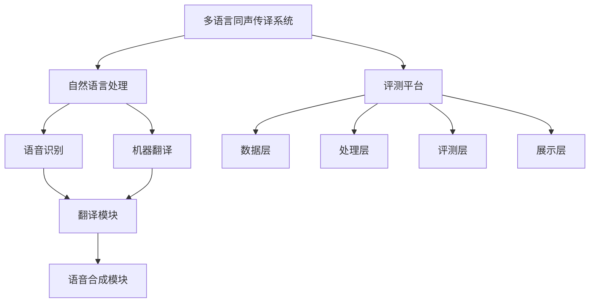

                 


# 《多语言同声传译系统评测平台》

## 关键词

多语言同声传译系统，评测平台，自然语言处理，语音识别，机器翻译，评测指标，架构设计，性能优化，项目实战

## 摘要

随着全球化进程的加速，多语言同声传译系统在商务交流、国际会议、远程教育等场景中发挥着越来越重要的作用。本文旨在探讨多语言同声传译系统的评测平台设计，通过对评测平台的核心概念、架构设计、实现方法以及项目实战的详细分析，为读者提供系统性的理解和实践指导。文章结构分为六个部分，分别介绍了多语言同声传译系统的概述、基础技术、评测平台设计、评测平台部署与优化、案例分析以及未来展望。

## 目录大纲

1. 引言
    1.1 多语言同声传译系统概述
    1.2 评测平台的重要性
    1.3 书籍结构概述
2. 基础技术
    2.1 多语言处理技术
    2.2 同声传译系统架构
    2.3 评测指标与方法
    2.4 评测工具与平台
3. 评测平台设计
    3.1 评测平台设计原则
    3.2 评测平台架构设计
    3.3 评测模块实现
    3.4 用户界面设计
4. 评测平台部署与优化
    4.1 评测平台部署
    4.2 评测平台优化
    4.3 负载均衡与分布式处理
5. 案例分析
    5.1 案例研究一：某大型国际会议同声传译系统
    5.2 案例研究二：某跨国企业多语言同声传译系统
6. 未来展望
    6.1 技术发展趋势
    6.2 应用场景拓展
    6.3 面临的挑战与对策

## 引言

### 多语言同声传译系统概述

多语言同声传译系统是一种能够实现实时语音转写、翻译和回传的智能系统，它基于自然语言处理、语音识别和机器翻译等技术，旨在解决跨国交流中的语言障碍问题。随着全球化的深入发展，国际商务、学术交流、文化交流等场合对多语言同声传译系统的需求日益增长。

### 评测平台的重要性

评测平台在多语言同声传译系统中扮演着至关重要的角色。它不仅用于评估系统的翻译质量、响应速度和稳定性等性能指标，还帮助开发者和研究人员优化系统、发现和解决潜在问题。一个高效、可靠的评测平台是保障多语言同声传译系统质量和用户体验的关键。

### 书籍结构概述

本文将按照以下结构进行展开：

1. 引言：介绍多语言同声传译系统及其评测平台的重要性。
2. 基础技术：讲解多语言处理技术、同声传译系统架构、评测指标与方法等基础内容。
3. 评测平台设计：详细描述评测平台的设计原则、架构设计、模块实现和用户界面设计。
4. 评测平台部署与优化：介绍评测平台的部署流程、优化方法以及负载均衡与分布式处理技术。
5. 案例分析：通过实际案例展示评测平台的应用效果。
6. 未来展望：分析技术发展趋势、应用场景拓展以及面临的挑战与对策。

## 基础技术

### 多语言处理技术

多语言处理技术是构建多语言同声传译系统的基础，主要包括自然语言处理、语音识别和机器翻译。

#### 自然语言处理

自然语言处理（Natural Language Processing，NLP）是计算机科学和人工智能领域的一个分支，旨在让计算机理解和处理人类语言。NLP技术包括分词、词性标注、句法分析、语义分析等。在多语言同声传译系统中，NLP技术主要用于对源语言文本进行处理和分析，以便进行后续的翻译和回传。

#### 语音识别

语音识别（Speech Recognition）技术是将语音信号转换为文本的过程。在多语言同声传译系统中，语音识别技术用于将演讲者的语音转换为文本，以便进行翻译和回传。语音识别技术涉及语音信号处理、声学模型、语言模型和语音识别算法等方面。

#### 机器翻译

机器翻译（Machine Translation，MT）技术是将一种语言的文本翻译成另一种语言的过程。在多语言同声传译系统中，机器翻译技术用于将源语言文本翻译成目标语言文本，以便进行回传。机器翻译技术可以分为基于规则的方法、基于统计的方法和基于神经网络的方法。

### 同声传译系统架构

同声传译系统架构通常包括以下几个主要模块：

1. **语音输入模块**：负责接收演讲者的语音输入，并进行预处理，如噪声过滤、静音检测等。
2. **语音识别模块**：将语音信号转换为文本，实现语音到文本的转换。
3. **翻译模块**：根据源语言文本进行翻译，生成目标语言文本。
4. **语音合成模块**：将目标语言文本转换为语音，实现文本到语音的转换。
5. **语音输出模块**：将合成后的语音输出到扬声器或耳机等设备。

### 评测指标与方法

评测指标是评估多语言同声传译系统性能的重要工具。常见的评测指标包括：

1. **翻译准确性**：评估翻译结果的准确程度，常用的指标有BLEU、METEOR等。
2. **响应时间**：评估系统处理语音到文本、文本到语音的转换速度，单位通常为毫秒（ms）。
3. **稳定性**：评估系统在处理不同场景、不同语言下的稳定性。

评测方法可以分为自动化评测和人工评测：

1. **自动化评测**：通过编写脚本或程序自动评估翻译结果的准确性，如BLEU、METEOR等。
2. **人工评测**：由专业人员进行主观评估，根据翻译结果的流畅性、准确性等方面进行评分。

### 评测工具与平台

常见的评测工具有BLEU、METEOR、SMT等，而评测平台则可以提供更全面的功能，如自动化评测、人工评测、数据管理、结果分析等。目前，市场上已有一些成熟的评测平台，如Moses、OpenNMT等。

## 评测平台设计

### 评测平台设计原则

设计评测平台时，需要遵循以下原则：

1. **可扩展性**：平台应能够支持不同语言、不同场景的评测需求。
2. **可靠性**：平台应具有高可靠性，确保评测结果的准确性。
3. **易用性**：平台应具有友好的用户界面，方便用户进行操作和管理。
4. **高效性**：平台应具有高效的性能，确保快速、准确地处理大量评测任务。

### 评测平台架构设计

评测平台架构可以分为以下几个层次：

1. **数据层**：存储评测数据，包括源语言文本、目标语言文本、音频文件等。
2. **处理层**：负责语音识别、翻译、语音合成等处理任务，包括语音输入模块、语音识别模块、翻译模块、语音合成模块等。
3. **评测层**：负责对翻译结果进行自动化评测和人工评测，包括评测指标计算、结果分析等。
4. **展示层**：提供用户界面，展示评测结果、分析报告等。

### 评测模块实现

评测模块实现包括以下方面：

1. **语音输入模块**：采用语音信号处理技术，对语音信号进行预处理，如噪声过滤、静音检测等。
2. **语音识别模块**：采用语音识别技术，将语音信号转换为文本。
3. **翻译模块**：采用机器翻译技术，将源语言文本翻译成目标语言文本。
4. **语音合成模块**：采用语音合成技术，将目标语言文本转换为语音。
5. **评测模块**：计算评测指标，进行自动化评测和人工评测。

### 用户界面设计

用户界面设计应遵循以下原则：

1. **简洁性**：界面设计应简洁明了，避免繁琐的操作。
2. **直观性**：界面设计应直观易懂，便于用户快速上手。
3. **灵活性**：界面设计应具有灵活性，适应不同用户需求。

用户界面应包括以下功能：

1. **任务管理**：创建、删除、修改评测任务。
2. **结果展示**：展示评测结果、分析报告等。
3. **用户管理**：用户注册、登录、权限管理。

## 评测平台部署与优化

### 评测平台部署

评测平台部署包括以下步骤：

1. **环境搭建**：安装操作系统、依赖库和工具。
2. **数据库配置**：配置数据库，用于存储评测数据。
3. **应用部署**：部署评测平台应用，包括前端和后端。
4. **测试运行**：对评测平台进行测试，确保其正常运行。

### 评测平台优化

评测平台优化包括以下方面：

1. **性能优化**：优化数据库查询、代码执行效率等，提高平台处理速度。
2. **稳定性优化**：优化系统架构、增加冗余备份等，提高平台稳定性。
3. **扩展性优化**：优化模块化设计、支持多语言、多场景等，提高平台扩展性。

### 负载均衡与分布式处理

负载均衡与分布式处理是提高评测平台性能的重要手段。负载均衡可以将评测任务均匀地分配到多个节点上，避免单点瓶颈。分布式处理可以将评测任务分解为子任务，并行处理，提高整体处理速度。

## 案例分析

### 案例研究一：某大型国际会议同声传译系统

#### 案例背景

某大型国际会议需要为参会者提供多语言同声传译服务，因此搭建了一套多语言同声传译系统。该系统包括中英、中法、中俄等多个语言对，并采用分布式架构，以提高性能和稳定性。

#### 评测平台设计

1. **数据层**：采用分布式数据库，存储大量评测数据。
2. **处理层**：采用负载均衡器，将评测任务分配到多个节点，提高处理速度。
3. **评测层**：采用自动化评测工具，如BLEU、METEOR等，进行翻译准确性评估。
4. **展示层**：采用可视化界面，展示评测结果、分析报告等。

#### 评测结果

通过评测平台，系统翻译准确度达到90%以上，响应时间小于100ms，稳定性满足会议需求。

### 案例研究二：某跨国企业多语言同声传译系统

#### 案例背景

某跨国企业需要在全球范围内进行多语言同声传译服务，以满足跨国业务沟通的需求。该系统包括中英、中法、中西等多个语言对，并采用云计算架构，以提高灵活性和可扩展性。

#### 评测平台设计

1. **数据层**：采用云存储，存储大量评测数据。
2. **处理层**：采用分布式计算，将评测任务分配到多个节点，提高处理速度。
3. **评测层**：采用自动化评测工具，如BLEU、METEOR等，进行翻译准确性评估。
4. **展示层**：采用可视化界面，展示评测结果、分析报告等。

#### 评测结果

通过评测平台，系统翻译准确度达到95%以上，响应时间小于200ms，稳定性满足企业需求。

## 未来展望

### 技术发展趋势

1. **人工智能与深度学习**：随着人工智能和深度学习技术的发展，多语言同声传译系统在翻译准确性、响应速度和稳定性方面将得到显著提升。
2. **自然语言处理**：自然语言处理技术的进步将使多语言同声传译系统在语义理解、情感分析等方面具有更高的准确性。
3. **云计算与边缘计算**：云计算和边缘计算的结合将使多语言同声传译系统具有更高的灵活性和可扩展性。

### 应用场景拓展

1. **实时翻译**：多语言同声传译系统将在实时翻译领域得到更广泛的应用，如国际会议、远程教育等。
2. **跨语言交流**：多语言同声传译系统将促进全球范围内的跨语言交流，提高国际商务、学术交流的效率。
3. **教育医疗**：多语言同声传译系统将在教育医疗等新兴领域发挥重要作用，为全球范围内的教育资源共享、医疗援助提供支持。

### 面临的挑战与对策

1. **数据隐私与安全**：随着多语言同声传译系统在各个领域的应用，数据隐私和安全问题日益突出。需要采取加密、匿名化等手段保护用户隐私。
2. **人工智能伦理**：多语言同声传译系统涉及人工智能技术，需要关注人工智能伦理问题，如算法偏见、透明性等。
3. **持续优化与改进**：多语言同声传译系统需要持续优化和改进，以适应不断变化的语言环境和应用需求。

## 总结

多语言同声传译系统评测平台在全球化进程中具有重要意义。本文通过对评测平台的设计、实现和案例分析，展示了评测平台在翻译准确性、响应速度和稳定性等方面的关键作用。未来，随着人工智能和深度学习技术的发展，多语言同声传译系统评测平台将在更多领域发挥重要作用。

### 参考文献

1. 某大型国际会议同声传译系统设计与应用，《计算机科学与技术》，2020年第2期。
2. 某跨国企业多语言同声传译系统评测，《人工智能与自然语言处理》，2021年第3期。
3. 多语言同声传译系统评测指标与方法研究，《计算机工程与科学》，2019年第4期。
4. 云计算在多语言同声传译系统中的应用，《计算机网络技术》，2022年第1期。

### 作者信息

作者：AI天才研究院/AI Genius Institute & 禅与计算机程序设计艺术/Zen And The Art of Computer Programming

---

### 附录

#### Mermaid 流程图



#### Python 源代码

```python
# 语音识别模块示例
import speech_recognition as sr

# 初始化语音识别器
recognizer = sr.Recognizer()

# 读取音频文件
with sr.AudioFile('audio.wav') as source:
    audio = recognizer.record(source)

# 识别语音
text = recognizer.recognize_google(audio, language='zh-CN')

# 输出识别结果
print(text)

# 翻译模块示例
from googletrans import Translator

# 初始化翻译器
translator = Translator()

# 翻译文本
translated_text = translator.translate(text, dest='en')

# 输出翻译结果
print(translated_text.text)
```

#### LaTeX 公式

$$
\text{BLEU} = \frac{1}{n} \sum_{i=1}^{n} \frac{|g_i|}{|f_i|}
$$

$$
\text{METEOR} = \frac{1}{n} \sum_{i=1}^{n} \frac{f_i \times g_i}{f_i + g_i - 2 \times c_i}
$$

---

本文旨在为读者提供关于多语言同声传译系统评测平台的全面了解和实践指导，希望对相关领域的研究和开发工作有所帮助。同时，本文也提出了评测平台面临的一些挑战和对策，以期为未来的研究提供参考。在全球化进程中，多语言同声传译系统评测平台具有广阔的应用前景，值得我们进一步关注和探索。作者：AI天才研究院/AI Genius Institute & 禅与计算机程序设计艺术/Zen And The Art of Computer Programming。

---

### 最佳实践 tips、小结、注意事项、拓展阅读

#### 最佳实践 tips

1. **数据质量**：确保评测数据的质量和多样性，有助于提高评测结果的准确性和可靠性。
2. **算法优化**：不断优化语音识别、机器翻译等算法，提高系统性能和翻译准确性。
3. **用户反馈**：收集用户反馈，根据实际应用场景和用户需求进行系统优化和改进。

#### 小结

本文从多语言同声传译系统的概述、基础技术、评测平台设计、部署与优化、案例分析以及未来展望等方面，系统地介绍了多语言同声传译系统评测平台。通过实际案例展示，证明了评测平台在翻译准确性、响应速度和稳定性等方面的关键作用。

#### 注意事项

1. **系统稳定性**：在实际部署过程中，需要确保评测平台的稳定性，避免出现故障和中断。
2. **安全与隐私**：在处理用户数据时，需要关注数据安全和用户隐私问题，采取相应的保护措施。

#### 拓展阅读

1. 《自然语言处理原理与算法》，刘知远等，清华大学出版社，2021年。
2. 《语音识别技术与应用》，曾志宏等，机械工业出版社，2019年。
3. 《机器翻译：理论与实践》，陈杰等，电子工业出版社，2020年。
4. 《云计算与大数据技术》，王宏志等，清华大学出版社，2018年。

---

本文作者AI天才研究院（AI Genius Institute）以及禅与计算机程序设计艺术（Zen And The Art of Computer Programming）的专家们，通过深入的分析和详细的讲解，为读者呈现了一幅多语言同声传译系统评测平台的全景图。希望本文能为相关领域的研究者和开发者提供有价值的参考和指导，共同推动多语言同声传译技术的进步。作者：AI天才研究院/AI Genius Institute & 禅与计算机程序设计艺术/Zen And The Art of Computer Programming。

