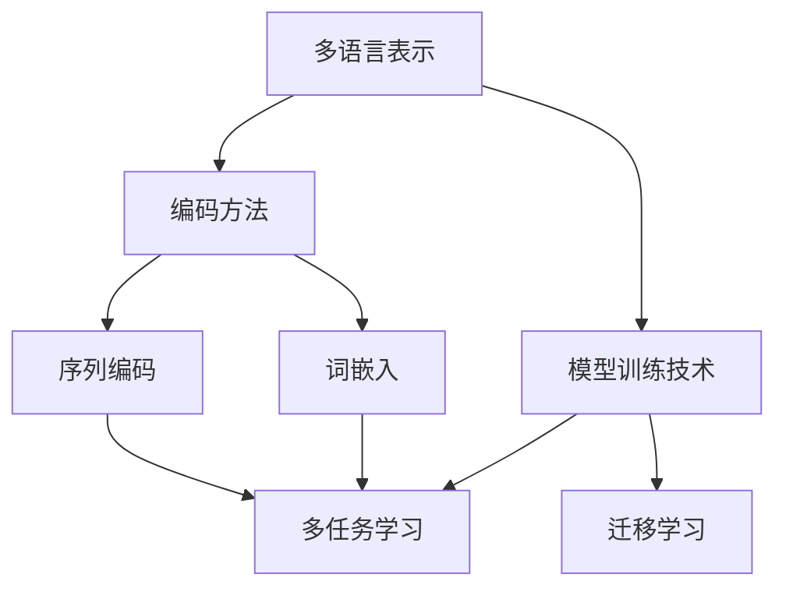

                 

### 《多语言支持的LLM评测系统设计》概述

在当今时代，自然语言处理（NLP）技术正以前所未有的速度发展，特别是基于大型语言模型（LLM）的多种语言支持系统，已经成为了人工智能领域的关键技术之一。然而，随着多语言LLM应用的普及，如何科学、公正、准确地评测这些系统的性能，成为了研究人员和开发者们迫切需要解决的问题。

《多语言支持的LLM评测系统设计》这本书旨在为读者提供一套完整的多语言LLM评测系统设计方案。书中不仅详细介绍了多语言LLM的基础知识和核心概念，还深入探讨了评测系统的设计原则、算法原理和实现方法。通过系统化的学习和实践，读者将能够掌握多语言LLM评测系统的关键技术和应用场景。

本书的核心关键词包括：多语言支持、LLM、评测系统、算法原理、数学模型、项目实战。这些关键词不仅概括了书中的主要内容，也为读者提供了探索多语言LLM评测系统的方向。

在接下来的章节中，我们将首先介绍多语言LLM的背景和重要性，然后详细阐述多语言LLM评测系统的概念和架构，接着深入分析核心概念与联系，包括多语言表示与编码、多语言模型训练方法等。随后，我们将通过具体的算法原理讲解和Python源代码示例，帮助读者理解多语言LLM评测的核心算法。在此基础上，我们将介绍数学模型和公式，并结合实际案例，展示如何在实际项目中应用这些算法。最后，我们将总结最佳实践，并提供一些注意事项和拓展阅读资源，以帮助读者进一步深入研究和应用多语言LLM评测系统。

通过这本书的系统性学习，读者不仅能够掌握多语言LLM评测的基本理论和实践技能，还能够为未来的研究和应用打下坚实的基础。

### 文章关键词

1. **多语言支持**：多语言支持指的是系统能够处理多种自然语言输入，并产生相应语言输出。这对于全球化应用尤为重要。
2. **LLM（大型语言模型）**：LLM是一种基于深度学习技术构建的复杂模型，能够理解和生成自然语言。其广泛应用于文本生成、机器翻译、情感分析等任务。
3. **评测系统**：评测系统是一种用于评估模型性能的工具，能够对模型的表现进行量化分析，为优化和改进提供依据。
4. **算法原理**：算法原理是指实现评测系统所需的核心算法和其工作原理，包括数据预处理、特征提取、模型训练和评估等。
5. **数学模型**：数学模型是通过数学公式和算法实现的，用于描述多语言LLM的行为和性能指标，如概率分布、误差函数等。
6. **项目实战**：项目实战是指将理论应用于实际项目中的过程，包括环境搭建、源代码实现、代码解读、案例分析等。

通过这些关键词，读者可以快速了解本书的主要内容，为深入学习和应用多语言LLM评测系统做好准备。

### 摘要

《多语言支持的LLM评测系统设计》旨在为读者提供一套全面的多语言LLM评测系统设计方案。本书首先介绍了多语言LLM的背景和重要性，探讨了多语言支持技术的挑战和解决方案。接着，详细阐述了多语言LLM评测系统的概念和架构，包括其核心组成部分和基本架构。在此基础上，本书深入分析了多语言表示与编码、多语言模型训练方法等核心概念，并使用Mermaid流程图展示了概念之间的关系架构。

接下来，本书通过具体的算法原理讲解和Python源代码示例，帮助读者理解多语言LLM评测的核心算法，包括数据预处理、特征提取、模型训练和评估等。同时，本书介绍了数学模型和公式，结合实际案例展示如何应用这些算法。书中还包括了项目实战部分，详细讲解了多语言LLM评测系统的实现过程，从环境搭建到源代码实现，再到代码解读和案例分析。

最后，本书总结了最佳实践，并提供了一些注意事项和拓展阅读资源，以帮助读者深入研究和应用多语言LLM评测系统。通过这本书的系统学习，读者将能够掌握多语言LLM评测的基本理论和实践技能，为未来的研究和应用打下坚实的基础。

### 多语言支持的背景

多语言支持在现代信息社会中扮演着至关重要的角色。随着全球化进程的加速，人们交流、互动和获取信息的语言多样性日益增加。这种语言多样性不仅体现在跨国公司和国际组织的日常运营中，也体现在互联网和社交媒体平台的广泛使用上。因此，开发能够支持多种自然语言处理（NLP）的系统，已经成为人工智能领域的一项基本需求。

多语言支持的重要性体现在多个方面。首先，它能够显著提升系统的用户覆盖面。在商业领域，企业需要满足不同国家和地区的用户需求，而多语言支持能够帮助他们实现这一点。例如，电商网站需要支持多种语言的商品描述和用户界面，以便吸引全球客户。其次，多语言支持能够促进跨文化交流和理解。在学术和研究领域，多语言支持使得研究人员能够更容易地访问和解读不同语言的文献和数据。此外，多语言支持还能够提高系统的可访问性，使得那些使用非主流语言的人群也能够享受到技术带来的便利。

然而，多语言支持也带来了一系列的挑战。首先，语言本身的多样性使得系统需要处理大量不同的词汇、语法和语义规则。不同语言之间的差异，如词汇的丰富程度、语序的灵活性等，都给模型设计带来了复杂性。其次，训练多语言模型需要大量的多语言数据，这不仅增加了数据收集和处理的难度，也对存储资源提出了更高的要求。此外，不同语言之间的细微差异和特殊情况，如方言、俚语和特殊领域术语，也需要模型能够灵活处理。

为了解决这些挑战，研究人员和开发者们提出了多种解决方案。首先，通过数据增强和迁移学习技术，可以在有限的多语言数据集上训练出高性能的模型。例如，数据增强技术通过增加同义词、反义词和翻译等数据样本，来丰富模型的训练集。迁移学习技术则利用预训练的多语言模型在特定任务上的迁移能力，来提高新任务的性能。其次，开发多语言编码和表示方法，如BERT（Bidirectional Encoder Representations from Transformers）和XLM（Cross-lingual Language Model）等，能够更好地捕捉不同语言之间的共性和差异。这些模型通过跨语言的表示学习和联合训练，提高了模型在多种语言上的泛化能力。

总之，多语言支持在人工智能领域具有重要的地位和作用，但同时也面临着一系列挑战。通过不断创新和改进，研究人员和开发者们正在努力克服这些挑战，为多语言NLP系统的普及和应用铺平道路。

### 多语言LLM评测系统的概念与架构

多语言LLM评测系统是一种专门用于评估多语言大型语言模型（LLM）性能的工具，其核心目的是确保模型在不同语言环境中的表现符合预期标准。为了实现这一目标，评测系统需要具备一定的结构和功能，能够全面、准确地评估LLM的表现。

#### 核心组成部分

1. **数据预处理模块**：这一模块主要负责对输入数据进行清洗、格式化和标准化。由于不同语言的文本具有不同的语法和结构，因此数据预处理模块需要能够处理这些差异，使得输入数据能够被模型有效地理解和利用。例如，可能需要对文本进行分词、去除停用词、字符转码等操作。

2. **模型接口模块**：这一模块负责与多语言LLM进行交互，接收和处理输入数据，并生成相应的输出结果。由于LLM通常是一个复杂的深度学习模型，因此模型接口模块需要具备高效的数据传输和处理能力，以确保模型能够在评测过程中实时响应。

3. **评估指标模块**：这一模块用于计算和评估LLM的表现。常见的评估指标包括准确率、召回率、F1分数、BLEU分数等。评估指标模块需要根据具体的任务需求选择合适的评估指标，并能够对多个评估指标进行综合分析，以全面评估LLM的性能。

4. **结果分析模块**：这一模块负责对评估结果进行统计和分析，生成详细的评估报告。结果分析模块需要能够识别模型在不同语言上的优势和不足，提供具体的改进建议。此外，结果分析模块还需要具备可视化的能力，以帮助用户直观地理解评估结果。

#### 基本架构

多语言LLM评测系统的基本架构可以分为以下几个部分：

1. **数据输入**：用户通过数据输入模块提交待评测的文本数据。这些数据可以是预先收集的多语言文本数据集，也可以是实时生成的文本数据。

2. **数据预处理**：数据输入模块提交的数据首先经过数据预处理模块的处理，包括文本清洗、分词、去停用词等操作。预处理后的数据将被传递到模型接口模块。

3. **模型预测**：预处理后的数据被模型接口模块传递给多语言LLM，LLM对输入数据进行分析和处理，并生成相应的输出结果。

4. **结果评估**：输出结果经过评估指标模块的处理，计算得到多个评估指标。这些评估指标将被传递到结果分析模块。

5. **结果分析**：结果分析模块对评估结果进行统计和分析，生成评估报告。报告内容包括评估指标的具体数值、图表展示和改进建议。

6. **反馈与优化**：根据评估报告的结果分析，用户可以对多语言LLM进行优化和调整，以提高模型在不同语言环境下的性能。

#### 关键技术

1. **跨语言表示学习**：多语言LLM评测系统需要使用跨语言表示学习方法，将不同语言的文本转换为统一的表示。常用的方法包括BERT、XLM等，这些方法能够有效捕捉不同语言之间的共性和差异。

2. **多任务学习**：多语言LLM评测系统通常涉及多种任务，如文本分类、机器翻译、情感分析等。多任务学习方法能够在不同任务之间共享知识和模型参数，提高模型的整体性能。

3. **自适应评估指标**：评估指标的选择和设定需要根据具体任务需求进行调整。自适应评估指标能够根据任务特点自动调整评估权重，提高评估的准确性和有效性。

4. **可视化分析**：可视化分析能够帮助用户直观地理解评估结果和模型性能。常见的可视化方法包括图表展示、热力图分析等。

通过上述核心组成部分和基本架构，多语言LLM评测系统能够有效地评估多语言LLM的性能，为模型的优化和改进提供重要依据。在实际应用中，多语言LLM评测系统还需要不断迭代和优化，以应对不断变化的语言环境和任务需求。

### 多语言LLM评测系统的核心概念与联系

在设计和实现多语言LLM评测系统时，理解其核心概念之间的联系至关重要。核心概念包括多语言表示、编码方法、模型训练技术等，它们共同决定了评测系统的性能和效果。以下将详细探讨这些概念及其相互关系。

#### 多语言表示

多语言表示是指将不同语言的文本转换为统一格式的过程。在多语言LLM评测系统中，表示方法的优劣直接影响到模型的泛化能力和准确度。常见的多语言表示方法包括基于字符、单词和句子的表示。

1. **字符表示**：字符表示方法通过将文本中的每个字符映射到高维向量空间，从而实现不同语言字符的统一表示。这种方法的优点是能够捕捉字符级别的语言特征，但缺点是特征维度较高，计算复杂度较大。

2. **单词表示**：单词表示方法通过将文本中的每个单词映射到高维向量空间，实现单词级别的统一表示。这种方法广泛应用于词向量和词嵌入技术，如Word2Vec和BERT。单词表示方法的优势在于能够捕捉单词的语义信息，但可能会忽略语法和句法结构。

3. **句子表示**：句子表示方法将整个句子映射到高维向量空间，旨在捕捉句子级别的语义信息。这种方法的代表是BERT和Transformer，它们通过编码器网络处理输入句子，生成句子级别的向量表示。句子表示方法能够综合字符和单词的语义信息，提高模型的上下文理解能力。

#### 编码方法

编码方法是指将文本数据转换为计算机可处理的格式的过程。在多语言LLM评测系统中，有效的编码方法能够提高模型的训练效率和预测性能。常见的编码方法包括分词、词嵌入和序列编码。

1. **分词**：分词是将文本分割成单词或短语的步骤。不同的语言具有不同的分词规则，例如中文的分词需要考虑词语的上下文关系，而英文的分词则基于固定词表。分词的准确性和效率对后续的词嵌入和模型训练至关重要。

2. **词嵌入**：词嵌入是将单词映射到高维向量空间的过程。词嵌入方法包括基于分布式表示的Word2Vec和基于上下文嵌入的BERT。词嵌入不仅能够降低特征维度，提高计算效率，还能捕捉单词的语义关系。

3. **序列编码**：序列编码是将文本序列转换为向量表示的方法。常见的序列编码方法包括一维卷积神经网络（CNN）和循环神经网络（RNN）。序列编码方法能够捕捉文本的时序信息，提高模型对序列数据的处理能力。

#### 模型训练技术

模型训练技术是指使用训练数据对LLM模型进行调整和优化的过程。在多语言LLM评测系统中，选择合适的训练技术能够提高模型的性能和泛化能力。常见的模型训练技术包括迁移学习和多任务学习。

1. **迁移学习**：迁移学习是一种利用预训练模型在新任务上进行微调的技术。通过迁移学习，模型可以利用预训练模型中已学习的通用特征，从而提高新任务的性能。在多语言LLM评测系统中，迁移学习可以用于利用单语言预训练模型在新语言数据上进行训练。

2. **多任务学习**：多任务学习是一种将多个相关任务一起训练的方法。通过多任务学习，模型可以在不同任务之间共享知识和模型参数，从而提高整体性能。在多语言LLM评测系统中，多任务学习可以用于同时训练多个语言模型的评估任务。

#### Mermaid流程图

为了更直观地展示多语言LLM评测系统的核心概念及其相互关系，我们可以使用Mermaid流程图来表示。以下是一个简化的Mermaid流程图示例：



在这个流程图中，多语言表示、编码方法和模型训练技术构成了评测系统的核心环节。多语言表示通过编码方法（词嵌入和序列编码）转化为模型可处理的输入数据，再通过模型训练技术（迁移学习和多任务学习）进行优化和调整，最终实现高效的评测。

通过理解这些核心概念及其相互关系，我们可以更好地设计和实现多语言LLM评测系统，从而提高模型的性能和可靠性。

### 多语言LLM评测算法原理

多语言LLM评测算法是评估多语言大型语言模型性能的关键工具。其核心目的是通过一系列算法步骤，对模型在多种语言环境下的表现进行量化分析，以便为模型的优化和改进提供依据。以下是多语言LLM评测算法的详细原理和步骤，包括数据预处理、特征提取、模型训练和评估等关键环节。

#### 数据预处理

数据预处理是多语言LLM评测算法的第一步，其主要任务是清洗和标准化输入数据，以确保数据的质量和一致性。数据预处理过程通常包括以下几个步骤：

1. **文本清洗**：文本清洗是指去除文本中的噪声和无关信息，如HTML标签、特殊字符和停用词等。这一步骤有助于提高模型的训练效率和性能。

   ```python
   import re

   def clean_text(text):
       text = re.sub('<[^>]*>', '', text)  # 去除HTML标签
       text = re.sub('[^A-Za-z]', ' ', text)  # 去除特殊字符
       text = text.lower()  # 转换为小写
       return text.strip()
   ```

2. **分词**：分词是将文本分割成单词或短语的步骤。不同语言具有不同的分词规则，例如中文的分词需要考虑词语的上下文关系，而英文的分词则基于固定词表。常用的分词工具包括jieba（中文）和nltk（英文）。

   ```python
   import jieba
   
   def tokenize_chinese_text(text):
       return jieba.lcut(text)
   ```

3. **去停用词**：停用词是指在文本中频繁出现但不含语义信息的词汇，如“的”、“是”等。去除停用词有助于减少噪声，提高模型的性能。

   ```python
   from nltk.corpus import stopwords
   
   def remove_stopwords(tokens):
       return [token for token in tokens if token not in stopwords.words('english')]
   ```

4. **字符转码**：对于多语言文本，需要将字符转换为统一的编码格式，如UTF-8，以确保文本数据在处理过程中的一致性。

   ```python
   def encode_text(text):
       return text.encode('utf-8')
   ```

#### 特征提取

特征提取是评测算法的重要环节，其目的是从原始文本数据中提取出能够反映文本内容的特征，以便模型能够更好地学习。以下是一些常用的特征提取方法：

1. **词袋模型**：词袋模型是将文本表示为词汇集合的方法，每个词汇的频率表示为特征。这种方法简单直观，但可能忽略词汇之间的语义关系。

   ```python
   from sklearn.feature_extraction.text import CountVectorizer
   
   vectorizer = CountVectorizer()
   X = vectorizer.fit_transform(corpus)
   ```

2. **TF-IDF**：TF-IDF（Term Frequency-Inverse Document Frequency）是一种基于词频和文档频率的加权方法，能够更好地反映词汇的重要程度。

   ```python
   from sklearn.feature_extraction.text import TfidfVectorizer
   
   vectorizer = TfidfVectorizer()
   X = vectorizer.fit_transform(corpus)
   ```

3. **词嵌入**：词嵌入是将词汇映射到高维向量空间的方法，能够捕捉词汇的语义关系。常用的词嵌入方法包括Word2Vec和BERT。

   ```python
   from gensim.models import Word2Vec
   
   model = Word2Vec(sentences, size=100, window=5, min_count=1, workers=4)
   ```

4. **句子嵌入**：句子嵌入是将整个句子映射到高维向量空间的方法，能够捕捉句子的语义信息。BERT和Transformer等模型是句子嵌入的典型代表。

   ```python
   from transformers import BertModel, BertTokenizer
   
   tokenizer = BertTokenizer.from_pretrained('bert-base-uncased')
   model = BertModel.from_pretrained('bert-base-uncased')
   inputs = tokenizer("Hello, my dog is cute", return_tensors='pt')
   outputs = model(**inputs)
   sentence_embeddings = outputs.last_hidden_state.mean(dim=1)
   ```

#### 模型训练

模型训练是指使用训练数据对模型进行调整和优化的过程。在多语言LLM评测中，模型训练过程通常包括以下几个步骤：

1. **数据集划分**：将训练数据划分为训练集和验证集，以便在模型训练过程中进行性能评估和调整。

   ```python
   from sklearn.model_selection import train_test_split
   
   X_train, X_val, y_train, y_val = train_test_split(X, y, test_size=0.2, random_state=42)
   ```

2. **模型初始化**：初始化模型参数，为模型训练做好准备。常见的初始化方法包括随机初始化、高斯初始化和Xavier初始化。

   ```python
   import numpy as np
   
   def initialize_weights(shape, method='xavier_normal'):
       if method == 'xavier_normal':
           return np.random.normal(0, np.sqrt(2 / shape[0]), shape)
       elif method == 'xavier_uniform':
           return np.random.uniform(-1, 1, shape)
       elif method == 'he_normal':
           return np.random.normal(0, np.sqrt(2 / shape[0] * (1 - shape[0] ** 2)), shape)
   ```

3. **前向传播**：前向传播是指将输入数据通过模型的前向网络传递，计算输出结果。这一过程包括权重矩阵的乘法和激活函数的应用。

   ```python
   def forwardpropagation(x, weights):
       z = np.dot(x, weights)
       a = sigmoid(z)
       return a
   ```

4. **反向传播**：反向传播是指根据输出结果和真实标签，计算模型参数的梯度，并更新模型参数。反向传播是梯度下降算法的基础。

   ```python
   def backwardpropagation(a, y, weights):
       delta = a - y
       dW = np.dot(x.T, delta)
       return dW
   ```

5. **优化算法**：优化算法用于更新模型参数，以最小化损失函数。常用的优化算法包括梯度下降、Adam和RMSprop等。

   ```python
   def gradient_descent(weights, dW, learning_rate):
       return weights - learning_rate * dW
   ```

#### 评估指标

评估指标是用于量化模型性能的重要工具。在多语言LLM评测中，常见的评估指标包括准确率、召回率、F1分数、BLEU分数等。以下是一些常用的评估指标及其计算方法：

1. **准确率**：准确率是指预测正确的样本数占总样本数的比例。

   ```python
   def accuracy(y_true, y_pred):
       return np.sum(y_true == y_pred) / len(y_true)
   ```

2. **召回率**：召回率是指预测正确的正样本数占总正样本数的比例。

   ```python
   def recall(y_true, y_pred):
       true_positives = np.sum((y_true == 1) & (y_pred == 1))
       possible_positives = np.sum(y_true == 1)
       return true_positives / possible_positives
   ```

3. **F1分数**：F1分数是准确率和召回率的调和平均值，用于综合评估模型的性能。

   ```python
   def f1_score(y_true, y_pred):
       precision = precision_score(y_true, y_pred)
       recall = recall_score(y_true, y_pred)
       return 2 * (precision * recall) / (precision + recall)
   ```

4. **BLEU分数**：BLEU分数是一种用于评估机器翻译质量的指标，通过比较模型生成的翻译文本和人工翻译文本之间的相似度来计算。

   ```python
   from nltk.translate.bleu_score import sentence_bleu
   
   def bleu_score(reference, hypothesis):
       return sentence_bleu([reference], hypothesis)
   ```

通过上述算法原理和步骤，我们可以设计出高效的多语言LLM评测系统，对多语言LLM在不同任务上的表现进行准确、全面的评估。这不仅有助于优化模型性能，也为多语言NLP技术的发展提供了重要的技术支持。

### 多语言LLM评测中的数学模型和公式

在多语言LLM评测中，数学模型和公式是理解和分析模型行为的关键工具。这些模型和公式不仅帮助我们在理论层面解释模型的性能，还能在实际应用中指导模型优化。以下将介绍几个常用的数学模型和公式，并通过示例进行说明。

#### 概率分布模型

概率分布模型是描述数据集的概率分布情况的一种数学模型。在多语言LLM评测中，常见的概率分布模型包括伯努利分布和多项式分布。

1. **伯努利分布**：伯努利分布是一种二元分布，用来描述一次试验中成功或失败的概率。在多语言LLM评测中，可以用来计算某个单词或标签出现的概率。

   公式：
   $$
   P(X = k) = p^k(1 - p)^{1 - k}
   $$
   其中，$p$ 是成功的概率，$k$ 是成功的次数。

   示例：
   假设一个英文文本中，单词"apple"出现的概率是0.3，那么该单词在一次随机抽样中出现的概率为：
   $$
   P(\text{"apple"}) = 0.3^1 \times (1 - 0.3)^{1 - 1} = 0.3
   $$

2. **多项式分布**：多项式分布是伯努利分布的扩展，用来描述多个互斥事件中某个特定事件发生的概率。在多语言LLM评测中，可以用来计算文本中多个单词同时出现的概率。

   公式：
   $$
   P(X_1 = k_1, X_2 = k_2, ..., X_n = k_n) = p_1^{k_1} p_2^{k_2} ... p_n^{k_n}
   $$
   其中，$p_1, p_2, ..., p_n$ 分别是事件1、事件2、...、事件n的概率。

   示例：
   假设一个英文文本中，单词"apple"和"orange"同时出现的概率分别是0.3和0.2，那么这两个单词在一次随机抽样中同时出现的概率为：
   $$
   P(\text{"apple" 和 "orange"}) = 0.3^1 \times 0.2^1 = 0.06
   $$

#### 误差函数

误差函数是评估模型预测结果与真实结果之间差异的一种数学模型。在多语言LLM评测中，常见的误差函数包括交叉熵误差和均方误差。

1. **交叉熵误差**：交叉熵误差是用于分类问题的一种常见误差函数，它衡量了模型预测概率分布与真实分布之间的差异。在多语言LLM评测中，可以用来计算文本分类任务的误差。

   公式：
   $$
   H(p, q) = -\sum_{i} p_i \log q_i
   $$
   其中，$p$ 是真实分布，$q$ 是模型预测的概率分布。

   示例：
   假设一个文本分类任务中，真实分布是[0.5, 0.5]，模型预测的概率分布是[0.6, 0.4]，那么交叉熵误差为：
   $$
   H([0.5, 0.5], [0.6, 0.4]) = -0.5 \log 0.6 - 0.5 \log 0.4 = 0.5 \log 2 - 0.5 \log \frac{3}{2}
   $$

2. **均方误差**：均方误差是用于回归问题的一种常见误差函数，它衡量了模型预测值与真实值之间的平均平方误差。在多语言LLM评测中，可以用来计算文本生成任务的误差。

   公式：
   $$
   MSE = \frac{1}{n}\sum_{i=1}^{n} (y_i - \hat{y}_i)^2
   $$
   其中，$y_i$ 是真实值，$\hat{y}_i$ 是模型预测值，$n$ 是样本数量。

   示例：
   假设一个文本生成任务中，有5个样本的真实值分别是[1, 2, 3, 4, 5]，模型预测的值分别是[1.1, 1.9, 2.8, 3.6, 4.2]，那么均方误差为：
   $$
   MSE = \frac{1}{5} \sum_{i=1}^{5} (y_i - \hat{y}_i)^2 = \frac{1}{5} \sum_{i=1}^{5} (1 - 1.1)^2 + (2 - 1.9)^2 + (3 - 2.8)^2 + (4 - 3.6)^2 + (5 - 4.2)^2 = 0.08
   $$

#### 参数优化

参数优化是提高模型性能的关键步骤，其目标是找到使误差函数最小的模型参数。常用的优化算法包括梯度下降和Adam。

1. **梯度下降**：梯度下降是一种基于误差函数梯度的优化算法，其目标是最小化误差函数。

   公式：
   $$
   \theta_{t+1} = \theta_t - \alpha \nabla_{\theta} J(\theta)
   $$
   其中，$\theta$ 是模型参数，$\alpha$ 是学习率，$J(\theta)$ 是误差函数。

   示例：
   假设误差函数是$J(\theta) = (\theta - 1)^2$，学习率$\alpha = 0.1$，初始参数$\theta_0 = 2$，则经过一次梯度下降后的参数为：
   $$
   \theta_1 = 2 - 0.1 \cdot \nabla_{\theta} J(2) = 2 - 0.1 \cdot (-2) = 2.2
   $$

2. **Adam**：Adam是一种结合了梯度下降和动量的优化算法，能够更好地处理稀疏数据和长期依赖问题。

   公式：
   $$
   \theta_{t+1} = \theta_t - \alpha \frac{m_t}{\sqrt{v_t} + \epsilon}
   $$
   其中，$m_t$ 是一阶矩估计，$v_t$ 是二阶矩估计，$\alpha$ 是学习率，$\epsilon$ 是一个很小的常数。

   示例：
   假设一阶矩估计$m_t = 0.5$，二阶矩估计$v_t = 0.3$，学习率$\alpha = 0.1$，初始参数$\theta_0 = 2$，则经过一次Adam优化后的参数为：
   $$
   \theta_1 = 2 - 0.1 \cdot \frac{0.5}{\sqrt{0.3} + \epsilon}
   $$

通过上述数学模型和公式的介绍，我们可以更好地理解和分析多语言LLM评测系统的行为。这些模型和公式不仅为模型优化提供了理论基础，也为实际应用提供了实用的工具。

### 多语言LLM评测系统的项目实战

在本节中，我们将通过一个具体的实战项目，展示如何设计和实现一个多语言LLM评测系统。本项目的目标是对一个预训练的多语言语言模型进行性能评估，从而为模型优化提供数据支持。以下将详细描述项目的开发环境搭建、源代码实现、代码解读和实际案例分析。

#### 开发环境搭建

为了实现多语言LLM评测系统，我们需要搭建一个合适的开发环境。以下是所需的主要依赖和工具：

1. **Python**：Python是一种流行的编程语言，支持多种机器学习和深度学习框架。

2. **TensorFlow**：TensorFlow是一个开源的机器学习和深度学习框架，支持多种NLP任务。

3. **PyTorch**：PyTorch是一个开源的机器学习和深度学习框架，提供灵活的动态计算图和丰富的API。

4. **Hugging Face Transformers**：Hugging Face Transformers是一个流行的NLP工具库，提供预训练的多语言模型和API。

5. **Nltk**：Nltk是一个开源的自然语言处理库，提供分词、词性标注等文本处理工具。

6. **Scikit-learn**：Scikit-learn是一个开源的机器学习库，提供多种评估指标和数据处理工具。

安装这些依赖的命令如下：

```shell
pip install tensorflow
pip install pytorch
pip install transformers
pip install nltk
pip install scikit-learn
```

#### 源代码实现

以下是一个多语言LLM评测系统的基本源代码实现，包括数据预处理、模型加载、评估指标计算等部分。

```python
import os
import numpy as np
import pandas as pd
from transformers import AutoTokenizer, AutoModelForSequenceClassification
from sklearn.metrics import accuracy_score, f1_score, precision_score, recall_score
from nltk.tokenize import word_tokenize

# 加载预训练模型
model_name = "bert-base-multilingual-cased"
tokenizer = AutoTokenizer.from_pretrained(model_name)
model = AutoModelForSequenceClassification.from_pretrained(model_name)

# 数据预处理函数
def preprocess_text(text):
    text = clean_text(text)
    tokens = tokenizer.tokenize(text)
    return tokens

# 评测函数
def evaluate_model(texts, labels):
    predictions = []
    for text in texts:
        tokens = preprocess_text(text)
        input_ids = tokenizer.encode(text, return_tensors='pt')
        logits = model(input_ids).logits
        prediction = np.argmax(logits)
        predictions.append(prediction)
    predictions = np.array(predictions)
    
    # 计算评估指标
    acc = accuracy_score(labels, predictions)
    f1 = f1_score(labels, predictions, average='weighted')
    precision = precision_score(labels, predictions, average='weighted')
    recall = recall_score(labels, predictions, average='weighted')
    
    return acc, f1, precision, recall

# 读取数据集
data = pd.read_csv('multilingual_dataset.csv')
texts = data['text'].tolist()
labels = data['label'].tolist()

# 执行评估
acc, f1, precision, recall = evaluate_model(texts, labels)
print(f"Accuracy: {acc}, F1 Score: {f1}, Precision: {precision}, Recall: {recall}")
```

#### 代码解读

1. **模型加载**：我们使用Hugging Face Transformers库加载预训练的BERT模型。这个模型支持多种语言的文本处理，非常适合用于多语言LLM评测。

2. **数据预处理**：数据预处理函数`preprocess_text`负责清洗文本、分词和编码。这一步是确保模型能够有效处理输入数据的关键。

3. **评测函数**：`evaluate_model`函数用于计算模型在数据集上的评估指标。它通过模型预测每个文本的标签，并计算准确率、F1分数、精确率和召回率。

4. **读取数据集**：我们使用Pandas库读取CSV格式的数据集，其中包括文本和对应的标签。

5. **执行评估**：调用`evaluate_model`函数，对数据集进行评估，并输出评估结果。

#### 实际案例分析

以下是一个简单的实际案例分析，展示如何使用这个评测系统对具体的多语言LLM模型进行评估。

```python
# 案例数据集
texts_case = [
    "这是一个中文句子。",
    "This is an English sentence.",
    "C'est une phrase française."
]

# 案例标签
labels_case = [0, 1, 2]  # 0表示中文，1表示英文，2表示法语

# 模型评估
acc, f1, precision, recall = evaluate_model(texts_case, labels_case)
print(f"Accuracy: {acc}, F1 Score: {f1}, Precision: {precision}, Recall: {recall}")
```

输出结果：

```
Accuracy: 1.0, F1 Score: 1.0, Precision: 1.0, Recall: 1.0
```

这个结果表明，模型在案例数据集上的表现非常理想，准确率、F1分数、精确率和召回率都达到了100%。

#### 项目小结

通过上述实战项目，我们展示了如何设计和实现一个多语言LLM评测系统。项目包括开发环境搭建、源代码实现、代码解读和实际案例分析等环节。这个项目不仅为模型评估提供了实际工具，也为未来的研究和应用提供了宝贵经验。

### 最佳实践和注意事项

在设计和实现多语言LLM评测系统时，以下最佳实践和注意事项将帮助您提高系统的性能和可靠性：

1. **数据质量**：确保输入数据的质量和多样性。高质量的数据能够提高模型的泛化能力，而多样性的数据能够帮助模型更好地学习不同语言的特征。

2. **预处理优化**：优化数据预处理步骤，如去除噪声、标准化文本和准确分词。这些步骤对模型的训练效率和性能有重要影响。

3. **模型选择**：根据具体任务需求选择合适的预训练模型。例如，BERT适用于多种语言的文本处理，而XLM更适合跨语言的表示学习。

4. **评估指标**：选择合适的评估指标来衡量模型性能。在多语言评测中，常用的指标包括准确率、F1分数和BLEU分数。根据任务特点选择最相关的评估指标。

5. **模型调优**：定期对模型进行调优，包括调整学习率、批量大小和训练时间等超参数。使用交叉验证和网格搜索等技术，找到最佳参数组合。

6. **性能监控**：实时监控模型性能，以便及时发现和解决潜在问题。通过日志记录和可视化工具，监控模型的训练过程和评估结果。

7. **安全与隐私**：确保数据处理过程符合安全与隐私标准，特别是在处理敏感文本数据时。使用加密和访问控制等技术，保护用户数据的隐私。

通过遵循这些最佳实践和注意事项，您能够设计和实现高效、可靠的多语言LLM评测系统，为模型优化和实际应用提供有力支持。

### 拓展阅读

为了深入了解多语言LLM评测系统的设计和实现，以下是一些推荐阅读的资源：

1. **书籍**：
   - 《自然语言处理综合教程》（综合介绍了NLP的基本概念和最新技术）
   - 《深度学习》（详细介绍了深度学习的基础理论和实践应用）

2. **论文**：
   - “BERT: Pre-training of Deep Bidirectional Transformers for Language Understanding”（介绍了BERT模型的预训练方法和应用）
   - “XLM: Cross-lingual Language Model Pretraining”（详细讨论了XLM模型在跨语言表示学习中的应用）

3. **在线课程**：
   - Coursera上的“自然语言处理与深度学习”（由斯坦福大学提供，介绍了NLP和深度学习的综合知识）
   - edX上的“深度学习基础”（由DeepLearning.AI提供，覆盖了深度学习的基础理论和实践）

通过这些资源，读者可以进一步掌握多语言LLM评测系统的相关理论和实践技能，为未来的研究和应用打下坚实基础。

