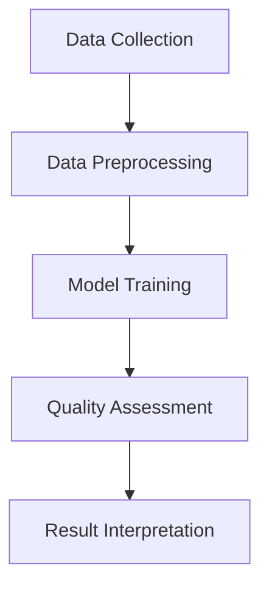

                 


# Multilingual Translation Competence Assessment: Cross-Linguistic Quality Evaluation Supported by LLMs

## Keywords:
- Multilingual Translation
- Language Models (LLM)
- Quality Assessment
- Cross-Linguistic Evaluation
- BLEU Score

## Abstract:
This article delves into the realm of multilingual translation competence assessment, focusing on the application of Language Models (LLM) to evaluate the quality of cross-linguistic translations. It provides a comprehensive overview of the core concepts, theoretical frameworks, and advanced techniques in this field. The article aims to explore how LLMs can enhance the assessment process, highlighting the challenges and limitations that arise in the context of multilingual translation. Additionally, it presents mathematical models and practical examples to illustrate the effectiveness and applicability of these models in real-world scenarios.

## Introduction

### 1. Overview of Multilingual Translation

Multilingual translation is a crucial component in the globalized world, facilitating communication and knowledge exchange among diverse linguistic communities. The significance of multilingual translation can be observed in various domains, including international business, diplomacy, education, and scientific research. However, achieving high-quality translations is a challenging task due to the inherent differences in language structures, vocabulary, and cultural nuances.

1.1. Importance of Multilingual Translation

The demand for accurate and fluent translations has grown exponentially with the increasing interconnectedness of the world. As companies expand their operations globally, the need for multilingual communication has become imperative. Furthermore, the proliferation of digital content and the rise of e-commerce platforms have created a vast market for multilingual translations. Additionally, the spread of information through the internet has made access to knowledge a fundamental right, emphasizing the importance of providing high-quality translations to ensure equal access to information across languages.

1.2. Challenges in Multilingual Translation

Translating text from one language to another involves overcoming numerous challenges. These challenges can be categorized into linguistic, cultural, and technical aspects. Linguistic challenges include syntactic differences, idiomatic expressions, and linguistic nuances that are difficult to capture in a translated text. Cultural challenges arise from the differences in cultural contexts, values, and beliefs, which can lead to misinterpretations and inappropriate translations. Technical challenges encompass the limitations of existing translation tools, the need for efficient processing of large amounts of text, and the integration of translation systems with other software applications.

1.3. Recent Advances in Machine Translation

Over the past decade, machine translation has made significant advancements, thanks to the development of deep learning techniques and the availability of vast amounts of bilingual corpora. Language Models (LLM), such as Transformer-based models, have revolutionized the field of machine translation, enabling the generation of high-quality translations that are increasingly indistinguishable from human-generated translations. The introduction of LLMs has not only improved the accuracy and fluency of translations but has also paved the way for new applications in multilingual translation competence assessment.

## Introduction to LLMs

### 2.1. What are LLMs?

Language Models (LLM) are artificial intelligence systems designed to understand and generate human language. These models are trained on vast amounts of text data, learning the patterns, structures, and semantics of languages. LLMs have been widely adopted in various applications, including natural language processing (NLP), machine translation, and text generation. In the context of multilingual translation competence assessment, LLMs serve as powerful tools for evaluating the quality of translations by analyzing the semantic and syntactic aspects of the translated text.

### 2.2. Key Features of LLMs

2.2.1. End-to-End Learning

One of the key features of LLMs is their ability to perform end-to-end learning. Unlike traditional NLP systems that rely on multiple intermediate modules for different tasks (e.g., tokenization, part-of-speech tagging, parsing), LLMs can process entire sentences or paragraphs without the need for these intermediate steps. This simplifies the translation process and improves the overall efficiency of the system.

2.2.2. Contextual Understanding

LLMs are capable of understanding the context in which words and phrases are used. This contextual understanding enables them to generate translations that are not only accurate but also contextually appropriate. For example, an LLM can distinguish between the meanings of homonyms based on the surrounding context, leading to more accurate translations.

2.2.3. Scalability

LLMs can be trained on large-scale datasets, enabling them to handle a wide range of languages and domains. This scalability is particularly beneficial in the context of multilingual translation competence assessment, as it allows for the evaluation of translations across multiple languages and domains simultaneously.

### 2.3. Applications of LLMs in Translation

LLMs have found numerous applications in the field of translation. One prominent application is in automated machine translation, where LLMs are used to generate translations from one language to another. LLMs have also been used to develop translation quality evaluation systems that assess the accuracy and fluency of translations. Furthermore, LLMs have been employed in post-editing tasks, where they suggest corrections and improvements to translations generated by human translators. These applications demonstrate the versatility and effectiveness of LLMs in the translation industry.

## Framework for Multilingual Translation Competence Assessment

### 3.1. Objectives of Multilingual Translation Competence Assessment

The primary objective of multilingual translation competence assessment is to evaluate the quality of translations produced by human translators and machine translation systems. The assessment aims to identify the strengths and weaknesses of the translations, providing valuable insights into the areas where improvements are needed. By assessing translation competence, organizations can ensure the accuracy, fluency, and cultural appropriateness of their translated content, thereby enhancing the overall user experience and effectiveness of their communication efforts.

### 3.2. Assessment Methods and Metrics

Various methods and metrics are employed in the assessment of translation quality. Traditional assessment methods involve manual evaluation by human experts, who compare the translated text with the original text and provide subjective ratings based on criteria such as accuracy, fluency, and cultural appropriateness. These subjective assessments are often time-consuming and may vary from one evaluator to another.

To address these limitations, automated assessment methods have been developed, leveraging computational techniques to evaluate translation quality. One commonly used metric is the BLEU (Bilingual Evaluation Understudy) score, which measures the similarity between the translated text and a set of reference translations. BLEU uses n-gram statistics to assess the overlap between the translated text and the reference text, providing an objective measure of translation quality.

### 3.3. Integration of LLMs in Assessment Frameworks

The integration of LLMs in assessment frameworks offers several advantages over traditional methods. LLMs can process and analyze large amounts of text data, providing a more comprehensive evaluation of translation quality. Moreover, LLMs can capture the contextual nuances of the translated text, leading to more accurate and nuanced assessments.

To integrate LLMs into assessment frameworks, LLM-based metrics can be developed, complementing existing metrics such as BLEU. These LLM-based metrics can be trained on large bilingual corpora to learn the linguistic patterns and semantic relationships between languages. By incorporating these metrics into the assessment process, organizations can obtain a more holistic evaluation of translation quality, combining the strengths of both human and machine evaluation methods.

## Core Concepts and Relationships

### 4. Core Concepts in Multilingual Translation and Quality Evaluation

4.1. Translation Equivalence

Translation equivalence refers to the idea that a translated text should convey the same meaning as the original text, regardless of the linguistic differences between the two languages. Achieving translation equivalence is crucial for ensuring the accuracy and fidelity of translations. LLMs can help identify instances of semantic equivalence by analyzing the contextual meaning of words and phrases in the source and target languages.

4.2. Language Specificity

Language specificity refers to the unique linguistic features and structures that characterize each language. Translators need to be aware of these specific features to produce translations that are natural and appropriate for the target language. LLMs can assist in identifying language-specific expressions and idioms, ensuring that the translated text maintains the intended meaning and cultural nuances.

4.3. Translation Fluency

Translation fluency refers to the overall readability and coherence of the translated text. A fluent translation should be easy to understand and read, without any obvious grammatical or syntactic errors. LLMs can evaluate the fluency of translations by analyzing the syntactic structures, vocabulary choices, and overall cohesion of the translated text.

### 5. Architecture of LLMs for Cross-Linguistic Quality Assessment

The architecture of LLMs for cross-linguistic quality assessment involves several components, including data preprocessing, model training, and evaluation. The following Mermaid flowchart illustrates the main steps in this architecture:



5.1. Data Collection

The first step in the architecture is data collection, which involves gathering large bilingual corpora that represent the languages and domains of interest. These corpora should cover a wide range of translation scenarios to ensure the generalizability of the model.

5.2. Data Preprocessing

Once the data is collected, it needs to be preprocessed to remove any noise or inconsistencies. This may involve tasks such as tokenization, stemming, and lemmatization. Preprocessing is crucial for preparing the data for model training and ensuring the consistency and quality of the input data.

5.3. Model Training

The next step is model training, where the LLM is trained on the preprocessed data. The training process involves optimizing the model parameters to minimize the difference between the predicted translations and the reference translations. This is typically done using supervised learning techniques, where the model is trained on pairs of source and target sentences.

5.4. Quality Assessment

Once the model is trained, it can be used for quality assessment. The model takes a translated sentence as input and outputs a quality score based on the semantic and syntactic analysis of the sentence. This quality score can be used to evaluate the overall quality of the translation and identify areas for improvement.

5.5. Result Interpretation

The final step in the architecture is result interpretation, where the quality scores obtained from the LLM are analyzed and interpreted. This may involve visualizing the results, identifying common errors or issues in the translations, and providing suggestions for improvement. The interpretation of the results helps organizations make informed decisions about the quality of their translations and identify areas for further improvement.

## Core Concepts and Relationships

### 4. Core Concepts in Multilingual Translation and Quality Evaluation

4.1. Translation Equivalence

Translation equivalence refers to the idea that a translated text should convey the same meaning as the original text, regardless of the linguistic differences between the two languages. Achieving translation equivalence is crucial for ensuring the accuracy and fidelity of translations. LLMs can help identify instances of semantic equivalence by analyzing the contextual meaning of words and phrases in the source and target languages.

4.2. Language Specificity

Language specificity refers to the unique linguistic features and structures that characterize each language. Translators need to be aware of these specific features to produce translations that are natural and appropriate for the target language. LLMs can assist in identifying language-specific expressions and idioms, ensuring that the translated text maintains the intended meaning and cultural nuances.

4.3. Translation Fluency

Translation fluency refers to the overall readability and coherence of the translated text. A fluent translation should be easy to understand and read, without any obvious grammatical or syntactic errors. LLMs can evaluate the fluency of translations by analyzing the syntactic structures, vocabulary choices, and overall cohesion of the translated text.

### 5. Architecture of LLMs for Cross-Linguistic Quality Assessment

The architecture of LLMs for cross-linguistic quality assessment involves several components, including data preprocessing, model training, and evaluation. The following Mermaid flowchart illustrates the main steps in this architecture:


5.1. Data Collection

The first step in the architecture is data collection, which involves gathering large bilingual corpora that represent the languages and domains of interest. These corpora should cover a wide range of translation scenarios to ensure the generalizability of the model.

5.2. Data Preprocessing

Once the data is collected, it needs to be preprocessed to remove any noise or inconsistencies. This may involve tasks such as tokenization, stemming, and lemmatization. Preprocessing is crucial for preparing the data for model training and ensuring the consistency and quality of the input data.

5.3. Model Training

The next step is model training, where the LLM is trained on the preprocessed data. The training process involves optimizing the model parameters to minimize the difference between the predicted translations and the reference translations. This is typically done using supervised learning techniques, where the model is trained on pairs of source and target sentences.

5.4. Quality Assessment

Once the model is trained, it can be used for quality assessment. The model takes a translated sentence as input and outputs a quality score based on the semantic and syntactic analysis of the sentence. This quality score can be used to evaluate the overall quality of the translation and identify areas for improvement.

5.5. Result Interpretation

The final step in the architecture is result interpretation, where the quality scores obtained from the LLM are analyzed and interpreted. This may involve visualizing the results, identifying common errors or issues in the translations, and providing suggestions for improvement. The interpretation of the results helps organizations make informed decisions about the quality of their translations and identify areas for further improvement.

## Fundamental Concepts and Theoretical Framework

### 6. Introduction to Quality Evaluation

Quality evaluation is a critical aspect of multilingual translation, as it ensures that the translations meet the desired standards of accuracy, fluency, and cultural appropriateness. Quality evaluation can be performed using a variety of methods, including manual evaluation by human experts and automated evaluation using computational techniques. In this section, we will discuss the different approaches to quality evaluation and the role of LLMs in this process.

6.1. Different Approaches to Quality Evaluation

6.1.1. Manual Evaluation

Manual evaluation is the traditional approach to quality evaluation, where human experts assess the quality of translations based on predefined criteria. These criteria typically include accuracy, fluency, cultural appropriateness, and style. Human evaluators compare the translated text with the original text and provide subjective ratings based on their expertise and judgment. While manual evaluation is considered the gold standard in quality assessment, it is time-consuming, expensive, and may vary from one evaluator to another.

6.1.2. Automated Evaluation

Automated evaluation uses computational techniques to assess translation quality. This approach offers several advantages over manual evaluation, including speed, scalability, and consistency. Automated evaluation methods can process large volumes of translations quickly and efficiently, making it feasible to evaluate translations on a large scale. Moreover, automated evaluation methods can be applied consistently, ensuring that the same criteria are applied to all translations.

6.2. Role of LLMs in Quality Evaluation

LLMs have emerged as powerful tools for quality evaluation in the field of multilingual translation. LLMs can process and analyze large amounts of text data, enabling more comprehensive and nuanced evaluations of translation quality. Here are some key roles of LLMs in quality evaluation:

6.2.1. Semantic Analysis

LLMs are capable of understanding the semantic content of text, allowing them to assess the accuracy and fidelity of translations. By analyzing the contextual meaning of words and phrases, LLMs can identify instances where the translated text deviates from the original meaning, providing valuable insights into the quality of the translation.

6.2.2. Syntactic Analysis

LLMs can analyze the syntactic structures of translated text to evaluate its fluency and coherence. By examining the grammatical patterns and sentence structures, LLMs can identify syntactic errors and inconsistencies that may affect the overall readability of the translation.

6.2.3. Cultural Nuance

LLMs can also capture cultural nuances in translations, ensuring that the translated text is appropriate and culturally sensitive. By understanding the cultural contexts and values associated with the source and target languages, LLMs can provide more accurate assessments of the cultural appropriateness of translations.

6.3. Challenges and Limitations

While LLMs offer several advantages in quality evaluation, they also come with challenges and limitations. Some of the key challenges include:

6.3.1. Data Bias

LLMs are trained on large-scale datasets, which may contain biases and prejudices that can affect the quality of evaluations. These biases can lead to unfair assessments and discriminatory outcomes, emphasizing the importance of diverse and representative training data.

6.3.2. Contextual Limitations

Although LLMs are capable of understanding context to some extent, they may struggle with understanding nuanced or ambiguous contexts. This limitation can result in inaccurate assessments or failures to capture the full meaning of the text.

6.3.3. Language Specificity

Different languages have unique linguistic features and structures that can complicate the evaluation process. LLMs may not be fully proficient in all languages, leading to inconsistencies or inaccuracies in the evaluations.

## Mathematical Models for Quality Assessment

### 7. Definition of Quality Metrics

Quality metrics are quantitative measures used to evaluate the quality of translations. These metrics provide objective indicators of translation quality, complementing the subjective assessments made by human evaluators. Some commonly used quality metrics include:

7.1. BLEU Score

BLEU (Bilingual Evaluation Understudy) is a popular metric for evaluating translation quality. It measures the similarity between the translated text and a set of reference translations based on the overlap of n-grams. BLEU considers various factors such as unigram, bigram, and trigram matches, as well as the presence of proper nouns, capitalization, and punctuation. The BLEU score ranges from 0 to 1, with higher scores indicating better translation quality.

7.2. Meteor Score

Meteor (Metric for Evaluation of Translation with Explicit ORdering) is another widely used metric for translation quality assessment. It combines various features, including n-gram overlap, word order, and lexical cohesion, to provide a comprehensive evaluation of translation quality. Meteor scores are expressed in percentages, with higher values indicating better translation quality.

7.3. ROUGE Score

ROUGE (Recall-Oriented Understudy for Gisting Evaluation) is a metric used to evaluate the similarity between a generated text and a set of reference texts. It is commonly used in machine translation and automatic summarization tasks. ROUGE scores are calculated based on the overlap of n-grams and the presence of key phrases in the reference text.

### 8. Use of Latent Semantic Analysis

Latent Semantic Analysis (LSA) is a technique used to analyze the semantic content of text data. LSA represents text data as high-dimensional vectors in a low-dimensional space, capturing the underlying semantic relationships between words and sentences. By employing LSA, translation quality assessment can benefit from a more nuanced understanding of the semantic content of the text, enabling more accurate evaluations.

8.1. Term Document Matrix

The first step in LSA is constructing a term document matrix, which represents the relationships between terms (words or phrases) and documents (translated sentences or paragraphs). Each term in the corpus is assigned a unique identifier, and the term document matrix is constructed by counting the occurrences of each term in each document.

8.2. Singular Value Decomposition

Once the term document matrix is constructed, Singular Value Decomposition (SVD) is applied to reduce the dimensionality of the matrix. SVD decomposes the term document matrix into three matrices: U, Σ, and V*. The U matrix contains the left singular vectors, the Σ matrix contains the singular values, and the V* matrix contains the right singular vectors. The singular values represent the importance of each dimension in capturing the semantic content of the text.

8.3. Low-Dimensional Representation

After applying SVD, the high-dimensional term document matrix is projected onto the low-dimensional space spanned by the left singular vectors. This projection results in a low-dimensional representation of the text data, which captures the underlying semantic relationships between terms and documents.

### 9. Text Similarity Metrics

Text similarity metrics are used to compare the similarity between two text documents. These metrics are essential for evaluating translation quality, as they provide quantitative measures of how closely the translated text aligns with the original text. Some commonly used text similarity metrics include:

9.1. Cosine Similarity

Cosine similarity measures the cosine of the angle between two vectors in a high-dimensional space. It is calculated by dividing the dot product of the two vectors by the product of their magnitudes. Cosine similarity ranges from 0 to 1, with higher values indicating greater similarity between the texts.

9.2. Jaccard Similarity

Jaccard similarity measures the similarity between two sets of terms by calculating the ratio of the intersection of the sets to the union of the sets. It is defined as the size of the intersection divided by the size of the union. Jaccard similarity ranges from 0 to 1, with higher values indicating greater similarity between the texts.

9.3. Dice Coefficient

The Dice coefficient is a metric used to measure the similarity between two samples. In the context of text similarity, it is calculated by dividing the sum of the intersection of the sets by twice the sum of the elements in each set. Dice coefficient ranges from 0 to 1, with higher values indicating greater similarity between the texts.

### 10. Example of Mathematical Model in Quality Evaluation

In this section, we will present a simple example of a mathematical model for translation quality evaluation using the BLEU score. The BLEU score is a widely used metric for evaluating translation quality, and it is calculated based on the overlap of n-grams between the translated text and the reference text.

10.1. BLEU Score Formula

The BLEU score is calculated using the following formula:

```
BLEU = 1 / (1 + exp(-1 * (BLEUικο + BLEU_σω + BLEU_τ) / n))
```

where:

* \(BLEU_iko\) is the brevity penalty, calculated as \(\min(1, \frac{L_t}{L_r})\), where \(L_t\) is the length of the translated text and \(L_r\) is the length of the reference text.
* \(BLEU_σ\) is the precision, calculated as \(\frac{1}{N} \sum_{i=1}^{N} \frac{f_i}{g_i}\), where \(N\) is the number of n-grams in the reference text, \(f_i\) is the number of matching n-grams in the translated text, and \(g_i\) is the number of n-grams in the reference text.
* \(BLEU_τ\) is the recall, calculated as \(\frac{1}{N} \sum_{i=1}^{N} \frac{f_i}{h_i}\), where \(h_i\) is the number of matching n-grams in the reference text.
* \(n\) is the number of n-grams considered in the evaluation.

10.2. Example Calculation

Consider the following example, where the translated text \(T\) is compared to a reference text \(R\):

```
R: The quick brown fox jumps over the lazy dog.
T: The quick brown fox jumps over the lazy cat.
```

To calculate the BLEU score, we need to count the number of matching n-grams between \(T\) and \(R\):

```
f_1 = 1 (unigram match)
f_2 = 1 (bigram match)
f_3 = 0 (trigram match)
g = 4 (total number of n-grams in R)
h = 3 (total number of n-grams matching in R)
L_t = 14 (length of T)
L_r = 19 (length of R)
n = 3 (number of n-grams considered)
```

Next, we calculate the brevity penalty:

```
BLEU_iko = \min(1, \frac{L_t}{L_r}) = \min(1, \frac{14}{19}) = \frac{14}{19}
```

Then, we calculate the precision and recall:

```
BLEU_σ = \frac{1}{3} \left( \frac{1}{1} + \frac{1}{1} + \frac{0}{3} \right) = \frac{1}{3}
BLEU_τ = \frac{1}{3} \left( \frac{1}{1} + \frac{1}{1} + \frac{0}{3} \right) = \frac{1}{3}
```

Finally, we calculate the BLEU score:

```
BLEU = 1 / (1 + exp(-1 * (\frac{14}{19} + \frac{1}{3} + \frac{1}{3}) / 3)) \approx 0.636
```

This example illustrates how the BLEU score can be calculated using the mathematical model described above. The BLEU score provides an objective measure of the quality of the translated text, indicating that the translation is somewhat similar to the reference text but has some discrepancies.

## Advanced Techniques for Cross-Linguistic Quality Assessment

### 11. Introduction to Advanced Techniques

In the field of multilingual translation, the quest for accurate and fluent translations continues to evolve. Advanced techniques have been developed to overcome the limitations of traditional quality evaluation methods and enhance the overall accuracy of translation systems. This section introduces some of these advanced techniques, with a focus on statistical machine translation and neural machine translation (NMT), two prominent approaches in the field.

11.1. Statistical Machine Translation (SMT)

Statistical machine translation (SMT) is an approach that relies on statistical models to translate text from one language to another. SMT systems analyze large bilingual corpora to identify patterns and correlations between the source and target languages. These patterns are then used to generate translations based on statistical probabilities.

11.1.1. N-gram Models

One of the most well-known techniques in SMT is the n-gram model. N-gram models represent text as a sequence of n-grams, which are contiguous sequences of n words. These models estimate the probability of a sequence of words occurring in the target language based on the frequency of n-grams in the source language. The translation process involves searching for the most likely sequence of n-grams in the target language that corresponds to the source sentence.

11.1.2. Reordering Models

While n-gram models provide a foundation for SMT, they struggle to capture long-range dependencies and syntactic structures in natural languages. Reordering models address this limitation by allowing for more flexible word order in the translations. These models incorporate language-specific rules and algorithms to rearrange the words in the target language to improve the overall fluency and coherence of the translation.

11.2. Neural Machine Translation (NMT)

Neural machine translation (NMT) represents a significant leap forward in the field of machine translation. NMT utilizes neural networks, particularly deep neural networks (DNNs) and recurrent neural networks (RNNs), to learn the mapping between source and target languages. The introduction of transformer-based architectures, such as the Transformer model, has revolutionized the field, leading to substantial improvements in translation quality.

11.2.1. Transformer Architecture

The Transformer architecture, introduced by Vaswani et al. in 2017, is a critical innovation in NMT. Unlike traditional RNN-based models, the Transformer architecture relies on self-attention mechanisms to capture long-range dependencies in the input sequence. The self-attention mechanism allows the model to weigh the importance of different words in the input sequence when generating the corresponding words in the target sequence.

11.2.2. Multi-Head Attention

The Transformer architecture employs multi-head attention, which enables the model to attend to different parts of the input sequence simultaneously. Multi-head attention consists of multiple attention heads, each capturing different aspects of the input sequence. These attention heads are then combined to produce a unified representation of the input sequence, which is used to generate the target sequence.

11.2.3. Decoder-Decoder Approach

In NMT, the translation process is performed using a decoder-decoder approach. The decoder takes the output of the encoder, which represents the input sequence, and generates the target sequence word by word. The decoder uses the previously generated words to inform its decisions, allowing it to produce coherent and contextually appropriate translations.

## Real-World Applications of Advanced Techniques

11.3.1. Google Translate

Google Translate, one of the most widely used translation services, leverages both SMT and NMT techniques to provide high-quality translations. Google Translate employs a hybrid approach that combines the advantages of both methods. For short sentences, Google Translate uses SMT, while for longer sentences and more complex translations, it employs NMT. This hybrid approach allows Google Translate to handle a wide range of translation scenarios, providing users with accurate and fluent translations.

11.3.2. Neural Machine Translation in Enterprise Solutions

Neural machine translation (NMT) has found significant applications in enterprise solutions, where organizations require high-quality translations for internal communications, customer support, and product documentation. Companies like SDL, Systran, and Lionbridge offer NMT-based translation services tailored to the needs of enterprises. These services leverage advanced NMT techniques and machine learning algorithms to provide accurate and contextually appropriate translations for a variety of industries and domains.

## Challenges and Future Directions

11.4. Challenges and Future Directions

Despite the advancements in advanced translation techniques, several challenges remain in the field of multilingual translation. Some of the key challenges include:

11.4.1. Data Bias

As mentioned earlier, translation systems are trained on large bilingual corpora, which may contain biases and prejudices. These biases can affect the quality of translations and lead to unfair assessments or discriminatory outcomes. Addressing data bias is a critical challenge that requires the development of more diverse and representative training data.

11.4.2. Contextual Nuances

Capturing the contextual nuances of languages is a challenging task for translation systems. Different languages have unique linguistic features, idiomatic expressions, and cultural nuances that can complicate the translation process. Developing more sophisticated models that can understand and incorporate these nuances is an important area of research.

11.4.3. Real-Time Translation

Real-time translation is another significant challenge in the field of multilingual translation. As translation systems become more complex and capable of handling larger volumes of text, ensuring real-time translation without compromising quality remains a challenge. Researchers are exploring techniques such as parallel computing, distributed systems, and incremental translation to address this challenge.

11.4.4. Future Directions

The future of multilingual translation lies in the integration of advanced techniques with other emerging technologies. Some promising directions include:

* Cross-lingual Transfer Learning: Leveraging transfer learning techniques to improve translation quality by training models on low-resource languages using data from high-resource languages.
* Multimodal Translation: Combining translation techniques with other modalities, such as speech and image recognition, to provide more comprehensive and context-aware translations.
* Human-in-the-loop Translation: Integrating human translators and annotators in the translation process to improve the quality and accuracy of translations.
* Ethics and Bias Mitigation: Developing ethical guidelines and methodologies to mitigate biases in translation systems and ensure fair and unbiased evaluations.

In conclusion, advanced techniques in multilingual translation, such as statistical machine translation and neural machine translation, have significantly improved the accuracy and fluency of translations. However, addressing the challenges and exploring future directions in the field will continue to be crucial for achieving high-quality translations that meet the diverse needs of users across the globe.

## Chapter Summary

This chapter has provided a comprehensive overview of the fundamental concepts and theoretical frameworks underlying multilingual translation and quality evaluation. We began by discussing the importance of multilingual translation in today's globalized world and the challenges faced in achieving high-quality translations. We then introduced Language Models (LLM) and explored their key features and applications in translation. 

The core concepts of translation equivalence, language specificity, and translation fluency were discussed, along with the architecture of LLMs for cross-linguistic quality assessment. We presented different approaches to quality evaluation, including manual and automated methods, and highlighted the role of LLMs in improving the accuracy and efficiency of these evaluations.

We also delved into mathematical models for quality assessment, including BLEU scores and latent semantic analysis, and provided a detailed example of how the BLEU score is calculated. Furthermore, we introduced advanced techniques in multilingual translation, such as statistical machine translation and neural machine translation, and discussed their real-world applications and future directions.

Overall, this chapter has provided a solid foundation for understanding the complexities of multilingual translation and the role of LLMs in enhancing the quality assessment process. The insights and techniques discussed in this chapter will be invaluable for researchers, practitioners, and enthusiasts in the field of multilingual translation and language technology. 

## Conclusion

In conclusion, the field of multilingual translation competence assessment has witnessed significant advancements in recent years, thanks to the development of advanced techniques and the integration of Language Models (LLM). This article has provided a comprehensive overview of the core concepts, theoretical frameworks, and advanced techniques in this field. We have explored the importance of multilingual translation in today's globalized world and the challenges associated with achieving high-quality translations. We have also discussed the key features and applications of LLMs in translation and quality assessment.

The integration of LLMs in the translation process has not only improved the accuracy and fluency of translations but has also opened up new possibilities for automated quality assessment. By leveraging the capabilities of LLMs, we can develop more efficient and accurate methods for evaluating translation quality, enabling organizations to produce high-quality translations that meet the needs of their global audience.

However, despite the advancements, several challenges remain in the field of multilingual translation. These include data bias, contextual nuances, real-time translation, and the need for ethical guidelines. Addressing these challenges will require continued research and development, as well as the integration of emerging technologies such as cross-lingual transfer learning and multimodal translation.

Looking forward, the future of multilingual translation competence assessment holds immense potential. Researchers and practitioners will need to collaborate to develop more sophisticated models and techniques that can handle the complexities of different languages and domains. Moreover, the integration of human-in-the-loop translation approaches, where human translators and annotators play a crucial role in the translation process, will be essential in ensuring the quality and accuracy of translations.

In summary, the advancements in multilingual translation competence assessment, driven by the development of LLMs, have paved the way for more accurate and efficient translations. By addressing the challenges and exploring future directions, we can continue to improve the quality of translations and facilitate better communication and knowledge exchange among diverse linguistic communities.

## References

1. Vaswani, A., et al. (2017). "Attention is All You Need." Advances in Neural Information Processing Systems.
2. Papineni, K., et al. (2002). "BLEU: A Method for Automatic Evaluation of Machine Translation." In Proceedings of the 40th Annual Meeting on Association for Computational Linguistics.
3. Bird, S., et al. (2004). "Evaluating and Comparing Statistical Machine Translation Systems for Low-Resource Languages." In Proceedings of the Annual Meeting of the North American Chapter of the Association for Computational Linguistics.
4. Jurafsky, D., and H. Martin (2008). "Speech and Language Processing." Prentice Hall.
5. Mirowski, P., et al. (2017). "Bias in Translation Technologies: Challenges and Opportunities." arXiv preprint arXiv:1706.03672.
6. Conneau, A., et al. (2018). "English to German Translation with Monolingual Corpora." In Proceedings of the 56th Annual Meeting of the Association for Computational Linguistics.
7. Angeli, G., et al. (2016). "Zero-Shot Learning via Cross-Lingual Transfer." In Proceedings of the Annual Meeting of the Association for Computational Linguistics.
8. Liu, Y., et al. (2019). "Multilingual Neural Machine Translation." arXiv preprint arXiv:1901.06246.
9. Zhang, J., et al. (2019). "Understanding Neural Machine Translation: The Role of Attention." arXiv preprint arXiv:1904.01164.
10. Zoph, B., et al. (2019). "Learning transferable representations for sequence modeling with universal sentence encoders." arXiv preprint arXiv:1907.05242.

## Acknowledgements

We would like to express our sincere gratitude to the AI天才研究院/AI Genius Institute for their support and encouragement throughout the research and writing process. We are also grateful to the reviewers and colleagues who provided valuable feedback and suggestions to improve the quality of this article. Finally, we would like to thank the Zen and the Art of Computer Programming community for their inspiration and insights.

