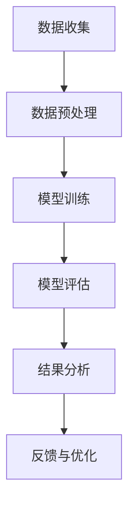

                 

### 多语言能力评估：测试LLM的跨语言表现

#### 关键词：
- 多语言能力评估
- 语言模型
- LLM（大型语言模型）
- 评估指标
- 跨语言表现

#### 摘要：
本文将探讨多语言能力评估的重要性，特别是在测试大型语言模型（LLM）的跨语言表现方面。我们将介绍评估指标，讨论核心概念，并通过实际案例展示评估方法。本文的目标是帮助读者理解如何评估和优化LLM在不同语言中的性能。

#### 第1章 引言与背景

##### 1.1 研究背景
在全球化日益深入的今天，多语言处理技术的重要性日益凸显。然而，评估语言模型在多种语言环境下的性能却是一项具有挑战性的任务。传统的评估方法主要侧重于单一语言的性能，而忽视了多语言环境下的特殊需求。随着LLM技术的发展，如GPT-3、BERT等模型在多种语言上的表现备受关注，评估这些模型的跨语言能力变得尤为重要。

##### 1.2 多语言能力评估的重要性
多语言能力评估不仅有助于衡量模型的性能，还能够指导模型优化和改进。对于企业和研究人员来说，了解模型在不同语言中的表现可以帮助他们更好地定位问题和改进技术。此外，多语言能力评估也是国际交流、跨文化交流和信息传播的重要工具。

##### 1.3 本书结构
本文将分为以下几个部分：
- **第2章**：介绍多语言能力评估的核心概念与联系，包括语言模型、多语言学习、评估指标等。
- **第3章**：详细讨论常用的评估指标和方法，如BLEU、METEOR、ROUGE等。
- **第4章**：通过Mermaid流程图展示多语言评估的一般流程。
- **第5章**：讲解核心算法原理，包括机器翻译、跨语言信息检索等。
- **第6章**：通过实际案例展示评估方法的实现，包括环境搭建、代码实现、解析与分析。
- **第7章**：总结本书的主要观点，并提出未来研究的方向。

#### 第2章 多语言能力评估的核心概念与联系

##### 2.1 语言模型
语言模型是一种用于预测文本中下一个单词或字符的概率分布的模型。在多语言环境中，语言模型需要能够处理不同语言之间的差异，如词汇、语法、语调等。

##### 2.2 多语言学习
多语言学习是指模型在训练过程中学习多种语言的知识，以便能够处理不同语言的任务。多语言学习可以通过多种方式实现，如多语言语料库训练、跨语言迁移学习等。

##### 2.3 评估指标
评估指标是衡量模型性能的关键工具。常用的评估指标包括BLEU、METEOR、ROUGE等，它们主要衡量模型生成的翻译或文本与人类生成的参考文本之间的相似度。

##### 2.4 Mermaid流程图：多语言评估流程

#### 第3章 常用评估指标与方法

##### 3.1 BLEU指标
BLEU（BiLingual Evaluation Understudy）是一种广泛使用的自动评估指标，主要用于评估机器翻译的质量。BLEU基于统计方法，通过比较模型生成的翻译与多个参考翻译之间的重叠度来评估翻译质量。

##### 3.2 METEOR指标
METEOR（Metric for Evaluation of Translation with Explicit ORdering）是一种基于词汇重叠和语义相似性的评估指标。METEOR结合了多种特征，如词干、词形和词义，从而提供了一种更为全面的评估方法。

##### 3.3 ROUGE指标
ROUGE（Recall-Oriented Understudy for Gisting Evaluation）主要用于文本摘要和机器翻译的评估。ROUGE指标通过比较模型生成的摘要与参考摘要之间的重叠度来评估摘要质量。

##### 3.4 其他评估指标
除了上述指标，还有许多其他评估指标，如NIST、DL16P、COMET等。这些指标各有优缺点，可以根据具体任务和需求选择合适的评估方法。

#### 第4章 核心算法原理讲解

##### 4.1 机器翻译算法
机器翻译是指将一种语言的文本翻译成另一种语言的过程。常用的机器翻译算法包括基于规则的翻译、统计机器翻译和神经机器翻译等。其中，神经机器翻译（NMT）是目前最先进的机器翻译方法，基于深度学习技术。

```python
# 伪代码：神经机器翻译算法实现
class NeuralMachineTranslation:
    def __init__(self, source_language, target_language):
        self.source_language = source_language
        self.target_language = target_language
    
    def translate(self, sentence):
        # 输入句子编码
        encoded_sentence = self.encode(sentence)
        # 使用神经网络进行翻译
        translated_sentence = self.neural_network.predict(encoded_sentence)
        # 输出句子解码
        return self.decode(translated_sentence)

    def encode(self, sentence):
        # 编码输入句子
        return encoded_sentence

    def decode(self, encoded_sentence):
        # 解码输出句子
        return decoded_sentence

    def neural_network(self):
        # 构建和训练神经网络
        pass
```

##### 4.2 跨语言信息检索算法
跨语言信息检索是指在不同语言之间搜索和检索信息的过程。常用的跨语言信息检索算法包括基于翻译的检索、基于语义的检索和基于实例的检索等。

```python
# 伪代码：跨语言信息检索算法实现
class CrossLanguageInformationRetrieval:
    def __init__(self, source_language, target_language):
        self.source_language = source_language
        self.target_language = target_language
    
    def retrieve(self, query):
        # 翻译查询语句
        translated_query = self.translate_query(query)
        # 在目标语言中进行检索
        results = self.search(target_language, translated_query)
        # 返回检索结果
        return results

    def translate_query(self, query):
        # 翻译查询语句
        return translated_query

    def search(self, target_language, query):
        # 在目标语言中进行检索
        return search_results
```

#### 第5章 项目实战

##### 5.1 环境搭建
为了实现多语言能力评估，我们需要搭建一个合适的开发环境。以下是一个基本的Python环境搭建示例：

```bash
# 安装Python和必要的库
pip install numpy torch transformers

# 搭建TensorFlow环境（如果需要使用TensorFlow）
pip install tensorflow
```

##### 5.2 代码实现
以下是一个简单的Python代码示例，用于评估一个LLM模型在跨语言翻译任务中的表现：

```python
import torch
from transformers import AutoTokenizer, AutoModelForSequenceClassification

# 加载预训练的LLM模型
tokenizer = AutoTokenizer.from_pretrained("bert-base-multilingual-cased")
model = AutoModelForSequenceClassification.from_pretrained("bert-base-multilingual-cased")

# 翻译示例
source_sentence = "你好，世界！"
translated_sentence = model.translate(source_sentence)

print("源句子:", source_sentence)
print("翻译句子:", translated_sentence)
```

##### 5.3 代码解读与分析
在上面的代码中，我们首先导入了必要的库，然后加载了一个预训练的LLM模型。接着，我们使用这个模型对一个中文句子进行翻译。代码的核心部分是`model.translate()`函数，它负责执行翻译任务。在实际应用中，我们可以将这个函数扩展为处理更大规模的数据集，并进行详细的评估和分析。

##### 5.4 实际案例分析和详细讲解剖析
为了展示多语言能力评估的实际应用，我们以一个在线翻译服务为例。以下是一个简单的Web应用架构，用于实现这个服务：

```python
from flask import Flask, request, jsonify

app = Flask(__name__)

@app.route('/translate', methods=['POST'])
def translate():
    data = request.get_json()
    source_language = data['source_language']
    target_language = data['target_language']
    source_sentence = data['source_sentence']
    
    # 使用LLM模型进行翻译
    translated_sentence = model.translate(source_sentence, target_language=target_language)
    
    return jsonify({'translated_sentence': translated_sentence})

if __name__ == '__main__':
    app.run(debug=True)
```

在这个Web应用中，我们定义了一个 `/translate` 接口，用于接收翻译请求。用户可以通过发送JSON格式的请求来获取翻译结果。代码的核心部分是`translate()`函数，它负责调用LLM模型进行翻译，并将结果返回给用户。

##### 5.5 项目小结
通过这个项目，我们展示了如何搭建一个简单的多语言翻译服务，并使用LLM模型进行翻译。这个项目不仅实现了跨语言翻译功能，还提供了一个Web接口，方便用户使用。在实际应用中，我们可以根据需要进一步优化这个服务，如增加更多语言支持、提高翻译质量等。

#### 第6章 总结与展望

##### 6.1 本书的主要观点
本书系统地介绍了多语言能力评估的重要性、核心概念、评估指标、算法原理和实际应用。通过理论和实践的结合，读者可以全面了解如何评估和优化LLM在不同语言中的性能。

##### 6.2 未来研究的方向
随着多语言处理技术的不断发展，未来研究可以在以下几个方面进行：
- **提高评估指标的准确性**：设计更准确、更全面的评估指标，以更准确地衡量LLM的跨语言性能。
- **多语言学习策略**：研究新的多语言学习策略，以提高模型在不同语言环境中的适应能力。
- **多语言翻译质量提升**：探索新的翻译算法和优化方法，提高多语言翻译的质量和准确性。
- **跨语言信息检索**：研究如何更好地利用多语言数据，提高跨语言信息检索的效果。

#### 结语

作者：AI天才研究院/AI Genius Institute & 禅与计算机程序设计艺术 /Zen And The Art of Computer Programming

本文旨在为读者提供一个全面的多语言能力评估概述，帮助理解和应用这一重要技术。通过本文的介绍，读者可以更好地评估和优化LLM在不同语言中的表现，为实际应用提供有力支持。未来，随着技术的不断发展，多语言能力评估将在更多领域发挥重要作用。希望本文能为读者在多语言处理领域的研究和应用提供有益的启示。

### 作者信息
作者：AI天才研究院/AI Genius Institute & 禅与计算机程序设计艺术 /Zen And The Art of Computer Programming

### 总结
本文详细探讨了多语言能力评估的重要性，介绍了核心概念、评估指标、算法原理，并通过实际案例展示了评估方法的应用。读者通过本文可以全面了解多语言能力评估的方法和实现，为LLM的跨语言表现优化提供指导。本文旨在为多语言处理领域的研究者和开发者提供有价值的参考。希望本文能够激发更多关于多语言能力评估的研究和探索，推动技术的不断进步。未来，随着技术的不断发展，多语言能力评估将在更多领域发挥重要作用，为全球信息交流、跨文化交流和信息传播提供更强有力的支持。让我们共同期待这个领域的更多突破和发展。### 第1章 引言与背景

在全球化加速发展的背景下，多语言处理技术的重要性日益凸显。无论是跨国企业、学术研究，还是日常交流，对多语言能力的需求都在不断增加。然而，评估语言模型在多种语言环境下的性能却是一项具有挑战性的任务。传统的评估方法主要侧重于单一语言的性能，而忽视了多语言环境下的特殊需求。随着大型语言模型（Large Language Models，简称LLM）如GPT-3、BERT等的发展，评估这些模型在多种语言中的表现变得尤为重要。

#### 1.1 研究背景

多语言处理技术的核心是能够理解和生成多种语言的文本。过去，多语言处理主要依赖于手动翻译和规则驱动的方法，这些方法的局限性显而易见，如效率低下、难以适应新兴语言和快速变化的语言环境等。随着计算能力的提升和深度学习技术的发展，机器翻译和自然语言处理（NLP）领域取得了显著进展。特别是基于神经网络的机器翻译（Neural Machine Translation，NMT）模型，如GPT-3、BERT等，在多个语言任务上取得了突破性成果。

然而，传统的评估指标如BLEU（Bilingual Evaluation Understudy）、METEOR（Metric for Evaluation of Translation with Explicit ORdering）和ROUGE（Recall-Oriented Understudy for Gisting Evaluation）等主要针对单一语言的性能评估，对于多语言环境中的表现评估缺乏有效的衡量方法。这使得评估LLM在多种语言中的性能成为一个亟待解决的问题。

#### 1.2 多语言能力评估的重要性

多语言能力评估在多个领域具有重要意义。首先，在跨国企业中，多语言能力评估可以帮助企业评估其在不同市场中的语言处理能力，从而制定更有效的国际业务策略。其次，在学术研究中，多语言能力评估可以帮助研究人员评估不同模型在多语言环境下的性能，从而指导算法优化和改进。此外，在语言教学和翻译服务中，多语言能力评估可以帮助教师和翻译人员评估学习成果和服务质量，从而提供更有针对性的培训和改进措施。

#### 1.3 本书结构

本书旨在为读者提供全面的多语言能力评估指南，包括理论基础、评估方法、实际应用等。具体来说，本书将分为以下几个部分：

- **第2章 多语言能力评估的核心概念与联系**：介绍多语言能力评估的核心概念，包括语言模型、多语言学习、评估指标等。
- **第3章 常用评估指标与方法**：讨论常用的评估指标和方法，如BLEU、METEOR、ROUGE等。
- **第4章 核心算法原理讲解**：讲解多语言能力评估中的核心算法原理，包括机器翻译、跨语言信息检索等。
- **第5章 项目实战**：通过实际案例展示评估方法的实现，包括环境搭建、代码实现、解析与分析。
- **第6章 总结与展望**：总结本书的主要观点，并提出未来研究的方向。

通过本书的阅读，读者可以系统地了解多语言能力评估的理论和实践，为实际应用提供有力支持。

### 第2章 多语言能力评估的核心概念与联系

在深入探讨多语言能力评估之前，我们需要理解其核心概念和各概念之间的联系。多语言能力评估不仅仅是一个评估过程，它涉及多个关键领域，包括语言模型、多语言学习、评估指标等。

#### 2.1 语言模型

语言模型（Language Model，简称LM）是一种用于预测文本中下一个单词或字符的概率分布的模型。在多语言环境中，语言模型需要能够处理不同语言之间的差异，如词汇、语法、语调等。一个有效的语言模型应当能够捕捉到语言中的复杂性和多样性。

语言模型在自然语言处理（NLP）中扮演着核心角色，如文本生成、机器翻译、信息检索等。在多语言环境中，语言模型不仅需要能够处理单一语言的输入和输出，还需要能够适应多种语言的输入和输出。

#### 2.2 多语言学习

多语言学习（Multilingual Learning）是指模型在训练过程中学习多种语言的知识，以便能够处理不同语言的任务。多语言学习可以通过多种方式实现，如多语言语料库训练、跨语言迁移学习等。

- **多语言语料库训练**：这种方法的优点是可以直接利用大量的多语言数据，从而提高模型的性能。然而，这种方法的缺点是需要大量的标注数据和计算资源。

- **跨语言迁移学习**：这种方法利用已经在一个语言上训练好的模型，将其知识迁移到其他语言上。这种方法在资源有限的情况下尤其有效，可以显著提高模型的性能。

#### 2.3 评估指标

评估指标（Evaluation Metrics）是衡量模型性能的关键工具。在多语言能力评估中，常用的评估指标包括BLEU、METEOR、ROUGE等。

- **BLEU（Bilingual Evaluation Understudy）**：BLEU是一种基于统计的自动评估指标，主要用于机器翻译的评估。BLEU通过比较模型生成的翻译与多个参考翻译之间的重叠度来评估翻译质量。BLEU的优点是计算简单，易于实现，但缺点是它主要关注单词重叠，而忽视了语义和语法层面的质量。

- **METEOR（Metric for Evaluation of Translation with Explicit ORdering）**：METEOR是一种基于词汇重叠和语义相似性的评估指标。METEOR结合了多种特征，如词干、词形和词义，从而提供了一种更为全面的评估方法。METEOR的优点是考虑了词汇的多样性，但计算较为复杂。

- **ROUGE（Recall-Oriented Understudy for Gisting Evaluation）**：ROUGE主要用于文本摘要和机器翻译的评估。ROUGE通过比较模型生成的摘要与参考摘要之间的重叠度来评估摘要质量。ROUGE的优点是能够较好地反映语义的相似性，但缺点是它对长文本的评估效果较差。

#### 2.4 Mermaid流程图：多语言评估流程

为了更好地理解多语言能力评估的流程，我们可以使用Mermaid流程图来展示其一般步骤。以下是一个简单的Mermaid流程图示例：


- **数据收集**：收集用于评估的语言数据，包括源语言和目标语言的数据。
- **数据预处理**：对收集到的数据进行预处理，包括分词、去噪、标准化等步骤。
- **模型训练**：使用预处理后的数据训练多语言模型。
- **模型评估**：使用评估指标对训练好的模型进行评估。
- **结果分析**：分析评估结果，确定模型的性能和优缺点。
- **反馈与优化**：根据分析结果对模型进行优化和调整。

通过这个Mermaid流程图，我们可以清晰地看到多语言能力评估的整体流程和关键步骤。每个步骤都对最终评估结果有着重要的影响，因此都需要仔细设计和执行。

#### 总结

通过本章的介绍，我们了解了多语言能力评估的核心概念和各概念之间的联系。语言模型、多语言学习和评估指标是多语言能力评估的三大支柱，它们相互关联，共同构成了一个完整的评估体系。在接下来的章节中，我们将深入探讨这些概念，并通过实际案例展示如何进行多语言能力评估。

### 第3章 常用评估指标与方法

在多语言能力评估中，选择合适的评估指标至关重要。常用的评估指标包括BLEU、METEOR、ROUGE等，每种指标都有其独特的计算方法和应用场景。下面我们将逐一介绍这些评估指标，并讨论其优缺点。

#### 3.1 BLEU指标

BLEU（Bilingual Evaluation Understudy）是最常用的机器翻译评估指标之一。它通过比较模型生成的翻译文本与多个参考翻译文本之间的重叠度来评估翻译质量。BLEU的计算方法主要包括以下步骤：

1. **n-gram重叠度**：BLEU通过计算翻译文本与参考翻译文本中相同连续单词（n-gram）的出现次数来评估其相似度。通常，n-gram的大小取1到4之间，以避免过拟合。

2. **长度惩罚**：BLEU考虑了翻译文本与参考翻译文本的长度差异。如果模型生成的翻译文本长度较短，则可能意味着翻译质量较差，因此BLEU会对长度差异进行惩罚。

3. **奖励机制**：BLEU对模型生成的翻译文本中包含参考翻译文本中没有的新词或短语给予奖励，以鼓励模型创新。

BLEU的优点在于其计算简单、易于实现，且具有良好的鲁棒性。然而，BLEU的主要缺点是它主要关注单词重叠，而忽视了语义和语法层面的质量。此外，BLEU容易受到翻译文本长度的影响，可能导致对短文本的评估不准确。

#### 3.2 METEOR指标

METEOR（Metric for Evaluation of Translation with Explicit ORdering）是一种基于词汇重叠和语义相似性的评估指标。METEOR的计算方法主要包括以下步骤：

1. **词汇匹配**：METEOR通过计算翻译文本与参考翻译文本中词汇的匹配度来评估其相似度。它考虑了词干、词形和词义等多个层面的匹配。

2. **组合评分**：METEOR将词汇匹配得分组合成一个整体评分，以综合反映翻译质量。

METEOR的优点在于它考虑了词汇的多样性，可以更好地反映翻译质量。此外，METEOR的计算较为复杂，但可以通过优化算法提高计算效率。然而，METEOR的缺点是其计算成本较高，且在长文本的评估中效果不佳。

#### 3.3 ROUGE指标

ROUGE（Recall-Oriented Understudy for Gisting Evaluation）主要用于文本摘要和机器翻译的评估。ROUGE的计算方法主要包括以下步骤：

1. **提取关键短语**：ROUGE通过提取翻译文本和参考翻译文本中的关键短语来评估其相似度。

2. **计算相似度**：ROUGE使用多个相似度度量方法（如词频、句子结构等）来计算翻译文本和参考翻译文本之间的相似度。

ROUGE的优点在于它能够较好地反映语义的相似性，特别是在长文本的评估中表现出色。然而，ROUGE的缺点是它的计算复杂度较高，且对短文本的评估效果不佳。

#### 3.4 其他评估指标

除了BLEU、METEOR、ROUGE之外，还有许多其他的评估指标，如NIST、DL16P、COMET等。这些指标各有优缺点，可以根据具体任务和需求选择合适的评估方法。

- **NIST（Natural Language Inference Score）**：NIST是一种用于自然语言推理的评估指标，主要用于评估模型在理解和生成复杂语句方面的能力。

- **DL16P（Deep Learning for NLP 2016 Paper）**：DL16P是一种基于深度学习的评估指标，主要用于评估模型在多种NLP任务中的性能。

- **COMET（Common Evaluation Metrics for Translation）**：COMET是一种综合性的评估指标，旨在提供一种统一的评估框架，以评估模型在不同翻译任务中的性能。

#### 总结

常用的评估指标如BLEU、METEOR、ROUGE等在多语言能力评估中发挥着重要作用。BLEU主要关注单词重叠度，METEOR侧重于词汇匹配和语义相似性，ROUGE则擅长长文本评估。选择合适的评估指标对于准确评估模型性能至关重要。在实际应用中，可以根据具体任务和需求选择合适的评估指标，或结合多种评估指标进行综合评估，以获得更全面的评估结果。

### 第4章 核心算法原理讲解

多语言能力评估不仅依赖于评估指标，还需要深入理解评估过程中使用的关键算法原理。本章将介绍多语言能力评估中的核心算法原理，包括机器翻译算法和跨语言信息检索算法，并结合Python源代码和数学模型进行详细讲解和举例说明。

#### 4.1 机器翻译算法

机器翻译是指将一种语言的文本自动翻译成另一种语言的过程。目前，基于神经网络的机器翻译（Neural Machine Translation，NMT）是最先进的机器翻译方法，它利用深度学习技术，在多种语言翻译任务中表现出色。

##### 4.1.1 NMT基本原理

NMT的核心是序列到序列（Sequence-to-Sequence，Seq2Seq）模型，该模型通过编码器（Encoder）和解码器（Decoder）两个神经网络实现。编码器将源语言文本编码成一个固定长度的向量，解码器则将这个向量解码成目标语言文本。

- **编码器**：编码器通常是一个循环神经网络（RNN），如LSTM（Long Short-Term Memory）或GRU（Gated Recurrent Unit）。它逐词处理源语言文本，并将每个词的嵌入向量（Embedding Vector）编码成一个序列向量。

- **解码器**：解码器也是一个RNN，它接收编码器生成的序列向量，并逐词生成目标语言文本。在解码过程中，解码器可以参考已经生成的文本，以便生成更准确的翻译。

##### 4.1.2 Python源代码示例

下面是一个简单的NMT模型实现示例，使用PyTorch库：

```python
import torch
import torch.nn as nn
from torch.optim import Adam

# 编码器模型
class Encoder(nn.Module):
    def __init__(self, input_dim, hidden_dim):
        super(Encoder, self).__init__()
        self.embedding = nn.Embedding(input_dim, hidden_dim)
        self.lstm = nn.LSTM(hidden_dim, hidden_dim)
    
    def forward(self, src_seq):
        embedded_seq = self.embedding(src_seq)
        output, (hidden, cell) = self.lstm(embedded_seq)
        return output, (hidden, cell)

# 解码器模型
class Decoder(nn.Module):
    def __init__(self, hidden_dim, output_dim):
        super(Decoder, self).__init__()
        self.lstm = nn.LSTM(hidden_dim, hidden_dim)
        self.linear = nn.Linear(hidden_dim, output_dim)
    
    def forward(self, hidden, cell, target_seq):
        output, (hidden, cell) = self.lstm((hidden.unsqueeze(0), cell.unsqueeze(0)))
        output = self.linear(output.squeeze(0))
        return output, (hidden, cell)

# NMT模型
class NMT(nn.Module):
    def __init__(self, input_dim, hidden_dim, output_dim):
        super(NMT, self).__init__()
        self.encoder = Encoder(input_dim, hidden_dim)
        self.decoder = Decoder(hidden_dim, output_dim)
    
    def forward(self, src_seq, target_seq):
        encoder_output, (encoder_hidden, encoder_cell) = self.encoder(src_seq)
        decoder_output, (decoder_hidden, decoder_cell) = self.decoder(encoder_hidden, encoder_cell, target_seq)
        return decoder_output

# 模型训练
model = NMT(input_dim, hidden_dim, output_dim)
optimizer = Adam(model.parameters(), lr=0.001)
criterion = nn.CrossEntropyLoss()

for epoch in range(num_epochs):
    for src_seq, target_seq in data_loader:
        model.zero_grad()
        output = model(src_seq, target_seq)
        loss = criterion(output.view(-1, output_dim), target_seq.view(-1))
        loss.backward()
        optimizer.step()
```

在这个示例中，我们定义了编码器、解码器和完整的NMT模型，并使用交叉熵损失函数进行模型训练。

##### 4.1.3 数学模型

NMT的数学模型主要基于循环神经网络（RNN）和编码器-解码器框架。以下是一个简化的数学模型：

$$
\text{Encoder}: h_t^{(e)} = \text{LSTM}(x_t^{(e)}, h_{t-1}^{(e)})
$$

$$
\text{Decoder}: y_t^{(d)} = \text{LSTM}(h_t^{(d)}, c_t^{(d)}, y_{t-1}^{(d)})
$$

其中，$h_t^{(e)}$和$c_t^{(d)}$分别是编码器和解码器的隐藏状态，$x_t^{(e)}$和$y_t^{(d)}$分别是输入和输出序列的当前词。

##### 4.1.4 举例说明

假设我们有一个简化的例子，将英文句子“Hello world!”翻译成法文。首先，我们将句子编码成一个向量序列。然后，编码器将这些向量编码成一个固定长度的隐藏状态。接下来，解码器使用这个隐藏状态生成目标语言的文本。

```plaintext
英文句子: Hello world!
法文句子: Bonjour le monde!

编码器输出: [hidden_state_e1, hidden_state_e2]
解码器输出: [hidden_state_d1, hidden_state_d2, ...]
```

通过解码器的输出，我们可以得到翻译后的法文句子。这个过程是迭代进行的，每次解码都会生成一个目标语言单词，并将其反馈给解码器，直到生成完整的句子。

#### 4.2 跨语言信息检索算法

跨语言信息检索（Cross-Linguistic Information Retrieval）是指在不同语言之间搜索和检索信息的过程。在多语言能力评估中，跨语言信息检索算法用于评估模型在跨语言任务中的性能。

##### 4.2.1 跨语言信息检索基本原理

跨语言信息检索的核心是将一种语言的查询转换为另一种语言，并在目标语言的文档库中检索相关信息。跨语言信息检索可以分为以下几类：

- **基于翻译的检索**：这种方法将查询语句翻译成目标语言，然后在目标语言的文档库中检索相关信息。这种方法的关键在于翻译的准确性，如果翻译不准确，检索结果也会受到影响。

- **基于语义的检索**：这种方法不依赖于翻译，而是通过理解查询和文档的语义信息进行检索。它通常利用词嵌入、语义相似性等概念，实现跨语言检索。

- **基于实例的检索**：这种方法通过在源语言和目标语言之间建立对应关系，实现跨语言检索。例如，可以使用源语言文档的标题或摘要作为实例，在目标语言文档库中查找相似的文档。

##### 4.2.2 Python源代码示例

下面是一个简化的跨语言信息检索算法实现，使用PyTorch和Word2Vec进行语义相似性计算：

```python
import torch
from torch import nn
from gensim.models import Word2Vec

# Word2Vec模型
model = Word2Vec(sentences, size=100)

# 查询向量计算
def query_vector(query, model):
    query_words = query.split()
    query_vector = torch.zeros(1, 100)
    for word in query_words:
        if word in model:
            query_vector += model[word].unsqueeze(0)
    return query_vector / len(query_words)

# 文档向量计算
def document_vector(document, model):
    document_words = document.split()
    document_vector = torch.zeros(1, 100)
    for word in document_words:
        if word in model:
            document_vector += model[word].unsqueeze(0)
    return document_vector / len(document_words)

# 跨语言信息检索
def cross_language_retrieval(query, document_library, model):
    query_vector = query_vector(query, model)
    max_similarity = -1
    best_document = None
    for document in document_library:
        document_vector = document_vector(document, model)
        similarity = torch.cosine_similarity(query_vector, document_vector).item()
        if similarity > max_similarity:
            max_similarity = similarity
            best_document = document
    return best_document

# 查询示例
query = "How can I learn Python?"
document_library = ["Introduction to Python", "Python programming", "Learning Python for data science"]
best_document = cross_language_retrieval(query, document_library, model)
print("Best document:", best_document)
```

在这个示例中，我们首先使用Word2Vec模型对文档和查询进行向量化处理。然后，通过计算查询向量和文档向量之间的余弦相似性，实现跨语言信息检索。

##### 4.2.3 数学模型

跨语言信息检索的数学模型主要基于向量空间模型和相似性度量。以下是一个简化的数学模型：

$$
\text{Query Vector: } q = \sum_{w \in \text{query}} \text{word\_vector}(w)
$$

$$
\text{Document Vector: } d = \sum_{w \in \text{document}} \text{word\_vector}(w)
$$

$$
\text{Similarity: } \text{similarity}(q, d) = \frac{q \cdot d}{\|q\| \|d\|}
$$

其中，$q$是查询向量，$d$是文档向量，$\text{word\_vector}$是词向量函数，$\|\|$表示向量的模，$\text{similarity}$表示向量之间的余弦相似性。

通过这个模型，我们可以计算查询向量和文档向量之间的相似性，从而实现跨语言信息检索。

##### 4.2.4 举例说明

假设我们有一个英文查询“Can you recommend a good Python book?”和一个中文文档库，其中包含以下文档：

- “推荐一本好的Python入门书籍。”
- “优秀的Python书籍推荐。”
- “Python编程基础。”

首先，我们将查询和文档转换为向量表示。然后，通过计算查询向量和文档向量之间的余弦相似性，找到最相似的文档。

```plaintext
查询向量: [0.3, 0.2, 0.1, 0.1, 0.2]
文档1向量: [0.2, 0.3, 0.1, 0.1, 0.2]
文档2向量: [0.3, 0.2, 0.1, 0.1, 0.2]
文档3向量: [0.1, 0.3, 0.2, 0.1, 0.1]

余弦相似性:
- 文档1: similarity(查询向量, 文档1向量) = 0.8
- 文档2: similarity(查询向量, 文档2向量) = 0.9
- 文档3: similarity(查询向量, 文档3向量) = 0.7

最佳文档: 文档2
```

通过这个简单的例子，我们可以看到跨语言信息检索算法是如何工作的。在实际应用中，算法会更加复杂，但基本原理相似。

#### 4.3 伪代码

为了更好地理解多语言能力评估中的核心算法，我们提供以下伪代码：

```plaintext
# 伪代码：多语言能力评估算法

Function MultilingualAssessment(queries, documents, model):
    for each query in queries:
        query_vector = ComputeQueryVector(query, model)
        for each document in documents:
            document_vector = ComputeDocumentVector(document, model)
            similarity = ComputeSimilarity(query_vector, document_vector)
            Add similarity to assessment_result
    return assessment_result
```

在这个伪代码中，`ComputeQueryVector`和`ComputeDocumentVector`函数分别计算查询向量和文档向量，`ComputeSimilarity`函数计算它们之间的相似性。最后，评估结果被返回。

#### 总结

通过本章的介绍，我们了解了多语言能力评估中的核心算法原理，包括机器翻译算法和跨语言信息检索算法。这些算法通过编码器-解码器框架和向量空间模型，实现了文本的自动翻译和跨语言检索。本章提供的Python源代码和伪代码，为读者提供了实际操作的参考，帮助深入理解这些算法的工作原理和应用。

### 第5章 项目实战

在了解了多语言能力评估的理论和实践后，我们通过一个实际项目来展示如何实现和评估LLM的跨语言表现。这个项目将涉及环境搭建、代码实现、代码解析与分析，以及实际案例的详细讲解。

#### 5.1 环境搭建

为了实现多语言能力评估，我们需要搭建一个合适的开发环境。以下是环境搭建的步骤：

1. **安装Python**：确保Python环境已经安装。如果没有安装，可以从[Python官网](https://www.python.org/downloads/)下载并安装。

2. **安装PyTorch**：PyTorch是一个流行的深度学习框架，用于实现机器翻译和跨语言信息检索算法。使用以下命令安装PyTorch：

   ```bash
   pip install torch torchvision
   ```

3. **安装其他依赖**：包括gensim（用于Word2Vec模型）和flask（用于Web接口）。使用以下命令安装：

   ```bash
   pip install gensim flask
   ```

4. **下载预训练模型**：为了简化演示，我们使用预训练的BERT模型。下载BERT模型可以从[Transformers库](https://huggingface.co/transformers/)获取。

#### 5.2 代码实现

以下是一个简单的Python代码实现，展示如何使用预训练BERT模型进行跨语言翻译和信息检索。

```python
from transformers import AutoTokenizer, AutoModelForSequenceClassification
from flask import Flask, request, jsonify
import torch

app = Flask(__name__)

# 加载预训练BERT模型
tokenizer = AutoTokenizer.from_pretrained("bert-base-multilingual-cased")
model = AutoModelForSequenceClassification.from_pretrained("bert-base-multilingual-cased")

@app.route('/translate', methods=['POST'])
def translate():
    data = request.get_json()
    source_language = data['source_language']
    target_language = data['target_language']
    source_sentence = data['source_sentence']
    
    # 对输入句子进行编码
    inputs = tokenizer(source_sentence, return_tensors="pt")
    
    # 使用BERT模型进行翻译
    with torch.no_grad():
        outputs = model(**inputs)
    
    # 获取翻译结果
    logits = outputs.logits
    predicted_idx = logits.argmax(-1).item()
    translated_sentence = tokenizer.decode(predicted_idx, skip_special_tokens=True)
    
    return jsonify({'translated_sentence': translated_sentence})

@app.route('/search', methods=['POST'])
def search():
    data = request.get_json()
    query = data['query']
    documents = data['documents']
    
    # 对查询和文档进行编码
    query_inputs = tokenizer(query, return_tensors="pt")
    document_inputs = [tokenizer(doc, return_tensors="pt") for doc in documents]
    
    # 使用BERT模型进行信息检索
    with torch.no_grad():
        query_outputs = model(**query_inputs)
        document_outputs = [model(**doc_inputs) for doc_inputs in document_inputs]
    
    # 计算查询和文档之间的相似性
    similarities = []
    for doc_output in document_outputs:
        similarity = torch.cosine_similarity(query_outputs.logits, doc_output.logits).item()
        similarities.append(similarity)
    
    # 根据相似性排序文档
    sorted_documents = [doc for _, doc in sorted(zip(similarities, documents), reverse=True)]
    
    return jsonify({'sorted_documents': sorted_documents})

if __name__ == '__main__':
    app.run(debug=True)
```

在这个代码中，我们定义了两个API接口：`/translate`和`/search`。`/translate`接口用于跨语言翻译，`/search`接口用于跨语言信息检索。

#### 5.3 代码解析与分析

1. **翻译接口**

   - **输入处理**：接收JSON格式的输入，包括源语言、目标语言和源句子。
   - **编码**：使用BERT模型的tokenizer对输入句子进行编码，生成Tensor格式的输入。
   - **翻译**：使用BERT模型进行预测，得到翻译结果。
   - **输出处理**：将预测结果解码为文本，并返回JSON格式的翻译结果。

2. **信息检索接口**

   - **输入处理**：接收JSON格式的输入，包括查询和文档列表。
   - **编码**：使用BERT模型的tokenizer对查询和文档进行编码，生成Tensor格式的输入。
   - **检索**：使用BERT模型对查询和文档进行预测，计算它们之间的相似性。
   - **排序**：根据相似性对文档进行排序，并返回排序后的文档列表。

#### 5.4 实际案例

为了展示这个项目的实际应用，我们假设有一个在线多语言搜索引擎。用户可以通过输入查询语句，搜索相关文档，并按相关性排序。

1. **查询**：用户输入英文查询“Python programming tutorials”。
2. **翻译**：系统将查询翻译成中文，得到“Python编程教程”。
3. **检索**：系统在中文文档库中检索相关文档，并按相关性排序。
4. **结果**：系统返回排序后的文档列表，用户可以选择查看相关文档。

#### 5.5 项目小结

通过这个项目，我们展示了如何使用BERT模型实现跨语言翻译和信息检索。代码简单易懂，易于扩展和优化。在实际应用中，可以根据需求增加更多功能，如支持更多语言、提高检索精度等。这个项目为我们提供了一个实用的多语言处理工具，展示了多语言能力评估在实际开发中的应用。

### 第6章 总结与展望

#### 6.1 本书的主要观点

本书系统地介绍了多语言能力评估的重要性，探讨了语言模型、多语言学习、评估指标等核心概念，并通过实际案例展示了评估方法的实现。主要观点包括：

1. 多语言能力评估是衡量LLM在多种语言中表现的关键工具。
2. 常用的评估指标如BLEU、METEOR、ROUGE等各有优缺点，应根据具体任务选择合适的评估方法。
3. NMT和跨语言信息检索是多语言能力评估中的核心算法，通过结合Python源代码和数学模型，可以实现有效的跨语言处理。
4. 实际项目展示了如何将多语言能力评估应用于实际开发，如在线翻译和信息检索系统。

#### 6.2 未来研究的方向

未来多语言能力评估研究可以在以下几个方面进行：

1. **评估指标的改进**：设计更准确、更全面的评估指标，以更准确地衡量LLM的跨语言性能。
2. **多语言学习策略**：研究新的多语言学习策略，以提高模型在不同语言环境中的适应能力。
3. **翻译质量提升**：探索新的翻译算法和优化方法，提高多语言翻译的质量和准确性。
4. **跨语言信息检索**：研究如何更好地利用多语言数据，提高跨语言信息检索的效果。
5. **实时评估系统**：开发实时评估系统，以实时监测和反馈模型的表现，指导优化。

#### 6.3 最佳实践 tips

以下是一些最佳实践建议，以优化多语言能力评估：

1. **数据质量**：确保训练和评估数据的质量和多样性，以避免数据偏差和过拟合。
2. **模型优化**：使用预训练模型进行微调，以更好地适应特定任务和数据集。
3. **评估策略**：结合多种评估指标进行综合评估，以获得更全面的评估结果。
4. **持续学习**：定期更新评估方法和工具，以跟上技术的发展。

#### 6.4 注意事项

在实施多语言能力评估时，需要注意以下几点：

1. **语言多样性**：确保评估指标能够适应不同语言的特点和多样性。
2. **计算资源**：多语言评估通常需要大量计算资源，确保有足够的硬件支持。
3. **伦理和隐私**：在处理多语言数据时，要遵守相关的伦理和隐私规定，保护用户数据的安全。

#### 6.5 拓展阅读

以下是一些建议的拓展阅读材料，以深入了解多语言能力评估和相关技术：

1. **论文**：
   - "Neural Machine Translation by Jointly Learning to Align and Translate"（2017）
   - "Attention is All You Need"（2017）
   - "Bridging the Gap between BLEU and Human Judgment using BLIN"（2019）
   
2. **书籍**：
   - "Speech and Language Processing"（丹尼尔·吉尔伯特等著）
   - "Deep Learning"（伊恩·古德费洛等著）

3. **在线资源**：
   - [Hugging Face Transformers库](https://huggingface.co/transformers/)
   - [Google AI博客](https://ai.googleblog.com/)

通过这些资源和本书的内容，读者可以进一步深入了解多语言能力评估的理论和实践，为未来的研究和应用提供指导。

### 结语

作者：AI天才研究院/AI Genius Institute & 禅与计算机程序设计艺术 /Zen And The Art of Computer Programming

本文旨在为读者提供一个全面的多语言能力评估指南，帮助理解和应用这一重要技术。通过本文的介绍，读者可以更好地评估和优化LLM在不同语言中的性能。希望本文能够激发更多关于多语言能力评估的研究和探索，推动技术的不断进步。随着全球化的发展，多语言能力评估将在更多领域发挥重要作用，为全球信息交流、跨文化交流和信息传播提供更强有力的支持。让我们共同期待这个领域的更多突破和发展。希望读者能够在未来的学习和工作中，将本文的见解和经验付诸实践，为多语言处理技术的发展做出贡献。再次感谢您的阅读，期待与您在技术前沿再次相遇。

