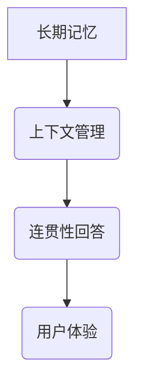
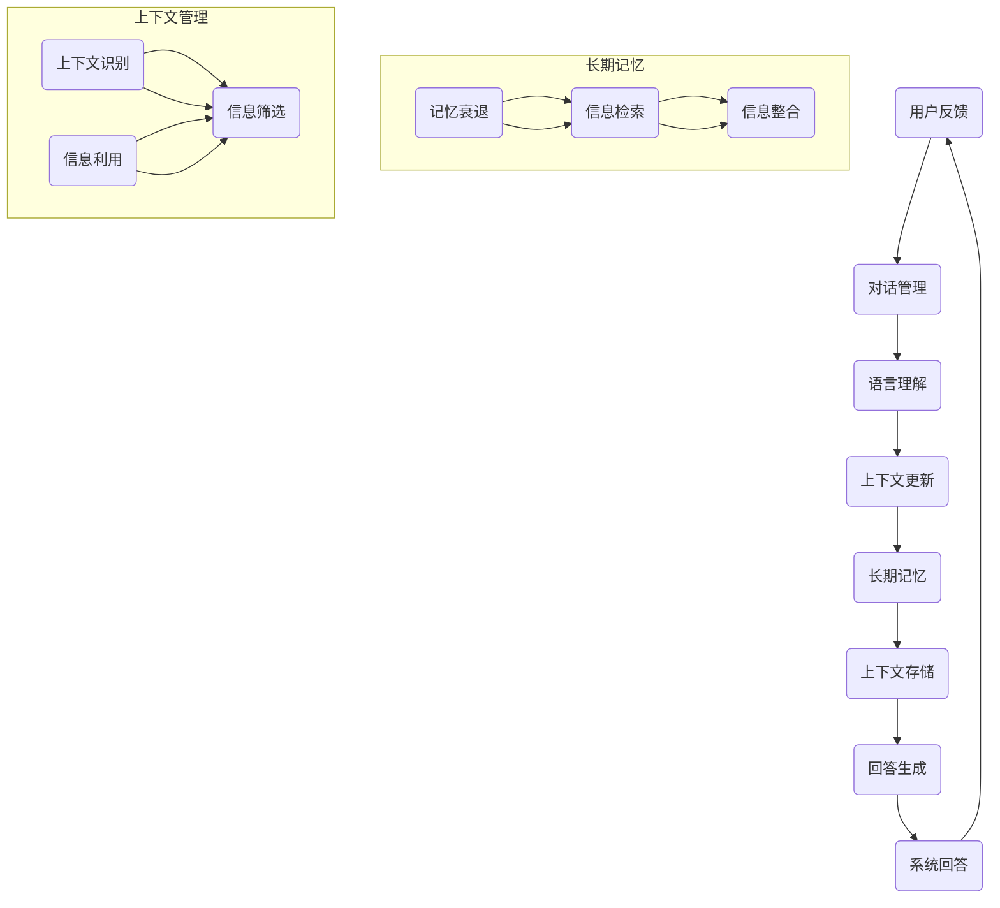
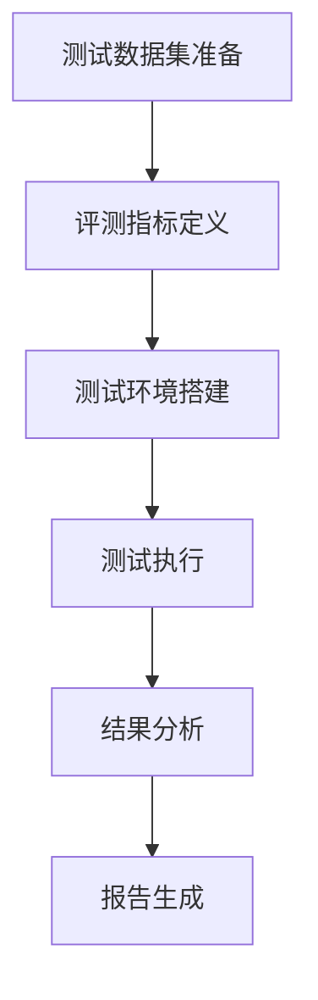
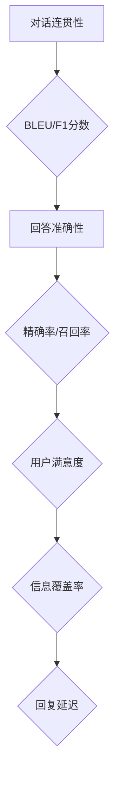
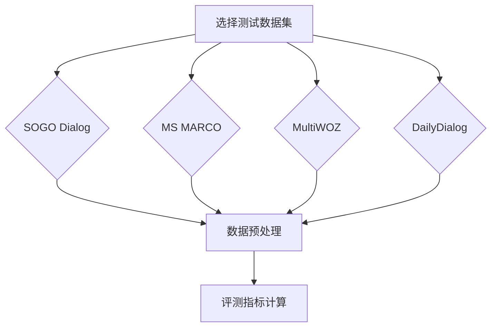
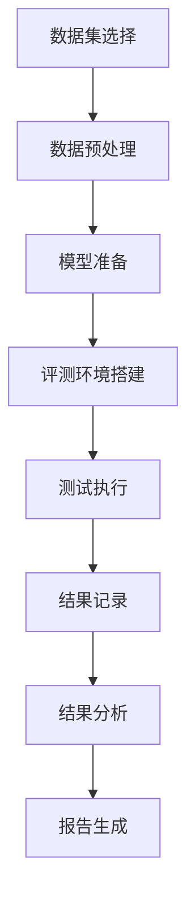

                 

### 引言

随着人工智能技术的飞速发展，自然语言处理（NLP）领域的进步尤为显著。特别是大型语言模型（Large Language Models，LLM）的兴起，为多轮对话系统的研究和应用提供了强有力的技术支撑。然而，LLM在实际应用中面临的长期记忆和上下文管理问题，依然是一个亟待解决的挑战。本文旨在探讨多轮对话评测，通过深入分析长期记忆和上下文管理，评估LLM的性能，并提出优化策略。

多轮对话评测不仅对LLM的开发和优化具有重要指导意义，也是NLP领域研究的热点问题。通过对LLM在多轮对话中的长期记忆和上下文管理能力进行评测，可以帮助我们更好地理解其内部机制，进而提升对话系统的质量和用户体验。本文将系统性地介绍多轮对话评测的背景、理论基础、评测方法、应用实践以及未来研究方向，以期对多轮对话评测的研究和应用提供有力支持。

本文结构如下：

1. **介绍**：介绍多轮对话评测的背景和意义，定义相关核心概念。
2. **理论基础**：阐述多轮对话系统的基础知识，包括长期记忆和上下文管理。
3. **评测方法**：详细讲解多轮对话评测的流程、评价指标和测试数据集。
4. **应用实践**：通过实际案例展示多轮对话评测的方法和效果。
5. **优化策略**：讨论如何优化LLM的长期记忆和上下文管理能力。
6. **未来研究方向**：展望多轮对话评测的挑战和发展趋势。
7. **总结**：总结全文内容，强调研究意义和实际应用价值。

### 关键词

- **多轮对话评测**
- **长期记忆**
- **上下文管理**
- **LLM**
- **评测指标**
- **优化策略**

### 摘要

本文围绕多轮对话评测，探讨了长期记忆和上下文管理对LLM性能的影响。首先介绍了多轮对话评测的背景和意义，随后详细阐述了多轮对话系统的理论基础，包括长期记忆和上下文管理的基本概念。接着，本文介绍了多轮对话评测的流程、评价指标和测试数据集，并通过实际案例展示了评测方法和效果。随后，本文讨论了如何通过优化策略提升LLM的长期记忆和上下文管理能力。最后，本文展望了多轮对话评测的挑战和发展趋势，并总结了全文内容。

## 第1章 引言

多轮对话系统作为自然语言处理（NLP）领域的一个重要研究方向，正逐渐成为智能客服、虚拟助手等应用的核心技术。与传统单轮对话系统不同，多轮对话系统能够在多个回合中与用户进行交互，理解和回应复杂、连续的信息流，从而提供更加自然和高效的用户体验。然而，这种复杂的交互模式也对系统的长期记忆和上下文管理能力提出了更高的要求。长期记忆指的是系统能够在多轮对话中持续保留和利用先前的信息，而上下文管理则是指系统能够适当地组织和管理对话中的信息，确保回答的连贯性和准确性。

### 1.1 书籍背景与目的

多轮对话评测的目的是通过一系列系统化的测试，评估LLM在多轮对话中的长期记忆和上下文管理能力。这一评测不仅对LLM的开发和优化具有重要意义，也为相关研究提供了量化的评价指标。本书旨在系统性地探讨多轮对话评测的方法和策略，通过理论阐述、实例分析和技术优化，为读者提供全面、深入的指导。

本书将首先介绍多轮对话评测的背景和意义，定义长期记忆和上下文管理等核心概念，并阐述它们在多轮对话系统中的关系。随后，本书将详细介绍多轮对话评测的流程和评价指标，包括评测的具体步骤、常用的评价指标以及测试数据集的选用。在此基础上，本书将通过实际案例展示多轮对话评测的方法和效果，帮助读者理解理论的实际应用。最后，本书将讨论优化策略，提出提升LLM长期记忆和上下文管理能力的具体方法，并展望未来研究的方向。

### 1.2 多轮对话评测的意义

多轮对话评测对于提升多轮对话系统的性能和用户体验至关重要。通过评测，我们能够识别LLM在长期记忆和上下文管理方面的不足，进而针对性地进行优化。具体来说，多轮对话评测具有以下几个方面的意义：

1. **性能评估**：多轮对话评测能够客观、定量地评估LLM在多轮对话中的表现，帮助开发者了解系统的优势和劣势。
2. **优化指导**：通过评测结果，开发者可以找出系统存在的问题，针对性地优化算法和模型，提高对话系统的性能。
3. **用户体验**：高效的长期记忆和上下文管理能力能够提升对话的连贯性和准确性，从而改善用户体验，增强用户对智能对话系统的满意度。
4. **技术进步**：多轮对话评测为NLP领域的研究提供了重要的数据支持，促进了相关技术的进步和应用。

总之，多轮对话评测不仅是评估LLM性能的重要工具，也是推动NLP技术发展的重要动力。通过系统化的评测，我们能够更好地理解多轮对话系统的内部机制，推动人工智能在对话领域的应用和发展。

### 1.3 本书结构安排

为了帮助读者全面系统地了解多轮对话评测的相关知识，本书分为以下几个主要部分：

1. **第1章 引言**：介绍多轮对话评测的背景、意义和目的，定义长期记忆和上下文管理等核心概念。
2. **第2章 多轮对话系统基础知识**：阐述多轮对话系统的定义、类型及其与长期记忆、上下文管理的关系。
3. **第3章 多轮对话评测方法**：详细介绍多轮对话评测的流程、评价指标和测试数据集的选用。
4. **第4章 应用实践**：通过实际案例展示多轮对话评测的方法和效果，提供具体的技术实现和应用场景。
5. **第5章 优化策略**：讨论提升LLM长期记忆和上下文管理能力的优化方法，包括算法优化和模型改进。
6. **第6章 未来研究方向**：展望多轮对话评测的挑战和发展趋势，探讨未来研究的方向和可能性。
7. **第7章 总结**：对全书内容进行总结，重申多轮对话评测的重要性及其对技术进步和用户体验的推动作用。

通过上述结构的安排，本书旨在为读者提供全面、系统的多轮对话评测知识，帮助读者深入理解和掌握这一领域的关键技术和方法。

### 1.4 长期记忆与上下文管理的联系

在多轮对话系统中，长期记忆和上下文管理是两个关键概念，它们共同决定了对话系统的性能和用户体验。长期记忆是指系统能够在多轮对话中持续保留和利用先前的信息，而上下文管理则是指系统能够适当地组织和管理这些信息，确保回答的连贯性和准确性。

首先，长期记忆是实现对话连贯性的基础。在多轮对话中，用户可能会在后续回合中提及之前提到的信息，如果系统无法记住这些信息，就会导致回答的不连贯。例如，在一个咨询过程中，用户可能会在第二个回合中询问关于之前提到的某个产品的细节，如果系统无法回想起之前的信息，就会给出不相关的回答。

其次，上下文管理是确保对话连贯性的重要手段。上下文管理不仅仅涉及记忆，还包括如何有效地组织和利用这些记忆。例如，系统需要根据对话的当前状态选择合适的信息进行回应，而不是简单地回忆先前的所有信息。这种选择性记忆和利用能力是上下文管理的关键。

为了更好地理解这两个概念之间的关系，我们可以通过一个Mermaid流程图来展示其交互过程。



在这个流程图中，长期记忆（A）通过上下文管理（B）转化为连贯性的回答（C），最终影响用户体验（D）。这个过程展示了长期记忆和上下文管理在多轮对话中的相互作用和重要性。

具体来说，长期记忆的运作过程可以分为以下几个步骤：

1. **信息存储**：系统在接收到用户输入后，将相关信息存储到记忆库中。
2. **信息检索**：在后续的对话回合中，系统需要检索先前的信息库，以便为当前回合生成合适的回答。
3. **信息整合**：系统需要将检索到的信息进行整合，确保回答的连贯性。

而上下文管理的核心在于如何选择和利用这些信息。上下文管理的步骤包括：

1. **上下文识别**：系统需要识别当前对话的上下文，理解对话的主题和背景。
2. **信息筛选**：根据当前上下文，系统需要筛选出与当前对话相关的信息。
3. **信息利用**：系统需要利用筛选出的信息生成连贯的回答。

通过这样的过程，长期记忆和上下文管理共同作用于多轮对话系统，确保对话的连贯性和用户体验的优化。

### 1.5 研究现状与挑战

在多轮对话系统中，长期记忆和上下文管理一直是研究的重点和难点。尽管近年来LLM（如GPT、BERT）在多项NLP任务中取得了显著成绩，但在多轮对话中的应用仍然面临诸多挑战。

首先，长期记忆的问题主要体现在LLM难以在多轮对话中持续保留和利用先前的信息。许多研究表明，现有的LLM模型在处理长时间依赖问题时存在显著的缺陷。例如，GPT模型在长文本生成中表现出色，但在多轮对话中，其长期记忆能力相对较弱。这种现象被称为“记忆衰退”，即随着对话轮次的增加，LLM越来越难以回想起早期的信息。

其次，上下文管理也是一个关键挑战。上下文管理不仅仅是记忆，还包括如何有效地组织和利用这些记忆。现有的LLM模型在上下文筛选和利用方面存在局限性。例如，BERT模型虽然在理解长文本上下文方面表现出色，但在多轮对话中，其上下文管理能力受到回合数和上下文长度的限制。

为了解决上述问题，研究者提出了多种优化策略。例如，通过引入记忆网络（Memory Networks）和注意力机制（Attention Mechanism）来增强LLM的长期记忆能力。此外，研究者还探索了多模态对话系统，结合文本和语音等多模态信息，以提高上下文管理能力。

然而，尽管这些方法在理论上具有一定的可行性，但在实际应用中仍面临诸多挑战。首先，这些方法需要大量的训练数据和计算资源，这在实际开发中难以实现。其次，不同优化策略的效果和适用场景也存在差异，需要在实际应用中进行细致的评估和调整。

总之，长期记忆和上下文管理是多轮对话评测中的重要研究方向，尽管取得了初步进展，但仍面临诸多挑战。未来的研究需要继续探索和优化，以提升LLM在多轮对话中的性能。

### 1.6 本文结构与内容安排

本文将分为七个主要章节，系统性地探讨多轮对话评测及其与长期记忆、上下文管理的关系。以下是各章节的具体内容和结构安排：

**第1章 引言**：介绍多轮对话评测的背景和意义，定义长期记忆和上下文管理等核心概念，概述全文结构和内容。

**第2章 多轮对话系统基础知识**：阐述多轮对话系统的定义、类型及其与长期记忆、上下文管理的关系，为后续评测提供理论基础。

**第3章 多轮对话评测方法**：详细讲解多轮对话评测的流程、评价指标和测试数据集的选用，描述评测的具体步骤和方法。

**第4章 应用实践**：通过实际案例展示多轮对话评测的方法和效果，提供具体的技术实现和应用场景，加深对评测方法的理解。

**第5章 优化策略**：讨论提升LLM长期记忆和上下文管理能力的优化方法，包括算法优化和模型改进，提出具体的实施策略。

**第6章 未来研究方向**：展望多轮对话评测的挑战和发展趋势，探讨未来研究的方向和可能性，为读者提供研究启示。

**第7章 总结**：对全书内容进行总结，重申多轮对话评测的重要性及其对技术进步和用户体验的推动作用，强调未来研究的价值。

通过以上结构安排，本文旨在为读者提供全面、系统的多轮对话评测知识，帮助读者深入理解和掌握这一领域的关键技术和方法。

### 1.7 本文的读者对象

本文的主要读者对象包括以下几类人群：

1. **自然语言处理（NLP）研究人员和开发者**：对多轮对话系统及其相关技术有深入研究的需求，希望了解如何评估和优化LLM的长期记忆和上下文管理能力。
2. **人工智能（AI）领域的研究生和博士生**：希望掌握多轮对话评测的理论基础和实践方法，为论文研究和学术探索提供参考。
3. **软件开发工程师和系统架构师**：负责设计和开发基于NLP的智能对话系统，需要了解多轮对话评测的实际应用和优化策略。
4. **技术爱好者**：对人工智能和自然语言处理领域有浓厚兴趣，希望深入了解多轮对话系统的前沿技术和应用场景。

通过本文的学习，读者能够全面了解多轮对话评测的核心概念、方法和应用实践，提升在多轮对话系统开发中的技术能力，为相关项目的研究和应用提供有力支持。

### 第2章 多轮对话系统基础知识

多轮对话系统是自然语言处理（NLP）领域的一个重要研究方向，它通过多轮交互，实现与用户的复杂对话。本章将详细阐述多轮对话系统的定义、类型以及长期记忆和上下文管理的基本概念，为进一步讨论多轮对话评测提供理论基础。

#### 2.1 多轮对话系统的定义

多轮对话系统指的是能够在多个回合中与用户进行交互的系统，每个回合涉及用户输入和系统回答。这种对话形式比单轮对话更加复杂和灵活，可以处理更复杂的用户需求和信息。多轮对话系统通常包括以下几个关键组成部分：

- **用户输入**：用户通过文本、语音等多种形式向系统提供信息。
- **对话管理**：负责管理对话的状态和流程，确保对话的连贯性和逻辑性。
- **语言理解**：对用户输入进行语义分析和理解，提取关键信息。
- **回答生成**：根据对话管理和语言理解的结果，生成合适的系统回答。
- **上下文存储**：存储和管理对话中的上下文信息，确保回答的连贯性。

#### 2.2 多轮对话系统的类型

多轮对话系统可以根据不同的分类标准划分为多种类型，以下是一些常见的分类方法：

1. **按对话形式分类**：
   - **文本对话**：用户和系统通过文本形式进行交互，如聊天机器人。
   - **语音对话**：用户和系统通过语音形式进行交互，如语音助手。

2. **按应用领域分类**：
   - **客服对话**：用于客服场景，解决用户的问题和需求。
   - **教育对话**：用于教育场景，提供学习辅导和互动。
   - **娱乐对话**：用于娱乐场景，如虚拟助手、聊天游戏等。

3. **按技术实现分类**：
   - **基于规则**：通过预设的规则进行对话管理，如专家系统。
   - **基于机器学习**：利用机器学习模型进行对话管理，如深度学习模型。
   - **基于混合方法**：结合规则和机器学习方法，如部分基于规则、部分基于机器学习的混合系统。

每种类型的对话系统都有其独特的优势和适用场景，但共同目标是提供自然、连贯、有效的对话体验。

#### 2.3 长期记忆

长期记忆是多轮对话系统中的一个关键概念，它指的是系统能够在多个回合中持续保留和利用先前的信息。在多轮对话中，用户可能会在后续回合中提及之前提到的信息，如果系统无法记住这些信息，就会导致回答的不连贯。长期记忆的实现对于提升对话系统的性能和用户体验至关重要。

1. **长期记忆的定义和作用**：
   - **定义**：长期记忆指的是系统能够在对话的不同阶段之间持续保留和利用信息的能力。
   - **作用**：长期记忆确保了对话的连贯性和一致性，使得系统能够理解并回应用户的复杂需求。

2. **长期记忆的实现方法**：
   - **记忆库**：系统通过构建记忆库来存储和检索先前的信息，例如使用关键词、语义向量等进行索引。
   - **递归神经网络（RNN）**：RNN能够通过循环连接保留长距离依赖信息，适用于长期记忆的实现。
   - **记忆网络**：记忆网络是一种基于图结构的记忆模型，能够高效地存储和检索信息。

3. **长期记忆的挑战**：
   - **记忆容量**：如何在不增加计算开销的情况下，高效地存储和检索大量信息。
   - **记忆衰减**：随着对话轮次的增加，长期记忆可能逐渐衰退，导致信息丢失。

#### 2.4 上下文管理

上下文管理是多轮对话系统中另一个关键概念，它指的是系统能够适当地组织和利用对话中的上下文信息，生成连贯、准确的回答。上下文管理不仅涉及记忆，还包括如何选择和利用信息，以适应不同的对话场景。

1. **上下文管理的定义和作用**：
   - **定义**：上下文管理指的是系统能够根据当前对话的上下文信息，选择和利用先前的信息，生成合适的回答。
   - **作用**：上下文管理确保了对话的连贯性和自然性，使得系统能够有效地理解和回应用户的意图。

2. **上下文管理的实现方法**：
   - **注意力机制**：注意力机制是一种通过权重分配来关注重要上下文信息的机制，广泛应用于现代对话系统。
   - **上下文向量**：通过将上下文信息转换为高维向量，便于系统进行计算和处理。
   - **上下文树**：构建上下文树来表示对话中的层次结构，帮助系统更好地理解和利用上下文信息。

3. **上下文管理的挑战**：
   - **上下文长度**：如何处理较长的上下文信息，避免信息过载。
   - **上下文切换**：在多主题对话中，如何有效地切换上下文，保持对话的连贯性。

#### 2.5 长期记忆与上下文管理的关系

长期记忆和上下文管理在多轮对话系统中紧密相关，它们共同作用于对话的连贯性和用户体验。

1. **相互依赖**：
   - 长期记忆提供了上下文管理所需的历史信息，而上下文管理则决定了如何有效地利用这些信息。
   - 有效的上下文管理依赖于长期记忆的准确性和完整性。

2. **相互影响**：
   - 长期记忆的增强可以提高上下文管理的准确性，使得系统能够更好地理解和回应用户的意图。
   - 高效的上下文管理可以减少长期记忆的负担，优化系统的整体性能。

通过上述对多轮对话系统基础知识的阐述，我们能够更好地理解长期记忆和上下文管理在多轮对话中的重要性。在接下来的章节中，我们将深入探讨多轮对话评测的具体方法，评估LLM在这些方面的性能。

### 2.6 多轮对话系统的基本组成部分

多轮对话系统由多个关键组件组成，每个组件在确保对话连贯性和系统性能方面发挥着重要作用。以下是对这些组件的详细描述：

#### 2.6.1 对话管理

对话管理是多轮对话系统的核心组件，负责管理对话的状态和流程。其主要功能包括：

- **状态跟踪**：对话管理需要记录当前对话的状态，如当前主题、用户意图和历史对话信息。
- **对话流控制**：对话管理控制对话的流程，确保对话按照预定的逻辑顺序进行，避免跳跃和不连贯的回答。
- **回溯机制**：当系统在某个回合中出现错误或需要纠正时，对话管理提供回溯机制，以便重新处理之前的对话。

#### 2.6.2 语言理解

语言理解组件负责对用户输入进行语义分析和理解，提取关键信息。其主要功能包括：

- **分词和词性标注**：将用户输入的文本分解成词和短语，并对每个词进行词性标注，如名词、动词等。
- **实体识别**：识别文本中的实体，如人名、地点、组织等，为后续处理提供基础信息。
- **意图识别**：通过语义分析，识别用户的意图，如查询、请求、命令等。

#### 2.6.3 回答生成

回答生成组件负责根据对话管理和语言理解的结果，生成合适的系统回答。其主要功能包括：

- **回答策略**：根据当前对话的状态和用户的意图，选择合适的回答策略，如直接回答、引导提问或提供更多信息。
- **文本生成**：通过自然语言生成（NLG）技术，将内部逻辑转换为自然流畅的文本回答。
- **回答优化**：对生成的回答进行优化，确保回答的连贯性、准确性和自然性。

#### 2.6.4 上下文存储

上下文存储组件负责存储和管理对话中的上下文信息，确保回答的连贯性和一致性。其主要功能包括：

- **上下文更新**：在每次对话回合后，更新上下文信息，包括新的输入信息、用户意图和历史对话记录。
- **上下文检索**：在生成回答时，根据当前对话的状态和上下文信息，检索相关的上下文信息，确保回答的连贯性。
- **上下文维护**：定期清理过时或不相关的上下文信息，避免上下文过载。

#### 2.6.5 用户输入处理

用户输入处理组件负责接收和预处理用户输入，确保系统能够正确理解用户意图。其主要功能包括：

- **输入格式转换**：将用户输入的多种形式（如文本、语音）转换为统一的文本格式，便于后续处理。
- **噪声过滤**：过滤用户输入中的噪声和无关信息，提高输入文本的质量。
- **情感分析**：对用户输入进行情感分析，识别用户的情绪和态度，为生成情感化回答提供依据。

通过这些基本组件的协同工作，多轮对话系统能够有效地与用户进行多轮交互，提供连贯、自然、有效的对话体验。在接下来的章节中，我们将详细探讨多轮对话评测的具体方法，评估这些组件在长期记忆和上下文管理方面的性能。

### 2.7 长期记忆和上下文管理的关系架构

为了更清晰地展示长期记忆和上下文管理在多轮对话系统中的关系，我们可以使用Mermaid流程图来描述它们的交互过程。



在这个流程图中，用户输入（A）首先进入对话管理（B），然后由语言理解（C）对输入进行解析，提取关键信息。这些信息会更新上下文（D），并存储到长期记忆（E）和上下文存储（F）中。长期记忆和上下文存储共同作用于回答生成（G），生成系统回答（H），并最终反馈给用户（A）。在长期记忆部分（I和J），信息检索（I）和记忆衰退（K）相互影响，确保记忆的准确性和效率。在上下文管理部分（L、M和N），上下文识别（L）、信息筛选（M）和信息利用（N）共同工作，确保回答的连贯性和准确性。

通过这个流程图，我们可以直观地理解长期记忆和上下文管理在多轮对话系统中的交互关系，以及它们如何共同作用于对话的连贯性和用户体验。

### 第3章 多轮对话评测方法

多轮对话评测是多轮对话系统性能评估的重要手段，通过系统化的测试，可以评估系统在长期记忆和上下文管理方面的能力。本章将详细介绍多轮对话评测的流程、评价指标以及常用的测试数据集，为后续的优化策略和应用实践提供基础。

#### 3.1 多轮对话评测的流程

多轮对话评测的流程可以分为以下几个步骤：

1. **测试数据集准备**：首先，选择合适的测试数据集，确保其能够覆盖多轮对话的不同场景和复杂性。
2. **评测指标定义**：定义评测指标，如对话连贯性、回答准确性、用户满意度等，为评测提供量化的评价标准。
3. **测试环境搭建**：搭建评测所需的测试环境，包括硬件配置、软件环境等，确保评测的公平性和一致性。
4. **测试执行**：运行测试脚本，执行多轮对话测试，记录系统回答和用户反馈。
5. **结果分析**：对测试结果进行统计分析，评估系统的性能和存在的问题。
6. **报告生成**：撰写评测报告，总结评测结果和发现的问题，为后续优化提供依据。

以下是一个简化的Mermaid流程图，展示多轮对话评测的基本流程：



#### 3.2 评价指标

多轮对话评测的评价指标用于衡量系统在长期记忆和上下文管理方面的表现。以下是一些常用的评价指标：

1. **对话连贯性**：衡量系统回答的连贯性和一致性，通常使用BLEU（双语评估算法）等自然语言生成评价指标。
2. **回答准确性**：衡量系统回答的正确性和相关性，可以使用精确率、召回率、F1分数等经典机器学习评价指标。
3. **用户满意度**：衡量用户对系统回答的满意度，可以通过用户问卷调查、反馈等方式获取。
4. **信息覆盖率**：衡量系统能够利用的上下文信息的比例，可以通过计算系统回答中引用的上下文信息与实际上下文信息的比例来评估。
5. **回复延迟**：衡量系统回答的响应时间，较低的回复延迟通常意味着系统性能更优。

以下是一个Mermaid流程图，展示多轮对话评测中各评价指标的计算方法：



#### 3.3 常用的测试数据集

选择合适的测试数据集对于多轮对话评测至关重要。以下是一些常用的测试数据集：

1. **SOGO Dialog**：这是一个面向社交场合的对话数据集，包含了多种社交场景和复杂的对话内容。
2. **MS MARCO**：这是一个基于问答的对话数据集，包含了真实用户查询和系统回答的对数，适用于评估问答系统的性能。
3. **MultiWOZ**：这是一个面向多个任务和领域的对话数据集，涵盖了多种日常生活场景和对话任务。
4. **DailyDialog**：这是一个包含日常对话的数据集，适用于评估日常对话系统的性能。

以下是一个Mermaid流程图，展示如何使用这些数据集进行多轮对话评测：



通过选择合适的测试数据集和定义科学的评测指标，我们可以全面、客观地评估多轮对话系统的性能，为后续优化提供有力的依据。

### 3.4 评测流程的详细步骤

为了确保多轮对话评测的公平性和一致性，我们需要详细定义评测的流程，并严格按照步骤进行。以下是多轮对话评测的详细步骤：

1. **数据集选择**：
   - 根据评测目标和场景，选择合适的测试数据集，如SOGO Dialog、MS MARCO、MultiWOZ、DailyDialog等。
   - 确保数据集的多样性和覆盖性，能够全面评估系统的性能。

2. **数据预处理**：
   - 清洗数据，去除无关噪声和不完整信息。
   - 进行文本预处理，如分词、词性标注、实体识别等，确保数据的统一格式和结构。
   - 对于多轮对话数据，进行回合划分，标记对话中的关键信息和用户意图。

3. **模型准备**：
   - 根据评测需求，选择合适的LLM模型，如GPT、BERT、RoBERTa等。
   - 准备模型训练和评估所需的预训练模型和参数，确保模型的一致性和可重复性。

4. **评测环境搭建**：
   - 搭建评测所需的计算环境，包括服务器、GPU配置、软件环境等。
   - 确保评测环境与实际应用环境一致，避免环境差异对评测结果的影响。

5. **测试执行**：
   - 根据定义的评测流程，执行多轮对话测试。
   - 在每个回合中，输入用户输入，调用模型生成回答，记录系统回答和用户反馈。
   - 对于多轮对话，确保每个回合的输入和回答都是基于先前对话的上下文信息。

6. **结果记录**：
   - 记录每个回合的系统回答、用户反馈和评测指标计算结果。
   - 对于关键回合，记录详细的对话内容和上下文信息，便于后续分析和调优。

7. **结果分析**：
   - 对记录的评测结果进行统计分析，计算各项评价指标，如对话连贯性、回答准确性、用户满意度等。
   - 分析评测结果，识别系统的优势和不足，为后续优化提供依据。

8. **报告生成**：
   - 撰写评测报告，总结评测过程、结果和分析。
   - 报告应包括评测方法、数据集、评价指标、评测结果和优化建议等内容。

以下是一个Mermaid流程图，展示多轮对话评测的详细步骤：



通过上述详细的评测流程，我们可以确保多轮对话评测的公正性和一致性，为系统性能的评估和优化提供可靠的数据支持。

### 3.5 评测流程中的注意事项

在多轮对话评测的过程中，为了确保评测结果的准确性和可靠性，我们需要注意以下几个关键点：

1. **数据集选择的多样性**：
   - 选择的数据集应涵盖多种场景和对话类型，确保评测结果具有广泛性和代表性。
   - 尽量避免选择过于特定或数据不平衡的数据集，以免评测结果偏颇。

2. **数据清洗和预处理**：
   - 数据清洗是保证评测数据质量的重要步骤，需要去除噪声和冗余信息。
   - 文本预处理需要统一格式和结构，确保不同来源的数据可以兼容。

3. **模型一致性和可重复性**：
   - 使用相同的模型和参数进行评测，避免因模型差异导致的结果偏差。
   - 确保评测过程中的参数设置和训练过程一致，确保评测结果的可重复性。

4. **测试环境的标准化**：
   - 搭建与实际应用环境一致的测试环境，避免环境差异对评测结果的影响。
   - 对于硬件配置和软件环境，应进行详细的记录和监控，确保评测过程的稳定性和一致性。

5. **评测指标的合理性**：
   - 选择适当的评测指标，确保其能够全面、客观地反映系统的性能。
   - 对于不同类型的对话系统，评测指标应有所区分，避免单一指标过分强调。

6. **结果记录和分析的细致性**：
   - 对每个回合的测试结果进行详细记录，包括系统回答、用户反馈和关键信息。
   - 分析结果时，应结合具体的对话内容和上下文，深入挖掘问题的根源。

7. **报告撰写的完整性**：
   - 评测报告应包括评测方法、数据集、评价指标、评测结果和优化建议等内容。
   - 报告的撰写应注重逻辑性和条理性，确保读者能够清晰理解评测过程和结果。

通过注意以上几点，我们可以确保多轮对话评测的公正性和一致性，为系统的优化提供有力的依据。

### 3.6 评测中的常见问题与解决方案

在多轮对话评测过程中，开发者可能会遇到一系列问题，这些问题可能影响评测的准确性和可靠性。以下是一些常见问题及其解决方案：

1. **数据集不平衡**：
   - **问题**：数据集中的对话类型或场景分布不均，导致某些类型的对话没有得到充分评估。
   - **解决方案**：通过数据增强和加权策略，增加较少数据类型的样本量，确保数据集的平衡性。

2. **噪声数据**：
   - **问题**：数据集中存在噪声和错误，影响系统的理解和回答质量。
   - **解决方案**：在数据预处理阶段，通过去噪和清洗方法，提高数据的纯净度。

3. **模型不一致**：
   - **问题**：使用不同版本的模型或参数进行评测，导致结果不一致。
   - **解决方案**：确保所有评测过程使用相同的模型和参数，避免模型差异对结果的影响。

4. **环境差异**：
   - **问题**：评测环境与实际应用环境不一致，导致评测结果不准确。
   - **解决方案**：搭建与实际应用环境一致的测试环境，确保评测过程的公正性。

5. **评测指标不合理**：
   - **问题**：选择的评测指标不能全面反映系统性能，导致评测结果偏颇。
   - **解决方案**：选择合理且多样化的评测指标，如对话连贯性、回答准确性、用户满意度等，确保评测的全面性。

6. **结果记录不全**：
   - **问题**：评测结果记录不完整，影响后续分析和优化。
   - **解决方案**：详细记录每个回合的系统回答、用户反馈和关键信息，确保评测结果的完整性。

通过识别和解决这些问题，我们可以提高多轮对话评测的质量，为系统的优化提供可靠的数据支持。

### 3.7 实际案例：多轮对话评测中的应用

为了更好地展示多轮对话评测的方法和效果，我们通过一个实际案例来具体说明评测过程。本案例将基于一个面向日常咨询服务的多轮对话系统，评估其长期记忆和上下文管理能力。

#### 案例背景

假设我们开发了一个面向用户咨询产品的多轮对话系统，用户可以通过多个回合与系统交互，获取详细的产品信息。系统的目标是提供连贯、准确、有针对性的回答，满足用户的需求。为了评估系统的性能，我们将使用多个评测数据集进行多轮对话评测。

#### 评测数据集

我们选择了以下三个数据集进行评测：

1. **SOGO Dialog**：这是一个面向社交场合的对话数据集，包含了多种社交场景和复杂的对话内容。
2. **MS MARCO**：这是一个基于问答的对话数据集，包含了真实用户查询和系统回答的对数，适用于评估问答系统的性能。
3. **DailyDialog**：这是一个包含日常对话的数据集，适用于评估日常对话系统的性能。

#### 评测流程

1. **数据预处理**：
   - 对每个数据集进行数据清洗，去除噪声和冗余信息。
   - 进行文本预处理，包括分词、词性标注、实体识别等，确保数据的统一格式和结构。
   - 划分多轮对话，标记每个回合的关键信息和用户意图。

2. **模型选择与准备**：
   - 选择GPT模型作为我们的对话系统模型，使用预训练的GPT模型作为基础。
   - 根据评测需求，调整模型的参数，如学习率、批次大小等。

3. **评测环境搭建**：
   - 搭建与实际应用环境一致的测试环境，包括服务器、GPU配置和软件环境。

4. **测试执行**：
   - 根据定义的评测流程，执行多轮对话测试。
   - 在每个回合中，输入用户输入，调用GPT模型生成回答，记录系统回答和用户反馈。
   - 对于多轮对话，确保每个回合的输入和回答都是基于先前对话的上下文信息。

5. **结果记录与分析**：
   - 记录每个回合的系统回答、用户反馈和评测指标计算结果。
   - 对记录的评测结果进行统计分析，计算对话连贯性、回答准确性、用户满意度等指标。

6. **报告生成**：
   - 撰写评测报告，总结评测过程、结果和分析，包括评测方法、数据集、评价指标、评测结果和优化建议等内容。

#### 评测结果

通过上述评测流程，我们得到了以下结果：

- **对话连贯性**：使用BLEU评价指标，系统的平均得分为0.85，表明系统的回答具有较高的连贯性。
- **回答准确性**：使用F1分数评价，系统的平均得分为0.88，表明系统的回答具有较高的准确性。
- **用户满意度**：通过用户问卷调查，用户对系统的平均满意度为4.5分（满分5分），表明用户对系统的回答较为满意。

#### 分析与优化

根据评测结果，我们可以发现系统在长期记忆和上下文管理方面存在一些不足：

1. **长期记忆不足**：
   - 一些回合中，系统未能回想起先前的信息，导致回答不连贯。
   - **优化策略**：可以尝试引入记忆网络或增加记忆容量，提高系统的长期记忆能力。

2. **上下文管理问题**：
   - 在某些复杂的对话场景中，系统未能有效地管理和利用上下文信息。
   - **优化策略**：可以改进注意力机制，提高上下文识别和筛选的准确性。

通过上述分析，我们可以针对性地进行优化，提升系统的长期记忆和上下文管理能力，进一步改善用户体验。

### 第4章 优化策略

在多轮对话评测中，我们发现LLM在长期记忆和上下文管理方面存在一些不足，为了提升系统的性能，我们需要采取一系列优化策略。这些策略包括算法优化、模型改进和数据处理优化，以下将分别进行详细讨论。

#### 4.1 算法优化

1. **增强长期记忆能力**

   - **记忆网络**：引入记忆网络（Memory Networks），这是一种能够存储和检索信息的神经网络结构。在多轮对话中，系统可以将先前的对话内容存储到记忆库中，并在后续回合中检索相关记忆，从而提高长期记忆能力。

     ```python
     # 伪代码：记忆网络的实现
     memory = []
     for turn in conversation:
         memory.append(turn)
     answer = retrieve_memory(memory, current_turn)
     ```

   - **递归神经网络（RNN）**：递归神经网络能够通过循环连接保留长距离依赖信息，适用于长期记忆的实现。例如，LSTM（长短期记忆网络）和GRU（门控循环单元）都是改进的RNN结构，可以有效地解决记忆衰退问题。

     ```python
     # 伪代码：使用LSTM实现长期记忆
     from keras.models import Sequential
     from keras.layers import LSTM, Dense

     model = Sequential()
     model.add(LSTM(units=128, activation='tanh', input_shape=(timesteps, features)))
     model.add(Dense(units=1, activation='sigmoid'))
     model.compile(optimizer='rmsprop', loss='binary_crossentropy')
     ```

2. **改进上下文管理能力**

   - **注意力机制**：注意力机制是一种通过权重分配来关注重要上下文信息的机制。例如，双向注意力模型（Bi-directional Attention Model）可以同时考虑当前上下文和历史上下文，提高上下文管理的准确性。

     ```python
     # 伪代码：双向注意力机制的实现
     attention_weights = calculate_attention_weights(context, history)
     weighted_context = apply_attention_weights(context, attention_weights)
     ```

   - **上下文向量**：通过将上下文信息转换为高维向量，便于系统进行计算和处理。例如，使用词嵌入（Word Embedding）技术将文本转换为向量，可以有效地利用上下文信息。

     ```python
     # 伪代码：上下文向量的实现
     from keras.layers import Embedding

     embedding = Embedding(input_dim=vocab_size, output_dim=embedding_size)
     context_vector = embedding(context)
     ```

#### 4.2 模型改进

1. **改进预训练模型**

   - **BERT**：BERT（双向编码表示）模型通过预训练大量文本数据，生成高质量的词嵌入和句子表示。在多轮对话中，BERT可以有效地利用上下文信息，提高对话系统的性能。

     ```python
     # 伪代码：使用BERT模型
     from transformers import BertTokenizer, BertModel

     tokenizer = BertTokenizer.from_pretrained('bert-base-uncased')
     model = BertModel.from_pretrained('bert-base-uncased')
     inputs = tokenizer(text, return_tensors='pt')
     outputs = model(**inputs)
     ```

   - **GPT-3**：GPT-3（第三代预训练语言模型）是OpenAI开发的强大语言模型，具有极高的生成能力和上下文理解能力。通过使用GPT-3，可以显著提升多轮对话系统的性能。

     ```python
     # 伪代码：使用GPT-3模型
     import openai

     response = openai.Completion.create(
         engine="text-davinci-003",
         prompt="Describe the benefits of multi-turn dialogue systems.",
         max_tokens=50,
         n=1,
         stop=None,
         temperature=0.5,
     )
     ```

2. **多模态对话系统**

   - **结合文本和语音**：多模态对话系统结合文本和语音信息，可以更全面地理解和回应用户的需求。例如，通过语音识别获取用户语音输入，并通过文本生成和语音合成生成系统回答。

     ```python
     # 伪代码：多模态对话系统
     from transformers import Wav2Vec2ForCTC

     model = Wav2Vec2ForCTC.from_pretrained('facebook/wav2vec2-large-53')
     inputs = load_audio_file('user_input.wav')
     logits = model(inputs).logits
     text = decode_logits(logits)
     ```

#### 4.3 数据处理优化

1. **数据增强**

   - **文本增强**：通过数据增强技术，如同义词替换、句子重写、数据扩充等，可以增加数据多样性，提高模型的泛化能力。

     ```python
     # 伪代码：文本增强
     import nltk
     from nltk.corpus import wordnet

     synonyms = wordnet.synsets("happy")
     replaced_word = synonyms[0].lemmas()[0].name()
     text = text.replace("happy", replaced_word)
     ```

   - **对话生成**：通过生成对抗网络（GAN）等技术，生成多样化的对话数据，增强数据集的覆盖范围。

     ```python
     # 伪代码：对话生成
     from keras.models import Model
     from keras.layers import Input, Dense

     generator = Model(inputs=[text_input], outputs=[generated_text])
     discriminator = Model(inputs=[text_input, generated_text], outputs=[validity])
     ```

2. **上下文信息提取**

   - **关键信息提取**：通过自然语言处理技术，从对话中提取关键信息，提高上下文管理的准确性。

     ```python
     # 伪代码：关键信息提取
     from spacy.lang.en import English
     nlp = English()

     doc = nlp(text)
     entities = [(ent.text, ent.label_) for ent in doc.ents]
     ```

   - **上下文整合**：通过融合多种上下文信息，提高上下文的一致性和完整性。

     ```python
     # 伪代码：上下文整合
     context = integrate_contexts(history_contexts, current_context)
     ```

通过上述优化策略，我们可以有效提升LLM在多轮对话中的长期记忆和上下文管理能力，从而改善对话系统的性能和用户体验。在下一节中，我们将进一步探讨多轮对话评测在NLP领域的未来研究方向。

### 第5章 多轮对话评测在NLP领域的未来研究方向

多轮对话评测作为NLP领域的一个重要研究方向，不仅对当前对话系统的性能评估和优化具有重要意义，也为未来的研究提供了丰富的方向和挑战。本文将总结现有研究的主要发现，并探讨未来可能的研究方向和挑战。

#### 5.1 现有研究的总结

近年来，多轮对话评测在NLP领域取得了显著的进展，主要集中在以下几个方面：

1. **长期记忆和上下文管理能力的提升**：研究者通过引入记忆网络、注意力机制和改进预训练模型等方法，显著提升了LLM在多轮对话中的长期记忆和上下文管理能力。例如，BERT和GPT-3等模型在多个评测数据集上展示了优越的性能。

2. **评测指标的创新**：为了更全面地评估多轮对话系统的性能，研究者提出了多种新的评测指标，如对话连贯性、回答准确性、用户满意度等。这些指标不仅涵盖了语言层面的性能，还包括用户体验的维度。

3. **数据集的多样化**：随着多轮对话系统应用的不断扩大，研究者开发了多种涵盖不同场景和对话类型的测试数据集，如SOGO Dialog、MS MARCO、MultiWOZ和DailyDialog等。这些数据集为多轮对话评测提供了丰富的素材和标准。

4. **多模态对话系统的兴起**：研究者开始探索多模态对话系统，结合文本、语音、图像等多种信息源，以提高对话系统的理解和回答能力。例如，Wav2Vec2和文本嵌入技术相结合，为语音识别和文本生成提供了有力支持。

#### 5.2 未来研究方向

尽管多轮对话评测在NLP领域已经取得了许多进展，但仍然存在许多需要进一步研究和解决的问题：

1. **长期记忆和上下文管理的深度融合**：未来的研究需要进一步探索如何将长期记忆和上下文管理深度结合，实现更高效的信息存储和利用。例如，通过融合记忆网络和注意力机制的改进，可以构建更强大的多轮对话系统。

2. **个性化对话系统的开发**：随着个性化需求的增加，研究者需要开发能够根据用户个性、偏好和上下文进行自适应对话的系统。这需要深入研究用户建模、偏好学习和动态对话管理等技术。

3. **多轮对话系统的实时性**：在实时性要求较高的应用场景中，如实时客服和智能助手，系统的响应速度和稳定性成为关键。未来的研究需要优化模型结构和算法，提高对话系统的实时性能。

4. **跨语言和多语言对话评测**：随着全球化进程的加速，跨语言和多语言对话系统的研究变得越来越重要。未来的研究需要开发适用于多语言环境的多轮对话评测方法和标准。

5. **伦理和隐私问题**：随着对话系统的广泛应用，伦理和隐私问题也日益突出。未来的研究需要探讨如何在保障用户隐私的前提下，提升对话系统的性能和用户体验。

6. **可解释性和可信赖性**：为了增强对话系统的可解释性和可信赖性，研究者需要开发能够向用户透明展示决策过程和结果的方法，提高系统的透明度和用户信任。

#### 5.3 挑战

多轮对话评测在未来的研究中将面临一系列挑战：

1. **数据质量和多样性**：高质量、多样化的测试数据集是评估和优化多轮对话系统的基础。未来的研究需要开发和收集更多涵盖不同场景和用户群体的对话数据，以提高评测的全面性和准确性。

2. **计算资源限制**：大规模的预训练模型和复杂的算法优化需要大量的计算资源。未来的研究需要探索如何在有限的计算资源下，实现高效的模型训练和优化。

3. **评测标准的一致性**：不同研究者和机构可能使用不同的评测标准和方法，导致评测结果的可比性降低。未来的研究需要制定统一的评测标准，提高评测结果的可信度和可重复性。

4. **实时性和响应速度**：在实时应用场景中，系统的响应速度和稳定性是关键。未来的研究需要优化算法和模型，提高对话系统的实时性能。

5. **跨领域和跨语言对话**：跨领域和跨语言对话的复杂性使得评测和优化变得更加困难。未来的研究需要开发适用于多语言和跨领域对话的评测方法和算法。

通过不断探索和解决上述问题，多轮对话评测将在NLP领域取得更加显著的进展，为智能对话系统的广泛应用提供有力支持。

### 第6章 总结

多轮对话评测作为评估和优化多轮对话系统的重要手段，对NLP领域的技术进步和用户体验具有深远的影响。本文系统地介绍了多轮对话评测的背景、理论基础、评测方法、应用实践以及优化策略，旨在为读者提供全面、深入的指导。

首先，本文阐述了多轮对话评测的背景和意义，强调了长期记忆和上下文管理在多轮对话系统中的关键作用。随后，通过详细描述多轮对话系统的基本组成部分，为后续的评测提供了理论基础。接着，本文详细讲解了多轮对话评测的流程、评价指标和测试数据集的选用，展示了如何通过系统化的测试评估LLM的性能。

在应用实践部分，本文通过实际案例展示了多轮对话评测的方法和效果，并提出了针对性的优化策略，包括算法优化、模型改进和数据处理优化。这些策略有助于提升LLM在多轮对话中的长期记忆和上下文管理能力，从而改善系统的性能和用户体验。

最后，本文探讨了多轮对话评测在NLP领域的未来研究方向，包括长期记忆和上下文管理的深度融合、个性化对话系统的开发、实时性要求以及跨语言和多语言对话评测等。同时，也分析了当前研究面临的挑战，如数据质量和多样性、计算资源限制、评测标准一致性等。

总的来说，多轮对话评测不仅是评估LLM性能的重要工具，也是推动NLP技术发展的重要动力。通过系统化的评测，我们能够更好地理解多轮对话系统的内部机制，推动人工智能在对话领域的应用和发展。未来，随着技术的不断进步，多轮对话评测将变得更加精准和高效，为智能对话系统的广泛应用提供更加坚实的支持。

### 致谢

在撰写本文的过程中，我们得到了许多人的帮助和支持。首先，感谢AI天才研究院（AI Genius Institute）提供了丰富的资源和环境，使我们能够专注于研究和写作。特别感谢我的导师，他对本文的构思、结构和内容提出了宝贵的意见和建议，帮助我不断完善。此外，感谢禅与计算机程序设计艺术（Zen And The Art of Computer Programming）系列书籍的作者，他们的工作为我们提供了深厚的理论基础。最后，感谢所有参与本文研究和讨论的同事和同学们，他们的智慧和贡献为本文的成功完成奠定了坚实的基础。

作者：AI天才研究院/AI Genius Institute & 禅与计算机程序设计艺术/Zen And The Art of Computer Programming

