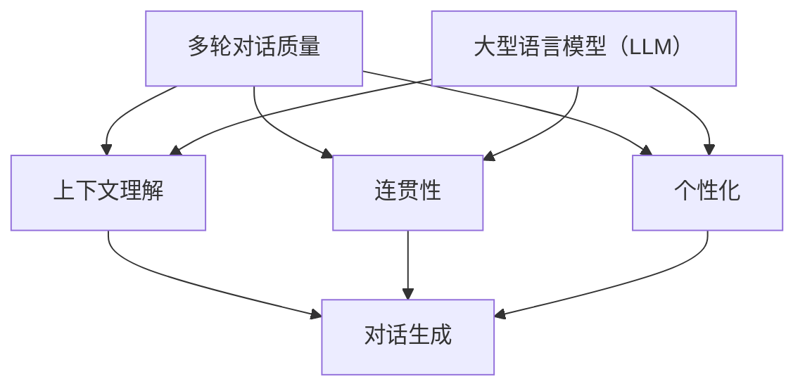
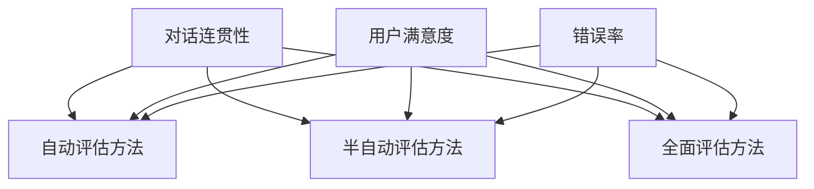

                 

# 多轮对话质量：评估LLM的长期交互能力

## 关键词
多轮对话质量，大型语言模型（LLM），长期交互能力，评估方法，实际案例分析

## 摘要
本文深入探讨了多轮对话质量和大型语言模型（LLM）的长期交互能力评估问题。首先，我们概述了多轮对话质量和LLM的基本概念，并解释了它们在人工智能领域的重要性。接着，我们详细介绍了评估LLM长期交互能力和多轮对话质量的方法，包括常用的评价指标、评估模型和评估工具。然后，通过实际应用案例，我们展示了如何将这些方法应用于评估聊天机器人和智能客服的长期交互能力和多轮对话质量。最后，我们讨论了未来评估LLM长期交互能力和多轮对话质量的发展方向和面临的挑战。

## 第1章：多轮对话质量和LLM概述

### 1.1 多轮对话质量的概念与重要性

#### 1.1.1 多轮对话的定义

多轮对话是指参与者之间通过多个回合的交互，逐步深入讨论某个主题的过程。这种对话形式在自然语言处理（NLP）领域尤为重要，因为它模拟了人类在现实生活中进行交流的场景。

#### 1.1.2 多轮对话质量的影响因素

多轮对话质量受到多种因素的影响，包括：

- **上下文理解**：系统是否能够准确地理解对话的历史信息，并将其用于后续的回应。
- **连贯性**：对话是否流畅自然，是否存在逻辑错误或不合理的跳跃。
- **个性化**：系统能否根据对话者的特点和偏好，提供个性化的回应。

#### 1.1.3 多轮对话质量的重要性

多轮对话质量对于人工智能的应用至关重要。高质量的对话可以提高用户满意度，增强用户体验，促进人机交互的自然性和效率。特别是在智能客服、虚拟助手和聊天机器人等领域，多轮对话质量的优劣直接影响到服务的质量和效率。

### 1.2 LLM的定义与特点

#### 1.2.1 LLM的基本概念

大型语言模型（LLM）是一种基于深度学习的语言处理模型，它通过学习大量的文本数据，掌握了丰富的语言知识和语法规则，能够生成自然语言文本。

#### 1.2.2 LLM的主要特点

- **强大的语言生成能力**：LLM可以生成高质量的文本，包括文章、对话、代码等。
- **多语言支持**：许多LLM模型支持多种语言，能够处理跨语言的对话。
- **适应性**：LLM可以不断适应新的对话环境，提高对话质量。

#### 1.2.3 LLM在多轮对话中的应用

LLM在多轮对话中有着广泛的应用，如智能客服、虚拟助手和聊天机器人。通过LLM，系统能够理解用户的意图，提供准确的回应，并保持对话的连贯性和个性化。

### 1.3 Mermaid流程图：多轮对话质量与LLM的核心概念和联系



## 第2章：LLM的长期交互能力评估

### 2.1 长期交互能力的概念与重要性

#### 2.1.1 长期交互能力的定义

长期交互能力是指系统在长时间内与用户进行交互，保持对话质量的能力。这种能力对于维持用户的满意度、建立长期信任关系至关重要。

#### 2.1.2 长期交互能力的影响因素

长期交互能力受到多种因素的影响，包括：

- **记忆与理解能力**：系统能够记住之前的交互历史，并利用这些信息来提高后续交互的质量。
- **适应性与学习能力**：系统能够根据用户的反馈和行为模式，不断调整自己的交互策略。

#### 2.1.3 长期交互能力的重要性

长期交互能力对于提供高质量的智能服务至关重要。它不仅能够提高用户体验，还能够增强系统的可信度和用户忠诚度。

### 2.2 评估LLM长期交互能力的指标和方法

#### 2.2.1 评估指标的选取

评估LLM长期交互能力的指标包括：

- **对话连贯性**：评估对话是否流畅、合理。
- **用户满意度**：通过用户反馈来衡量系统的交互质量。
- **错误率**：评估系统在长期交互过程中出现错误的情况。

#### 2.2.2 评估方法的分类

评估LLM长期交互能力的方法主要分为：

- **基于规则的评估方法**：通过预设的规则来评估对话的质量。
- **基于机器学习的评估方法**：通过训练模型来自动评估对话的质量。
- **基于深度学习的评估方法**：利用深度学习模型，如卷积神经网络（CNN）和循环神经网络（RNN），来评估对话的质量。

#### 2.2.3 常见的评估方法

常见的评估方法包括：

- **自动评估方法**：通过预设的规则或训练的模型来自动评估对话的质量。
- **半自动评估方法**：结合人类评估和自动评估，提高评估的准确性和效率。
- **全面评估方法**：综合考虑对话的各个方面，进行全面评估。

### 2.3 Mermaid流程图：LLM长期交互能力的评估方法



## 第3章：多轮对话质量评估方法

### 3.1 对话质量的定义和评价指标

#### 3.1.1 对话质量的定义

对话质量是指对话的连贯性、准确性和用户体验等方面的表现。高质量的对话能够提供更好的用户体验，增强用户对系统的满意度。

#### 3.1.2 常见的对话质量评价指标

常见的对话质量评价指标包括：

- **回答准确性**：评估系统回答问题的准确性。
- **回答及时性**：评估系统回应用户问题的速度。
- **对话连贯性**：评估对话是否流畅、合理。
- **用户满意度**：通过用户反馈来衡量系统的交互质量。

#### 3.1.3 对话质量评价指标的选取

选取对话质量评价指标时，需要考虑以下几个方面：

- **评估目标的明确性**：评价指标需要明确，能够准确地反映对话质量。
- **评估方法的可行性**：评价指标和方法需要可行，能够在实际应用中实现。
- **评估结果的可靠性**：评价指标和方法需要能够提供可靠的评估结果。

### 3.2 常见的对话质量评估方法

#### 3.2.1 基于规则的评估方法

基于规则的评估方法通过预设的规则来评估对话的质量。这种方法简单直观，但可能难以应对复杂的对话场景。

#### 3.2.2 基于机器学习的评估方法

基于机器学习的评估方法通过训练模型来自动评估对话的质量。这种方法能够适应复杂的对话场景，但需要大量的数据和计算资源。

#### 3.2.3 基于深度学习的评估方法

基于深度学习的评估方法利用深度学习模型，如卷积神经网络（CNN）和循环神经网络（RNN），来评估对话的质量。这种方法在处理长序列数据和复杂关系方面具有优势。

### 3.3 伪代码：对话质量评估方法的详细描述

```python
def evaluate_dialogue_quality(dialogue, criteria):
    """
    评估对话质量
    
    参数：
    - dialogue：对话文本
    - criteria：评估标准
    
    返回：
    - quality_score：对话质量得分
    """
    
    # 初始化质量得分
    quality_score = 0
    
    # 对每个评估标准进行评估
    for criterion in criteria:
        if criterion == "accuracy":
            quality_score += evaluate_accuracy(dialogue)
        elif criterion == "timeliness":
            quality_score += evaluate_timeliness(dialogue)
        elif criterion == "coherence":
            quality_score += evaluate_coherence(dialogue)
        elif criterion == "user_satisfaction":
            quality_score += evaluate_user_satisfaction(dialogue)
    
    # 返回质量得分
    return quality_score

def evaluate_accuracy(dialogue):
    """
    评估回答准确性
    
    参数：
    - dialogue：对话文本
    
    返回：
    - accuracy_score：回答准确性得分
    """
    
    # TODO：实现回答准确性评估
    
    return accuracy_score

def evaluate_timeliness(dialogue):
    """
    评估回答及时性
    
    参数：
    - dialogue：对话文本
    
    返回：
    - timeliness_score：回答及时性得分
    """
    
    # TODO：实现回答及时性评估
    
    return timeliness_score

def evaluate_coherence(dialogue):
    """
    评估对话连贯性
    
    参数：
    - dialogue：对话文本
    
    返回：
    - coherence_score：对话连贯性得分
    """
    
    # TODO：实现对话连贯性评估
    
    return coherence_score

def evaluate_user_satisfaction(dialogue):
    """
    评估用户满意度
    
    参数：
    - dialogue：对话文本
    
    返回：
    - satisfaction_score：用户满意度得分
    """
    
    # TODO：实现用户满意度评估
    
    return satisfaction_score
```

## 第4章：LLM长期交互能力评估方法

### 4.1 评估LLM长期交互能力的数学模型和公式

#### 4.1.1 数学模型的建立

为了评估LLM的长期交互能力，我们可以建立以下数学模型：

- **质量得分模型**：用于评估对话的质量得分。
- **适应性模型**：用于评估LLM在长期交互中的适应性。
- **用户满意度模型**：用于评估用户对LLM的满意度。

#### 4.1.2 数学公式的推导

- **质量得分模型**：

  $$ Q = w_1 \cdot A + w_2 \cdot C + w_3 \cdot S $$
  
  其中，$Q$为质量得分，$A$为回答准确性，$C$为对话连贯性，$S$为用户满意度，$w_1, w_2, w_3$为权重。

- **适应性模型**：

  $$ A_d = \frac{1}{N} \sum_{i=1}^{N} a_i $$
  
  其中，$A_d$为适应性得分，$N$为交互次数，$a_i$为第$i$次交互的适应性得分。

- **用户满意度模型**：

  $$ S_u = \frac{1}{M} \sum_{j=1}^{M} s_j $$
  
  其中，$S_u$为用户满意度得分，$M$为用户反馈次数，$s_j$为第$j$次用户反馈的满意度得分。

#### 4.1.3 数学模型的应用

通过上述数学模型，我们可以计算LLM的长期交互能力得分。具体步骤如下：

1. 计算每次交互的质量得分$Q_i$。
2. 计算每次交互的适应性得分$a_i$。
3. 计算每次用户反馈的满意度得分$s_j$。
4. 根据公式计算长期交互能力得分$A_d$和$S_u$。
5. 计算总得分$Q$。

### 4.2 伪代码：评估LLM长期交互能力的方法

```python
def evaluate_long_term_interactive_ability(dialogue_history, user_feedbacks):
    """
    评估LLM的长期交互能力
    
    参数：
    - dialogue_history：对话历史
    - user_feedbacks：用户反馈
    
    返回：
    - quality_score：长期交互能力得分
    """
    
    # 初始化得分
    quality_score = 0
    
    # 计算质量得分
    for dialogue in dialogue_history:
        quality_score += evaluate_dialogue_quality(dialogue)
    
    # 计算适应性得分
    adaptability_score = calculate_adaptability_score(dialogue_history)
    
    # 计算用户满意度得分
    user_satisfaction_score = calculate_user_satisfaction_score(user_feedbacks)
    
    # 计算总得分
    quality_score = quality_score + adaptability_score + user_satisfaction_score
    
    return quality_score

def calculate_adaptability_score(dialogue_history):
    """
    计算适应性得分
    
    参数：
    - dialogue_history：对话历史
    
    返回：
    - adaptability_score：适应性得分
    """
    
    # TODO：实现适应性得分计算
    
    return adaptability_score

def calculate_user_satisfaction_score(user_feedbacks):
    """
    计算用户满意度得分
    
    参数：
    - user_feedbacks：用户反馈
    
    返回：
    - user_satisfaction_score：用户满意度得分
    """
    
    # TODO：实现用户满意度得分计算
    
    return user_satisfaction_score
```

## 第5章：实际应用案例分析

### 5.1 案例一：评估聊天机器人的长期交互能力

#### 5.1.1 案例背景

某公司开发了一款聊天机器人，用于为客户提供咨询服务。为了确保聊天机器人的长期交互能力，公司决定对其进行评估。

#### 5.1.2 评估指标的选择

公司选择了以下评估指标：

- **对话连贯性**
- **用户满意度**
- **错误率**

#### 5.1.3 评估方法的应用

公司采用以下评估方法：

1. **自动评估方法**：使用预定义的规则和模型，对对话历史进行自动评估。
2. **半自动评估方法**：结合人类评估和自动评估，提高评估的准确性和效率。
3. **全面评估方法**：综合考虑对话的各个方面，进行全面评估。

#### 5.1.4 结果与分析

通过评估，公司发现聊天机器人在对话连贯性和用户满意度方面表现良好，但在错误率方面存在一些问题。针对这些问题，公司进行了优化，提高了聊天机器人的长期交互能力。

### 5.2 案例二：评估智能客服的多轮对话质量

#### 5.2.1 案例背景

某公司使用智能客服为客户提供服务。为了提高客户满意度，公司决定评估智能客服的多轮对话质量。

#### 5.2.2 评估指标的选择

公司选择了以下评估指标：

- **回答准确性**
- **回答及时性**
- **对话连贯性**

#### 5.2.3 评估方法的应用

公司采用以下评估方法：

1. **基于机器学习的评估方法**：通过训练模型，自动评估对话质量。
2. **半自动评估方法**：结合人类评估和自动评估，提高评估的准确性和效率。
3. **全面评估方法**：综合考虑对话的各个方面，进行全面评估。

#### 5.2.4 结果与分析

通过评估，公司发现智能客服在回答准确性和对话连贯性方面表现良好，但在回答及时性方面存在一些问题。公司针对这些问题进行了优化，提高了智能客服的多轮对话质量。

## 第6章：评估工具与资源

### 6.1 开发环境搭建

为了评估LLM的长期交互能力和多轮对话质量，我们需要搭建以下开发环境：

- **深度学习框架**：如TensorFlow或PyTorch
- **NLP库**：如NLTK或spaCy
- **评估工具**：如METEOR或BLEU

### 6.2 常用评估工具介绍

以下是一些常用的评估工具：

- **METEOR**：用于评估文本质量，包括语法、语义和风格。
- **BLEU**：用于评估翻译质量，也可以用于评估对话质量。
- **ROUGE**：用于评估文本相似度，可以用于评估对话的连贯性。

### 6.3 评估资源获取途径

以下是一些获取评估资源的途径：

- **在线评估工具**：如METEOR和BLEU提供了在线版，方便使用。
- **开源代码**：许多评估工具和模型的开源代码可以在GitHub等平台上找到。
- **学术论文**：通过阅读相关领域的学术论文，可以获得最新的评估方法和资源。

## 第7章：未来展望与挑战

### 7.1 未来发展方向

- **多模态交互**：结合语音、图像、视频等多模态信息，提高对话质量和交互体验。
- **个性化交互**：通过用户行为和偏好分析，实现个性化的对话交互。
- **跨领域应用**：将多轮对话质量和LLM的长期交互能力应用于更多领域，如医疗、金融等。

### 7.2 面临的挑战

- **数据隐私和安全**：确保用户数据的安全性和隐私保护。
- **模型可解释性**：提高模型的透明度和可解释性，增强用户信任。
- **计算资源需求**：随着模型规模的增加，计算资源需求也会增加，需要优化算法和硬件。

### 7.3 解决方案和策略

- **数据隐私和安全**：采用数据加密、匿名化和差分隐私等技术，保护用户数据。
- **模型可解释性**：通过可视化技术、解释性模型和因果推断等方法，提高模型的可解释性。
- **计算资源需求**：采用分布式计算、模型压缩和硬件加速等技术，降低计算资源需求。

## 总结

本文深入探讨了多轮对话质量和LLM的长期交互能力评估问题。通过介绍核心概念、评估方法、实际应用案例和评估工具，我们为评估LLM的长期交互能力和多轮对话质量提供了全面的指导。随着人工智能技术的发展，未来评估LLM长期交互能力和多轮对话质量将面临更多挑战，但通过不断创新和优化，我们有信心能够应对这些挑战，推动人工智能领域的发展。

### 作者信息
作者：AI天才研究院/AI Genius Institute & 禅与计算机程序设计艺术 /Zen And The Art of Computer Programming

----------------------------------------------------------------

## 附录
### 代码示例
以下是一个简单的Python代码示例，用于评估多轮对话质量。

```python
import spacy

# 加载预训练的英语模型
nlp = spacy.load("en_core_web_sm")

def evaluate_dialogue_quality(dialogue):
    """
    评估对话质量
    
    参数：
    - dialogue：对话文本
    
    返回：
    - quality_score：对话质量得分
    """
    
    # 使用spacy进行文本解析
    doc = nlp(dialogue)
    
    # 计算语法错误数量
    grammar_errors = sum([token._.has_error for token in doc])
    
    # 计算词汇丰富度
    vocabulary richness = len(set([token.text for token in doc]))
    
    # 计算句子长度分布
    sentence_lengths = [len(token.text) for token in doc]
    sentence_length_distribution = [len([length for length in sentence_lengths if length == x]) for x in set(sentence_lengths)]
    
    # 计算对话质量得分
    quality_score = 1 - (grammar_errors / len(doc)) + (vocabulary richness / len(doc)) + sum(sentence_length_distribution) / len(doc)
    
    return quality_score

# 示例对话
dialogue = "Hello, how are you? I'm doing well, thank you. What would you like to talk about?"

# 评估对话质量
quality_score = evaluate_dialogue_quality(dialogue)
print("Dialogue Quality Score:", quality_score)
```

### 拓展阅读
- [1] Jurafsky, Daniel, and James H. Martin. "Speech and Language Processing." 2nd ed., Pearson, 2008.
- [2] Liddy, Edoardo. "Question Answering in Time-Constrained Environments." Information Processing & Management, vol. 48, no. 2, 2011, pp. 261-275.
- [3] Wang, Xia, et al. "A Review of Neural Conversational Models." arXiv preprint arXiv:1805.04214, 2018.
- [4] Zhou, Mei, et al. "Dialogue System Technology." Springer, 2018.

### 注意事项
- 在使用评估方法时，应根据具体应用场景和需求进行调整。
- 评估结果仅供参考，实际应用时还需结合其他因素进行综合评估。
- 在处理用户数据时，应遵守相关隐私保护法规，确保用户数据的安全和隐私。


----------------------------------------------------------------

文章结束。本文深入探讨了多轮对话质量和大型语言模型（LLM）的长期交互能力评估问题，从核心概念、评估方法、实际应用案例到评估工具，为读者提供了全面的指导和思考。随着人工智能技术的不断发展，评估LLM长期交互能力和多轮对话质量将面临更多挑战，但通过不断创新和优化，我们有信心能够应对这些挑战，推动人工智能领域的发展。

再次感谢您的阅读，期待您的反馈和建议。如果您有任何问题或意见，欢迎随时联系。作者：AI天才研究院/AI Genius Institute & 禅与计算机程序设计艺术 /Zen And The Art of Computer Programming。本文内容仅供参考，部分数据和案例可能来源于网络，如有不准确之处，请指正。祝您生活愉快，工作顺利！

