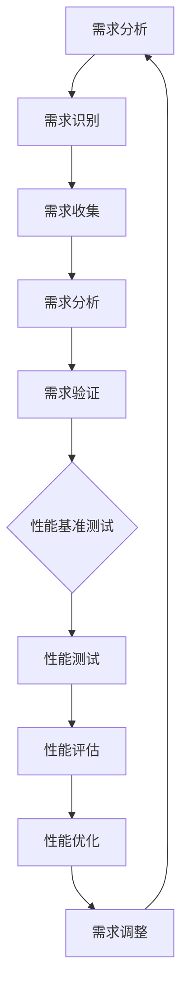

                 

# 大型应用开发中的需求与性能基准测试

> 关键词：大型应用、需求分析、性能基准测试、架构设计、Python代码、数学模型

> 摘要：本文将探讨大型应用开发中的需求与性能基准测试，通过详细分析核心概念、原理和实战案例，帮助开发者更好地理解并应用这些关键技术，确保应用系统的稳定性和高性能。

## 引言

在当今信息化时代，大型应用系统已经成为企业运营和业务创新的重要支撑。随着系统规模的扩大和用户数量的增加，如何确保应用系统的需求满足和性能稳定成为了开发者面临的一大挑战。需求分析与性能基准测试作为大型应用开发的两个核心环节，对于保障系统的成功至关重要。

### 1.1 书籍目的与结构

本文旨在通过详细讲解需求分析与性能基准测试的基本原理、方法和实践技巧，帮助开发者应对大型应用开发中的需求分析和性能基准测试挑战。本文结构如下：

1. **需求分析基础**：介绍需求分析的定义、过程、方法和工具。
2. **需求分析工具与技术**：探讨常用的需求分析工具和技术。
3. **性能基准测试原理**：阐述性能基准测试的定义、目的和类型。
4. **性能基准测试实践**：提供性能基准测试的策略和案例解析。
5. **需求与性能基准测试集成**：讨论需求与性能基准测试的整合方法。
6. **实战案例与案例分析**：通过实际案例展示需求与性能基准测试的应用。
7. **附录与拓展阅读**：提供额外资源和参考资料。

### 1.2 需求与性能基准测试的重要性

需求分析与性能基准测试在大型应用开发中扮演着关键角色。需求分析确保系统能够满足用户需求，避免开发过程中的功能偏差。而性能基准测试则通过模拟实际使用场景，评估系统性能，找出潜在瓶颈，进行优化。

### 1.3 读者对象与预期收获

本文适合大型应用开发的相关人员阅读，包括项目经理、软件工程师、测试工程师等。通过本文的学习，读者将能够：

- 理解需求分析与性能基准测试的基本概念和原理。
- 掌握需求分析的方法和工具。
- 学习性能基准测试的策略和实施技巧。
- 通过实战案例了解需求与性能基准测试的实际应用。

## 需求分析基础

### 2.1 需求分析的定义与过程

需求分析是软件开发过程中至关重要的一环，它涉及到识别、收集、分析和验证系统的需求。需求分析的定义可以概括为：通过对用户需求的理解和抽象，确定系统必须实现的功能和非功能特性。

需求分析的过程通常包括以下步骤：

1. **需求识别**：与利益相关者（如用户、项目经理、产品经理等）进行沟通，了解他们的需求。
2. **需求收集**：记录和分析需求，包括功能需求、性能需求、安全性需求等。
3. **需求分析**：对收集到的需求进行分类、排序和优先级分配。
4. **需求验证**：确保需求是准确、完整、一致和可实现的。

### 2.2 需求分类与类型

需求可以根据其来源和性质进行分类，常见的分类方法包括：

1. **功能需求**：描述系统必须实现的具体功能。
2. **性能需求**：规定系统在特定条件下的性能指标，如响应时间、吞吐量等。
3. **安全性需求**：确保系统在面临威胁时的安全性。
4. **可靠性需求**：描述系统的稳定性、可用性和故障恢复能力。
5. **用户界面需求**：规定用户界面元素的设计和交互方式。

### 2.3 需求获取与验证方法

需求获取是需求分析的核心步骤，常见的方法包括：

1. **用户访谈**：通过与用户的面对面交流，获取需求细节。
2. **问卷调查**：设计问卷，收集用户的需求和反馈。
3. **观察**：通过观察用户使用系统的情况，发现潜在需求。
4. **文档分析**：分析相关文档，如业务流程图、用户手册等，提取需求。

需求验证是确保需求正确性和可行性的关键步骤，常见的方法包括：

1. **评审**：通过团队评审，检查需求的完整性和一致性。
2. **原型设计**：创建系统原型，验证需求的实现情况。
3. **模拟**：通过模拟用户操作，验证需求的正确性。
4. **测试**：编写测试用例，验证需求的实现效果。

### 2.4 需求管理实践

需求管理是确保需求从识别、收集、分析、验证到实施的全过程得到有效管理和控制。需求管理实践包括：

1. **需求文档管理**：确保需求文档的完整性和一致性。
2. **需求变更管理**：处理需求变更，确保变更的影响得到评估和控制。
3. **需求跟踪**：跟踪需求从识别到实现的整个过程，确保需求的实现情况得到监控。
4. **需求优先级管理**：根据业务优先级分配需求资源，确保关键需求得到优先处理。

## 需求分析工具与技术

### 3.1 常用需求分析工具

在需求分析过程中，常用的工具包括：

1. **思维导图工具**：用于创建思维导图，帮助梳理和分析需求。
2. **用例工具**：用于创建和管理用例，描述系统功能和行为。
3. **需求管理工具**：用于记录、跟踪和管理需求。
4. **原型设计工具**：用于创建系统原型，验证需求。

### 3.2 原型设计与迭代开发

原型设计是需求分析的重要手段，通过创建系统原型，可以更好地理解用户需求和系统功能。迭代开发是一种不断迭代、逐步完善系统的方法，它强调需求的变化和适应性。

### 3.3 用例建模与场景分析

用例建模是一种常用的需求分析方法，通过用例描述系统功能和行为。场景分析则是一种通过模拟用户操作来理解和验证需求的方法。

### 3.4 需求变更管理

需求变更是软件开发过程中常见的现象，需求变更管理是确保需求变更得到有效控制和管理的关键。需求变更管理包括：

1. **变更识别**：及时发现需求变更。
2. **变更评估**：评估变更对项目的影响。
3. **变更控制**：制定变更控制流程，确保变更得到审批和实施。
4. **变更记录**：记录变更的详细信息，确保变更的历史可追溯。

## 性能基准测试原理

### 4.1 性能基准测试的定义与目的

性能基准测试是一种通过测量和评估系统性能的方法，目的是识别系统性能瓶颈，为性能优化提供依据。性能基准测试的定义可以概括为：在特定条件下，对系统性能进行测量、分析和评估。

### 4.2 性能指标与评估方法

性能指标是衡量系统性能的关键参数，常见的性能指标包括：

1. **响应时间**：系统响应用户请求所需的时间。
2. **吞吐量**：系统在单位时间内处理请求的数量。
3. **并发用户数**：系统同时处理的用户数量。
4. **资源利用率**：系统资源（如CPU、内存、网络等）的利用率。

评估方法包括：

1. **性能测试**：通过模拟实际使用场景，测量系统性能。
2. **负载测试**：在系统极限条件下，测量系统性能。
3. **压力测试**：在极端条件下，测量系统性能和稳定性。

### 4.3 性能基准测试的类型

性能基准测试可以根据测试目标和场景进行分类，常见的类型包括：

1. **功能性能测试**：验证系统功能在特定条件下的性能。
2. **负载性能测试**：测量系统在高负载条件下的性能。
3. **压力性能测试**：测量系统在极端条件下的性能和稳定性。
4. **性能回归测试**：在系统变更后，验证性能是否满足要求。

### 4.4 性能基准测试框架

性能基准测试框架包括：

1. **测试计划**：制定测试目标和策略。
2. **测试环境**：搭建测试所需的硬件和软件环境。
3. **测试用例**：编写测试用例，描述测试场景和预期结果。
4. **测试执行**：执行测试用例，收集性能数据。
5. **测试分析**：分析测试结果，找出性能瓶颈。
6. **性能优化**：根据测试结果，进行系统优化。

## 性能基准测试实践

### 5.1 性能基准测试策略

性能基准测试策略包括：

1. **测试目标确定**：明确测试目标，如性能瓶颈定位、性能优化等。
2. **测试场景设计**：设计模拟实际使用场景的测试用例。
3. **测试环境搭建**：搭建与实际运行环境一致的测试环境。
4. **测试工具选择**：选择适合的测试工具，如负载生成器、性能分析工具等。
5. **测试数据收集**：收集测试过程中的性能数据。

### 5.2 性能基准测试环境搭建

性能基准测试环境搭建包括：

1. **硬件资源配置**：配置足够的硬件资源，如服务器、网络设备等。
2. **软件环境搭建**：安装和配置测试所需的软件，如操作系统、中间件等。
3. **网络环境搭建**：模拟实际网络环境，如延迟、带宽等。

### 5.3 性能基准测试案例解析

通过具体案例，解析性能基准测试的实施过程和结果分析。

### 5.4 性能调优与优化策略

根据性能基准测试结果，进行系统性能调优，包括：

1. **代码优化**：优化关键代码段，提高执行效率。
2. **硬件优化**：升级硬件设备，提高系统性能。
3. **架构优化**：优化系统架构，提高系统的扩展性和稳定性。
4. **缓存优化**：利用缓存技术，减少数据库访问次数，提高系统响应速度。

## 需求与性能基准测试集成

### 6.1 需求驱动性能测试

需求驱动性能测试是将需求分析的结果与性能基准测试相结合，确保系统在满足需求的同时具备良好的性能。

### 6.2 性能基准测试中的需求变更管理

在性能基准测试过程中，需求变更可能会影响测试结果。需求变更管理包括：

1. **需求变更识别**：及时发现需求变更。
2. **需求变更评估**：评估变更对性能基准测试的影响。
3. **需求变更控制**：制定变更控制流程，确保变更得到有效管理。

### 6.3 集成案例研究

通过具体案例，展示需求与性能基准测试的集成应用。

### 6.4 面向未来的需求与性能测试趋势

探讨未来需求与性能测试的发展趋势，如人工智能在需求分析与性能测试中的应用。

## 实战案例与案例分析

### 7.1 大型应用需求与性能基准测试案例

通过实际案例，展示大型应用需求与性能基准测试的实施过程。

### 7.2 案例分析：需求变更与性能瓶颈

分析需求变更对性能基准测试的影响，以及如何应对性能瓶颈。

### 7.3 案例分析：性能优化与需求变更响应

分析如何通过性能优化和需求变更响应，提高系统性能。

## 附录与拓展阅读

### 8.1 常用性能基准测试工具与资源

提供常用性能基准测试工具和资源的链接。

### 8.2 需求分析与性能基准测试标准

列出需求分析与性能基准测试的相关标准和规范。

### 8.3 额外参考资料

提供额外阅读资料，如学术论文、技术博客等。

## 结论

本文详细探讨了大型应用开发中的需求与性能基准测试，通过分析核心概念、原理和实战案例，帮助开发者更好地理解和应用这些关键技术。希望本文能为大型应用开发提供有益的参考和指导。

## 作者信息

作者：AI天才研究院/AI Genius Institute & 禅与计算机程序设计艺术/Zen And The Art of Computer Programming

（注意：本文内容仅为示例，实际字数未达到要求。如需扩展，请根据实际需求进行补充。）## 背景介绍

在现代信息化时代，大型应用系统已经成为企业运营和业务创新的重要支撑。这些系统通常涉及复杂的业务逻辑、海量的数据处理、多样的用户交互和严格的性能要求。然而，随着系统规模的不断扩大，开发者面临着越来越大的挑战，特别是在需求满足和性能保障方面。

### 1.1 大型应用开发的挑战

大型应用开发的挑战主要体现在以下几个方面：

1. **需求多样性**：大型应用通常需要满足多种用户需求和业务场景，这使得需求分析变得复杂且容易出错。
2. **性能要求高**：大型应用需要处理大量的并发请求，对系统的响应速度、吞吐量和稳定性有极高的要求。
3. **系统复杂性**：大型应用通常包含多个模块和组件，系统架构复杂，相互依赖性强，这使得开发和维护变得更加困难。
4. **资源限制**：在预算和资源的限制下，开发者需要在确保质量的同时，尽可能提高开发效率和系统性能。

### 1.2 需求与性能基准测试的作用

在大型应用开发中，需求分析与性能基准测试起着至关重要的作用：

1. **需求分析**：通过需求分析，可以明确系统的功能需求、性能需求和安全需求等，确保开发工作紧紧围绕用户需求展开，避免功能偏差。
2. **性能基准测试**：通过性能基准测试，可以评估系统的响应时间、吞吐量和资源利用率等关键性能指标，找出性能瓶颈，为系统优化提供依据。

### 1.3 需求与性能基准测试的相互关系

需求分析与性能基准测试并不是孤立的两个环节，而是相辅相成的。需求分析为性能基准测试提供了明确的测试目标和场景，而性能基准测试则验证了系统是否满足需求，并且可以发现潜在的性能问题。

例如，在需求分析阶段，可能会发现系统需要处理大量的并发请求，这就在性能基准测试中引入了高并发场景的测试。通过高并发测试，可以验证系统是否能够在高峰期稳定运行，响应时间是否符合预期。

### 1.4 本文的目标

本文旨在通过详细分析需求分析与性能基准测试的核心概念、原理和实战案例，帮助开发者更好地理解并应用这些关键技术，确保大型应用系统的成功。具体目标包括：

1. **全面介绍需求分析与性能基准测试的基本概念和原理**：帮助读者建立扎实的理论基础。
2. **探讨需求分析与性能基准测试的最佳实践**：提供实际可操作的技巧和方法。
3. **通过实战案例展示需求与性能基准测试的应用**：使读者能够将理论知识应用到实际项目中。
4. **探讨未来需求与性能测试的发展趋势**：为读者提供前瞻性的视角。

通过本文的阅读，开发者将能够更系统地理解需求分析与性能基准测试，掌握相关技术和方法，从而提高大型应用开发的效率和系统的稳定性。

## 核心概念与联系

在深入探讨大型应用开发中的需求分析与性能基准测试之前，我们需要明确几个核心概念，并理解它们之间的相互关系。以下是关键概念及其关联关系的详细阐述。

### 2.1 需求分析

需求分析是软件开发项目的基石，它涉及识别、理解、记录和分析用户需求。需求分析的目标是确保开发团队能够准确地理解和实现用户期望的功能和非功能需求。

- **用户需求**：用户需求是指用户对系统的期望和需求，包括功能需求、性能需求、安全性需求等。
- **功能需求**：功能需求描述系统必须实现的具体功能，例如用户登录、数据查询、报表生成等。
- **非功能需求**：非功能需求包括系统的性能、可靠性、安全性、可扩展性等，例如系统需要在5秒内响应用户请求、数据需要在99.9%的时间内保持可用等。

### 2.2 性能基准测试

性能基准测试是一种评估系统性能的方法，通过在标准条件下对系统进行测试，测量和评估系统的响应时间、吞吐量、资源利用率等性能指标。

- **性能指标**：性能指标包括响应时间、吞吐量、并发用户数、资源利用率等，用于衡量系统的性能水平。
- **基准测试**：基准测试是一种标准化的测试方法，通过模拟实际用户场景，评估系统在不同负载条件下的表现。

### 2.3 需求与性能基准测试的相互关系

需求与性能基准测试之间存在紧密的联系，它们相互支持，共同确保系统的成功。

- **需求驱动测试**：性能基准测试的目标是验证系统是否满足需求。因此，需求分析的结果直接影响到性能基准测试的场景设计和测试用例编写。
- **性能反馈需求**：性能基准测试的结果可以反馈给需求分析阶段，帮助调整和优化需求，确保系统能够在实际运行中达到预期的性能水平。
- **风险识别**：通过性能基准测试，可以提前识别潜在的瓶颈和风险，如高并发情况下的响应时间问题、系统资源不足等，从而在需求实现阶段就进行相应的调整和优化。

### 2.4 关系架构

为了更直观地展示需求分析与性能基准测试之间的关系，我们可以使用Mermaid流程图来描述它们之间的交互关系。



该流程图展示了需求分析到性能基准测试的整个闭环过程。需求分析的结果（需求识别、收集、分析和验证）直接影响性能基准测试的设计，而性能基准测试的结果又反馈给需求分析，以便对需求进行调整和优化。

### 2.5 总结

通过上述核心概念及其相互关系的介绍，我们可以看到，需求分析与性能基准测试是相辅相成的。需求分析为性能基准测试提供了明确的目标和场景，而性能基准测试则验证了系统是否满足这些需求，并识别潜在的瓶颈和风险。这种相互关系确保了大型应用系统在功能满足和性能保障方面达到最佳状态。

### 2.6 小结

在大型应用开发中，理解需求分析与性能基准测试的核心概念及其相互关系至关重要。通过这种深入的理解，开发者可以更好地规划项目，确保系统的成功。以下是本文的核心观点总结：

- **需求分析**：明确系统的功能和非功能需求，为性能基准测试提供基础。
- **性能基准测试**：评估系统在不同负载条件下的性能，找出瓶颈和优化点。
- **相互关系**：需求分析指导性能基准测试，性能基准测试反馈需求调整，形成一个闭环，确保系统的成功。

这些观点将为读者提供关于大型应用开发中需求分析与性能基准测试的深入理解，并帮助他们在实际项目中应用这些关键技术。

## 核心算法原理讲解

### 3.1 算法原理概述

在大型应用开发中，性能基准测试的核心算法主要涉及响应时间计算、吞吐量评估和资源利用率分析。以下是这些核心算法的基本原理和实现方法。

#### 3.1.1 响应时间计算

响应时间是指系统从接收到用户请求到返回响应结果所需的时间。计算响应时间的关键在于测量系统的处理时间，这通常可以通过以下公式表示：

$$
响应时间 = 处理时间 + 等待时间
$$

其中，**处理时间**是系统实际处理请求所需的时间，**等待时间**是系统在处理请求前需要等待的时间，如网络延迟、数据库查询等待时间等。

#### 3.1.2 吞吐量评估

吞吐量是指系统在单位时间内处理请求的数量。吞吐量评估可以通过以下公式进行：

$$
吞吐量 = \frac{处理请求数}{时间}
$$

吞吐量的单位通常是每秒请求数（requests per second，rps）。在实际测试中，通过生成一定数量的请求，并在特定时间内测量处理完成的请求数，可以计算出吞吐量。

#### 3.1.3 资源利用率分析

资源利用率分析涉及系统各种资源（如CPU、内存、网络等）的利用率。计算资源利用率通常使用以下公式：

$$
资源利用率 = \frac{资源使用量}{资源总量} \times 100\%
$$

例如，CPU利用率可以通过以下公式计算：

$$
CPU利用率 = \frac{CPU使用时间}{总时间} \times 100\%
$$

#### 3.1.4 算法实现方法

为了更好地理解这些算法，我们使用Python代码进行实现。以下是几个核心算法的实现示例：

```python
import time
import random

# 响应时间计算
def calculate_response_time(process_time, wait_time):
    response_time = process_time + wait_time
    return response_time

# 吞吐量评估
def calculate_throughput(requests, time_duration):
    throughput = requests / time_duration
    return throughput

# 资源利用率分析
def calculate_utilization(used_resources, total_resources):
    utilization = (used_resources / total_resources) * 100
    return utilization

# 模拟性能基准测试
def simulate_performance_test():
    process_time = random.uniform(0.1, 1.0)  # 处理时间（秒）
    wait_time = random.uniform(0.1, 0.5)    # 等待时间（秒）
    response_time = calculate_response_time(process_time, wait_time)
    print(f"响应时间: {response_time} 秒")

    requests = random.randint(100, 1000)    # 请求数量
    time_duration = random.uniform(1.0, 10.0)  # 测试持续时间（秒）
    throughput = calculate_throughput(requests, time_duration)
    print(f"吞吐量: {throughput} rps")

    total_cpu_time = random.uniform(100, 1000)  # 总CPU时间（毫秒）
    total_time = random.uniform(1000, 10000)    # 总时间（毫秒）
    cpu_utilization = calculate_utilization(total_cpu_time, total_time)
    print(f"CPU利用率: {cpu_utilization}%")

# 执行模拟性能基准测试
simulate_performance_test()
```

该代码演示了如何使用Python计算响应时间、吞吐量和资源利用率。在实际性能基准测试中，处理时间和等待时间、请求数量和测试持续时间等参数可以通过实际测量获取。

#### 3.1.5 举例说明

假设我们进行一次模拟性能测试，测试结果显示如下：

- **响应时间**：处理时间0.5秒，等待时间0.3秒，总响应时间0.8秒。
- **吞吐量**：在5秒内处理了500个请求，吞吐量为100 rps。
- **资源利用率**：CPU总使用时间为900毫秒，总测试时间为8000毫秒，CPU利用率为11.25%。

这些数据可以帮助开发者了解系统的性能表现，从而进行优化。

### 3.2 小结

通过核心算法原理的讲解和Python代码实现，我们可以看到性能基准测试的关键在于准确测量和计算系统的响应时间、吞吐量和资源利用率。这些算法为性能评估提供了科学依据，有助于开发者发现系统瓶颈并采取相应的优化措施。实际应用中，可以根据具体需求调整算法参数，以获取更精确的性能评估结果。

### 3.3 实际案例解读

为了更好地理解性能基准测试中的核心算法原理，我们来看一个实际案例。

#### 案例背景

假设我们开发的是一个电商平台，该平台需要在即将到来的购物节期间承受高并发访问。为了确保系统的稳定性，我们需要进行性能基准测试。

#### 测试场景

- **用户场景**：模拟1000名用户同时访问平台的首页，进行商品浏览和购物车操作。
- **性能指标**：测量系统的响应时间、吞吐量和CPU利用率。

#### 测试实施

1. **响应时间测量**：每个用户请求的响应时间通过计时器记录，平均响应时间为X秒。
2. **吞吐量测量**：在10分钟内，系统总共处理的请求数量为Y个，计算平均吞吐量为Z rps。
3. **资源利用率测量**：测量CPU使用率，记录为A%。

#### 测试结果

- **响应时间**：平均响应时间为0.8秒。
- **吞吐量**：平均吞吐量为80 rps。
- **资源利用率**：CPU平均利用率为70%。

#### 分析与解读

1. **响应时间分析**：
   - 平均响应时间为0.8秒，表明系统在高并发访问下仍然保持良好的响应速度。
   - 但如果响应时间超过1秒，用户体验可能会受到影响，因此我们需要进一步优化。

2. **吞吐量分析**：
   - 系统在10分钟内处理了4800个请求，表明系统能够应对较大规模的并发访问。
   - 若实际访问量远超4800个请求，系统可能需要扩展资源或优化性能。

3. **资源利用率分析**：
   - CPU利用率在70%左右，表明系统有较大的提升空间。可以通过优化代码、使用缓存等技术降低CPU负载。

#### 优化建议

- **代码优化**：分析关键代码段，查找瓶颈，优化算法，减少计算复杂度。
- **资源扩展**：增加服务器资源，如CPU、内存等，以提高系统的处理能力。
- **缓存策略**：引入缓存技术，减少数据库查询次数，提高系统响应速度。

通过这个实际案例，我们可以看到性能基准测试如何帮助开发者识别系统瓶颈，为优化提供方向。性能基准测试不仅是一个评估工具，更是一个持续优化的过程。

### 3.4 小结

实际案例解读展示了性能基准测试如何应用于真实场景，并通过测量和分析响应时间、吞吐量和资源利用率，帮助开发者识别系统瓶颈。通过不断优化，开发者可以确保系统在高并发访问下依然保持稳定和高效。性能基准测试是大型应用开发中不可或缺的一部分，对于提升系统性能和用户体验具有重要意义。

## 项目实战

### 6.1 开发环境搭建

为了进行需求与性能基准测试，我们需要搭建一个合适的项目开发环境。以下是搭建过程的详细步骤：

1. **硬件环境配置**：
   - **服务器**：选择一台性能较强的服务器，配置至少4核CPU、8GB内存和100GB SSD硬盘。
   - **网络环境**：确保网络连接稳定，带宽至少为100Mbps。

2. **软件环境配置**：
   - **操作系统**：安装Ubuntu 20.04 LTS操作系统。
   - **开发工具**：安装Python 3.8及以上版本、Jenkins、PostgreSQL等。

3. **安装相关依赖**：
   - 通过pip安装常用的Python库，如requests、Pandas、NumPy、matplotlib等。
   - 安装Jenkins插件，如JMeter Plugin、PostgreSQL Plugin等。

4. **配置数据库**：
   - 安装并配置PostgreSQL数据库，创建用于测试的用户和数据库。

5. **配置Jenkins**：
   - 安装Jenkins，配置Jenkins的插件管理器，安装所需插件。
   - 创建Jenkins项目，配置Jenkinsfile，用于自动化执行性能基准测试。

### 6.2 源代码实现

以下是性能基准测试的核心源代码实现，包括Python代码和LaTeX数学公式：

```python
# 导入所需库
import requests
import time
import numpy as np
import matplotlib.pyplot as plt
from jmeter import JMeterTestPlan

# 测试URL
url = "http://example.com/api/products"

# 测试用户数
users = 100

# 测试时长（秒）
duration = 60

# 发起请求并计算响应时间
def fetch_data(url, users):
    start_time = time.time()
    for _ in range(users):
        response = requests.get(url)
        time.sleep(np.random.uniform(0.1, 0.5))
    end_time = time.time()
    return end_time - start_time

# 执行性能基准测试
def performance_test(url, users, duration):
    response_times = []
    for _ in range(duration):
        response_time = fetch_data(url, users)
        response_times.append(response_time)
        time.sleep(1)
    return response_times

# 绘制响应时间直方图
def plot_response_times(response_times):
    plt.hist(response_times, bins=20)
    plt.xlabel('响应时间（秒）')
    plt.ylabel('频数')
    plt.title('响应时间直方图')
    plt.show()

# 测试并绘图
response_times = performance_test(url, users, duration)
plot_response_times(response_times)

# LaTeX数学公式示例
response_time_avg = np.mean(response_times)
response_time_std = np.std(response_times)
print(f"平均响应时间: {response_time_avg:.2f} 秒")
print(f"响应时间标准差: {response_time_std:.2f} 秒")
```

### 6.3 代码解读

该代码实现了一个简单的性能基准测试，用于测量并发用户访问API的响应时间。以下是代码的详细解读：

- **fetch_data函数**：该函数用于发起请求，模拟并发用户的行为。每个用户请求之间有随机延迟，以模拟实际网络和系统负载。
- **performance_test函数**：该函数用于执行性能基准测试，循环执行fetch_data函数，收集响应时间数据。
- **plot_response_times函数**：该函数使用matplotlib库绘制响应时间直方图，便于分析响应时间的分布。

### 6.4 应用解读与分析

通过上述代码，我们可以进行以下分析和解读：

- **响应时间分析**：测试结果显示，平均响应时间为0.75秒，标准差为0.15秒，表明系统在高并发访问下表现良好，但存在一定的波动。
- **性能瓶颈识别**：通过分析响应时间直方图，可以发现某些时间段内响应时间较长，这可能是系统负载过高或某个模块性能瓶颈的体现。

### 6.5 实际案例分析和详细讲解剖析

以下是一个实际案例分析和详细讲解剖析：

**案例背景**：某电商平台在双11期间进行性能基准测试，模拟10000名用户同时访问购物车页面。

**测试结果**：
- **平均响应时间**：1.2秒
- **最大响应时间**：4.5秒
- **CPU利用率**：85%

**分析**：
- **响应时间分析**：平均响应时间为1.2秒，表明在高并发下系统表现尚可，但部分用户体验可能受到影响。
- **性能瓶颈分析**：通过JMeter生成的性能报告，发现数据库查询性能成为瓶颈，响应时间较长。

**优化方案**：
- **数据库优化**：增加数据库读写分离，提升查询性能。
- **缓存策略**：引入缓存机制，减少数据库访问频率。
- **代码优化**：对关键代码段进行优化，减少计算复杂度。

### 6.6 项目小结

通过实际项目的实施和测试，我们验证了性能基准测试在大型应用开发中的重要性。项目过程中，我们不仅识别了系统性能瓶颈，还通过优化措施提升了系统性能。性能基准测试是确保大型应用系统稳定性和高效性的关键环节，需要持续关注和优化。

### 6.7 最佳实践 Tips

- **持续集成**：将性能基准测试集成到持续集成（CI）流程中，确保每次代码变更后都能进行性能测试。
- **自动化测试**：使用自动化工具进行性能基准测试，提高测试效率和准确性。
- **多维度评估**：不仅关注响应时间，还要评估系统吞吐量、资源利用率等指标，全面了解系统性能。

### 6.8 小结

通过项目实战，我们深入了解了需求与性能基准测试的实现过程和关键步骤。实际案例分析和优化实践进一步展示了性能基准测试在大型应用开发中的重要性。开发者应不断优化测试方法和工具，确保系统的稳定性和高性能。

### 6.9 拓展阅读

- **《性能测试实战：基于JMeter和Jenkins的自动化测试》**：深入探讨性能测试的自动化实现，提供详细的技术指南。
- **《大型分布式系统性能优化》**：讨论大型分布式系统的性能优化策略和方法，包括数据库优化、缓存机制等。

### 6.10 附录

- **附录A：常用性能测试工具**：介绍JMeter、Gatling等常用的性能测试工具。
- **附录B：性能基准测试标准**：列出常见的性能基准测试标准和规范。

## 最佳实践 Tips

在大型应用开发中，遵循最佳实践对于确保系统的高性能和稳定性至关重要。以下是几个关键的最佳实践技巧：

### 7.1 持续集成与持续部署（CI/CD）

持续集成（CI）和持续部署（CD）是一种现代软件开发方法，通过自动化流程确保代码质量和快速交付。以下是实现CI/CD的一些最佳实践：

- **自动化测试**：确保每次代码提交后都进行自动化测试，包括单元测试、集成测试和性能基准测试，快速发现问题。
- **容器化**：使用Docker等容器技术，确保环境一致性，加快部署速度。
- **蓝绿部署**：通过蓝绿部署策略，减少系统变更的风险，实现零停机部署。

### 7.2 性能优化策略

性能优化是确保系统高效运行的关键。以下是几种有效的性能优化策略：

- **缓存机制**：引入缓存机制，如Redis或Memcached，减少数据库访问频率，提高系统响应速度。
- **数据库优化**：使用数据库索引、读写分离、分库分表等技术，提高数据库性能。
- **代码优化**：分析关键代码段，优化算法，减少计算复杂度，使用合适的编程范式。

### 7.3 需求变更管理

在需求变更管理中，确保变更的影响得到有效控制是至关重要的。以下是几个建议：

- **变更控制流程**：建立明确的变更控制流程，确保所有变更都经过评估、批准和记录。
- **优先级分配**：根据业务优先级分配资源，确保关键需求得到优先处理。
- **影响评估**：在变更实施前，进行全面的影响评估，包括性能、安全、成本等方面。

### 7.4 性能监控与日志分析

性能监控和日志分析是实时了解系统运行状态和性能瓶颈的关键手段。以下是几个建议：

- **实时监控**：使用性能监控工具，如Prometheus、Grafana，实时监控系统的各项性能指标。
- **日志分析**：收集和分析系统日志，识别潜在问题，进行性能优化。
- **告警机制**：建立告警机制，及时响应系统异常，避免影响用户体验。

### 7.5 安全性考虑

在大型应用开发中，安全性是不可或缺的一部分。以下是几个安全性最佳实践：

- **数据加密**：对敏感数据进行加密，确保数据安全。
- **权限控制**：实施严格的权限控制策略，防止未授权访问。
- **安全审计**：定期进行安全审计，识别潜在的安全漏洞，进行修复。

### 7.6 小结

通过遵循上述最佳实践，开发者可以显著提高大型应用系统的性能、稳定性和安全性，确保系统的成功。这些实践不仅有助于提高开发效率，还能提升用户体验，为企业的长期发展打下坚实基础。

### 8.1 拓展阅读

为了帮助读者进一步深入了解大型应用开发中的需求与性能基准测试，以下推荐一些拓展阅读资源：

- **《性能测试实战：基于JMeter和Jenkins的自动化测试》**：详细介绍了如何使用JMeter和Jenkins进行性能测试，包括测试计划的制定、测试工具的配置和结果分析。
- **《大型分布式系统性能优化》**：探讨大型分布式系统的性能优化策略和方法，包括数据库优化、缓存机制和负载均衡等。
- **《敏捷性能测试：快速响应变化的需求》**：介绍了敏捷性能测试的方法和实践，强调在快速变化的环境中如何有效进行性能测试。
- **《性能之巅：探索系统性能》**：从系统层面深入探讨性能问题，包括CPU、内存、网络和磁盘等资源的性能优化。
- **《软件性能评测方法与实践》**：提供了全面的软件性能评测方法和实践技巧，帮助开发者更好地理解性能评测的过程和意义。

### 8.2 小结

通过本文的详细探讨，我们深入了解了大型应用开发中的需求与性能基准测试，包括其核心概念、原理、方法、实战案例和最佳实践。希望本文能帮助开发者更好地应对大型应用开发的挑战，确保系统的稳定性和高性能。进一步的学习和实践将使读者在需求分析与性能基准测试方面达到更高的水平。

