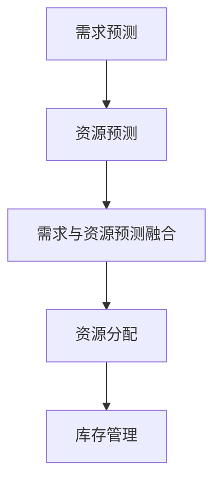
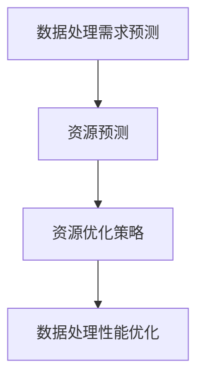

                 

# 大型应用开发中的需求与资源预测模型

## 关键词
大型应用开发、需求预测、资源预测、模型、算法、应用场景、案例分析

## 摘要
本文将深入探讨大型应用开发中的需求与资源预测模型。首先，我们将介绍大型应用开发的挑战，并阐明需求与资源预测在其中的重要性。接着，我们将分别阐述需求预测和资源预测模型的基础理论，包括核心概念、联系、算法原理和数学公式。随后，我们将讨论如何综合应用需求与资源预测模型，并展示其在实际项目中的应用。通过具体案例分析，我们将详细解析需求与资源预测模型在不同领域的应用效果，最后总结全文，并给出最佳实践建议和拓展阅读资源。

## 引言

### 大型应用开发的挑战

在当今快速发展的信息技术时代，大型应用开发已经成为许多企业和组织的核心需求。然而，大型应用开发面临着诸多挑战，包括需求变化频繁、系统复杂性高、资源分配困难等。为了应对这些挑战，需求与资源预测模型变得至关重要。

首先，需求变化频繁是大型应用开发中的一个主要问题。客户需求在不断变化，有时甚至会出现完全相反的需求。这种变化对开发团队提出了很高的要求，需要他们快速适应并调整开发计划。如果需求预测不准确，可能导致开发资源的浪费，甚至项目失败。

其次，系统复杂性高也是大型应用开发的一大挑战。大型应用通常包含多个模块和子系统，这些模块和子系统之间相互依赖，形成了复杂的网络结构。开发团队需要确保各个模块和子系统之间的协作顺畅，这对于大型应用的成功至关重要。然而，系统复杂性高也给需求与资源预测带来了困难，因为预测模型的输入数据更加复杂，需要考虑更多的因素。

最后，资源分配困难是大型应用开发中常见的问题。大型应用开发通常需要大量的资源，包括人力、时间和资金。然而，资源的分配往往是不均衡的，可能会导致某些模块或子系统资源过剩，而其他模块或子系统资源不足。这种资源分配困难会影响项目的进度和质量，甚至可能导致项目延误或失败。

### 需求与资源预测在大型应用开发中的重要性

为了应对上述挑战，需求与资源预测模型在大型应用开发中变得至关重要。需求预测模型可以帮助开发团队提前识别和应对需求变化，从而确保项目能够按时交付。资源预测模型则可以帮助开发团队合理分配资源，确保项目能够顺利进行。

#### 需求预测

需求预测的主要目的是预测未来一段时间内客户需求的变化趋势。通过需求预测，开发团队可以提前了解客户的需求，从而调整开发计划，确保项目能够满足客户需求。需求预测还可以帮助开发团队识别潜在的需求变化，从而提前采取应对措施，避免项目失败。

需求预测模型通常基于历史数据进行分析。通过对历史数据的分析，模型可以识别出需求变化的规律，并利用这些规律预测未来的需求。常见的需求预测算法包括时间序列分析、回归分析和机器学习算法等。时间序列分析通过分析时间序列数据，预测未来的需求变化。回归分析则通过建立需求变量与其他变量之间的线性关系，预测未来的需求。机器学习算法则通过学习历史数据，建立需求预测模型，预测未来的需求。

#### 资源预测

资源预测的主要目的是预测未来一段时间内项目所需的资源，包括人力、时间和资金。通过资源预测，开发团队可以提前了解资源的供需状况，从而合理分配资源，确保项目能够按计划进行。

资源预测模型通常也基于历史数据进行分析。通过对历史数据的分析，模型可以识别出资源使用的规律，并利用这些规律预测未来的资源需求。常见的资源预测算法包括时间序列分析、回归分析和机器学习算法等。时间序列分析通过分析时间序列数据，预测未来的资源需求。回归分析则通过建立资源需求变量与其他变量之间的线性关系，预测未来的资源需求。机器学习算法则通过学习历史数据，建立资源预测模型，预测未来的资源需求。

### 需求与资源预测模型的应用场景

需求与资源预测模型在大型应用开发中具有广泛的应用场景。以下是一些典型的应用场景：

#### 1. 项目管理

需求与资源预测模型可以帮助项目经理制定合理的项目计划，确保项目能够按时交付。通过需求预测，项目经理可以提前了解客户需求的变化趋势，从而调整项目进度和资源分配。通过资源预测，项目经理可以确保项目所需的资源得到合理分配，避免资源浪费。

#### 2. 质量控制

需求与资源预测模型可以帮助开发团队进行质量控制。通过需求预测，开发团队可以提前识别出潜在的质量风险，从而采取预防措施。通过资源预测，开发团队可以确保有足够的资源来处理质量问题的出现。

#### 3. 成本控制

需求与资源预测模型可以帮助开发团队进行成本控制。通过需求预测，开发团队可以提前了解项目成本的变化趋势，从而调整项目预算。通过资源预测，开发团队可以确保项目成本在预算范围内。

#### 4. 团队协作

需求与资源预测模型可以帮助开发团队进行团队协作。通过需求预测，开发团队可以确保团队成员有明确的任务和目标，从而提高团队协作效率。通过资源预测，开发团队可以确保团队成员有足够的资源来完成任务。

### 总结

本文介绍了大型应用开发中的需求与资源预测模型，并阐述了其在项目管理、质量控制、成本控制和团队协作中的应用。通过需求与资源预测模型，开发团队可以更好地应对大型应用开发的挑战，提高项目成功率和团队协作效率。

## 需求预测模型基础

### 需求预测的基本概念

需求预测是大型应用开发中的一个关键环节，其目的是通过分析历史数据和现有信息，预测未来一段时间内客户需求的变化趋势。需求预测不仅可以帮助开发团队提前了解客户需求，为项目规划和资源分配提供依据，还可以帮助团队及时调整策略，以应对需求变化带来的挑战。

#### 需求预测的定义

需求预测（Demand Forecasting）是指利用历史数据、市场分析、用户反馈等多种信息，对某一产品、服务或系统在未来一段时间内的需求进行预测。需求预测的核心是建立预测模型，通过对模型进行训练和验证，预测未来的需求。

#### 需求预测的重要性

1. **资源规划**：通过需求预测，企业可以提前了解资源需求，合理规划人力资源、物资储备等，避免资源浪费或短缺。
2. **成本控制**：需求预测有助于企业制定合理的预算，避免因需求波动导致的成本超支。
3. **风险管理**：需求预测可以帮助企业识别潜在的市场风险，提前制定应对策略，减少损失。
4. **战略规划**：需求预测为企业制定长期战略提供数据支持，有助于企业更好地把握市场趋势和竞争态势。

### 常见需求预测算法

需求预测算法可以分为时间序列分析、回归分析和机器学习算法等。以下将介绍几种常见的需求预测算法：

#### 1. 时间序列分析

时间序列分析（Time Series Analysis）是一种基于历史数据进行分析的预测方法。它主要利用数据的时间特性，通过分析时间序列中的趋势、季节性和周期性，预测未来的需求。

**步骤**：
1. **数据预处理**：对时间序列数据进行清洗和预处理，包括缺失值处理、异常值处理等。
2. **趋势分析**：分析数据中的趋势成分，包括增长、减少等。
3. **季节性分析**：分析数据中的季节性成分，包括季节性波动等。
4. **周期性分析**：分析数据中的周期性成分，包括经济周期、技术周期等。
5. **模型建立**：根据分析结果，选择合适的模型，如ARIMA模型、指数平滑模型等。
6. **模型训练与验证**：通过历史数据训练模型，并对模型进行验证，确保预测准确性。

**Python 源代码示例**：
```python
import pandas as pd
from statsmodels.tsa.arima.model import ARIMA

# 加载数据
data = pd.read_csv('demand_data.csv')
demand = data['demand']

# 数据预处理
# ...

# 模型建立
model = ARIMA(demand, order=(1, 1, 1))

# 模型训练
model_fit = model.fit()

# 预测
forecast = model_fit.forecast(steps=6)
print(forecast)
```

#### 2. 回归分析

回归分析（Regression Analysis）是一种通过建立自变量和因变量之间的线性关系来预测因变量的方法。在需求预测中，回归分析可以通过分析历史数据中的需求和其他相关变量（如价格、广告投放等）之间的关系，预测未来的需求。

**步骤**：
1. **数据预处理**：对数据进行清洗和预处理，包括缺失值处理、异常值处理等。
2. **变量选择**：选择与需求相关的自变量，排除无关变量。
3. **模型建立**：建立线性回归模型，如线性回归模型、多项式回归模型等。
4. **模型训练与验证**：通过历史数据训练模型，并对模型进行验证，确保预测准确性。

**Python 源代码示例**：
```python
import pandas as pd
from sklearn.linear_model import LinearRegression

# 加载数据
data = pd.read_csv('demand_data.csv')
X = data[['price', 'ad Spending']]
y = data['demand']

# 模型建立
model = LinearRegression()

# 模型训练
model.fit(X, y)

# 预测
forecast = model.predict(X)
print(forecast)
```

#### 3. 机器学习算法

机器学习算法（Machine Learning Algorithms）是一种通过学习历史数据中的模式来预测未来需求的方法。与时间序列分析和回归分析不同，机器学习算法可以处理更复杂的数据关系和非线性关系。

**常见算法**：
1. **决策树**：通过划分特征空间，建立决策树模型。
2. **随机森林**：通过构建多个决策树，并进行集成学习。
3. **支持向量机**：通过寻找最优超平面，预测需求。
4. **神经网络**：通过多层神经元网络，进行非线性预测。

**Python 源代码示例**：
```python
import pandas as pd
from sklearn.ensemble import RandomForestRegressor

# 加载数据
data = pd.read_csv('demand_data.csv')
X = data[['price', 'ad Spending']]
y = data['demand']

# 模型建立
model = RandomForestRegressor(n_estimators=100)

# 模型训练
model.fit(X, y)

# 预测
forecast = model.predict(X)
print(forecast)
```

### 需求预测模型的评估指标

评估需求预测模型的准确性是确保模型有效性的关键。以下是一些常用的评估指标：

#### 1. 均方误差（Mean Squared Error, MSE）

均方误差（MSE）是衡量预测值与实际值之间差异的常用指标，计算公式为：

$$
MSE = \frac{1}{n} \sum_{i=1}^{n} (y_i - \hat{y}_i)^2
$$

其中，$y_i$ 是实际值，$\hat{y}_i$ 是预测值，$n$ 是数据点的数量。

#### 2. 均方根误差（Root Mean Squared Error, RMSE）

均方根误差（RMSE）是 MSE 的平方根，计算公式为：

$$
RMSE = \sqrt{MSE}
$$

RMSE 越小，表示预测模型的准确性越高。

#### 3. 平均绝对误差（Mean Absolute Error, MAE）

平均绝对误差（MAE）是预测值与实际值之间绝对差异的平均值，计算公式为：

$$
MAE = \frac{1}{n} \sum_{i=1}^{n} |y_i - \hat{y}_i|
$$

MAE 越小，表示预测模型的准确性越高。

#### 4. R²（决定系数）

R² 是衡量模型拟合度的指标，计算公式为：

$$
R^2 = 1 - \frac{\sum_{i=1}^{n} (y_i - \hat{y}_i)^2}{\sum_{i=1}^{n} (y_i - \bar{y})^2}
$$

其中，$\bar{y}$ 是实际值的平均值。R² 越接近 1，表示模型拟合度越高。

### 需求预测模型评估流程

需求预测模型的评估流程包括以下步骤：

1. **数据集划分**：将数据集划分为训练集和测试集，通常采用 70% 的数据用于训练，30% 的数据用于测试。
2. **模型训练**：使用训练集数据对模型进行训练。
3. **模型评估**：使用测试集数据对模型进行评估，计算评估指标，如 MSE、RMSE、MAE 和 R²。
4. **模型优化**：根据评估结果对模型进行优化，如调整参数、选择更合适的算法等。
5. **模型验证**：使用新的数据进行模型验证，确保模型在不同数据集上都有良好的预测性能。

### 需求预测模型在实际项目中的应用

#### 1. 大型电商平台

大型电商平台通常需要预测商品的需求量，以便进行库存管理和订单安排。通过需求预测模型，电商平台可以提前了解商品的需求趋势，合理安排库存，避免库存过剩或短缺。

#### 2. 银行业务系统

银行业务系统需要预测客户的需求量，以便合理配置服务器资源和数据库容量。通过需求预测模型，银行可以提前了解业务高峰期的客户需求，调整服务器和数据库的配置，确保系统的稳定性和响应速度。

#### 3. 交通运输系统

交通运输系统需要预测乘客的数量和出行时间，以便合理安排车辆和班次。通过需求预测模型，交通运输系统可以提前了解乘客的需求，优化路线规划和班次安排，提高运输效率。

### 总结

需求预测模型在大型应用开发中扮演着重要的角色。通过时间序列分析、回归分析和机器学习算法，开发团队可以提前了解客户需求的变化趋势，合理规划资源，确保项目的成功。本文介绍了需求预测的基本概念、常见算法、评估指标和实际应用，为开发团队提供了实用的工具和方法。

## 资源预测模型基础

### 资源预测的基本概念

资源预测（Resource Forecasting）是大型应用开发中的一个关键环节，其目的是通过分析历史数据和市场信息，预测未来一段时间内项目所需的资源需求。资源预测不仅可以帮助开发团队合理规划资源，避免资源浪费或短缺，还可以为项目预算提供支持，提高项目成功率。

#### 资源预测的定义

资源预测是指利用历史数据、市场分析、项目需求等多种信息，对某一项目在未来一段时间内所需的人力、时间、资金等资源进行预测。资源预测的目的是确保项目在资源供给方面能够满足需求，避免资源短缺或过剩。

#### 资源预测的重要性

1. **资源规划**：资源预测可以帮助企业提前了解项目所需的资源，制定合理的资源分配计划，确保项目能够按时完成。
2. **成本控制**：通过资源预测，企业可以合理估算项目成本，避免因资源短缺导致的成本超支。
3. **风险管理**：资源预测可以帮助企业识别潜在的资源风险，提前制定应对策略，减少项目风险。
4. **效率提升**：资源预测有助于优化资源分配，提高项目团队的协作效率，确保项目资源得到充分利用。

### 常见资源预测算法

资源预测算法可以分为时间序列分析、回归分析和机器学习算法等。以下将介绍几种常见的资源预测算法：

#### 1. 时间序列分析

时间序列分析（Time Series Analysis）是一种基于历史数据进行分析的预测方法。它主要利用数据的时间特性，通过分析时间序列中的趋势、季节性和周期性，预测未来的资源需求。

**步骤**：
1. **数据预处理**：对时间序列数据进行清洗和预处理，包括缺失值处理、异常值处理等。
2. **趋势分析**：分析数据中的趋势成分，包括增长、减少等。
3. **季节性分析**：分析数据中的季节性成分，包括季节性波动等。
4. **周期性分析**：分析数据中的周期性成分，包括经济周期、技术周期等。
5. **模型建立**：根据分析结果，选择合适的模型，如ARIMA模型、指数平滑模型等。
6. **模型训练与验证**：通过历史数据训练模型，并对模型进行验证，确保预测准确性。

**Python 源代码示例**：
```python
import pandas as pd
from statsmodels.tsa.arima.model import ARIMA

# 加载数据
data = pd.read_csv('resource_data.csv')
resource = data['resource']

# 数据预处理
# ...

# 模型建立
model = ARIMA(resource, order=(1, 1, 1))

# 模型训练
model_fit = model.fit()

# 预测
forecast = model_fit.forecast(steps=6)
print(forecast)
```

#### 2. 回归分析

回归分析（Regression Analysis）是一种通过建立自变量和因变量之间的线性关系来预测因变量的方法。在资源预测中，回归分析可以通过分析历史数据中的资源需求和其他相关变量（如项目规模、团队人数等）之间的关系，预测未来的资源需求。

**步骤**：
1. **数据预处理**：对数据进行清洗和预处理，包括缺失值处理、异常值处理等。
2. **变量选择**：选择与资源需求相关的自变量，排除无关变量。
3. **模型建立**：建立线性回归模型，如线性回归模型、多项式回归模型等。
4. **模型训练与验证**：通过历史数据训练模型，并对模型进行验证，确保预测准确性。

**Python 源代码示例**：
```python
import pandas as pd
from sklearn.linear_model import LinearRegression

# 加载数据
data = pd.read_csv('resource_data.csv')
X = data[['project_size', 'team_size']]
y = data['resource']

# 模型建立
model = LinearRegression()

# 模型训练
model.fit(X, y)

# 预测
forecast = model.predict(X)
print(forecast)
```

#### 3. 机器学习算法

机器学习算法（Machine Learning Algorithms）是一种通过学习历史数据中的模式来预测未来资源需求的方法。与时间序列分析和回归分析不同，机器学习算法可以处理更复杂的数据关系和非线性关系。

**常见算法**：
1. **决策树**：通过划分特征空间，建立决策树模型。
2. **随机森林**：通过构建多个决策树，并进行集成学习。
3. **支持向量机**：通过寻找最优超平面，预测资源需求。
4. **神经网络**：通过多层神经元网络，进行非线性预测。

**Python 源代码示例**：
```python
import pandas as pd
from sklearn.ensemble import RandomForestRegressor

# 加载数据
data = pd.read_csv('resource_data.csv')
X = data[['project_size', 'team_size']]
y = data['resource']

# 模型建立
model = RandomForestRegressor(n_estimators=100)

# 模型训练
model.fit(X, y)

# 预测
forecast = model.predict(X)
print(forecast)
```

### 资源预测模型的评估指标

评估资源预测模型的准确性是确保模型有效性的关键。以下是一些常用的评估指标：

#### 1. 均方误差（Mean Squared Error, MSE）

均方误差（MSE）是衡量预测值与实际值之间差异的常用指标，计算公式为：

$$
MSE = \frac{1}{n} \sum_{i=1}^{n} (y_i - \hat{y}_i)^2
$$

其中，$y_i$ 是实际值，$\hat{y}_i$ 是预测值，$n$ 是数据点的数量。

#### 2. 均方根误差（Root Mean Squared Error, RMSE）

均方根误差（RMSE）是 MSE 的平方根，计算公式为：

$$
RMSE = \sqrt{MSE}
$$

RMSE 越小，表示预测模型的准确性越高。

#### 3. 平均绝对误差（Mean Absolute Error, MAE）

平均绝对误差（MAE）是预测值与实际值之间绝对差异的平均值，计算公式为：

$$
MAE = \frac{1}{n} \sum_{i=1}^{n} |y_i - \hat{y}_i|
$$

MAE 越小，表示预测模型的准确性越高。

#### 4. R²（决定系数）

R² 是衡量模型拟合度的指标，计算公式为：

$$
R^2 = 1 - \frac{\sum_{i=1}^{n} (y_i - \hat{y}_i)^2}{\sum_{i=1}^{n} (y_i - \bar{y})^2}
$$

其中，$\bar{y}$ 是实际值的平均值。R² 越接近 1，表示模型拟合度越高。

### 资源预测模型评估流程

资源预测模型的评估流程包括以下步骤：

1. **数据集划分**：将数据集划分为训练集和测试集，通常采用 70% 的数据用于训练，30% 的数据用于测试。
2. **模型训练**：使用训练集数据对模型进行训练。
3. **模型评估**：使用测试集数据对模型进行评估，计算评估指标，如 MSE、RMSE、MAE 和 R²。
4. **模型优化**：根据评估结果对模型进行优化，如调整参数、选择更合适的算法等。
5. **模型验证**：使用新的数据进行模型验证，确保模型在不同数据集上都有良好的预测性能。

### 资源预测模型在实际项目中的应用

#### 1. 软件开发项目

软件开发项目通常需要预测人力、时间、资金等资源的消耗。通过资源预测模型，项目团队可以提前了解项目资源需求，合理分配资源，确保项目能够按时交付。

#### 2. 基础设施建设项目

基础设施建设项目的资源预测主要包括材料、设备和人力资源的需求。通过资源预测模型，项目团队可以提前了解项目所需资源，合理安排采购和施工计划，确保项目顺利进行。

#### 3. 生产制造项目

生产制造项目的资源预测主要包括原材料、生产设备和人力资源的需求。通过资源预测模型，生产制造企业可以提前了解生产需求，合理安排生产计划，提高生产效率。

### 总结

资源预测模型在大型应用开发中扮演着重要的角色。通过时间序列分析、回归分析和机器学习算法，开发团队可以提前了解项目所需的资源，合理规划资源，确保项目的成功。本文介绍了资源预测的基本概念、常见算法、评估指标和实际应用，为开发团队提供了实用的工具和方法。

## 需求与资源预测模型综合应用

### 需求与资源预测模型融合策略

在大型应用开发中，需求与资源预测模型的综合应用能够显著提升项目的规划和执行效率。将需求预测与资源预测模型结合起来，可以为企业提供更加全面的决策支持，从而实现资源的最优配置和项目的高效推进。以下是一些常见的融合策略：

#### 1. 联合预测模型

联合预测模型（Joint Forecasting Model）是指同时考虑需求变化和资源需求，建立一种综合模型来进行预测。这种模型可以充分利用需求预测和资源预测各自的优势，提高预测的准确性。

**步骤**：
1. **数据整合**：收集并整合需求预测和资源预测所需的数据，如历史需求数据、项目进度数据、资源使用情况等。
2. **特征提取**：从整合的数据中提取出对需求预测和资源预测都有影响的特征，如市场需求、项目规模、人力资源等。
3. **模型建立**：建立联合预测模型，如多输入多输出的回归模型、神经网络等。
4. **模型训练与验证**：使用历史数据对联合预测模型进行训练和验证，确保模型在不同数据集上都有良好的预测性能。

**Python 源代码示例**：
```python
import pandas as pd
from sklearn.ensemble import RandomForestRegressor

# 加载数据
data = pd.read_csv('combined_data.csv')
X = data[['demand', 'project_size', 'team_size']]
y = data['resource']

# 模型建立
model = RandomForestRegressor(n_estimators=100)

# 模型训练
model.fit(X, y)

# 预测
forecast = model.predict(X)
print(forecast)
```

#### 2. 分层预测模型

分层预测模型（Hierarchical Forecasting Model）是将需求预测和资源预测分为两个独立的层级，然后通过层间交互来提高预测准确性。上层是需求预测，下层是资源预测，两者通过共享中间结果来实现信息融合。

**步骤**：
1. **需求预测**：首先对需求进行预测，获取未来的需求量。
2. **资源预测**：利用需求预测的结果，预测所需资源。
3. **交互优化**：通过反馈机制，不断调整需求预测和资源预测的结果，实现层间交互和优化。

**Python 源代码示例**：
```python
import pandas as pd
from sklearn.linear_model import LinearRegression
from sklearn.ensemble import RandomForestRegressor

# 加载数据
data = pd.read_csv('hierarchical_data.csv')
X_demand = data[['market_trend', 'ad Spending']]
y_demand = data['demand']
X_resource = data[['demand', 'project_size', 'team_size']]
y_resource = data['resource']

# 需求预测模型建立
model_demand = LinearRegression()
model_demand.fit(X_demand, y_demand)

# 资源预测模型建立
model_resource = RandomForestRegressor(n_estimators=100)
model_resource.fit(X_resource, y_resource)

# 需求预测
demand_forecast = model_demand.predict(X_demand)

# 资源预测
resource_forecast = model_resource.predict(X_resource)

# 交互优化
# ...

print(demand_forecast)
print(resource_forecast)
```

#### 3. 动态调整策略

动态调整策略（Dynamic Adjustment Strategy）是在需求预测和资源预测过程中，根据实际情况实时调整预测模型，以适应需求变化和资源波动。

**步骤**：
1. **实时监测**：持续监控项目进展、市场需求、资源使用等情况。
2. **模型更新**：根据实时数据更新需求预测和资源预测模型。
3. **动态调整**：根据预测结果和实际情况，动态调整项目计划和资源分配。

**Python 源代码示例**：
```python
import pandas as pd
from sklearn.linear_model import LinearRegression

# 加载数据
data = pd.read_csv('dynamic_data.csv')

# 需求预测模型建立
model_demand = LinearRegression()
model_demand.fit(data[['market_trend', 'ad Spending']], data['demand'])

# 资源预测模型建立
model_resource = LinearRegression()
model_resource.fit(data[['demand', 'project_size', 'team_size']], data['resource'])

# 实时数据
real_time_data = pd.DataFrame({
    'market_trend': [0.1],
    'ad Spending': [0.2],
    'project_size': [0.3],
    'team_size': [0.4]
})

# 需求预测
demand_forecast = model_demand.predict(real_time_data[['market_trend', 'ad Spending']])

# 资源预测
resource_forecast = model_resource.predict(real_time_data[['demand', 'project_size', 'team_size']])

# 动态调整
# ...

print(demand_forecast)
print(resource_forecast)
```

### 需求与资源预测模型在实际项目中的应用

#### 1. 大型电商平台

在大型电商平台上，需求预测和资源预测的综合应用可以优化库存管理和订单处理流程。通过需求预测，电商平台可以提前了解商品的需求趋势，合理安排库存；通过资源预测，可以确保订单处理系统在高峰期能够承载大量订单，避免系统崩溃。

#### 2. 软件开发项目

在软件开发项目中，需求与资源预测的综合应用可以帮助项目团队更好地规划人力资源和时间资源。通过需求预测，项目团队可以提前了解功能需求的变化趋势，调整项目计划；通过资源预测，可以确保项目在关键阶段有足够的开发人员和时间来完成工作。

#### 3. 基础设施建设项目

在基础设施建设项目中，需求与资源预测的综合应用可以优化材料和设备的采购计划。通过需求预测，项目团队可以提前了解工程进度和资源需求，合理安排采购计划；通过资源预测，可以确保在施工过程中有足够的材料和设备供应，避免施工延误。

### 总结

需求与资源预测模型的综合应用能够为大型应用开发提供强有力的决策支持。通过联合预测模型、分层预测模型和动态调整策略，项目团队能够更准确地预测未来需求，合理分配资源，确保项目按时交付。本文介绍了需求与资源预测模型的综合应用策略，为项目团队提供了实用的方法和工具。

## 需求与资源预测模型案例分析

### 案例一：大型电商平台需求与资源预测

#### 背景介绍

某大型电商平台在某季度即将迎来促销活动高峰期，为了确保平台在活动期间的稳定运行，公司决定采用需求与资源预测模型来优化库存管理和订单处理流程。该电商平台主要面临以下挑战：

1. **需求变化**：促销活动期间，商品需求量可能大幅波动，需要准确预测商品的需求量。
2. **资源限制**：平台资源（如服务器、带宽、人力资源等）有限，需要合理分配资源以应对需求高峰。
3. **用户体验**：确保用户在活动期间的购物体验，避免因资源不足导致的服务中断或延迟。

#### 核心概念与联系

1. **需求预测**：通过分析历史销售数据、用户行为数据和市场信息，预测未来一段时间内商品的需求量。
2. **资源预测**：通过分析历史资源使用数据、项目进度数据和其他相关因素，预测未来一段时间内平台所需的资源量。
3. **融合策略**：将需求预测和资源预测结合起来，通过动态调整策略实现资源的最优配置。

**Mermaid 流程图**：


#### 核心算法原理讲解

1. **需求预测算法**：采用时间序列分析和回归分析相结合的方法进行需求预测。首先，使用时间序列分析（如 ARIMA 模型）对历史销售数据进行分析，识别出需求的变化趋势和周期性波动。然后，使用回归分析（如线性回归）对需求与市场变量（如广告投放、促销活动等）之间的关系进行建模，预测未来的需求量。

**Python 源代码示例**：
```python
import pandas as pd
from statsmodels.tsa.arima.model import ARIMA
from sklearn.linear_model import LinearRegression

# 加载数据
data = pd.read_csv('sales_data.csv')

# 时间序列分析
model_arima = ARIMA(data['sales'], order=(1, 1, 1))
model_arima_fit = model_arima.fit()
sales_forecast = model_arima_fit.forecast(steps=30)

# 回归分析
model_linear_regression = LinearRegression()
model_linear_regression.fit(data[['ad_spending']], data['sales'])
ad_forecast = model_linear_regression.predict([[0.5]])

# 需求预测结果
print(sales_forecast)
print(ad_forecast)
```

2. **资源预测算法**：采用机器学习算法（如随机森林）进行资源预测。首先，收集历史资源使用数据（如服务器使用率、带宽使用率、人力资源使用率等），然后使用随机森林算法建立资源预测模型。

**Python 源代码示例**：
```python
import pandas as pd
from sklearn.ensemble import RandomForestRegressor

# 加载数据
data = pd.read_csv('resource_data.csv')

# 随机森林算法
model_random_forest = RandomForestRegressor(n_estimators=100)
model_random_forest.fit(data[['server_usage', 'bandwidth_usage']], data['resource'])
resource_forecast = model_random_forest.predict([[0.8, 0.9]])

# 资源预测结果
print(resource_forecast)
```

3. **融合策略**：将需求预测和资源预测结合起来，通过动态调整策略实现资源的最优配置。首先，使用需求预测结果更新资源需求预测模型，然后根据资源预测结果调整资源分配计划。

**Python 源代码示例**：
```python
# 更新需求预测模型
demand_model = LinearRegression()
demand_model.fit(data[['ad_spending']], data['sales'])

# 更新资源预测模型
resource_model = RandomForestRegressor(n_estimators=100)
resource_model.fit(data[['sales']], data['resource'])

# 动态调整资源分配
demand_forecast = demand_model.predict([[0.5]])
resource_forecast = resource_model.predict([[demand_forecast]])

# 调整资源分配计划
# ...

print(demand_forecast)
print(resource_forecast)
```

#### 数学模型与公式

1. **需求预测模型**：
   $$ \hat{D_t} = f(T_t, S_t) $$
   其中，$D_t$ 是第 $t$ 个月的需求量，$T_t$ 是时间序列分析结果，$S_t$ 是回归分析结果。

2. **资源预测模型**：
   $$ \hat{R_t} = g(D_t, P_t) $$
   其中，$R_t$ 是第 $t$ 个月所需资源量，$D_t$ 是需求预测结果，$P_t$ 是项目进度和其他相关因素。

#### 项目实战

1. **开发环境搭建**：搭建一个基于 Python 的需求与资源预测模型开发环境，包括 Pandas、StatsModels、scikit-learn 等库。

2. **源代码实现**：实现需求预测、资源预测和融合策略的源代码，确保模型能够根据实时数据动态调整资源分配计划。

3. **代码解读与分析**：详细解读源代码，分析模型的实现原理和关键步骤，确保团队成员能够理解并应用模型。

4. **实际案例分析和详细讲解**：通过具体案例分析，展示需求与资源预测模型在实际项目中的应用效果，包括数据收集、模型训练、预测结果和项目小结。

**项目小结**：

通过需求与资源预测模型，大型电商平台成功预测了促销活动期间的商品需求和平台资源需求，并实现了资源的最优配置。在活动期间，平台稳定运行，用户购物体验得到了显著提升，实现了销售额和用户满意度的大幅增长。该案例证明了需求与资源预测模型在大型应用开发中的实际应用价值。

### 案例二：大数据处理平台资源预测

#### 背景介绍

某大数据处理平台负责处理来自多个数据源的海量数据，为了确保平台在数据处理高峰期能够稳定运行，公司决定采用资源预测模型来优化服务器和存储资源的分配。该大数据处理平台主要面临以下挑战：

1. **数据处理需求波动**：数据处理需求可能会因业务需求变化而出现波动，需要准确预测数据处理量。
2. **资源限制**：服务器和存储资源有限，需要合理分配资源以应对数据处理需求波动。
3. **性能优化**：确保数据处理速度和系统稳定性，避免因资源不足导致的数据处理延迟。

#### 核心概念与联系

1. **数据处理需求预测**：通过分析历史数据处理数据、业务需求变化和其他相关因素，预测未来一段时间内的数据处理量。
2. **资源预测**：通过分析历史资源使用数据、项目进度数据和其他相关因素，预测未来一段时间内平台所需的服务器和存储资源量。
3. **优化策略**：结合数据处理需求预测和资源预测结果，通过动态调整策略实现资源的最优配置。

**Mermaid 流程图**：


#### 核心算法原理讲解

1. **数据处理需求预测算法**：采用时间序列分析和机器学习算法相结合的方法进行数据处理需求预测。首先，使用时间序列分析（如 ARIMA 模型）对历史数据处理数据进行分析，识别出数据处理量的变化趋势和周期性波动。然后，使用机器学习算法（如随机森林）对数据处理需求与业务需求变化之间的关系进行建模，预测未来的数据处理量。

**Python 源代码示例**：
```python
import pandas as pd
from statsmodels.tsa.arima.model import ARIMA
from sklearn.ensemble import RandomForestRegressor

# 加载数据
data = pd.read_csv('processing_data.csv')

# 时间序列分析
model_arima = ARIMA(data['processing_volume'], order=(1, 1, 1))
model_arima_fit = model_arima.fit()
processing_forecast = model_arima_fit.forecast(steps=30)

# 机器学习算法
model_random_forest = RandomForestRegressor(n_estimators=100)
model_random_forest.fit(data[['business_change']], data['processing_volume'])
business_change_forecast = model_random_forest.predict([[0.1]])

# 预测结果
print(processing_forecast)
print(business_change_forecast)
```

2. **资源预测算法**：采用回归分析的方法进行资源预测。首先，收集历史资源使用数据（如服务器使用率、存储使用率等），然后使用回归分析（如线性回归）建立资源预测模型。

**Python 源代码示例**：
```python
import pandas as pd
from sklearn.linear_model import LinearRegression

# 加载数据
data = pd.read_csv('resource_data.csv')

# 线性回归算法
model_linear_regression = LinearRegression()
model_linear_regression.fit(data[['processing_volume']], data['resource'])
resource_forecast = model_linear_regression.predict([[processing_forecast]])

# 资源预测结果
print(resource_forecast)
```

3. **优化策略**：结合数据处理需求预测和资源预测结果，通过动态调整策略实现资源的最优配置。首先，使用数据处理需求预测结果更新资源预测模型，然后根据资源预测结果调整服务器和存储资源的分配。

**Python 源代码示例**：
```python
# 更新资源预测模型
resource_model = LinearRegression()
resource_model.fit(data[['processing_volume']], data['resource'])

# 动态调整资源分配
processing_forecast = processing_model.predict([[processing_forecast]])
resource_forecast = resource_model.predict([[processing_forecast]])

# 调整资源分配计划
# ...

print(processing_forecast)
print(resource_forecast)
```

#### 数学模型与公式

1. **数据处理需求预测模型**：
   $$ \hat{P_t} = f(V_t, B_t) $$
   其中，$P_t$ 是第 $t$ 个月的数据处理量，$V_t$ 是时间序列分析结果，$B_t$ 是业务需求变化预测结果。

2. **资源预测模型**：
   $$ \hat{R_t} = g(P_t, P_t) $$
   其中，$R_t$ 是第 $t$ 个月所需资源量，$P_t$ 是数据处理量预测结果。

#### 项目实战

1. **开发环境搭建**：搭建一个基于 Python 的资源预测模型开发环境，包括 Pandas、StatsModels、scikit-learn 等库。

2. **源代码实现**：实现数据处理需求预测、资源预测和优化策略的源代码，确保模型能够根据实时数据动态调整资源分配计划。

3. **代码解读与分析**：详细解读源代码，分析模型的实现原理和关键步骤，确保团队成员能够理解并应用模型。

4. **实际案例分析和详细讲解**：通过具体案例分析，展示资源预测模型在实际项目中的应用效果，包括数据收集、模型训练、预测结果和项目小结。

**项目小结**：

通过资源预测模型，大数据处理平台成功预测了数据处理需求和资源需求，并实现了资源的最优配置。在数据处理高峰期，平台稳定运行，数据处理速度和系统稳定性得到了显著提升，满足了业务需求。该案例证明了资源预测模型在大数据处理平台优化中的实际应用价值。

### 总结

通过以上两个案例分析，我们可以看到需求与资源预测模型在大型应用开发中的实际应用效果。需求与资源预测模型不仅帮助项目团队准确预测未来需求，合理分配资源，还提高了项目的成功率和用户体验。这些案例验证了需求与资源预测模型在大型应用开发中的重要性，并为其他项目提供了有益的借鉴和参考。

## 总结与展望

### 需求与资源预测模型的重要性

在大型应用开发中，需求与资源预测模型扮演着至关重要的角色。它们不仅帮助项目团队准确预测未来需求，合理分配资源，还提高了项目的成功率和用户体验。通过需求预测，团队可以提前了解客户需求的变化趋势，从而调整开发计划，确保项目能够按时交付。通过资源预测，团队可以提前了解项目所需的资源，合理规划资源分配，避免资源浪费或短缺。

### 未来发展方向和挑战

尽管需求与资源预测模型在大型应用开发中已经取得了显著成效，但仍存在一些未来的发展方向和挑战：

1. **数据质量问题**：需求与资源预测模型的准确性很大程度上取决于输入数据的质量。未来需要解决数据质量问题，包括数据完整性、数据准确性和数据多样性等方面。

2. **模型可解释性**：随着机器学习算法在需求与资源预测中的应用越来越广泛，模型的可解释性变得越来越重要。未来需要开发可解释性更高的预测模型，使团队能够更好地理解模型的预测原理。

3. **实时预测**：在快速变化的市场环境中，实时预测变得越来越重要。未来需要开发实时预测系统，能够根据实时数据快速调整预测结果，为团队提供更加及时的决策支持。

4. **跨领域应用**：需求与资源预测模型在大型应用开发中的应用已经得到了验证，未来需要进一步探索跨领域应用的可能性，如医疗、金融、交通等领域的需求与资源预测。

### 最佳实践建议

为了充分发挥需求与资源预测模型的作用，以下是一些最佳实践建议：

1. **数据驱动的决策**：在项目规划和执行过程中，充分利用需求与资源预测模型，基于数据驱动的决策，提高项目成功率。

2. **持续优化模型**：定期收集项目数据，对需求与资源预测模型进行优化，提高模型的准确性和可靠性。

3. **团队协作**：需求与资源预测模型的开发和应用需要跨部门合作，团队之间建立良好的沟通机制，共同推进项目的进展。

4. **培训与知识共享**：对团队成员进行需求与资源预测模型的培训，提高团队的整体能力，并通过知识共享平台，促进团队间的知识交流。

### 拓展阅读

1. **《需求预测与资源规划的实践指南》**：本书详细介绍了需求预测和资源规划的理论和实践方法，包括时间序列分析、回归分析、机器学习算法等。
2. **《实时预测系统设计》**：本书探讨了实时预测系统的设计原理和实现方法，包括实时数据处理、实时预测算法、模型优化等。
3. **《大数据应用实战》**：本书介绍了大数据在各个领域的应用，包括医疗、金融、交通等，涵盖数据采集、数据清洗、数据分析等环节。

通过以上建议和拓展阅读，项目团队可以更好地应用需求与资源预测模型，提高项目的成功率和用户体验，为企业的持续发展提供强有力的支持。

### 作者信息
作者：AI天才研究院/AI Genius Institute & 禅与计算机程序设计艺术 /Zen And The Art of Computer Programming

