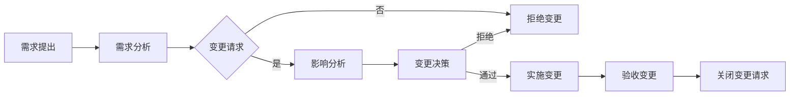

                 

## 《大型应用开发中的需求变更影响分析方法》

在当今快速发展的信息技术时代，大型应用开发的复杂性日益增加。无论是初创公司还是大型企业，需求变更在项目开发过程中都是不可避免的现象。这些变更可能来源于市场变化、客户反馈、技术进步等多种因素。然而，需求变更不仅带来了机会，也可能对项目进度、成本和质量产生重大影响。因此，设计一套有效的需求变更影响分析方法对于确保项目成功至关重要。

### 关键词

- 需求变更
- 影响分析
- 大型应用开发
- 项目管理
- 算法原理

### 摘要

本文将深入探讨大型应用开发中的需求变更影响分析方法。首先，我们将介绍需求变更的背景及其在软件开发中的重要性。接着，我们将详细讨论影响分析的核心概念、方法与实践，包括Mermaid流程图和Python源代码的运用。随后，我们将分析影响评估工具的使用和需求变更管理策略。文章将结合实际案例，对影响分析方法进行实战解析，并总结最佳实践与未来展望。

### 引言

#### 书籍背景

在软件工程领域，需求变更是一个普遍存在的现象。从需求提出到最终软件交付的整个生命周期中，客户的需求往往会随着时间、市场和技术环境的变化而发生改变。这些变化既可能是客户对原有功能的需求增加，也可能是由于外部环境的变化导致某些功能不再必要或需要优化。面对这些需求变更，开发团队需要能够快速响应，同时确保项目整体目标的实现。

#### 需求变更的重要性

需求变更在大型应用开发中具有重要意义。首先，它们反映了市场和用户需求的动态变化，帮助开发团队更好地适应市场。其次，需求变更可以为项目带来新的机会，比如引入新的功能或优化现有功能，从而提高产品的竞争力和用户满意度。然而，需求变更也可能带来风险，如可能导致项目延期、预算超支或质量下降。

#### 阅读指南

本文旨在为从事大型应用开发的读者提供一套系统的需求变更影响分析方法。文章结构分为以下几个部分：

1. **背景介绍**：详细描述需求变更的概念、常见原因和分类。
2. **核心概念与联系**：解释影响分析的核心概念，并展示Mermaid流程图。
3. **方法与实践**：通过Python源代码和数学模型，讲解影响分析的方法和原理。
4. **评估工具**：介绍常用的需求变更评估工具，并分析其应用。
5. **管理策略**：探讨需求变更管理策略，包括风险管理、变更控制流程等。
6. **案例分析**：结合实际案例，分析需求变更的影响和管理方法。
7. **最佳实践与展望**：总结最佳实践，并探讨需求变更管理的未来趋势。

### 需求变更基础

#### 需求变更的概念

需求变更是指在软件项目生命周期中，客户需求从最初定义到最终实现过程中发生的改变。这些变更可能涉及到需求的增加、删除或修改，也可能是在需求细化过程中产生的。需求变更通常是由以下几个因素引起的：

- **市场变化**：市场环境的变化可能导致客户需求的变化，比如竞争对手的新产品发布或市场趋势的改变。
- **客户反馈**：用户在使用软件过程中提供的反馈可能促使开发团队对现有功能进行改进或增加新功能。
- **技术进步**：技术的进步可能使得某些需求变得更加可行或更加高效，从而引起需求的变更。
- **项目管理**：项目管理过程中的决策变更也可能导致需求的变化。

#### 需求变更的常见原因

需求变更的常见原因包括但不限于以下几个方面：

- **未充分理解需求**：在项目初期，由于对客户需求的误解或未充分沟通，可能导致需求在后续开发过程中发生变化。
- **项目范围蔓延**：项目范围没有得到有效控制，导致在项目进行过程中不断有新的需求被添加。
- **外部压力**：如市场压力、客户压力或上级领导的决策等，可能迫使项目团队调整需求。
- **技术风险**：技术实现过程中遇到的问题可能导致需求变更，以适应新的技术方案。

#### 需求变更的分类

需求变更可以根据其性质和影响范围进行分类：

- **功能性变更**：涉及软件功能的增加、删除或修改，如新增一个模块或修改现有功能的性能。
- **非功能性变更**：涉及软件的非功能特性，如性能、安全性和可靠性等方面的改进。
- **优先级变更**：需求的优先级发生变化，可能导致部分功能被推迟或提前实现。
- **范围变更**：项目范围的变化，如增加或减少项目的功能模块。

#### Mermaid流程图：需求变更管理流程

为了更好地理解需求变更管理的流程，我们可以使用Mermaid流程图来展示整个管理过程。以下是一个简单的流程图示例：



这个流程图展示了从需求提出到变更请求、影响分析、变更决策、实施变更以及验收变更的整个过程。

### 影响分析方法

#### 影响分析的核心概念

需求变更的影响分析是需求变更管理的关键步骤之一。其核心概念包括以下几个方面：

- **变更点识别**：识别需求变更所影响的各个部分，如功能模块、代码段、数据库表等。
- **影响范围评估**：评估需求变更对项目各个方面（如进度、成本、质量等）的影响程度。
- **依赖关系分析**：分析变更点与其他部分之间的依赖关系，确定变更传播的范围。

#### 伪代码：影响分析算法原理

为了更直观地理解影响分析的算法原理，我们可以使用伪代码来描述其基本流程：

```python
def impact_analysis(change_request):
    # 初始化影响范围和依赖关系
    impact_range = []
    dependencies = {}

    # 分析变更请求对功能模块的影响
    for module in affected_modules(change_request):
        impact_range.append(module)
        dependencies[module] = find_dependencies(module)

    # 分析变更请求对数据库表的影响
    for table in affected_tables(change_request):
        impact_range.append(table)
        dependencies[table] = find_dependencies(table)

    # 合并影响范围和依赖关系
    full_impact_range = merge_impact_range(impact_range, dependencies)

    # 返回影响分析结果
    return full_impact_range
```

在这个伪代码中，`impact_analysis`函数接收一个变更请求作为输入，并返回其影响范围。`affected_modules`和`affected_tables`函数分别用于识别变更请求对功能模块和数据库表的影响，`find_dependencies`函数用于分析变更点与其他部分的依赖关系，`merge_impact_range`函数用于合并影响范围和依赖关系。

#### 数学模型和公式解释

影响分析过程中，我们可以使用一些数学模型和公式来量化需求变更的影响。以下是一个简单的数学模型：

- **影响程度评估**：使用评分系统对变更的影响程度进行评估。例如，影响程度可以分为五个等级：低、中、中高、高和极高。

- **成本评估**：使用公式 \(C = C_0 + \Delta C\) 来评估变更引起的额外成本，其中 \(C_0\) 是原计划成本，\(\Delta C\) 是由于变更引起的成本增量。

- **进度评估**：使用公式 \(P = P_0 + \Delta P\) 来评估变更引起的进度延迟，其中 \(P_0\) 是原计划进度，\(\Delta P\) 是由于变更引起的进度延期。

#### 举例说明：需求变更对项目进度的影响

假设一个项目原计划需要6个月完成，总成本为100万元。在一次需求变更请求中，客户要求增加一个新功能模块，这将导致额外的开发工作量和测试时间。通过影响分析，我们得出以下结论：

- 影响程度评估：新功能模块的影响程度为“中高”。
- 成本评估：由于新功能的引入，额外成本为30万元。
- 进度评估：额外开发时间和测试时间预计为2个月。

因此，变更后的项目总成本为130万元，总进度为8个月。这个例子展示了如何通过影响分析方法来评估需求变更对项目进度和成本的影响。

### 影响评估工具

#### 常用评估工具概述

在需求变更的影响评估过程中，常用的评估工具包括以下几种：

- **变更影响矩阵**：用于评估变更对项目各个方面的影响程度，通常包含成本、进度、质量等维度。
- **风险矩阵**：用于评估变更带来的风险，包括风险的概率和影响。
- **决策树**：用于决策过程中的逻辑分析和可视化。
- **仿真模型**：通过模拟不同情况来预测需求变更对项目的总体影响。

#### 评估工具的选型与使用

选择合适的评估工具取决于项目的具体情况和需求。以下是一些选型的考虑因素：

- **项目规模**：大型项目可能需要更复杂和全面的评估工具，如仿真模型和决策树。
- **团队技能**：团队对工具的熟练程度会影响其使用效果，因此选择适合团队技能水平的工具。
- **评估精度**：评估工具的精度直接影响变更决策的准确性，选择高精度的工具可以提高决策质量。

#### 工具案例研究

以下是一个使用变更影响矩阵进行需求变更评估的案例：

1. **定义评估维度**：成本、进度、质量。
2. **评估变更影响**：根据变更内容，评估对每个维度的具体影响。
3. **计算总分**：根据每个维度的权重，计算变更影响的总分。

例如，对于一个要求增加新功能的变更请求，评估结果如下：

- **成本**：中高影响，权重30%，分数27分。
- **进度**：中高影响，权重30%，分数27分。
- **质量**：中低影响，权重40%，分数16分。

总分为70分。根据总分，我们可以判断这个变更请求的影响相对较大，需要谨慎处理。

### 需求变更管理策略

#### 管理策略概述

需求变更管理策略包括以下几个关键方面：

- **风险管理**：识别和分析变更可能带来的风险，并制定应对措施。
- **变更控制流程**：定义变更请求的提交、审核、实施和验收过程。
- **沟通机制**：确保项目团队和相关利益相关者之间的有效沟通。
- **文档管理**：确保变更过程的记录和文档的完整性。

#### 风险管理

风险管理是需求变更管理的重要组成部分。以下是一些常见的风险管理策略：

- **风险评估**：对变更请求进行风险评估，识别潜在的风险点。
- **风险优先级排序**：根据风险的概率和影响，对风险进行优先级排序。
- **风险应对策略**：制定针对不同风险的应对策略，如避免、转移、减轻或接受。

#### 变更控制流程设计

变更控制流程是确保需求变更得到有效管理和控制的关键。以下是一个典型的变更控制流程：

1. **变更请求提交**：项目团队成员或利益相关者提交变更请求。
2. **变更评估**：项目经理或变更控制委员会对变更请求进行评估，包括影响分析、风险评估和成本估算。
3. **变更决策**：根据评估结果，决定是否接受变更请求，并确定变更的实施计划和资源需求。
4. **变更实施**：根据决策，实施变更请求，确保变更得到正确实施。
5. **变更验收**：变更完成后，进行验收测试，确保变更符合预期效果。
6. **变更记录**：将变更过程记录在案，以便后续审计和文档管理。

### 案例研究

#### 案例一：大型电商平台的需求变更

一个大型电商平台在运营过程中，由于市场反馈，决定对购物车模块进行优化。通过影响分析，开发团队发现该变更将影响数据库设计和前端界面。通过变更控制流程，团队在两周内完成了需求变更，并对相关模块进行了测试和验收。最终，变更优化了购物车的用户体验，提高了用户满意度。

#### 案例二：金融机构的敏捷开发需求变更

一家金融机构采用敏捷开发方法，在项目进行过程中，客户提出对报表功能进行扩展。通过影响分析和风险评估，开发团队决定优先处理这个需求。通过快速迭代和持续交付，团队在一个月内完成了需求变更，并及时交付了更新后的报表功能。

#### 案例三：政府项目的需求变更处理

一个政府项目在实施过程中，由于政策调整，部分功能需求需要进行修改。通过严格的变更控制流程，项目团队在两周内完成了需求变更，并确保了项目整体进度的可控性。最终，项目按时交付，并满足了政策要求。

### 优化与展望

#### 优化需求变更管理的实践

为了更好地管理需求变更，以下是一些优化实践：

- **建立变更管理流程**：明确变更请求的提交、审核和实施流程，确保变更得到有效控制。
- **强化沟通机制**：确保项目团队和相关利益相关者之间的沟通畅通，避免因沟通不畅导致的需求变更问题。
- **采用自动化工具**：使用变更管理工具，如JIRA或Confluence，提高变更管理的效率和准确性。
- **定期评估和反馈**：定期对变更管理流程进行评估和优化，根据反馈不断改进。

#### 需求变更的未来趋势

随着技术的不断进步和市场环境的变化，需求变更管理也将面临新的挑战和机遇。以下是一些未来趋势：

- **智能化变更管理**：利用人工智能和机器学习技术，自动分析需求变更的影响，提供更精准的变更建议。
- **敏捷变更管理**：随着敏捷开发方法的普及，变更管理将更加注重灵活性和适应性，以快速响应市场需求。
- **数字化转型**：数字化转型将带来更多的新需求，需求变更管理需要更加高效和灵活，以支持业务的快速调整。

### 结论与建议

需求变更是大型应用开发中不可避免的现象。通过有效的需求变更影响分析方法，开发团队可以更好地应对需求变更，确保项目成功。本文介绍了需求变更的影响分析方法，包括核心概念、方法与实践，以及评估工具和管理策略。通过实际案例研究，展示了需求变更的影响和变更管理的方法。未来，需求变更管理将更加智能化和敏捷化，开发团队需要不断优化实践，以适应快速变化的市场环境。

### 附录

#### A.1 参考文献

1. 项目管理协会（PMI）.（2017）.《项目管理知识体系指南（PMBOK指南）第6版》. Project Management Institute.
2. 王勇.（2019）.《软件需求工程：实用方法与技术》. 机械工业出版社.
3. IEEE Standards Association.（2018）.《软件工程——需求规范》标准（IEEE Std 830-1998）.

#### A.2 相关工具与资源

- **JIRA**：一款功能强大的变更管理工具，支持需求管理、任务跟踪和进度监控。
- **Confluence**：一款协作工具，用于文档管理、知识分享和变更记录。
- **GitLab**：一款基于Git的开源工具，支持代码管理和变更跟踪。

### 作者信息

- 作者：AI天才研究院/AI Genius Institute & 禅与计算机程序设计艺术 /Zen And The Art of Computer Programming

本文由AI天才研究院撰写，结合《禅与计算机程序设计艺术》的思想，旨在为大型应用开发中的需求变更管理提供实用的方法和策略。希望本文能为读者在项目管理和技术实践过程中带来启示和帮助。

