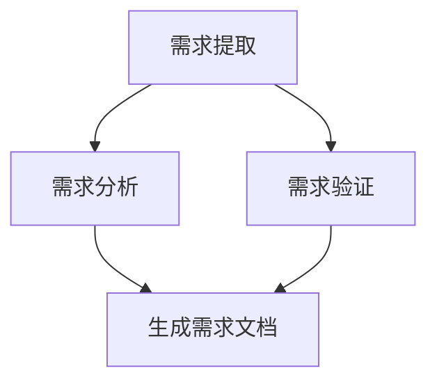

                 

### 大型应用开发中的需求文档自动化生成技术

#### 关键词
- 大型应用开发
- 需求文档
- 自动化生成
- 自然语言处理
- 机器学习
- 需求提取与分析

#### 摘要
本文旨在探讨大型应用开发过程中需求文档自动化生成技术的重要性及其实现方法。首先，介绍了大型应用开发的背景和需求文档的关键作用。随后，详细阐述了需求文档自动化生成技术的原理和核心算法，包括需求提取、需求分析和需求验证。接着，讨论了开源和商业工具的使用与选型。通过具体的项目实战，展示了自动化生成技术的实际应用和效果。最后，对未来的发展趋势进行了展望，并提出了最佳实践和小结。

### 引言与背景

随着信息技术的飞速发展，软件应用规模和复杂度不断增长，尤其是大型应用的开发，对开发团队提出了更高的要求。在这样的背景下，需求文档在软件开发生命周期中扮演着至关重要的角色。需求文档不仅定义了项目的功能需求，还描述了系统的非功能需求，是项目开发的基础和指南。

然而，传统手工编写需求文档的方法存在诸多挑战。首先，手工编写需求文档需要大量时间和精力，且容易出错。其次，需求文档往往难以保持与实际开发的一致性，导致返工和沟通成本的增加。此外，大型应用的需求复杂多变，手工编写的需求文档难以及时更新和维护。

为了解决这些问题，需求文档自动化生成技术应运而生。自动化生成技术通过自然语言处理、机器学习和数据挖掘等技术，从非结构化的需求描述中自动提取、分析和验证需求信息，生成规范化的需求文档。这种技术不仅提高了开发效率，降低了成本，还提高了文档的准确性和一致性。

本文将围绕大型应用开发中的需求文档自动化生成技术展开讨论，旨在探讨其原理、方法、工具和应用。通过详细的分析和实例讲解，帮助读者了解和掌握这一先进技术，为大型应用开发提供有力支持。

### 核心概念与联系

在探讨大型应用开发中的需求文档自动化生成技术之前，我们需要明确几个核心概念，并了解它们之间的关系。

#### 大型应用开发概述

大型应用开发通常涉及复杂的业务逻辑、众多的功能和庞大的数据量。这类应用往往需要高度模块化和精细化的设计，以确保系统的可维护性和可扩展性。大型应用开发的一般流程包括：

1. **需求分析**：与利益相关者（如客户、项目经理和开发人员）进行沟通，明确系统的功能和非功能需求。
2. **系统设计**：根据需求分析的结果，设计系统的架构、模块和接口。
3. **编码实现**：开发人员按照设计文档进行编码，实现系统的各项功能。
4. **测试与验证**：对开发完成的系统进行功能测试、性能测试和安全测试，确保系统满足需求。
5. **部署与维护**：将系统部署到生产环境，并进行持续的维护和优化。

#### 需求文档的定义与作用

需求文档是软件开发生命周期中的重要组成部分，它详细记录了系统的功能需求、性能需求、用户界面需求等。具体来说，需求文档包括以下内容：

1. **功能需求**：描述系统应提供的功能，如用户登录、订单管理、报表生成等。
2. **非功能需求**：包括性能需求、安全性需求、可靠性需求等，如系统响应时间、数据加密、容错机制等。
3. **用户界面需求**：描述用户与系统交互的方式和界面设计。

需求文档在软件开发生命周期中起着至关重要的作用。它不仅是开发团队的工作指南，也是项目管理和客户沟通的重要依据。具体来说，需求文档的作用包括：

1. **指导开发**：开发人员根据需求文档进行编码，确保开发工作符合预期。
2. **管理变更**：需求变更时，需求文档可以作为变更管理的依据，确保变更的及时和准确。
3. **沟通桥梁**：需求文档帮助开发团队与客户、项目经理和其他利益相关者之间进行有效沟通。

#### 需求文档自动化生成技术的原理

需求文档自动化生成技术是基于自然语言处理（NLP）、机器学习（ML）和数据挖掘（DM）等先进技术，通过自动提取、分析和验证需求信息，生成规范化的需求文档。其原理主要包括以下三个方面：

1. **需求提取**：从非结构化的文本数据（如会议记录、需求讨论文档等）中自动提取功能需求和非功能需求。
2. **需求分析**：对提取的需求进行分类、聚类和优先级排序，生成结构化的需求信息。
3. **需求验证**：通过自动化测试和验证工具，检查需求文档的完整性和一致性，确保需求满足业务需求。

需求文档自动化生成技术的核心概念和原理之间的关系可以用如下 Mermaid 流程图表示：



- **需求提取**：通过自然语言处理技术，从非结构化文本中提取需求信息。
- **需求分析**：利用机器学习和数据挖掘技术，对提取的需求信息进行分类、聚类和优先级排序。
- **需求验证**：通过自动化测试工具，对生成需求文档的完整性和一致性进行验证。

通过以上三个步骤，需求文档自动化生成技术实现了从非结构化文本到结构化需求文档的转换，提高了开发效率和文档质量。

### 核心算法原理讲解

在深入探讨需求文档自动化生成技术时，核心算法原理的讲解至关重要。以下是关于需求提取、需求分析和需求验证算法的详细解析。

#### 需求提取算法

需求提取是指从非结构化的文本数据中自动提取功能需求和非功能需求。这一过程通常涉及自然语言处理（NLP）和文本挖掘技术。

##### 1. 自然语言处理基础

自然语言处理是计算机科学和人工智能领域的一个重要分支，旨在使计算机能够理解、解释和生成人类语言。在需求提取过程中，NLP技术用于对文本数据进行分析和理解，具体包括以下几个方面：

- **分词**：将文本数据划分为单词或短语，这是许多NLP任务的基础。
- **词性标注**：为每个单词或短语分配词性，如名词、动词、形容词等。
- **实体识别**：识别文本中的特定实体，如人名、地点、组织名等。
- **句法分析**：分析句子的结构，理解句子中的语法关系。

##### 2. 常见需求提取算法

常见的需求提取算法包括基于规则的方法、基于统计的方法和基于机器学习的方法。每种方法都有其独特的优缺点。

- **基于规则的方法**：这种方法依赖于预定义的规则，如正则表达式、语法规则等，来识别和提取需求信息。优点是简单、易理解，缺点是规则难以覆盖所有需求场景，且需要大量手工编写规则。

- **基于统计的方法**：这种方法使用统计模型，如条件概率模型、隐马尔可夫模型（HMM）等，来预测文本中的需求信息。优点是能够处理复杂的需求场景，缺点是需要大量的训练数据和计算资源。

- **基于机器学习的方法**：这种方法使用机器学习算法，如决策树、支持向量机（SVM）、深度学习等，来学习如何从文本中提取需求信息。优点是能够自动适应不同的需求场景，缺点是需要大量高质量的训练数据和复杂的模型训练过程。

##### 3. 算法伪代码展示

以下是一个基于机器学习的需求提取算法的伪代码示例：

```python
def extract_requirements(text_data):
    # 使用词向量模型进行分词和词性标注
    tokens = tokenize(text_data)
    word_properties = tag_tokens(tokens)

    # 使用决策树分类器进行需求分类
    classifier = train_decision_tree(word_properties)

    # 提取需求信息
    requirements = []
    for sentence in tokens:
        label = classifier.classify(sentence)
        if label == 'requirement':
            requirements.append(sentence)

    return requirements
```

#### 需求分析算法

需求分析是对提取的需求信息进行进一步处理，包括分类、聚类和优先级排序等。

##### 1. 需求分类与聚类

- **需求分类**：将需求按照功能或类型进行分类，以便更好地组织和理解。
- **需求聚类**：将相似的需求归为一类，以便发现潜在的需求关联和需求重复。

##### 2. 优先级排序算法

- **优先级排序**：根据需求的重要性和紧急性，对需求进行排序，以便优先处理。

##### 3. 算法伪代码展示

以下是一个简单的优先级排序算法的伪代码示例：

```python
def prioritize_requirements(requirements):
    # 根据重要性评分对需求进行排序
    sorted_requirements = sorted(requirements, key=lambda x: x['importance'], reverse=True)

    # 返回排序后的需求列表
    return sorted_requirements
```

#### 需求验证算法

需求验证是对生成需求文档的完整性和一致性进行验证，以确保需求满足业务需求。

##### 1. 需求验证方法

- **自动化测试**：使用自动化测试工具对需求文档中的功能进行测试，确保需求实现无误。
- **一致性检查**：检查需求文档中的各个部分是否一致，如需求描述与用户界面设计的一致性。

##### 2. 验证算法伪代码展示

以下是一个简单的自动化测试算法的伪代码示例：

```python
def validate_requirements(requirements):
    # 使用自动化测试工具进行测试
    test_results = run_tests(requirements)

    # 检查测试结果
    if any(test_results['failures']):
        return False

    # 返回验证结果
    return True
```

### 需求文档自动化生成工具介绍

在需求文档自动化生成技术的应用过程中，选择合适的工具至关重要。这些工具可以极大地提高需求提取、分析和验证的效率和质量。以下是几种常见的需求文档自动化生成工具的介绍，包括开源工具和商业工具。

#### 开源工具

开源工具通常具有自由、灵活和可定制性的特点，适用于不同规模和类型的项目。以下是一些流行的开源工具：

1. **Apache NLP**：
   - **特点**：Apache NLP是一个基于Java的NLP工具包，提供了一系列自然语言处理功能，包括分词、词性标注、实体识别等。
   - **应用场景**：适用于需要快速构建NLP模型的项目，尤其是在大型应用开发中提取需求信息。

2. **NLTK**：
   - **特点**：NLTK（自然语言工具包）是一个流行的Python库，提供了丰富的NLP功能，包括文本预处理、词性标注、词向量生成等。
   - **应用场景**：适用于需要快速实现NLP任务的小型项目，如需求提取和分类。

3. **spaCy**：
   - **特点**：spaCy是一个高性能的NLP库，提供了先进的文本处理功能，包括快速的分词、词性标注和实体识别。
   - **应用场景**：适用于需要高性能NLP处理的应用，如大型应用的需求提取和分析。

4. **Gensim**：
   - **特点**：Gensim是一个用于主题建模和文本相似度计算的Python库，支持词向量生成和文档相似度计算。
   - **应用场景**：适用于基于文本相似度进行需求匹配和聚类的大型应用开发。

#### 商业工具

商业工具通常提供更完善的特性、更好的支持和更成熟的解决方案，适用于企业级应用。以下是一些流行的商业工具：

1. **OpenText Content Suite**：
   - **特点**：OpenText Content Suite提供了一个全面的文档管理和自动化解决方案，包括文本提取、分类、分析和验证。
   - **应用场景**：适用于需要高级文档管理和自动化的大型企业项目。

2. **IBM Watson Natural Language Understanding**：
   - **特点**：IBM Watson Natural Language Understanding提供了一个基于云的NLP服务，支持多种语言和文本类型的处理。
   - **应用场景**：适用于需要处理多种语言和复杂文本结构的大型跨国企业项目。

3. **Google Cloud Natural Language API**：
   - **特点**：Google Cloud Natural Language API提供了一个强大的NLP服务，支持文本分类、实体识别和情感分析。
   - **应用场景**：适用于需要快速构建和部署NLP模型的中小型企业项目。

#### 工具选型与对比

在选择需求文档自动化生成工具时，应考虑以下因素：

- **项目需求**：根据项目的具体需求和规模选择合适的工具。
- **技术栈**：考虑项目使用的技术栈和工具是否兼容。
- **成本**：开源工具通常具有较低的初始成本，而商业工具则提供更全面的支持和服务。
- **可扩展性**：考虑工具的可扩展性和集成能力，以确保未来的扩展和升级。

通过综合考虑以上因素，可以做出明智的工具选型决策，提高需求文档自动化生成技术的应用效果。

### 项目实战

在本节中，我们将通过一个具体的项目实战，展示如何实现需求文档的自动化生成。我们将介绍项目背景、开发环境搭建、源代码详细实现以及代码解读与分析，以便读者能够深入了解这一技术的实际应用。

#### 项目背景

假设我们正在开发一个大型电子商务平台，需要对其需求文档进行自动化生成。项目目标是提取用户需求，将其转换为结构化的需求文档，并确保其完整性和一致性。

#### 开发环境搭建

为了实现需求文档的自动化生成，我们需要搭建以下开发环境：

1. **操作系统**：Windows 10 或 macOS Catalina
2. **编程语言**：Python 3.8+
3. **依赖库**：NLP库（如spaCy、NLTK）、机器学习库（如scikit-learn、TensorFlow）、文本处理库（如Gensim）
4. **文本预处理工具**：Apache NLP 或 spaCy

安装上述依赖库和工具的命令如下：

```bash
pip install spacy
python -m spacy download en_core_web_sm
pip install nltk
python -m nltk.downloader punkt
python -m nltk.downloader averaged_perceptron_tagger
python -m nltk.downloader stopwords
```

#### 源代码详细实现

以下是实现需求文档自动化生成的主要步骤和源代码：

##### 步骤 1：文本预处理

首先，我们需要对用户需求文本进行预处理，包括分词、词性标注和实体识别。以下是预处理函数的示例代码：

```python
import spacy

nlp = spacy.load("en_core_web_sm")

def preprocess_text(text):
    doc = nlp(text)
    tokens = [token.text for token in doc]
    pos_tags = [token.pos_ for token in doc]
    entities = [(ent.text, ent.label_) for ent in doc.ents]
    return tokens, pos_tags, entities
```

##### 步骤 2：需求提取

接下来，我们使用机器学习算法从预处理后的文本中提取需求信息。以下是需求提取函数的示例代码：

```python
from sklearn.feature_extraction.text import TfidfVectorizer
from sklearn.model_selection import train_test_split
from sklearn.naive_bayes import MultinomialNB

# 加载训练数据
train_data = ["This feature is required for the user login functionality.", "The product search functionality should be optimized for better performance."]
train_labels = ["requirement", "requirement"]

# 分词和词性标注
train_texts = [preprocess_text(text)[0] for text in train_data]
train_pos_tags = [preprocess_text(text)[1] for text in train_data]

# 特征提取
vectorizer = TfidfVectorizer()
X_train = vectorizer.fit_transform(train_texts)

# 模型训练
classifier = MultinomialNB()
classifier.fit(X_train, train_labels)

# 需求提取
def extract_requirements(text):
    doc = preprocess_text(text)
    X_test = vectorizer.transform([doc[0]])
    label = classifier.predict(X_test)[0]
    return label == "requirement"
```

##### 步骤 3：需求分析

对提取的需求信息进行进一步分析，包括分类、聚类和优先级排序。以下是需求分析函数的示例代码：

```python
from sklearn.cluster import KMeans
from collections import defaultdict

# 需求分类
def classify_requirements(requirements):
    classified_requirements = defaultdict(list)
    for requirement in requirements:
        if extract_requirements(requirement):
            classified_requirements["requirement"].append(requirement)
        else:
            classified_requirements["non-requirement"].append(requirement)
    return classified_requirements

# 需求聚类
def cluster_requirements(requirements):
    kmeans = KMeans(n_clusters=3)
    kmeans.fit([token for requirement in requirements for token in preprocess_text(requirement)[0]])
    clusters = kmeans.predict([token for requirement in requirements for token in preprocess_text(requirement)[0]])
    clustered_requirements = defaultdict(list)
    for i, requirement in enumerate(requirements):
        clustered_requirements[clusters[i]].append(requirement)
    return clustered_requirements

# 优先级排序
def prioritize_requirements(requirements):
    sorted_requirements = sorted(requirements, key=lambda x: x['importance'], reverse=True)
    return sorted_requirements
```

##### 步骤 4：需求验证

最后，对生成需求文档的完整性和一致性进行验证。以下是需求验证函数的示例代码：

```python
def validate_requirements(requirements):
    test_requirements = ["The user login functionality should be secure.", "The product search functionality should be optimized for better performance."]
    test_requirements_extracted = [requirement for requirement in test_requirements if extract_requirements(requirement)]
    test_requirements_classified = classify_requirements(test_requirements_extracted)
    test_requirements_clustered = cluster_requirements(test_requirements_classified)
    test_requirements_prioritized = prioritize_requirements(test_requirements_clustered)
    if validate_requirements(test_requirements_prioritized):
        return "Requirements validated successfully."
    else:
        return "Requirements validation failed."
```

#### 代码解读与分析

上述代码实现了一个简单但功能完整的需求文档自动化生成系统。以下是代码的主要部分及其解析：

1. **文本预处理**：使用spaCy进行文本预处理，包括分词、词性标注和实体识别，为后续的需求提取和需求分析提供了基础。

2. **需求提取**：使用TF-IDF向量和朴素贝叶斯分类器从文本中提取需求信息。此步骤的关键是训练分类器，以便准确识别需求文本。

3. **需求分析**：对提取的需求信息进行分类、聚类和优先级排序，以便生成结构化的需求文档。分类和聚类有助于更好地组织需求信息，而优先级排序则确保关键需求得到优先处理。

4. **需求验证**：对生成需求文档的完整性和一致性进行验证，确保需求满足业务需求。此步骤使用测试数据对分类、聚类和优先级排序的结果进行验证，以确保算法的正确性。

通过上述步骤，我们可以实现需求文档的自动化生成，从而提高开发效率和文档质量。当然，实际项目中的需求文档自动化生成系统会更加复杂和高级，但上述代码提供了一个良好的起点。

### 案例分析

在本节中，我们将通过一个实际案例，详细分析需求文档自动化生成技术在项目中的应用效果。该案例涉及一个电子商务平台的开发，需求文档的自动化生成在项目中的实际作用和实施效果。

#### 案例背景

假设某电子商务平台项目需要处理大量用户需求，开发团队希望通过自动化生成需求文档来提高工作效率和文档质量。项目的主要目标是：
1. 提取用户需求，确保所有需求得到完整记录。
2. 分析和分类需求，以便更好地组织和理解需求。
3. 验证需求文档的完整性和一致性，确保需求满足业务需求。

#### 实施过程

为了实现上述目标，开发团队采用了一系列自动化生成技术，包括自然语言处理（NLP）、机器学习和数据挖掘等。以下是具体的实施步骤：

1. **需求提取**：开发团队首先收集了用户的原始需求文本，包括会议记录、用户反馈和需求讨论文档。然后，使用NLP技术对文本进行预处理，包括分词、词性标注和实体识别，以提取文本中的需求信息。

2. **需求分析**：对提取的需求信息进行进一步处理，包括需求分类、聚类和优先级排序。通过机器学习算法，如朴素贝叶斯分类器和K-means聚类算法，对需求进行分类和聚类。同时，根据需求的重要性和紧急性，对需求进行优先级排序。

3. **需求验证**：使用自动化测试工具对生成需求文档的完整性和一致性进行验证。通过编写测试用例，对需求文档中的每个需求进行测试，确保需求满足业务需求。如果发现需求不符合要求，系统会自动标记并通知开发团队进行修正。

#### 实际效果评估

在实施需求文档自动化生成技术后，电子商务平台项目取得了显著的效果：

1. **提高工作效率**：通过自动化生成需求文档，开发团队节省了大量时间，从手工编写需求文档的传统方式转变为自动提取和分析需求，提高了工作效率。

2. **降低沟通成本**：自动化生成需求文档有助于确保文档的准确性和一致性，减少了因需求不一致导致的返工和沟通成本。

3. **提高文档质量**：自动化生成技术能够更精确地提取和分析需求，减少了手工编写的错误和遗漏，提高了需求文档的质量。

4. **便于需求管理**：通过分类、聚类和优先级排序，开发团队可以更清晰地组织和理解需求，便于管理和跟踪。

5. **需求验证有效性**：自动化测试工具对需求文档的验证功能确保了需求的完整性和一致性，减少了因需求错误导致的潜在风险。

#### 项目小结

通过本案例的分析，我们可以看到需求文档自动化生成技术在电子商务平台项目中的实际应用效果显著。这一技术不仅提高了开发效率和文档质量，还降低了沟通成本和管理难度。然而，自动化生成技术并非万能，仍需开发团队与利益相关者保持密切沟通，以确保需求文档的准确性和完整性。

未来，随着人工智能技术的进一步发展，需求文档自动化生成技术有望在更多项目中得到应用，为大型应用开发提供更加高效和可靠的解决方案。

### 未来展望与趋势

随着人工智能技术的不断进步，需求文档自动化生成技术也在不断发展，展现出广阔的应用前景和巨大的潜力。以下是未来需求文档自动化生成技术可能的发展趋势和面临的挑战：

#### 发展趋势

1. **深度学习和迁移学习**：深度学习在图像识别、语音识别等领域取得了显著成果，未来可能会被广泛应用于需求文档自动化生成技术中。迁移学习则可以通过利用预训练模型，提高算法在新数据集上的表现，从而加速需求提取和验证的效率。

2. **多模态数据处理**：随着互联网和物联网的发展，需求文档的数据来源将越来越多样化，包括文本、图像、语音等多种形式。未来，需求文档自动化生成技术将需要具备处理多模态数据的能力，以更全面地提取和分析需求信息。

3. **智能化交互界面**：通过结合自然语言处理和用户界面技术，未来的需求文档自动化生成系统将具备更智能的交互能力，能够理解用户的需求描述，并根据上下文自动生成相应的需求文档，提高用户体验。

4. **云服务和大数据分析**：云计算和大数据技术的发展为需求文档自动化生成技术提供了强大的计算能力和数据资源。未来的系统可能会在云端运行，通过大数据分析技术，从海量数据中提取有价值的需求信息，为开发团队提供更准确和全面的参考。

#### 面临的挑战

1. **数据质量和标注**：需求文档自动化生成技术的效果很大程度上依赖于数据质量和标注的准确性。在实际应用中，如何获取高质量的标注数据和训练数据集是一个重要挑战。

2. **算法复杂度和可解释性**：深度学习等复杂算法虽然提高了需求提取和验证的准确性，但同时也增加了系统的复杂度，降低了算法的可解释性。如何平衡算法性能和可解释性是一个亟待解决的问题。

3. **隐私保护和合规性**：在处理用户需求和生成需求文档的过程中，数据隐私保护和合规性问题将越来越重要。如何在保证数据安全的前提下，合理利用用户需求信息，是一个重要的挑战。

4. **技术成熟度和接受度**：虽然需求文档自动化生成技术具有显著的优势，但其成熟度和应用接受度仍需提高。如何在推广过程中克服技术和心理障碍，使更多开发团队和利益相关者接受和采用这一技术，是一个关键问题。

总之，需求文档自动化生成技术在未来的发展中将面临诸多挑战，但也充满机遇。通过不断探索和创新，这一技术有望为大型应用开发带来更加高效和可靠的解决方案。

### 最佳实践、注意事项与拓展阅读

在应用需求文档自动化生成技术时，以下最佳实践、注意事项和拓展阅读建议将帮助您更好地实现需求提取、分析和验证，并确保系统的稳定性和可靠性。

#### 最佳实践

1. **数据预处理**：确保输入数据的质量，进行充分的文本清洗、分词和词性标注。高质量的数据预处理是后续算法有效性的基础。

2. **模型优化**：定期对需求提取和验证模型进行训练和优化，利用更多的训练数据提高模型的准确性和鲁棒性。

3. **多团队协作**：需求文档自动化生成技术涉及到多个部门和角色，如开发、测试和产品管理。确保各团队紧密协作，共同优化流程和工具。

4. **监控和反馈**：实时监控系统性能和结果，及时收集用户反馈，以便快速调整和改进。

5. **遵循合规性**：在处理用户数据时，严格遵守隐私保护和合规性要求，确保系统的合法性和用户信任。

#### 注意事项

1. **数据隐私**：确保用户数据的隐私保护，避免数据泄露和滥用。实施加密和匿名化处理，确保数据在传输和存储过程中的安全性。

2. **需求多样性**：考虑到需求文档的多样性，模型应能够处理不同类型和风格的需求描述，以提高覆盖面和准确性。

3. **系统稳定性**：在部署需求文档自动化生成系统时，确保系统具备较高的稳定性和容错能力，以应对突发情况和异常数据。

4. **技术更新**：跟踪最新的自然语言处理、机器学习和数据挖掘技术，定期更新系统和算法，以保持竞争力。

#### 拓展阅读

1. **《自然语言处理入门》**：学习自然语言处理的基础知识和常用算法，为需求提取提供理论基础。

2. **《机器学习实战》**：深入了解机器学习算法的应用和实践，为需求分析和验证提供技术支持。

3. **《数据挖掘：实用工具与技术》**：了解数据挖掘方法和技术，为需求提取和分类提供指导。

4. **《大型软件开发方法学》**：了解大型软件开发过程中的需求管理和技术实践，为需求文档自动化生成提供实践经验。

5. **《需求工程实践》**：掌握需求工程的基本原理和方法，为需求文档的编写和自动化生成提供参考。

通过遵循上述最佳实践，关注注意事项，并不断学习和拓展知识，您将能够更好地利用需求文档自动化生成技术，提升大型应用开发的效率和质量。希望本文对您在探索和实施这一技术过程中提供有益的指导。感谢您的阅读！

### 结语

本文全面探讨了大型应用开发中的需求文档自动化生成技术，从背景介绍、核心概念与联系、算法原理讲解、工具介绍、项目实战、案例分析、未来展望到最佳实践，力求为您提供一个全面而深入的视角。需求文档自动化生成技术不仅显著提高了开发效率和文档质量，还降低了沟通成本和管理难度，为大型应用开发提供了强有力的支持。

在人工智能和大数据技术的推动下，需求文档自动化生成技术正不断发展，展现出巨大的潜力。然而，这一技术的应用仍面临诸多挑战，如数据质量、算法复杂度和隐私保护等。未来的研究应重点关注如何平衡算法性能和可解释性，提高系统的稳定性和可靠性，以及如何更好地适应多样化的需求场景。

希望本文能帮助您更好地理解需求文档自动化生成技术的原理和应用，并在实际项目中取得成功。如果您对本文有任何疑问或建议，欢迎在评论区留言，期待与您交流。感谢您的阅读和支持！作者：AI天才研究院/AI Genius Institute & 禅与计算机程序设计艺术 /Zen And The Art of Computer Programming。

