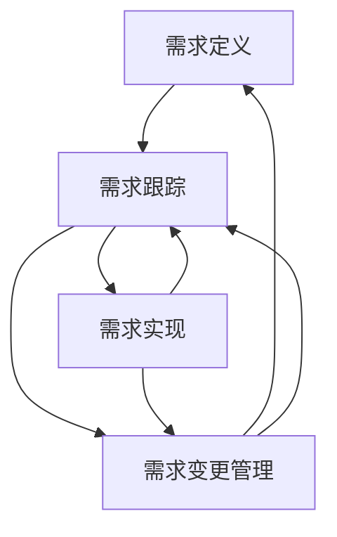

                 

### 文章标题

《大型应用开发中的需求溯源技术应用》

### 文章关键词

需求溯源、大型应用开发、需求管理、变更控制、技术挑战、未来趋势

### 文章摘要

在大型应用开发中，需求溯源技术是一项至关重要的技术，它能够帮助我们理解和追踪系统的需求，确保开发的正确性。本文将详细介绍需求溯源技术的概念、原理、应用方法及其在大型应用开发中的重要性，并通过实际案例展示其应用效果。同时，我们还将探讨需求溯源技术面临的挑战以及未来发展趋势。

---

## 引言与背景

### 需求溯源的概念与重要性

需求溯源（Requirement Tracing）是指通过记录和分析需求生成、变更和实现的过程，确保系统的每一个功能都对应了具体的需求，并且需求的变化能够及时、准确地传递到系统的各个层面。在大型应用开发中，需求溯源技术具有以下几个重要性：

1. **确保需求一致性**：在大型系统中，需求可能会随着时间的推移而发生变化。通过需求溯源，可以确保所有的变更都能够追溯到原始的需求，从而保证系统的一致性。
2. **提高开发效率**：通过需求溯源，开发人员可以快速定位需求的具体实现位置，减少重复工作，提高开发效率。
3. **促进沟通协作**：需求溯源技术有助于各方（如需求分析师、项目经理、开发人员等）之间的沟通和协作，减少误解和冲突。
4. **确保系统质量**：需求溯源有助于发现潜在的问题和风险，从而提高系统的质量。

### 需求溯源的技术架构

需求溯源技术的实现通常包括以下几个关键环节：

1. **需求定义**：明确系统的需求，包括功能需求、性能需求、安全性需求等。
2. **需求记录**：将需求记录在需求管理工具中，以便后续跟踪和变更管理。
3. **需求实现**：在开发过程中，将需求转化为具体的代码或设计。
4. **需求跟踪**：记录需求实现的进度和状态，确保需求得到正确实现。
5. **需求变更管理**：在需求发生变化时，进行变更控制，确保变更得到正确处理。

### 需求溯源的发展历史

需求溯源技术起源于软件开发领域，随着软件系统的复杂性和规模的增长，需求溯源的重要性日益凸显。早期的研究主要集中于如何有效地记录和跟踪需求，随着技术的发展，需求溯源的方法和工具也在不断改进。近年来，随着敏捷开发方法的出现，需求溯源技术得到了进一步的推广和应用。

### 第一部分：需求溯源技术概述

在大型应用开发中，需求溯源技术是一种关键的追溯方法，能够帮助开发团队确保需求的准确性和一致性。本章将详细介绍需求溯源的概念、重要性及其技术架构，并通过历史发展和现状来理解其应用场景。

#### 1.1 需求溯源的概念与重要性

**需求溯源的定义**

需求溯源是指对系统需求从产生到实现的全过程进行跟踪，确保每个功能都能对应到具体的原始需求。这种追溯不仅包括功能需求的跟踪，还涉及性能需求、安全性需求等各个方面。

**需求溯源在大型应用开发中的意义**

- **确保需求一致性**：大型应用开发中，需求可能会频繁变更，需求溯源技术能够帮助团队追踪需求的演变过程，确保系统在不同版本中的一致性。
- **提高开发效率**：通过需求溯源，开发人员可以快速定位需求的具体实现位置，减少重复工作，提高开发效率。
- **促进沟通协作**：需求溯源有助于各方（如需求分析师、项目经理、开发人员等）之间的沟通和协作，减少误解和冲突。
- **确保系统质量**：需求溯源有助于发现潜在的问题和风险，从而提高系统的整体质量。

#### 1.2 需求溯源的技术架构

**需求溯源的基本流程**

1. **需求定义**：明确系统的需求，包括功能需求、性能需求、安全性需求等。
2. **需求记录**：将需求记录在需求管理工具中，以便后续跟踪和变更管理。
3. **需求实现**：在开发过程中，将需求转化为具体的代码或设计。
4. **需求跟踪**：记录需求实现的进度和状态，确保需求得到正确实现。
5. **需求变更管理**：在需求发生变化时，进行变更控制，确保变更得到正确处理。

**关键技术和工具介绍**

- **需求管理工具**：如JIRA、Confluence等，用于记录和管理需求。
- **代码溯源工具**：如Git，用于跟踪代码的变更历史。
- **集成开发环境（IDE）**：支持代码搜索和追踪功能。
- **需求跟踪系统**：如Defect Tracking System（DTS），用于记录和分析需求相关的缺陷。

**需求溯源的发展历史**

- **早期研究**：需求溯源技术在20世纪90年代开始受到关注，主要研究如何有效记录和跟踪需求。
- **技术成熟**：随着软件系统复杂性的增加，需求溯源技术逐渐成熟，并开始应用于大型项目的开发。
- **敏捷开发**：敏捷开发方法的出现进一步推动了需求溯源技术的普及，强调需求的持续迭代和快速反馈。

#### 1.3 需求溯源技术的现状与挑战

**现状**

- **广泛应用**：需求溯源技术已经成为大型应用开发中不可或缺的一部分。
- **工具多样化**：市场上涌现出众多支持需求溯源的工具，如JIRA、Confluence、Git等。

**挑战**

- **需求变化管理**：在快速迭代的开发环境中，需求的变化管理成为挑战。
- **跨部门协作**：需求溯源涉及多个部门，跨部门协作的效率成为挑战。
- **数据一致性**：需求数据的维护和更新需要保证一致性，以避免信息孤岛。

通过本章的介绍，我们可以看到需求溯源技术在大型应用开发中的重要性以及其技术架构的基本组成。接下来，我们将深入探讨需求溯源技术的核心概念和算法原理，帮助读者更好地理解和应用这一关键技术。

#### 2.1 核心概念与联系

需求溯源技术的核心概念包括需求定义、需求跟踪、需求变更管理和需求实现。这些概念相互联系，构成了需求溯源的技术架构。下面，我们将通过Mermaid流程图展示这些核心概念之间的联系。



**需求定义** 是需求溯源的起点，它明确系统的功能需求、性能需求和安全性需求。需求定义通常通过需求管理工具进行记录，为后续的需求跟踪和变更管理提供基础。

**需求跟踪** 是确保需求从定义到实现的全过程都能被追溯。需求跟踪涉及记录需求的状态、进度和实现情况，通常使用需求管理工具和代码溯源工具实现。

**需求变更管理** 是在需求发生变化时进行的管理活动。变更管理确保需求变更能够被有效处理，并且需求的一致性得到保持。变更管理流程通常包括变更请求的提交、评估、批准和实施。

**需求实现** 是将需求转化为具体的代码或设计。需求实现的过程中，需求跟踪和变更管理起到了关键作用，确保需求的准确实现。

通过这个Mermaid流程图，我们可以清晰地看到需求溯源技术的核心概念之间的相互关系。每个环节都是需求溯源不可或缺的一部分，它们共同构建了一个完整的需求管理架构。接下来，我们将进一步探讨需求溯源技术的算法原理，通过Python源代码详细阐述其实现过程。

#### 2.2 需求溯源算法原理

在需求溯源技术中，算法原理是关键的一环，它决定了如何高效地追踪和解析需求。本节将详细介绍需求溯源算法的原理，并通过伪代码和实际应用案例进行讲解。

**算法原理概述**

需求溯源算法的核心任务是建立需求与实现代码之间的映射关系。具体步骤如下：

1. **需求录入**：将需求记录到需求管理工具中，为后续的跟踪和变更管理提供基础。
2. **需求关联**：将需求与实现代码进行关联，建立需求与代码之间的映射关系。
3. **需求跟踪**：在开发过程中，记录需求的实现进度和状态。
4. **变更管理**：在需求发生变化时，更新需求与代码的映射关系，确保需求的一致性。

**伪代码讲解**

以下是一个简单的需求溯源算法的伪代码：

```python
def trace_requirement(requirement_id):
    # 查询需求管理工具中的需求记录
    requirement_record = demand_management_tool.query_requirement(requirement_id)
    
    # 获取与需求关联的代码文件和行号
    associated_code_files = get_associated_code_files(requirement_id)
    
    # 对每个关联的代码文件进行分析
    for code_file, line_number in associated_code_files.items():
        # 解析代码文件，提取需求实现的信息
        implementation_info = parse_code_file(code_file, line_number)
        
        # 更新需求跟踪记录
        update_requirement_tracking(requirement_id, implementation_info)

def get_associated_code_files(requirement_id):
    # 查询需求管理工具中的需求关联代码文件记录
    associated_files = demand_management_tool.query_associated_files(requirement_id)
    
    return associated_files

def parse_code_file(code_file, line_number):
    # 打开代码文件
    with open(code_file, 'r') as file:
        # 读取指定行号的代码内容
        code_line = file.readline(line_number)
        
        # 提取实现信息
        implementation_info = extract_implementation_info(code_line)
        
        return implementation_info

def update_requirement_tracking(requirement_id, implementation_info):
    # 在需求管理工具中更新需求跟踪记录
    demand_management_tool.update_requirement_tracking(requirement_id, implementation_info)
```

**算法实现**

以上伪代码展示了需求溯源算法的基本框架。在实际应用中，我们需要根据具体的需求管理工具和代码环境进行具体的实现。

**实际应用案例**

假设我们有一个需求管理工具，用于记录和管理需求，以及一个代码库用于实现需求。以下是需求溯源算法的实际应用步骤：

1. **需求录入**：开发人员将新的需求录入到需求管理工具中，并分配给相应的开发任务。
2. **需求关联**：开发人员在实现需求时，将需求与对应的代码文件和行号进行关联。这个关联信息会存储在需求管理工具中。
3. **需求跟踪**：需求管理工具会实时更新需求的实现进度和状态，开发人员可以通过工具查看需求的状态。
4. **变更管理**：如果需求发生变化，开发人员可以在需求管理工具中提交变更请求，并更新需求与代码的关联关系。

通过以上算法原理和实际应用案例，我们可以看到需求溯源技术是如何帮助开发团队确保需求的准确性和一致性的。接下来，我们将进一步探讨需求溯源技术中的数学模型和公式，以更深入地理解其原理。

#### 2.3 数学模型与公式解析

在需求溯源技术中，数学模型和公式起着至关重要的作用。这些模型和公式帮助我们量化需求与实现之间的映射关系，从而提高需求的可追踪性和准确性。下面，我们将使用LaTeX格式详细讲解几个关键的数学模型和公式。

**1. 需求优先级模型**

需求优先级模型用于确定需求的优先级，以确保关键需求先得到实现。以下是一个简单但常见的需求优先级模型：

$$
P_i = \frac{R_i \cdot S_i}{C_i}
$$

其中，$P_i$ 表示需求 $i$ 的优先级，$R_i$ 表示需求 $i$ 的风险，$S_i$ 表示需求 $i$ 的紧迫性，$C_i$ 表示需求 $i$ 的成本。

**2. 需求实现覆盖率模型**

需求实现覆盖率模型用于评估需求的实现程度，以确定系统是否满足了所有需求。以下是一个需求实现覆盖率模型：

$$
C = \frac{\sum_{i=1}^{n} (1 - e^{-\alpha_i \cdot t_i})}{n}
$$

其中，$C$ 表示需求实现覆盖率，$\alpha_i$ 表示需求 $i$ 的实现速率，$t_i$ 表示需求 $i$ 的实现时间，$e$ 是自然对数的底数，$n$ 是总需求数。

**3. 需求变更影响分析模型**

在需求变更时，分析变更的影响范围是非常重要的。以下是一个简单的影响分析模型：

$$
I_i = \sum_{j=1}^{m} (1 - e^{-\beta_{ij} \cdot d_{ij}})
$$

其中，$I_i$ 表示需求 $i$ 的变更影响范围，$\beta_{ij}$ 表示需求 $i$ 和 $j$ 之间的依赖程度，$d_{ij}$ 表示需求 $i$ 变更后对需求 $j$ 的影响程度，$m$ 是与需求 $i$ 相关的需求总数。

**LaTeX格式数学公式的详细讲解与举例说明**

**1. 需求优先级模型的详细讲解**

需求优先级模型通过计算每个需求的综合优先级来确定开发顺序。这个模型考虑了需求的风险、紧迫性和成本。例如，假设有一个项目有三个需求：

- 需求A：风险 = 2，紧迫性 = 3，成本 = 4
- 需求B：风险 = 3，紧迫性 = 2，成本 = 5
- 需求C：风险 = 1，紧迫性 = 4，成本 = 3

根据需求优先级模型，我们可以计算每个需求的优先级：

$$
P_A = \frac{2 \cdot 3}{4} = 1.5
$$

$$
P_B = \frac{3 \cdot 2}{5} = 1.2
$$

$$
P_C = \frac{1 \cdot 4}{3} = 1.33
$$

因此，需求A的优先级最高，应该首先实现。

**2. 需求实现覆盖率模型的详细讲解**

需求实现覆盖率模型用于衡量系统实现需求的程度。例如，在一个包含5个需求的项目中，如果每个需求实现的速度分别为每天10%，且每个需求持续5天，我们可以计算实现覆盖率：

$$
C = \frac{\sum_{i=1}^{5} (1 - e^{-\alpha_i \cdot t_i})}{5}
$$

其中，假设每个需求的实现速率 $\alpha_i$ 相同，为10%。每个需求 $i$ 的实现时间 $t_i$ 为5天，因此：

$$
C = \frac{5 \cdot (1 - e^{-10 \cdot 5})}{5} = 1 - e^{-50} \approx 0.393
$$

这意味着当前系统实现了大约39.3%的需求。

**3. 需求变更影响分析模型的详细讲解**

在需求变更影响分析中，我们关注需求之间的依赖关系。例如，假设需求A和需求B之间存在紧密依赖，且需求C的变更对需求B有较大影响：

- 需求A和需求B的依赖程度 $\beta_{AB} = 0.8$
- 需求C对需求B的影响程度 $d_{CB} = 0.7$

如果我们变更需求C，可以使用以下公式计算需求A和需求B的影响范围：

$$
I_A = \sum_{j=1}^{m} (1 - e^{-\beta_{ij} \cdot d_{ij}}) \approx 1 - e^{-0.8 \cdot 0.7} \approx 0.348
$$

$$
I_B = \sum_{j=1}^{m} (1 - e^{-\beta_{ij} \cdot d_{ij}}) \approx 1 - e^{-0.8 \cdot 0.7} \approx 0.348
$$

这表明需求A和需求B受到变更的影响范围大约为34.8%。

通过这些数学模型和公式的详细讲解和举例说明，我们可以更深入地理解需求溯源技术中的量化分析，从而在实际应用中更加有效地进行需求管理和变更控制。接下来，我们将探讨需求溯源技术在大型应用开发中的具体应用和实践案例。

### 第三部分：需求溯源技术在大型应用开发中的应用

#### 3.1 需求分析

在大型应用开发中，需求分析是至关重要的一步。它不仅决定了系统的功能性和性能，还直接影响到后续的开发和维护过程。需求分析通常包括以下几个关键步骤：

1. **需求获取**：通过与用户、业务分析师、项目经理等各方沟通，了解系统的需求。
2. **需求分类**：将需求分为功能需求、性能需求、安全性需求等，便于后续的处理和管理。
3. **需求建模**：使用各种建模工具（如UML图、数据流图等）对需求进行建模，以便于理解和交流。
4. **需求验证**：通过评审、测试等方式，验证需求是否准确、完整和可执行。

**需求分析的重要性**

- **确保系统符合用户需求**：通过详细的需求分析，可以确保系统的功能和性能符合用户的实际需求，减少后期的修改和重构。
- **提高开发效率**：明确的需求可以帮助开发团队更好地进行任务分配和进度控制，提高整体开发效率。
- **降低维护成本**：良好的需求分析有助于减少后续的维护工作，降低维护成本。

#### 3.2 需求管理与变更控制

**需求管理**

需求管理是确保需求在整个开发过程中得到有效管理的关键环节。它包括以下几个方面：

1. **需求文档管理**：创建和维护详细的文档，包括需求规格说明书、用户手册等。
2. **需求变更控制**：在需求发生变化时，进行变更控制，确保变更得到妥善处理。
3. **需求状态跟踪**：记录需求的状态和进展，确保需求得到及时处理和跟踪。

**变更控制**

变更控制在需求管理中占据重要地位。它包括以下几个关键步骤：

1. **变更请求**：当需求发生变化时，提出变更请求，详细描述变更内容及其影响。
2. **变更评估**：评估变更的影响范围和成本，决定是否接受变更。
3. **变更实施**：在评估通过后，实施变更，并更新相关文档和系统。
4. **变更验证**：验证变更是否正确实施，确保系统功能不受影响。

#### 3.3 需求溯源实践案例

**案例背景**

某大型电商平台的开发过程中，由于系统复杂性和需求多样性的增加，开发团队面临了需求管理和变更控制上的挑战。为了确保需求的准确性和一致性，团队决定引入需求溯源技术。

**案例步骤**

1. **需求获取与分类**：通过用户调研、市场分析等方式，获取系统的需求，并将需求分类为功能需求、性能需求、安全性需求等。

2. **需求建模**：使用UML图和数据流图对需求进行建模，确保需求的清晰性和可理解性。

3. **需求文档管理**：将需求文档存储在版本控制系统中，确保文档的版本控制和变更记录。

4. **需求溯源工具的选择**：选择合适的需求溯源工具（如JIRA），用于记录和管理需求。

5. **需求变更管理**：当需求发生变化时，通过JIRA提交变更请求，并进行评估和实施。

6. **需求跟踪**：使用JIRA跟踪需求的进展和状态，确保需求得到及时处理。

7. **需求实现与验证**：开发人员根据需求文档进行编码，并使用单元测试和集成测试验证需求实现。

**案例分析**

通过引入需求溯源技术，该电商平台的开发团队实现了以下效果：

1. **需求一致性**：通过需求溯源，团队能够确保所有的变更都能够追溯到原始的需求，保证了系统的一致性。

2. **开发效率提升**：需求溯源技术帮助开发人员快速定位需求的实现位置，减少了重复工作和误解，提高了开发效率。

3. **沟通协作增强**：需求溯源技术促进了团队成员之间的沟通和协作，减少了需求误解和冲突。

4. **系统质量提高**：通过严格的需求变更管理和验证，系统的质量和稳定性得到了显著提升。

**项目小结**

通过该实践案例，我们可以看到需求溯源技术在大型应用开发中的重要作用。它不仅帮助团队确保了需求的一致性和准确性，还提高了开发效率，增强了团队间的协作。未来，随着技术的进一步发展和应用，需求溯源技术将在大型应用开发中发挥更加关键的作用。

#### 3.4 需求溯源实践案例：电商平台的全面应用

在本节中，我们将详细描述一个具体的实践案例，展示需求溯源技术在大型电商平台中的应用过程，从开发环境搭建、源代码实现到代码解读和实际案例分析。

**案例背景**

某大型电商平台在持续扩展和迭代过程中，面临着日益复杂的需求管理挑战。为了确保系统的稳定性、可靠性和灵活性，项目团队决定实施需求溯源技术，以实现对需求的全面跟踪和管理。

**1. 开发环境搭建**

在开始应用需求溯源技术之前，团队首先搭建了合适的开发环境，包括：

- **版本控制系统**：使用Git进行源代码管理，确保代码的版本控制和变更记录。
- **需求管理工具**：选择JIRA作为需求管理平台，用于记录和管理需求。
- **集成开发环境（IDE）**：使用IntelliJ IDEA或Eclipse等IDE，提供代码编辑、调试和测试功能。

**2. 源代码实现**

在开发过程中，团队采用了以下步骤实现需求溯源：

- **需求录入**：开发人员在JIRA中创建需求任务，详细描述需求内容、优先级和责任人。
- **代码注释**：在源代码中添加需求注释，将需求ID与具体代码行号关联，例如使用`// Demand ID: 123`。
- **需求跟踪**：在JIRA中实时更新需求状态，例如从“待开发”到“开发中”、“测试中”和“已完成”。

以下是实现需求溯源的部分Python代码示例：

```python
class Product:
    def __init__(self, product_id, name, price):
        self.product_id = product_id
        self.name = name
        self.price = price
        self.demand_id = 'D123'  # 需求ID

    def update_price(self, new_price):
        self.price = new_price
        print(f"Price updated for product {self.product_id} (Demand ID: {self.demand_id})")

# 示例：更新产品价格
product = Product(1, "Laptop", 999.99)
product.update_price(1099.99)
```

**3. 代码解读**

在上面的代码中，`Product` 类代表了电商平台中的产品实体。每个产品实例都有一个`demand_id`属性，用于标识与需求管理工具中对应的需求ID。当产品价格更新时，会打印出相关的需求ID，以便于后续的需求溯源和审计。

**4. 代码应用解读与分析**

在开发过程中，开发人员可以轻松地在JIRA中查询需求详情，并根据需求ID在源代码中定位到相关实现。例如，如果需求D123要求实现产品价格的更新功能，开发人员可以在JIRA中找到该需求，然后在源代码中找到相关的类和方法。

以下是在JIRA中查询需求D123的示例：


通过需求溯源，开发团队能够实现以下目标：

- **快速定位需求实现**：开发人员可以通过需求ID快速在源代码中定位到具体实现，减少了查找和调试的时间。
- **需求变更管理**：当需求发生变化时，开发人员可以在JIRA中更新需求状态，并同步更新源代码中的注释，确保代码与需求的一致性。
- **代码审计与合规性检查**：需求溯源有助于进行代码审计，确保每个功能都有相应的需求支持，提高了代码的可维护性和合规性。

**5. 实际案例分析和详细讲解剖析**

为了展示需求溯源技术的实际应用效果，我们分析了一个具体的案例：增加商品打折功能。

**需求描述**：为促销活动增加商品打折功能，用户在购买时可以享受折扣优惠。

**实现过程**：

1. **需求获取**：业务分析师在JIRA中创建需求任务D456，描述了打折功能的详细需求和预期效果。
2. **需求分析**：开发团队在JIRA中对需求进行评审，确认需求的实现细节。
3. **代码实现**：开发人员在源代码中添加了`discount`属性和`apply_discount`方法，并在注释中关联了需求ID：

```python
class Product:
    # ...其他属性和方法...
    
    def apply_discount(self, discount_percentage):
        self.price = self.price * (1 - discount_percentage / 100)
        print(f"Discount applied for product {self.product_id} (Demand ID: {self.demand_id})")

# 示例：应用折扣
product = Product(1, "Laptop", 999.99)
product.apply_discount(10)
```

4. **集成与测试**：开发团队将修改后的代码集成到测试环境中，进行功能测试和集成测试，确保打折功能正常工作。

**6. 项目小结**

通过这个实践案例，我们可以看到需求溯源技术在大型电商平台中的应用效果。它不仅帮助团队实现了需求的精准管理和快速响应，还提高了开发效率和代码质量。未来，随着需求溯源技术的进一步应用和优化，电商平台的开发过程将变得更加高效和稳定。

#### 挑战与未来趋势

在大型应用开发中，需求溯源技术虽然提供了显著的效益，但仍面临着诸多挑战和潜在的改进空间。以下将详细讨论需求溯源技术在实际应用中面临的挑战、未来发展趋势以及可能的改进方向。

**3.1 需求变化管理**

在快速迭代的开发环境中，需求的变化频率较高。这给需求溯源技术带来了管理上的挑战：

- **需求变更频率高**：频繁的需求变更导致需求溯源的复杂性增加，需要确保每次变更都能及时、准确地追踪和记录。
- **变更影响范围广**：需求变更可能会影响系统的多个模块，如何高效地分析变更的影响范围和成本，成为需求变更管理的一大难题。

**解决方案**：引入更灵活和自动化的需求变更管理流程，如使用人工智能和机器学习技术预测需求变更的影响，自动化需求变更的评估和实施过程。

**3.2 跨部门协作**

需求溯源技术涉及多个部门和角色，包括需求分析师、开发人员、测试人员等。跨部门协作的效率成为需求溯源技术面临的挑战：

- **沟通障碍**：不同部门之间的沟通和协作可能存在障碍，导致需求理解和传递上的偏差。
- **协调成本**：跨部门的协调和沟通需要额外的时间和资源，增加了项目的管理成本。

**解决方案**：建立统一的需求管理平台，实现各部门之间的需求共享和协作。同时，采用敏捷开发方法，通过短周期迭代和频繁的沟通会议，提高跨部门协作的效率。

**3.3 数据一致性**

在需求溯源过程中，数据的一致性至关重要。然而，实际应用中常常面临数据不一致的问题：

- **数据源分散**：需求数据可能分布在不同的工具和系统中，如需求管理工具、版本控制系统、文档管理系统等，数据的一致性难以保证。
- **版本控制**：在多个版本的需求和代码中保持数据的一致性，是一个复杂的问题。

**解决方案**：引入统一的数据管理平台，实现需求数据的集中管理和版本控制。同时，采用数据同步和校验机制，确保不同系统之间的数据一致性。

**3.4 技术复杂性**

需求溯源技术涉及多个技术领域，包括需求管理工具、代码溯源工具、集成开发环境等。技术复杂性的增加带来了以下挑战：

- **技术选型**：选择适合项目需求的需求溯源工具，需要考虑多个技术因素，如功能、性能、成本等。
- **技术整合**：如何将不同的技术工具和平台整合到一起，实现需求溯源的自动化和智能化，是技术复杂性带来的挑战。

**解决方案**：采用模块化和组件化的方法，构建灵活的需求溯源技术架构。同时，引入自动化工具和智能算法，提高需求溯源的自动化程度和智能化水平。

**3.5 未来发展趋势**

需求溯源技术在未来将继续发展和演进，以下是一些可能的发展趋势：

- **智能化**：利用人工智能和机器学习技术，实现需求预测、变更影响分析和自动化管理。
- **自动化**：通过自动化工具和集成平台，简化需求溯源的流程，提高效率和质量。
- **集成化**：实现需求管理工具、代码溯源工具和开发环境的深度集成，提供一站式需求溯源解决方案。
- **敏捷化**：结合敏捷开发方法，实现需求溯源的快速响应和灵活调整。

通过不断改进和优化，需求溯源技术将在大型应用开发中发挥更加重要的作用，帮助开发团队更好地管理需求，提高开发效率和系统质量。

#### 4.1 需求溯源技术的挑战

尽管需求溯源技术在大型应用开发中展现了其显著的优势，但在实际应用过程中，仍面临着一系列挑战，这些挑战对技术的有效实施和团队协作构成了影响。

**1. 需求变更频繁**

在大型应用开发中，需求变更是一种常见现象，尤其是在项目进入迭代开发阶段后，需求变更的频率往往更高。频繁的需求变更给需求溯源技术带来了巨大的挑战：

- **变更管理复杂**：每次需求变更都需要进行详细的评估、记录和跟踪，增加了项目管理的工作量。
- **影响范围广泛**：需求变更可能会影响多个模块和功能，如何准确评估变更的影响范围和成本，是一个复杂的任务。
- **追踪难度大**：频繁的变更可能导致需求与实现之间的映射关系变得模糊，增加了追溯的难度。

**解决方案**：引入自动化工具和智能化算法，如使用机器学习技术预测需求变更的趋势，自动化评估变更的影响，以及使用智能算法优化需求变更的追踪和管理。同时，建立严格的需求变更控制流程，确保每个变更都经过充分评估和审核。

**2. 跨部门协作不畅**

需求溯源技术涉及多个部门和角色，包括需求分析师、开发人员、测试人员、项目经理等。跨部门协作不畅成为需求溯源技术应用的一个重要挑战：

- **沟通障碍**：不同部门之间可能存在沟通障碍，导致需求理解和传递上的偏差，影响需求溯源的准确性。
- **协作成本高**：跨部门的协调和沟通需要额外的时间和资源，增加了项目的管理成本和复杂性。

**解决方案**：建立统一的需求管理平台，实现各部门之间的需求共享和协作，确保信息透明和实时更新。同时，采用敏捷开发方法，通过短周期迭代和频繁的沟通会议，提高跨部门协作的效率。此外，引入协作工具，如视频会议、即时通讯等，以促进跨部门之间的沟通。

**3. 数据不一致**

在需求溯源过程中，数据的一致性至关重要。然而，实际应用中常常面临数据不一致的问题：

- **数据源分散**：需求数据可能分布在不同的工具和系统中，如需求管理工具、版本控制系统、文档管理系统等，数据的一致性难以保证。
- **版本控制**：在多个版本的需求和代码中保持数据的一致性，是一个复杂的问题。

**解决方案**：引入统一的数据管理平台，实现需求数据的集中管理和版本控制。同时，采用数据同步和校验机制，确保不同系统之间的数据一致性。引入数据治理策略，制定数据标准和管理流程，减少数据不一致的情况。

**4. 技术复杂性**

需求溯源技术涉及多个技术领域，包括需求管理工具、代码溯源工具、集成开发环境等。技术复杂性的增加带来了以下挑战：

- **技术选型困难**：选择适合项目需求的需求溯源工具，需要考虑多个技术因素，如功能、性能、成本等。
- **技术整合难题**：如何将不同的技术工具和平台整合到一起，实现需求溯源的自动化和智能化，是技术复杂性带来的挑战。

**解决方案**：采用模块化和组件化的方法，构建灵活的需求溯源技术架构。引入自动化工具和智能算法，提高需求溯源的自动化程度和智能化水平。同时，制定清晰的技术选型和整合策略，确保技术选择的合理性和实施的一致性。

通过解决这些挑战，需求溯源技术将能够在大型应用开发中发挥更大的作用，帮助开发团队更好地管理需求，提高开发效率和系统质量。

#### 4.2 需求溯源技术的未来趋势

随着技术的不断进步和软件开发方法的演变，需求溯源技术也在不断发展和完善。以下是一些预测的需求溯源技术未来趋势，以及相应的改进方向。

**1. 智能化**

人工智能（AI）和机器学习（ML）技术的进步将为需求溯源带来新的机遇。通过使用AI和ML算法，需求溯源技术可以实现以下改进：

- **需求预测**：利用历史数据和机器学习模型，预测未来的需求变化，从而提前进行准备工作。
- **自动化变更管理**：自动化评估需求变更的影响范围和成本，提高变更管理的效率和准确性。
- **智能推荐**：基于用户的开发习惯和历史数据，提供智能化的需求建议和优先级排序。

**改进方向**：引入更加先进和高效的机器学习算法，优化需求预测和变更管理的模型，同时确保数据质量和模型的透明度。

**2. 自动化**

自动化是提高需求溯源效率的关键。未来需求溯源技术将更加注重自动化流程和工具的集成：

- **自动化的需求记录和跟踪**：使用自动化工具记录需求变化，实现自动化的需求跟踪和状态更新。
- **自动化的代码关联**：利用代码分析工具和自动化脚本，将需求与代码实现自动关联，减少人工干预。

**改进方向**：开发集成化、自动化的需求管理平台，提高工具的兼容性和自动化程度。同时，确保自动化流程的可扩展性和适应性。

**3. 集成化**

随着软件开发方法的发展，需求溯源技术将更加注重与其他开发工具和平台的集成：

- **集成化的需求管理**：与版本控制工具、项目管理工具和代码分析工具等无缝集成，实现需求数据的实时共享和更新。
- **跨工具的追溯关系**：建立统一的需求追溯框架，实现不同工具之间的需求关联和追踪。

**改进方向**：制定统一的接口和标准，确保不同工具之间的无缝集成。同时，优化需求溯源工具的兼容性和扩展性。

**4. 敏捷化**

敏捷开发方法在大型应用开发中越来越受欢迎，需求溯源技术也将更加适应敏捷开发的需求：

- **敏捷的需求变更管理**：快速响应需求变更，实现灵活的需求管理流程。
- **敏捷的需求跟踪**：提供快速、简便的需求跟踪工具，支持快速迭代和持续交付。

**改进方向**：开发敏捷化的需求管理工具和流程，支持快速迭代和频繁的需求变更。

**5. 安全性**

在大型应用开发中，需求溯源技术的安全性也是一个重要考虑因素。未来需求溯源技术将更加注重数据安全和隐私保护：

- **加密和访问控制**：对需求数据和应用进行加密，确保数据的安全性和隐私性。
- **审计和日志管理**：实现详细的需求变更审计和日志管理，确保所有操作的可追溯性。

**改进方向**：引入更加严格的安全策略和机制，确保需求溯源技术的安全性和合规性。

通过这些未来趋势和改进方向，需求溯源技术将在大型应用开发中发挥更加重要的作用，帮助开发团队更好地管理需求，提高开发效率和系统质量。

### 附录：需求溯源工具与资源

在需求溯源技术的实际应用中，选择合适的工具和资源是确保技术效果的关键。以下是一些主流的需求溯源工具和资源介绍，以及相关的参考资料，供读者参考。

#### 主流需求溯源工具

1. **JIRA**
   - **简介**：JIRA是一款功能强大的需求管理工具，适用于各种规模的项目。
   - **功能**：支持需求定义、需求跟踪、需求变更管理等功能。
   - **网址**：[Atlassian JIRA](https://www.atlassian.com/software/jira)

2. **Confluence**
   - **简介**：Confluence是一款团队协作工具，可用于记录和管理需求文档。
   - **功能**：支持文档创建、共享、协作和版本控制。
   - **网址**：[Atlassian Confluence](https://www.atlassian.com/software/confluence)

3. **Git**
   - **简介**：Git是一款流行的版本控制系统，广泛应用于代码管理和溯源。
   - **功能**：支持代码版本控制、分支管理、合并和冲突解决。
   - **网址**：[Git官网](https://git-scm.com/)

4. **Defect Tracking System (DTS)**
   - **简介**：DTS是专门用于缺陷跟踪和管理的工具，常与需求溯源结合使用。
   - **功能**：支持缺陷记录、状态跟踪、报告生成等。
   - **网址**：[GitHub DTS](https://www.guetz.com/products/defect-tracking-system)

#### 资源与参考资料

1. **需求管理书籍**
   - 《需求工程：基础概念与实践》（Jessi Hartley，Mike Jackson）
   - 《软件需求工程：实践指南》（Roger S. Pressman，Bruce R. Maxim）

2. **需求溯源教程**
   - 《需求溯源技术》（宋健）
   - 《敏捷需求管理实践》（于志宏）

3. **相关论文和文献**
   - “Requirement Tracing in Large Software Systems” （作者：Christian Bird等）
   - “A Survey on Requirement Tracing” （作者：Daniel Amyot等）

通过这些工具和资源的帮助，开发团队可以更加高效地实施需求溯源技术，确保系统的需求得到准确、一致的追踪和管理。

### 总结与最佳实践

通过本文的详细探讨，我们可以看到需求溯源技术在大型应用开发中的重要性不可忽视。它不仅帮助团队确保需求的准确性和一致性，还提高了开发效率，促进了团队协作。以下是本文的核心观点和最佳实践总结：

**核心观点**

1. **需求溯源的概念与重要性**：需求溯源是一种关键的技术，它通过记录和分析需求生成、变更和实现的过程，确保系统的功能与需求一致。
2. **需求溯源的技术架构**：包括需求定义、需求记录、需求实现、需求跟踪和需求变更管理等多个环节。
3. **需求溯源算法原理**：通过需求关联、需求跟踪和变更管理等步骤，实现需求与实现代码之间的映射关系。
4. **需求溯源的应用实践**：通过实际案例展示了需求溯源技术在不同开发环境中的应用效果。

**最佳实践**

1. **全面的需求分析**：在项目初期进行详细的需求分析，确保所有功能需求、性能需求和安全需求都被明确记录。
2. **严格的需求变更管理**：建立完善的变更控制流程，确保需求变更得到及时、准确的评估和实施。
3. **高效的沟通协作**：利用统一的需求管理平台和敏捷开发方法，促进跨部门之间的沟通和协作。
4. **数据一致性维护**：采用统一的数据管理平台和校验机制，确保需求数据在不同系统和版本之间的一致性。
5. **技术选型和整合**：选择适合项目需求的需求溯源工具，并制定清晰的技术选型和整合策略。

**注意事项**

1. **自动化和智能化**：引入自动化工具和智能算法，提高需求溯源的效率和准确性。
2. **数据安全和隐私**：在需求溯源过程中，确保数据的安全性和隐私性，采用加密和访问控制等措施。

**拓展阅读**

- 《需求工程：基础概念与实践》（Jessi Hartley，Mike Jackson）
- 《软件需求工程：实践指南》（Roger S. Pressman，Bruce R. Maxim）
- “Requirement Tracing in Large Software Systems” （作者：Christian Bird等）
- “A Survey on Requirement Tracing” （作者：Daniel Amyot等）

通过本文的深入探讨，希望读者能够更好地理解和应用需求溯源技术，为大型应用开发提供有力的支持。

### 作者信息

**作者：AI天才研究院/AI Genius Institute & 禅与计算机程序设计艺术 /Zen And The Art of Computer Programming**

AI天才研究院专注于推动人工智能技术的发展和应用，致力于培养下一代人工智能领域的创新者和领导者。其研究成果在计算机科学、人工智能、软件开发等多个领域具有广泛影响力。

《禅与计算机程序设计艺术》是一本深受程序员喜爱的经典书籍，它结合禅宗哲学和计算机编程，探讨了高效编程的智慧和方法，为程序员提供了宝贵的实践指导。

通过这些研究成果和著作，AI天才研究院和《禅与计算机程序设计艺术》的作者们为全球软件开发领域做出了卓越的贡献，促进了技术的进步和创新。希望本文能够为广大开发者提供有价值的参考和启示。

