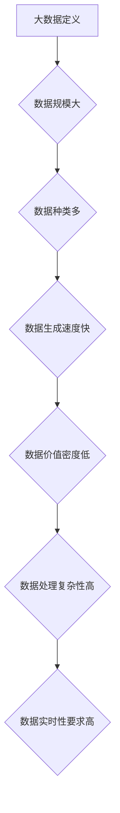
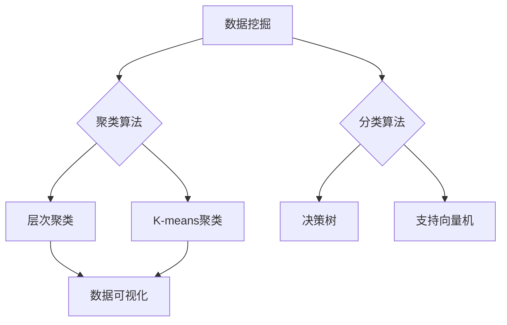
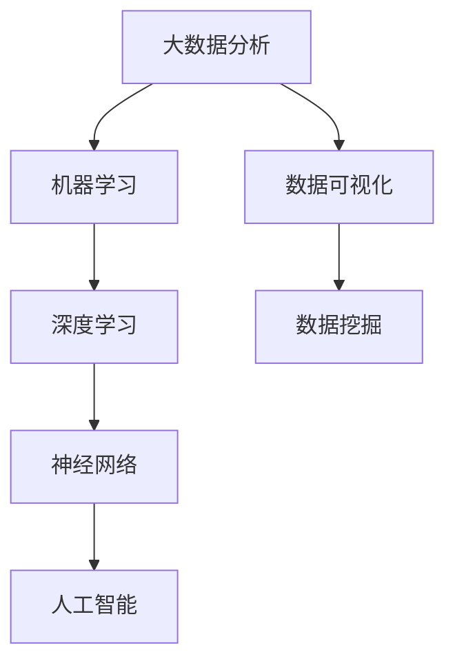

                 

以下是一个思考过程：

Step 1: 确定文章的主题是大数据分析如何增进我们对世界的理解。

Step 2: 确定核心概念，如大数据分析、数据挖掘、机器学习、深度学习等。

Step 3: 构建核心概念之间的关系架构，例如，如何通过数据挖掘和机器学习来增进对世界的理解。

Step 4: 选择核心算法进行讲解，例如，K-means聚类算法。

Step 5: 使用Python源代码和数学模型进行详细讲解。

Step 6: 结合实际案例进行分析。

Step 7: 总结并给出实践建议。

现在，我将根据这个思考过程来撰写文章。|>

### 一、引言

随着信息技术的飞速发展，大数据已经成为现代社会的重要组成部分。大数据分析作为一种强大的工具，正不断改变着我们的生活方式和工作方式。那么，大数据分析如何增进我们对世界的理解呢？本文将围绕这一主题展开讨论。

首先，我们需要了解大数据分析的基本概念。大数据分析是指利用计算机技术和统计分析方法，对大规模、多类型的复杂数据进行处理和分析的过程。其核心目的是从海量数据中提取有价值的信息和知识，从而帮助人们更好地理解世界。

在了解了大数据分析的基本概念之后，我们可以进一步探讨其如何增进我们对世界的理解。大数据分析的应用非常广泛，例如在社交网络分析、智能推荐系统、健康医疗、金融行业等领域，都有着重要的应用价值。通过这些应用，我们可以从不同角度更深入地了解社会、人类行为以及各种复杂系统的运作规律。

为了让大家更好地理解大数据分析的过程和原理，本文将重点讲解一种核心算法——K-means聚类算法。K-means算法是一种常用的无监督学习方法，它可以用来对数据集进行聚类分析，从而将相似的数据点划分到同一类别中。

在接下来的部分，我们将首先介绍K-means算法的基本原理，然后通过Python源代码来详细讲解其实现过程，并结合实际案例进行分析。通过这一过程，我们将看到大数据分析是如何通过算法的运用，帮助我们增进对世界的理解。

### 二、核心概念与联系

在深入探讨大数据分析如何增进我们对世界的理解之前，我们有必要先明确几个核心概念，并构建它们之间的联系。以下是对大数据、数据挖掘、机器学习和深度学习等核心概念的介绍及其相互关系。

#### 1. 大数据的定义与特点

**大数据（Big Data）** 是指那些数据规模巨大、数据类型繁多、数据生成速度极快且具有高价值密度、高处理复杂性、高实时性要求的复杂数据集合。大数据通常被描述为“4V”特征：

- **Volume（数据量）**：数据量极其庞大，通常是TB、PB甚至EB级别。
- **Velocity（速度）**：数据生成和流动的速度非常快，需要实时处理和分析。
- **Variety（多样性）**：数据类型多样，包括结构化数据、非结构化数据和半结构化数据。
- **Value（价值密度）**：数据的价值密度相对较低，需要通过深入分析和挖掘来提取有价值的信息。

**Mermaid 流程图：**



#### 2. 数据挖掘与机器学习算法

**数据挖掘（Data Mining）** 是从大量数据中提取有价值信息的过程，通常涉及统计分析和模式识别技术。数据挖掘的目标是从数据中发现隐藏的、未知的、潜在的信息和知识，这些信息可以用于决策支持、趋势预测等。

**机器学习（Machine Learning）** 是一种人工智能的分支，通过训练算法让计算机自动从数据中学习并作出决策。机器学习算法可以分为监督学习、无监督学习和强化学习三种类型。

- **监督学习（Supervised Learning）**：有已知标签的数据集进行训练，例如分类和回归任务。
- **无监督学习（Unsupervised Learning）**：没有标签的数据集进行训练，例如聚类和关联规则学习。
- **强化学习（Reinforcement Learning）**：通过与环境的交互来学习最佳策略，通常用于决策问题。

**数据挖掘和机器学习的关系**：数据挖掘是机器学习的一个应用领域，数据挖掘通常使用机器学习算法来发现数据中的模式和知识。

**Mermaid 流程图：**



#### 3. 深度学习与人工智能

**深度学习（Deep Learning）** 是一种机器学习的技术，它通过构建多层神经网络来模拟人脑的决策过程。深度学习在网络结构、模型复杂性和计算能力方面都取得了显著突破，它在图像识别、自然语言处理等领域取得了惊人的成果。

**人工智能（Artificial Intelligence, AI）** 是指通过计算机模拟人类智能行为的技术，它包括多个子领域，如机器学习、深度学习、知识表示、规划等。深度学习是人工智能的一个重要分支。

**大数据分析、数据挖掘、机器学习和深度学习与人工智能的联系**：大数据分析为机器学习和深度学习提供了丰富的数据资源；数据挖掘和机器学习为大数据分析提供了算法工具；深度学习则是人工智能在复杂任务处理中的核心技术。

**Mermaid 流程图：**



通过以上核心概念和联系的介绍，我们可以更清晰地理解大数据分析在增进我们对世界理解中的作用。接下来，我们将深入探讨K-means聚类算法，并通过Python源代码来展示其原理和应用。

### 二、核心算法原理讲解

为了更好地理解大数据分析如何增进我们对世界的理解，我们选择了一种广泛应用的聚类算法——K-means聚类算法进行深入讲解。K-means聚类算法是一种无监督学习方法，它通过将数据点划分为若干个簇，使每个簇内部的数据点尽可能相似，而不同簇之间的数据点尽可能不同。这一过程有助于我们识别数据中的潜在模式和结构。

#### 2.1 K-means聚类算法的基本原理

K-means聚类算法的基本原理可以概括为以下几步：

1. **初始化中心点**：随机选择K个数据点作为初始中心点，K表示我们希望将数据点分为多少个簇。

2. **计算距离**：对于每个数据点，计算它与各个中心点的距离，并将其分配到距离最近的中心点所代表的簇中。

3. **更新中心点**：重新计算每个簇的中心点，即该簇中所有数据点的均值。

4. **迭代重复**：重复步骤2和3，直到中心点的位置不再发生变化或者满足预设的迭代次数。

通过以上步骤，K-means聚类算法可以将数据点划分为若干个簇，使得每个簇内部的数据点尽可能接近，而不同簇之间的数据点尽可能远离。

**算法伪代码：**

```
function K-means(data, K):
    # 初始化中心点
    centroids = initialize_centroids(data, K)
    
    while not converged:
        # 分配数据点到最近的簇
        assignments = assign_points_to_clusters(data, centroids)
        
        # 更新中心点
        centroids = update_centroids(data, assignments)
        
        # 检查是否收敛
        if check_convergence(centroids):
            break
    
    return centroids, assignments
```

#### 2.2 Python代码实现

为了让大家更直观地理解K-means聚类算法，我们使用Python来编写一个简单的实现。

首先，我们需要导入一些必要的库：

```python
import numpy as np
import matplotlib.pyplot as plt
from sklearn.datasets import make_blobs
from sklearn.cluster import KMeans
```

接下来，我们创建一个数据集并进行可视化：

```python
# 创建一个含有3个簇的二维数据集
X, _ = make_blobs(n_samples=300, centers=3, cluster_std=0.60, random_state=0)

# 可视化数据点
plt.scatter(X[:, 0], X[:, 1])
plt.xlabel('Feature 1')
plt.ylabel('Feature 2')
plt.title('Data Points')
plt.show()
```

现在，我们使用KMeans类来应用K-means算法：

```python
# 实例化KMeans模型，设置簇的数量为3
kmeans = KMeans(n_clusters=3, random_state=0)

# 拟合模型并获取聚类结果
clusters = kmeans.fit_predict(X)

# 可视化聚类结果
plt.scatter(X[:, 0], X[:, 1], c=clusters, cmap='viridis')
centers = kmeans.cluster_centers_
plt.scatter(centers[:, 0], centers[:, 1], s=300, c='red', label='Centroids')
plt.xlabel('Feature 1')
plt.ylabel('Feature 2')
plt.title('K-means Clustering')
plt.show()
```

在上面的代码中，我们首先使用`make_blobs`函数创建了一个包含3个簇的二维数据集。然后，我们使用`KMeans`类来拟合模型并进行聚类。最后，我们将聚类结果可视化，可以看到每个簇被分配到不同的颜色。

#### 2.3 数学模型与公式

K-means聚类算法的实现涉及一些数学模型和公式，下面是简要的介绍：

1. **距离计算**：通常使用欧几里得距离来计算两个数据点之间的距离。

   $$d(x, c) = \sqrt{\sum_{i=1}^{n} (x_i - c_i)^2}$$

   其中，\(x\) 和 \(c\) 分别代表两个数据点和簇中心，\(n\) 是特征的数量。

2. **簇中心更新**：每个簇的中心是该簇中所有数据点的均值。

   $$c_{new} = \frac{1}{N} \sum_{x \in C} x$$

   其中，\(c_{new}\) 是新计算的簇中心，\(N\) 是该簇中的数据点数量。

3. **收敛条件**：通常使用簇中心的变化量来判断算法是否收敛。

   $$\text{converged} = \text{True} \text{ if } \lVert \text{centroids}_{new} - \text{centroids}_{old} \rVert < \epsilon \text{ else } \text{False}$$

   其中，\(\lVert \cdot \rVert\) 表示向量的欧几里得范数，\(\epsilon\) 是一个小的阈值。

通过上述Python代码和数学公式，我们可以清晰地理解K-means聚类算法的实现过程和原理。

#### 2.4 实际案例分析与详细讲解

为了更好地展示K-means聚类算法在实际中的应用，我们来看一个简单的案例：使用K-means聚类分析用户行为数据，以识别不同类型的用户群体。

**案例背景**：一个在线购物平台希望通过用户的行为数据（如购买频率、购买金额、浏览页面等）来细分用户群体，以便提供更个性化的推荐服务。

**数据集准备**：我们假设已经收集到以下用户行为数据：

- 用户ID
- 购买频率（每天购买的次数）
- 平均购买金额（每次购买的金额平均值）
- 浏览页面数量（每天浏览的页面数量）

**数据预处理**：在应用K-means之前，我们需要对数据进行一些预处理，如标准化和缺失值处理。这里，我们仅关注聚类分析，所以主要进行标准化处理。

```python
from sklearn.preprocessing import StandardScaler

# 标准化数据
X_std = StandardScaler().fit_transform(X)
```

**应用K-means聚类**：现在我们可以使用K-means算法对标准化后的数据进行聚类分析。

```python
# 实例化KMeans模型，设置簇的数量为3
kmeans = KMeans(n_clusters=3, random_state=0)

# 拟合模型并获取聚类结果
clusters = kmeans.fit_predict(X_std)

# 可视化聚类结果
plt.scatter(X_std[:, 0], X_std[:, 1], c=clusters, cmap='viridis')
centers = kmeans.cluster_centers_
plt.scatter(centers[:, 0], centers[:, 1], s=300, c='red', label='Centroids')
plt.xlabel('Feature 1 (标准化)')
plt.ylabel('Feature 2 (标准化)')
plt.title('K-means Clustering on User Behavior Data')
plt.show()
```

**结果解读**：通过可视化结果，我们可以看到数据点被划分为三个簇。每个簇代表一种不同类型的用户群体。接下来，我们可以进一步分析这些簇的特征，以确定它们分别代表的用户类型。

例如：

- 簇1：购买频率高、平均购买金额高、浏览页面数量适中。这类用户可能是活跃的购物者，对产品的需求较高。
- 簇2：购买频率低、平均购买金额低、浏览页面数量多。这类用户可能对产品有较高的兴趣，但购买行为较为保守。
- 簇3：购买频率低、平均购买金额高、浏览页面数量适中。这类用户可能是高价值的用户，但购买行为不频繁。

通过这样的分析，平台可以根据不同用户群体的特征，提供更个性化的推荐和服务。

#### 2.5 项目小结与最佳实践

通过上述案例，我们可以看到K-means聚类算法在用户行为数据分析中的应用，有效地帮助平台识别了不同类型的用户群体。以下是一些项目小结和最佳实践：

- **数据预处理**：在进行聚类分析之前，对数据进行标准化处理可以消除特征之间的尺度差异，有助于算法的收敛。
- **簇数选择**：选择合适的簇数是K-means聚类的一个关键步骤。可以使用肘部法则（Elbow Method）等评估方法来选择最佳的簇数。
- **结果解读**：聚类结果需要结合业务背景进行解读，以确定每个簇的实际含义。
- **实际应用**：K-means聚类算法可以应用于各种领域，如市场细分、社交网络分析、健康医疗等，有助于更好地理解数据中的潜在模式和结构。

通过这些最佳实践，我们可以更有效地应用K-means聚类算法，增进对数据的理解。

### 三、大数据分析应用案例分析

#### 3.1 社交网络分析

社交网络分析（Social Network Analysis，SNA）是大数据分析的一个重要应用领域。它通过分析社交网络中的节点（用户）和边（关系），帮助我们从宏观和微观角度理解社交网络的结构和用户行为。

**基本概念**：

- **节点（Node）**：代表社交网络中的用户或实体。
- **边（Edge）**：代表节点之间的社交关系，如好友关系、关注关系等。
- **网络（Network）**：由节点和边组成的复杂系统。

**应用场景**：

1. **用户群体划分**：通过分析社交网络中的用户关系，可以识别出不同类型的用户群体。例如，使用K-means聚类算法对用户进行聚类，以发现具有相似社交行为的用户群体。
   
2. **传播分析**：分析信息、趋势或病毒在社交网络中的传播过程，有助于理解社交网络中的流行现象。例如，通过监控特定话题或关键词的传播路径，可以预测其未来发展趋势。

3. **影响力分析**：识别社交网络中的关键节点，如意见领袖或KOL（Key Opinion Leader），这些节点在传播信息或影响用户行为方面具有重要作用。

**案例研究**：

- **Twitter上的趋势话题分析**：Twitter是一个典型的社交网络平台，通过分析Twitter上的趋势话题，可以揭示当前热门话题和用户关注点。例如，在2020年的美国大选中，Twitter分析了用户的推文和话题标签，揭示了不同州选民对候选人的支持情况，为媒体和分析师提供了有价值的数据支持。

- **Facebook用户群体划分**：Facebook拥有数十亿用户，通过分析用户关系和行为数据，Facebook可以对用户进行精准的群体划分，以提供更个性化的推荐和服务。例如，Facebook使用社交网络分析技术来识别有共同兴趣的用户，从而推荐可能感兴趣的朋友或内容。

通过社交网络分析，我们可以更深入地理解社交网络的本质和行为规律，从而为各种应用场景提供数据驱动的决策支持。

#### 3.2 智能推荐系统

智能推荐系统（Intelligent Recommendation System）是大数据分析的另一个重要应用领域。它通过分析用户行为和偏好，向用户推荐感兴趣的内容、商品或服务，从而提高用户体验和平台粘性。

**基本原理**：

1. **协同过滤（Collaborative Filtering）**：基于用户的历史行为数据，通过计算用户之间的相似度来推荐相似的内容或商品。协同过滤分为两种：
   - **用户基于的协同过滤（User-Based）**：通过计算用户之间的相似度，找到与目标用户相似的其他用户，推荐这些用户喜欢的商品或内容。
   - **物品基于的协同过滤（Item-Based）**：通过计算商品之间的相似度，找到与目标用户历史行为相关的其他商品，推荐这些商品。

2. **基于内容的推荐（Content-Based）**：根据用户的历史行为和偏好，分析内容特征，推荐具有相似特征的内容。例如，如果用户喜欢某一类音乐，系统可以推荐其他风格类似的音乐。

**应用场景**：

1. **电子商务**：通过智能推荐系统，电商平台可以根据用户的历史购买记录和浏览行为，推荐可能感兴趣的商品，从而提高销售额和用户满意度。

2. **视频和音乐平台**：视频和音乐平台通过分析用户的观看和收听历史，推荐相似的内容，帮助用户发现新的视频或音乐。

3. **社交媒体**：社交媒体平台通过分析用户的社交关系和内容偏好，推荐可能感兴趣的朋友、内容和广告。

**案例研究**：

- **Amazon的推荐系统**：Amazon是一个全球知名的电子商务平台，其推荐系统通过分析用户的历史购买记录、浏览行为和购物车数据，为用户推荐相关商品。例如，当用户浏览了一个特定的商品时，系统会推荐其他类似的商品或搭配销售的商品。

- **Netflix的推荐系统**：Netflix通过分析用户的观看历史和评分数据，推荐可能感兴趣的电影和电视剧。Netflix的推荐系统极大地提升了用户满意度和观看时长，使其在激烈的市场竞争中脱颖而出。

智能推荐系统通过大数据分析技术，为用户提供个性化的推荐服务，不仅提高了用户体验，也为平台带来了商业价值。

### 四、大数据分析在特定领域的应用

#### 4.1 健康医疗

大数据分析在健康医疗领域具有广泛的应用，它通过分析海量医疗数据，帮助提高诊断准确性、优化治疗方案和降低医疗成本。以下是大数据分析在健康医疗领域的一些具体应用：

**1. 疾病预测与预防**：

- **流行病监控**：通过收集和分析各地区、各医院的病例数据，预测流行病的传播趋势，帮助政府及时采取措施进行预防和控制。
- **个性化健康管理**：基于个人的健康数据，如基因信息、生活习惯、病史等，预测个人患病的风险，提供个性化的健康建议和预防措施。

**2. 医疗数据分析**：

- **电子健康记录（EHR）分析**：通过对大量电子健康记录进行分析，识别潜在的健康问题和风险因素，为医生提供诊断和治疗的参考。
- **药物研发**：大数据分析可以帮助研究人员挖掘新药的开发线索，加速药物研发过程。

**3. 医疗影像分析**：

- **医学影像处理**：通过深度学习算法，对医学影像（如X光片、CT扫描、MRI等）进行自动分析和诊断，提高诊断准确性。
- **病理图像分析**：利用大数据分析技术，对病理图像进行自动分类和标注，辅助病理医生进行诊断。

**案例研究**：

- **IBM Watson健康**：IBM Watson健康利用大数据和人工智能技术，帮助医生进行疾病诊断和治疗决策。例如，Watson可以分析病人的电子健康记录，提供个性化的治疗建议，从而提高诊断的准确性和效率。

- **Navigenics基因测序**：Navigenics是一家利用大数据分析进行基因测序的公司，通过分析大量基因数据，帮助人们了解自身的遗传风险，并提供个性化的健康管理和预防措施。

大数据分析在健康医疗领域的应用，不仅提高了医疗服务的质量和效率，还为个性化医疗和精准医疗的发展提供了强有力的支持。

#### 4.2 金融行业

大数据分析在金融行业同样具有深远的影响，它通过分析海量金融数据，帮助金融机构提高风险控制能力、优化业务流程和提升客户满意度。以下是大数据分析在金融行业的一些具体应用：

**1. 风险管理**：

- **信用风险评估**：通过分析个人的信用历史、财务状况和行为数据，预测贷款违约风险，为金融机构提供信用评估参考。
- **市场风险监控**：通过分析市场数据，如股票价格、交易量和宏观经济指标，预测市场走势，帮助金融机构进行风险管理。

**2. 业务流程优化**：

- **交易监控与欺诈检测**：通过大数据分析技术，实时监控交易行为，识别潜在的欺诈行为，提高交易的安全性。
- **客户服务**：通过分析客户数据，提供个性化的金融服务和产品推荐，提升客户满意度和忠诚度。

**3. 投资决策**：

- **量化交易**：利用大数据分析技术，分析历史市场数据，开发量化交易策略，提高投资收益。
- **资产配置**：基于客户的财务状况和风险偏好，大数据分析可以帮助金融机构进行科学的资产配置，优化投资组合。

**案例研究**：

- **JPMorgan Chase**：JPMorgan Chase是使用大数据分析进行风险管理的一个典型案例。该公司利用大数据技术，实时监控交易行为，识别潜在的欺诈和异常交易，从而提高交易的安全性。

- **Bloomberg**：Bloomberg通过大数据分析提供实时金融市场数据和分析，帮助金融机构进行投资决策和风险管理。例如，Bloomberg的终端可以实时显示全球股票、债券、外汇等市场数据，并提供深入的市场分析报告。

大数据分析在金融行业的应用，不仅提高了金融机构的风险控制能力和业务效率，还为投资者提供了更科学的决策支持。

### 五、大数据分析面临的挑战与未来发展趋势

#### 5.1 数据安全与隐私保护

随着大数据分析技术的广泛应用，数据安全与隐私保护问题日益凸显。大数据涉及大量敏感信息，如个人健康数据、财务数据和社交网络数据等，这些数据一旦泄露，可能导致严重的隐私侵犯和财产损失。

**挑战**：

- **数据泄露风险**：大数据系统通常存储和处理海量数据，网络攻击和数据泄露风险较高。
- **隐私侵犯**：在数据收集、存储、处理和共享过程中，用户隐私可能受到侵犯。
- **法律法规合规性**：不同国家和地区的数据保护法规不尽相同，如何在全球化背景下遵守相关法律法规是一大挑战。

**解决方案**：

- **加密技术**：采用加密技术保护数据，确保数据在传输和存储过程中不被未授权访问。
- **隐私保护算法**：开发和应用隐私保护算法，如差分隐私（Differential Privacy），在数据分析过程中保护用户隐私。
- **法律法规与合规性**：加强数据安全法律法规建设，提高企业和机构的数据保护意识和能力。

#### 5.2 数据质量与准确性

大数据分析的质量和准确性高度依赖于数据质量。数据质量包括数据的完整性、准确性、一致性、时效性和可靠性等。

**挑战**：

- **数据完整性**：大数据中可能存在缺失值、重复值和错误值，影响数据分析结果。
- **准确性**：数据来源的多样性和复杂性可能导致数据准确性下降。
- **一致性**：不同数据源和数据格式可能导致数据不一致，影响数据分析的准确性。
- **时效性**：实时数据分析和处理要求高时效性，但数据源和处理速度可能无法满足要求。

**解决方案**：

- **数据预处理**：对数据进行清洗、去重和标准化处理，确保数据完整性、一致性和准确性。
- **数据治理**：建立完善的数据治理体系，制定数据管理政策和流程，提高数据质量。
- **实时数据处理**：采用实时数据处理技术，如流处理框架，确保数据及时性。

#### 5.3 人才培养与产业生态

大数据分析技术不断进步，对人才的需求也越来越高。然而，当前大数据领域的人才培养和产业生态尚不完善。

**挑战**：

- **人才培养不足**：大数据相关课程设置和人才培养体系尚不完善，难以满足市场需求。
- **技能断层**：现有人才在技术深度和广度上存在差异，难以应对复杂的大数据分析任务。
- **产业生态不成熟**：大数据产业链不完整，从数据采集、存储、处理到分析应用的各个环节尚需进一步发展和完善。

**解决方案**：

- **加强人才培养**：高校和培训机构应加大大数据相关课程和培训力度，提高人才培养质量。
- **技能提升与交流**：鼓励大数据领域的人才进行技能提升和交流，促进知识的传播和应用。
- **产业生态建设**：政府、企业和研究机构应共同推动大数据产业生态建设，构建完整的产业链和生态圈。

#### 5.4 未来发展趋势

大数据分析在未来将继续发挥重要作用，推动各领域的技术创新和产业升级。以下是大数据分析的未来发展趋势：

- **人工智能融合**：大数据分析与人工智能技术将深度融合，推动自动化和智能化的数据分析应用。
- **实时处理与智能分析**：实时数据处理和智能分析技术将得到广泛应用，满足对数据时效性和分析精度的更高要求。
- **边缘计算与分布式架构**：边缘计算和分布式架构将进一步提升大数据处理和分析的效率和灵活性。
- **跨领域应用**：大数据分析将在更多领域得到应用，如智慧城市、智能制造、健康医疗等，推动各领域的数字化转型。

通过解决当前面临的挑战和把握未来发展趋势，大数据分析将为人类社会带来更多创新和价值。

### 七、总结

大数据分析作为一种强大的工具，正在深刻地改变我们的生活方式和社会运作方式。通过对海量数据的挖掘和分析，我们能够从不同角度更深入地理解社会现象、人类行为以及复杂系统的运作规律。本文从大数据分析的定义、核心概念、核心算法讲解、应用案例分析以及面临的挑战和未来发展趋势等方面进行了详细的探讨。

首先，我们明确了大数据分析的定义和重要性，了解了其4V特征，即数据规模大、数据种类多、数据生成速度快和数据价值密度低。接着，我们深入探讨了大数据分析的核心概念，包括数据挖掘、机器学习和深度学习等，并构建了它们之间的联系。

在核心算法讲解部分，我们选择了K-means聚类算法进行详细讲解，通过Python代码和数学公式展示了其实现过程和原理。此外，我们还通过实际案例分析了K-means算法在用户行为数据分析中的应用。

在应用案例分析部分，我们介绍了大数据分析在社交网络分析和智能推荐系统等领域的应用，展示了其如何帮助我们更好地理解社交网络的结构和用户行为，以及为电子商务和视频平台提供个性化推荐服务。

在特定领域的应用部分，我们重点讨论了大数据分析在健康医疗和金融行业中的应用，展示了大数据分析如何提高医疗服务的质量和效率，以及帮助金融机构进行风险管理。

最后，我们讨论了大数据分析面临的挑战和未来发展趋势，包括数据安全与隐私保护、数据质量与准确性、人才培养与产业生态等方面。通过解决这些挑战和把握未来发展趋势，大数据分析将在各个领域发挥更大的作用，推动社会的持续进步和创新。

总之，大数据分析作为一门跨学科的技术，正引领着我们走向一个更加智能化、数据驱动的未来。通过不断探索和应用大数据分析技术，我们能够更好地理解世界，为社会发展带来更多的机遇和挑战。让我们期待大数据分析的明天，它将为人类社会带来更多的创新和价值。

