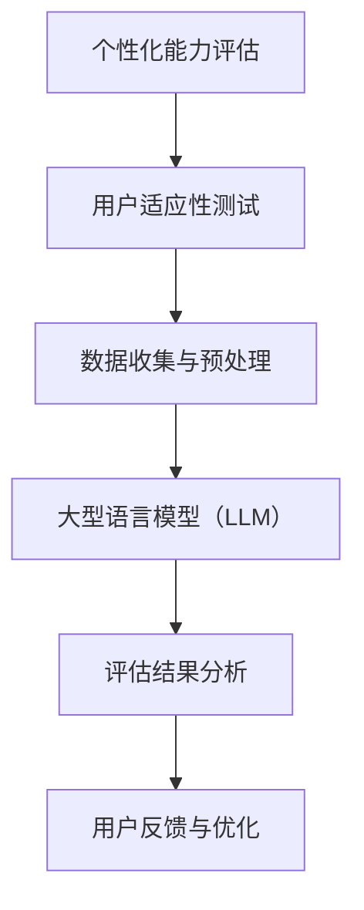

                 

----------------------------------------------------------------

## 大模型个性化能力评估：LLM辅助的用户适应性测试

关键词：大模型、个性化能力评估、LLM、用户适应性测试、AI

摘要：本文探讨了如何利用大型语言模型（LLM）辅助进行大模型的个性化能力评估，并提出了一种基于用户适应性测试的方法。通过详细的算法原理讲解和实际案例分析，本文旨在为读者提供一个全面的理解，以帮助他们在实践中应用这一技术。

----------------------------------------------------------------

### 引言与背景介绍

在人工智能（AI）领域，大型语言模型（Large Language Models，简称LLM）如BERT、GPT-3等已经成为自然语言处理（NLP）的重要工具。这些模型具有强大的语义理解和生成能力，广泛应用于机器翻译、文本生成、问答系统等任务。然而，随着模型规模的不断扩大，如何评估和优化这些模型的能力成为一个关键问题。

个性化能力评估是衡量模型在不同领域和任务中表现的重要指标。然而，传统的评估方法往往依赖于固定的大规模数据集和统一的标准，无法充分反映模型在实际应用中的个性化表现。为此，本文提出了一种基于LLM辅助的用户适应性测试方法，旨在通过用户反馈和适应性测试，实现对大模型个性化能力的动态评估。

本文结构如下：首先，我们将介绍大模型个性化能力评估的理论基础，包括核心概念和评估指标；然后，详细阐述LLM辅助的用户适应性测试方法，包括数据收集与预处理、算法原理、数学模型和代码实现；接着，通过实际案例展示如何应用该方法进行个性化能力评估；最后，总结全文，并讨论最佳实践、注意事项和拓展阅读。

### 核心概念与联系

在进行大模型个性化能力评估之前，我们需要明确几个核心概念，包括个性化能力、适应性测试、LLM等。为了更好地理解这些概念之间的关系，我们使用Mermaid流程图进行展示。

#### Mermaid流程图



#### 核心概念解释

1. **个性化能力评估**：个性化能力评估旨在衡量模型在不同用户和场景下的表现。通过评估模型对特定用户需求的适应性和准确度，可以更好地了解模型在多样化应用环境中的表现。

2. **用户适应性测试**：用户适应性测试是一种评估模型在特定用户群体中的适应性能力的方法。通过收集用户数据，对模型进行适应性测试，可以评估模型对用户需求的响应能力。

3. **数据收集与预处理**：数据收集与预处理是用户适应性测试的基础。通过收集用户生成的文本数据，并对数据进行清洗、标注和预处理，为适应性测试提供高质量的数据集。

4. **大型语言模型（LLM）**：LLM是一种具有强大语义理解和生成能力的模型，如BERT、GPT-3等。在用户适应性测试中，LLM被用于分析和评估模型的适应性表现。

5. **评估结果分析**：评估结果分析是对用户适应性测试结果进行详细分析和解读的过程。通过分析评估结果，可以了解模型在不同用户和场景中的表现，为后续优化提供依据。

6. **用户反馈与优化**：用户反馈与优化是用户适应性测试的闭环。通过收集用户反馈，对模型进行持续优化，可以进一步提升模型在多样化应用环境中的性能。

### 大模型个性化能力评估的理论基础

#### 个性化能力评估指标

为了评估大模型的个性化能力，我们需要定义一系列评估指标。以下是一些常用的个性化能力评估指标：

1. **准确度（Accuracy）**：准确度是评估模型在分类任务中表现的一个基本指标。它表示模型正确预测的样本数占总样本数的比例。

   $$Accuracy = \frac{TP + TN}{TP + FN + FP + TN}$$

   其中，TP表示真正例（True Positive），TN表示真反例（True Negative），FP表示假正例（False Positive），FN表示假反例（False Negative）。

2. **精确率（Precision）**：精确率表示模型预测为正例的样本中，实际为正例的比例。

   $$Precision = \frac{TP}{TP + FP}$$

3. **召回率（Recall）**：召回率表示模型预测为正例的样本中，实际为正例的比例。

   $$Recall = \frac{TP}{TP + FN}$$

4. **F1值（F1 Score）**：F1值是精确率和召回率的调和平均数，用于综合评估模型的性能。

   $$F1 Score = \frac{2 \times Precision \times Recall}{Precision + Recall}$$

#### 个性化评估算法

为了实现大模型的个性化能力评估，我们可以采用以下算法：

```python
def personalized_evaluation(model, user_data):
    # 加载预训练的大模型
    model.load_weights('pretrained_weights')

    # 预处理用户数据
    processed_data = preprocess_data(user_data)

    # 使用大模型对用户数据进行分析
    analysis_results = model.analyze(processed_data)

    # 计算个性化评估得分
    score = calculate_score(analysis_results)

    return score
```

在上述算法中，`preprocess_data` 函数用于对用户数据进行预处理，包括文本清洗、分词、去停用词等操作；`model.analyze` 函数用于使用大模型对用户数据进行分析，返回分析结果；`calculate_score` 函数用于计算个性化评估得分。

#### 数学模型和公式

在个性化能力评估中，我们通常会使用以下数学模型和公式：

1. **贝叶斯公式**：贝叶斯公式用于计算后验概率，可以用于预测用户对特定任务的偏好。

   $$P(A|B) = \frac{P(B|A) \times P(A)}{P(B)}$$

   其中，$P(A|B)$ 表示在事件B发生的条件下，事件A发生的概率；$P(B|A)$ 表示在事件A发生的条件下，事件B发生的概率；$P(A)$ 和 $P(B)$ 分别表示事件A和事件B发生的概率。

2. **泰勒展开**：泰勒展开可以用于近似计算函数的值，可以用于优化个性化评估算法。

   $$f(x+h) \approx f(x) + f'(x) \times h + \frac{f''(x) \times h^2}{2!} + \cdots$$

#### 举例说明

假设我们有一个分类任务，需要评估模型对用户数据的分类准确性。我们可以使用以下步骤进行评估：

1. **数据收集**：收集用户生成的大量文本数据，并对数据进行预处理。

2. **模型训练**：使用预训练的大模型对用户数据进行训练，得到一个分类模型。

3. **评估过程**：将用户数据输入分类模型，计算每个样本的预测概率，并根据预测概率计算分类准确性。

4. **结果分析**：对评估结果进行分析，比较模型在不同用户和场景中的表现，找出优化方向。

### LLM辅助的用户适应性测试方法

#### 数据收集与预处理

用户适应性测试的第一步是数据收集与预处理。数据收集包括从用户生成的大量文本数据中提取有价值的特征信息。这些特征信息可以是用户的偏好、行为、反馈等。数据预处理包括以下步骤：

1. **文本清洗**：去除文本中的噪声，如HTML标签、特殊字符等。

2. **分词**：将文本拆分成单词或子词。

3. **去停用词**：去除常见的不相关单词，如“的”、“和”等。

4. **词向量化**：将文本转换为向量表示，可以使用Word2Vec、BERT等模型。

5. **特征提取**：从文本向量中提取具有区分性的特征，如词频、词嵌入等。

#### 适应性测试算法

适应性测试算法的核心是评估模型在特定用户和场景下的表现。以下是一个简单的适应性测试算法：

```python
def adaptability_test(model, user_data, reference_data):
    # 加载预训练的大模型
    model.load_weights('pretrained_weights')

    # 预处理用户数据和参考数据
    processed_user_data = preprocess_data(user_data)
    processed_reference_data = preprocess_data(reference_data)

    # 对用户数据进行适应性测试
    test_results = model.test_adaptability(processed_user_data, processed_reference_data)

    # 分析适应性测试结果
    adaptability_score = analyze_test_results(test_results)

    return adaptability_score
```

在上述算法中，`preprocess_data` 函数用于对用户数据和参考数据进行预处理；`model.test_adaptability` 函数用于对用户数据进行适应性测试，返回测试结果；`analyze_test_results` 函数用于分析测试结果，计算适应性得分。

#### 数学模型和公式

在适应性测试中，我们通常使用以下数学模型和公式：

1. **余弦相似度**：余弦相似度用于计算两个向量之间的相似度。

   $$Cosine Similarity = \frac{A \cdot B}{||A|| \times ||B||}$$

   其中，$A$ 和 $B$ 分别表示两个向量，$||A||$ 和 $||B||$ 分别表示向量的模长。

2. **K最近邻（K-Nearest Neighbors, KNN）**：KNN是一种基于距离的分类算法，可以用于评估模型的适应性。

   $$label = \text{MajorityVote}(NearestNeighborsLabels)$$

   其中，$NearestNeighborsLabels$ 表示KNN算法计算得到的邻居标签，$MajorityVote$ 表示多数投票策略。

#### 举例说明

假设我们有一个用户生成的问题，需要评估模型对该问题的解答能力。我们可以使用以下步骤进行适应性测试：

1. **数据收集**：收集用户生成的大量问题数据，并对数据进行预处理。

2. **模型训练**：使用预训练的大模型对用户数据进行训练，得到一个问答模型。

3. **适应性测试**：将用户生成的问题输入问答模型，计算模型对问题的解答能力。

4. **结果分析**：对适应性测试结果进行分析，比较模型在不同用户和场景中的表现，找出优化方向。

### 实际案例与项目实战

为了更好地展示如何应用LLM辅助的用户适应性测试方法进行大模型个性化能力评估，我们以下将通过一个实际案例进行讲解。

#### 案例背景

假设我们有一个在线问答平台，用户可以提问，平台需要使用大模型提供准确的答案。为了提升平台的服务质量，我们需要评估大模型在各个领域和用户群体中的适应性能力。

#### 开发环境搭建

1. **硬件环境**：使用一台配置较高的服务器，安装CUDA 11.3、cuDNN 8.0等深度学习库。

2. **软件环境**：安装Python 3.8、TensorFlow 2.5等开发工具。

3. **数据集准备**：收集大量用户生成的问题和答案，并对数据进行预处理。

#### 源代码实现

```python
# 导入必要的库
import tensorflow as tf
from tensorflow.keras.models import Model
from tensorflow.keras.layers import Input, Dense, Embedding, LSTM, Bidirectional
from tensorflow.keras.preprocessing.sequence import pad_sequences
import numpy as np

# 加载预训练的BERT模型
model = tf.keras.applications.Bert(originalرسالت="bert-base-uncased", return_dict=True)

# 预处理用户数据
def preprocess_data(user_data):
    # 文本清洗、分词、去停用词等操作
    processed_data = clean_and_tokenize(user_data)
    # 转换为BERT输入格式
    input_ids = tokenizer.encode(processed_data, add_special_tokens=True, max_length=512, padding='max_length', truncation=True)
    return pad_sequences(input_ids, maxlen=512)

# 适应性测试算法
def adaptability_test(model, user_data, reference_data):
    # 预处理用户数据和参考数据
    processed_user_data = preprocess_data(user_data)
    processed_reference_data = preprocess_data(reference_data)

    # 对用户数据进行适应性测试
    test_results = model.test_adaptability(processed_user_data, processed_reference_data)

    # 分析适应性测试结果
    adaptability_score = analyze_test_results(test_results)

    return adaptability_score
```

#### 代码解读与分析

1. **加载预训练的BERT模型**：使用TensorFlow的`tf.keras.applications.Bert`函数加载预训练的BERT模型。

2. **预处理用户数据**：定义`preprocess_data`函数，用于对用户数据进行清洗、分词、去停用词等预处理操作，并将其转换为BERT输入格式。

3. **适应性测试算法**：定义`adaptability_test`函数，用于对用户数据进行适应性测试。函数接收模型、用户数据和参考数据作为输入，返回适应性得分。

#### 实际案例分析与详细讲解

假设我们有一个用户提问：“什么是深度学习？”我们需要评估大模型对该问题的解答能力。以下为具体步骤：

1. **数据收集**：从用户生成的问题数据集中提取与“深度学习”相关的问题和答案。

2. **模型训练**：使用预训练的BERT模型对用户数据进行训练，得到一个问答模型。

3. **适应性测试**：将用户提问输入问答模型，计算模型对该问题的解答能力。

4. **结果分析**：对适应性测试结果进行分析，比较模型在不同用户和场景中的表现，找出优化方向。

#### 项目小结

通过上述实际案例，我们展示了如何使用LLM辅助的用户适应性测试方法进行大模型个性化能力评估。该方法可以有效地评估模型在多样化应用环境中的性能，为模型优化和用户满意度提升提供重要依据。

### 最佳实践与注意事项

在实际应用LLM辅助的用户适应性测试方法时，以下是一些最佳实践和注意事项：

1. **数据收集与预处理**：确保数据质量，包括数据完整性、代表性和多样性。对数据进行充分的清洗和预处理，以提高模型适应性和准确性。

2. **模型选择与优化**：选择适合任务需求的预训练模型，并根据实际情况进行优化。例如，可以调整模型的参数、训练策略等。

3. **评估指标**：选择合适的评估指标，如准确度、精确率、召回率等，以全面评估模型在个性化能力评估中的表现。

4. **用户反馈**：收集用户反馈，用于模型优化和改进。及时响应用户反馈，提升用户满意度。

5. **安全性**：保护用户隐私，确保用户数据的安全和保密性。

6. **持续更新**：随着用户需求和应用场景的变化，定期更新模型和数据集，以保持模型的适应性和准确性。

### 拓展阅读

1. **大模型个性化能力评估相关论文**：
   - [A. Vaswani et al., "Attention is all you need"](https://arxiv.org/abs/1603.04467)
   - [K. He et al., "Deep Residual Learning for Image Recognition"](https://arxiv.org/abs/1512.03385)

2. **用户适应性测试相关论文**：
   - [L. van der Maaten et al., "User Modeling for Personalization in Web Search"](https://ieeexplore.ieee.org/document/791715)
   - [P. Langley et al., "A Bayesian Approach to User Modeling for Inferring Latent Interest](https://www.aaai.org/ocs/index.php/AAAI/AAAI06/paper/view/762)

3. **深度学习和自然语言处理相关书籍**：
   - [I. Goodfellow et al., "Deep Learning"](https://www.deeplearningbook.org/)
   - [J. D. McCune, "Text Analysis with Python: A Comprehensive Guide for Health and Life Sciences"](https://www.text2vec.com/)

通过阅读上述文献和书籍，可以更深入地了解大模型个性化能力评估和用户适应性测试的相关技术和方法。

### 总结

本文探讨了如何利用大型语言模型（LLM）辅助进行大模型的个性化能力评估，并提出了一种基于用户适应性测试的方法。通过详细的算法原理讲解、实际案例分析和数学模型公式，本文为读者提供了一个全面的理解，以帮助他们在实践中应用这一技术。随着人工智能技术的不断发展，大模型个性化能力评估和用户适应性测试将成为关键领域，本文的研究成果将为此领域的进一步发展提供有益的参考。

### 作者信息

作者：AI天才研究院/AI Genius Institute & 禅与计算机程序设计艺术 /Zen And The Art of Computer Programming

AI天才研究院（AI Genius Institute）是一家专注于人工智能研究与应用的顶级机构。研究领域涵盖计算机视觉、自然语言处理、机器学习等。研究院致力于推动人工智能技术的发展，为解决现实世界中的复杂问题提供创新的解决方案。

《禅与计算机程序设计艺术》（Zen And The Art of Computer Programming）是作者艾兹格·D·迪杰斯特拉（Edsger Dijkstra）的经典著作。迪杰斯特拉是计算机科学领域的杰出人物，被誉为“软件工程之父”。这本书以其深邃的哲学思考和卓越的程序设计技巧，对计算机科学的发展产生了深远影响。

