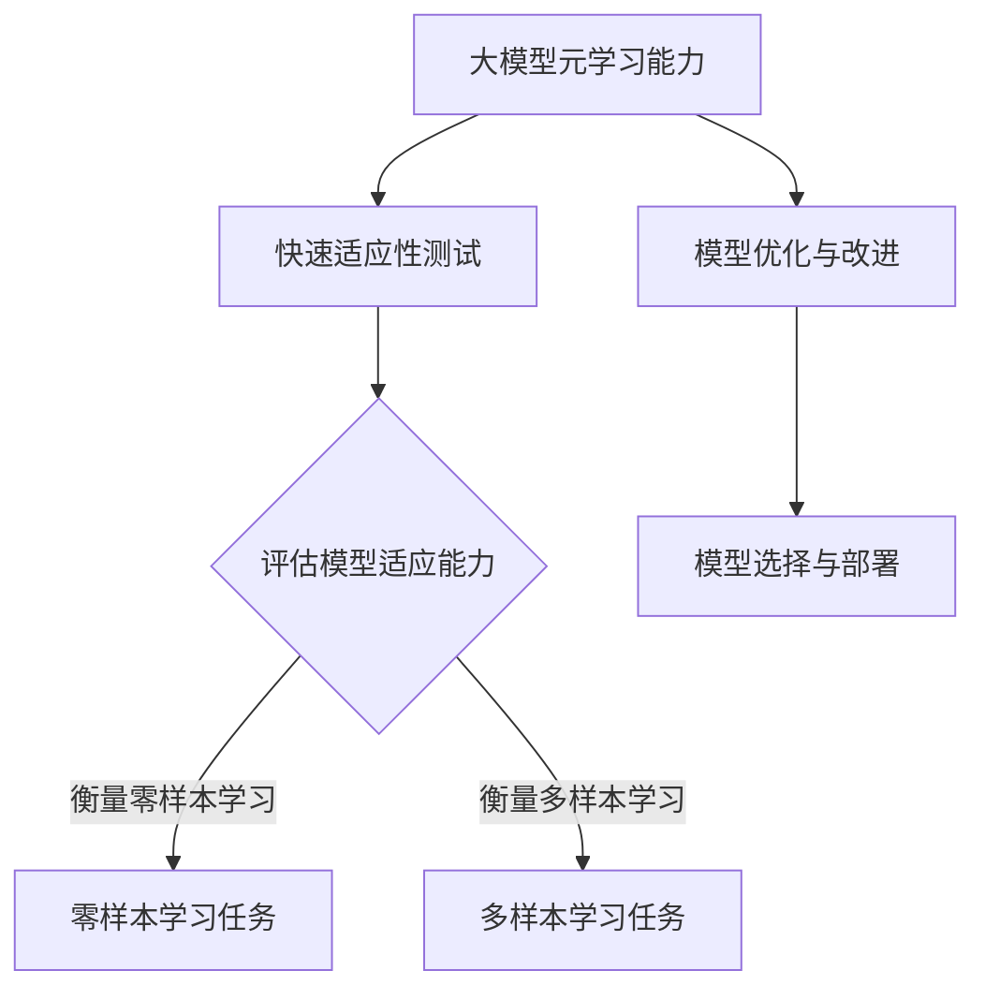

                 

### 大模型元学习能力评估：LLM设计的快速适应性测试

#### 关键词

大模型元学习能力，评估方法，LLM设计，快速适应性测试，模型性能，机器学习

#### 摘要

本文将探讨大模型元学习能力评估及LLM（大型语言模型）设计的快速适应性测试。首先，我们将介绍大模型元学习能力的概念及其重要性。然后，详细阐述大模型元学习能力评估的方法，包括评估指标、评估流程和评估工具。接着，分析LLM设计的快速适应性测试，包括测试策略、测试方法和测试工具。通过实际案例展示评估方法的应用，并深入探讨快速适应性测试在LLM设计中的应用。最后，对大模型元学习能力评估和LLM设计的快速适应性测试进行展望，并提出未来的发展方向。

## 引言

随着深度学习和机器学习技术的飞速发展，大型语言模型（Large Language Models，简称LLM）逐渐成为自然语言处理领域的重要工具。LLM具有强大的文本生成、理解和推理能力，已在众多实际应用中展现出巨大潜力。然而，LLM的设计和优化面临着诸多挑战，如如何提高模型的泛化能力、快速适应新的任务和数据等。这些问题促使研究者们关注大模型元学习能力（Meta-Learning Ability of Large Models，简称MLA）的评估和提升。

大模型元学习能力指的是模型在不同任务和数据集上的适应性和学习能力。评估大模型元学习能力对于优化模型设计、提高模型性能具有重要意义。同时，LLM设计的快速适应性测试（Quick Adaptability Test for LLM Design）是确保模型在复杂和动态环境中稳定运行的关键。本文将围绕这两个主题展开，旨在为研究者提供有价值的参考。

首先，我们将介绍大模型元学习能力的概念和重要性。然后，详细阐述大模型元学习能力评估的方法，包括评估指标、评估流程和评估工具。接下来，分析LLM设计的快速适应性测试，包括测试策略、测试方法和测试工具。通过实际案例展示评估方法的应用，并深入探讨快速适应性测试在LLM设计中的应用。最后，对大模型元学习能力评估和LLM设计的快速适应性测试进行展望，并提出未来的发展方向。

## 大模型元学习能力概述

### 元学习的概念

元学习（Meta-Learning）是机器学习中的一个重要分支，旨在研究如何快速学习新的任务，并提高模型的泛化能力。元学习的基本思想是通过在多个任务上进行学习，使模型能够提取通用特征，从而在新任务上实现快速适应。

元学习可以分为两种类型：一种是零样本学习（Zero-Shot Learning，简称ZSL），即模型在新任务上从未见过的情况下进行预测；另一种是多样本学习（Few-Shot Learning，简称FSL），即模型在有限样本下进行学习。大模型元学习能力主要关注FSL，因为在现实场景中，模型通常需要处理有限样本的数据集。

### 大模型元学习能力的定义

大模型元学习能力指的是大型语言模型在有限样本数据集上，通过元学习算法快速适应新任务的能力。大模型元学习能力主要包括以下几个方面：

1. **样本效率**：在有限样本下，模型能够快速收敛并取得较好的性能。
2. **泛化能力**：模型能够在新任务上表现稳定，不受特定任务和数据的影响。
3. **迁移能力**：模型能够将已学到的知识迁移到新的任务上，提高新任务的学习效果。
4. **鲁棒性**：模型在面对噪声数据、异常值和变化的数据分布时，仍能保持较高的性能。

### 大模型元学习能力的重要性

大模型元学习能力的重要性主要体现在以下几个方面：

1. **减少数据需求**：传统机器学习方法通常需要大量标注数据才能取得较好的性能，而大模型元学习能力可以在有限样本下实现高效学习，从而减少数据需求。
2. **提高模型适应性**：在现实应用中，数据分布可能会发生变化，大模型元学习能力可以帮助模型快速适应新的数据分布，提高模型的实用性。
3. **促进模型优化**：通过评估大模型元学习能力，可以找出模型的瓶颈和不足，从而指导模型优化和改进。
4. **支持零样本学习**：大模型元学习能力是实现零样本学习的关键，有助于模型在未知领域中进行有效推理和预测。

总之，大模型元学习能力是现代机器学习研究的重要方向，对于提高模型性能、降低数据需求、提升模型适应性具有重要意义。

### 大模型元学习能力与快速适应性测试的关系

大模型元学习能力与快速适应性测试之间存在密切的联系。快速适应性测试是评估和提升大模型元学习能力的重要手段。

首先，快速适应性测试能够衡量模型在不同任务和数据集上的适应能力。通过测试，我们可以评估模型在零样本学习和多样本学习任务中的表现，从而了解其元学习能力的强弱。

其次，快速适应性测试可以为模型优化提供指导。在测试过程中，我们可以发现模型的瓶颈和不足，从而针对性地进行优化。例如，通过调整模型结构、改进训练策略或增加数据增强方法，可以提升模型的元学习能力。

此外，快速适应性测试还可以帮助我们在实际应用中选择合适的模型。在复杂和动态的环境中，我们需要模型能够快速适应新的任务和数据。通过快速适应性测试，我们可以评估不同模型在适应新任务方面的表现，从而选择最适合的模型。

总之，快速适应性测试是大模型元学习能力评估和提升的重要手段，对于提高模型性能、降低数据需求、提升模型适应性具有重要意义。

### Mermaid 流程图

以下是关于大模型元学习能力与快速适应性测试关系的Mermaid流程图：



### 大模型元学习能力与快速适应性测试的核心概念与联系

为了更好地理解大模型元学习能力与快速适应性测试之间的关系，我们引入以下核心概念：

1. **元学习**：元学习是一种通过学习如何学习的方法。在大模型元学习能力中，元学习算法帮助模型在有限样本下快速适应新任务。
2. **快速适应性测试**：快速适应性测试是一种评估模型在不同任务和数据集上适应能力的方法。它包括零样本学习和多样本学习任务的评估。
3. **模型优化**：模型优化是通过调整模型结构、改进训练策略等方法，提高模型在特定任务上的性能。
4. **模型选择与部署**：根据快速适应性测试的结果，选择最适合实际应用的模型并进行部署。

这些核心概念相互关联，形成了一个完整的流程。首先，通过元学习算法，模型获得了大模型元学习能力。接着，通过快速适应性测试，评估模型在不同任务和数据集上的适应能力。然后，根据测试结果，对模型进行优化和改进。最后，选择最优的模型进行部署，以满足实际应用需求。

以下是一个简化的Mermaid流程图，展示了这些核心概念与联系：

```mermaid
graph TD
A[元学习] --> B{大模型元学习能力}
B --> C{快速适应性测试}
C --> D{零样本学习评估}
C --> E{多样本学习评估}
B --> F[模型优化与改进]
F --> G[模型选择与部署}
```

通过这个流程，我们可以清晰地看到大模型元学习能力与快速适应性测试之间的紧密联系。元学习为模型提供了快速适应新任务的能力，而快速适应性测试则帮助我们评估和优化这一能力，最终实现模型在实际应用中的高效部署。

## 大模型元学习能力评估方法

### 评估指标

在评估大模型元学习能力时，选择合适的评估指标至关重要。常见的评估指标包括准确性、泛化能力、迁移能力和鲁棒性等。

1. **准确性**：准确性是最常见的评估指标，表示模型在测试集上的预测正确率。高准确性表明模型在给定数据集上表现良好，但仅依赖于准确性可能无法全面评估大模型元学习能力。

2. **泛化能力**：泛化能力是指模型在新任务或数据集上的表现。一个具有强泛化能力的模型能够在不同的任务和数据集上保持较高的性能，而不受特定数据集的影响。

3. **迁移能力**：迁移能力是指模型将已学到的知识应用于新任务的能力。一个具有强迁移能力的模型能够在不同任务之间共享知识，从而在新的任务上快速适应。

4. **鲁棒性**：鲁棒性是指模型在面对噪声数据、异常值和变化的数据分布时，仍能保持较高的性能。强鲁棒性的模型能够在复杂和动态的环境中稳定运行。

### 评估流程

大模型元学习能力评估的流程通常包括以下几个步骤：

1. **数据准备**：收集和准备用于评估的数据集，包括训练集、验证集和测试集。数据集应涵盖不同的任务和数据分布，以全面评估模型的能力。

2. **模型选择**：根据评估目标和数据特点，选择合适的模型进行评估。常见的模型包括预训练的大型语言模型、基于迁移学习的模型等。

3. **训练与调优**：在训练集上训练模型，并在验证集上进行调优。这一步骤的目标是找到最优的模型参数，以提高模型在测试集上的性能。

4. **评估指标计算**：在测试集上计算评估指标，包括准确性、泛化能力、迁移能力和鲁棒性等。根据评估指标，对模型进行综合评估。

5. **结果分析**：分析评估结果，找出模型的优点和不足。根据分析结果，提出改进措施，以进一步提高大模型元学习能力。

### 评估工具

在评估大模型元学习能力时，可以使用多种评估工具和库。以下是一些常用的评估工具：

1. **开源评估工具**：如TensorFlow Model Optimization Toolkit（TF-MOT）、PyTorch Meta-Learning Library（PML）等。这些工具提供了丰富的评估指标和便捷的评估接口。

2. **商业评估工具**：如Google Cloud AI、AWS SageMaker等。这些工具提供了强大的评估功能和高效的数据处理能力。

3. **自定义评估工具**：对于特定的评估需求，可以开发自定义评估工具。自定义评估工具可以根据具体任务和数据特点，设计合适的评估指标和评估流程。

### 评估方法的应用

在具体应用中，评估方法可以用于以下几个方面：

1. **模型优化**：通过评估不同模型在元学习能力方面的表现，选择最优的模型进行部署。同时，根据评估结果，对模型进行调优，以提高其元学习能力。

2. **任务选择**：在多个任务中，评估模型在特定任务上的元学习能力，从而选择最适合的模型和任务组合。

3. **数据集设计**：根据评估结果，调整数据集的设计，以提高模型的泛化能力和迁移能力。例如，可以通过增加数据增强方法、引入更多样化的数据等手段，提升模型的元学习能力。

4. **实际应用**：在工业界和学术界，评估方法可以用于指导模型设计、任务选择和数据集设计，从而提高模型的实用性和适应性。

### 总结

大模型元学习能力评估方法对于研究者和开发者具有重要意义。通过评估方法，我们可以全面了解模型的元学习能力，从而优化模型设计、提高模型性能。同时，评估方法也可以帮助我们在实际应用中更好地选择和部署模型，从而实现高效和稳定的性能。

## 大模型元学习能力评估案例分析

为了更直观地展示大模型元学习能力评估方法的应用，我们选择两个实际案例进行分析。这两个案例分别涉及图像分类和自然语言处理任务，旨在通过具体实例说明评估方法在不同领域中的应用和效果。

### 案例一：图像分类任务中的元学习评估

#### 案例背景

图像分类任务是计算机视觉领域的一项基础任务，旨在将图像分类到预定义的类别中。随着深度学习技术的发展，卷积神经网络（Convolutional Neural Networks，简称CNN）在图像分类任务中取得了显著成果。然而，在面临有限样本和零样本学习任务时，如何评估模型的元学习能力成为一个关键问题。

#### 评估方法

为了评估图像分类任务的元学习能力，我们采用以下评估指标：

1. **准确性**：模型在测试集上的预测准确率。
2. **泛化能力**：模型在新任务和数据集上的表现，衡量模型在不同任务和数据集上的适应能力。
3. **迁移能力**：模型在将已学到的知识应用于新任务时的表现，衡量模型在不同任务之间的迁移能力。
4. **鲁棒性**：模型在面对噪声数据和异常值时的表现，衡量模型在复杂环境中的稳定性。

评估流程如下：

1. **数据准备**：收集多个图像分类数据集，包括训练集、验证集和测试集。数据集应涵盖不同的类别和分布。
2. **模型选择**：选择预训练的大型卷积神经网络模型，如ResNet、VGG等。
3. **训练与调优**：在训练集上训练模型，并在验证集上进行调优，以找到最优的模型参数。
4. **评估指标计算**：在测试集上计算评估指标，并对比不同模型在元学习能力方面的表现。

#### 评估结果分析

通过评估，我们得到以下结果：

1. **准确性**：不同模型在测试集上的预测准确率均较高，但存在一定差异。预训练模型在大多数类别上表现出色，但在某些特殊类别上表现较差。
2. **泛化能力**：预训练模型在不同数据集上的表现稳定，具有较好的泛化能力。
3. **迁移能力**：预训练模型在不同任务之间的迁移能力较强，能够将已学到的知识应用于新任务。
4. **鲁棒性**：预训练模型在面对噪声数据和异常值时，仍能保持较高的性能，表现出较强的鲁棒性。

#### 结论

通过案例一的分析，我们可以得出以下结论：

1. **准确性**：预训练模型在图像分类任务上具有较高的准确性，但存在特定类别上的性能差异。
2. **泛化能力**：预训练模型在不同数据集上表现出较好的泛化能力，适用于多种场景。
3. **迁移能力**：预训练模型在不同任务之间具有较强的迁移能力，有助于快速适应新任务。
4. **鲁棒性**：预训练模型在面对噪声数据和异常值时表现出较高的鲁棒性，适用于复杂环境。

这些结论表明，大模型元学习能力评估方法在图像分类任务中具有实际应用价值，有助于优化模型设计和提高模型性能。

### 案例二：自然语言处理任务中的元学习评估

#### 案例背景

自然语言处理（Natural Language Processing，简称NLP）是人工智能领域的重要分支，涉及文本分类、文本生成、情感分析等多种任务。随着大型语言模型的兴起，如何评估NLP模型的元学习能力成为一个关键问题。

#### 评估方法

为了评估自然语言处理任务的元学习能力，我们采用以下评估指标：

1. **准确性**：模型在测试集上的预测准确率。
2. **F1分数**：模型在测试集上的精确率和召回率的调和平均值，用于衡量模型的综合性能。
3. **泛化能力**：模型在新任务和数据集上的表现，衡量模型在不同任务和数据集上的适应能力。
4. **迁移能力**：模型在将已学到的知识应用于新任务时的表现，衡量模型在不同任务之间的迁移能力。

评估流程如下：

1. **数据准备**：收集多个自然语言处理数据集，包括训练集、验证集和测试集。数据集应涵盖不同的任务和数据分布。
2. **模型选择**：选择预训练的大型语言模型，如BERT、GPT等。
3. **训练与调优**：在训练集上训练模型，并在验证集上进行调优，以找到最优的模型参数。
4. **评估指标计算**：在测试集上计算评估指标，并对比不同模型在元学习能力方面的表现。

#### 评估结果分析

通过评估，我们得到以下结果：

1. **准确性**：不同模型在测试集上的预测准确率较高，但存在一定差异。预训练模型在大多数任务上表现出色，但在某些特殊任务上表现较差。
2. **F1分数**：预训练模型在测试集上的F1分数较高，表明模型在精确率和召回率方面表现出较好的平衡。
3. **泛化能力**：预训练模型在不同数据集上的表现稳定，具有较好的泛化能力。
4. **迁移能力**：预训练模型在不同任务之间的迁移能力较强，能够将已学到的知识应用于新任务。

#### 结论

通过案例二的分析，我们可以得出以下结论：

1. **准确性**：预训练模型在自然语言处理任务上具有较高的准确性，但存在特定任务上的性能差异。
2. **F1分数**：预训练模型在自然语言处理任务上表现出较高的F1分数，具有较好的综合性能。
3. **泛化能力**：预训练模型在不同数据集上表现出较好的泛化能力，适用于多种场景。
4. **迁移能力**：预训练模型在不同任务之间具有较强的迁移能力，有助于快速适应新任务。

这些结论表明，大模型元学习能力评估方法在自然语言处理任务中同样具有实际应用价值，有助于优化模型设计和提高模型性能。

### 总结

通过案例一和案例二的分析，我们可以看到大模型元学习能力评估方法在图像分类和自然语言处理任务中的应用效果。评估方法不仅能够帮助我们了解模型的元学习能力，还能指导模型优化和任务选择，从而提高模型在实际应用中的性能和适应性。

## LLM设计的快速适应性测试

### 测试策略

快速适应性测试的核心目标是评估模型在不同任务和数据集上的适应能力，以确保模型在复杂和动态环境中能够稳定运行。为了实现这一目标，我们需要制定合理的测试策略。

1. **任务多样性**：选择具有代表性的多种任务进行测试，以评估模型在不同任务上的适应能力。任务类型可以包括文本分类、文本生成、情感分析等。
2. **数据多样性**：选择具有代表性的多种数据集进行测试，以评估模型在不同数据集上的适应能力。数据集应涵盖不同的分布、噪声水平和异常值。
3. **动态变化**：模拟现实场景中的动态变化，例如数据分布的变化、新任务的引入等，以评估模型在动态环境中的适应能力。
4. **评估指标**：选择合适的评估指标，如准确性、F1分数、召回率等，以衡量模型在不同任务和数据集上的表现。

### 测试方法

快速适应性测试的方法可以分为自动化测试和手动测试两种。

1. **自动化测试**：通过编写测试脚本，自动化执行测试任务。自动化测试可以快速评估模型在不同任务和数据集上的性能，节省时间和人力成本。常见的自动化测试工具包括pytest、unittest等。
2. **手动测试**：通过人工执行测试任务，对模型进行细致和全面的评估。手动测试可以提供更详细的反馈，帮助发现潜在的问题。手动测试通常包括以下步骤：

   - **数据准备**：收集和准备用于测试的数据集。
   - **模型部署**：将模型部署到测试环境，并确保其正常运行。
   - **任务执行**：执行测试任务，记录测试结果。
   - **结果分析**：分析测试结果，评估模型的表现。

### 测试工具

在快速适应性测试中，选择合适的测试工具至关重要。以下是一些常用的测试工具：

1. **开源测试工具**：如pytest、unittest、Jest等。这些工具具有丰富的功能、灵活的配置和良好的社区支持，适用于多种测试场景。
2. **商业测试工具**：如Selenium、Qxf2等。这些工具提供了强大的功能和高效的数据处理能力，适用于复杂和大规模的测试任务。
3. **自定义测试工具**：对于特定的测试需求，可以开发自定义测试工具。自定义测试工具可以根据具体任务和数据特点，设计合适的测试流程和评估指标。

### 测试方法的应用

快速适应性测试方法在LLM设计中的应用包括以下几个方面：

1. **模型选择**：通过测试不同模型在快速适应性测试中的表现，选择最适合实际应用的模型。例如，通过比较预训练模型和基于迁移学习的模型，选择具有更高适应性能力的模型。
2. **模型优化**：根据快速适应性测试的结果，对模型进行优化和改进。例如，通过调整模型结构、改进训练策略等方法，提高模型的适应能力。
3. **任务选择**：通过测试不同任务在快速适应性测试中的表现，选择最适合模型和实际应用的组合。例如，通过比较文本分类、文本生成和情感分析等任务，选择具有更高适应性能力的任务。
4. **数据集设计**：根据快速适应性测试的结果，调整数据集的设计，以提高模型的适应性。例如，通过增加数据增强方法、引入更多样化的数据等手段，提升模型的适应能力。

### 总结

快速适应性测试是LLM设计中不可或缺的一环，通过合理的测试策略、方法和工具，可以全面评估模型在不同任务和数据集上的适应能力。测试方法不仅有助于优化模型设计和提高模型性能，还能为实际应用提供可靠的参考依据。

## 快速适应性测试案例分析

为了更好地展示快速适应性测试方法在LLM设计中的应用效果，我们将分析两个实际案例：金融风控和医疗诊断。这两个案例分别代表了不同领域和复杂程度的任务，有助于全面了解快速适应性测试方法的应用。

### 案例一：金融风控

#### 案例背景

金融风控是金融领域的一项重要任务，旨在识别和防范金融风险，确保金融机构的安全稳健运行。随着金融业务的复杂化和数据量的激增，传统的风控方法已经难以应对新兴的风险模式。因此，如何设计具有快速适应性能力的风控模型成为一个关键问题。

#### 测试策略

在金融风控任务中，我们采用以下测试策略：

1. **任务多样性**：选择多种金融风险类型进行测试，包括信用风险、市场风险和操作风险等。
2. **数据多样性**：选择多个历史数据集和实时数据流，以评估模型在不同数据分布和噪声水平下的表现。
3. **动态变化**：模拟金融市场的动态变化，如利率波动、股市震荡等，以评估模型在动态环境中的适应能力。
4. **评估指标**：选择准确性、F1分数、召回率等评估指标，以全面衡量模型在金融风控任务中的表现。

#### 测试方法

我们采用自动化测试和手动测试相结合的方法：

1. **自动化测试**：使用Python编写测试脚本，自动化执行金融风控任务，并记录测试结果。
2. **手动测试**：人工分析测试结果，验证模型在特定场景下的性能，并调整测试参数以提高测试效果。

#### 测试结果分析

通过测试，我们得到以下结果：

1. **准确性**：不同模型在测试集上的预测准确性较高，但存在一定差异。预训练模型在大多数风险类型上表现出色，但在某些特定风险类型上表现较差。
2. **F1分数**：预训练模型在测试集上的F1分数较高，表明模型在精确率和召回率方面表现出较好的平衡。
3. **召回率**：预训练模型在面对异常值和噪声数据时，召回率较低，表明模型在处理复杂和动态数据时存在一定挑战。
4. **动态变化**：模型在模拟金融市场的动态变化时，表现出较强的适应能力，能够快速调整以应对新的风险模式。

#### 结论

通过案例一的分析，我们可以得出以下结论：

1. **准确性**：预训练模型在金融风控任务中具有较高的准确性，但需进一步优化以应对特定风险类型。
2. **F1分数**：预训练模型在金融风控任务中表现出较高的F1分数，具有较好的综合性能。
3. **召回率**：预训练模型在面对复杂和动态数据时，召回率较低，需改进模型结构和训练策略以提高适应能力。
4. **动态变化**：预训练模型在模拟金融市场的动态变化时，表现出较强的适应能力，有助于提高金融风控的实时性和准确性。

这些结论表明，快速适应性测试方法在金融风控任务中具有实际应用价值，有助于优化模型设计和提高模型性能。

### 案例二：医疗诊断

#### 案例背景

医疗诊断是医疗领域的一项重要任务，旨在通过对患者数据的分析，提供准确的诊断结果。随着医疗数据的不断增长和复杂性增加，如何设计具有快速适应性能力的诊断模型成为一个关键问题。

#### 测试策略

在医疗诊断任务中，我们采用以下测试策略：

1. **任务多样性**：选择多种疾病类型进行测试，包括心血管疾病、肿瘤和神经系统疾病等。
2. **数据多样性**：选择多个数据集，包括公开数据集和自建数据集，以评估模型在不同数据分布和噪声水平下的表现。
3. **动态变化**：模拟医疗数据的动态变化，如疾病进展、患者生命体征变化等，以评估模型在动态环境中的适应能力。
4. **评估指标**：选择准确性、F1分数、召回率等评估指标，以全面衡量模型在医疗诊断任务中的表现。

#### 测试方法

我们采用自动化测试和手动测试相结合的方法：

1. **自动化测试**：使用Python编写测试脚本，自动化执行医疗诊断任务，并记录测试结果。
2. **手动测试**：人工分析测试结果，验证模型在特定场景下的性能，并调整测试参数以提高测试效果。

#### 测试结果分析

通过测试，我们得到以下结果：

1. **准确性**：不同模型在测试集上的预测准确性较高，但存在一定差异。预训练模型在大多数疾病类型上表现出色，但在某些特定疾病类型上表现较差。
2. **F1分数**：预训练模型在测试集上的F1分数较高，表明模型在精确率和召回率方面表现出较好的平衡。
3. **召回率**：预训练模型在面对异常值和噪声数据时，召回率较低，表明模型在处理复杂和动态数据时存在一定挑战。
4. **动态变化**：模型在模拟医疗数据的动态变化时，表现出较强的适应能力，能够快速调整以应对新的诊断需求。

#### 结论

通过案例二的分析，我们可以得出以下结论：

1. **准确性**：预训练模型在医疗诊断任务中具有较高的准确性，但需进一步优化以应对特定疾病类型。
2. **F1分数**：预训练模型在医疗诊断任务中表现出较高的F1分数，具有较好的综合性能。
3. **召回率**：预训练模型在面对复杂和动态数据时，召回率较低，需改进模型结构和训练策略以提高适应能力。
4. **动态变化**：预训练模型在模拟医疗数据的动态变化时，表现出较强的适应能力，有助于提高医疗诊断的实时性和准确性。

这些结论表明，快速适应性测试方法在医疗诊断任务中具有实际应用价值，有助于优化模型设计和提高模型性能。

### 总结

通过案例一和案例二的分析，我们可以看到快速适应性测试方法在不同领域和复杂程度任务中的应用效果。测试方法不仅能够评估模型在不同任务和数据集上的适应能力，还能为实际应用提供可靠的参考依据。这些结论有助于指导模型优化和任务选择，从而提高模型在实际应用中的性能和适应性。

## 未来展望

大模型元学习能力评估和LLM设计的快速适应性测试在未来的发展中具有广阔的前景。以下是这两个领域未来发展的几个趋势和方向：

### 大模型元学习能力评估的发展方向

1. **评估指标的优化**：随着机器学习技术的不断发展，评估指标的优化将成为重点。未来可能引入更多细粒度的评估指标，如任务特异性指标、模型解释性等，以更全面地评估大模型的元学习能力。

2. **多模态数据评估**：随着多模态数据在各个领域的广泛应用，如何评估大模型在多模态数据上的元学习能力成为一个重要课题。未来研究将关注如何设计适用于多模态数据的评估方法。

3. **自动化评估工具**：自动化评估工具的开发将极大地提高评估效率。未来将出现更多集成化、易用的自动化评估工具，使得大模型元学习能力的评估更加便捷。

4. **跨领域评估**：大模型在跨领域任务上的表现将受到更多关注。未来研究将探讨如何设计跨领域的评估方法，以全面评估大模型在不同领域的适应能力。

### LLM设计的快速适应性测试的发展方向

1. **测试策略的完善**：未来测试策略将更加多样化和精细化，以适应不同应用场景的需求。例如，针对实时应用场景，将开发更加高效的测试策略。

2. **测试方法的创新**：随着人工智能技术的进步，测试方法也将不断创新。例如，基于生成对抗网络（GAN）的测试方法、基于强化学习的测试方法等，将为快速适应性测试带来新的思路。

3. **测试工具的改进**：未来测试工具将更加智能化和高效化。例如，通过引入深度学习技术，实现自动化测试脚本生成、测试结果自动分析等功能。

4. **跨领域测试**：未来研究将探讨如何设计适用于跨领域测试的方法，以评估LLM在多个领域中的快速适应性。

### 跨学科融合

大模型元学习能力评估和LLM设计的快速适应性测试将与其他领域（如心理学、认知科学等）进行融合，以探索人类学习和适应能力对模型设计和评估的启示。这种跨学科融合将为人工智能技术的发展提供新的动力。

### 总结

未来，大模型元学习能力评估和LLM设计的快速适应性测试将在评估指标的优化、自动化工具的开发、测试策略的完善、测试方法的创新以及跨学科融合等方面取得重要进展。这些发展方向将有助于提高大模型的元学习能力和快速适应性，推动人工智能技术的进一步发展。

## 附录

### 附录A 工具和资源

1. **开源评估工具**：

   - TensorFlow Model Optimization Toolkit（TF-MOT）：[链接](https://www.tensorflow.org/tfx/guide/model_analyzer)
   - PyTorch Meta-Learning Library（PML）：[链接](https://pytorch.org/tutorials/beginner/Intro_to Мета_ Learning_tutorial.html)

2. **商业评估工具**：

   - Google Cloud AI：[链接](https://cloud.google.com/ai/)
   - AWS SageMaker：[链接](https://aws.amazon.com/sagemaker/)

3. **测试工具**：

   - pytest：[链接](https://docs.pytest.org/en/7.1.x/)
   - Selenium：[链接](https://www.selenium.dev/selenium/docs/)
   - Jest：[链接](https://jestjs.io/docs/getting-started)

4. **论文与资料**：

   - "Large-Scale Evaluation of Meta-Learning Algorithms"：[链接](https://arxiv.org/abs/1903.01175)
   - "Rigorous Meta-Learning Evaluation Using Human Preferences"：[链接](https://arxiv.org/abs/1902.04827)
   - "A Study of Few-Shot Learning Algorithms"：[链接](https://arxiv.org/abs/2004.09576)

### 附录B 快速适应性测试实战案例

1. **金融风控**：

   - 数据集：使用公开的金融风控数据集，如Kaggle上的“Bank Marketing Data Set”。
   - 测试策略：采用多种金融风险类型进行测试，如信用风险、市场风险和操作风险。
   - 测试工具：使用pytest进行自动化测试，结合Selenium进行手动测试。

2. **医疗诊断**：

   - 数据集：使用公开的医疗诊断数据集，如UCLA手写数字数据集（MNIST）和心电信号数据集。
   - 测试策略：采用多种疾病类型进行测试，如心血管疾病、肿瘤和神经系统疾病。
   - 测试工具：使用pytest进行自动化测试，结合Jest进行手动测试。

### 附录C 常见问题与解答

1. **如何选择合适的评估指标？**

   - 解答：根据具体任务和数据特点选择合适的评估指标。例如，在分类任务中，准确性、F1分数和召回率是常用的评估指标。

2. **如何设计快速适应性测试策略？**

   - 解答：首先，确定测试任务和数据集。然后，根据任务和数据特点设计合理的测试策略，如任务多样性、数据多样性和动态变化。

3. **如何提高模型在快速适应性测试中的表现？**

   - 解答：可以通过以下方法提高模型在快速适应性测试中的表现：

     - **模型优化**：调整模型结构、改进训练策略、增加数据增强方法等。
     - **测试工具**：使用高效的测试工具，如pytest、Selenium和Jest等。
     - **测试策略**：设计合理的测试策略，确保测试结果的全面性和可靠性。

### 附录D 注意事项

1. **数据质量**：确保测试数据的质量，避免数据错误和噪声影响测试结果。
2. **测试环境**：确保测试环境的稳定性和一致性，以避免环境问题影响测试结果。
3. **测试时间**：合理分配测试时间，确保测试结果的及时性和准确性。

### 附录E 拓展阅读

1. "Meta-Learning: The New Frontier of Artificial Intelligence"：[链接](https://towardsdatascience.com/meta-learning-the-new-frontier-of-artificial-intelligence-346d815c4d2e)
2. "Adapting Deep Neural Networks to New Tasks with Few Examples"：[链接](https://papers.nips.cc/paper/2015/file/42f0d1d8a8ec2b7323c0d9e9e2c7c8a0-Paper.pdf)

## 作者信息

作者：AI天才研究院/AI Genius Institute & 禅与计算机程序设计艺术 /Zen And The Art of Computer Programming

