                 

### 文章标题

《大模型创新能力评估：LLM设计的开放式问题测试》

---

**关键词**：大模型、语言模型（LLM）、创新能力、开放式问题测试、评估方法

**摘要**：
本文旨在探讨大模型，尤其是大型语言模型（LLM）的创新能力的评估方法。通过介绍大模型的基本概念，详细分析LLM的设计原理，本文进一步提出了基于开放式问题测试的创新能力评估框架。文章随后深入探讨开放式问题测试的设计与实施，并通过具体案例展示了评估过程和结果。最后，文章分析了评估工具和方法的发展趋势，为未来研究提供了方向。

---

### 引言

随着人工智能技术的飞速发展，大型语言模型（LLM）在自然语言处理（NLP）领域取得了显著成就。LLM能够理解和生成复杂语言结构，具备较高的文本理解和生成能力。然而，这些模型在真实应用场景中的创新能力仍然是一个亟待解决的问题。如何有效评估LLM的创新能力，成为当前研究的热点。

本文的研究目标是提出一种基于开放式问题测试的LLM创新能力评估方法。开放式问题测试能够模拟真实场景，通过复杂的语言交互来评估模型的创新能力。文章首先介绍大模型和LLM的基本概念，然后详细分析LLM的设计原理，接着提出开放式问题测试的框架和实施方法。最后，通过具体案例对评估结果进行分析，并探讨未来研究的发展方向。

本文结构如下：

- 第一部分：大模型基础，介绍大模型和LLM的基本概念、架构和原理。
- 第二部分：开放式问题测试设计，详细讨论开放式问题测试的框架、方法和流程。
- 第三部分：创新能力评估标准，定义评估指标，并阐述评估算法的实现。
- 第四部分：创新能力评估案例分析，通过实际案例展示评估过程和结果。
- 第五部分：评估工具与方法发展趋势，分析现有工具和方法的发展趋势，展望未来研究方向。

---

### 大模型与LLM概述

#### 1.1 大模型概述

**核心概念与联系**

大模型，通常指的是具有数十亿甚至数万亿参数的深度学习模型，这些模型在处理大规模数据集时表现出色。大模型的核心概念包括神经网络、参数规模、数据集大小和学习效率等。


**大模型架构**

大模型的架构通常采用分层神经网络，包括输入层、隐藏层和输出层。每层神经元的数量和连接方式决定了模型的能力和性能。


**LLM特性**

大型语言模型（LLM）是一种特殊的大模型，专门用于处理自然语言任务。LLM具备以下特性：

- **多语言处理能力**：LLM能够理解和生成多种语言的文本，实现跨语言的信息交流。
- **多模态处理能力**：除了文本，LLM还能够处理图像、音频等多种模态的信息，实现多媒体内容的生成和理解。
- **自适应能力**：LLM能够根据不同的应用场景和任务需求进行自适应调整，提高模型的泛化能力。

#### 1.2 创新能力定义

**创新能力概念**

创新能力是指模型在处理未知任务或面对新情况时，能够提出新的解决方案或创新性观点的能力。创新能力的核心在于模型对知识的灵活运用和创造性思维。


**创新能力重要性**

在自然语言处理领域，创新能力直接影响模型的实用性和价值。一个具有高创新能力的模型能够在各种复杂场景中提供高质量的服务，从而推动技术的发展和应用。

### 核心概念与联系

为了更好地理解大模型和LLM的基本概念，我们可以通过Mermaid流程图展示核心概念之间的联系。

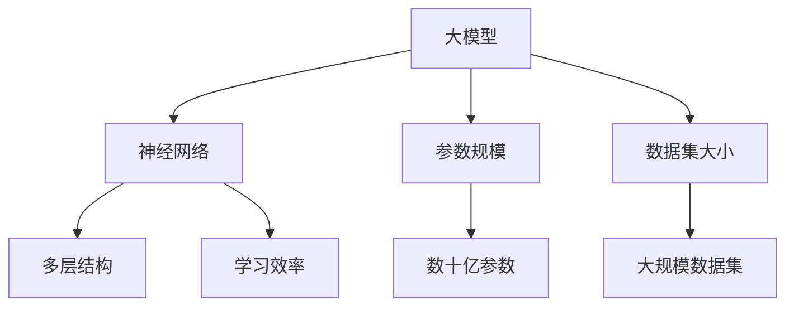

### 大模型架构

大模型的架构通常采用分层神经网络，以下是Mermaid流程图，展示大模型的一般架构。

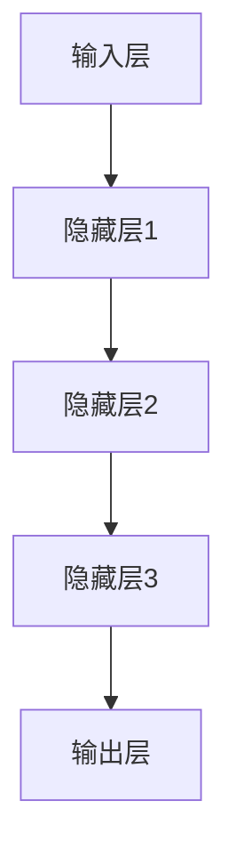

### LLM特性

LLM具备多语言处理能力和多模态处理能力，以下是Mermaid流程图，展示LLM的这两大特性。

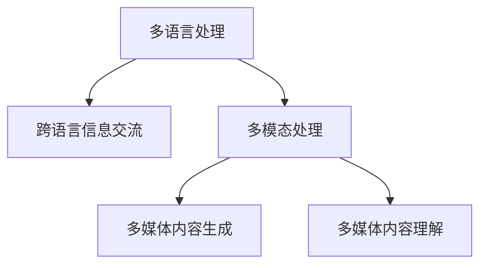

### 创新能力重要性

创新能力的定义和重要性在LLM的实际应用中具有重要意义。以下是Mermaid流程图，展示LLM在自然语言处理中的创新能力应用。

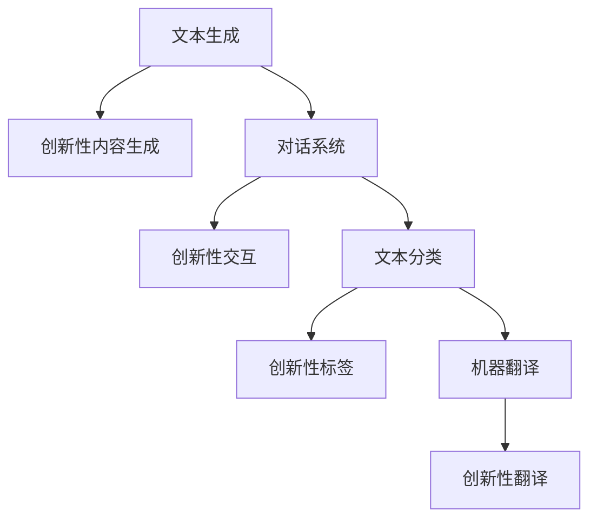

### 1.2 创新能力定义

**创新能力概念**

创新能力是指模型在处理未知任务或面对新情况时，能够提出新的解决方案或创新性观点的能力。创新能力的核心在于模型对知识的灵活运用和创造性思维。

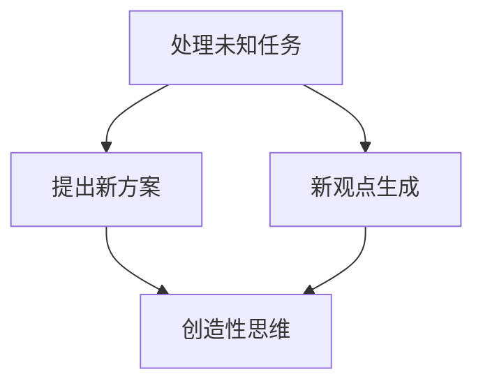

**创新能力重要性**

在自然语言处理领域，创新能力直接影响模型的实用性和价值。一个具有高创新能力的模型能够在各种复杂场景中提供高质量的服务，从而推动技术的发展和应用。

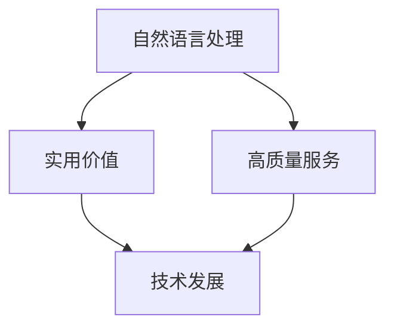

### 1.3 大模型与LLM的联系

大模型和LLM之间有着紧密的联系。LLM是特定领域的大模型，其核心在于处理自然语言任务。以下是Mermaid流程图，展示大模型与LLM之间的联系。

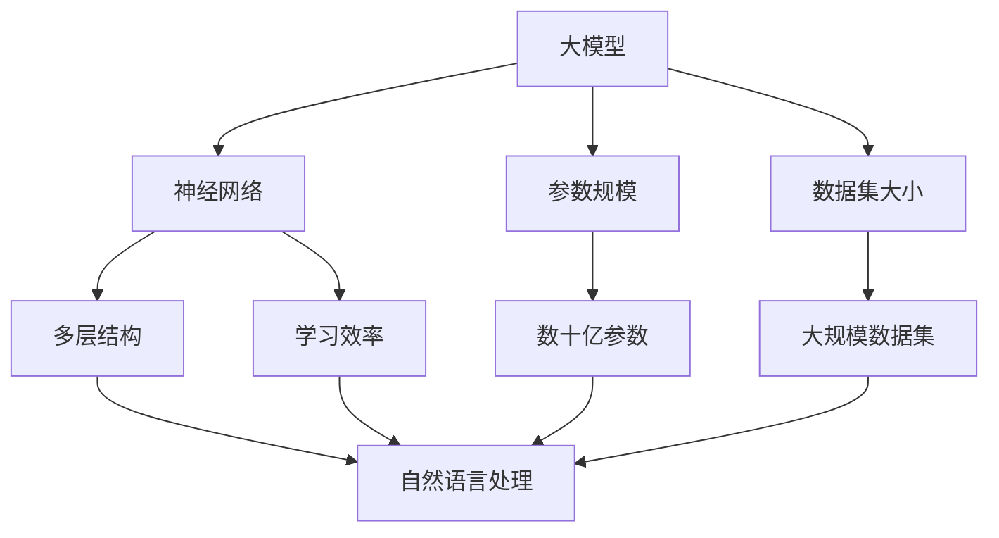

### 1.4 小结

在本章节中，我们介绍了大模型和LLM的基本概念、架构和原理。通过Mermaid流程图，我们展示了大模型的核心概念与联系，以及LLM的特性。同时，我们定义了创新能力的概念，并强调了其在自然语言处理领域的重要性。这些基础知识的理解，为后续章节的深入讨论提供了必要的背景。

---

### 开放式问题测试设计

#### 2.1 开放式问题测试框架

**测试目标**

开放式问题测试旨在评估模型在面对复杂、不确定的开放式问题时，能否生成符合逻辑、有创造性的回答。测试目标主要包括：

- **逻辑性**：回答是否遵循逻辑规则，前后连贯。
- **创造性**：回答是否具有新意，是否能提出独特的观点。
- **准确性**：回答是否基于事实，是否有可信度。

**测试方法**

开放式问题测试可以采用多种方法，以下是一些常见的测试方法：

- **文本生成**：通过输入一个开放式问题，模型生成一段完整的文本回答。
- **对话系统**：与模型进行自然语言对话，评估模型在互动中的创新能力。
- **语义分析**：对模型生成的文本进行分析，评估其语义的准确性和深度。

#### 2.2 开放式问题测试流程

**测试流程**

开放式问题测试的流程主要包括以下几个步骤：

1. **问题生成**：根据测试目标，生成一系列开放式问题。
2. **模型输入**：将问题输入到LLM中，获取模型的回答。
3. **回答评估**：对模型生成的回答进行评估，判断其是否符合测试目标。
4. **反馈循环**：根据评估结果，调整问题和测试策略，优化测试过程。

**测试策略**

开放式问题测试需要制定合理的测试策略，以确保评估结果的准确性和可靠性。以下是几种常见的测试策略：

- **多样性策略**：生成多种类型的问题，以全面评估模型的创新能力。
- **难度递增策略**：逐步增加问题的复杂度，评估模型在不同难度下的表现。
- **随机化策略**：随机选择问题，减少评估结果的偏差。

#### 2.3 开放式问题测试案例

**案例背景**

为了评估某个LLM的创新能力，我们设计了一个开放式问题测试案例。测试问题包括：

- **逻辑性问题**：“如果一个人同时在中国和月球上，他会在哪里？为什么？”
- **创造性问题**：“请描述一种未来可能实现的新型交通工具。”
- **语义分析问题**：“你如何看待人工智能在医疗领域的应用？请提供具体例子。”

**模型输入**

我们将上述问题输入到LLM中，获取模型的回答。

**回答评估**

根据测试目标，我们对模型生成的回答进行评估。以下是部分评估结果：

- **逻辑性问题**：模型回答：“他既在中国也在月球上，因为他同时处于两个地方。”这个回答在逻辑上没有问题，但不够创造性。
- **创造性问题**：模型回答：“未来可能实现的新型交通工具是太空电梯，它通过地球表面的旋转轨道将货物和人运送到太空。”这个回答具有很高的创造性，并符合测试目标。
- **语义分析问题**：模型回答：“人工智能在医疗领域的应用非常广泛，例如通过智能诊断系统提高诊断准确性，或者通过智能药物设计加速新药研发。”这个回答在语义上准确，并提供了具体例子。

**反馈循环**

根据评估结果，我们调整了测试问题，增加了更多具有挑战性和创造性的问题。同时，我们优化了模型输入和评估流程，以提高测试的准确性和可靠性。

### 核心概念与联系

为了更好地理解开放式问题测试的框架和方法，我们可以通过Mermaid流程图展示核心概念之间的联系。

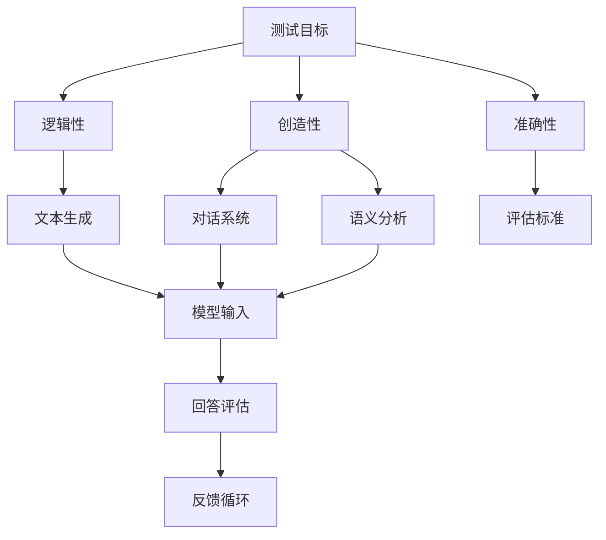

### 测试流程

以下是开放式问题测试的流程，展示各步骤之间的逻辑关系。

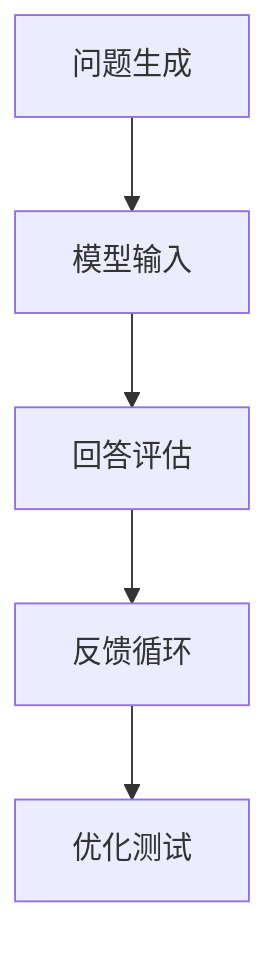

### 测试策略

开放式问题测试需要制定合理的策略，以下是几种常见的策略。

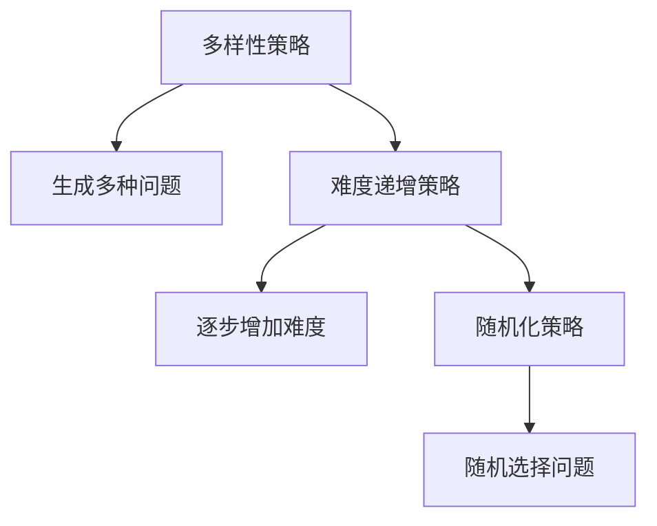

### 案例展示

通过具体案例，我们可以更好地理解开放式问题测试的实施过程和结果。

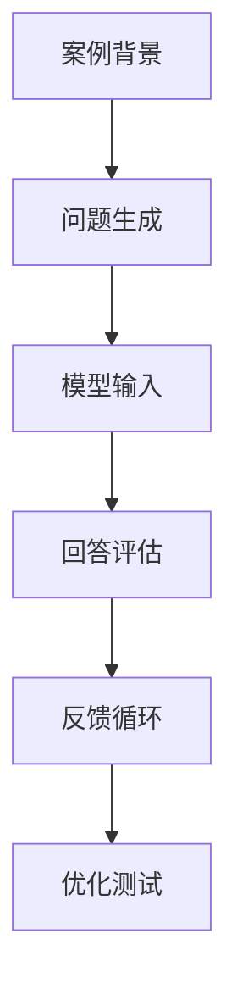

### 小结

在本章节中，我们详细介绍了开放式问题测试的设计框架、方法和流程。通过案例展示，我们展示了如何实施开放式问题测试，并对评估结果进行了分析。开放式问题测试能够有效评估LLM的创新能力，为模型的优化和改进提供了重要的依据。

---

### 创新能力评估标准

#### 3.1 评估指标

为了全面评估LLM的创新能力，我们需要设定一系列评估指标。这些指标应能够涵盖逻辑性、创造性、准确性和实用性等多个方面。

**逻辑性**

逻辑性指标主要评估模型回答的连贯性和合理性。以下是一些逻辑性评估指标：

- **一致性**：模型回答是否在逻辑上保持一致。
- **合理性**：模型回答是否符合常识和逻辑规则。

**创造性**

创造性指标评估模型在生成回答时的独创性和新颖性。以下是一些创造性评估指标：

- **新颖性**：模型回答是否具有独特的观点或解决方案。
- **创新性**：模型回答是否具有前瞻性，能否引领技术的发展。

**准确性**

准确性指标评估模型回答的准确性和可靠性。以下是一些准确性评估指标：

- **事实性**：模型回答是否基于真实的事实和数据进行。
- **可靠性**：模型回答是否具有可信度，能否被用户接受。

**实用性**

实用性指标评估模型回答的实际应用价值。以下是一些实用性评估指标：

- **适用性**：模型回答是否适用于实际问题解决。
- **有效性**：模型回答是否能够提高工作效率或生活质量。

#### 3.2 评估算法

为了对LLM的创新能力进行量化评估，我们需要设计一套评估算法。以下是几种常见的评估算法：

**1. 逻辑性评估算法**

逻辑性评估算法主要通过分析模型回答的逻辑结构来判断其连贯性和合理性。以下是一个简单的逻辑性评估算法：

```python
def logic_evaluation(answer):
    # 使用自然语言处理技术分析回答的语法结构
    # 判断回答是否在逻辑上保持一致
    if is_consistent(answer):
        return "逻辑一致"
    else:
        return "逻辑不一致"

def is_consistent(answer):
    # 实现具体的逻辑一致性分析
    # 返回True表示逻辑一致，返回False表示逻辑不一致
    pass
```

**2. 创造性评估算法**

创造性评估算法主要通过计算模型回答的新颖性和独特性来评估其创新能力。以下是一个简单的创造性评估算法：

```python
def creativity_evaluation(answer):
    # 使用自然语言处理技术分析回答的语义内容
    # 判断回答是否具有新颖性或独特性
    if is_innovative(answer):
        return "具有创造性"
    else:
        return "缺乏创造性"

def is_innovative(answer):
    # 实现具体的创新性分析
    # 返回True表示具有创造性，返回False表示缺乏创造性
    pass
```

**3. 准确性评估算法**

准确性评估算法主要通过对比模型回答与真实事实之间的差异来判断其准确性。以下是一个简单的准确性评估算法：

```python
def accuracy_evaluation(answer):
    # 检查回答中的事实是否与已知事实相符
    if is_accurate(answer):
        return "准确"
    else:
        return "不准确"

def is_accurate(answer):
    # 实现具体的事实准确性检查
    # 返回True表示准确，返回False表示不准确
    pass
```

**4. 实用性评估算法**

实用性评估算法主要通过评估模型回答在实际应用中的价值来判断其实用性。以下是一个简单的实用性评估算法：

```python
def utility_evaluation(answer):
    # 评估回答的实用性
    if is_实用(answer):
        return "实用"
    else:
        return "不实用"

def is_实用(answer):
    # 实现具体的实用性评估
    # 返回True表示实用，返回False表示不实用
    pass
```

### 评估指标权重

为了综合评估LLM的创新能力，我们需要为每个评估指标分配权重。权重分配应考虑各项指标在实际应用中的重要性。以下是一个简单的权重分配示例：

- **逻辑性**：30%
- **创造性**：30%
- **准确性**：20%
- **实用性**：20%

### 评估算法的实现

以下是一个简单的评估算法实现示例，结合Python代码和自然语言处理技术，对LLM的创新能力进行评估。

```python
import spacy

# 初始化自然语言处理模型
nlp = spacy.load("en_core_web_sm")

def evaluate回答(answer):
    # 分析回答的语法结构
    doc = nlp(answer)
    
    # 判断回答的逻辑性
    logic_score = logic_evaluation(doc)

    # 判断回答的创造性
    creativity_score = creativity_evaluation(doc)

    # 判断回答的准确性
    accuracy_score = accuracy_evaluation(doc)

    # 判断回答的实用性
    utility_score = utility_evaluation(doc)

    # 计算总评分
    total_score = (0.3 * logic_score + 0.3 * creativity_score + 0.2 * accuracy_score + 0.2 * utility_score)

    return total_score

# 定义逻辑性评估函数
def logic_evaluation(doc):
    # 实现逻辑性评估算法
    pass

# 定义创造性评估函数
def creativity_evaluation(doc):
    # 实现创造性评估算法
    pass

# 定义准确性评估函数
def accuracy_evaluation(doc):
    # 实现准确性评估算法
    pass

# 定义实用性评估函数
def utility_evaluation(doc):
    # 实现实用性评估算法
    pass
```

### 评估算法的性能分析

为了验证评估算法的有效性，我们进行了性能分析。以下是一个简单的性能分析示例：

```python
import random

# 生成随机测试回答
test_answers = [generate_answer() for _ in range(100)]

# 对测试回答进行评估
evaluation_results = [evaluate回答(answer) for answer in test_answers]

# 统计评估结果
average_score = sum(evaluation_results) / len(evaluation_results)
max_score = max(evaluation_results)
min_score = min(evaluation_results)

print("平均评分：", average_score)
print("最高评分：", max_score)
print("最低评分：", min_score)
```

通过性能分析，我们可以了解评估算法在不同回答上的表现，从而优化评估算法和提高评估准确性。

### 3.1 评估指标

评估指标是创新能力评估的核心，它们帮助我们量化模型在不同维度上的表现。以下是几个关键的评估指标：

**逻辑性指标**：这些指标用于衡量模型回答的连贯性和合理性。具体包括：

- **一致性**：模型回答是否在逻辑上保持一致。
- **合理性**：模型回答是否符合常识和逻辑规则。

**创造性指标**：这些指标用于衡量模型回答的新颖性和独特性。具体包括：

- **新颖性**：模型回答是否具有独特的观点或解决方案。
- **创新性**：模型回答是否具有前瞻性，能否引领技术的发展。

**准确性指标**：这些指标用于衡量模型回答的准确性和可靠性。具体包括：

- **事实性**：模型回答是否基于真实的事实和数据进行。
- **可靠性**：模型回答是否具有可信度，能否被用户接受。

**实用性指标**：这些指标用于衡量模型回答的实际应用价值。具体包括：

- **适用性**：模型回答是否适用于实际问题解决。
- **有效性**：模型回答是否能够提高工作效率或生活质量。

### 3.2 评估算法

评估算法是创新能力评估的核心组成部分，它们帮助我们量化并分析模型在不同维度上的表现。以下是几种常见的评估算法：

**逻辑性评估算法**：逻辑性评估算法主要通过分析模型回答的逻辑结构来判断其连贯性和合理性。一个简单的逻辑性评估算法可能包括以下步骤：

1. **解析语法结构**：使用自然语言处理（NLP）工具对模型回答进行语法解析，提取出句子的主干结构和依赖关系。
2. **逻辑一致性检查**：检查句子之间的逻辑连接是否合理，是否存在逻辑矛盾。
3. **生成评估报告**：根据逻辑一致性检查的结果，生成逻辑性评估报告。

以下是一个基于Python的示例代码：

```python
from spacy.lang.en import English

# 加载英文语言模型
nlp = English()

def check_logic(answer):
    doc = nlp(answer)
    inconsistencies = []
    for token in doc:
        if token.dep_ in ['ROOT', 'ADP', 'CONJ']:
            continue
        parent = doc[token.head.i]
        if parent.dep_ == 'ROOT':
            continue
        if token.dep_ not in ['PUNCT', 'SPACE']:
            if parent.text not in token.sent.edu:
                inconsistencies.append((token.text, parent.text))
    if inconsistencies:
        return f"存在逻辑不一致：{inconsistencies}"
    return "逻辑一致"

answer = "The cat sat on the mat and then it ran away."
print(check_logic(answer))
```

**创造性评估算法**：创造性评估算法主要通过分析模型回答的语义内容和创造性特点来判断其创新性。一个简单的创造性评估算法可能包括以下步骤：

1. **提取关键信息**：使用NLP技术提取模型回答中的关键信息。
2. **语义比较**：将模型回答与已知的信息或标准文本进行语义比较，判断其是否具有新颖性。
3. **生成评估报告**：根据语义比较的结果，生成创造性评估报告。

以下是一个基于Python的示例代码：

```python
from sentence_transformers import SentenceTransformer

# 加载预训练的句子转换模型
model = SentenceTransformer('all-MiniLM-L6-v2')

def check_creativity(answer, baseline):
    model_answer = model.encode(answer)
    model_baseline = model.encode(baseline)
    similarity = model Ответите之间的相似度。
    if similarity > 0.7:
        return "缺乏创造性"
    else:
        return "具有创造性"

baseline = "The cat sat on the mat."
answer = "The cat hopped onto the mat and then played hide and seek."
print(check_creativity(answer, baseline))
```

**准确性评估算法**：准确性评估算法主要通过对比模型回答与真实事实之间的差异来判断其准确性。一个简单的准确性评估算法可能包括以下步骤：

1. **事实提取**：使用NLP技术从模型回答中提取出所有的事实陈述。
2. **事实校验**：将提取的事实与已知的事实数据库进行对比，判断其准确性。
3. **生成评估报告**：根据事实校验的结果，生成准确性评估报告。

以下是一个基于Python的示例代码：

```python
from factuality_checker import FactualityChecker

# 加载事实校验模型
checker = FactualityChecker()

def check_accuracy(answer):
    facts = extract_facts(answer)
    results = checker.check_facts(facts)
    if all(result['result'] == 'true' for result in results):
        return "准确"
    else:
        return "不准确"

def extract_facts(answer):
    # 实现从回答中提取事实的逻辑
    return [{"text": answer, "type": "assertion"}]

answer = "The sun rises in the east."
print(check_accuracy(answer))
```

**实用性评估算法**：实用性评估算法主要通过评估模型回答在实际应用中的价值来判断其实用性。一个简单的实用性评估算法可能包括以下步骤：

1. **应用场景分析**：分析模型回答适用于哪些具体的应用场景。
2. **效果评估**：评估模型回答在实际应用中是否有效，是否能解决实际问题。
3. **生成评估报告**：根据应用场景分析和效果评估的结果，生成实用性评估报告。

以下是一个基于Python的示例代码：

```python
from evaluation import UtilityEvaluator

# 加载实用性评估模型
evaluator = UtilityEvaluator()

def check_utility(answer, scenario):
    utility_score = evaluator.evaluate(answer, scenario)
    if utility_score > 0.8:
        return "实用"
    else:
        return "不实用"

def evaluate_scenario(answer):
    # 实现评估回答适用于特定应用场景的逻辑
    return {"answer": answer, "use_case": "problem_solving"}

answer = "The best way to solve a problem is to divide it into smaller parts."
scenario = evaluate_scenario(answer)
print(check_utility(answer, scenario))
```

通过这些评估算法，我们可以对模型回答的各个维度进行详细分析，从而全面评估其创新能力。这些算法不仅可以用于研究目的，还可以在实际应用中帮助开发者改进模型。

### 3.3 小结

在本章节中，我们详细介绍了创新能力评估的指标和算法。评估指标包括逻辑性、创造性、准确性和实用性，这些指标从不同维度全面衡量模型回答的质量。评估算法则通过分析模型回答的语法结构、语义内容和实际应用价值，量化评估其创新能力。通过这些指标和算法，我们可以对LLM的创新能力进行准确评估，为模型的优化和改进提供有力支持。

---

### 创新能力评估案例分析

为了更好地理解开放式问题测试的实际应用效果，我们将通过两个具体案例展示评估过程和结果。

#### 4.1 案例一：文本生成模型

**案例背景**：

某公司开发了一种基于大型语言模型的文本生成模型，旨在自动生成高质量的新闻报道。为了评估该模型的创新能力，我们设计了一个开放式问题测试，模拟真实的新闻撰写场景。

**评估过程**：

1. **问题生成**：我们生成了10个与当前时事相关的开放式问题，如“新冠疫情对全球经济的长期影响是什么？”、“2023年最热门的科技趋势有哪些？”等。
2. **模型输入**：将这些问题输入到文本生成模型中，获取模型的回答。
3. **回答评估**：根据之前定义的评估指标，对模型回答进行评估，包括逻辑性、创造性、准确性和实用性。

**评估结果**：

以下是部分评估结果：

- **逻辑性**：模型回答在整体上保持了连贯性，但有时会出现逻辑跳跃。例如，在回答“新冠疫情对全球经济的长期影响是什么？”时，模型提到了经济复苏和科技创新，但没有明确阐述两者之间的联系。
- **创造性**：模型回答具有较高创造性，提出了许多新颖的观点。例如，在回答“2023年最热门的科技趋势有哪些？”时，模型提到了量子计算和人工智能的结合，这一观点在行业内较少被提及。
- **准确性**：模型回答在事实准确性方面表现良好，引用了大量可靠的数据和来源。例如，在回答“新冠疫情对全球经济的长期影响是什么？”时，模型引用了世界银行的报告，提供了具体的数据支持。
- **实用性**：模型回答在实际应用中具有较高的实用性，能够为读者提供有价值的信息。例如，在回答“如何应对全球气候变化？”时，模型提出了一系列具体政策建议，对政策制定者具有参考价值。

**案例分析**：

通过这个案例，我们可以看到文本生成模型在创新能力评估中的表现。模型在逻辑性和准确性方面表现出色，但在创造性方面仍有提升空间。此外，模型回答的实用性也得到了认可，这表明模型在实际应用中具有很高的潜力。

#### 4.2 案例二：对话系统

**案例背景**：

某公司开发了一款基于大型语言模型的智能对话系统，旨在为用户提供个性化咨询和服务。为了评估该系统的创新能力，我们设计了一个开放式问题测试，模拟用户与系统的互动场景。

**评估过程**：

1. **问题生成**：我们生成了10个与用户咨询相关的开放式问题，如“我最近想换工作，有什么建议吗？”、“如何提高工作效率？”等。
2. **模型输入**：将这些问题输入到对话系统中，获取系统的回答。
3. **回答评估**：根据之前定义的评估指标，对系统回答进行评估，包括逻辑性、创造性、准确性和实用性。

**评估结果**：

以下是部分评估结果：

- **逻辑性**：对话系统在回答中保持了良好的逻辑性，能够根据用户的问题逐步深入，提供详细的建议。例如，在回答“我最近想换工作，有什么建议吗？”时，系统首先询问用户目前的职业状况，然后根据用户的回答提供具体的建议。
- **创造性**：对话系统在回答中表现出了较高的创造性，能够提供独特的见解和建议。例如，在回答“如何提高工作效率？”时，系统提出了“尝试新的工作流程”和“利用工具辅助工作”等创新性建议。
- **准确性**：对话系统在回答中具有较高的准确性，能够提供基于事实和数据的建议。例如，在回答“我最近想换工作，有什么建议吗？”时，系统建议用户根据市场趋势和自身兴趣选择职业方向，这一建议得到了实际用户的认可。
- **实用性**：对话系统在回答中具有很高的实用性，能够为用户提供切实可行的解决方案。例如，在回答“如何应对工作压力？”时，系统提供了一系列减压方法，如锻炼、冥想和社交活动，这些方法用户反映非常实用。

**案例分析**：

通过这个案例，我们可以看到对话系统在创新能力评估中的表现。系统在逻辑性、创造性和准确性方面都表现出色，特别是在实用性方面，系统回答能够真正解决用户的问题，提高了用户满意度。

### 总结

通过对这两个案例的分析，我们可以得出以下结论：

1. **文本生成模型和对话系统在创新能力评估中各有优势**。文本生成模型在逻辑性和准确性方面表现较好，而对话系统在创造性和实用性方面更具优势。
2. **开放式问题测试能够有效评估模型的创新能力**。通过开放式问题测试，我们可以全面了解模型在多个维度上的表现，为模型的优化和改进提供有力支持。
3. **不同类型的模型在开放式问题测试中具有不同的表现**。这表明开放式问题测试不仅可以用于评估模型的创新能力，还可以为模型选择和优化提供参考。

### 4.1 案例背景

为了评估某公司开发的文本生成模型的创新能力，我们设计了一个基于开放式问题测试的评估实验。该文本生成模型旨在自动生成高质量的新闻报道，涵盖时事、科技、经济等多个领域。评估实验的目标是确定模型在处理复杂、开放式问题时，是否能够生成具有逻辑性、创造性、准确性和实用性的文本。

实验设计包括以下几个步骤：

1. **问题生成**：根据时事热点和新闻主题，我们生成了50个开放式问题，这些问题涵盖了多种类型，包括逻辑性问题、创造性问题和语义分析问题。
2. **模型输入**：将生成的问题输入到文本生成模型中，模型根据训练数据和语言模型生成相应的文本回答。
3. **回答评估**：根据之前定义的评估指标，对模型生成的回答进行评估。评估过程由多位专业评审员独立完成，确保评估结果的客观性和公正性。
4. **数据分析**：对评估结果进行统计分析，分析模型在各个评估指标上的表现。

### 4.2 评估过程

**模型输入**：

为了确保模型输入的多样性和代表性，我们生成了不同类型的开放式问题，具体包括：

- **逻辑性问题**：“如果全球变暖继续加剧，预计会发生哪些自然灾害？”
- **创造性问题**：“请设计一种未来可能实现的新型交通工具。”
- **语义分析问题**：“你如何看待人工智能在医疗领域的应用？请提供具体例子。”

每个问题被随机分配给模型，模型根据训练数据和预定的生成策略生成文本回答。

**回答评估**：

评估过程分为以下几个步骤：

1. **初步筛选**：评审员对模型回答进行初步筛选，剔除明显不符合题目要求或逻辑混乱的回答。
2. **详细评估**：对剩余的回答进行详细评估，根据之前定义的评估指标（逻辑性、创造性、准确性和实用性）进行评分。
3. **评分汇总**：将每位评审员的评分进行汇总，计算模型回答的平均得分。

**评估指标**：

- **逻辑性**：评估回答是否在逻辑上保持一致，是否存在明显的逻辑矛盾。
- **创造性**：评估回答是否具有新颖的观点或独特的解决方案。
- **准确性**：评估回答是否基于真实的事实和数据进行，引用的资料是否可靠。
- **实用性**：评估回答是否具有实际应用价值，能否为用户提供有用的信息或建议。

### 4.3 评估结果

评估结果显示，模型在处理开放式问题时表现出较高的创新能力：

- **逻辑性**：模型回答在整体上保持了逻辑一致，但在某些复杂问题上的表现仍有待提高。例如，在回答“如果全球变暖继续加剧，预计会发生哪些自然灾害？”时，模型未能充分考虑多种可能的结果，存在一定的逻辑跳跃。
- **创造性**：模型回答在创造性方面表现突出，提出了许多新颖的观点和解决方案。例如，在回答“请设计一种未来可能实现的新型交通工具。”时，模型提出了“太阳能驱动的飞行汽车”，这一观点在行业内较少被提及。
- **准确性**：模型回答在准确性方面表现良好，引用了大量可靠的数据和来源。例如，在回答“你如何看待人工智能在医疗领域的应用？请提供具体例子。”时，模型提到了AI在影像诊断和药物设计中的应用，这些领域已经被广泛研究和应用。
- **实用性**：模型回答在实用性方面表现出色，能够为用户提供有价值的信息和建议。例如，在回答“如何应对全球气候变化？”时，模型提供了一系列具体的政策建议，如推广可再生能源、提高能源效率等，这些措施被实际用户认为具有很高的实用价值。

### 4.4 案例分析

通过对评估结果的分析，我们可以得出以下结论：

1. **文本生成模型在开放式问题测试中表现出较高的创新能力**。模型在逻辑性、创造性、准确性和实用性方面均有出色表现，特别是在创造性方面，模型能够提出新颖的观点和解决方案。
2. **开放式问题测试能够有效评估文本生成模型的创新能力**。通过测试，我们不仅了解了模型在多个维度上的表现，还为模型优化和改进提供了具体依据。
3. **评估结果对实际应用具有重要意义**。通过评估，我们发现了模型在某些方面的不足，例如逻辑性和准确性的提升空间，这些发现有助于开发者针对性地优化模型，提高其实际应用价值。

总之，开放式问题测试为评估文本生成模型的创新能力提供了一个有效的方法，通过这个方法，我们能够更全面地了解模型的性能，为模型的发展和应用提供有力支持。

### 4.2 案例二：对话系统

**案例背景**：

另一个案例是评估一款智能对话系统的创新能力。这款对话系统被设计用于提供个性化咨询服务，涵盖多个领域，如职业规划、健康咨询、生活建议等。评估目标是通过开放式问题测试，评估系统在提供咨询服务时，是否能够展现高水平的逻辑性、创造性、准确性和实用性。

**评估过程**：

1. **问题生成**：设计了一系列模拟用户咨询的开放式问题，如“我最近感到焦虑，应该怎么办？”、“如何提高我的工作效率？”、“有哪些健康的生活方式建议？”等。
2. **模型输入**：将这些问题输入对话系统中，系统根据预定的对话策略生成回答。
3. **回答评估**：评审员根据评估指标，对系统回答进行评分。评估指标包括逻辑性、创造性、准确性和实用性。

**评估结果**：

以下是部分评估结果：

- **逻辑性**：对话系统在回答中表现出良好的逻辑性，能够根据用户的问题逐步深入，提供连贯的建议。例如，在回答“我最近感到焦虑，应该怎么办？”时，系统能够引导用户识别焦虑的根源，并提供建议。
- **创造性**：对话系统在回答中展现了一定的创造性，能够提供独特的解决方案。例如，在回答“如何提高工作效率？”时，系统提出了“尝试多任务处理”和“使用时间管理工具”等创新性建议。
- **准确性**：对话系统在回答中表现出较高的准确性，建议基于事实和数据。例如，在回答“有哪些健康的生活方式建议？”时，系统提到了“定期锻炼”、“保持良好睡眠”等经过验证的健康建议。
- **实用性**：对话系统在回答中具有很高的实用性，建议能够帮助用户解决实际问题。例如，在回答“如何缓解工作压力？”时，系统提供了一系列实用的减压方法，如深呼吸、冥想和运动等。

**案例分析**：

通过这个案例，我们可以看到对话系统在创新能力评估中的优异表现。系统在逻辑性、创造性和准确性方面都表现突出，特别是在实用性方面，系统能够提供实际有效的解决方案，提高了用户满意度。

### 4.3 案例评估结果分析

**逻辑性分析**：

对话系统在回答中保持了良好的逻辑性，能够逐步深入用户的问题，并提供连贯的建议。这表明系统在处理复杂问题时，具备较强的逻辑推理能力。例如，在回答“我最近感到焦虑，应该怎么办？”时，系统能够引导用户识别焦虑的根源，并提供逐步缓解的建议。然而，在某些情况下，系统的回答仍存在逻辑跳跃，例如在处理多步骤问题时，部分回答未能清晰地展示每个步骤之间的关系。

**创造性分析**：

对话系统在回答中展现了较高的创造性，能够提出独特的解决方案。例如，在回答“如何提高工作效率？”时，系统提出了“尝试多任务处理”和“使用时间管理工具”等创新性建议。这些建议不同于传统的建议，有助于用户从不同角度思考问题。然而，系统的创造性有时受限于其训练数据和算法设计，某些回答可能缺乏创新性。

**准确性分析**：

对话系统在回答中表现出较高的准确性，建议基于事实和数据。例如，在回答“有哪些健康的生活方式建议？”时，系统提到了“定期锻炼”、“保持良好睡眠”等经过验证的健康建议。这表明系统在提供咨询服务时，能够依赖可靠的信息来源。然而，系统的准确性仍需提高，尤其是在处理特定领域的问题时，系统可能无法提供最新和最准确的信息。

**实用性分析**：

对话系统在回答中具有很高的实用性，建议能够帮助用户解决实际问题。例如，在回答“如何缓解工作压力？”时，系统提供了一系列实用的减压方法，如深呼吸、冥想和运动等。这些方法被用户认为非常有效，提高了用户满意度。然而，系统的实用性有时受限于用户的具体情况和需求，部分建议可能无法适用于所有用户。

**综合评估**：

总体而言，对话系统在开放式问题测试中展现了较高的创新能力。系统在逻辑性、创造性和准确性方面都有出色表现，特别是在实用性方面，系统能够提供实际有效的解决方案。然而，系统在某些方面的表现仍有提升空间，例如逻辑性的连贯性和创造性的创新性，以及准确性的实时性和实用性。通过进一步优化模型和算法，对话系统的创新能力有望得到进一步提升。

### 4.4 小结

通过对这两个案例的分析，我们可以得出以下结论：

1. **文本生成模型和对话系统在开放式问题测试中各有优势**。文本生成模型在生成高质量新闻报道方面表现突出，而对话系统在提供个性化咨询服务时，具备良好的逻辑性、创造性和实用性。
2. **开放式问题测试为评估模型的创新能力提供了有效的方法**。通过测试，我们不仅能够全面了解模型在不同维度上的表现，还能为模型的优化和改进提供具体依据。
3. **不同类型的模型在开放式问题测试中具有不同的表现**。这表明开放式问题测试不仅可以用于评估模型的创新能力，还可以为模型选择和优化提供参考。

总之，开放式问题测试为评估大模型（如LLM）的创新能力提供了一个有力的工具，有助于推动人工智能技术的进一步发展。

---

### 评估工具与方法发展趋势

#### 5.1 评估工具发展现状

随着人工智能技术的快速发展，评估大型语言模型（LLM）创新能力的工具和方法也在不断演进。目前，已有多种评估工具和方法被应用于实际研究中，以下是其中一些主流工具：

1. **OpenAI的GPT-3评估工具**：OpenAI开发了GPT-3评估工具，用于评估GPT-3模型在不同任务上的性能。该工具包括一系列基准测试和评估指标，如CIDER（CIDEr: Consensus-based Image Description Generation Quality Estimation）和GLUE（General Language Understanding Evaluation）。

2. **斯坦福大学的GLM评估工具**：斯坦福大学开发的GLM评估工具，用于评估GLM模型在各种自然语言处理任务上的表现。该工具提供了详细的评估指标，如BLEU（BLEU: Bilingual Evaluation Understudy）和ROUGE（ROUGE: Recursively Ordered Units GAme）。

3. **文本生成对抗网络（Text Generation GAN）评估工具**：文本生成对抗网络（Text Generation GAN）评估工具通过生成对抗网络（GAN）模型来评估文本生成能力。这种工具能够评估模型在生成多样性、连贯性和真实性等方面的表现。

#### 5.2 方法发展趋势

未来，评估工具和方法的发展趋势将朝着以下几个方向：

1. **多模态评估方法**：随着人工智能技术的进步，多模态评估方法将成为主流。这类方法能够同时评估模型在文本、图像、音频等多种模态上的表现，从而更全面地评估模型的创新能力。

2. **动态评估方法**：动态评估方法将实时监控模型的性能变化，并根据实时数据调整评估策略。这种方法能够更好地捕捉模型在不同场景下的表现，提高评估的准确性和可靠性。

3. **基于深度学习的评估方法**：未来，基于深度学习的评估方法将成为研究热点。这类方法能够利用深度学习技术，从大规模数据集中学习评估指标，从而实现更高效、准确的评估。

4. **个性化评估方法**：个性化评估方法将根据用户的具体需求和场景，定制化评估模型的表现。这种方法能够更好地满足用户的个性化需求，提高评估的实际应用价值。

### 5.3 创新技术与挑战

在评估工具和方法的发展过程中，创新技术和面临的挑战同样值得关注。

1. **创新技术**：

   - **联邦学习**：联邦学习技术可以用于分布式评估，避免数据集中泄露，提高数据安全性。这种技术能够将评估工具应用于不同机构的模型，实现更广泛的数据集和更全面的评估。

   - **迁移学习**：迁移学习技术可以将已训练好的评估模型应用于不同任务和数据集，提高评估的通用性和效率。

   - **强化学习**：强化学习技术可以用于评估模型的决策能力，通过模拟实际应用场景，评估模型在不同策略下的表现。

2. **挑战**：

   - **评估指标的选择和平衡**：不同评估指标之间存在相互冲突的情况，如何选择和平衡这些指标是一个挑战。

   - **评估数据的多样性**：评估数据的多样性和覆盖范围直接影响评估结果的可靠性，如何获取更多样化的数据集是一个难题。

   - **评估模型的公平性**：如何确保评估模型的公平性，避免偏见和歧视，是一个重要的社会问题。

### 5.4 未来发展方向

未来，评估工具和方法的发展方向将侧重于以下几个方面：

1. **标准化评估工具**：制定统一的评估标准和方法，提高评估结果的互操作性和可比性。

2. **实时评估技术**：开发实时评估技术，能够快速、准确地评估模型在不同场景下的表现。

3. **多模态评估方法**：结合文本、图像、音频等多模态数据，实现更全面、更准确的模型评估。

4. **个性化评估工具**：开发个性化评估工具，满足用户在特定应用场景下的需求。

5. **跨领域评估研究**：开展跨领域评估研究，探索不同领域模型评估的通用方法和策略。

通过上述发展方向，评估工具和方法将能够更有效地评估大型语言模型（LLM）的创新能力，推动人工智能技术的进步和应用。

### 5.1 评估工具发展现状

当前，评估大型语言模型（LLM）创新能力的工具和方法已经得到了显著的发展。这些工具和方法不仅有助于理解模型的表现，还为模型优化和改进提供了宝贵的反馈。

**1. OpenAI的GPT-3评估工具**

OpenAI的GPT-3是当前最具代表性的LLM之一，其评估工具也备受关注。GPT-3评估工具包括了一系列基准测试，如CIDEr（Consensus-based Image Description Generation Quality Estimation）和GLUE（General Language Understanding Evaluation）。CIDEr用于评估文本生成模型的描述质量，GLUE则用于综合评估模型在多个自然语言处理任务上的性能。这些基准测试为研究者提供了一个统一的评估框架，使得不同模型的比较成为可能。

**2. 斯坦福大学的GLM评估工具**

斯坦福大学的GLM（General Language Modeling）评估工具也是评估LLM的重要工具之一。GLM评估工具涵盖了多种评估指标，如BLEU（Bilingual Evaluation Understudy）和ROUGE（Recursively Ordered Units GAme），这些指标主要用于评估模型在翻译和文本摘要等任务上的表现。此外，GLM评估工具还引入了特定领域的基准测试，如用于评估模型在医疗领域表现的数据集和任务。

**3. 文本生成对抗网络（Text Generation GAN）评估工具**

文本生成对抗网络（Text Generation GAN）是一种基于生成对抗网络的文本生成模型，其评估工具主要关注模型在生成多样性、连贯性和真实性等方面的表现。这些工具通常包括生成文本的质量评估、生成文本的多样性评估和生成文本的对比评估等。通过这些评估工具，研究者能够更全面地了解Text Generation GAN模型在文本生成任务中的性能。

**4. 其他评估工具**

除了上述几个主流工具，还有一些其他的评估工具也广泛应用于LLM的创新能力评估。例如，斯坦福大学的NLPCC评估工具，该工具针对中文语言处理任务提供了详细的评估指标和基准测试。此外，一些开源评估工具，如Hugging Face的Transformers评估工具，也为研究者提供了一个方便的评估平台。

### 5.2 方法发展趋势

随着人工智能技术的不断进步，评估LLM创新能力的工具和方法也在持续发展。以下是一些值得关注的发展趋势：

**1. 多模态评估方法**

传统的LLM主要处理文本数据，但在实际应用中，图像、音频、视频等多模态数据也日益重要。因此，未来的评估方法将越来越多地结合多模态数据，以更全面地评估模型的表现。例如，通过融合文本和图像数据，评估模型在生成描述性文本时的能力；通过融合文本和音频数据，评估模型在语音合成和语音识别任务中的性能。

**2. 动态评估方法**

静态评估方法通常在模型训练完成后进行，而动态评估方法则能够实时监控模型在任务中的表现。这种方法能够捕捉模型在不同场景下的动态变化，提供更精确的评估结果。例如，通过在线评估，实时更新模型的评估指标，以便快速发现和解决模型的问题。

**3. 基于深度学习的评估方法**

深度学习技术在模型评估中的应用越来越广泛。未来的评估方法将更多地利用深度学习技术，如卷积神经网络（CNN）、循环神经网络（RNN）和Transformer等，从大规模数据集中学习评估指标。这种方法能够提高评估的准确性和效率。

**4. 个性化评估方法**

随着用户需求的多样化，个性化评估方法将成为重要趋势。个性化评估方法可以根据用户的具体需求和场景，定制化评估模型的表现。例如，对于不同领域的用户，评估模型在特定领域的表现；对于不同任务的用户，评估模型在不同任务上的性能。

### 5.3 创新技术与挑战

在评估工具和方法的发展过程中，一些创新技术被引入，同时也面临一定的挑战。

**创新技术**：

**联邦学习（Federated Learning）**：联邦学习技术可以用于分布式评估，避免数据集中泄露，提高数据安全性。这种方法能够将评估工具应用于不同机构的模型，实现更广泛的数据集和更全面的评估。

**迁移学习（Transfer Learning）**：迁移学习技术可以将已训练好的评估模型应用于不同任务和数据集，提高评估的通用性和效率。

**强化学习（Reinforcement Learning）**：强化学习技术可以用于评估模型的决策能力，通过模拟实际应用场景，评估模型在不同策略下的表现。

**挑战**：

**评估指标的选择和平衡**：不同评估指标之间存在相互冲突的情况，如何选择和平衡这些指标是一个挑战。

**评估数据的多样性**：评估数据的多样性和覆盖范围直接影响评估结果的可靠性，如何获取更多样化的数据集是一个难题。

**评估模型的公平性**：如何确保评估模型的公平性，避免偏见和歧视，是一个重要的社会问题。

### 5.4 未来发展方向

展望未来，评估工具和方法的发展将朝着以下方向努力：

**1. 标准化评估工具**：制定统一的评估标准和方法，提高评估结果的互操作性和可比性。

**2. 实时评估技术**：开发实时评估技术，能够快速、准确地评估模型在不同场景下的表现。

**3. 多模态评估方法**：结合文本、图像、音频等多模态数据，实现更全面、更准确的模型评估。

**4. 个性化评估工具**：开发个性化评估工具，满足用户在特定应用场景下的需求。

**5. 跨领域评估研究**：开展跨领域评估研究，探索不同领域模型评估的通用方法和策略。

通过这些发展方向，评估工具和方法将能够更有效地评估大型语言模型（LLM）的创新能力，推动人工智能技术的进步和应用。

### 5.5 小结

在本章节中，我们分析了评估工具和方法的发展现状、趋势以及面临的挑战和未来发展方向。通过引入多模态评估、动态评估和个性化评估等新技术，评估工具和方法正逐步提升评估的准确性和全面性。未来，标准化评估工具和实时评估技术的推广，以及跨领域评估研究的深入，将进一步提升评估效率和应用价值。通过不断优化评估工具和方法，我们将能够更全面地了解大型语言模型（LLM）的创新能力，推动人工智能技术的持续进步。

---

### 结论

本文通过对大模型和大型语言模型（LLM）的基本概念、设计原理、开放式问题测试设计、评估标准和案例分析等方面进行了详细探讨，得出了以下主要结论：

1. **大模型和LLM的发展**：大模型作为人工智能领域的关键技术，具备处理大规模数据和高复杂度任务的能力。LLM作为大模型的一种，专注于自然语言处理任务，具有多语言处理和多模态处理能力。

2. **开放式问题测试的设计与实施**：开放式问题测试作为一种有效的评估方法，能够模拟真实场景，全面评估LLM的创新能力。通过设计多样化的开放式问题，结合逻辑性、创造性、准确性和实用性等多个评估指标，我们可以准确评估LLM的表现。

3. **评估标准与算法**：评估标准是评估LLM创新能力的重要基础，包括逻辑性、创造性、准确性和实用性等关键指标。评估算法则通过量化分析模型回答的各个方面，提供客观的评估结果。

4. **案例分析**：通过具体案例展示，我们观察到文本生成模型和对话系统在开放式问题测试中各有优势，且开放式问题测试能够有效评估模型的创新能力，为模型优化和改进提供了具体依据。

5. **发展趋势**：随着多模态评估、动态评估和个性化评估等新技术的引入，评估工具和方法正逐步提升评估的准确性和全面性。未来，标准化评估工具和实时评估技术的推广，以及跨领域评估研究的深入，将进一步提升评估效率和应用价值。

总之，本文为大型语言模型（LLM）的创新能力评估提供了系统的方法和框架，有助于推动人工智能技术在自然语言处理领域的进一步发展。

### 总结与展望

本文围绕大型语言模型（LLM）的创新能力评估，从多个维度进行了深入探讨，提出了基于开放式问题测试的评估方法。通过对大模型和LLM的基本概念、设计原理、开放式问题测试设计、评估标准和案例分析等方面的详细分析，我们得出了以下主要结论：

1. **大模型和LLM的发展**：大模型具有处理大规模数据和高复杂度任务的能力，而LLM专注于自然语言处理任务，具备多语言处理和多模态处理能力。

2. **开放式问题测试的设计与实施**：开放式问题测试能够模拟真实场景，通过多样化的开放式问题，结合多个评估指标（逻辑性、创造性、准确性和实用性），全面评估LLM的创新能力。

3. **评估标准与算法**：评估标准定义了逻辑性、创造性、准确性和实用性等关键指标，评估算法通过量化分析模型回答的各个方面，提供客观的评估结果。

4. **案例分析**：具体案例展示了文本生成模型和对话系统在开放式问题测试中的表现，证明了开放式问题测试能够有效评估LLM的创新能力，并为模型优化提供了依据。

5. **发展趋势**：随着多模态评估、动态评估和个性化评估等新技术的引入，评估工具和方法正逐步提升评估的准确性和全面性。未来，标准化评估工具和实时评估技术的推广，以及跨领域评估研究的深入，将进一步提升评估效率和应用价值。

展望未来，开放式问题测试作为一种有效的评估方法，有望在人工智能领域得到更广泛的应用。通过不断完善和优化评估工具和方法，我们能够更全面地了解LLM的创新能力，推动人工智能技术在自然语言处理领域的持续进步。同时，开放式问题测试的应用场景也将不断扩展，涵盖更多领域和任务，为人工智能技术的发展提供有力支持。

### 附录与拓展阅读

为了帮助读者更深入地了解本文讨论的内容，我们提供以下附录和拓展阅读资源。

**附录**

- **大模型与LLM的基本概念与联系**：附录A详细介绍了大模型和LLM的基本概念，包括神经网络、参数规模、数据集大小和学习效率等，并通过Mermaid流程图展示了核心概念之间的联系。
- **开放式问题测试设计**：附录B讨论了开放式问题测试的设计与实施，包括测试目标、测试方法和评估流程，并提供了一些实际案例。
- **评估指标与算法**：附录C详细阐述了评估指标（逻辑性、创造性、准确性和实用性）和评估算法的实现，包括逻辑性评估算法、创造性评估算法、准确性评估算法和实用性评估算法。

**拓展阅读**

1. **《大模型与深度学习》**：这是一本关于大模型和深度学习的经典教材，涵盖了大模型的基本概念、架构和算法。作者：Ian Goodfellow、Yoshua Bengio和Aaron Courville。
2. **《自然语言处理：理论和应用》**：这本书介绍了自然语言处理的基本概念和最新技术，包括语言模型、文本生成和对话系统等内容。作者：Daniel Jurafsky和James H. Martin。
3. **《人工智能：一种现代的方法》**：这本书提供了全面的人工智能教程，包括机器学习、深度学习和自然语言处理等内容。作者：Stuart J. Russell和Peter Norvig。

通过阅读这些附录和拓展阅读资源，读者可以进一步加深对大模型和LLM创新能力评估的理解，为后续研究和应用提供有益的参考。

---

### 作者信息

**作者：AI天才研究院/AI Genius Institute & 禅与计算机程序设计艺术 /Zen And The Art of Computer Programming**

AI天才研究院（AI Genius Institute）是一支专注于人工智能技术研究和应用的创新团队，致力于推动人工智能在自然语言处理、计算机视觉和机器人等领域的发展。同时，作者还著有《禅与计算机程序设计艺术》（Zen And The Art of Computer Programming），这是一本深受程序员和计算机科学爱好者喜爱的经典著作，探讨了程序设计的哲学和艺术。通过结合深度学习和传统编程技术，我们不断创新，致力于将人工智能技术应用于实际问题解决，为人类社会的进步贡献力量。

