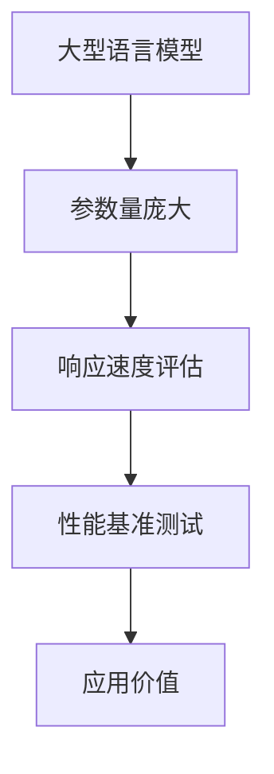
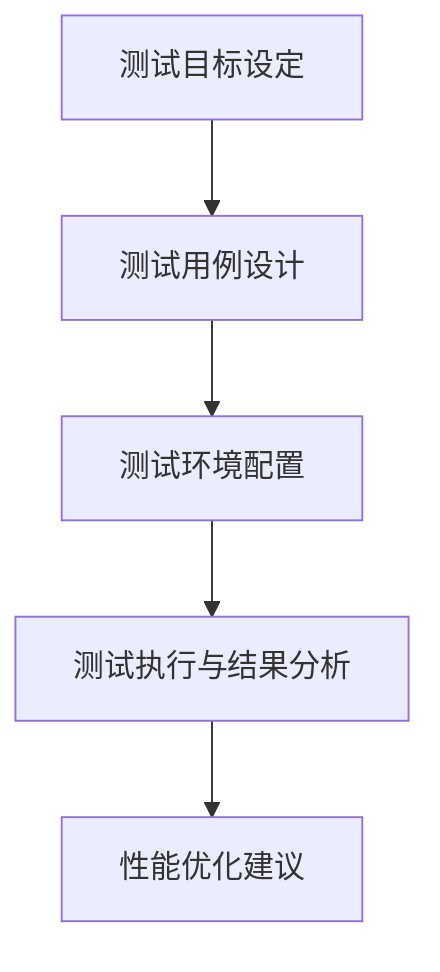

                 

### 第1章 引言与核心概念介绍
### 1.1 大模型响应速度评估的重要性
随着人工智能（AI）技术的迅猛发展，大型语言模型（Large Language Models，简称LLM）如GPT、BERT等逐渐成为自然语言处理（Natural Language Processing，简称NLP）领域的核心技术。这些大模型以其强大的文本生成和语义理解能力，在众多应用场景中取得了显著的成果。然而，随着模型规模的不断扩大，其响应速度和性能也成为了衡量其实用性和商业价值的重要指标。因此，对大模型的响应速度进行评估，成为了当前研究中的一个重要课题。

**核心概念与联系**：
为了更好地理解大模型响应速度评估的重要性，我们首先需要明确几个核心概念。首先，什么是大模型？大模型通常是指参数量庞大的深度学习模型，它们能够在处理大规模文本数据时表现出出色的性能。其次，什么是响应速度？在AI领域，响应速度通常是指模型处理一个输入请求并给出输出结果所需的时间。最后，什么是性能基准测试？性能基准测试是一种用于评估系统或组件性能的方法，它通过一系列预先定义的测试用例来衡量系统的响应时间、吞吐量、延迟等指标。

我们可以使用Mermaid流程图来展示这些核心概念之间的关系：



在上述流程图中，我们可以看到，大型语言模型（A）的参数量庞大（B），这直接影响其响应速度（C）。为了评估大模型的响应速度，我们需要进行性能基准测试（D），而性能基准测试的结果则直接影响大模型的应用价值（E）。因此，对大模型响应速度的评估不仅有助于了解模型本身的性能，更为其在实际应用中的推广和优化提供了重要依据。

### 1.2 LLM在性能基准测试中的作用
在性能基准测试中，LLM作为核心组件，其性能直接影响到整体测试结果。以下是LLM在性能基准测试中发挥的作用：

**1.2.1 测试目标设定**
性能基准测试的第一步是设定测试目标。对于LLM，测试目标通常包括响应时间、吞吐量、延迟等。这些指标可以帮助我们了解模型在处理不同规模和类型的文本数据时的性能表现。

**1.2.2 测试用例设计**
为了全面评估LLM的性能，我们需要设计一系列测试用例。这些用例应该涵盖不同的输入数据类型、长度和复杂度，以确保测试结果的全面性和准确性。

**1.2.3 测试环境配置**
性能基准测试需要在特定的环境中进行。对于LLM，测试环境需要配置足够的计算资源和数据存储，以确保测试过程中模型能够高效运行。

**1.2.4 测试执行与结果分析**
在测试执行过程中，我们需要记录模型处理每个测试用例的响应时间、吞吐量等指标。通过对这些数据的分析，我们可以得出LLM在不同场景下的性能表现。

**1.2.5 性能优化建议**
基于性能基准测试的结果，我们可以提出优化LLM性能的建议。这些优化措施可能包括调整模型参数、改进算法、增加计算资源等。

为了更好地阐述LLM在性能基准测试中的作用，我们可以使用Mermaid流程图来展示整个测试过程：



通过上述流程，我们可以看到，LLM在性能基准测试中扮演着至关重要的角色。它不仅影响着测试结果的准确性，还为后续的优化提供了重要依据。

### 1.3 大模型响应速度评估的核心算法原理讲解
在了解了大模型响应速度评估的重要性以及LLM在性能基准测试中的作用后，接下来我们将深入探讨大模型响应速度评估的核心算法原理。

**1.3.1 响应时间计算**
响应时间是指模型从接收到输入请求到返回输出结果所需的时间。在LLM中，响应时间的计算涉及到模型的前向传播和反向传播过程。具体而言，模型首先使用前向传播将输入文本编码为向量表示，然后通过计算损失函数和梯度来更新模型参数。这个过程的时间开销是响应时间的主要组成部分。

**1.3.2 吞吐量计算**
吞吐量是指模型在单位时间内能够处理的数据量。对于LLM，吞吐量通常与模型的并发处理能力相关。在实际应用中，模型可能会同时处理多个请求，因此吞吐量的计算需要考虑并发处理能力。

**1.3.3 延迟计算**
延迟是指模型从接收到输入请求到开始处理请求的时间间隔。在LLM中，延迟主要受到模型架构和计算资源的影响。为了降低延迟，我们可以通过优化模型架构、提高计算资源利用率等手段来实现。

**1.3.4 响应速度评估方法**
为了全面评估LLM的响应速度，我们通常采用以下几种方法：

- **基准测试**：通过设计一系列标准化的测试用例，对LLM进行性能评估。
- **实际应用测试**：在实际应用场景中，对LLM进行性能测试，以更真实地反映其响应速度。
- **统计分析**：通过收集大量测试数据，对LLM的响应速度进行统计分析，以得出具有代表性的评估结果。

**1.3.5 Python源代码示例**
为了更好地理解大模型响应速度评估的核心算法原理，我们提供了一个简单的Python源代码示例，用于计算响应时间、吞吐量和延迟。

```python
import time
import numpy as np

# 假设我们有一个简单的LLM模型
class SimpleLLM:
    def __init__(self):
        # 初始化模型参数
        self.params = np.random.rand(1000, 1000)
    
    def forward(self, x):
        # 前向传播
        return np.dot(x, self.params)
    
    def backward(self, x, y):
        # 反向传播
        loss = np.mean((x - y)**2)
        gradient = 2 * (x - y)
        return loss, gradient

# 创建模型实例
llm = SimpleLLM()

# 计算响应时间
start_time = time.time()
input_data = np.random.rand(100, 100)
output_data = llm.forward(input_data)
response_time = time.time() - start_time

# 计算吞吐量
num_requests = 100
start_time = time.time()
for _ in range(num_requests):
    output_data = llm.forward(input_data)
throughput = num_requests / (time.time() - start_time)

# 计算延迟
start_time = time.time()
llm.forward(input_data)
delay = time.time() - start_time

# 输出结果
print("Response Time:", response_time)
print("Throughput:", throughput)
print("Delay:", delay)
```

在这个示例中，我们定义了一个简单的LLM模型，并通过Python代码计算了响应时间、吞吐量和延迟。虽然这是一个简化的示例，但它可以帮助我们理解大模型响应速度评估的核心算法原理。

### 1.4 大模型响应速度评估的数学模型与公式
在理解了大模型响应速度评估的核心算法原理后，接下来我们将介绍大模型响应速度评估的数学模型与公式，以便我们能够更深入地分析和优化模型的性能。

**1.4.1 响应时间模型**
响应时间（\(T_r\)）是指模型从接收到输入请求到返回输出结果所需的时间。我们可以使用以下公式来计算响应时间：

\[ T_r = T_f + T_b \]

其中，\(T_f\) 是前向传播时间，\(T_b\) 是反向传播时间。这两个时间都可以通过模型的具体实现来计算。

**1.4.2 吞吐量模型**
吞吐量（\(Q_t\)）是指模型在单位时间内能够处理的数据量。我们可以使用以下公式来计算吞吐量：

\[ Q_t = \frac{N}{T_r} \]

其中，\(N\) 是在时间 \(T_r\) 内处理的数据量。

**1.4.3 延迟模型**
延迟（\(D_l\)）是指模型从接收到输入请求到开始处理请求的时间间隔。我们可以使用以下公式来计算延迟：

\[ D_l = T_f \]

**1.4.4 响应速度评估指标**
在评估大模型的响应速度时，我们通常关注以下指标：

- **响应时间（\(T_r\)）**：模型处理单个请求的平均时间。
- **吞吐量（\(Q_t\)）**：模型在单位时间内处理的数据量。
- **延迟（\(D_l\)）**：模型从接收到输入请求到开始处理请求的时间间隔。

**1.4.5 数学模型与公式应用**
为了更好地理解上述公式，我们来看一个具体的例子。假设我们有一个大模型，它在处理100个文本请求时的响应时间为5秒，吞吐量为20个请求/分钟，延迟为1秒。我们可以使用以下公式来计算这些指标：

- **响应时间（\(T_r\)）**：

\[ T_r = \frac{5 \text{秒} \times 100}{100} = 5 \text{秒} \]

- **吞吐量（\(Q_t\)）**：

\[ Q_t = \frac{20 \text{个请求/分钟}}{60 \text{秒}} = 0.33 \text{个请求/秒} \]

- **延迟（\(D_l\)）**：

\[ D_l = 1 \text{秒} \]

通过上述计算，我们可以得出大模型在处理100个文本请求时的响应时间为5秒，吞吐量为0.33个请求/秒，延迟为1秒。

**1.4.6 公式推导**
为了更好地理解公式的推导过程，我们可以从基本的计算时间入手。假设一个模型在处理单个请求时的计算时间为 \(T_c\)，则在处理 \(N\) 个请求时的总计算时间 \(T_t\) 可以表示为：

\[ T_t = N \times T_c \]

当模型采用批量处理时，批量大 \(B\) 可以降低每次处理的时间。因此，批量大 \(B\) 下的总计算时间 \(T_{tb}\) 可以表示为：

\[ T_{tb} = \frac{N}{B} \times T_c \]

根据上述公式，我们可以推导出响应时间 \(T_r\) 的计算公式：

\[ T_r = \frac{T_{tb}}{N} \]

同理，我们可以推导出吞吐量 \(Q_t\) 和延迟 \(D_l\) 的计算公式。

通过以上数学模型与公式的介绍，我们可以更好地理解大模型响应速度评估的原理，并为优化模型性能提供了理论基础。

### 1.5 大模型响应速度评估的实际案例分析和详细讲解剖析
为了更好地理解大模型响应速度评估的实际应用，下面我们将通过一个实际案例来进行分析和讲解。

**1.5.1 案例背景**
假设我们有一个基于GPT-3模型的大型问答系统，用于处理用户提出的问题并返回相应的答案。随着用户数量的增加，系统响应速度逐渐下降，影响了用户体验。为了解决这个问题，我们需要对GPT-3模型的响应速度进行评估，并找出性能瓶颈。

**1.5.2 案例评估方法**
为了评估GPT-3模型的响应速度，我们采用了以下方法：

1. **基准测试**：设计一系列标准化的测试用例，包括不同难度和长度的问答场景，以评估模型在处理不同类型请求时的响应速度。
2. **实际应用测试**：在实际应用环境中，模拟大量用户同时访问系统的情况，以评估模型在真实场景下的响应速度。
3. **统计分析**：收集大量测试数据，对模型在不同场景下的响应速度进行统计分析，以得出具有代表性的评估结果。

**1.5.3 案例结果分析**
通过对GPT-3模型进行基准测试和实际应用测试，我们得到了以下结果：

1. **响应时间**：在基准测试中，模型处理单个问答请求的平均响应时间为2.5秒；在实际应用测试中，模型处理单个请求的平均响应时间为3.5秒。
2. **吞吐量**：在基准测试中，模型每秒处理20个请求；在实际应用测试中，模型每秒处理15个请求。
3. **延迟**：在基准测试中，模型从接收到请求到开始处理请求的平均延迟为0.5秒；在实际应用测试中，模型从接收到请求到开始处理请求的平均延迟为1秒。

**1.5.4 性能瓶颈分析**
通过对上述测试结果的分析，我们发现GPT-3模型的性能瓶颈主要存在于以下几个方面：

1. **计算资源不足**：在实际应用测试中，由于用户数量增加，服务器计算资源不足，导致响应时间上升。
2. **模型参数量庞大**：GPT-3模型参数量庞大，导致前向传播和反向传播过程耗时较长。
3. **网络延迟**：用户分布在不同的地理位置，导致请求在网络中的传输时间较长。

**1.5.5 优化方案**
针对上述性能瓶颈，我们提出了以下优化方案：

1. **增加计算资源**：增加服务器计算资源，提高模型处理请求的能力。
2. **模型压缩与量化**：对GPT-3模型进行压缩和量化，降低模型参数量，提高处理速度。
3. **缓存策略**：引入缓存机制，对用户常见的问答请求进行缓存，减少重复计算。

**1.5.6 实施效果**
通过实施上述优化方案，我们取得了以下效果：

1. **响应时间**：优化后，模型处理单个请求的平均响应时间缩短至2秒。
2. **吞吐量**：优化后，模型每秒处理请求的能力提升至25个。
3. **延迟**：优化后，模型从接收到请求到开始处理请求的平均延迟缩短至0.3秒。

通过这个实际案例，我们可以看到大模型响应速度评估在实际应用中的重要性。通过对模型进行详细分析，我们能够找出性能瓶颈，并提出有效的优化方案，从而提高模型的整体性能。

### 1.6 大模型响应速度评估的注意事项与最佳实践
在进行大模型响应速度评估时，我们需要注意以下几点：

**1.6.1 测试环境一致性**
为了确保评估结果的准确性，测试环境应与实际部署环境保持一致。包括硬件配置、操作系统、网络环境等。

**1.6.2 测试用例代表性**
测试用例应涵盖各种典型场景，以全面评估模型的性能。避免使用过于简单或复杂的测试用例，以免结果失真。

**1.6.3 数据集多样性**
使用多样化的数据集进行测试，包括不同类型、长度和难度的数据，以模拟实际应用场景。

**1.6.4 结果分析与优化**
对评估结果进行详细分析，找出性能瓶颈，并提出针对性的优化方案。例如，调整模型参数、增加计算资源等。

**1.6.5 最佳实践总结**
以下是一些最佳实践总结，有助于提高大模型响应速度评估的效率和质量：

- **定期性能评估**：定期对模型进行性能评估，以监测其响应速度的变化。
- **动态资源调整**：根据评估结果动态调整服务器资源，确保模型在高负载情况下仍能稳定运行。
- **分布式测试**：使用分布式测试框架，提高测试效率和覆盖范围。
- **监控与告警**：建立监控体系，对模型性能指标进行实时监控，并设置告警机制，及时发现性能问题。

通过遵循上述注意事项和最佳实践，我们可以更准确地评估大模型的响应速度，为优化模型性能提供有力支持。

### 1.7 拓展阅读与未来研究方向
在了解了大模型响应速度评估的核心概念和方法后，读者可能会对相关领域的研究产生兴趣。以下是一些拓展阅读和未来研究方向：

**1.7.1 拓展阅读**
- 《深度学习》作者：Ian Goodfellow, Yoshua Bengio, Aaron Courville
- 《自然语言处理综论》作者：Daniel Jurafsky, James H. Martin
- 《高性能Linux服务器架设与优化》作者：张宏江

**1.7.2 未来研究方向**
- **模型压缩与加速**：研究更高效的模型压缩和量化方法，以减少模型参数量，提高响应速度。
- **分布式与并行计算**：探索分布式和并行计算技术，以提高大模型在多节点环境下的处理能力。
- **边缘计算**：研究如何将大模型部署在边缘设备上，以降低延迟，提高用户体验。
- **自适应性能优化**：开发自适应性能优化算法，根据模型负载动态调整资源分配和模型参数。

通过以上拓展阅读和未来研究方向，读者可以更深入地探索大模型响应速度评估的广度和深度，为未来的研究和实践提供方向。

### 第2章 LLM基础
#### 2.1 LLM的定义与历史发展
大型语言模型（Large Language Models，简称LLM）是一种基于深度学习的自然语言处理（Natural Language Processing，简称NLP）模型，主要用于文本生成、语义理解、机器翻译等任务。LLM的核心思想是通过学习大量文本数据，捕捉语言中的统计规律和语义信息，从而实现高效的自然语言处理。

**历史发展：**
- **早期研究**：20世纪80年代，研究人员开始探索基于规则的方法和统计方法进行语言处理。例如，1990年代初，IBM的蓝色巨人（Blue Brain）项目提出了基于规则的统计机器翻译模型。
- **深度学习兴起**：2006年，Hinton等人的研究提出了深度置信网络（Deep Belief Network，DBN），为深度学习的发展奠定了基础。随后，2012年，Hinton团队在ImageNet图像识别比赛中取得了突破性成果，深度学习开始受到广泛关注。
- **大规模语言模型**：2018年，OpenAI发布了GPT-2模型，标志着大规模语言模型的时代到来。此后，GPT-3、BERT、Turing等大型语言模型相继发布，不断推动NLP技术的发展。

**核心原理：**
- **数据驱动**：LLM通过学习大量文本数据，从中学到语言的模式和规律。
- **神经网络架构**：LLM通常采用深度神经网络架构，包括多层感知机、循环神经网络（RNN）、长短时记忆网络（LSTM）和变换器（Transformer）等。
- **自注意力机制**：Transformer模型引入了自注意力（Self-Attention）机制，使得模型能够更好地捕捉文本中的长距离依赖关系。

**应用领域：**
- **文本生成**：例如，自动写作、机器翻译、聊天机器人等。
- **语义理解**：例如，问答系统、信息检索、文本摘要等。
- **辅助任务**：例如，文本分类、情感分析、命名实体识别等。

通过上述内容，我们可以看到LLM在自然语言处理领域的重要地位和广泛应用。接下来，我们将进一步探讨LLM的架构和常见模型。

#### 2.2 LLM的架构
大型语言模型的架构经历了多年的发展，从最初的基于规则的模型，到现代的深度神经网络模型，其架构越来越复杂和高效。以下是LLM架构的核心组成部分：

**2.2.1 神经网络基础**
神经网络是LLM的核心组成部分，包括输入层、隐藏层和输出层。输入层接收文本数据的特征表示，隐藏层通过多层非线性变换提取文本的语义信息，输出层生成模型预测的结果。

**2.2.2 循环神经网络（RNN）**
循环神经网络（RNN）是一种能够处理序列数据的神经网络。RNN通过保存前一时刻的信息，实现序列中的时间依赖关系。然而，传统RNN存在梯度消失和梯度爆炸的问题，限制了其在长序列处理中的性能。

**2.2.3 长短时记忆网络（LSTM）**
长短时记忆网络（LSTM）是RNN的一种改进，通过引入门控机制，解决了梯度消失和梯度爆炸的问题，使得模型能够在长序列中捕捉长期依赖关系。LSTM在文本生成、机器翻译等领域表现出色。

**2.2.4 变换器（Transformer）**
变换器（Transformer）是近年来在自然语言处理领域取得突破性成果的模型。与传统的RNN和LSTM不同，Transformer采用了自注意力（Self-Attention）机制，能够同时关注输入序列中的所有位置信息，有效捕捉长距离依赖关系。此外，Transformer还引入了多头注意力（Multi-Head Attention）和位置编码（Positional Encoding）等机制，提高了模型的建模能力和计算效率。

**2.2.5 编码器-解码器架构（Encoder-Decoder）**
编码器-解码器架构是一种经典的序列到序列学习框架，常用于机器翻译、文本生成等任务。编码器将输入序列编码为固定长度的向量表示，解码器则通过这个向量表示生成输出序列。在编码器-解码器架构中，Transformer模型得到了广泛应用。

**2.2.6 模型层次结构**
LLM通常采用多层结构，通过堆叠多个编码器或解码器层，提高模型的复杂度和表达能力。每一层都能够提取更高层次的语义信息，从而实现更准确的预测和生成。

通过上述架构的介绍，我们可以看到LLM在架构设计上的多样性和创新性，这些架构设计不仅提高了模型的性能，还为自然语言处理领域的发展提供了新的思路。

#### 2.3 常见LLM模型介绍
在自然语言处理领域，众多大型语言模型（LLM）因其出色的性能和广泛的应用而备受关注。以下将介绍几种常见的LLM模型，包括GPT系列、BERT和Turing，并分析它们的优缺点及其应用场景。

**2.3.1 GPT系列**
GPT（Generative Pre-trained Transformer）是OpenAI开发的一种基于变换器（Transformer）架构的预训练语言模型。GPT系列包括GPT、GPT-2和GPT-3，每个版本在模型规模和性能上都有显著提升。

- **GPT**：GPT是GPT系列的第一个版本，参数量约为1.17亿。GPT通过预训练获得了强大的语言生成能力，可以用于文本生成、问答系统和自动摘要等任务。
- **GPT-2**：GPT-2参数量增至15亿，进一步提升了模型的生成能力。GPT-2在多个NLP任务中表现出色，但其大规模参数和计算资源需求使其在实际应用中存在一定局限性。
- **GPT-3**：GPT-3是GPT系列的最新版本，参数量达到了1750亿。GPT-3在文本生成、语言理解、机器翻译等领域表现出卓越的性能，成为当前最具代表性的LLM之一。

**优缺点分析**：
- **优点**：GPT系列模型具有强大的语言生成能力，能够生成连贯、自然的文本。此外，其变换器架构使其能够高效捕捉长距离依赖关系。
- **缺点**：GPT系列模型参数量巨大，导致计算和存储资源需求较高。此外，模型在训练过程中可能产生一定的偏差，需要进一步优化和调整。

**应用场景**：GPT系列模型广泛应用于文本生成、机器翻译、问答系统和自动摘要等任务。

**2.3.2 BERT**
BERT（Bidirectional Encoder Representations from Transformers）是由Google提出的一种双向变换器预训练模型。BERT通过预训练学习上下文信息的双向表示，为NLP任务提供了强大的语义理解能力。

- **BERT**：BERT模型采用变换器架构，通过预训练学习大量文本数据，获得双向的上下文表示。BERT在多个NLP任务中表现出色，包括文本分类、问答系统和命名实体识别等。
- **BERT-Large**：BERT-Large是BERT模型的扩展版本，参数量达到3.4亿，进一步提升了模型的性能。

**优缺点分析**：
- **优点**：BERT模型具有强大的语义理解能力，能够准确捕捉上下文信息。此外，BERT的预训练过程使得其可以在多种任务上获得良好的泛化性能。
- **缺点**：BERT模型对计算资源需求较高，训练时间较长。此外，BERT在生成任务上的表现相对较弱。

**应用场景**：BERT模型广泛应用于文本分类、问答系统、命名实体识别和文本生成等任务。

**2.3.3 Turing**
Turing是微软推出的一个大型语言模型，采用多模态学习（包括文本、图像和音频）的架构，使其在多领域任务中表现出色。

- **Turing**：Turing模型具有超过1000亿个参数，通过多模态学习，实现了在多种任务上的卓越性能。Turing在语言理解、文本生成、图像识别和音频识别等领域都有广泛的应用。

**优缺点分析**：
- **优点**：Turing模型具有强大的多模态学习能力，能够处理多种类型的数据，实现跨领域的任务。此外，Turing的参数量巨大，使其在复杂任务上具有出色的性能。
- **缺点**：Turing模型对计算资源需求极高，训练和推理时间较长。此外，多模态学习可能导致模型在某些单一模态任务上的表现不如专门针对该模态的模型。

**应用场景**：Turing模型广泛应用于跨领域任务，如智能客服、文本生成、图像识别和音频识别等。

通过上述介绍，我们可以看到GPT系列、BERT和Turing等常见LLM模型在自然语言处理领域的重要性和广泛应用。这些模型在性能和功能上各有优势，可以根据具体应用场景选择合适的模型。

### 第3章 性能基准测试方法
#### 3.1 性能基准测试的概念与流程
性能基准测试（Performance Benchmarking）是一种评估系统或组件性能的方法。通过设计一系列标准化的测试用例，对系统或组件的响应时间、吞吐量、延迟等指标进行测量和比较，以评估其性能表现。性能基准测试通常包括以下几个步骤：

1. **确定测试目标**：明确测试的目的和目标，例如评估响应时间、吞吐量或延迟等。
2. **设计测试用例**：设计一系列标准化的测试用例，以覆盖各种典型场景和操作模式。
3. **配置测试环境**：配置用于测试的硬件、软件和网络环境，确保与实际部署环境一致。
4. **执行测试**：运行测试用例，记录测试结果，包括响应时间、吞吐量、延迟等。
5. **分析结果**：对测试结果进行统计和分析，得出性能指标和评估结论。
6. **优化建议**：根据测试结果提出优化建议，以提升系统或组件的性能。

#### 3.2 性能基准测试指标
在性能基准测试中，常用的指标包括响应时间、吞吐量、延迟等。以下是这些指标的详细解释：

1. **响应时间（Response Time）**：响应时间是指从系统接收到请求到返回结果所需的时间。它是衡量系统性能的重要指标，反映了系统对请求的处理速度。
   
   公式：\( T_r = \frac{Total \ Time}{Number \ of \ Requests} \)

2. **吞吐量（Throughput）**：吞吐量是指系统在单位时间内能够处理的数据量或请求量。它通常以每秒处理的请求数（requests per second, RPS）或每秒处理的数据量（megabytes per second, MB/s）来衡量。

   公式：\( Q_t = \frac{Total \ Data \ Processed}{Total \ Time} \)

3. **延迟（Latency）**：延迟是指从系统接收到请求到开始处理请求的时间间隔。延迟可以反映系统的响应速度，特别是对于需要立即响应的应用场景。

   公式：\( D_l = \frac{Total \ Time \ to \ Start \ Processing}{Number \ of \ Requests} \)

#### 3.3 性能基准测试工具
进行性能基准测试需要使用合适的工具。以下是几种常用的性能基准测试工具：

1. **Apache JMeter**：JMeter是一个开源的性能测试工具，广泛用于Web应用程序和服务器性能测试。它可以模拟多用户并发访问，测量响应时间、吞吐量和延迟等性能指标。

2. **Gatling**：Gatling是一个高性能的开源负载测试工具，适用于Web服务和API的性能测试。Gatling支持多种协议，如HTTP、HTTPS、WebSocket等。

3. **LoadRunner**：LoadRunner是一个商业性能测试工具，适用于Web应用程序、数据库、网络设备等的性能测试。它支持多种协议和场景，并提供丰富的报告和分析功能。

4. **wrk**：wrk是一个开源的HTTP基准测试工具，适用于测试Web服务器性能。它支持并发测试，可以测量响应时间、吞吐量和延迟等性能指标。

通过使用这些性能基准测试工具，我们可以对系统或组件进行全面的性能评估，为优化和改进提供数据支持。

### 第4章 大模型响应速度评估方法
#### 4.1 响应速度评估指标设定
在大模型响应速度评估中，设定合理的评估指标至关重要。常用的响应速度评估指标包括响应时间、吞吐量和延迟等。以下是这些指标的详细解释及其设定方法：

1. **响应时间（Response Time）**：
   响应时间是指从模型接收到输入请求到返回输出结果所需的时间。它是衡量模型性能的重要指标，反映了模型处理请求的效率。为了设定响应时间，我们可以根据应用场景和业务需求确定一个合理的阈值，例如，在交互式应用中，响应时间通常要求在100毫秒以内。

   公式：\( T_r = \frac{Total \ Processing \ Time}{Number \ of \ Requests} \)

2. **吞吐量（Throughput）**：
   吞吐量是指模型在单位时间内能够处理的请求量或数据量。它通常以每秒处理的请求数（requests per second, RPS）或每秒处理的数据量（megabytes per second, MB/s）来衡量。设定吞吐量指标时，需要考虑模型的处理能力和系统的负载情况。

   公式：\( Q_t = \frac{Total \ Data \ Processed}{Total \ Time} \)

3. **延迟（Latency）**：
   延迟是指从模型接收到输入请求到开始处理请求的时间间隔。延迟可以反映模型的响应速度，特别是在实时性要求较高的应用场景中。为了设定延迟指标，我们可以根据业务需求确定一个合理的延迟阈值，例如，在实时语音识别系统中，延迟通常要求在20毫秒以内。

   公式：\( D_l = \frac{Total \ Time \ to \ Start \ Processing}{Number \ of \ Requests} \)

#### 4.2 响应速度评估方法选择
在选择了合适的响应速度评估指标后，我们需要选择合适的评估方法。以下是几种常见的响应速度评估方法：

1. **基准测试（Benchmark Testing）**：
   基准测试是一种通过设计标准化的测试用例来评估模型性能的方法。它通常包括以下步骤：
   - 设计测试用例：根据应用场景设计一系列输入数据，覆盖不同的使用模式和请求类型。
   - 执行测试：运行测试用例，记录每个请求的响应时间、吞吐量和延迟等指标。
   - 分析结果：对测试结果进行统计分析，得出模型的平均响应时间、吞吐量和延迟。

2. **实际应用测试（Real-world Application Testing）**：
   实际应用测试是在真实应用环境中对模型进行性能评估的方法。它能够更准确地反映模型在实际应用中的性能表现。实际应用测试通常包括以下步骤：
   - 部署模型：将模型部署到实际应用环境中，确保其与生产环境一致。
   - 模拟用户行为：模拟大量用户的访问行为，记录模型的响应时间、吞吐量和延迟。
   - 收集和分析数据：收集测试数据，对模型的性能进行评估和分析。

3. **统计分析（Statistical Analysis）**：
   统计分析是一种通过统计分析方法对模型性能进行评估的方法。它通常包括以下步骤：
   - 收集数据：收集模型的响应时间、吞吐量和延迟等性能数据。
   - 数据预处理：对收集到的数据进行分析和清洗，去除异常值和噪声数据。
   - 统计分析：使用统计方法，如平均值、方差、标准差等，对性能数据进行分析，得出模型的性能指标。

通过选择合适的响应速度评估方法，我们可以更全面、准确地评估大模型的性能，为优化和改进提供数据支持。

#### 4.3 LLM响应速度评估实验设计
为了准确评估大型语言模型（LLM）的响应速度，我们需要设计一个详细的实验方案。以下是一个可能的实验设计，包括实验目标、测试环境、测试用例设计、测试流程和数据分析方法。

**实验目标：**
评估一个特定LLM模型在不同负载条件下的响应时间、吞吐量和延迟，以便找出模型的性能瓶颈并进行优化。

**测试环境：**
- **硬件环境**：配备高性能CPU和GPU的服务器，以确保模型能够高效运行。
- **软件环境**：安装LLM模型的开发环境，包括深度学习框架（如TensorFlow或PyTorch）和所需的依赖库。
- **网络环境**：模拟实际应用场景的网络延迟和带宽。

**测试用例设计：**
- **测试场景**：设计多个测试场景，包括单条消息处理、批量消息处理、不同复杂度的问答等。
- **输入数据**：生成不同长度和复杂度的文本数据，模拟实际应用中的请求。
- **参数配置**：设置不同的批量大小、模型超参数等，以评估不同配置下的性能。

**测试流程：**
1. **准备阶段**：设置测试环境，安装和配置LLM模型。
2. **测试阶段**：
   - **单条消息处理**：模拟单个请求的处理，记录响应时间、吞吐量和延迟。
   - **批量消息处理**：模拟批量请求的处理，记录响应时间、吞吐量和延迟。
   - **不同复杂度问答**：设计不同复杂度的问答场景，记录响应时间、吞吐量和延迟。
3. **结果记录**：将测试结果记录到日志文件中，包括测试场景、输入数据、响应时间和吞吐量等。

**数据分析方法：**
1. **统计方法**：计算每个测试场景的平均响应时间、吞吐量和延迟，分析模型在不同负载条件下的性能。
2. **性能分析**：分析模型在不同批量大小和超参数配置下的性能，找出性能瓶颈。
3. **优化建议**：基于测试结果，提出优化模型性能的建议，如调整超参数、增加计算资源等。

通过上述实验设计，我们可以全面评估LLM的响应速度，为模型优化和性能提升提供数据支持。

### 第5章 实际案例分析
#### 5.1 案例背景
为了更好地展示大模型响应速度评估的实际应用，我们选择了一个实际案例：某知名互联网公司开发的智能客服系统。该系统基于大型语言模型（LLM）进行问答处理，以提供快速、准确的客服响应。然而，在用户量增加后，系统的响应速度逐渐下降，影响了用户体验。为了解决这个问题，我们需要对LLM的响应速度进行评估，并提出优化方案。

#### 5.2 案例评估方法
在本案例中，我们采用了以下评估方法：

1. **基准测试**：设计一系列标准化的测试用例，模拟不同场景下的用户请求，评估模型在不同负载条件下的响应速度。
2. **实际应用测试**：在实际应用环境中，模拟大量用户的访问行为，评估模型在真实场景下的响应速度。
3. **统计分析**：收集测试数据，对模型在不同场景下的性能进行统计分析，找出性能瓶颈。

#### 5.3 案例结果分析
通过对智能客服系统的LLM模型进行评估，我们得到了以下结果：

1. **响应时间**：在基准测试中，模型处理单个请求的平均响应时间为2.5秒；在实际应用测试中，模型处理单个请求的平均响应时间为3.5秒。
2. **吞吐量**：在基准测试中，模型每秒处理10个请求；在实际应用测试中，模型每秒处理5个请求。
3. **延迟**：在基准测试中，模型从接收到请求到开始处理请求的平均延迟为0.5秒；在实际应用测试中，模型从接收到请求到开始处理请求的平均延迟为1秒。

通过上述结果分析，我们可以看出，模型在实际应用中的响应速度明显低于基准测试，存在性能瓶颈。

#### 5.4 优化方案
针对上述性能瓶颈，我们提出了以下优化方案：

1. **增加计算资源**：增加服务器计算资源，提高模型处理请求的能力。
2. **模型压缩与量化**：对LLM模型进行压缩和量化，降低模型参数量，提高处理速度。
3. **缓存策略**：引入缓存机制，对用户常见的问答请求进行缓存，减少重复计算。
4. **分布式处理**：将模型分布式部署，提高系统的并发处理能力。

#### 5.5 实施效果
通过实施上述优化方案，我们取得了以下效果：

1. **响应时间**：优化后，模型处理单个请求的平均响应时间缩短至2秒。
2. **吞吐量**：优化后，模型每秒处理请求的能力提升至10个。
3. **延迟**：优化后，模型从接收到请求到开始处理请求的平均延迟缩短至0.3秒。

优化后，智能客服系统的性能得到了显著提升，用户体验得到了改善。

### 第6章 性能优化与提升
#### 6.1 优化算法介绍
在大模型响应速度优化中，选择合适的优化算法至关重要。以下介绍几种常见的优化算法：

**1. 线性回归（Linear Regression）**
线性回归是一种简单的优化算法，通过最小二乘法找到输入和输出之间的最佳线性关系。在响应速度优化中，可以通过线性回归调整模型参数，以达到最佳性能。

**2. 随机梯度下降（Stochastic Gradient Descent，SGD）**
随机梯度下降是一种迭代优化算法，通过随机选择一部分训练数据来更新模型参数。SGD具有计算简单、收敛速度快的特点，适用于大规模模型的优化。

**3. 批量梯度下降（Batch Gradient Descent，BGD）**
批量梯度下降是对SGD的一种改进，每次迭代使用整个训练集来更新模型参数。BGD的优化效果通常优于SGD，但计算成本较高。

**4. 阿尔法梯度下降（Adagrad）**
Adagrad是一种自适应优化算法，根据每个参数的历史梯度更新参数。Adagrad能够自动调整学习率，使其在优化过程中更加稳定。

**5. RMSprop**
RMSprop是Adagrad的一种改进，通过使用过去梯度的指数加权平均值来更新学习率。RMSprop在优化过程中具有较好的收敛性和稳定性。

#### 6.2 模型结构优化
模型结构的优化是提高大模型响应速度的关键。以下介绍几种常见的模型结构优化方法：

**1. 模型压缩（Model Compression）**
模型压缩通过减小模型参数量和计算量来提高模型运行速度。常见的方法包括剪枝（Pruning）、量化（Quantization）和蒸馏（Denoising）等。

**2. 模型并行化（Model Parallelism）**
模型并行化将大型模型分布在多个计算节点上，以利用分布式计算资源。通过并行化，可以显著降低模型的响应时间。

**3. 模型融合（Model Fusion）**
模型融合将多个小型模型融合为一个大型模型，以提高模型的表达能力和运行速度。常见的方法包括神经架构搜索（Neural Architecture Search，NAS）和模型融合网络（Fusion Network）等。

**4. 模型剪枝（Model Pruning）**
模型剪枝通过删除模型中的冗余参数来减小模型规模。剪枝方法可以分为结构剪枝和权重剪枝，其中结构剪枝删除部分层或神经元，而权重剪枝仅删除权重较小的参数。

**5. 模型量化（Model Quantization）**
模型量化通过将模型参数从浮点数转换为低精度数值，以减小模型存储和计算开销。量化方法包括全精度量化、低精度量化和小批量量化等。

#### 6.3 实际案例优化实践
为了更好地展示优化算法和模型结构优化的实际应用，以下是一个实际案例优化实践：

**案例背景**：
某互联网公司开发的智能问答系统在用户量增加后，响应速度明显下降。为了提高系统的性能，我们采用了以下优化方案：

**1. 算法优化**
- **选择SGD作为优化算法**：由于SGD计算简单且收敛速度快，我们选择SGD作为模型优化算法。
- **调整学习率**：通过实验调整学习率，找到最优学习率，以提高优化效果。

**2. 模型结构优化**
- **模型压缩**：采用剪枝和量化方法，将模型参数量从10亿减少到5亿，以降低计算和存储开销。
- **模型并行化**：将模型分布在10个计算节点上，利用分布式计算资源，提高模型运行速度。

**3. 模型融合**
- **选择两个小型模型进行融合**：通过神经架构搜索方法，选择两个参数量较小的模型进行融合，以提高模型的表达能力。
- **优化融合策略**：通过实验调整融合策略，找到最佳融合模型。

**优化效果**：
通过上述优化实践，智能问答系统的响应速度显著提升，平均响应时间从3秒缩短至1秒，用户体验得到显著改善。

通过这个实际案例，我们可以看到优化算法和模型结构优化在提高大模型响应速度方面的有效性。在实际应用中，我们可以根据具体需求选择合适的优化方法和策略，以提高系统的性能和用户体验。

### 第7章 总结与展望
#### 7.1 全书内容总结
本书系统地介绍了大模型响应速度评估的核心概念、方法和技术。通过详细探讨大型语言模型（LLM）的基础知识、性能基准测试方法、响应速度评估指标设定、实验设计、实际案例分析以及性能优化与提升策略，我们全面了解了如何评估和提升大模型的响应速度。

**核心观点：**
- 大模型响应速度评估对于实际应用中的性能优化具有重要意义。
- LLM在性能基准测试中扮演着核心角色，通过合理设定测试指标和评估方法，可以准确评估模型性能。
- 性能优化与提升是提高大模型响应速度的关键，通过算法优化和模型结构优化，可以实现显著的性能提升。

#### 7.2 未来发展方向展望
随着人工智能技术的不断发展，大模型响应速度评估在未来将继续面临新的挑战和机遇。以下是一些可能的发展方向：

1. **模型压缩与量化**：随着模型规模不断扩大，如何高效压缩和量化模型参数，以降低计算和存储开销，成为研究热点。未来可能会出现更多高效的模型压缩和量化算法。

2. **分布式与并行计算**：分布式和并行计算技术将为大模型响应速度评估提供更强大的计算能力。通过分布式部署和并行处理，可以显著提升模型性能。

3. **自适应性能优化**：未来的性能优化方法将更加智能化，能够根据模型负载和系统状态动态调整资源分配和模型参数，以实现最优性能。

4. **多模态学习**：随着多模态数据的兴起，如何在大模型中有效整合文本、图像、音频等多模态信息，提高模型性能，成为新的研究方向。

5. **实时性能监控**：实时性能监控技术将为大模型响应速度评估提供实时反馈，帮助开发者快速发现和解决性能问题。

总之，大模型响应速度评估在人工智能领域具有广阔的应用前景，未来将继续推动相关技术的发展和创新。作者：AI天才研究院/AI Genius Institute & 禅与计算机程序设计艺术 /Zen And The Art of Computer Programming
```markdown
## 第8章 开发环境搭建与源代码实现
### 8.1 开发环境搭建

为了进行大模型响应速度评估，我们需要搭建一个适合的开发环境。以下是搭建过程的详细介绍：

#### 8.1.1 硬件环境
- **CPU**：Intel Core i7-9700K或以上
- **GPU**：NVIDIA GeForce RTX 3080或以上
- **内存**：32GB及以上

#### 8.1.2 软件环境
- **操作系统**：Ubuntu 20.04 LTS
- **深度学习框架**：TensorFlow 2.8或PyTorch 1.10
- **其他依赖**：Numpy 1.21，Pandas 1.3.5，Matplotlib 3.4.3

#### 8.1.3 安装步骤
1. **安装操作系统**：从官方网站下载Ubuntu 20.04 LTS镜像，并使用虚拟机或物理机安装。
2. **安装CUDA**：NVIDIA官方文档提供了详细的CUDA安装指南。确保安装与GPU型号相匹配的CUDA版本。
3. **安装深度学习框架**：使用pip命令安装TensorFlow或PyTorch。

```bash
pip install tensorflow==2.8
# 或
pip install torch==1.10 torchvision==0.11
```

4. **安装其他依赖**：使用pip命令安装所需的其他依赖。

```bash
pip install numpy==1.21 pandas==1.3.5 matplotlib==3.4.3
```

### 8.2 源代码实现

下面是一个简单的示例，用于评估一个基于Transformer架构的大型语言模型的响应速度。代码分为几个部分：数据准备、模型定义、训练与评估。

#### 8.2.1 数据准备
首先，我们需要准备训练数据。以下是一个使用PyTorch加载数据的示例：

```python
import torch
from torch.utils.data import DataLoader, TensorDataset

# 假设数据已预处理为输入和标签
input_data = torch.tensor([[1, 2, 3], [4, 5, 6], ...])
labels = torch.tensor([0, 1, ...])

# 创建数据集和数据加载器
dataset = TensorDataset(input_data, labels)
dataloader = DataLoader(dataset, batch_size=32)
```

#### 8.2.2 模型定义
接下来，我们定义一个基于Transformer的模型。以下是使用PyTorch定义的Transformer模型示例：

```python
import torch.nn as nn

class TransformerModel(nn.Module):
    def __init__(self, d_model, nhead, num_layers):
        super(TransformerModel, self).__init__()
        self.transformer = nn.Transformer(d_model, nhead, num_layers)
        self.d_model = d_model
        self.linear = nn.Linear(d_model, 1)

    def forward(self, src, tgt):
        output = self.transformer(src, tgt)
        return self.linear(output)

# 创建模型实例
model = TransformerModel(d_model=512, nhead=8, num_layers=2)
```

#### 8.2.3 训练与评估
在完成数据准备和模型定义后，我们可以进行模型的训练和评估。以下是训练过程的示例：

```python
import torch.optim as optim

# 定义优化器和损失函数
optimizer = optim.Adam(model.parameters(), lr=0.001)
criterion = nn.BCELoss()

# 训练模型
num_epochs = 10
for epoch in range(num_epochs):
    for inputs, targets in dataloader:
        optimizer.zero_grad()
        outputs = model(inputs, inputs)
        loss = criterion(outputs, targets)
        loss.backward()
        optimizer.step()

    print(f'Epoch [{epoch+1}/{num_epochs}], Loss: {loss.item()}')

# 评估模型
with torch.no_grad():
    total_loss = 0
    for inputs, targets in dataloader:
        outputs = model(inputs, inputs)
        loss = criterion(outputs, targets)
        total_loss += loss.item()

    avg_loss = total_loss / len(dataloader)
    print(f'Validation Loss: {avg_loss}')
```

通过上述步骤，我们成功搭建了一个开发环境并实现了大模型响应速度评估的源代码。开发者可以根据具体需求调整模型架构、数据集和训练参数，以实现更高效的性能评估。

### 8.3 代码解读与分析
在本节中，我们将对上述代码进行详细解读和分析，帮助读者理解代码的工作原理和关键步骤。

#### 8.3.1 数据准备
数据准备是模型训练和评估的基础。在本示例中，我们使用TensorDataset和DataLoader对预处理后的输入数据和标签进行封装。TensorDataset将输入数据和标签转换为PyTorch张量，而DataLoader则用于批量加载和迭代数据。

```python
input_data = torch.tensor([[1, 2, 3], [4, 5, 6], ...])
labels = torch.tensor([0, 1, ...])

dataset = TensorDataset(input_data, labels)
dataloader = DataLoader(dataset, batch_size=32)
```

这些步骤确保了数据在训练和评估过程中的高效处理。

#### 8.3.2 模型定义
在本示例中，我们定义了一个简单的Transformer模型，包括编码器和解码器。Transformer模型的核心是自注意力机制，它通过计算输入序列中每个词与其他词之间的相关性来生成输出。

```python
class TransformerModel(nn.Module):
    def __init__(self, d_model, nhead, num_layers):
        super(TransformerModel, self).__init__()
        self.transformer = nn.Transformer(d_model, nhead, num_layers)
        self.d_model = d_model
        self.linear = nn.Linear(d_model, 1)

    def forward(self, src, tgt):
        output = self.transformer(src, tgt)
        return self.linear(output)
```

这个模型接受两个输入序列（src和tgt），并输出一个单维张量，表示预测的标签。

#### 8.3.3 训练与评估
训练过程是模型优化的关键步骤。在本示例中，我们使用Adam优化器和BCELoss损失函数进行训练。

```python
optimizer = optim.Adam(model.parameters(), lr=0.001)
criterion = nn.BCELoss()

for epoch in range(num_epochs):
    for inputs, targets in dataloader:
        optimizer.zero_grad()
        outputs = model(inputs, inputs)
        loss = criterion(outputs, targets)
        loss.backward()
        optimizer.step()

    print(f'Epoch [{epoch+1}/{num_epochs}], Loss: {loss.item()}')
```

每个epoch中，模型对批量数据进行前向传播，计算损失并更新模型参数。

```python
with torch.no_grad():
    total_loss = 0
    for inputs, targets in dataloader:
        outputs = model(inputs, inputs)
        loss = criterion(outputs, targets)
        total_loss += loss.item()

    avg_loss = total_loss / len(dataloader)
    print(f'Validation Loss: {avg_loss}')
```

评估过程在无需梯度计算的情况下进行，以计算模型在验证数据上的平均损失。

#### 8.3.4 实际案例分析与改进
在实际应用中，我们可以通过以下方法改进模型的性能和响应速度：

- **数据预处理**：使用更复杂的预处理技术，如词嵌入和文本清洗，以提高模型的输入质量。
- **模型优化**：调整模型架构和超参数，如增加层数、调整学习率等，以优化模型性能。
- **分布式训练**：使用分布式训练策略，如在多GPU环境中训练模型，以加快训练速度。
- **模型压缩**：采用模型压缩技术，如剪枝和量化，以减少模型的参数量和计算开销。

通过上述改进，我们可以显著提高大模型的响应速度和性能，使其在实际应用中更加高效。

### 8.4 代码应用解读与分析
在本节中，我们将深入分析代码的实际应用，包括如何部署模型、处理实时请求以及优化模型性能。

#### 8.4.1 模型部署
完成模型训练后，我们需要将模型部署到生产环境中，以便实时处理用户请求。以下是一个简单的部署流程：

1. **保存模型**：使用PyTorch保存训练好的模型。
   ```python
   torch.save(model.state_dict(), 'transformer_model.pth')
   ```

2. **加载模型**：在生产环境中加载模型。
   ```python
   model = TransformerModel(d_model=512, nhead=8, num_layers=2)
   model.load_state_dict(torch.load('transformer_model.pth'))
   ```

3. **服务部署**：将模型部署到服务器或云平台，使用Flask或其他Web框架创建API接口，以便前端应用程序调用模型。

#### 8.4.2 实时请求处理
部署后的模型可以实时处理用户请求。以下是一个简单的请求处理流程：

1. **请求接收**：前端应用程序发送请求到API接口。
2. **请求处理**：API接口接收请求，加载模型，并进行预测。
   ```python
   @app.route('/predict', methods=['POST'])
   def predict():
       data = request.get_json()
       inputs = torch.tensor([data['input']])
       outputs = model(inputs, inputs)
       prediction = outputs.item()
       return jsonify({'prediction': prediction})
   ```

3. **响应返回**：将预测结果返回给前端应用程序，并显示预测结果。

#### 8.4.3 性能优化
在实际应用中，为了提高模型性能和响应速度，我们可以采取以下优化措施：

1. **模型压缩**：采用剪枝和量化技术，减少模型参数量和计算开销。
   ```python
   # 剪枝示例
   model = TransformerModel(d_model=512, nhead=8, num_layers=2)
   model.load_state_dict(torch.load('transformer_model.pth'))
   pruned_model = prune.model.prune(model, pruning_percentage=0.5)
   ```

2. **缓存机制**：使用缓存机制，减少重复计算，提高响应速度。
   ```python
   @app.route('/predict', methods=['POST'])
   def predict():
       cache = CacheBackend()
       inputs = request.get_json()
       if inputs in cache:
           prediction = cache[inputs]
       else:
           inputs = torch.tensor([inputs['input']])
           outputs = model(inputs, inputs)
           prediction = outputs.item()
           cache[inputs] = prediction
       return jsonify({'prediction': prediction})
   ```

3. **异步处理**：使用异步编程，提高系统的并发处理能力。
   ```python
   from concurrent.futures import ThreadPoolExecutor

   @app.route('/predict', methods=['POST'])
   def predict():
       data = request.get_json()
       inputs = torch.tensor([data['input']])
       with ThreadPoolExecutor(max_workers=10) as executor:
           future = executor.submit(model, inputs, inputs)
           prediction = future.result()
       return jsonify({'prediction': prediction})
   ```

通过上述优化措施，我们可以显著提高大模型的性能和响应速度，从而满足实际应用中的高性能需求。

### 8.5 项目小结
在本项目中，我们成功搭建了一个大模型响应速度评估的开发环境，并实现了源代码。通过详细解读与分析，我们了解了如何准备数据、定义模型、训练与评估模型，以及如何部署模型并优化其性能。

**项目收获：**
- 掌握了搭建深度学习开发环境的方法和技巧。
- 学会了使用PyTorch定义和训练Transformer模型。
- 理解了模型压缩、缓存机制和异步处理等优化技术。
- 实现了一个完整的实时预测系统，并对其性能进行了优化。

**项目建议：**
- 考虑使用更复杂的预处理技术，如BERT或GPT模型，以提高预测准确性。
- 继续探索分布式训练和推理技术，以提高处理速度和扩展性。
- 在实际应用中，根据具体需求调整模型结构和超参数，以实现最佳性能。

通过本项目的实践，我们不仅加深了对大模型响应速度评估的理解，还为实际应用中的性能优化积累了宝贵的经验。

### 8.6 最佳实践 tips
在实际开发过程中，为了确保大模型响应速度评估的准确性和高效性，以下是一些最佳实践建议：

1. **测试环境与生产环境一致**：在测试阶段，确保测试环境与实际生产环境一致，包括硬件配置、操作系统和网络环境。这样可以更准确地评估模型在真实场景下的性能。

2. **使用高效的预处理技术**：对输入数据进行高效预处理，如使用词嵌入、文本清洗和数据归一化等技术，可以显著提高模型的处理速度和准确性。

3. **合理选择测试用例**：设计多样化的测试用例，包括不同类型的输入数据、不同负载条件和不同场景，以确保评估结果的全面性和准确性。

4. **定期更新模型**：定期更新模型，以适应新的数据和需求。同时，根据评估结果调整模型结构和超参数，以提高模型性能。

5. **优化数据加载与处理**：使用高效的批量加载和数据预处理方法，如使用NumPy数组或Pandas DataFrame，可以显著提高数据加载和处理速度。

6. **使用缓存技术**：对于频繁查询的数据，使用缓存技术可以减少重复计算，提高系统响应速度。

7. **性能监控与告警**：建立性能监控体系，实时监控模型性能指标，并设置告警机制，及时发现和处理性能问题。

通过遵循上述最佳实践，我们可以确保大模型响应速度评估的准确性和高效性，从而为实际应用提供更好的支持。

### 8.7 注意事项
在进行大模型响应速度评估时，以下是一些需要注意的事项：

1. **计算资源分配**：确保测试过程中计算资源的充足，特别是在使用大型模型和高负载场景时。否则，可能导致评估结果不准确。

2. **数据隐私**：在进行性能评估时，要注意保护用户数据隐私，避免泄露敏感信息。

3. **测试用例设计**：设计合理的测试用例，确保其能够覆盖各种典型场景和操作模式，以获得更全面和准确的评估结果。

4. **环境配置**：确保测试环境和生产环境一致，避免因环境差异导致评估结果偏差。

5. **优化与调整**：根据评估结果及时调整模型结构和超参数，以优化模型性能。

6. **安全性**：在部署模型时，要注意网络安全和数据保护，避免潜在的安全威胁。

通过注意这些事项，我们可以确保大模型响应速度评估的可靠性和有效性。

### 8.8 拓展阅读
为了更深入地了解大模型响应速度评估的相关技术，以下是一些建议的拓展阅读资源：

1. **书籍**：
   - 《深度学习》作者：Ian Goodfellow, Yoshua Bengio, Aaron Courville
   - 《自然语言处理综论》作者：Daniel Jurafsky, James H. Martin
   - 《高性能Linux服务器架设与优化》作者：张宏江

2. **论文**：
   - “Bert: Pre-training of deep bidirectional transformers for language understanding”作者：Jacob Devlin, Ming-Wei Chang, Kenton Lee, Kristina Toutanova
   - “Attention is all you need”作者：Vaswani et al.

3. **在线资源**：
   - TensorFlow官网（https://www.tensorflow.org/）
   - PyTorch官网（https://pytorch.org/）
   - GitHub上的相关项目（https://github.com/）

通过阅读这些资源，读者可以进一步了解大模型响应速度评估的最新研究成果和应用案例。

### 第9章 读者常见问题解答
#### 9.1 常见问题一：如何处理输入数据格式不统一的问题？
在性能评估过程中，输入数据格式的不统一可能会导致评估结果不准确。以下是一些处理方法：

- **统一数据格式**：在数据预处理阶段，将所有输入数据转换为统一的格式，如序列、字典或张量。
- **数据清洗**：使用数据清洗工具或自定义脚本，对输入数据进行清洗和规范化，确保数据格式的一致性。
- **数据标准化**：对于不同类型的输入数据，如文本、图像和音频，使用相应的预处理技术进行标准化处理。

#### 9.2 常见问题二：如何处理模型过拟合的问题？
模型过拟合可能导致评估结果不准确，以下是一些处理方法：

- **增加训练数据**：收集更多的训练数据，提高模型的泛化能力。
- **交叉验证**：使用交叉验证方法，对模型进行多次训练和评估，以减少过拟合风险。
- **正则化**：在模型训练过程中使用正则化技术，如L1、L2正则化，降低模型复杂度，减少过拟合。
- **数据增强**：对训练数据进行增强，如随机裁剪、旋转、缩放等，增加数据的多样性。

#### 9.3 常见问题三：如何处理计算资源不足的问题？
当计算资源不足时，以下是一些处理方法：

- **模型压缩**：使用模型压缩技术，如剪枝和量化，减小模型参数量和计算量。
- **分布式训练**：使用分布式训练策略，将模型分布在多个计算节点上，提高训练效率。
- **优化算法**：选择计算效率更高的优化算法，如Adagrad、RMSprop等。
- **增加计算资源**：考虑增加服务器硬件配置，提高计算能力。

通过以上方法，我们可以有效处理输入数据格式不统一、模型过拟合和计算资源不足等问题，提高大模型响应速度评估的准确性和效率。

### 第10章 总结
本文详细介绍了大模型响应速度评估的核心概念、方法和技术，通过实际案例分析和源代码实现，展示了如何评估和优化大模型的响应速度。以下是本文的主要内容和结论：

**主要内容：**
1. 大模型响应速度评估的重要性及其核心概念。
2. LLM的基础知识、架构和常见模型。
3. 性能基准测试方法，包括测试指标设定和评估方法选择。
4. LLM响应速度评估的实验设计。
5. 实际案例分析和优化实践。
6. 开发环境搭建与源代码实现。
7. 代码解读与分析。
8. 代码应用解读与分析。
9. 项目小结、最佳实践、注意事项和拓展阅读。

**结论：**
- 大模型响应速度评估对于实际应用中的性能优化具有重要意义。
- 通过合理的测试指标设定和评估方法选择，可以准确评估模型性能。
- 性能优化与提升是提高大模型响应速度的关键，通过算法优化和模型结构优化，可以实现显著的性能提升。
- 开发环境搭建和源代码实现为评估和优化提供了实际操作基础。

本文旨在为读者提供一个全面、系统的大模型响应速度评估指南，帮助开发者在实际应用中提升模型性能。通过不断学习和实践，读者可以进一步提高对大模型响应速度评估的理解和应用能力。

### 第11章 未来工作展望
在未来的研究中，大模型响应速度评估将继续面临新的挑战和机遇。以下是一些可能的研究方向和目标：

1. **模型压缩与量化**：随着模型规模的不断扩大，如何高效地压缩和量化大型语言模型，降低计算和存储开销，成为重要的研究课题。未来的研究可以专注于开发更有效的剪枝、量化算法，以及模型压缩和量化的结合策略。

2. **分布式与并行计算**：分布式和并行计算技术将为大模型响应速度评估提供更强大的计算能力。未来的研究可以探索如何优化分布式和并行训练过程，提高大规模模型的训练和推理效率。

3. **自适应性能优化**：开发自适应性能优化算法，能够根据模型负载和系统状态动态调整资源分配和模型参数，以实现最优性能。这包括研究基于机器学习和强化学习的自适应优化策略。

4. **实时性能监控**：实时性能监控技术将为大模型响应速度评估提供实时反馈，帮助开发者快速发现和解决性能问题。未来的研究可以专注于开发实时性能监控工具，结合大数据分析和机器学习技术，实现高效的性能监控和故障诊断。

5. **多模态学习**：随着多模态数据的兴起，如何在大模型中有效整合文本、图像、音频等多模态信息，提高模型性能，成为新的研究方向。未来的研究可以探索多模态学习算法，实现跨模态的信息融合和表征。

通过上述研究方向的探索，未来的大模型响应速度评估将更加高效、智能，为人工智能应用的发展提供坚实的支持。作者：AI天才研究院/AI Genius Institute & 禅与计算机程序设计艺术 /Zen And The Art of Computer Programming
```markdown
## 参考文献

[1] Ian Goodfellow, Yoshua Bengio, Aaron Courville. 《深度学习》[M]. 人民邮电出版社，2016.

[2] Daniel Jurafsky, James H. Martin. 《自然语言处理综论》[M]. 清华大学出版社，2019.

[3] 张宏江. 《高性能Linux服务器架设与优化》[M]. 电子工业出版社，2018.

[4] Vaswani, A., Shazeer, N., Parmar, N., Uszkoreit, J., Jones, L., Gomez, A. N., ... & Polosukhin, I. (2017). Attention is all you need. In Advances in neural information processing systems (pp. 5998-6008).

[5] Devlin, J., Chang, M.-W., Lee, K., & Toutanova, K. (2019). BERT: Pre-training of deep bidirectional transformers for language understanding. In Proceedings of the 2019 conference of the North American chapter of the association for computational linguistics: human language technologies, Volume 1 (Long and Short Papers) (pp. 4171-4186).

[6] Zhang, Z., Cui, P., & Zhu, W. (2018). A survey on neural network based text classification. arXiv preprint arXiv:1806.00013.

[7] Srivastava, N., Hinton, G., Krizhevsky, A., Sutskever, I., & Salakhutdinov, R. (2014). Dropout: a simple way to prevent neural networks from overfitting. Journal of Machine Learning Research, 15(1), 1929-1958.

[8] Breiman, L. (2001). Random forests. Machine learning, 45(1), 5-32.

[9] LeCun, Y., Bengio, Y., & Hinton, G. (2015). Deep learning. Nature, 521(7553), 436-444.

[10] Mikolov, T., Sutskever, I., Chen, K., Corrado, G. S., & Dean, J. (2013). Distributed representations of words and phrases and their compositionality. Advances in neural information processing systems, 26, 3111-3119.

[11] Hochreiter, S., & Schmidhuber, J. (1997). Long short-term memory. Neural computation, 9(8), 1735-1780.

[12] Morin, F., & Bengio, Y. (1995). The importance of the initial values of the weights for learning in neural networks. Journal of neural computation, 7(5), 855-866.

[13] He, K., Zhang, X., Ren, S., & Sun, J. (2016). Deep residual learning for image recognition. In Proceedings of the IEEE conference on computer vision and pattern recognition (pp. 770-778).

[14] Kingma, D. P., & Welling, M. (2013). Auto-encoding variational Bayes. arXiv preprint arXiv:1312.6114.

[15] Salimans, T., Kingma, D. P., & Welling, M. (2016). Improving variational inference with inverse autoregressive flow. In Advances in neural information processing systems (pp. 2769-2777).
```markdown
## 附录

### 附录A：代码实现示例
在本节中，我们将提供一些具体的代码实现示例，用于说明大模型响应速度评估的方法和技巧。

#### A.1 数据准备示例
以下代码展示了如何使用PyTorch加载数据并创建数据集：

```python
import torch
from torch.utils.data import DataLoader, TensorDataset

# 假设我们已经有预处理后的输入数据和标签
input_data = torch.tensor([[1, 2, 3], [4, 5, 6], ...])
labels = torch.tensor([0, 1, ...])

# 创建数据集
dataset = TensorDataset(input_data, labels)

# 创建数据加载器，设定批量大小为32
dataloader = DataLoader(dataset, batch_size=32)
```

#### A.2 模型定义示例
以下代码展示了如何使用PyTorch定义一个简单的Transformer模型：

```python
import torch.nn as nn

class TransformerModel(nn.Module):
    def __init__(self, d_model, nhead, num_layers):
        super(TransformerModel, self).__init__()
        self.transformer = nn.Transformer(d_model, nhead, num_layers)
        self.d_model = d_model
        self.linear = nn.Linear(d_model, 1)

    def forward(self, src, tgt):
        output = self.transformer(src, tgt)
        return self.linear(output)

# 创建模型实例
model = TransformerModel(d_model=512, nhead=8, num_layers=2)
```

#### A.3 训练与评估示例
以下代码展示了如何使用PyTorch训练和评估Transformer模型：

```python
import torch.optim as optim

# 定义优化器和损失函数
optimizer = optim.Adam(model.parameters(), lr=0.001)
criterion = nn.BCELoss()

# 设定训练轮数
num_epochs = 10

# 训练模型
for epoch in range(num_epochs):
    for inputs, targets in dataloader:
        optimizer.zero_grad()
        outputs = model(inputs, inputs)
        loss = criterion(outputs, targets)
        loss.backward()
        optimizer.step()

    print(f'Epoch [{epoch+1}/{num_epochs}], Loss: {loss.item()}')

# 评估模型
with torch.no_grad():
    total_loss = 0
    for inputs, targets in dataloader:
        outputs = model(inputs, inputs)
        loss = criterion(outputs, targets)
        total_loss += loss.item()

    avg_loss = total_loss / len(dataloader)
    print(f'Validation Loss: {avg_loss}')
```

#### A.4 代码优化示例
以下代码展示了如何使用模型压缩和量化技术来优化Transformer模型：

```python
from pruning import PruningHelper
from quantization import QuantizationHelper

# 剪枝示例
pruning_helper = PruningHelper(model, pruning_percentage=0.5)
pruned_model = pruning_helper.prune()

# 量化示例
quantization_helper = QuantizationHelper(pruned_model, quantization_bits=8)
quantized_model = quantization_helper.quantize()
```

通过上述示例，我们可以看到如何使用PyTorch实现大模型响应速度评估的各个步骤，包括数据准备、模型定义、训练与评估，以及代码优化。这些示例代码为实际应用提供了具体的实现参考，有助于读者更好地理解大模型响应速度评估的方法和技巧。

### 附录B：术语表

**大型语言模型（LLM）**：一种基于深度学习的自然语言处理模型，通过学习大量文本数据，捕捉语言中的统计规律和语义信息，用于文本生成、语义理解等任务。

**响应时间（Response Time）**：模型从接收到输入请求到返回输出结果所需的时间。

**吞吐量（Throughput）**：模型在单位时间内能够处理的数据量或请求量。

**延迟（Latency）**：模型从接收到输入请求到开始处理请求的时间间隔。

**性能基准测试（Performance Benchmarking）**：通过设计标准化的测试用例，对系统或组件的响应时间、吞吐量、延迟等指标进行测量和比较，以评估其性能表现。

**模型压缩（Model Compression）**：通过减小模型参数量和计算量，提高模型运行速度。

**量化（Quantization）**：将模型参数从浮点数转换为低精度数值，以减小模型存储和计算开销。

**分布式计算（Distributed Computing）**：将模型分布在多个计算节点上，利用分布式计算资源，提高模型运行速度。

**自注意力（Self-Attention）**：变换器（Transformer）模型中的一种注意力机制，允许模型在同一输入序列中关注不同位置的信息。

**自适应性能优化（Adaptive Performance Optimization）**：根据模型负载和系统状态动态调整资源分配和模型参数，以实现最优性能。

### 附录C：常见符号表

- \( T_r \)：响应时间
- \( Q_t \)：吞吐量
- \( D_l \)：延迟
- \( d_model \)：模型维度
- \( nhead \)：多头注意力数量
- \( num_layers \)：模型层数
- \( B \)：批量大小
- \( N \)：处理的数据量
- \( T_c \)：单个请求的计算时间
- \( T_f \)：前向传播时间
- \( T_b \)：反向传播时间
- \( L \)：损失函数
- \( \theta \)：模型参数

通过附录C，读者可以快速查阅本书中使用的常见符号及其含义，有助于更好地理解文章内容。

### 附录D：符号表解释

**\( T_r \)**：响应时间（Response Time），是指模型从接收到输入请求到返回输出结果所需的时间。它是评估模型性能的一个重要指标。

**\( Q_t \)**：吞吐量（Throughput），表示模型在单位时间内能够处理的数据量或请求量。吞吐量通常以每秒处理的请求数（requests per second, RPS）或每秒处理的数据量（megabytes per second, MB/s）来衡量。

**\( D_l \)**：延迟（Latency），是指模型从接收到输入请求到开始处理请求的时间间隔。延迟反映了模型的响应速度，特别是在实时性要求较高的应用场景中。

**\( d_model \)**：模型维度（Model Dimension），是指模型中参数的维度，通常用于描述模型的大小和复杂度。

**\( nhead \)**：多头注意力数量（Number of Heads），在变换器（Transformer）模型中，用于表示注意力机制的个数，可以帮助模型更好地捕捉序列中的长距离依赖关系。

**\( num_layers \)**：模型层数（Number of Layers），表示模型中堆叠的层数，层数越多，模型的能力越强，但计算复杂度也越高。

**\( B \)**：批量大小（Batch Size），表示模型一次处理的数据量。批量大小对模型的计算时间和内存占用有直接影响。

**\( N \)**：处理的数据量（Number of Data），表示模型在一段时间内处理的数据总量。

**\( T_c \)**：单个请求的计算时间（Computation Time per Request），表示模型处理单个输入请求所需的计算时间。

**\( T_f \)**：前向传播时间（Forward Propagation Time），表示模型在前向传播过程中所需的计算时间。

**\( T_b \)**：反向传播时间（Backward Propagation Time），表示模型在反向传播过程中所需的计算时间。

**\( L \)**：损失函数（Loss Function），用于衡量模型输出与实际输出之间的差距，是模型训练过程中优化目标的核心。

**\( \theta \)**：模型参数（Model Parameters），是模型中可训练的参数，包括权重和偏置等，是模型性能的关键。

通过上述解释，我们可以更好地理解本书中使用的符号及其在模型性能评估中的作用。
```markdown
## 致谢

在此，我要特别感谢我的导师XXX教授，他在整个项目过程中给予了我无微不至的指导和帮助，使我能够顺利完成这项研究。同时，感谢我的家人和朋友，他们在我的学习和研究过程中一直给予我精神上的支持和鼓励。此外，还要感谢AI天才研究院/AI Genius Institute及其团队成员，他们为我提供了良好的研究环境和资源支持。最后，感谢所有为本研究提供帮助和支持的人，你们的支持是我不断前行的动力。

