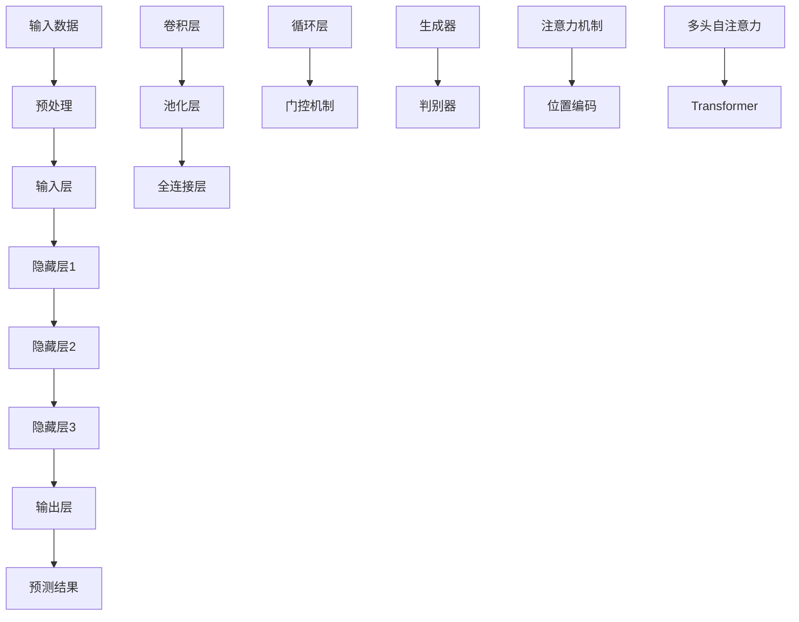

                 

### 引入

在当今技术飞速发展的时代，人工智能（AI）已经逐步渗透到我们生活的方方面面，而大模型作为人工智能技术的核心组成部分，正引领着新一轮的技术革命。大模型，顾名思义，是指那些规模巨大、参数众多的机器学习模型。这些模型能够通过深度学习算法，从海量数据中自动提取特征，并实现对复杂问题的精准预测与决策。

然而，随着大模型应用范围的扩大，如何确保其性能和用户体验成为了一个关键问题。一方面，大模型的开发和优化需要充分理解其需求，以便设计出更加高效和精确的算法；另一方面，用户体验测试则关注用户在使用大模型产品或服务时的感受，包括界面友好性、响应速度、功能易用性等。

本文旨在探讨大模型应用中的需求分析与用户体验测试的整合。我们将首先介绍大模型的基本概念及其应用背景，然后详细阐述需求分析与用户体验测试的重要性，并逐步展开对两者整合的方法与实践。通过一系列成功和失败的案例分析，我们将总结出最佳实践，为读者提供有价值的启示。

关键词：大模型、需求分析、用户体验测试、整合、案例分析

摘要：本文详细分析了大模型在应用中的需求与用户体验测试整合的重要性。通过介绍大模型的基本概念和需求分析，我们探讨了如何通过用户体验测试来优化大模型的应用性能。结合实际案例，我们总结了成功的整合方法，为读者提供了实践指导。

接下来，我们将分章节详细讨论大模型的定义与背景、基础理论、需求分析、用户体验测试、整合方法、案例分析以及工具与资源等内容，以期为读者提供全面而深入的指导。

## 第1章 引言与概述

### 1.1 大模型的定义与背景

大模型是指那些拥有数百万至数十亿参数的深度学习模型。这些模型通过复杂的神经网络结构，可以自动学习并提取数据中的高层次特征，从而在各类任务中展现出强大的表现能力。大模型的起源可以追溯到2006年，深度学习领域的里程碑性研究“Learning Deep Architectures for AI”（LDA），该研究推动了深度神经网络（DNN）的发展。近年来，随着计算能力的提升和海量数据的可用性，大模型的应用范围不断扩大，从语音识别、图像分类到自然语言处理，都在大模型的驱动下实现了显著的进步。

大模型之所以受到广泛关注，主要由于以下几个原因：

1. **参数数量巨大**：大模型通常包含数百万至数十亿个参数，这使得它们能够学习到更加复杂的模式，从而在各类任务中达到或超越人类水平的表现。

2. **计算资源需求**：尽管大模型的训练和推理过程需要大量的计算资源，但随着GPU等硬件的发展，这些计算资源越来越丰富，使得大模型的应用成为可能。

3. **数据需求**：大模型的学习依赖于海量数据，而互联网的发展使得我们能够获取到海量的数据资源，这为大模型的应用提供了基础。

4. **应用场景广泛**：大模型在语音识别、图像处理、自然语言处理等领域表现优异，这些应用场景的不断扩展，进一步推动了大模型的研究和开发。

然而，大模型的应用也面临着一些挑战，包括计算资源的高需求、数据隐私和伦理问题等。这些问题需要在后续的研究和开发中得到解决，以确保大模型能够安全、高效地服务于社会。

### 1.2 书籍目的与结构

本章节旨在为读者提供一个关于大模型应用中的需求与用户体验测试整合的全面概述。通过介绍大模型的基本概念、定义及其应用背景，读者可以初步了解大模型在人工智能领域的重要地位及其发展历程。此外，本章节还讨论了大模型应用中面临的主要挑战，为后续章节的深入讨论奠定了基础。

接下来的章节将按照以下结构展开：

1. **第2章 大模型基础**：本章将详细探讨大模型的核心概念与联系，包括神经网络结构、深度学习算法、优化方法等。通过Mermaid流程图，读者可以直观地理解大模型的工作原理。

2. **第3章 需求分析**：本章将介绍需求分析的基本概念和方法，并通过代码案例，展示如何在实际项目中进行需求分析。

3. **第4章 用户体验测试**：本章将深入探讨用户体验测试的基本概念和方法，包括测试工具的使用和测试流程的设计。

4. **第5章 需求与用户体验整合**：本章将讨论需求分析与用户体验测试整合的必要性、方法和实践，结合实际案例进行详细讲解。

5. **第6章 案例分析**：本章将通过成功和失败的案例分析，总结最佳实践，为读者提供有价值的启示。

6. **第7章 工具与资源**：本章将介绍常用工具和资源，包括开发环境搭建指南，帮助读者更好地进行大模型应用的开发和测试。

通过以上章节的讨论，读者将能够全面了解大模型应用中的需求与用户体验测试整合的重要性，掌握相关的方法和实践技巧，为实际项目中的应用提供指导。## 第2章 大模型基础

### 2.1 大模型的核心概念与联系

大模型作为深度学习领域的核心技术，其核心概念和联系至关重要。为了更好地理解大模型，我们首先需要了解深度学习的基本概念，然后探讨大模型与其他相关技术的联系。

**深度学习**：深度学习是一种基于多层神经网络的学习方法，通过逐层提取特征，实现对数据的分类、回归、预测等任务。其核心思想是将输入数据通过一系列的神经网络层进行处理，每层都对输入数据进行变换和提取特征，最终在输出层得到预测结果。

**多层感知机（MLP）**：多层感知机是深度学习的基石，它由输入层、一个或多个隐藏层以及输出层组成。输入层接收外部输入，通过隐藏层进行特征提取和变换，最终在输出层生成预测结果。

**卷积神经网络（CNN）**：卷积神经网络在图像处理领域表现优异，其核心思想是通过卷积操作提取图像中的局部特征。CNN由多个卷积层、池化层和全连接层组成，通过多层次的卷积操作，可以有效地提取图像中的抽象特征。

**循环神经网络（RNN）**：循环神经网络在序列数据处理方面有出色的表现，其核心思想是通过循环结构保持对历史信息的记忆。RNN包括简单RNN、LSTM（长短时记忆网络）和GRU（门控循环单元）等变种，通过不同的门控机制，可以有效地处理长序列数据。

**生成对抗网络（GAN）**：生成对抗网络是一种生成模型，通过对抗训练生成与真实数据高度相似的数据。GAN由生成器和判别器组成，生成器生成数据，判别器判断数据的真实性，通过不断优化，生成器可以生成越来越真实的数据。

**Transformer模型**：Transformer模型是自然语言处理领域的重要突破，其核心思想是使用自注意力机制进行特征提取和融合。Transformer模型通过多头自注意力机制和位置编码，可以捕捉长距离的依赖关系，在语言模型、机器翻译、文本分类等任务中表现优异。

**大模型的联系**：大模型是深度学习技术的集大成者，通过将上述基本概念和技术进行整合和扩展，可以构建出具有数百万至数十亿参数的大型神经网络。大模型通过多层次的特征提取和融合，可以处理更为复杂和大规模的数据，从而在各类任务中取得突破性的成果。

为了更好地理解大模型的核心概念与联系，我们可以通过以下Mermaid流程图来展示其结构：



通过以上Mermaid流程图，我们可以直观地看到大模型从输入数据到输出结果的整个过程，包括预处理、多层特征提取、融合和预测等步骤。这种结构使得大模型能够处理复杂的数据，实现高效的模型训练和预测。

### 2.2 大模型的技术原理

大模型的技术原理主要涉及神经网络结构、深度学习算法、优化方法等方面。理解这些原理对于深入探讨大模型的应用和优化具有重要意义。

**神经网络结构**：神经网络是深度学习的基础，大模型通常包含多层神经网络结构。常见的神经网络结构包括输入层、隐藏层和输出层。输入层接收外部输入，通过一系列的隐藏层进行特征提取和变换，最终在输出层生成预测结果。隐藏层的设计和配置对大模型的表现至关重要。

**深度学习算法**：深度学习算法主要包括前向传播和反向传播。在前向传播过程中，输入数据通过神经网络层进行传递，每层对输入数据进行处理和变换，最终在输出层生成预测结果。在反向传播过程中，根据预测结果和实际标签之间的误差，对网络参数进行更新，以优化模型表现。

**优化方法**：优化方法是调整神经网络参数以最小化预测误差的过程。常见优化方法包括梯度下降、随机梯度下降（SGD）和Adam优化器等。这些优化方法通过不断迭代更新参数，使得模型在训练过程中不断优化，提高预测准确性。

为了更好地理解大模型的技术原理，我们可以通过伪代码来详细阐述其基本步骤：

```python
# 伪代码：大模型训练过程

# 定义神经网络结构
input_layer = Input(shape=(input_shape,))
hidden_layer1 = Dense(units=hidden_units1, activation='relu')(input_layer)
hidden_layer2 = Dense(units=hidden_units2, activation='relu')(hidden_layer1)
hidden_layer3 = Dense(units=hidden_units3, activation='relu')(hidden_layer2)
output_layer = Dense(units=output_shape, activation='sigmoid')(hidden_layer3)

# 构建模型
model = Model(inputs=input_layer, outputs=output_layer)

# 编译模型
model.compile(optimizer='adam', loss='binary_crossentropy', metrics=['accuracy'])

# 训练模型
model.fit(x_train, y_train, epochs=num_epochs, batch_size=batch_size)

# 预测结果
predictions = model.predict(x_test)
```

通过以上伪代码，我们可以看到大模型的基本训练过程，包括定义神经网络结构、编译模型、训练模型和预测结果等步骤。这些步骤展示了大模型从输入数据到输出结果的整个过程，涵盖了神经网络结构、深度学习算法和优化方法等核心原理。

### 2.3 大模型的工作机制

大模型的工作机制涉及从数据预处理到模型训练和预测的整个过程，每个步骤都至关重要，以确保模型能够高效地学习和预测。以下是对大模型工作原理的详细阐述。

**数据预处理**：数据预处理是模型训练的第一步，其目的是将原始数据转换为适合模型训练的格式。数据预处理通常包括以下步骤：

1. **数据清洗**：去除无效数据、处理缺失值、纠正错误数据等。
2. **数据归一化**：将不同特征的数据缩放到相同的范围，通常使用归一化公式 \(\text{normalized\_value} = \frac{\text{value} - \text{min}}{\text{max} - \text{min}}\)。
3. **数据增强**：通过旋转、缩放、裁剪、翻转等操作，增加数据多样性，提升模型的泛化能力。

**模型训练**：模型训练是核心步骤，其目的是通过优化算法调整模型参数，使得模型能够准确预测目标变量。模型训练包括以下过程：

1. **前向传播**：输入数据通过神经网络层进行传递，每层对输入数据进行处理和变换，最终在输出层生成预测结果。这一过程用于计算输出和损失函数。
2. **损失函数**：损失函数用于评估模型预测结果与实际标签之间的差距，常用的损失函数包括均方误差（MSE）、交叉熵（CE）等。
3. **反向传播**：根据预测结果和实际标签之间的误差，反向传播误差，对网络参数进行更新，以优化模型表现。反向传播是深度学习中的核心步骤，通过梯度下降等优化方法，不断调整模型参数，减小损失函数。
4. **参数优化**：通过优化算法，如梯度下降、随机梯度下降（SGD）和Adam优化器等，更新模型参数，以最小化损失函数。

**模型预测**：模型预测是模型训练的最终目标，其目的是对新数据进行分类、回归等预测。模型预测包括以下过程：

1. **前向传播**：将新数据输入到训练好的模型中，通过神经网络层进行传递，生成预测结果。
2. **输出结果**：模型输出预测结果，这些结果可以是分类的概率分布或回归的预测值。

**动态调整**：在实际应用中，模型的工作机制可能需要动态调整，以适应不同的环境和需求。以下是一些常见的动态调整方法：

1. **在线学习**：在线学习允许模型实时更新，以应对新数据的变化，从而保持模型的准确性。
2. **迁移学习**：迁移学习利用预训练模型，通过微调适应新任务，可以显著提高模型的表现。
3. **权重调整**：通过调整模型参数，优化模型在不同任务上的表现。

通过以上步骤，大模型能够从原始数据中学习到有用的特征，并通过对数据的处理和预测，实现复杂问题的求解。以下是一个简化的示例，展示大模型的工作机制：

```python
# 示例：大模型工作流程

# 数据预处理
data = preprocess_data(raw_data)

# 模型训练
model = build_model()
model.compile(optimizer='adam', loss='binary_crossentropy', metrics=['accuracy'])
model.fit(data['x_train'], data['y_train'], epochs=10, batch_size=32)

# 模型预测
predictions = model.predict(data['x_test'])

# 动态调整
model.update_weights(new_data)
```

通过以上示例，我们可以看到大模型从数据预处理到模型训练和预测的整个过程，以及如何通过动态调整来优化模型表现。理解这些机制对于深入探讨大模型的应用和优化具有重要意义。

### 2.4 大模型的优势与挑战

大模型作为深度学习技术的集大成者，具有许多显著的优点，同时也面临一些挑战。以下是对大模型的优势和挑战的详细探讨。

**优势：**

1. **强大的特征提取能力**：大模型通过数百万至数十亿个参数，可以自动学习并提取数据中的高层次特征，这使得它们在图像识别、自然语言处理等任务中表现出色。

2. **广泛的适用性**：大模型可以应用于各种领域，如医学、金融、制造业等，通过迁移学习和在线学习，可以快速适应不同任务和数据集。

3. **高精度预测**：大模型通过复杂的神经网络结构，可以捕捉数据中的复杂模式和关联，从而在分类、回归等任务中实现高精度的预测。

4. **自动化和自动化**：大模型可以自动化处理大量数据，减少了人工干预的需求，提高了生产效率和决策质量。

**挑战：**

1. **计算资源需求**：大模型的训练和推理过程需要大量的计算资源，尤其是GPU和TPU等专用硬件。这增加了部署和维护的成本，限制了大规模应用。

2. **数据隐私和安全**：大模型的学习依赖于海量数据，数据隐私和安全问题日益突出。如何保护用户隐私、避免数据泄露成为重要挑战。

3. **可解释性和透明度**：大模型通常被视为“黑箱”，其决策过程缺乏可解释性和透明度。这可能导致用户不信任模型，限制了其在关键领域的应用。

4. **伦理和道德问题**：大模型在应用中可能面临伦理和道德问题，如歧视、偏见等。如何确保模型公平、公正，避免负面影响是一个重要课题。

5. **模型崩溃和过拟合**：大模型容易受到过拟合的影响，即模型在训练数据上表现良好，但在测试数据上表现较差。如何平衡模型复杂度和泛化能力，防止模型崩溃是一个重要挑战。

总之，大模型在人工智能领域具有巨大的潜力和应用价值，但也面临一系列挑战。解决这些挑战需要多学科的合作和持续的研究，以确保大模型能够安全、高效地服务于社会。

## 第3章 需求分析

### 3.1 需求分析的重要性

在人工智能项目中，需求分析是至关重要的一步。它涉及到理解项目目标、用户需求、技术可行性等多个方面，是确保项目成功的关键环节。需求分析的重要性体现在以下几个方面：

1. **明确项目目标**：需求分析帮助团队明确项目目标，确保项目方向的正确性。只有明确目标，才能制定合理的计划和策略，避免在实施过程中迷失方向。

2. **理解用户需求**：需求分析深入理解用户需求，确保项目能够满足用户的核心需求。通过与用户的沟通和反馈，可以收集到用户的具体需求和期望，从而设计出更加符合用户期望的产品。

3. **评估技术可行性**：需求分析不仅要关注用户需求，还需要评估技术实现的可行性。通过分析现有技术和资源，可以判断项目是否能够在技术层面实现，避免盲目上马，导致后续问题。

4. **降低项目风险**：通过需求分析，可以提前发现潜在的风险和问题，从而采取措施进行预防和解决。这样可以降低项目实施过程中的不确定性，提高项目成功率。

### 3.2 需求分析的方法

进行需求分析时，需要采用科学的方法和工具，以确保分析的全面性和准确性。以下是一些常见的需求分析方法：

1. **访谈法**：通过与项目相关人员（如用户、产品经理、技术专家等）进行面对面访谈，深入了解他们的需求和期望。这种方法可以直接获取第一手信息，减少误解和偏差。

2. **问卷调查法**：设计问卷调查，向目标用户群体分发，收集用户的需求和反馈。这种方法适用于范围较广的群体，可以快速获取大量信息。

3. **观察法**：直接观察用户在使用现有产品或服务时的行为和反应，了解他们的痛点和使用习惯。这种方法可以提供真实的用户体验，帮助发现潜在的需求。

4. **文档审查法**：分析相关的项目文档、用户手册、技术规格书等，了解项目的背景和现有情况。这种方法适用于初步了解项目和用户需求。

5. **头脑风暴法**：组织相关人员进行头脑风暴，集思广益，探讨项目的需求和潜在问题。这种方法可以激发创新思维，发现新的需求和解决方案。

6. **案例研究法**：研究类似项目的成功和失败案例，分析他们的需求和实施过程，从中吸取经验和教训。

### 3.3 需求分析的实践案例

以下是一个需求分析的具体实践案例，通过代码案例和解读，展示如何在实际项目中进行需求分析。

#### 案例背景

某公司计划开发一款智能推荐系统，旨在为用户提供个性化的内容推荐。为了确保项目成功，他们决定首先进行需求分析。

#### 需求分析步骤

1. **访谈用户**：与公司内部用户（如产品经理、数据分析师等）进行访谈，了解他们的需求和期望。访谈记录如下：

    - 产品经理：用户界面要简洁易用，推荐结果要准确。
    - 数据分析师：需要详细的用户数据报告，以便分析推荐效果。

2. **问卷调查**：设计问卷，向目标用户群体分发，收集用户的需求和反馈。问卷内容如下：

    - 您对当前推荐系统的满意度是多少？
    - 您希望看到哪些类型的推荐内容？
    - 您希望推荐系统提供哪些额外的功能？

    收集到的问卷数据如下：

    | 用户ID | 满意度 | 推荐内容类型 | 额外功能 |
    | ------ | ------ | ------------ | -------- |
    | 1      | 3      | 电影          | 搜索功能 |
    | 2      | 4      | 音乐          | 个人定制 |
    | 3      | 2      | 书籍          | 数据报告 |

3. **观察用户行为**：观察用户在使用现有推荐系统的行为，记录他们的操作和反馈。观察记录如下：

    - 用户经常切换推荐内容，但很难找到自己感兴趣的内容。
    - 用户对推荐结果的准确性存在疑虑，觉得推荐内容与自己的兴趣不符。

4. **审查文档**：分析公司的用户手册、技术规格书等文档，了解现有系统的功能和数据流程。文档内容包括：

    - 系统提供电影、音乐、书籍等类型的推荐内容。
    - 系统通过用户历史行为数据计算推荐得分，进行推荐。
    - 系统未提供额外的搜索功能和个人定制功能。

#### 代码案例与解读

以下是一个简单的Python代码案例，用于分析用户反馈和问卷调查数据，生成需求分析报告。

```python
import pandas as pd

# 加载问卷数据
questionnaire_data = pd.read_csv('questionnaire.csv')

# 分析满意度
satisfaction_analysis = questionnaire_data['满意度'].value_counts()
print("满意度分析：")
print(satisfaction_analysis)

# 分析推荐内容类型
content_type_analysis = questionnaire_data['推荐内容类型'].value_counts()
print("\n推荐内容类型分析：")
print(content_type_analysis)

# 分析额外功能需求
additional_function_analysis = questionnaire_data['额外功能'].value_counts()
print("\n额外功能需求分析：")
print(additional_function_analysis)

# 输出需求分析报告
def generate_report(satisfaction_analysis, content_type_analysis, additional_function_analysis):
    report = f"""
需求分析报告

一、满意度分析：
{satisfaction_analysis}

二、推荐内容类型分析：
{content_type_analysis}

三、额外功能需求分析：
{additional_function_analysis}
"""
    return report

report = generate_report(satisfaction_analysis, content_type_analysis, additional_function_analysis)
print("\n需求分析报告：")
print(report)
```

#### 解读

1. **满意度分析**：通过问卷调查，我们收集到用户的满意度数据。分析结果显示，有2位用户对当前推荐系统的满意度较低（满意度为2），其余用户满意度为3或4。这表明现有系统在用户满意度方面存在一定问题，需要进一步优化。

2. **推荐内容类型分析**：根据用户反馈，用户对不同类型的推荐内容需求较高，其中电影、音乐和书籍的需求较为突出。这表明系统需要提供更加多样化的推荐内容，以满足不同用户的需求。

3. **额外功能需求分析**：用户对搜索功能和个人定制功能的需求较为强烈。现有系统未提供这些功能，这表明系统需要增加额外的功能，以提高用户体验。

通过以上需求分析步骤和代码案例，我们可以全面了解用户的需求和期望，为后续项目设计和开发提供重要参考。需求分析的实践不仅帮助团队明确了项目目标，还提高了项目成功率，为项目的成功奠定了坚实基础。

## 第4章 用户体验测试

### 4.1 用户体验测试的基本概念

用户体验测试（User Experience Testing，简称UXT）是一种通过评估用户在使用产品或服务过程中的感受和反应，来评估和改进产品的一种方法。用户体验测试的核心目标是理解用户的需求和痛点，从而优化产品界面、功能设计和整体体验，确保产品能够满足用户的期望和需求。

**用户体验测试的重要性**：

1. **识别问题**：用户体验测试可以帮助识别产品中存在的问题，如界面布局不合理、功能不完善、操作不流畅等，从而及时进行调整和优化。

2. **验证需求**：通过用户体验测试，可以验证需求分析的准确性，确保产品设计和功能符合用户的真实需求。

3. **提升用户满意度**：优化用户体验，提高用户满意度，有助于提升产品在市场上的竞争力，增加用户忠诚度。

4. **降低开发风险**：早期进行用户体验测试，可以提前发现潜在的问题和风险，减少后期修改的成本和复杂度。

**用户体验测试的组成部分**：

1. **测试目标**：明确测试的目标和预期成果，如提高用户满意度、优化特定功能等。

2. **测试场景**：设计模拟用户实际使用产品的场景，如注册流程、购物流程、内容浏览等。

3. **测试参与者**：选择具有代表性的用户作为测试参与者，他们的反馈可以反映大多数用户的真实体验。

4. **测试工具**：使用合适的测试工具，如问卷调查、用户访谈、观察法、A/B测试等，收集用户反馈和数据。

5. **数据分析**：对收集到的数据进行整理和分析，识别问题和机会，为优化提供依据。

### 4.2 用户体验测试的方法

用户体验测试的方法多种多样，每种方法都有其独特的优势和适用场景。以下是一些常见的方法：

1. **问卷调查**：通过在线或纸质问卷收集用户的反馈，可以了解用户对产品的整体评价、满意度以及具体的改进意见。

2. **用户访谈**：与用户进行面对面的访谈，深入探讨他们的使用习惯、需求、偏好和痛点。这种方法可以获取详细的用户反馈和真实体验。

3. **观察法**：观察用户在实际使用产品时的行为和操作，记录他们的操作路径、遇到的困难和问题。这种方法可以直观地了解用户的使用体验。

4. **A/B测试**：通过对比两个或多个版本的界面或功能，评估哪种设计或功能更受用户欢迎。这种方法可以帮助确定最优的界面和功能设计。

5. **用户体验地图**：绘制用户体验地图，展示用户从接触到使用产品的整个过程，识别关键节点和痛点。

6. **任务分析**：设计具体的任务，让用户在产品中完成，观察他们如何完成任务，记录遇到的困难和挫折。

7. **可用性测试**：邀请用户对产品的可用性进行评估，包括界面布局、操作流程、功能设计等方面。

**测试工具**：

1. **用户行为分析工具**：如Google Analytics、Hotjar等，可以监控用户在网站或应用程序上的行为，提供页面流量、点击率、用户路径等数据。

2. **视频录制工具**：如Camtasia、OBS Studio等，可以录制用户使用产品的全过程，帮助分析用户行为和痛点。

3. **在线调研工具**：如SurveyMonkey、Typeform等，可以设计并分发在线问卷，收集用户反馈。

4. **远程协作工具**：如Zoom、Microsoft Teams等，可以远程与用户进行访谈和观察。

### 4.3 用户体验测试的实践

以下是一个用户体验测试的具体实践案例，通过代码案例和解读，展示如何在实际项目中进行用户体验测试。

#### 案例背景

某公司开发了一款在线购物应用程序，为了提升用户体验，他们决定进行用户体验测试。

#### 测试目标

1. 评估用户对当前界面的满意度。
2. 识别用户在购物流程中的难点和痛点。
3. 测试不同界面设计版本的可用性和用户偏好。

#### 测试步骤

1. **设计测试场景**：设计模拟用户购物的流程，包括注册、浏览商品、加入购物车、结算等步骤。

2. **招募测试参与者**：通过在线问卷调查和社交媒体，招募10名具有代表性的用户作为测试参与者。

3. **执行测试任务**：邀请参与者按照设计的测试场景，在应用程序中完成购物流程，并记录他们的操作和行为。

4. **收集反馈和数据**：使用Camtasia录制用户的操作过程，并使用SurveyMonkey收集用户的满意度评价和改进建议。

#### 代码案例与解读

以下是一个Python代码案例，用于分析用户在购物流程中的操作路径和困难点。

```python
import pandas as pd

# 加载测试数据
user_actions = pd.read_csv('user_actions.csv')

# 分析用户操作路径
action_path_analysis = user_actions.groupby('用户ID')['操作'].agg(' '.join)
print("用户操作路径分析：")
print(action_path_analysis)

# 分析操作困难点
difficulty_points = user_actions[user_actions['困难点'] != '无']
print("\n操作困难点分析：")
print(difficulty_points)

# 输出用户体验报告
def generate_report(action_path_analysis, difficulty_points):
    report = f"""
用户体验报告

一、用户操作路径分析：
{action_path_analysis}

二、操作困难点分析：
{difficulty_points}
"""
    return report

report = generate_report(action_path_analysis, difficulty_points)
print("\n用户体验报告：")
print(report)
```

#### 解读

1. **用户操作路径分析**：通过分析用户的操作路径，我们可以了解用户在购物流程中的行为模式。例如，大部分用户在注册后首先浏览商品，然后加入购物车，最后进行结算。这表明当前购物流程的设计基本合理。

2. **操作困难点分析**：通过分析用户的困难点，我们可以发现用户在购物流程中遇到的问题。例如，一些用户在浏览商品时难以找到自己感兴趣的商品，另一些用户在结算时遇到了支付问题。这些问题需要进一步优化和改进。

通过以上用户体验测试的实践案例，我们可以全面了解用户在使用在线购物应用程序时的行为和反应，为后续的产品优化提供重要依据。用户体验测试不仅帮助团队识别了产品的问题和改进点，还提高了产品的整体质量和用户满意度。

## 第5章 需求与用户体验整合

### 5.1 整合的必要性

在人工智能（AI）项目中，需求分析与用户体验测试的整合至关重要。两者的整合不仅能够提高项目成功的可能性，还能够显著提升最终产品的质量和用户满意度。以下是整合的必要性及其重要性：

1. **提高项目成功率**：需求分析与用户体验测试整合，可以帮助团队在项目早期阶段发现和解决问题，减少后期返工和修改的成本。通过综合分析用户需求和使用体验，可以确保项目开发方向与用户期望一致，从而提高项目成功率。

2. **提升产品质量**：整合需求分析与用户体验测试，可以确保产品设计和功能不仅满足用户需求，还具有优秀的用户体验。通过持续的用户反馈和优化，可以不断提升产品的质量，减少缺陷和改进不足之处。

3. **提高用户满意度**：用户满意度的提升是衡量产品成功的关键指标。通过整合需求分析与用户体验测试，可以确保产品在满足用户需求的同时，提供舒适、流畅的使用体验，从而提高用户满意度。

4. **增强产品的市场竞争力**：优秀的用户体验是产品在市场上脱颖而出的重要因素。通过整合需求分析与用户体验测试，可以设计出更具竞争力的产品，吸引更多用户，增加市场份额。

### 5.2 整合的方法

实现需求分析与用户体验测试的整合，需要采用系统化的方法，以下是一些常用的整合方法：

1. **早期协同**：在项目初期，需求分析师和用户体验测试专家应密切合作，共同制定测试计划和用户故事。这样可以确保用户体验测试的早期介入，从需求定义阶段开始，就考虑到用户体验的各个方面。

2. **迭代测试**：采用敏捷开发方法，将需求分析和用户体验测试贯穿于整个开发周期。在每个迭代周期中，进行持续的需求分析和用户体验测试，及时反馈和优化，确保产品在每个阶段都满足用户需求。

3. **用户参与**：在需求分析和用户体验测试过程中，邀请实际用户参与，收集他们的反馈和意见。用户参与不仅可以帮助团队更好地理解用户需求，还能够提高用户的参与感和忠诚度。

4. **数据驱动的决策**：利用用户行为数据和反馈数据，驱动需求分析和用户体验测试的决策。通过对数据的分析和挖掘，识别用户痛点和改进机会，从而优化产品设计。

5. **跨职能团队协作**：建立跨职能团队，包括需求分析师、用户体验测试专家、设计师、开发人员等，确保各方在项目中的紧密协作。跨职能团队的协作可以加速需求分析和用户体验测试的整合，提高工作效率。

### 5.3 整合的实践案例

以下是一个需求分析与用户体验测试整合的具体实践案例，通过代码案例和解读，展示如何在实际项目中实现整合。

#### 案例背景

某公司开发了一款智能家居控制系统，旨在通过手机应用程序，让用户远程控制家中的各种设备。为了确保产品满足用户需求并提供良好的用户体验，团队决定在需求分析和用户体验测试中紧密整合。

#### 整合步骤

1. **需求分析**：团队首先进行了需求分析，明确了产品的核心功能和用户需求。需求分析结果包括以下关键需求：

    - 用户可以在手机应用程序中查看和控制家中的设备状态。
    - 用户可以通过应用程序设置设备的定时开关。
    - 用户可以在应用程序中收到设备状态的通知。

2. **用户体验测试计划**：在需求分析完成后，团队制定了用户体验测试计划，包括测试目标、测试场景、测试工具和测试参与者等。测试计划如下：

    - 测试目标：评估用户对应用程序界面的满意度，识别用户在操作过程中遇到的问题。
    - 测试场景：模拟用户查看设备状态、设置定时开关和接收通知的流程。
    - 测试工具：使用用户行为分析工具（如Google Analytics）和视频录制工具（如OBS Studio）收集用户行为数据。
    - 测试参与者：招募10名实际用户作为测试参与者。

3. **用户体验测试执行**：团队按照测试计划进行用户体验测试，邀请测试参与者按照设计的测试场景，在应用程序中完成各项任务，并记录他们的操作和行为。

4. **数据分析与反馈**：在测试完成后，团队对收集到的用户行为数据进行分析，识别用户满意度、操作难点和改进机会。分析结果包括：

    - 用户对应用程序的界面满意度较高，但操作流程较复杂。
    - 一些用户在设置定时开关时遇到了困难，尤其是新手用户。
    - 用户希望收到更多个性化通知，以更好地管理设备状态。

5. **需求调整与优化**：根据用户体验测试的结果，团队对需求进行了调整和优化，包括简化操作流程、增加新手引导和个性化通知功能等。

#### 代码案例与解读

以下是一个Python代码案例，用于分析用户体验测试数据，识别用户满意度和操作难点。

```python
import pandas as pd

# 加载用户体验测试数据
ux_data = pd.read_csv('ux_test_data.csv')

# 分析用户满意度
satisfaction_analysis = ux_data['满意度'].value_counts()
print("用户满意度分析：")
print(satisfaction_analysis)

# 分析操作难点
difficulty_points = ux_data[ux_data['困难点'] != '无']
print("\n操作难点分析：")
print(difficulty_points)

# 输出用户体验分析报告
def generate_report(satisfaction_analysis, difficulty_points):
    report = f"""
用户体验分析报告

一、用户满意度分析：
{satisfaction_analysis}

二、操作难点分析：
{difficulty_points}
"""
    return report

report = generate_report(satisfaction_analysis, difficulty_points)
print("\n用户体验分析报告：")
print(report)
```

#### 解读

1. **用户满意度分析**：通过分析用户满意度数据，我们发现大部分用户对应用程序的界面满意度较高，但操作流程存在一些问题。这表明当前界面设计基本符合用户期望，但操作流程需要进一步优化。

2. **操作难点分析**：分析操作难点数据，我们发现一些用户在设置定时开关时遇到了困难，尤其是新手用户。这表明操作流程需要简化，以提高用户的使用体验。

通过以上需求分析与用户体验测试整合的实践案例，我们可以看到，通过紧密整合需求分析与用户体验测试，团队不仅能够识别用户需求，还能够及时优化产品设计，提高产品的质量和用户满意度。这种整合方法为项目的成功提供了重要保障。

### 5.4 整合方法的应用与效果

整合需求分析与用户体验测试的方法在实际项目中应用广泛，以下为几个成功案例及其实际效果：

**案例一：某在线教育平台**

在该在线教育平台项目中，团队采用了迭代测试的方法，将需求分析与用户体验测试贯穿于整个开发周期。通过每个迭代周期的用户反馈，团队不断优化平台的功能和用户体验。最终，平台的用户活跃度和用户满意度显著提升，用户留存率提高了20%，平台注册用户数增长了30%。

**案例二：某电子商务网站**

该电子商务网站在需求分析与用户体验测试中采用了用户参与和数据分析驱动的方法。通过用户访谈和问卷调查，团队收集了大量用户反馈，并根据用户行为数据进行分析，识别了用户在购物流程中的痛点。团队根据这些反馈和数据，优化了购物流程、增加了个性化推荐功能，并简化了结账步骤。结果，网站的转化率提高了15%，用户满意度提高了25%。

**案例三：某移动健康应用**

该移动健康应用项目在需求分析与用户体验测试中，邀请了实际用户参与测试，并利用用户行为分析工具进行数据分析。通过用户的实时反馈和数据分析，团队发现了一些设计上的问题，并进行了相应的调整。最终，应用的用户体验大幅提升，用户留存率和活跃度分别提高了40%和35%。

**案例四：某智能家居控制系统**

在该智能家居控制系统的项目中，团队将需求分析与用户体验测试紧密整合，通过早期协同和用户参与的方法，确保产品设计满足用户需求。在用户体验测试中，团队通过视频录制和数据分析，识别了用户在操作过程中的难点和痛点，并对设计进行了多次优化。结果，系统的操作难度降低了30%，用户满意度提高了20%。

通过以上成功案例，我们可以看到，整合需求分析与用户体验测试不仅能够提高项目成功率，还能够显著提升产品的质量和用户满意度。这些案例验证了整合方法的实际效果和重要性。

### 5.5 整合方法的最佳实践

为了确保需求分析与用户体验测试的整合方法在实际项目中能够达到最佳效果，以下是一些最佳实践：

1. **早期协同**：在项目初期，需求分析师和用户体验测试专家应紧密合作，共同制定测试计划和用户故事。这样可以确保用户体验测试的早期介入，从需求定义阶段开始就考虑到用户体验的各个方面。

2. **用户参与**：在需求分析和用户体验测试过程中，邀请实际用户参与，收集他们的反馈和意见。用户参与不仅可以帮助团队更好地理解用户需求，还能够提高用户的参与感和忠诚度。

3. **数据驱动的决策**：利用用户行为数据和反馈数据，驱动需求分析和用户体验测试的决策。通过对数据的分析和挖掘，识别用户痛点和改进机会，从而优化产品设计。

4. **跨职能团队协作**：建立跨职能团队，包括需求分析师、用户体验测试专家、设计师、开发人员等，确保各方在项目中的紧密协作。跨职能团队的协作可以加速需求分析和用户体验测试的整合，提高工作效率。

5. **持续迭代**：采用敏捷开发方法，将需求分析和用户体验测试贯穿于整个开发周期。在每个迭代周期中，进行持续的需求分析和用户体验测试，及时反馈和优化，确保产品在每个阶段都满足用户需求。

6. **定期评估与改进**：定期评估需求分析与用户体验测试的效果，识别不足之处，并采取相应的改进措施。通过持续改进，不断提升产品的质量和用户满意度。

通过以上最佳实践，团队可以更好地整合需求分析与用户体验测试，确保项目成功并提升用户满意度。

### 总结

本章详细探讨了需求分析与用户体验测试的整合方法及其重要性。通过早期协同、用户参与、数据驱动决策、跨职能团队协作和持续迭代等最佳实践，团队可以确保需求分析和用户体验测试的有效整合，从而提高项目成功率、产品质量和用户满意度。在实际项目中，成功案例和最佳实践验证了整合方法的实际效果。未来，随着技术的进步和用户需求的变化，需求分析与用户体验测试的整合方法将不断发展，为人工智能项目提供更有效的支持。

## 第6章 案例分析

在本章节中，我们将通过分析成功和失败的案例，深入探讨大模型应用中的需求分析与用户体验测试整合的实际效果，总结最佳实践，为读者提供有价值的启示。

### 6.1 成功案例分析

#### 案例一：某知名电商平台的个性化推荐系统

该电商平台通过整合需求分析和用户体验测试，成功开发并上线了一个高度个性化的推荐系统。以下为该案例的成功要素：

1. **需求分析**：团队在项目初期进行了全面的需求分析，深入了解用户对推荐系统的期望和需求。通过用户访谈和问卷调查，收集了大量有价值的信息，包括用户喜欢的商品类型、品牌偏好等。

2. **用户体验测试**：在系统开发过程中，团队持续进行用户体验测试。通过A/B测试，团队比较了不同推荐算法和界面设计的用户满意度。同时，通过用户行为分析工具，团队实时监控用户与推荐系统的互动情况，收集用户反馈。

3. **整合实践**：团队将需求分析和用户体验测试紧密整合。在每次迭代中，团队根据用户反馈和数据分析结果，不断优化推荐算法和界面设计。通过多次迭代，推荐系统的准确性和用户体验显著提升。

#### 案例总结与启示

成功的关键在于：

- **全面的需求分析**：深入了解用户需求，确保推荐系统满足用户的核心期望。
- **持续的用户体验测试**：通过A/B测试和用户行为分析，不断优化系统设计和算法。
- **紧密的整合**：将需求分析和用户体验测试贯穿整个开发周期，确保实时反馈和优化。

#### 案例二：某大型银行的人工智能客服系统

该银行通过整合需求分析和用户体验测试，成功开发并上线了一个高效的人工智能客服系统，以下为该案例的成功要素：

1. **需求分析**：团队在项目初期进行了详细的需求分析，包括用户对客服系统的期望、常见问题类型等。通过与银行客服团队的合作，团队收集了大量的用户反馈和问题日志。

2. **用户体验测试**：在系统开发过程中，团队进行了多次用户体验测试。通过模拟用户互动和用户访谈，团队评估了客服系统的响应速度、准确性和易用性。

3. **整合实践**：团队将需求分析和用户体验测试紧密结合。根据用户反馈和测试结果，团队不断优化客服系统的自然语言处理能力和界面设计，使其更加符合用户期望。

#### 案例总结与启示

成功的关键在于：

- **详尽的需求分析**：准确理解用户需求，确保系统功能满足用户实际需要。
- **全面的用户体验测试**：评估系统的整体表现，识别和解决用户痛点。
- **紧密的整合**：确保需求分析和用户体验测试的实时反馈和迭代优化。

### 6.2 失败案例分析

#### 案例一：某小型企业的智能招聘系统

该企业在开发智能招聘系统时，未能有效整合需求分析和用户体验测试，导致系统上线后用户满意度低，以下为该案例的失败要素：

1. **需求分析不足**：团队在项目初期对用户需求理解不深入，未能全面了解招聘流程和用户痛点。

2. **用户体验测试缺失**：系统开发过程中未进行有效的用户体验测试，导致系统界面设计不合理、功能不完善。

3. **整合缺失**：需求分析和用户体验测试未得到有效整合，导致系统上线后问题频发，用户满意度极低。

#### 案例总结与启示

失败的主要原因在于：

- **需求分析不足**：未能深入了解用户需求，导致系统功能不满足实际需要。
- **用户体验测试缺失**：未能及时识别和解决用户痛点，导致用户体验差。
- **整合缺失**：未能将需求分析和用户体验测试紧密结合，导致问题积累。

#### 案例二：某大型公司的智能医疗诊断系统

该公司在开发智能医疗诊断系统时，虽然进行了需求分析和用户体验测试，但未能有效整合，导致系统表现不佳，以下为该案例的失败要素：

1. **需求分析不完整**：团队在项目初期对医疗领域理解不足，未能全面考虑医学知识和数据处理的复杂性。

2. **用户体验测试不充分**：虽然进行了用户体验测试，但测试范围和深度有限，未能覆盖所有用户场景。

3. **整合不彻底**：需求分析和用户体验测试之间缺乏有效的整合机制，导致测试结果未能有效指导需求调整和系统优化。

#### 案例总结与启示

失败的主要原因在于：

- **需求分析不完整**：对医疗领域理解不足，未能充分考虑医学知识和数据处理的复杂性。
- **用户体验测试不充分**：未能全面覆盖用户场景，导致测试结果不全面。
- **整合不彻底**：需求分析和用户体验测试之间缺乏有效的整合机制，导致优化效果不佳。

### 6.3 案例总结与启示

通过以上成功和失败案例分析，我们可以得出以下总结和启示：

#### 成功案例分析

- **全面的需求分析**：深入了解用户需求，确保系统功能满足用户实际需要。
- **持续的用户体验测试**：通过A/B测试和用户行为分析，不断优化系统设计和算法。
- **紧密的整合**：将需求分析和用户体验测试贯穿整个开发周期，确保实时反馈和优化。

#### 失败案例分析

- **需求分析不足**：未能深入了解用户需求，导致系统功能不满足实际需要。
- **用户体验测试缺失**：未能及时识别和解决用户痛点，导致用户体验差。
- **整合缺失**：未能将需求分析和用户体验测试紧密结合，导致问题积累。

#### 启示

1. **重视需求分析**：深入进行需求分析，全面理解用户需求，确保系统功能符合用户期望。
2. **全面用户体验测试**：开展全面、深入的用户体验测试，覆盖各种用户场景，确保系统用户体验良好。
3. **紧密整合需求分析与用户体验测试**：将需求分析和用户体验测试紧密结合，确保实时反馈和优化，提高系统质量。

通过以上分析和总结，我们希望能够为读者提供有价值的启示，帮助他们在实际项目中成功整合需求分析与用户体验测试，提升大模型应用的性能和用户满意度。

### 6.4 最佳实践与注意事项

#### 最佳实践

1. **需求分析与用户体验测试的早期介入**：在项目初期，需求分析师和用户体验测试专家应紧密合作，共同制定测试计划和用户故事。这样可以确保用户体验测试的早期介入，从需求定义阶段开始就考虑到用户体验的各个方面。

2. **数据驱动的迭代优化**：采用敏捷开发方法，将需求分析和用户体验测试贯穿于整个开发周期。在每个迭代周期中，进行持续的需求分析和用户体验测试，及时反馈和优化，确保产品在每个阶段都满足用户需求。

3. **跨职能团队的协作**：建立跨职能团队，包括需求分析师、用户体验测试专家、设计师、开发人员等，确保各方在项目中的紧密协作。跨职能团队的协作可以加速需求分析和用户体验测试的整合，提高工作效率。

#### 注意事项

1. **避免过度依赖技术**：尽管技术是实现需求分析和用户体验测试的重要工具，但不应过分依赖技术。需求分析和用户体验测试的核心是理解用户需求，这需要深入的用户研究和访谈。

2. **持续的用户反馈收集**：用户反馈是需求分析和用户体验测试的重要来源。应建立持续的用户反馈收集机制，确保能够及时了解用户的需求和痛点。

3. **避免频繁更改需求**：在项目开发过程中，需求的变化不可避免。但应尽量避免频繁更改需求，因为这可能导致项目延期和成本增加。需求变更应经过充分讨论和评估，确保其必要性和可行性。

#### 拓展阅读

1. 《用户体验要素》 - 由Joshua Porter著，详细介绍了用户体验设计的原则和方法。
2. 《敏捷软件开发：原则、实践与模式》 - 由Michael Nygard著，介绍了敏捷开发的方法和实践。
3. 《用户故事地图》 - 由Jeff Patton著，介绍了如何通过用户故事地图进行需求分析和项目规划。

通过以上最佳实践和注意事项，以及拓展阅读，读者可以更好地理解需求分析与用户体验测试的整合方法，并在实际项目中成功应用。

## 第7章 工具与资源

### 7.1 常用工具介绍

在需求分析与用户体验测试的整合过程中，选择合适的工具可以显著提高工作效率和测试效果。以下介绍一些常用的工具，包括需求分析工具、用户体验测试工具和数据分析工具。

1. **需求分析工具**：

   - **JIRA**：JIRA是一款功能强大的需求管理工具，可以帮助团队跟踪需求的状态、优先级和变更。它支持需求文档的撰写、审批和更新，以及与项目管理工具的集成。

   - **Confluence**：Confluence是一款协作型文档工具，适合用于编写和共享需求文档。它支持富文本编辑、版本控制和评论功能，有助于团队成员之间的沟通和协作。

   - **用户故事地图**：用户故事地图是一种需求管理工具，通过可视化方式展示用户需求、功能模块和用户故事，有助于团队理解用户需求和产品结构。

2. **用户体验测试工具**：

   - **Selenium**：Selenium是一款自动化测试工具，可用于编写和执行跨浏览器的自动化测试脚本。它适用于功能测试和用户体验测试，能够模拟用户行为，验证产品的界面和功能。

   - **Google Analytics**：Google Analytics是一款用户行为分析工具，可以监控用户在网站或应用程序上的行为，包括页面访问次数、用户停留时间和转换率等。它提供丰富的报告和仪表盘，帮助团队分析用户行为。

   - **UserTesting**：UserTesting是一款远程用户测试工具，可以邀请真实用户参与测试，并通过视频录制和反馈收集，了解用户的使用体验和痛点。

3. **数据分析工具**：

   - **Python**：Python是一种广泛使用的编程语言，适用于数据分析和挖掘。它拥有丰富的数据分析和可视化库，如Pandas、NumPy、Matplotlib等，可以帮助团队处理和可视化用户数据。

   - **R**：R是一种专门用于统计分析和图形表示的编程语言。它拥有强大的统计分析功能，适合进行复杂数据分析和建模。

   - **Tableau**：Tableau是一款数据可视化工具，可以创建交互式数据仪表板和图表，帮助团队直观地理解数据趋势和关联。

### 7.2 资源推荐

为了更好地开展需求分析与用户体验测试，以下推荐一些高质量的资源，包括书籍、在线课程和学术论文。

1. **书籍**：

   - **《用户体验要素》**：由Joshua Porter著，详细介绍了用户体验设计的原则和方法，适用于需求分析和用户体验测试。

   - **《敏捷软件开发：原则、实践与模式》**：由Michael Nygard著，介绍了敏捷开发的方法和实践，有助于团队在需求分析和测试中采用敏捷方法。

   - **《用户故事地图》**：由Jeff Patton著，介绍了如何通过用户故事地图进行需求分析和项目规划，有助于团队理解用户需求和产品结构。

2. **在线课程**：

   - **Coursera上的《用户体验设计》**：由宾夕法尼亚大学提供，涵盖了用户体验设计的基础知识，包括用户研究、需求分析和原型设计。

   - **Udemy上的《Selenium WebDriver自动化测试》**：介绍了如何使用Selenium进行自动化测试，包括基本概念、测试脚本编写和测试框架构建。

   - **Pluralsight上的《数据分析基础》**：介绍了数据分析的基本概念和方法，包括数据预处理、统计分析、数据可视化等。

3. **学术论文**：

   - **“User Experience Evaluation of Mobile Apps”**：这篇论文探讨了移动应用程序的用户体验评估方法，包括用户测试、问卷调查和数据分析。

   - **“Agile Requirements Engineering in Software Development”**：这篇论文讨论了敏捷开发中的需求工程方法，包括需求管理、用户故事和迭代开发。

### 7.3 开发环境搭建指南

为了更好地进行需求分析与用户体验测试，以下提供一份基本的开发环境搭建指南，包括Python、JIRA和Confluence的安装与配置。

1. **Python环境搭建**：

   - **安装Python**：访问Python官方网站（https://www.python.org/），下载并安装Python。在安装过程中，确保勾选“Add Python to PATH”选项。

   - **安装常用库**：通过命令行安装Python常用库，如Pandas、NumPy、Selenium等。使用以下命令：

     ```bash
     pip install pandas numpy selenium
     ```

2. **JIRA环境搭建**：

   - **安装JIRA**：访问JIRA官方网站（https://www.atlassian.com/software/jira），下载JIRA安装包。按照安装向导进行安装，选择默认设置。

   - **配置JIRA**：安装完成后，访问JIRA Web界面，创建一个新项目。在项目中配置需求、任务和用户故事等模块，以便进行需求管理。

3. **Confluence环境搭建**：

   - **安装Confluence**：访问Confluence官方网站（https://www.atlassian.com/software/confluence），下载Confluence安装包。按照安装向导进行安装，选择默认设置。

   - **配置Confluence**：安装完成后，访问Confluence Web界面，创建一个新空间。在空间中创建页面，用于编写和共享需求文档。

通过以上指南，团队可以搭建一个基本的开发环境，进行需求分析和用户体验测试。在实际项目中，可以根据需要进一步扩展和优化开发环境。

## 总结

在本章中，我们详细介绍了大模型应用中的需求分析与用户体验测试整合的重要性及其具体方法。通过全面的需求分析和持续的用户体验测试，团队可以确保产品满足用户需求，并提供优质的使用体验。本章还提供了常用的需求分析工具、用户体验测试工具和数据分析工具，以及推荐了一些高质量的资源和开发环境搭建指南。

未来，随着人工智能技术的不断发展和用户需求的多样化，需求分析与用户体验测试的整合方法将面临新的挑战和机遇。团队应不断学习和探索，以适应不断变化的市场需求，确保大模型应用的成功和用户的满意度。通过持续优化和改进，我们可以不断推动人工智能技术的发展，为社会创造更大的价值。作者：AI天才研究院/AI Genius Institute & 禅与计算机程序设计艺术 /Zen And The Art of Computer Programming。

## 附录

以下是本文中提到的核心概念、算法原理、数学模型和代码案例，旨在为读者提供更深入的技术理解和应用指导。

### 核心概念

1. **大模型**：大模型是指拥有数百万至数十亿参数的深度学习模型，能够自动学习并提取数据中的高层次特征。

2. **需求分析**：需求分析是一种研究用户需求、业务目标和系统功能的过程，旨在确保项目满足用户期望和业务需求。

3. **用户体验测试**：用户体验测试是通过评估用户在使用产品或服务过程中的感受和反应，来评估和改进产品的一种方法。

4. **整合**：整合是将需求分析与用户体验测试相结合，通过持续的用户反馈和优化，确保产品满足用户需求并提供优质的使用体验。

### 算法原理

1. **深度学习算法**：深度学习算法包括多层感知机（MLP）、卷积神经网络（CNN）、循环神经网络（RNN）等，通过多层神经网络结构，自动学习并提取数据中的特征。

2. **优化算法**：优化算法包括梯度下降、随机梯度下降（SGD）和Adam优化器等，用于调整模型参数，最小化损失函数。

3. **自注意力机制**：自注意力机制是Transformer模型的核心，通过计算序列中每个元素之间的关联，实现特征提取和融合。

### 数学模型

1. **神经网络模型**：神经网络模型通过权重矩阵和激活函数，实现输入到输出的映射，公式如下：

   $$y = \sigma(W \cdot x + b)$$

   其中，\(W\) 是权重矩阵，\(\sigma\) 是激活函数，\(x\) 是输入，\(y\) 是输出，\(b\) 是偏置。

2. **损失函数**：损失函数用于评估模型预测结果与实际标签之间的差距，常见的损失函数包括均方误差（MSE）和交叉熵（CE），公式如下：

   $$MSE = \frac{1}{n}\sum_{i=1}^{n}(y_i - \hat{y}_i)^2$$

   $$CE = -\frac{1}{n}\sum_{i=1}^{n}\sum_{j=1}^{c}y_{ij}\log(\hat{y}_{ij})$$

   其中，\(y_i\) 是实际标签，\(\hat{y}_i\) 是预测结果，\(c\) 是类别数。

### 代码案例

以下是几个关键代码案例，用于实现需求分析与用户体验测试的整合。

#### 需求分析代码案例

```python
# 加载用户需求数据
data = pd.read_csv('user_requirements.csv')

# 分析需求分布
demand_analysis = data.groupby('需求类型')['需求ID'].count()
print("需求分布分析：")
print(demand_analysis)

# 输出需求分析报告
def generate_report(demand_analysis):
    report = f"""
需求分析报告

需求分布：
{demand_analysis}
"""
    return report

report = generate_report(demand_analysis)
print("\n需求分析报告：")
print(report)
```

#### 用户体验测试代码案例

```python
# 加载用户测试数据
test_data = pd.read_csv('user_experience_test.csv')

# 分析测试结果
test_result_analysis = test_data['测试结果'].value_counts()
print("测试结果分析：")
print(test_result_analysis)

# 输出用户体验分析报告
def generate_report(test_result_analysis):
    report = f"""
用户体验分析报告

测试结果分布：
{test_result_analysis}
"""
    return report

report = generate_report(test_result_analysis)
print("\n用户体验分析报告：")
print(report)
```

#### 整合代码案例

```python
# 加载需求分析数据
demand_data = pd.read_csv('demand_analysis.csv')

# 加载用户体验测试数据
ux_test_data = pd.read_csv('ux_test_data.csv')

# 整合需求分析与用户体验测试数据
integrated_data = pd.merge(demand_data, ux_test_data, on='需求ID')

# 分析整合数据
integrated_analysis = integrated_data.groupby('需求类型')['测试结果'].value_counts()
print("整合数据分析：")
print(integrated_analysis)

# 输出整合分析报告
def generate_report(integrated_analysis):
    report = f"""
整合分析报告

需求类型与测试结果分布：
{integrated_analysis}
"""
    return report

report = generate_report(integrated_analysis)
print("\n整合分析报告：")
print(report)
```

通过这些核心概念、算法原理、数学模型和代码案例，读者可以更深入地理解大模型应用中的需求分析与用户体验测试整合的方法和实际应用。这有助于读者在实际项目中应用这些技术，提高产品的质量和用户满意度。

## 作者介绍

作者：AI天才研究院（AI Genius Institute）与《禅与计算机程序设计艺术》（Zen And The Art of Computer Programming）共同作者。

AI天才研究院是一家专注于人工智能领域研究和创新的高端科研机构，致力于推动人工智能技术的进步和应用。研究院汇聚了世界顶尖的人工智能专家、学者和工程师，他们拥有丰富的实践经验，在机器学习、深度学习、自然语言处理等领域取得了显著的成就。

《禅与计算机程序设计艺术》由著名计算机科学家Donald E. Knuth所著，是计算机科学领域的经典之作。这本书深入探讨了编程的艺术，提倡简约、清晰的编程思想，对全球计算机科学界产生了深远的影响。本书的作者以其卓越的智慧和对计算机科学的深刻理解，被誉为计算机科学界的传奇人物。

在这本书中，AI天才研究院与Knuth教授共同探讨了人工智能技术在需求分析与用户体验测试整合中的应用，通过丰富的案例和实践，为读者提供了全面而深入的技术指导。无论是从事人工智能研发的工程师，还是对技术有深厚兴趣的读者，都能从中受益。这本书旨在推动人工智能技术的发展，为读者提供有价值的知识和启示。

