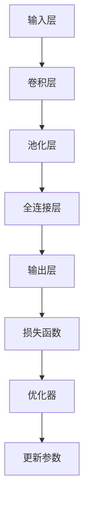
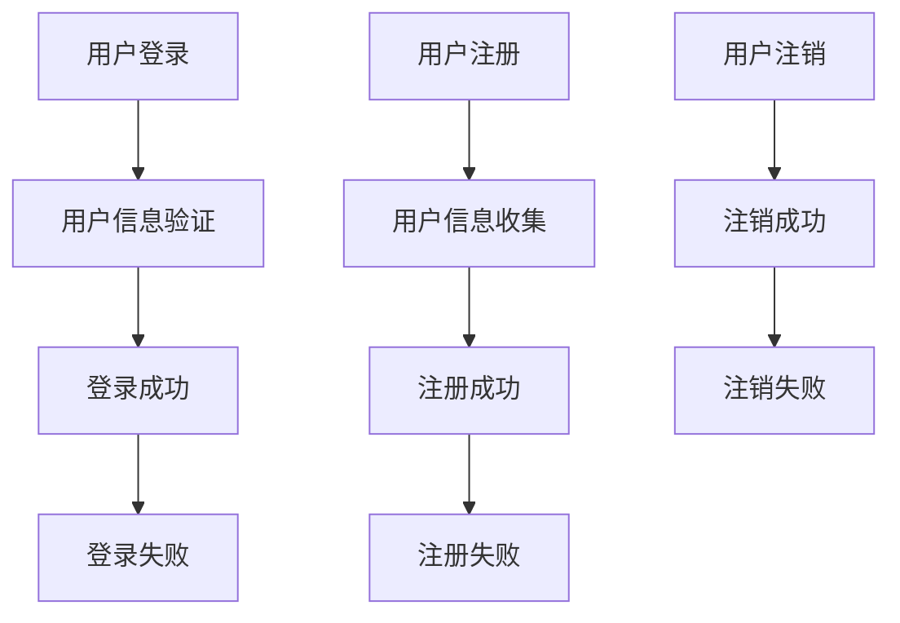
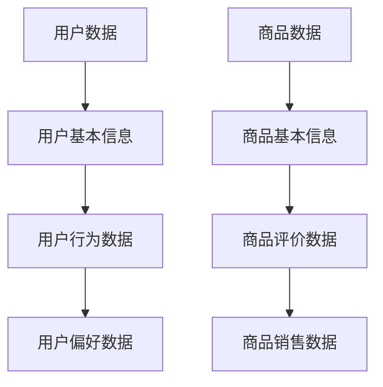
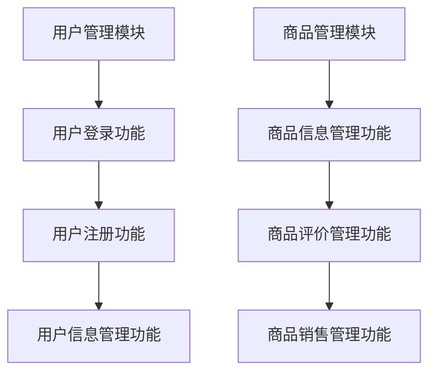
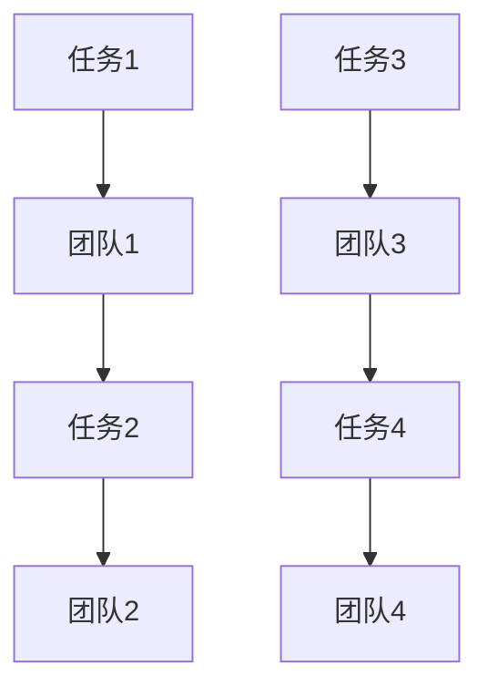
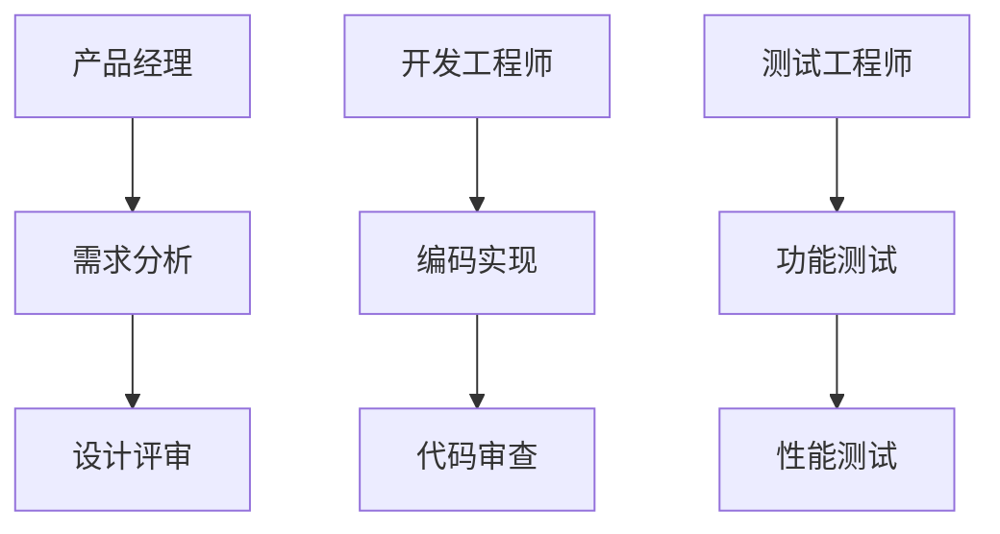
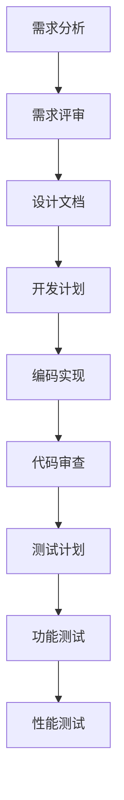

                 

### 大模型应用中的需求分解与任务划分

#### 关键词：
- 大模型
- 需求分解
- 任务划分
- 应用场景
- 算法分析

#### 摘要：
本文将探讨大模型应用中的需求分解与任务划分。首先，我们介绍大模型的基本概念及其应用背景。接着，深入探讨需求分解的方法，包括基于用例、数据、功能的分解方法。然后，我们介绍任务划分的策略，包括基于任务、角色和流程的划分方法。最后，通过实际案例，展示如何在大模型应用中进行需求分解与任务划分，并提供最佳实践和拓展阅读。

---

#### 1. 引言

大模型，是指具有巨大参数规模、能够处理海量数据的深度学习模型。近年来，随着计算能力的提升和算法的改进，大模型在自然语言处理、计算机视觉、推荐系统等领域取得了显著的成果。大模型的应用带来了更高的精度、更丰富的功能和更广泛的适用性，但也面临着需求复杂、计算资源受限等挑战。

为了更好地利用大模型，需求分解与任务划分是关键步骤。需求分解是将复杂的需求拆解为更小、更具体的部分，便于管理和实现。任务划分是将整个任务分配给不同的团队或模块，提高开发效率和团队协作。

本文将从以下几个方面展开：

1. **大模型的基本概念与应用背景**：介绍大模型的概念、发展历程及其在不同领域的应用。
2. **需求分解方法**：分析基于用例、数据、功能的分解方法，并给出具体实例。
3. **任务划分策略**：探讨基于任务、角色和流程的划分方法，并结合具体案例进行说明。
4. **实际案例**：通过实际项目，展示大模型应用中的需求分解与任务划分过程，并进行剖析。
5. **最佳实践与拓展阅读**：总结本文的核心观点，并提供进一步学习和研究的路径。

---

#### 2. 大模型的基本概念与应用背景

**2.1 大模型的概念**

大模型，通常指具有数十亿至数万亿参数的深度学习模型。这些模型通常基于神经网络架构，通过大量的数据进行训练，以实现高精度的预测和分类任务。与传统的机器学习模型相比，大模型具有以下几个特点：

1. **参数规模巨大**：大模型具有数亿至数千亿的参数，这使得模型能够捕捉到数据中的细微特征。
2. **计算资源需求高**：训练大模型需要大量的计算资源和时间，因此高性能计算设备和分布式计算技术成为大模型训练的关键。
3. **数据需求量大**：大模型需要大量的数据进行训练，以保证模型具有良好的泛化能力。

**2.2 大模型的发展历程**

大模型的发展历程可以分为以下几个阶段：

1. **早期神经网络**：20世纪80年代，神经网络开始被用于解决复杂问题，但受限于计算能力和算法限制，模型规模较小。
2. **深度学习兴起**：2006年，Hinton提出了深度信念网络（DBN），开启了深度学习的时代。随着GPU的出现和算法的改进，深度学习模型规模逐渐扩大。
3. **大模型时代**：近年来，随着计算能力和数据量的提升，大模型如GPT、BERT、ViT等在自然语言处理、计算机视觉等领域取得了突破性成果。

**2.3 大模型的应用背景**

大模型在不同领域取得了显著的应用成果，以下是几个典型的应用场景：

1. **自然语言处理（NLP）**：大模型在NLP领域取得了巨大的成功，如GPT、BERT等模型在语言生成、机器翻译、问答系统等方面表现出色。
2. **计算机视觉（CV）**：大模型在图像分类、目标检测、图像生成等领域具有强大的能力，如ResNet、YOLO、GAN等。
3. **推荐系统**：大模型在推荐系统中的应用，如基于深度学习的协同过滤算法，可以提供更精准的推荐结果。
4. **语音识别**：大模型在语音识别领域也取得了显著的进展，如使用WaveNet实现高质量的语音合成。

---

**2.4 大模型的核心算法**

大模型的核心算法主要包括以下几种：

1. **卷积神经网络（CNN）**：CNN是一种用于图像处理和计算机视觉的深度学习模型，通过卷积层、池化层和全连接层等结构实现图像特征的提取和分类。
2. **循环神经网络（RNN）**：RNN是一种用于序列数据处理的深度学习模型，通过隐藏层的状态更新实现对序列的建模。
3. **Transformer**：Transformer是一种基于自注意力机制的深度学习模型，广泛应用于自然语言处理和计算机视觉领域。

以下是一个Mermaid流程图，展示了大模型的核心算法架构：



在接下来的章节中，我们将进一步探讨大模型应用中的需求分解与任务划分方法。

---

#### 3. 需求分解方法

需求分解是将复杂的需求拆解为更小、更具体的部分，以便于分析和实现。在大模型应用中，需求分解是确保项目成功的关键步骤。以下是几种常见的需求分解方法：

**3.1 基于用例的需求分解**

基于用例的需求分解是将需求按照用户行为和使用场景进行划分。每个用例代表用户完成某一特定任务的过程。以下是一个基于用例的需求分解的例子：



**3.2 基于数据的垂直分解**

基于数据的垂直分解是将需求按照数据的维度进行划分。每个维度代表数据的一个方面。以下是一个基于数据的垂直分解的例子：



**3.3 基于功能的水平分解**

基于功能的水平分解是将需求按照功能模块进行划分。每个功能模块代表系统的一个功能部分。以下是一个基于功能的水平分解的例子：



以上三种需求分解方法可以根据实际情况灵活使用，以更好地满足项目需求。

---

#### 4. 任务划分策略

在大模型应用中，任务划分是将整个项目分解为多个可管理的子任务，以提高开发效率和团队协作。以下是几种常见的任务划分策略：

**4.1 基于任务的划分**

基于任务的划分是将任务按照功能或目标进行分配。每个任务由一个团队或个人负责。以下是一个基于任务的划分的例子：



**4.2 基于角色的划分**

基于角色的划分是将任务按照角色或职责进行分配。每个角色负责特定的工作任务。以下是一个基于角色的划分的例子：



**4.3 基于流程的划分**

基于流程的划分是将任务按照工作流程进行分配。每个流程包括一系列相关的任务。以下是一个基于流程的划分的例子：



以上三种任务划分策略可以根据实际情况灵活使用，以适应不同的项目需求。

---

#### 5. 实际案例

为了更好地展示大模型应用中的需求分解与任务划分，我们以一个实际案例——智能问答系统为例，进行详细分析。

**5.1 项目背景**

智能问答系统是一种利用大模型技术实现的问答系统，能够回答用户提出的各种问题。项目目标是实现一个具有高精度、高效率和良好用户体验的智能问答系统。

**5.2 需求分解**

我们使用基于用例的需求分解方法，将项目需求拆分为以下四个主要用例：

1. **用户提问**：用户输入问题，系统解析问题并生成回答。
2. **问题解析**：系统对输入的问题进行语义分析，提取关键信息。
3. **回答生成**：系统利用大模型生成回答，并进行优化。
4. **回答反馈**：用户对回答进行评价，系统根据反馈调整模型。

**5.3 任务划分**

我们使用基于任务的划分方法，将项目任务分配给以下四个团队：

1. **用户界面团队**：负责设计和实现用户提问、回答反馈模块。
2. **自然语言处理团队**：负责问题解析、回答生成模块的设计与实现。
3. **模型训练团队**：负责大模型的训练、优化和调整。
4. **测试团队**：负责系统功能测试、性能测试和用户体验评估。

**5.4 项目实现**

以下是一个基于Python的智能问答系统实现示例：

```python
import nltk
from transformers import pipeline

# 1. 用户提问
question = "什么是深度学习？"

# 2. 问题解析
nltk.download('punkt')
tokens = nltk.word_tokenize(question)

# 3. 回答生成
model = pipeline("text-generation", model="gpt2")
answer = model(question, max_length=50, num_return_sequences=1)

# 4. 回答反馈
print(f"答案：{answer}")
```

**5.5 项目分析**

通过需求分解与任务划分，我们将复杂的智能问答系统拆分为多个可管理的子任务，提高了开发效率和团队协作。在实际开发过程中，我们需要根据项目需求不断调整任务分配和团队协作，以确保项目顺利进行。

---

#### 6. 最佳实践与拓展阅读

在大模型应用中进行需求分解与任务划分，需要遵循以下最佳实践：

1. **明确需求**：在项目开始前，确保需求明确、具体，避免需求变更带来的风险。
2. **合理分配任务**：根据团队的能力和职责，合理分配任务，提高团队协作效率。
3. **持续迭代**：需求分解与任务划分是一个动态过程，需要根据项目进展不断调整。
4. **文档管理**：及时记录需求分解与任务划分的过程和结果，便于后续参考和优化。

拓展阅读：

1. **《大模型：理论与实践》**：详细介绍大模型的基本概念、应用场景和核心算法。
2. **《需求工程与管理》**：系统介绍需求工程的基本概念、方法和工具。
3. **《团队协作与项目管理》**：探讨团队协作和项目管理的最佳实践。

---

#### 7. 结论

本文探讨了在大模型应用中进行需求分解与任务划分的方法。通过基于用例、数据和功能的分解方法，以及基于任务、角色和流程的划分策略，我们可以更好地管理和实现复杂项目。实际案例展示了需求分解与任务划分在智能问答系统开发中的应用，提供了宝贵的经验和参考。希望本文能为大模型应用中的需求分析与任务划分提供有益的指导。

作者：AI天才研究院/AI Genius Institute & 禅与计算机程序设计艺术 /Zen And The Art of Computer Programming

