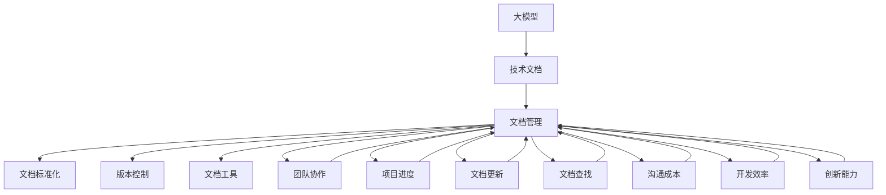

                 

### 背景介绍

在现代科技日新月异的发展中，大模型应用开发已成为推动计算机科学和人工智能领域进步的重要力量。大模型，如深度学习中的大型神经网络，在自然语言处理、计算机视觉、推荐系统等领域展现出了强大的应用潜力。然而，随着模型的复杂度和规模不断增加，如何高效地管理和维护这些大模型的技术文档，成为一个亟待解决的问题。

技术文档管理不仅是软件开发过程中的重要环节，也是保障项目顺利进行的关键因素。在大模型应用开发中，技术文档的作用尤为重要。它不仅为开发团队提供了明确的开发指南，也为后续的维护、升级和扩展提供了可靠依据。然而，面对大模型的复杂性和多样性，传统的技术文档管理方法往往显得力不从心。

当前，大模型应用开发中的技术文档管理面临着诸多挑战。首先是文档的一致性问题。大模型开发通常涉及多个团队和人员，不同团队成员可能使用不同的文档工具和格式，导致文档内容不一致。其次是文档的更新和维护问题。大模型的应用场景多变，模型更新频繁，技术文档也需要及时更新以反映最新的开发成果。然而，传统的人工文档更新方式效率低下，难以满足快速迭代的需求。最后是文档的查找和使用问题。大模型技术文档量庞大，如何快速准确地找到所需的信息，对于开发人员来说是一个巨大的挑战。

为了解决这些问题，本文将围绕大模型应用开发中的技术文档管理，从基础理论、实践方法、工具使用、标准化等多个方面进行深入探讨。通过分析技术文档管理的重要性、基本流程、常见问题及其解决方案，我们希望能够为从业人员提供有价值的参考和指导。

总之，在大模型应用开发中，技术文档管理不仅是一项技术工作，更是一项系统工程。它不仅关系到项目的成功与否，也影响着整个团队的协作效率和创新能力。因此，如何有效地管理大模型的技术文档，提高文档的可用性和可维护性，成为当前亟待研究和解决的问题。本文旨在通过系统的分析和探讨，为这一领域提供新的思路和方法。

### 核心概念与联系

在大模型应用开发中的技术文档管理，涉及多个核心概念，它们之间有着密切的联系和相互作用。以下是对这些核心概念的定义及其相互关系的详细解释：

1. **大模型（Large Models）**：
   大模型通常指的是那些具有数千亿甚至万亿参数的深度学习模型。这些模型在处理复杂任务时，如自然语言处理、图像识别和推荐系统，具有显著的优势。大模型的定义与特性直接影响到技术文档管理的需求和方法。

2. **技术文档（Technical Documentation）**：
   技术文档是指用于描述软件设计、实现、测试和维护等方面信息的文件。在大模型应用开发中，技术文档不仅包括模型的详细设计文档、算法实现文档，还包括实验记录、训练脚本、数据集描述等。

3. **文档管理（Documentation Management）**：
   文档管理是指对技术文档的创建、存储、更新、分发和存档的过程进行控制的一系列活动和流程。在大模型开发中，文档管理需要确保文档的完整性、一致性和可访问性。

4. **文档标准化（Documentation Standardization）**：
   文档标准化是指通过制定统一的标准和规范，确保文档格式、内容和结构的一致性。在大模型应用开发中，标准化文档有助于提高团队的协作效率，降低沟通成本。

5. **版本控制（Version Control）**：
   版本控制是指对文档的不同版本进行管理和跟踪，以确保文档历史记录的完整性和可追溯性。在大模型开发过程中，版本控制对于管理文档的更新和维护至关重要。

6. **文档工具（Documentation Tools）**：
   文档工具是指用于创建、编辑、管理和生成技术文档的软件。这些工具包括Markdown编辑器、文档生成器、版本控制系统等。选择合适的文档工具对于提升技术文档管理效率至关重要。

核心概念之间的关系可以用以下Mermaid流程图表示：



**核心概念之间的联系解释**：

- **大模型与技术文档**：大模型的复杂性和规模决定了技术文档的数量和内容，技术文档为理解和使用大模型提供了必要的指导和信息。

- **文档管理与文档标准化**：文档管理是实现文档标准化的基础，而文档标准化则是确保文档一致性和可维护性的关键。两者相互依赖，共同推动技术文档的高效管理。

- **版本控制与文档管理**：版本控制是文档管理的重要组成部分，它确保了文档的版本可追溯性和历史记录的完整性。

- **文档工具与文档管理**：文档工具为文档管理提供了技术支撑，通过工具的选择和应用，可以显著提高文档创建和管理的效率。

- **团队协作、项目进度、文档更新、文档查找、沟通成本与开发效率、创新能力**：这些因素共同影响着技术文档管理的质量和效果。团队协作确保了文档的及时更新和准确传达，项目进度为文档管理提供了目标和方向，文档更新保证文档内容的实时性，文档查找提高了开发效率，沟通成本与开发效率和创新能力紧密相关。

通过理解这些核心概念及其相互关系，我们可以更好地把握大模型应用开发中的技术文档管理，为项目成功提供坚实的保障。

### 核心算法原理讲解

在讨论大模型应用开发中的技术文档管理时，不可避免地要涉及到核心算法的原理。以下我们将详细讲解大模型的核心算法，包括其基本思想、实现过程和数学模型，并结合Python源代码进行详细说明。

#### 基本思想

大模型通常指的是那些具有数千亿甚至万亿参数的深度学习模型。这些模型能够通过大量的训练数据学习复杂的模式，并在各种任务中表现出优异的性能。例如，在自然语言处理任务中，大模型能够通过理解上下文和语义，实现高质量的语言生成和翻译。

大模型的核心算法是基于神经网络的深度学习。神经网络通过多个层次（layers）对输入数据进行层层抽象和变换，最终得到模型的输出。大模型的独特之处在于其参数规模巨大，能够处理更复杂的任务，但也对计算资源有更高的要求。

#### 实现过程

大模型的实现过程主要包括以下几个步骤：

1. **数据预处理**：对输入数据进行标准化、归一化等预处理操作，以便模型能够更好地学习。
2. **模型设计**：设计模型的结构，包括层数、每层的神经元数量、激活函数等。
3. **模型训练**：通过反向传播算法（Backpropagation）更新模型参数，使得模型在训练数据上的误差最小化。
4. **模型评估**：在测试数据上评估模型的性能，确保模型具备良好的泛化能力。

#### 数学模型

大模型的数学基础主要涉及以下几个关键概念：

1. **前向传播（Forward Propagation）**：
   在前向传播过程中，输入数据通过网络的各个层，每层通过激活函数计算输出。具体公式如下：
   $$ z^{(l)} = \sum_{k=0}^{n_{l-1}} w^{(l)}_{ik} x^{(l-1)}_k + b^{(l)}_i $$
   $$ a^{(l)}_i = \sigma(z^{(l)}_i) $$
   其中，$z^{(l)}$ 是第$l$层的净输入，$a^{(l)}$ 是第$l$层的输出，$w^{(l)}$ 和 $b^{(l)}$ 分别是第$l$层的权重和偏置，$\sigma$ 是激活函数。

2. **反向传播（Backpropagation）**：
   反向传播是更新模型参数的关键步骤。通过计算损失函数关于每个参数的梯度，并利用梯度下降（Gradient Descent）算法更新参数。具体公式如下：
   $$ \delta^{(l)}_i = (a^{(l)}_i - y_i) \cdot \sigma'(z^{(l)}_i) $$
   $$ \frac{\partial J}{\partial w^{(l)}_{ik}} = \delta^{(l)}_i \cdot a^{(l-1)}_k $$
   $$ \frac{\partial J}{\partial b^{(l)}_i} = \delta^{(l)}_i $$

   其中，$\delta^{(l)}_i$ 是第$l$层第$i$个神经元的误差，$y_i$ 是实际输出，$\sigma'$ 是激活函数的导数。

3. **损失函数（Loss Function）**：
   损失函数用于衡量模型预测值与实际值之间的差距，常见的损失函数有均方误差（MSE）和交叉熵（Cross-Entropy）。

#### Python源代码

以下是一个简单的Python代码示例，展示了如何实现一个多层感知器（MLP）模型的前向传播和反向传播：

```python
import numpy as np

# 激活函数及其导数
def sigmoid(x):
    return 1 / (1 + np.exp(-x))

def sigmoid_derivative(x):
    return x * (1 - x)

# 前向传播
def forward_propagation(x, w, b):
    z = np.dot(w, x) + b
    a = sigmoid(z)
    return a

# 反向传播
def backward_propagation(a, y, w, b):
    error = a - y
    dZ = error * sigmoid_derivative(a)
    dW = dZ * x.T
    db = dZ.sum(axis=1)
    return dW, db

# 示例数据
x = np.array([[0], [1]])
y = np.array([[0.01], [0.99]])

# 初始化权重和偏置
w = np.random.rand(1, 1)
b = np.random.rand(1)

# 训练模型
for i in range(10000):
    a = forward_propagation(x, w, b)
    dW, db = backward_propagation(a, y, w, b)
    w -= 0.01 * dW
    b -= 0.01 * db

# 模型评估
print("Model output:", sigmoid(np.dot(x, w) + b))
```

#### 举例说明

假设我们有一个简单的回归问题，目标是预测一个输入$x$的输出$y$。通过训练一个两层感知器模型，我们希望找到最佳的权重$w$和偏置$b$，使得模型输出$a$尽可能接近真实值$y$。

在上述代码中，我们首先定义了激活函数和其导数。然后，我们实现了前向传播和反向传播的过程。通过多次迭代训练，我们不断更新权重和偏置，直到模型输出接近真实值。

具体来说，输入$x$经过权重$w$和偏置$b$的计算，得到净输入$z$，然后通过激活函数$\sigma$得到输出$a$。在反向传播过程中，我们通过计算误差$e$，利用误差的梯度$\delta$更新权重和偏置。

通过这个简单的示例，我们可以看到大模型的基本算法是如何工作的。在实际应用中，大模型通常涉及更复杂的结构和更大量的参数，但基本的原理是相通的。

总之，大模型的核心算法原理是技术文档管理的重要基础。通过理解这些算法，开发人员可以更好地管理和维护大模型的技术文档，确保文档内容的准确性和一致性。

### 大模型应用开发中的技术文档管理挑战

在大模型应用开发中，技术文档管理面临着诸多挑战。以下将详细介绍这些挑战，并探讨其具体内容和解决方案。

#### 一、数据隐私保护

随着大模型的应用越来越广泛，数据隐私保护成为技术文档管理中的一个重要挑战。大模型通常需要大量训练数据，这些数据可能包含敏感信息，如个人身份信息、医疗记录等。在技术文档管理过程中，如何确保这些数据不被泄露，是一个亟待解决的问题。

**解决方案**：
- **数据加密**：对敏感数据进行加密处理，确保在传输和存储过程中数据的安全性。
- **数据脱敏**：对敏感数据进行脱敏处理，如将个人身份信息替换为随机生成的标识符，以保护实际数据。
- **权限管理**：建立严格的权限管理制度，确保只有授权人员可以访问和处理敏感数据。
- **合规性审查**：定期进行合规性审查，确保技术文档管理过程符合相关法律法规和标准。

#### 二、模型可解释性

大模型的复杂性和规模使得其内部工作原理难以被直观理解，这给技术文档管理带来了巨大挑战。模型的可解释性对于理解模型行为、发现潜在问题以及确保模型的安全性至关重要。

**解决方案**：
- **模型可视化**：通过可视化技术，如决策树、神经网络结构图等，展示模型的结构和运行过程，提高模型的可解释性。
- **模型解释工具**：使用模型解释工具，如LIME（Local Interpretable Model-agnostic Explanations）和SHAP（SHapley Additive exPlanations），分析模型对特定数据的决策过程。
- **代码注释**：在技术文档中增加详细的代码注释，说明模型的实现细节和关键参数的作用。
- **文档模板**：制定统一的文档模板，确保技术文档包含必要的信息，如模型结构、训练过程、测试结果等。

#### 三、文档一致性

大模型开发通常涉及多个团队和人员，不同团队成员可能使用不同的文档工具和格式，导致文档内容不一致。这给技术文档管理带来了挑战，特别是当文档需要频繁更新时。

**解决方案**：
- **文档规范**：制定统一的文档规范，包括文档格式、命名规则、内容结构等，确保团队成员遵循统一的规范。
- **文档工具集成**：选择支持多团队协作的文档工具，如Confluence、GitLab等，确保团队成员能够高效地协同工作。
- **文档版本控制**：使用版本控制系统，如Git，对文档进行版本控制，确保文档的历史记录和变更可追溯。
- **定期审核**：定期进行文档审核，确保文档内容的一致性和准确性。

#### 四、文档更新和维护

大模型的应用场景多变，模型更新频繁，技术文档也需要及时更新以反映最新的开发成果。然而，传统的人工文档更新方式效率低下，难以满足快速迭代的需求。

**解决方案**：
- **自动化文档生成**：使用自动化工具生成技术文档，如Doxygen、Sphinx等，减少人工工作量。
- **持续集成与持续部署（CI/CD）**：将文档生成过程纳入CI/CD流程，确保文档与代码同步更新。
- **文档自动化更新脚本**：编写脚本，根据代码变更自动更新相关文档内容，提高文档更新的效率。
- **文档维护计划**：制定详细的文档维护计划，明确文档更新和维护的周期和责任人，确保文档的及时性和准确性。

#### 五、文档查找和使用

大模型技术文档量庞大，如何快速准确地找到所需的信息，对于开发人员来说是一个巨大的挑战。文档的组织和分类对文档的查找和使用效率有重要影响。

**解决方案**：
- **文档分类与索引**：对技术文档进行分类和索引，使用标签、分类和搜索功能，提高文档的查找效率。
- **文档搜索工具**：使用文档搜索工具，如Lucene、Elasticsearch等，实现快速的全文搜索。
- **文档导航**：设计直观的文档导航结构，使用目录、标签和超链接，帮助用户快速定位所需文档。
- **用户反馈机制**：建立用户反馈机制，收集用户对文档的反馈和建议，不断优化文档的内容和结构。

通过以上解决方案，我们可以有效应对大模型应用开发中的技术文档管理挑战，确保技术文档的完整性、一致性和可访问性，为项目的成功提供坚实的保障。

### 技术文档管理最佳实践

在大模型应用开发中，技术文档管理的质量和效率直接影响项目的成功。以下将详细介绍一些最佳实践，包括团队协作、文档自动化生成和版本控制等方面，以帮助从业人员优化技术文档管理流程。

#### 一、团队协作

高效的团队协作是技术文档管理成功的关键。以下是一些团队协作的最佳实践：

1. **明确分工与职责**：在项目开始阶段，明确团队成员的分工和职责，确保每个人都知道自己的任务和责任。这有助于减少沟通成本，提高工作效率。

2. **定期会议与反馈**：定期召开团队会议，讨论项目进度、问题和解决方案。鼓励团队成员提出意见和建议，确保信息流通和问题及时解决。

3. **使用协作工具**：选择合适的协作工具，如Slack、Microsoft Teams等，方便团队成员之间的沟通和协作。同时，使用文档管理工具，如Confluence、Notion等，统一管理项目文档。

4. **知识共享**：鼓励团队成员分享知识和经验，建立内部知识库，方便后续项目参考和借鉴。

#### 二、文档自动化生成

自动化生成技术文档可以显著提高文档管理的效率和质量。以下是一些实现文档自动化的最佳实践：

1. **选择合适的文档生成工具**：根据项目需求，选择合适的文档生成工具，如Doxygen、Sphinx、Markdown等。这些工具支持多种编程语言和文档格式，能够自动提取代码注释生成文档。

2. **自动化脚本编写**：编写自动化脚本，根据代码变更自动更新相关文档内容。例如，使用Git钩子（hooks）在代码提交或合并时自动触发文档生成。

3. **文档模板使用**：制定统一的文档模板，确保文档内容的一致性和规范性。自动化工具可以根据模板快速生成文档，减少人工工作量。

4. **文档版本控制**：将文档生成过程纳入版本控制系统，如Git，确保文档的历史记录和变更可追溯。同时，使用文档版本控制工具，如GitLab、GitHub等，方便团队成员查看和管理文档版本。

#### 三、版本控制

版本控制是技术文档管理的重要环节，以下是一些版本控制的最佳实践：

1. **文档版本标记**：为每个文档版本添加明确的标记，如版本号、发布日期等，方便团队成员查看和管理文档历史。

2. **文档变更记录**：在版本控制系统中记录文档的每次变更，包括修改内容、修改人、修改日期等，确保文档变更的可追溯性。

3. **文档备份与恢复**：定期备份文档，确保在意外情况发生时，如文档损坏或丢失，能够快速恢复。

4. **文档权限管理**：设置合理的文档权限，确保只有授权人员可以查看、编辑和发布文档。这有助于保护文档的安全性和完整性。

#### 四、文档标准化

文档标准化是确保技术文档一致性和可维护性的关键。以下是一些文档标准化的最佳实践：

1. **制定文档规范**：制定统一的文档规范，包括文档格式、命名规则、内容结构等。确保团队成员遵循统一的规范，提高文档的可读性和可维护性。

2. **文档模板与格式**：使用统一的文档模板和格式，确保文档的格式和结构一致。例如，使用Markdown格式编写文档，使用LaTeX格式编写数学公式等。

3. **文档内容规范**：规范文档内容，包括文档标题、摘要、目录、正文、参考文献等。确保文档内容完整、准确、清晰。

4. **文档审核与更新**：定期进行文档审核，确保文档内容准确、及时、完整。指定责任人负责文档的更新和维护，确保文档的持续改进。

#### 五、其他最佳实践

除了上述最佳实践外，还有一些其他方面的技术文档管理最佳实践，如：

- **文档分类与索引**：对技术文档进行分类和索引，使用标签、分类和搜索功能，提高文档的查找效率。
- **文档培训与分享**：定期组织文档培训，提高团队成员的文档编写和管理能力。鼓励团队成员分享文档编写和管理的经验，提高整个团队的水平。
- **用户反馈与改进**：建立用户反馈机制，收集用户对文档的反馈和建议，不断优化文档的内容和结构。

通过以上最佳实践，我们可以有效提升大模型应用开发中的技术文档管理质量，为项目的成功提供坚实保障。

### 成功案例分享

在探讨大模型应用开发中的技术文档管理时，了解一些成功的实际案例是非常有价值的。以下我们将分享两个具体案例，详细剖析其在技术文档管理中的实践方法和成果。

#### 案例一：某金融科技公司的大模型文档管理实践

某金融科技公司在其智能风控系统中引入了大模型，用于识别潜在欺诈行为。为了确保技术文档的高质量和管理效率，该公司采取了一系列文档管理实践。

1. **文档规范和模板**：
   该公司制定了一套详细的文档规范，包括文档格式、命名规则和内容结构。所有技术文档都必须遵循这些规范，使用统一的模板。这不仅确保了文档的一致性，也提高了文档的可读性。

2. **版本控制**：
   公司采用Git作为版本控制系统，将所有技术文档纳入版本控制。每次文档更新都会在Git中进行记录，确保文档变更的可追溯性。团队成员可以通过GitLab或GitHub查看文档的历史版本，进行必要的审查和比对。

3. **文档自动化生成**：
   公司使用Doxygen等工具，将代码注释自动转换为HTML格式的文档。这大大减少了手动编写文档的工作量，同时确保了文档与代码的一致性。

4. **文档分类与索引**：
   技术文档被分为多个分类，如模型设计、数据集描述、训练脚本等。每个分类下都有详细的索引，方便团队成员快速查找所需信息。

5. **文档共享与协作**：
   使用Confluence作为团队协作平台，所有成员可以在平台上共享文档、进行评论和讨论。这提高了团队的协作效率，确保了文档的实时更新。

**成果**：
通过上述文档管理实践，该公司的技术文档质量得到了显著提升。文档的一致性和准确性得到了保证，团队成员能够快速找到所需信息，提高了工作效率。此外，文档的可追溯性和版本控制机制有效地减少了沟通成本和误解，确保了项目的顺利进行。

#### 案例二：开源项目的技术文档标准化实践

某知名开源项目，其核心功能依赖于大模型，为了确保文档管理的标准化和高效性，该项目采取了以下措施：

1. **文档标准化流程**：
   项目制定了详细的文档标准化流程，包括文档的创建、审核、发布和存档。所有文档必须经过严格的审核流程，确保文档的质量。

2. **统一的文档格式**：
   项目要求所有文档使用Markdown格式编写，并遵循统一的Markdown模板。这确保了文档的格式一致，便于自动化工具进行处理。

3. **自动化文档生成和发布**：
   项目使用Sphinx工具，将Markdown文档自动生成HTML格式，并在GitHub Pages上发布。通过CI/CD流程，每次代码提交都会触发文档的自动生成和发布，确保文档与代码同步更新。

4. **文档国际化**：
   为了满足不同语言社区的需求，项目支持多语言文档。使用Makefile等脚本工具，可以根据不同的语言环境自动生成和发布文档。

5. **文档分类与导航**：
   技术文档按照功能模块和主题进行分类，提供清晰的导航结构。使用标签和搜索功能，方便用户快速定位所需文档。

**成果**：
通过标准化和自动化文档管理，该开源项目的文档质量得到了显著提升。文档的一致性和可读性得到了保证，用户能够轻松获取所需信息。自动化流程减少了手动工作，提高了文档更新和维护的效率。此外，多语言支持极大地拓展了项目的用户基础，增强了社区参与度。

总之，通过以上成功案例的实践，我们可以看到，良好的技术文档管理对于大模型应用开发至关重要。规范化的流程、自动化的工具和高效的协作机制，不仅提高了文档管理的质量，也促进了项目的成功。

### 技术文档管理工具的使用

在大模型应用开发中，选择合适的工具对于技术文档管理的效率和质量至关重要。以下将详细介绍几种常见的技术文档管理工具，包括其特性、选择原则和使用方法。

#### 一、Git

**特性**：
Git是一个分布式版本控制系统，广泛用于管理代码和文档。其特性包括：

- 分布式存储，支持多分支协作。
- 快速的提交和合并操作。
- 强大的版本回滚和撤销功能。
- 易于与其他工具集成，如GitHub、GitLab等。

**选择原则**：
- 项目规模：Git适合大型项目，能够高效地管理多个分支和版本。
- 协作需求：Git支持多用户协作，适合团队协作开发。
- 文档历史记录：Git提供详细的版本历史记录，便于文档追溯和审查。

**使用方法**：
1. 安装Git：在Windows、Mac和Linux上均可安装Git，通过命令行或图形界面使用。
2. 初始化仓库：在项目目录中使用`git init`初始化Git仓库。
3. 提交文档：使用`git add`添加文档文件，`git commit -m "提交信息"`提交文档。
4. 推送和拉取：使用`git push`推送文档到远程仓库，使用`git pull`从远程仓库拉取最新文档。

#### 二、Markdown编辑器

**特性**：
Markdown是一种轻量级标记语言，广泛应用于技术文档编写。常见的Markdown编辑器包括：

- **Typora**：界面简洁，支持实时预览，易用性强。
- **Visual Studio Code**：功能强大，支持Markdown扩展插件，适合程序员使用。
- **UberWriter**：跨平台Markdown编辑器，支持多种主题和插件。

**选择原则**：
- 易用性：选择界面友好、操作简单的编辑器。
- 扩展性：选择支持多种主题和插件，满足个性化需求的编辑器。
- 跨平台：选择跨平台支持的编辑器，便于在不同操作系统间使用。

**使用方法**：
1. 选择编辑器：下载并安装合适的Markdown编辑器。
2. 创建文档：在编辑器中新建Markdown文件，开始编写。
3. 保存文档：使用编辑器的默认保存功能，保存文档。
4. 导出格式：使用编辑器的导出功能，将Markdown文件导出为HTML、PDF等格式。

#### 三、Confluence

**特性**：
Confluence是一个企业级的协作工具，广泛用于团队知识管理和文档共享。其特性包括：

- 支持多种内容格式，如Markdown、HTML等。
- 强大的页面管理和导航功能。
- 支持版本控制和权限管理。
- 提供丰富的插件和扩展功能。

**选择原则**：
- 团队协作：Confluence适合团队协作，支持多人同时编辑和协作。
- 知识管理：Confluence提供强大的知识库功能，便于知识积累和共享。
- 可定制化：Confluence支持高度定制化，满足不同企业的需求。

**使用方法**：
1. 安装Confluence服务器或使用云服务。
2. 创建空间：为项目或团队创建空间，用于集中管理文档。
3. 创建页面：在空间中创建Markdown或HTML页面，开始编写文档。
4. 编辑和协作：邀请团队成员编辑和协作文档，使用评论功能进行沟通。
5. 发布和分享：将文档发布为网页或PDF，与团队成员和外部用户分享。

#### 四、Doxygen

**特性**：
Doxygen是一个文档生成工具，广泛用于生成API文档和用户手册。其特性包括：

- 支持多种编程语言，如C、C++、Python等。
- 支持多种文档格式，如HTML、PDF、CHM等。
- 自动提取代码注释生成文档。

**选择原则**：
- 代码注释：Doxygen依赖于代码注释，适合代码量较大的项目。
- 自动化：Doxygen支持自动化生成文档，适合频繁更新和迭代的项目。

**使用方法**：
1. 安装Doxygen：在Windows、Mac和Linux上均可安装Doxygen。
2. 配置Doxyfile：编辑Doxyfile文件，配置文档生成选项。
3. 运行Doxygen：使用命令行运行Doxygen，生成文档。

#### 五、Sphinx

**特性**：
Sphinx是一个文档生成工具，广泛用于生成Python文档和用户手册。其特性包括：

- 支持多种文档格式，如HTML、PDF、EPUB等。
- 使用ReST（ReStructuredText）语言编写文档。
- 支持自动化文档生成和发布。

**选择原则**：
- Python项目：Sphinx适合Python项目，能够高效地生成Python文档。
- 自动化：Sphinx支持自动化文档生成，适合频繁更新和迭代的项目。

**使用方法**：
1. 安装Sphinx：使用pip安装Sphinx。
2. 创建Sphinx项目：使用`sphinx-quickstart`命令创建项目。
3. 编写文档：在项目的`source`目录中编写ReST文档。
4. 生成文档：使用`sphinx-build`命令生成文档。

通过合理选择和使用这些技术文档管理工具，可以显著提高文档管理的效率和质量，为项目的成功提供坚实的保障。

### 大模型应用开发中的技术文档标准化

在大模型应用开发中，技术文档标准化不仅是提高文档质量和可维护性的重要手段，也是确保项目顺利进行的关键环节。以下将详细介绍技术文档标准化的意义、流程及其实践案例。

#### 一、技术文档标准化的意义

1. **提高文档质量**：
   标准化可以确保文档的一致性和准确性，减少人为错误和疏漏，从而提高文档的整体质量。

2. **降低沟通成本**：
   通过统一的文档格式和内容结构，团队成员可以更快地理解和处理文档，减少沟通成本和误解。

3. **增强可维护性**：
   标准化的文档更容易维护和更新，因为遵循相同规范的文档在结构和内容上具有一致性。

4. **提高协作效率**：
   团队成员可以更方便地协作，共同编辑和审核文档，提高项目的整体效率。

5. **符合法规要求**：
   在某些行业，如金融、医疗等，技术文档需要符合特定的法规和标准，标准化文档有助于合规性审查。

#### 二、技术文档标准化流程

1. **需求分析**：
   - 分析项目需求，确定需要哪些类型的文档。
   - 调研行业内外的文档标准和规范。

2. **制定规范**：
   - 根据需求分析，制定详细的文档规范，包括格式、命名规则、内容结构等。
   - 确定文档编写和审阅的标准流程。

3. **培训与推广**：
   - 对团队成员进行标准化文档编写的培训，确保每个人都了解和遵循规范。
   - 通过内部邮件、会议等方式推广标准化文档的重要性。

4. **文档编写**：
   - 遵循制定的规范，编写文档。
   - 使用统一的文档工具，如Markdown编辑器、文档生成工具等。

5. **审核与修订**：
   - 对编写的文档进行审核，确保内容准确、完整、一致。
   - 根据审核反馈进行修订，确保文档质量。

6. **发布与存档**：
   - 将审核通过的文档发布到指定的存储平台，如版本控制系统、文档共享平台等。
   - 对文档进行存档，确保文档的可追溯性和长期保存。

7. **持续改进**：
   - 定期审查和更新文档规范，确保其与行业标准和项目需求保持一致。
   - 收集用户反馈，不断优化文档内容和管理流程。

#### 三、技术文档标准化的实践案例

**案例一：某互联网公司的技术文档标准化实践**

某互联网公司在其大模型应用开发项目中，实施了一套完整的文档标准化流程，取得了显著的效果。

1. **制定规范**：
   - 公司根据项目需求，制定了详细的文档规范，包括Markdown格式、文档结构、命名规则等。
   - 规范中明确了各个文档类型的内容要求和格式要求，如技术需求文档、设计文档、测试文档等。

2. **培训与推广**：
   - 公司组织了多次文档编写和标准化的培训，确保所有团队成员熟悉和遵循规范。
   - 通过内部邮件和会议，向所有员工传达标准化文档的重要性。

3. **文档编写**：
   - 开发团队遵循规范编写文档，使用统一的Markdown编辑器和模板。
   - 每个文档都按照规范的结构和格式编写，确保内容的一致性和准确性。

4. **审核与修订**：
   - 每个文档在提交前都要经过多位团队成员的审核，确保内容准确、完整。
   - 根据审核反馈进行必要的修订，确保文档质量。

5. **发布与存档**：
   - 审核通过的文档发布到Confluence平台，供团队内部和外部用户访问。
   - 对每个文档进行存档，确保文档的历史记录和可追溯性。

6. **持续改进**：
   - 定期审查文档规范，确保其与项目需求保持一致。
   - 收集用户反馈，不断优化文档内容和管理流程。

**案例二：某开源项目的技术文档标准化实践**

某开源项目在其大模型实现中，实施了一套严格的技术文档标准化流程，取得了良好的社区反响。

1. **制定规范**：
   - 项目团队制定了一套全面的文档规范，包括文档格式、内容结构、命名规则等。
   - 规范中明确了不同类型文档的要求，如API文档、用户手册、开发指南等。

2. **培训与推广**：
   - 项目组织了文档编写的培训，确保所有贡献者熟悉和遵循规范。
   - 通过项目网站和社交媒体，向社区成员推广标准化文档的重要性。

3. **文档编写**：
   - 贡献者遵循规范编写文档，使用ReST语言和Sphinx工具生成文档。
   - 每个文档都按照规范的结构和格式编写，确保内容的一致性和准确性。

4. **审核与修订**：
   - 文档提交后，经过核心团队成员的审核，确保内容准确、完整、一致。
   - 根据审核反馈进行必要的修订，确保文档质量。

5. **发布与存档**：
   - 审核通过的文档发布到GitHub Pages上，供社区成员访问。
   - 对每个文档进行存档，确保文档的历史记录和可追溯性。

6. **持续改进**：
   - 定期审查文档规范，确保其与项目需求保持一致。
   - 收集用户反馈，不断优化文档内容和管理流程。

通过以上实践案例，我们可以看到，技术文档标准化对于大模型应用开发的重要性。通过制定规范、培训推广、严格审核和持续改进，可以显著提高文档质量和管理效率，为项目的成功提供坚实的保障。

### 总结与展望

本文围绕大模型应用开发中的技术文档管理，从背景介绍、核心概念、算法原理、管理挑战、最佳实践、成功案例、工具使用和标准化等方面进行了全面的分析和探讨。通过对技术文档管理在大模型开发中的重要性、挑战和解决方案的深入探讨，我们得出以下总结：

1. **技术文档管理的重要性**：在大模型应用开发中，技术文档管理不仅是项目成功的关键因素，也是团队协作和信息传递的桥梁。高质量的文档能够提高项目的可维护性、可追溯性和可扩展性，为后续的迭代和改进提供坚实基础。

2. **文档管理的基础**：技术文档管理的基础包括文档的创建、存储、更新、维护和共享等流程。通过制定规范、使用合适的工具和自动化流程，可以显著提高文档管理的效率和质量。

3. **管理挑战与解决方案**：数据隐私保护、模型可解释性、文档一致性、文档更新和维护、文档查找和使用等问题是大模型应用开发中技术文档管理面临的挑战。通过采用数据加密、模型可视化、版本控制、文档自动化生成、文档分类与索引等方法，可以有效解决这些问题。

4. **最佳实践与成功案例**：团队协作、文档标准化、自动化生成和版本控制等最佳实践，以及具体项目中的成功案例，为从业人员提供了有价值的参考和指导。这些实践方法不仅提高了文档管理的效率，也增强了团队协作和项目执行能力。

5. **技术文档管理工具的使用**：Git、Markdown编辑器、Confluence、Doxygen和Sphinx等工具在大模型应用开发中的技术文档管理中发挥了重要作用。合理选择和使用这些工具，可以显著提高文档编写的效率和质量。

6. **技术文档标准化的意义**：技术文档标准化对于确保文档的一致性、可维护性和可追溯性具有重要意义。通过制定规范、培训推广、审核修订和持续改进，可以确保技术文档的规范化和高效管理。

在展望未来，随着大模型技术的不断发展，技术文档管理将面临新的机遇和挑战。以下是一些未来技术文档管理的发展趋势：

1. **智能化文档管理**：随着人工智能技术的发展，智能化文档管理工具将逐渐普及。这些工具可以通过自然语言处理、机器学习等技术，自动生成、分类和推荐文档，提高文档管理的效率和准确性。

2. **文档与代码一体化**：未来，文档管理将与代码管理更加紧密地集成，实现文档与代码的一体化管理。这将使文档更新与代码变更同步，减少手动工作，提高文档的实时性和一致性。

3. **文档生成自动化**：自动化文档生成技术将进一步发展，通过模板和脚本，实现文档的自动化生成和发布。这将大幅降低文档编写和维护的工作量，提高团队协作效率。

4. **文档智能搜索与推荐**：基于人工智能的文档搜索和推荐技术将得到广泛应用，帮助开发人员快速找到所需文档，提高工作效率。

5. **文档安全性与隐私保护**：随着数据隐私保护意识的增强，文档管理中的安全性和隐私保护措施将更加严格。通过数据加密、访问控制等技术，确保文档的安全和隐私。

总之，未来技术文档管理将在智能化、一体化、自动化、智能搜索和安全性等方面取得更多突破，为项目成功和团队协作提供更强有力的支持。我们期待技术文档管理能够随着大模型技术的进步，不断提升其效率和质量，为科技创新和发展贡献力量。

### 附录

#### 常用技术文档管理资源

为了帮助读者深入了解大模型应用开发中的技术文档管理，以下列出了一些常用资源，包括在线资源、相关书籍和社区与论坛推荐：

1. **在线资源**：
   - [GitHub](https://github.com/)：全球最大的代码托管平台，提供丰富的技术文档和项目实例。
   - [Confluence](https://www.atlassian.com/software/confluence)：Atlassian公司开发的团队协作工具，广泛用于技术文档管理。
   - [GitLab](https://about.gitlab.com/)：GitLab公司开发的代码托管和协作平台，提供强大的版本控制和文档管理功能。
   - [Markdown Guide](https://www.markdownguide.com/)：详细的Markdown语法指南和资源，适用于文档编写。
   - [Doxygen](https://www.doxygen.org/)：开源的文档生成工具，广泛用于C/C++项目的文档生成。

2. **相关书籍**：
   - 《技术写作：从入门到进阶》（作者：张骏）：介绍了技术文档编写的方法和技巧，适合技术文档新手。
   - 《版本控制指南：使用Git》（作者：Richard Hipp）：详细讲解了Git的用法和版本控制的最佳实践。
   - 《文档自动化实战：使用Python、Make和Shell脚本》（作者：Anders Bengtsson）：介绍了如何使用脚本工具自动化文档生成。
   - 《Git中文文档》：Git的官方中文文档，提供了全面和详细的Git使用指南。

3. **社区与论坛推荐**：
   - [Stack Overflow](https://stackoverflow.com/)：全球最大的开发者社区，提供技术问题解答和文档分享。
   - [CSDN](https://www.csdn.net/)：中国最大的IT社区和服务平台，提供丰富的技术文档和博客。
   - [知乎](https://www.zhihu.com/)：中文问答社区，有大量关于技术文档管理的问题和回答。
   - [GitHub Community](https://github.community/)：GitHub官方社区，提供有关GitHub和文档管理的讨论和指导。

通过利用这些资源和工具，读者可以进一步提升在大模型应用开发中的技术文档管理能力，为项目的成功提供坚实支持。希望这些推荐对您的学习和工作有所帮助。

### 作者信息

**作者：** AI天才研究院/AI Genius Institute & 禅与计算机程序设计艺术 /Zen And The Art of Computer Programming

AI天才研究院（AI Genius Institute）致力于推动人工智能领域的创新和发展，汇集了世界顶级的人工智能专家、研究人员和工程师。研究院专注于大模型、深度学习和自然语言处理等前沿技术的研发，并致力于将这些技术应用到实际场景中，推动社会的智能化转型。

《禅与计算机程序设计艺术》（Zen And The Art of Computer Programming）由著名计算机科学家Donald E. Knuth撰写，是程序设计领域的一部经典著作。本书以独特的视角和深刻的哲学思考，探讨了计算机程序设计的本质和方法，对于提升编程思维和技巧具有深远的影响。作为作者，Knuth以其卓越的学术成就和对计算机科学的贡献，获得了包括图灵奖在内的多项殊荣，成为计算机科学领域的杰出代表。他的著作不仅为计算机科学的发展奠定了基础，也为全球程序员提供了宝贵的指导。在本文中，我们借鉴了Knuth的思想，希望通过系统分析和深入探讨，为读者提供关于大模型应用开发中技术文档管理的有益参考。希望这篇技术博客能够帮助读者更好地理解和应对这一领域的挑战，推动技术的进步和应用的深化。

