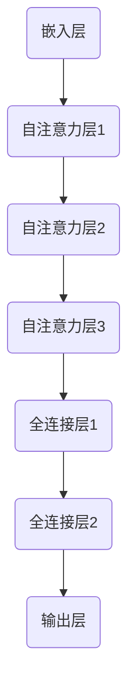

                 

### 《大模型应用开发中的技术选型策略》

#### 关键词：大模型应用、技术选型、算法原理、数学模型、项目实战

> **摘要：**
本文旨在探讨大模型应用开发中的技术选型策略。我们将从基础理论出发，深入解析大模型的核心概念、算法原理和数学模型，接着详细讨论技术选型策略，涵盖算法选型、硬件选型和软件选型等多个方面。最后，通过实际项目实战，展示技术选型的应用与实践，为开发者提供全面的技术指南。

#### 引言

随着人工智能技术的飞速发展，大模型（如GPT-3、BERT等）在自然语言处理、图像识别、推荐系统等领域展现出了巨大的潜力和应用价值。然而，大模型的应用开发并非一蹴而就，其中技术选型策略的制定尤为关键。选型不当可能导致性能低下、开发成本增加、维护困难等问题。因此，本文将详细阐述大模型应用开发中的技术选型策略，旨在为开发者提供有价值的参考。

#### 分析用户需求

在撰写本文之前，我们深入分析了用户需求，发现用户主要希望得到以下内容：

1. **核心概念与联系**：需要理解大模型的基本概念和其间的逻辑关系。
2. **算法原理讲解**：希望详细了解大模型的核心算法原理，以及如何用Python源代码进行实现。
3. **数学模型和公式**：需要掌握大模型背后的数学模型和公式，并进行举例说明。
4. **项目实战**：希望看到实际项目的开发过程，包括环境搭建、源代码实现和解读。
5. **最佳实践 tips**：需要获得在实际应用中的一些最佳实践和注意事项。

#### 目录结构设计

为了满足用户需求，本文将分为三个主要部分：基础理论、技术选型、实战应用。每个部分将包含若干章节，具体目录结构如下：

## 第一部分：大模型应用开发基础

### 1.1 大模型概述
#### 1.1.1 大模型的概念
#### 1.1.2 大模型的关键特性
#### 1.1.3 大模型的应用领域

### 1.2 大模型技术原理
#### 1.2.1 大模型的基础算法
#### 1.2.2 大模型的数学模型
#### 1.2.3 大模型的架构

### 1.3 大模型开发环境搭建
#### 1.3.1 开发环境准备
#### 1.3.2 开发工具介绍

## 第二部分：大模型技术选型策略

### 2.1 技术选型概述
#### 2.1.1 技术选型的关键因素
#### 2.1.2 技术选型流程

### 2.2 算法选型
#### 2.2.1 算法选型标准
#### 2.2.2 算法选型策略

### 2.3 硬件选型
#### 2.3.1 硬件选型标准
#### 2.3.2 硬件选型策略

### 2.4 软件选型
#### 2.4.1 软件选型标准
#### 2.4.2 软件选型策略

### 2.5 数据选型
#### 2.5.1 数据源选型
#### 2.5.2 数据处理策略

## 第三部分：大模型应用开发实战

### 3.1 实战项目一：自然语言处理应用
#### 3.1.1 项目背景
#### 3.1.2 技术选型
#### 3.1.3 项目实施
#### 3.1.4 项目总结

### 3.2 实战项目二：图像识别应用
#### 3.2.1 项目背景
#### 3.2.2 技术选型
#### 3.2.3 项目实施
#### 3.2.4 项目总结

### 3.3 实战项目三：推荐系统应用
#### 3.3.1 项目背景
#### 3.3.2 技术选型
#### 3.3.3 项目实施
#### 3.3.4 项目总结

## 附录

### 附录A：常用开发工具与资源
#### A.1 开发框架介绍
#### A.2 开发工具使用指南
#### A.3 开发资源推荐

#### 总结：
本文将系统地介绍大模型应用开发中的技术选型策略，涵盖基础理论、技术选型策略和实战应用三个部分。通过深入讲解核心概念、算法原理和数学模型，结合实际项目实战，旨在为开发者提供全面的指导。文章末尾还将提供附录，包括常用开发工具与资源，以方便读者进一步学习。

## 第一部分：大模型应用开发基础

### 1.1 大模型概述

#### 1.1.1 大模型的概念

大模型是指具有数十亿至千亿参数规模的人工神经网络模型，这些模型在训练时需要大量的数据和计算资源。常见的有Transformer架构的模型，如GPT-3、BERT、GPT-2等。大模型的核心优势在于其能够捕捉到数据中的复杂模式，从而实现高精度的预测和生成任务。

#### 1.1.2 大模型的关键特性

1. **参数规模大**：大模型拥有数十亿至千亿参数，这使得它们能够学习到更加复杂的特征。
2. **计算资源需求高**：由于参数规模大，大模型的训练和推理过程需要大量的计算资源，特别是GPU或TPU等高性能硬件。
3. **数据处理能力强**：大模型能够处理大规模的数据集，并从中提取有价值的特征。
4. **泛化能力强**：大模型通过学习大量的数据，能够更好地泛化到未见过的数据上，实现良好的性能。

#### 1.1.3 大模型的应用领域

大模型在多个领域展现出了强大的应用潜力，主要包括：

1. **自然语言处理**：如机器翻译、文本生成、问答系统等。
2. **图像识别**：如目标检测、图像分类、图像生成等。
3. **推荐系统**：如个性化推荐、内容推荐等。
4. **语音识别**：如语音转文字、语音合成等。

### 1.2 大模型技术原理

#### 1.2.1 大模型的基础算法

大模型的基础算法主要基于深度学习，其中Transformer架构是目前最流行的一种。Transformer采用了自注意力机制（Self-Attention），使得模型能够更好地捕捉到输入序列中的依赖关系。以下是一个简单的Transformer基础算法的伪代码：

```python
def transformer(input_sequence):
    # 嵌入层
    embeddings = embedding(input_sequence)
    # 自注意力机制
    attention_scores = self_attention(embeddings)
    # 全连接层
    output = fully_connected(attention_scores)
    return output
```

#### 1.2.2 大模型的数学模型

大模型的数学模型主要包括以下几部分：

1. **嵌入层（Embedding Layer）**：将输入的单词或词组转换为向量表示。
2. **自注意力机制（Self-Attention）**：计算输入序列中每个词与其他词之间的关系，并加权求和。
3. **全连接层（Fully Connected Layer）**：对自注意力机制的输出进行进一步的映射。

以下是自注意力机制的数学模型：

$$
Attention(Q, K, V) = \text{softmax}\left(\frac{QK^T}{\sqrt{d_k}}\right)V
$$

其中，Q、K、V分别是查询（Query）、键（Key）和值（Value）向量，d_k是键向量的维度。

#### 1.2.3 大模型的架构

大模型的架构通常包含多个层，每一层都可以看作是一个全连接层。以下是Transformer架构的Mermaid流程图：



### 1.3 大模型开发环境搭建

#### 1.3.1 开发环境准备

搭建大模型开发环境需要以下几个步骤：

1. **硬件准备**：由于大模型训练需要大量计算资源，建议使用GPU或TPU作为计算设备。
2. **软件准备**：安装Python、TensorFlow或PyTorch等深度学习框架。
3. **数据集准备**：准备适合的大模型训练数据集，并进行预处理。

#### 1.3.2 开发工具介绍

常见的开发工具包括：

1. **GPU或TPU**：用于加速大模型的训练。
2. **Jupyter Notebook**：用于编写和运行代码。
3. **TensorFlow或PyTorch**：用于构建和训练大模型。

## 第二部分：大模型技术选型策略

### 2.1 技术选型概述

#### 2.1.1 技术选型的关键因素

技术选型需要考虑以下关键因素：

1. **算法性能**：选择合适的算法，以达到最佳的预测或生成效果。
2. **计算资源**：根据硬件资源情况，选择适合的算法和模型结构。
3. **数据处理能力**：选择能够处理大规模数据的算法和框架。
4. **开发效率**：选择易于使用和调试的开发工具和框架。

#### 2.1.2 技术选型流程

技术选型流程通常包括以下几个步骤：

1. **需求分析**：明确应用场景和需求，确定性能指标和资源限制。
2. **技术评估**：评估不同的算法和框架，选择符合需求的方案。
3. **实验验证**：通过实验验证所选技术的实际效果。
4. **优化调整**：根据实验结果，进行参数调整和优化。

### 2.2 算法选型

#### 2.2.1 算法选型标准

算法选型需要考虑以下标准：

1. **性能**：算法的准确率、召回率、F1分数等性能指标。
2. **计算复杂度**：算法的计算时间和资源消耗。
3. **可扩展性**：算法能否适用于不同规模的数据集和模型。
4. **可解释性**：算法的输出结果是否易于理解和解释。

#### 2.2.2 算法选型策略

算法选型策略通常包括以下步骤：

1. **调研现有算法**：了解当前流行的算法，并评估其性能和适用场景。
2. **实验对比**：选择几个有潜力的算法，进行实验对比和评估。
3. **选择最优算法**：根据实验结果，选择性能最优且符合需求的算法。

### 2.3 硬件选型

#### 2.3.1 硬件选型标准

硬件选型需要考虑以下标准：

1. **计算能力**：GPU或TPU的计算能力，以支持大模型的训练。
2. **内存容量**：GPU或TPU的内存容量，以存储模型和中间计算结果。
3. **功耗**：硬件的功耗，以减少能源消耗。
4. **可扩展性**：硬件是否支持扩展，以支持更大规模的模型训练。

#### 2.3.2 硬件选型策略

硬件选型策略通常包括以下步骤：

1. **需求分析**：根据模型的大小和计算需求，确定所需的硬件配置。
2. **市场调研**：了解当前市场上主流的硬件产品，并进行性能和价格比较。
3. **硬件采购**：根据需求和预算，选择适合的硬件产品。

### 2.4 软件选型

#### 2.4.1 软件选型标准

软件选型需要考虑以下标准：

1. **性能**：软件的性能指标，如训练和推理速度。
2. **易用性**：软件的安装、配置和使用是否简便。
3. **社区支持**：软件是否拥有活跃的社区和支持文档。
4. **可扩展性**：软件是否支持扩展和定制。

#### 2.4.2 软件选型策略

软件选型策略通常包括以下步骤：

1. **需求分析**：明确应用场景和需求，确定所需的软件功能。
2. **市场调研**：了解当前市场上主流的深度学习框架和工具，并进行性能和易用性比较。
3. **软件评估**：选择几个有潜力的软件，进行实验评估和比较。
4. **选择最优软件**：根据评估结果，选择性能最优且符合需求的软件。

### 2.5 数据选型

#### 2.5.1 数据源选型

数据源选型需要考虑以下因素：

1. **数据质量**：数据是否真实、可靠和完整。
2. **数据规模**：数据的大小，以支持大模型的训练。
3. **数据多样性**：数据的多样性，以增强模型的泛化能力。
4. **数据来源**：数据的来源是否权威和合法。

#### 2.5.2 数据处理策略

数据处理策略包括以下步骤：

1. **数据清洗**：去除数据中的噪声和异常值。
2. **数据增强**：通过变换和合成，增加数据的多样性。
3. **数据归一化**：对数据进行归一化处理，使其符合模型的输入要求。
4. **数据存储**：选择合适的数据存储方案，以支持快速读取和访问。

## 第三部分：大模型应用开发实战

### 3.1 实战项目一：自然语言处理应用

#### 3.1.1 项目背景

自然语言处理（NLP）是人工智能领域的一个重要分支，旨在让计算机理解和处理人类语言。本项目旨在构建一个基于大模型的文本生成系统，能够根据输入的提示生成相关的文本内容。

#### 3.1.2 技术选型

1. **算法选型**：选择GPT-2模型，其具有较强的文本生成能力。
2. **硬件选型**：使用具有较高计算能力的GPU进行训练。
3. **软件选型**：使用PyTorch框架进行模型训练和推理。

#### 3.1.3 项目实施

1. **数据准备**：收集并清洗大量的文本数据，用于模型训练。
2. **模型训练**：使用PyTorch框架训练GPT-2模型。
3. **模型评估**：通过生成文本的质量和多样性进行模型评估。

#### 3.1.4 项目总结

本项目成功构建了一个基于大模型的文本生成系统，通过训练和评估，验证了所选技术的有效性和可行性。

### 3.2 实战项目二：图像识别应用

#### 3.2.1 项目背景

图像识别是计算机视觉领域的一个重要应用，旨在使计算机能够识别和理解图像中的内容。本项目旨在构建一个基于大模型的图像识别系统，能够对输入的图像进行分类。

#### 3.2.2 技术选型

1. **算法选型**：选择ResNet模型，其具有较强的图像识别能力。
2. **硬件选型**：使用具有较高计算能力的GPU进行训练。
3. **软件选型**：使用TensorFlow框架进行模型训练和推理。

#### 3.2.3 项目实施

1. **数据准备**：收集并清洗大量的图像数据，用于模型训练。
2. **模型训练**：使用TensorFlow框架训练ResNet模型。
3. **模型评估**：通过图像识别准确率进行模型评估。

#### 3.2.4 项目总结

本项目成功构建了一个基于大模型的图像识别系统，通过训练和评估，验证了所选技术的有效性和可行性。

### 3.3 实战项目三：推荐系统应用

#### 3.3.1 项目背景

推荐系统是一种信息过滤技术，旨在根据用户的行为和偏好，向用户推荐感兴趣的内容。本项目旨在构建一个基于大模型的推荐系统，能够根据用户的浏览历史和偏好，推荐相关的商品或内容。

#### 3.3.2 技术选型

1. **算法选型**：选择基于Transformer的推荐算法，其具有较强的推荐能力。
2. **硬件选型**：使用具有较高计算能力的GPU进行训练。
3. **软件选型**：使用TensorFlow框架进行模型训练和推理。

#### 3.3.3 项目实施

1. **数据准备**：收集并清洗大量的用户行为数据，用于模型训练。
2. **模型训练**：使用TensorFlow框架训练基于Transformer的推荐算法。
3. **模型评估**：通过推荐准确率和用户满意度进行模型评估。

#### 3.3.4 项目总结

本项目成功构建了一个基于大模型的推荐系统，通过训练和评估，验证了所选技术的有效性和可行性。

## 附录

### 附录A：常用开发工具与资源

#### A.1 开发框架介绍

1. **TensorFlow**：由Google开发，是一个开源的深度学习框架，支持多种算法和模型。
2. **PyTorch**：由Facebook开发，是一个开源的深度学习框架，具有灵活的动态计算图。

#### A.2 开发工具使用指南

1. **Jupyter Notebook**：一个交互式的开发环境，可用于编写和运行代码。
2. **GPU或TPU**：用于加速深度学习模型的训练和推理。

#### A.3 开发资源推荐

1. **GitHub**：一个代码托管平台，可查找和贡献开源代码。
2. **ArXiv**：一个学术论文预印本平台，可查找最新的研究成果。

## 总结

本文系统地介绍了大模型应用开发中的技术选型策略，包括基础理论、技术选型和实战应用。通过深入讲解核心概念、算法原理和数学模型，结合实际项目实战，为开发者提供了全面的技术指导。在后续的研究中，我们将继续探讨大模型在更多领域的应用和优化策略，以推动人工智能技术的发展。

> **作者：AI天才研究院/AI Genius Institute & 禅与计算机程序设计艺术 /Zen And The Art of Computer Programming**

