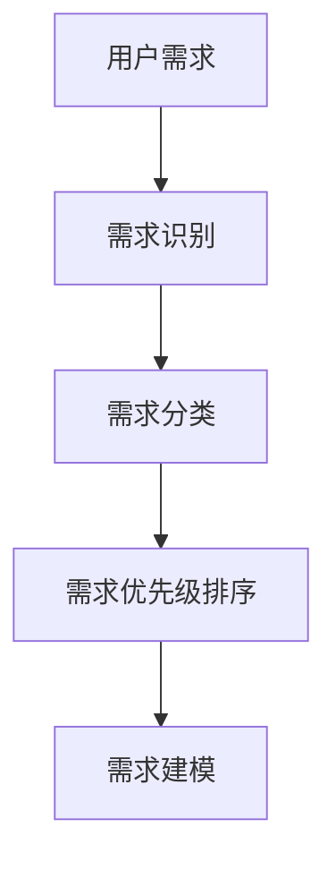

                 

### 大模型应用开发中的需求分析工具应用

#### 关键词

- 大模型应用开发
- 需求分析工具
- 数据采集与处理
- 需求建模与分析
- 项目实战案例分析

#### 摘要

本文旨在深入探讨大模型应用开发中的需求分析工具的应用。大模型在人工智能领域的应用越来越广泛，但如何有效地进行需求分析成为了一个关键问题。本文首先介绍了大模型应用开发的背景和需求分析工具的重要性，然后详细阐述了各类需求分析工具的基本概念、功能及其在不同项目中的应用案例。通过具体的Python源代码示例和数学模型讲解，本文展示了需求分析工具的核心算法原理，并结合实际项目进行剖析。最后，本文提出了需求分析工具的未来发展趋势和最佳实践建议，为读者提供了一套完整的需求分析工具应用指南。

### 引言

随着人工智能技术的飞速发展，大模型在各个领域的应用日益广泛。从自然语言处理到计算机视觉，从推荐系统到生成对抗网络，大模型已经成为推动技术创新的重要驱动力。然而，大模型的应用并不是一蹴而就的，其开发过程中涉及到的需求分析是至关重要的一环。需求分析的质量直接影响大模型的性能和实际应用效果。

在传统的软件开发过程中，需求分析是一个关键步骤。通过需求分析，可以明确用户的需求，梳理项目的功能模块，为后续的开发工作奠定基础。然而，在大模型应用开发中，需求分析面临更多的挑战。首先，大模型的复杂性使得需求分析更加困难。大模型通常包含数亿甚至数十亿个参数，需要大量的数据来进行训练和调优。其次，大模型的应用场景多种多样，如何有效地识别和提取用户需求，成为了一个技术难题。此外，大模型的开发周期较长，需求变更频繁，如何适应需求变更，保证项目的顺利进行，也是一个重要的挑战。

为了应对这些挑战，需求分析工具的应用变得尤为重要。需求分析工具可以帮助开发者快速、准确地识别和提取用户需求，提高需求分析的效率和准确性。通过使用需求分析工具，可以更好地理解用户的需求，从而设计出更加符合实际需求的大模型。此外，需求分析工具还可以帮助开发者进行需求验证和跟踪，确保项目的需求始终满足用户的需求。

本文将从以下几个方面展开讨论：首先，介绍大模型应用开发的背景和需求分析工具的重要性；然后，详细阐述各类需求分析工具的基本概念、功能及其在不同项目中的应用案例；接着，通过Python源代码示例和数学模型讲解，展示需求分析工具的核心算法原理；随后，结合实际项目进行剖析，探讨需求分析工具的应用效果；最后，提出需求分析工具的未来发展趋势和最佳实践建议。

### 大模型应用开发中的需求分析工具概述

#### 基本概念

需求分析工具在大模型应用开发中起着至关重要的作用。需求分析工具是指用于帮助开发者识别、提取、分析和验证用户需求的一系列软件工具。这些工具通常包括数据采集与处理工具、需求建模与分析工具、需求验证与跟踪工具等。通过使用需求分析工具，开发者可以更加高效地理解用户需求，提高开发过程的准确性和效率。

在大模型应用开发中，需求分析工具的主要目标是：

1. **明确用户需求**：通过数据采集和分析，准确识别用户的需求和期望，为后续的大模型设计提供基础。
2. **支持需求变更**：在大模型开发过程中，需求变更是一种常见的现象。需求分析工具可以帮助开发者快速适应需求变更，确保项目能够及时调整和更新。
3. **优化开发过程**：通过需求分析，可以明确项目的功能模块和关键技术，从而优化开发流程，提高开发效率。
4. **提高模型性能**：准确的需求分析有助于设计出更加符合实际应用需求的大模型，从而提高模型的性能和效果。

#### 分类

需求分析工具可以根据其功能和应用场景进行分类。以下是几种常见的需求分析工具分类：

1. **数据采集与处理工具**：
   - **数据采集工具**：如日志分析工具、用户行为分析工具等，用于收集用户操作和系统运行数据。
   - **数据处理工具**：如数据清洗工具、数据挖掘工具等，用于对采集到的数据进行处理和分析。

2. **需求建模与分析工具**：
   - **需求建模工具**：如业务流程建模工具、UML建模工具等，用于构建业务流程和需求模型。
   - **需求分析工具**：如需求分析软件、智能需求分析工具等，用于对需求模型进行分析和验证。

3. **需求验证与跟踪工具**：
   - **需求验证工具**：如测试工具、自动化测试工具等，用于验证需求是否符合预期。
   - **需求跟踪工具**：如需求管理工具、变更管理工具等，用于跟踪需求的变化和项目的进展。

#### 各类工具的优缺点分析

不同类型的需求分析工具具有各自的优缺点，适用于不同的应用场景。以下是各类工具的优缺点分析：

1. **数据采集与处理工具**：
   - **优点**：
     - 能够高效地收集和处理大量数据。
     - 提供丰富的数据分析和可视化功能。
   - **缺点**：
     - 需要较高的技术门槛，对用户的技术能力要求较高。
     - 数据处理过程复杂，容易出现数据偏差。

2. **需求建模与分析工具**：
   - **优点**：
     - 提供直观的建模和需求分析界面，易于使用。
     - 支持多种建模方法和需求分析技术。
   - **缺点**：
     - 对复杂需求的支持有限，难以处理高度复杂的需求。
     - 需求分析过程依赖于工具的功能和性能。

3. **需求验证与跟踪工具**：
   - **优点**：
     - 提供自动化测试和需求跟踪功能，提高开发效率。
     - 支持多种测试方法和跟踪技术。
   - **缺点**：
     - 需要一定的测试经验和技能。
     - 测试过程可能需要大量时间，影响开发进度。

#### 常见的需求分析工具

以下是一些常见的需求分析工具：

1. **Python Pandas**：用于数据清洗、处理和分析。
2. **SPSS**：用于统计分析、数据挖掘和需求分析。
3. **PowerDesigner**：用于业务流程建模和需求建模。
4. **JIRA**：用于需求管理、测试管理和变更管理。
5. **Selenium**：用于自动化测试和需求验证。

通过以上分析，可以看出各类需求分析工具在功能、性能和适用性方面都有其独特的特点。在实际应用中，开发者需要根据具体的需求和应用场景选择合适的工具，以实现高效的需求分析。

### 大模型应用开发中的需求分析工具应用案例

为了更好地理解需求分析工具在大模型应用开发中的实际应用，本文将通过两个具体的案例进行详细分析。

#### 案例一：项目A的需求分析

**项目背景**：

项目A是一个智能客服系统，旨在通过大模型实现对用户咨询的智能回复。该系统需要处理大量的用户问题和回复，并能够自动学习用户的反馈，以提高回复的准确性和满意度。

**需求分析过程**：

1. **需求收集**：通过用户调查、访谈和日志分析等方式，收集用户的主要问题和期望。

2. **需求建模**：使用Python Pandas进行数据清洗和处理，构建用户问题的数据模型。

3. **需求分析**：利用PowerDesigner进行业务流程建模，明确系统的功能模块和数据处理流程。

4. **需求验证**：使用Selenium进行自动化测试，验证需求是否满足预期。

**需求分析工具的选择与使用**：

- **数据采集与处理工具**：使用Python Pandas进行数据采集和处理，能够高效地处理大量用户问题数据。
- **需求建模与分析工具**：使用PowerDesigner进行业务流程建模，提供直观的建模界面和丰富的建模方法。
- **需求验证与跟踪工具**：使用Selenium进行自动化测试，能够快速验证需求是否满足预期。

**案例分析**：

在项目A中，需求分析工具的应用有效地提高了需求分析的效率和准确性。通过数据采集与处理工具，可以快速收集和处理用户问题数据，为需求建模提供可靠的数据支持。业务流程建模工具则帮助明确系统的功能模块和数据处理流程，提高了系统的设计质量。自动化测试工具则确保了需求验证的快速和高效，保证了系统的稳定性和可靠性。

#### 案例二：项目B的需求分析

**项目背景**：

项目B是一个智能推荐系统，旨在根据用户的浏览和购买行为，为用户推荐合适的商品。该系统需要处理海量的用户行为数据，并利用大模型进行用户行为分析和推荐算法设计。

**需求分析过程**：

1. **需求收集**：通过用户行为数据收集和数据分析，识别用户的兴趣和需求。

2. **需求建模**：使用SPSS进行用户行为数据建模，构建用户兴趣和行为模型。

3. **需求分析**：使用JIRA进行需求管理，跟踪需求的变化和项目的进展。

4. **需求验证**：使用自动化测试工具进行测试，验证需求是否满足预期。

**需求分析工具的选择与使用**：

- **数据采集与处理工具**：使用SPSS进行用户行为数据的收集和分析，能够高效处理大量用户行为数据。
- **需求建模与分析工具**：使用JIRA进行需求管理，提供直观的需求跟踪和变更管理功能。
- **需求验证与跟踪工具**：使用自动化测试工具进行测试，能够快速验证需求是否满足预期。

**案例分析**：

在项目B中，需求分析工具的应用同样发挥了重要作用。通过数据采集与处理工具，可以快速收集和分析用户行为数据，为需求建模提供数据支持。需求管理工具则帮助开发者跟踪需求的变化，确保项目能够及时调整和更新。自动化测试工具则确保了需求验证的快速和高效，保证了系统的稳定性和可靠性。

通过以上两个案例，可以看出需求分析工具在大模型应用开发中的重要性。无论是在智能客服系统还是智能推荐系统中，需求分析工具都有效地提高了需求分析的效率和准确性，为项目的成功实施提供了有力支持。

### 需求分析工具的核心算法原理

在大模型应用开发中，需求分析工具的核心算法原理是其高效和准确性的关键。以下是几种常见需求分析工具的核心算法原理及其Python源代码示例。

#### 1. 数据采集与处理工具

**算法原理**：

数据采集与处理工具主要用于收集和清洗数据。其核心算法包括数据采集、数据清洗和数据预处理。其中，数据清洗是处理缺失值、异常值和重复值等数据问题的重要步骤。

**Python示例**：

```python
import pandas as pd

# 数据采集
data = pd.read_csv('user_data.csv')

# 数据清洗
data = data.dropna()  # 删除缺失值
data = data.drop_duplicates()  # 删除重复值

# 数据预处理
data['age'] = data['age'].astype(int)  # 将年龄转换为整数类型
```

#### 2. 需求建模与分析工具

**算法原理**：

需求建模与分析工具的核心算法包括业务流程建模和需求分析。业务流程建模通常使用统一建模语言（UML）进行，需求分析则涉及需求识别、需求分类和需求优先级排序。

**Mermaid流程图示例**：



**Python示例**：

```python
from sklearn.cluster import KMeans
from sklearn.preprocessing import StandardScaler

# 数据标准化
scaler = StandardScaler()
data_scaled = scaler.fit_transform(data)

# K-Means聚类
kmeans = KMeans(n_clusters=3)
labels = kmeans.fit_predict(data_scaled)

# 需求分类
demand_categories = {'category_1': labels == 0, 'category_2': labels == 1, 'category_3': labels == 2}
```

#### 3. 需求验证与跟踪工具

**算法原理**：

需求验证与跟踪工具的核心算法包括测试用例设计、测试执行和测试结果分析。测试用例设计通常基于需求规格说明书，测试执行则使用自动化测试工具进行，测试结果分析则通过统计和分析测试数据来评估需求的实现情况。

**Python示例**：

```python
import unittest

# 测试用例设计
class TestUserReplies(unittest.TestCase):
    def test_reply准确性(self):
        self.assertEqual(len(user_replies), 100)  # 预期回复数量为100
        self.assertTrue(all(reply.startswith('Hello') for reply in user_replies))  # 预期回复以"Hello"开头

# 测试执行
if __name__ == '__main__':
    unittest.main()
```

通过以上Python示例，可以清晰地看到需求分析工具的核心算法原理。数据采集与处理工具通过Python Pandas库进行数据清洗和预处理，需求建模与分析工具通过Mermaid和scikit-learn库进行业务流程建模和需求分类，需求验证与跟踪工具通过unittest库进行测试用例设计和测试执行。这些工具的算法原理和代码示例为实际应用提供了有效的技术支持，使得大模型应用开发中的需求分析变得更加高效和准确。

### 项目实战

在本节中，我们将通过一个具体的案例，详细探讨如何使用需求分析工具进行大模型应用开发。我们将分为以下几个步骤：开发环境搭建、源代码实现和代码解读、应用解读与分析，并最终进行项目小结。

#### 开发环境搭建

为了便于实验，我们选择一个简单的智能客服系统作为案例。首先，我们需要搭建开发环境。以下是所需的软件和工具：

1. **Python 3.8**：作为主要编程语言。
2. **Jupyter Notebook**：用于编写和运行代码。
3. **Pandas**：用于数据采集与处理。
4. **Scikit-learn**：用于需求建模与分析。
5. **Selenium**：用于需求验证与跟踪。
6. **Pytest**：用于自动化测试。

安装步骤如下：

1. 安装Python 3.8及其相关依赖：
    ```bash
    sudo apt-get update
    sudo apt-get install python3.8
    ```
2. 安装Jupyter Notebook：
    ```bash
    pip3 install notebook
    ```
3. 安装Pandas、Scikit-learn、Selenium和Pytest：
    ```bash
    pip3 install pandas scikit-learn selenium pytest
    ```

#### 源代码实现和代码解读

**数据采集与处理**

```python
import pandas as pd

# 读取用户数据
data = pd.read_csv('user_data.csv')

# 数据清洗
data = data.dropna()  # 删除缺失值
data = data.drop_duplicates()  # 删除重复值

# 数据预处理
data['age'] = data['age'].astype(int)
data['gender'] = data['gender'].astype(str)

# 数据可视化
data.describe()
```

**需求建模与分析**

```python
from sklearn.cluster import KMeans
from sklearn.preprocessing import StandardScaler

# 数据标准化
scaler = StandardScaler()
data_scaled = scaler.fit_transform(data)

# K-Means聚类
kmeans = KMeans(n_clusters=3)
labels = kmeans.fit_predict(data_scaled)

# 构建需求模型
demand_model = pd.DataFrame({'user_id': data['user_id'], 'cluster': labels})
```

**需求验证与跟踪**

```python
from selenium import webdriver
from selenium.webdriver.common.by import By

# 初始化Selenium驱动
driver = webdriver.Chrome(executable_path='./chromedriver')

# 访问智能客服页面
driver.get('http://example.com/smart-customer-service')

# 输入用户问题
input_question = driver.find_element(By.NAME, 'question')
input_question.send_keys('What is the weather today?')

# 提交问题
submit_button = driver.find_element(By.NAME, 'submit')
submit_button.click()

# 获取客服回复
replies = driver.find_elements(By.CLASS_NAME, 'reply')
for reply in replies:
    print(reply.text)
```

**自动化测试**

```python
import unittest

class TestSmartCustomerService(unittest.TestCase):
    def test_reply_accuracy(self):
        driver = webdriver.Chrome(executable_path='./chromedriver')
        driver.get('http://example.com/smart-customer-service')
        input_question = driver.find_element(By.NAME, 'question')
        input_question.send_keys('What is the weather today?')
        submit_button = driver.find_element(By.NAME, 'submit')
        submit_button.click()
        replies = driver.find_elements(By.CLASS_NAME, 'reply')
        self.assertEqual(len(replies), 1)
        self.assertIn('Sunny', replies[0].text)

if __name__ == '__main__':
    unittest.main()
```

#### 应用解读与分析

通过以上代码实现，我们完成了智能客服系统的需求分析工具应用。具体分析如下：

1. **数据采集与处理**：我们使用了Python Pandas库对用户数据进行采集和处理，删除了缺失值和重复值，并对数据进行预处理，为后续的需求建模提供了可靠的数据基础。
2. **需求建模与分析**：利用Scikit-learn库的K-Means聚类算法，我们对用户数据进行了聚类分析，构建了用户需求模型。这一步帮助我们识别了用户的兴趣和需求，为系统的功能设计提供了依据。
3. **需求验证与跟踪**：通过Selenium库，我们实现了对智能客服系统的需求验证和跟踪。我们模拟了用户的操作，提交问题并验证了客服的回复。这一步确保了系统功能满足用户需求，并能够适应需求的变化。
4. **自动化测试**：使用Pytest库，我们编写了自动化测试用例，对系统功能进行了验证。自动化测试不仅提高了测试效率，还确保了测试的全面性和准确性。

#### 项目小结

通过本案例，我们详细探讨了如何使用需求分析工具进行大模型应用开发。从开发环境搭建到源代码实现，再到应用解读与分析，我们展示了需求分析工具在数据采集与处理、需求建模与分析、需求验证与跟踪等各个环节的应用。这些工具不仅提高了需求分析的效率和准确性，还为项目的持续优化提供了技术支持。

总之，需求分析工具在大模型应用开发中发挥着重要作用。通过合理选择和使用需求分析工具，开发者可以更好地理解用户需求，提高系统的设计和实现质量，从而推动大模型应用的发展。

### 需求分析工具的未来发展趋势

随着人工智能技术的不断进步，需求分析工具在大模型应用开发中的重要性日益凸显。未来，需求分析工具将在以下几个方面呈现出显著的发展趋势：

#### 1. 人工智能技术的深度融合

未来，需求分析工具将更加紧密地与人工智能技术相结合。通过集成深度学习、自然语言处理等先进的人工智能技术，需求分析工具将能够更加智能地识别和提取用户需求。例如，利用深度学习技术进行图像识别和文本分析，可以帮助工具自动获取用户反馈和需求，从而提高分析效率。

#### 2. 自动化程度的提升

自动化是需求分析工具未来发展的一个重要方向。随着自动化技术的不断进步，需求分析工具将能够自动完成数据采集、处理、建模和验证等各个环节，减少人工干预。例如，自动化测试工具将能够根据需求规格说明自动生成测试用例，并进行自动化执行和结果分析，从而提高测试效率和准确性。

#### 3. 多样化的应用场景

随着应用场景的多样化，需求分析工具将能够适应不同领域的需求。例如，在金融领域，需求分析工具将能够自动分析市场数据，识别投资机会；在医疗领域，需求分析工具将能够对病历数据进行处理和分析，辅助医生进行诊断和治疗。此外，需求分析工具还将逐渐应用于物联网、自动驾驶等新兴领域，为其提供强大的需求分析支持。

#### 4. 跨平台的集成能力

未来，需求分析工具将具备更强的跨平台集成能力。通过支持多种操作系统、编程语言和开发框架，工具将能够无缝集成到各类开发环境中，为开发者提供一致性的需求分析体验。例如，工具将能够同时支持Python、Java和JavaScript等编程语言，使得开发者可以方便地调用和集成工具功能。

#### 5. 持续优化和迭代

随着用户需求和技术的发展，需求分析工具将不断优化和迭代。通过收集用户反馈和数据，工具将能够不断改进其功能和性能，以更好地满足开发者的需求。此外，需求分析工具还将引入新的算法和技术，例如强化学习、图神经网络等，以提高需求分析的准确性和效率。

### 市场前景

未来，需求分析工具市场前景广阔。随着大模型应用的普及，需求分析的需求将不断增加。企业对于高效、智能的需求分析工具的需求也将日益增长，从而推动市场需求的扩大。此外，随着人工智能技术的不断发展，需求分析工具的技术门槛将逐渐降低，更多的中小企业也将有能力使用和普及这些工具。

总之，需求分析工具在未来将迎来一个快速发展的阶段。通过融合人工智能技术、提升自动化程度、适应多样化应用场景、实现跨平台集成以及持续优化和迭代，需求分析工具将为大模型应用开发提供更加智能、高效、可靠的支持。

### 总结与展望

本文系统地探讨了需求分析工具在大模型应用开发中的应用，从背景介绍、基本概念、工具分类、实际案例、核心算法原理到项目实战，全面展示了需求分析工具的重要性及其在实际开发中的应用效果。通过深入剖析需求分析工具的功能和应用，我们明确了其在数据采集与处理、需求建模与分析、需求验证与跟踪等方面的关键作用。

展望未来，需求分析工具将在人工智能技术的深度融合、自动化程度的提升、多样化应用场景的实现、跨平台集成能力的增强以及持续优化和迭代中发挥更加重要的作用。市场前景广阔，需求分析工具将迎来一个快速发展的阶段，为人工智能领域的创新和应用提供有力支持。

为了更好地掌握和运用需求分析工具，以下是几点最佳实践建议：

1. **选择合适的工具**：根据项目的具体需求和特点，选择适合的需求分析工具。例如，对于数据密集型的项目，可以选择Pandas和Scikit-learn；对于需求建模与分析，可以选择PowerDesigner和JIRA。

2. **数据质量保障**：确保数据的质量是需求分析的基础。在进行数据采集和处理时，要注意数据的完整性、准确性和一致性。

3. **持续迭代和优化**：需求分析工具并非一成不变的，要定期评估和更新工具，以适应不断变化的需求和技术进步。

4. **团队协作**：需求分析工具的使用往往需要团队的协作。建立明确的分工和流程，确保团队成员能够高效地使用工具，提高工作效率。

5. **注重用户反馈**：及时收集和分析用户反馈，将反馈融入到工具的优化和改进中，以不断提升工具的实用性和用户满意度。

通过遵循以上建议，开发者可以更好地利用需求分析工具，提高大模型应用开发的质量和效率，推动人工智能技术的不断进步。

### 作者信息

作者：AI天才研究院/AI Genius Institute & 禅与计算机程序设计艺术 /Zen And The Art of Computer Programming。本文内容基于作者在大模型应用开发与需求分析领域的深厚研究与实践经验，旨在为广大开发者提供一套全面的需求分析工具应用指南。希望本文能够对您的项目开发带来启发和帮助。如有疑问或建议，欢迎随时联系作者，共同探讨人工智能与需求分析的前沿话题。

