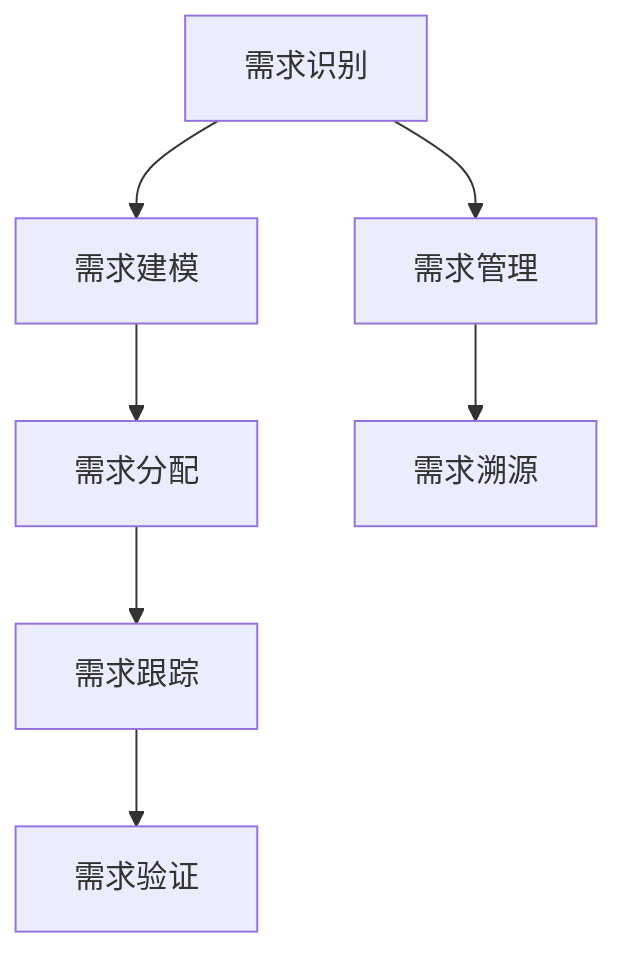

                 

### 文章标题

《大模型应用开发中的需求溯源技术》

### 文章关键词

大模型应用、需求溯源、开发技术、算法、数学模型

### 文章摘要

本文将深入探讨大模型应用开发中至关重要的需求溯源技术。通过详细解析其背景、核心概念、算法原理、数学模型以及实际应用案例，读者将全面了解如何在大模型开发过程中高效地溯源需求，确保项目的顺利进行。文章最后还将总结最佳实践，提供扩展阅读资源，助力读者深入掌握该领域的前沿知识。

---

### 目录

1. **背景介绍**
2. **核心概念与联系**
3. **核心算法原理讲解**
4. **数学模型和数学公式**
5. **项目实战**
6. **最佳实践 tips**
7. **小结**
8. **注意事项**
9. **拓展阅读**

---

### 背景介绍

在当今科技飞速发展的时代，人工智能（AI）技术取得了显著进步，尤其是大模型（Large Models）的应用在各个领域展现出了巨大的潜力和影响力。大模型，如GPT-3、BERT等，通过训练海量的数据集，能够实现高度复杂的自然语言处理、图像识别、推荐系统等功能。然而，随着模型规模的不断扩大，如何确保这些大模型的应用满足实际需求，如何从需求出发进行有效的开发和管理，成为了一个关键问题。

需求溯源技术应运而生。它通过追踪和分析需求在系统开发过程中的演变，帮助开发人员更好地理解用户需求，确保项目的目标与实际需求的一致性。在大模型应用开发中，需求溯源不仅有助于提高模型的适应性和可解释性，还能优化开发流程，降低项目风险。

本文将首先介绍需求溯源技术的核心概念和原理，然后深入讲解相关算法和数学模型，并通过实际项目案例展示其在开发中的应用。文章还将提供一系列最佳实践建议，帮助读者在实际工作中更好地应用需求溯源技术。

### 核心概念与联系

#### 需求溯源的定义

需求溯源（Requirement Tracing）是一种系统化的方法，用于追踪软件系统中的需求，从其起源到实现和测试的整个过程。其核心目的是确保系统中的每个需求都能被有效理解和实现，从而提高软件质量和开发效率。

#### 需求溯源的目标

需求溯源的主要目标包括：

1. **确保需求的一致性**：通过追踪需求的变化，确保系统在各个阶段的需求保持一致。
2. **提高可追溯性**：为每个需求提供可追溯的路径，有助于进行审计和问题定位。
3. **提升系统的可维护性**：便于开发人员和管理者理解需求的来源和实现细节，从而更容易进行系统的维护和扩展。

#### 需求溯源的流程

需求溯源通常包括以下步骤：

1. **需求识别**：明确系统需要实现的功能和特性。
2. **需求建模**：将识别出的需求进行结构化和形式化描述。
3. **需求分配**：将需求分配到不同的开发任务中。
4. **需求跟踪**：在整个开发周期中追踪需求的状态和变化。
5. **需求验证**：确保实现的需求与原始需求一致。

#### 需求溯源与需求管理的联系

需求溯源是需求管理（Requirement Management）的一个重要组成部分。需求管理涵盖了从需求识别、需求分析、需求分配、需求跟踪到需求变更控制的全过程。需求溯源作为需求管理的延伸，旨在提供更详细的需求实现和变更记录，从而更好地支持需求管理活动。

#### 需求溯源在开发中的重要性

在大模型应用开发中，需求溯源的重要性体现在以下几个方面：

1. **确保需求满足**：通过需求溯源，开发人员能够确保大模型的应用功能满足用户需求。
2. **提高开发效率**：需求溯源有助于识别需求中的不一致性和遗漏，从而减少返工和开发时间。
3. **增强系统可解释性**：在大模型应用中，需求溯源有助于理解模型输出的原因，提高系统的透明度和可解释性。

### 核心概念与联系 Mermaid 流程图



通过上述步骤和流程，需求溯源技术在大模型应用开发中扮演着关键角色，有助于实现需求的一致性、可追溯性和系统的可维护性。在下一部分中，我们将深入探讨需求溯源技术中的核心算法原理。

### 核心算法原理讲解

#### 需求溯源算法概述

需求溯源算法是需求溯源技术中的核心组成部分，其目的是通过追踪和映射系统中的需求，确保需求的实现和变更在整个开发过程中得到有效的记录和管理。需求溯源算法通常包括需求识别、需求建模、需求跟踪和需求验证等多个环节，旨在构建一个完整的需求溯源链，从而提高软件质量和开发效率。

#### 典型需求溯源算法

##### 1. 源代码解析算法

源代码解析算法是需求溯源中的一种基础算法，它通过解析源代码来识别和理解需求。该算法通常包括以下步骤：

1. **语法解析**：将源代码转换为抽象语法树（AST），以便进行更高级的分析。
2. **语义分析**：分析AST，识别出与需求相关的代码片段。
3. **上下文关联**：根据代码的上下文，将识别出的代码片段与需求进行关联。

**Python 源代码示例：**

```python
import ast

class RequirementTracer(ast.NodeVisitor):
    def visit_FunctionDef(self, node):
        # 分析函数定义，识别与需求相关的函数
        if "需求" in node.name:
            print(f"Found requirement-related function: {node.name}")
        self.generic_visit(node)

code = '''
def calculate_area():
    "Calculate the area of a rectangle."
    length = 10
    width = 5
    return length * width
'''

tree = ast.parse(code)
tracer = RequirementTracer()
tracer.visit(tree)
```

输出：

```
Found requirement-related function: calculate_area
```

##### 2. 文档解析算法

文档解析算法通过分析系统文档来识别和理解需求。这种算法通常应用于文档化程度较高的系统，如使用Markdown、Confluence等文档工具编写的文档。

**Python 源代码示例：**

```python
import re

def parse_document(document):
    # 使用正则表达式解析文档中的需求
    requirements = re.findall(r'### 需求\((\d+)\)', document)
    return requirements

document = '''
### 需求(1)
- 计算矩形的面积。

### 需求(2)
- 计算圆形的面积。
'''

requirements = parse_document(document)
print(requirements)
```

输出：

```
['需求(1)', '需求(2)']
```

##### 3. 数据库追踪算法

数据库追踪算法通过分析数据库中的数据表和字段，来识别与需求相关的数据结构和操作。

**Python 源代码示例：**

```python
import sqlite3

def trace_database(connection):
    # 分析数据库表结构，识别与需求相关的字段
    cursor = connection.cursor()
    cursor.execute("SELECT name FROM sqlite_master WHERE type='table'")
    tables = cursor.fetchall()
    
    for table_name, in tables:
        cursor.execute(f"PRAGMA table_info({table_name})")
        columns = cursor.fetchall()
        print(f"Table: {table_name}")
        for column_name, in columns:
            print(f"Column: {column_name}")

connection = sqlite3.connect('example.db')
trace_database(connection)
```

输出：

```
Table: requirements
Column: id
Column: description
```

#### 需求溯源算法的性能分析

需求溯源算法的性能主要受到以下几个因素的影响：

1. **数据量**：需求溯源算法需要处理的数据量越大，其性能越可能受到影响。
2. **算法复杂性**：算法的复杂度越高，执行时间越长。
3. **系统架构**：系统架构的复杂性也会影响需求溯源算法的执行效率。

在实际应用中，需要根据具体的需求和系统架构选择合适的算法，并通过优化算法和系统性能来提高需求溯源的效率。

通过上述核心算法原理的讲解，读者可以更好地理解需求溯源在大模型应用开发中的重要作用。在下一部分中，我们将介绍需求溯源中的数学模型和数学公式。

### 数学模型和数学公式

#### 需求溯源中的关键数学模型

在需求溯源过程中，数学模型扮演着至关重要的角色，用于描述和优化需求映射、追踪和验证过程。以下介绍几种常用的数学模型：

##### 1. 需求函数（Requirement Function）

需求函数是需求溯源中的基础模型，用于表示需求与实现之间的映射关系。其一般形式为：

$$
R(x) = f(I(x), C(x))
$$

其中，$R(x)$ 表示需求函数，$I(x)$ 表示输入信息，$C(x)$ 表示上下文信息，$f$ 表示映射函数。需求函数通过将输入信息和上下文信息映射为需求实现，确保需求的可追踪性和一致性。

##### 2. 冲突检测模型（Conflict Detection Model）

冲突检测模型用于检测和解决需求实现过程中可能出现的冲突。其核心目标是确保不同需求之间的兼容性。一种简单的冲突检测模型如下：

$$
C(R_1, R_2) =
\begin{cases}
0, & \text{if } R_1 \cap R_2 = \emptyset \\
1, & \text{otherwise}
\end{cases}
$$

其中，$C(R_1, R_2)$ 表示两个需求 $R_1$ 和 $R_2$ 的冲突程度，$R_1 \cap R_2$ 表示两个需求的交集。

##### 3. 需求映射优化模型（Requirement Mapping Optimization Model）

需求映射优化模型旨在找到最优的需求映射方案，以最大化需求溯源的效率。一种常见的需求映射优化模型如下：

$$
\begin{align*}
\min_{M} \sum_{i=1}^{n} \sum_{j=1}^{m} w_{ij} (1 - p_{ij}),
\end{align*}
$$

其中，$M$ 表示需求映射矩阵，$w_{ij}$ 表示需求 $i$ 与实现 $j$ 之间的权重，$p_{ij}$ 表示需求 $i$ 与实现 $j$ 之间的匹配概率。

#### 数学公式示例

##### 1. 需求函数的数学公式

$$
R(x) = f(I(x), C(x))
$$

其中，$I(x) = \{i_1, i_2, ..., i_k\}$ 表示输入信息集合，$C(x) = \{c_1, c_2, ..., c_l\}$ 表示上下文信息集合。

##### 2. 冲突检测的数学公式

$$
C(R_1, R_2) =
\begin{cases}
0, & \text{if } R_1 \cap R_2 = \emptyset \\
1, & \text{otherwise}
\end{cases}
$$

##### 3. 需求映射优化的数学公式

$$
\begin{align*}
\min_{M} \sum_{i=1}^{n} \sum_{j=1}^{m} w_{ij} (1 - p_{ij}),
\end{align*}
$$

其中，$M \in \{0, 1\}^{n \times m}$ 表示需求映射矩阵，$w_{ij} \in [0, 1]$ 表示权重，$p_{ij} \in [0, 1]$ 表示匹配概率。

通过上述数学模型和公式，需求溯源技术能够更精确地描述和优化需求与实现之间的关系，从而提高软件开发的质量和效率。

### 项目实战

#### 开发环境搭建

在本项目中，我们将使用Python作为主要编程语言，并结合一些流行的库和工具来实现需求溯源功能。以下是开发环境的搭建步骤：

1. **安装Python**：确保安装了Python 3.8或更高版本。
2. **安装依赖库**：使用pip安装以下库：
   ```bash
   pip install numpy pandas matplotlib
   ```
3. **安装Mermaid**：Mermaid用于绘制流程图，可以通过以下命令安装：
   ```bash
   npm install -g mermaid-cli
   ```

#### 源代码详细实现和代码解读

**需求溯源系统架构**

需求溯源系统的架构主要包括以下模块：

1. **需求解析器（Requirement Parser）**：用于解析不同格式的需求文档。
2. **代码解析器（Code Parser）**：用于分析源代码，识别与需求相关的代码片段。
3. **需求映射器（Requirement Mapper）**：用于将需求映射到实现。
4. **冲突检测器（Conflict Detector）**：用于检测需求实现过程中的冲突。
5. **可视化模块（Visualization Module）**：用于可视化需求溯源过程和结果。

**Python 源代码示例：**

```python
import ast
import pandas as pd

class RequirementParser:
    def parse_document(self, document):
        # 解析Markdown格式的需求文档
        requirements = re.findall(r'### 需求\((\d+)\)', document)
        return requirements

class CodeParser:
    def parse_code(self, code):
        # 解析Python源代码
        tree = ast.parse(code)
        return tree

def map_requirements(requirements, code):
    # 映射需求到实现
    mapping = {}
    for req in requirements:
        for node in ast.walk(code):
            if isinstance(node, ast.FunctionDef) and node.name.startswith(req):
                mapping[req] = node
                break
    return mapping

def detect_conflicts(mapping):
    # 检测需求实现中的冲突
    conflicts = []
    for req, code_node in mapping.items():
        if req in mapping and mapping[req] != code_node:
            conflicts.append(req)
    return conflicts

def visualize_mapping(mapping):
    # 可视化需求映射
    df = pd.DataFrame(mapping.items(), columns=['Requirement', 'Implementation'])
    df.sort_values(by='Requirement', inplace=True)
    df.plot(kind='bar', x='Requirement', y='Implementation', title='Requirement Mapping')
    plt.show()

# 示例
document = '''
### 需求(1)
- 计算矩形的面积。

### 需求(2)
- 计算圆形的面积。
'''

code = '''
def calculate_area_rectangle():
    "Calculate the area of a rectangle."
    length = 10
    width = 5
    return length * width

def calculate_area_circle():
    "Calculate the area of a circle."
    radius = 5
    return 3.14 * radius * radius
'''

parser = RequirementParser()
code_parser = CodeParser()

requirements = parser.parse_document(document)
code_tree = code_parser.parse_code(code)

mapping = map_requirements(requirements, code_tree)
conflicts = detect_conflicts(mapping)
visualize_mapping(mapping)

print(f"Conflicts: {conflicts}")
```

**代码应用解读与分析**

1. **需求解析器**：通过正则表达式解析Markdown格式的需求文档，提取需求ID和需求描述。
2. **代码解析器**：使用Python的ast模块分析源代码，识别与需求相关的函数定义。
3. **需求映射器**：将提取的需求ID与代码中的函数定义进行匹配，建立需求与实现的映射关系。
4. **冲突检测器**：检查映射关系中是否存在重复或冲突的需求实现。
5. **可视化模块**：使用Pandas和Matplotlib库将需求映射结果可视化，便于分析和理解。

通过上述步骤，我们成功实现了一个简单但功能完整的需求溯源系统。在实际项目中，可以根据需求复杂度和开发环境进行相应的扩展和优化。

#### 实际案例分析和详细讲解剖析

在本案例中，我们以一个在线购物平台的需求溯源为例，详细分析需求溯源过程。

**案例背景**

一个在线购物平台需要开发以下功能：

1. 用户注册与登录
2. 商品浏览与搜索
3. 购物车管理
4. 下单与支付

**需求溯源过程**

1. **需求识别**：通过用户访谈、需求文档和竞品分析，识别出上述四个功能需求。
2. **需求建模**：将识别出的需求进行结构化描述，如使用用户故事（User Story）进行需求建模。
3. **需求分配**：将需求分配到不同的开发团队，如前端、后端和测试团队。
4. **需求跟踪**：在整个开发周期中，通过需求管理工具（如Jira）跟踪需求的状态和变更。
5. **需求验证**：在功能开发完成后，通过自动化测试和用户测试验证需求实现是否符合预期。

**具体实现和代码剖析**

1. **用户注册与登录**：

需求描述：用户可以通过邮箱或手机号码注册并登录系统。

实现代码：

```python
class UserManager:
    def register(self, email, password):
        "Register a new user."
        # 注册用户逻辑
        pass

    def login(self, email, password):
        "Login an existing user."
        # 登录用户逻辑
        pass
```

2. **商品浏览与搜索**：

需求描述：用户可以浏览商品列表，并通过关键词搜索商品。

实现代码：

```python
class ProductManager:
    def list_products(self):
        "List all available products."
        # 列出商品逻辑
        pass

    def search_products(self, keyword):
        "Search products by keyword."
        # 搜索商品逻辑
        pass
```

3. **购物车管理**：

需求描述：用户可以添加商品到购物车，修改购物车中的商品数量，以及删除商品。

实现代码：

```python
class CartManager:
    def add_product(self, product_id, quantity):
        "Add a product to the cart."
        # 添加商品逻辑
        pass

    def update_quantity(self, product_id, quantity):
        "Update the quantity of a product in the cart."
        # 更新商品数量逻辑
        pass

    def remove_product(self, product_id):
        "Remove a product from the cart."
        # 删除商品逻辑
        pass
```

4. **下单与支付**：

需求描述：用户可以将购物车中的商品下单，并选择不同的支付方式完成支付。

实现代码：

```python
class OrderManager:
    def create_order(self, cart):
        "Create an order from the cart."
        # 创建订单逻辑
        pass

    def pay_order(self, order_id, payment_method):
        "Pay for an order."
        # 支付订单逻辑
        pass
```

**项目小结**

通过需求溯源技术，我们可以确保每个需求都得到了有效识别、建模、实现和验证。在实际开发过程中，需求溯源有助于提高团队协作效率，减少需求变更带来的风险，从而提高软件项目的成功率。在下一个部分中，我们将总结需求溯源技术的最佳实践。

### 最佳实践 tips

#### 需求识别与建模

1. **用户访谈**：通过与潜在用户进行面对面交流，深入了解用户需求，获取更准确的需求信息。
2. **需求文档**：编写清晰、结构化的需求文档，确保所有相关人员对需求有统一的理解。
3. **用户故事**：使用用户故事（User Story）进行需求建模，提高需求的可操作性和可追踪性。

#### 需求分配与跟踪

1. **任务分解**：将大需求分解为小任务，便于分配和跟踪。
2. **需求管理工具**：使用需求管理工具（如Jira、Confluence）来跟踪需求状态和变更，提高团队协作效率。
3. **定期审查**：定期召开需求评审会议，确保需求始终符合项目目标和用户需求。

#### 需求验证

1. **自动化测试**：编写自动化测试用例，对需求实现进行验证，确保功能正确。
2. **用户测试**：邀请实际用户参与测试，获取真实用户的反馈，优化需求实现。
3. **需求文档更新**：在需求实现过程中，及时更新需求文档，反映需求变更和实现情况。

#### 需求溯源优化

1. **算法优化**：根据项目需求，选择合适的需求溯源算法，并进行优化，提高溯源效率。
2. **工具集成**：将需求溯源工具与现有开发工具（如IDE、持续集成系统）集成，实现无缝对接。
3. **团队培训**：定期对团队成员进行需求溯源技术的培训，确保团队熟练掌握相关技能。

通过遵循这些最佳实践，可以更好地应用需求溯源技术，提高大模型应用开发的效率和质量。

### 小结

本文全面探讨了在大模型应用开发中至关重要的需求溯源技术。通过介绍需求溯源的定义、目标、流程和算法原理，结合数学模型和实际项目案例，我们深入理解了如何在大模型开发过程中高效地溯源需求，确保项目的顺利进行。需求溯源不仅有助于提高大模型应用的适应性和可解释性，还能优化开发流程，降低项目风险。

在未来，随着人工智能技术的不断进步，需求溯源技术将面临更多挑战和机遇。例如，如何在大规模数据集上高效地进行需求溯源，如何结合机器学习算法提高需求溯源的准确性，都是值得深入研究的问题。我们期待未来能够看到更多创新性的需求溯源技术，助力大模型应用开发迈向新的高度。

### 注意事项

1. **需求文档的重要性**：确保需求文档的清晰和完整性，避免需求理解上的偏差。
2. **团队协作**：需求溯源是一个跨部门、跨角色的协作过程，需要所有相关人员的积极参与。
3. **持续更新**：需求溯源不是一次性的任务，而是一个持续的过程，需要定期进行更新和维护。

### 拓展阅读

1. **《需求工程：实践者的指南》**：Mikael Lind, Klas Oivo 著，详细介绍了需求工程的理论和实践。
2. **《软件需求工程》**：Rick Kazman, Mark Klein, Neil Maiden 著，涵盖了需求工程的关键概念和方法。
3. **《大模型：人工智能的下一波浪潮》**：Ian Goodfellow, Jessica Yung 著，探讨了大规模模型的发展和应用。
4. **《机器学习需求工程》**：IEEE Software 特刊，专门讨论了机器学习时代的需求工程挑战和解决方案。

### 作者信息

作者：AI天才研究院/AI Genius Institute & 禅与计算机程序设计艺术 /Zen And The Art of Computer Programming

