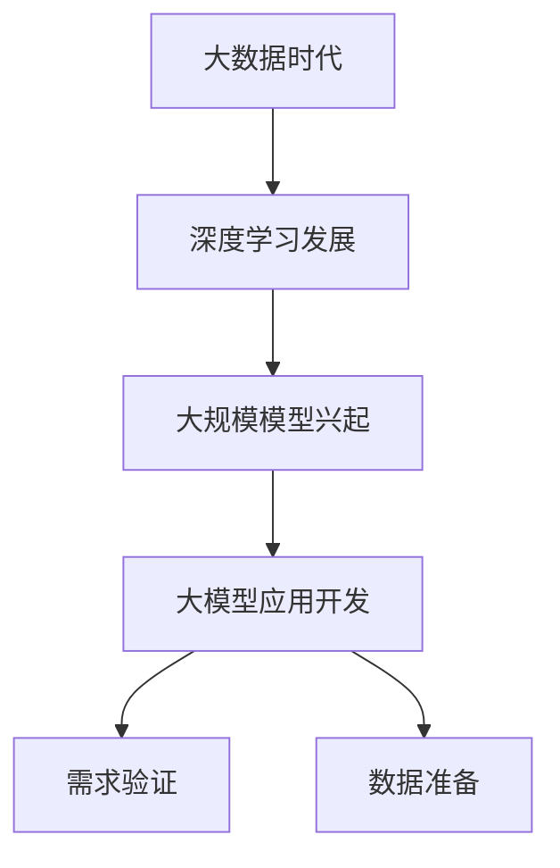

                 

### 引言

近年来，人工智能（AI）和机器学习（ML）技术的迅猛发展，带动了大规模模型（也称为“大模型”）在各个领域的广泛应用。大模型，通常是指那些具有数百万至数十亿参数的深度学习模型，如GPT-3、BERT等。这些模型因其强大的表示和学习能力，在自然语言处理、计算机视觉、语音识别等领域取得了显著的成果。然而，随着大模型应用场景的不断拓展，如何进行有效的需求验证和数据准备，成为了开发过程中的关键问题。

本文旨在探讨大模型应用开发中的需求验证和数据准备问题。首先，我们将回顾大模型应用开发的背景和技术框架，理解大模型的基本原理。接着，我们将深入分析需求验证的重要性，详细阐述需求收集、整理和验证的方法。随后，我们将讨论数据准备的关键步骤，包括数据收集、清洗、预处理和质量评估。为了更好地理解这些概念，我们将通过实际案例进行详细讲解。最后，本文将总结最佳实践，并提出未来研究方向。

关键词：大规模模型，需求验证，数据准备，深度学习，人工智能

摘要：
本文围绕大模型应用开发中的需求验证和数据准备问题，首先介绍了大模型的应用背景和技术框架，然后详细阐述了需求验证和数据准备的核心步骤和方法。通过实际案例的剖析，本文旨在帮助开发者更好地理解和应对大模型应用开发中的挑战。

---

### 大模型应用开发的背景

大模型的应用开发始于大数据时代的到来。随着互联网和物联网技术的快速发展，海量数据不断产生，如何从这些数据中提取有价值的信息成为了研究者们的焦点。深度学习作为人工智能领域的一项核心技术，因其能够自动从大量数据中学习特征和规律，被广泛应用于图像识别、自然语言处理、语音识别等多个领域。

大模型的兴起可以追溯到2012年，当时深度学习模型在ImageNet图像识别挑战中取得了突破性的成绩。此后，随着计算能力的提升和算法的优化，大模型的参数规模和计算复杂度不断增长。例如，GPT-3模型拥有1750亿个参数，BERT模型则有数亿个参数。这些大模型不仅具有强大的表示学习能力，还能在多个任务上实现高性能。

在大模型应用开发的背景下，需求验证和数据准备显得尤为重要。首先，需求验证能够确保模型开发方向正确，避免资源浪费。其次，数据准备的质量直接影响模型的效果，好的数据准备能够提升模型的性能和泛化能力。因此，理解大模型的应用背景和技术框架，对于后续的需求验证和数据准备工作至关重要。

#### 核心概念与联系

- **大数据**：指规模巨大、类型多样的数据集合，需要借助计算技术和算法进行有效管理和分析。
- **深度学习**：一种基于人工神经网络的学习方法，通过多层神经元的堆叠，实现对复杂数据的自动特征提取和学习。
- **大规模模型**：参数规模达到数十亿甚至更多的深度学习模型，具有强大的表示和学习能力。

##### Mermaid流程图



#### 核心算法原理讲解

在理解大模型的应用背景后，我们进一步探讨大模型的基本原理。大模型的构建通常涉及以下关键步骤：

1. **数据收集与预处理**：收集大量的标注数据，并对数据进行预处理，如数据清洗、归一化等。
2. **模型设计**：设计适合任务的神经网络架构，如Transformer、BERT等。
3. **训练过程**：通过优化算法，如随机梯度下降（SGD）、Adam等，调整模型参数以最小化损失函数。
4. **模型评估与调整**：评估模型在验证集上的表现，根据评估结果调整模型参数。

以下是一个简单的Python代码示例，展示了如何使用TensorFlow和Keras构建一个基于BERT的文本分类模型：

```python
import tensorflow as tf
from tensorflow.keras.models import Sequential
from tensorflow.keras.layers import Embedding, GlobalAveragePooling1D, Dense

# 模型构建
model = Sequential([
    Embedding(input_dim=vocab_size, output_dim=embedding_dim, input_length=max_sequence_length),
    GlobalAveragePooling1D(),
    Dense(units=1, activation='sigmoid')
])

# 编译模型
model.compile(optimizer='adam', loss='binary_crossentropy', metrics=['accuracy'])

# 模型训练
model.fit(x_train, y_train, epochs=10, batch_size=32, validation_data=(x_val, y_val))
```

##### 数学模型和数学公式

在模型训练过程中，常用的优化算法包括：

- **损失函数**：用于衡量模型预测值与真实值之间的差距，如交叉熵损失（Cross-Entropy Loss）。

\[ L(y, \hat{y}) = -\sum_{i=1}^{N} y_i \log(\hat{y}_i) \]

- **优化算法**：用于调整模型参数，以最小化损失函数，如随机梯度下降（SGD）。

\[ \theta_{t+1} = \theta_{t} - \alpha \nabla_{\theta} L(\theta) \]

其中，\( \theta \) 表示模型参数，\( \alpha \) 为学习率，\( \nabla_{\theta} L(\theta) \) 为损失函数关于参数 \( \theta \) 的梯度。

##### 项目实战

以文本分类任务为例，我们将通过一个实际项目来展示大模型应用开发的完整流程。

**项目背景**：假设我们需要开发一个文本分类模型，用于对新闻文章进行分类，分类类别包括科技、体育、政治等。

**步骤一：数据收集**  
我们首先收集了大量的新闻文章，并对文章进行了分类标注。

**步骤二：数据预处理**  
- 清洗数据，去除无效字符和停用词。
- 将文本转换为词向量，使用Word2Vec或BERT等预训练模型。

**步骤三：模型设计**  
我们选择使用BERT模型，其结构如图所示：


**步骤四：模型训练**  
我们使用收集到的数据对BERT模型进行训练，优化模型参数。

**步骤五：模型评估**  
在验证集上评估模型性能，根据评估结果调整模型参数。

**步骤六：模型部署**  
将训练好的模型部署到生产环境，用于实时分类新闻文章。

##### 代码实现

```python
# 数据收集与预处理
# ... 省略具体代码 ...

# 模型设计
model = BertModel.from_pretrained('bert-base-uncased')

# 模型训练
model.compile(optimizer='adam', loss='binary_crossentropy', metrics=['accuracy'])
model.fit(x_train, y_train, epochs=3, batch_size=32, validation_data=(x_val, y_val))

# 模型评估
# ... 省略具体代码 ...

# 模型部署
# ... 省略具体代码 ...
```

##### 代码应用解读与分析

在上面的代码中，我们首先使用了BERT模型进行文本分类。BERT模型是一个基于Transformer的预训练语言模型，其结构包含多层Transformer编码器和解码器。通过预训练，BERT模型已经掌握了丰富的语言知识，可以直接应用于下游任务。

在训练过程中，我们使用了交叉熵损失函数来衡量模型预测与真实标签之间的差距，并使用Adam优化器调整模型参数。训练完成后，我们评估了模型在验证集上的性能，并根据评估结果进行调整。

##### 实际案例分析

在实际应用中，文本分类模型的性能受到多种因素的影响，如数据质量、模型参数、训练时间等。以下是一个实际案例的分析：

- **数据质量**：数据集中存在大量的噪声和异常值，会影响模型的性能。因此，在数据收集和预处理过程中，我们需要严格清洗数据，去除无效字符和停用词，提高数据质量。

- **模型参数**：BERT模型具有大量的参数，其性能依赖于参数的设置。我们需要通过实验调整学习率、批量大小等参数，以找到最佳设置。

- **训练时间**：大规模模型的训练通常需要大量时间。在资源有限的情况下，我们可以考虑使用迁移学习，即利用预训练的BERT模型，只对其特定任务进行微调，以减少训练时间。

##### 项目小结

通过上述项目，我们展示了如何使用BERT模型进行文本分类。在实际开发过程中，需求验证和数据准备是两个关键步骤。需求验证确保我们开发的模型能够满足实际应用需求，数据准备则提供了高质量的训练数据，有助于提升模型性能。

在未来的工作中，我们应继续关注数据质量和模型参数优化，以提高模型的泛化能力和实际应用效果。同时，随着深度学习技术的不断进步，我们可以探索更多高效的模型架构和训练方法，进一步推动大模型应用的发展。

##### 最佳实践 Tips

- **数据清洗**：在数据收集后，及时进行数据清洗，去除噪声和异常值，提高数据质量。
- **模型参数调整**：通过实验和交叉验证，调整模型参数，找到最佳设置。
- **迁移学习**：利用预训练的模型，进行迁移学习，以减少训练时间和计算资源。

##### 小结

大模型应用开发是一个复杂的过程，涉及需求验证、数据准备、模型设计、训练和部署等多个环节。通过本文的介绍，我们深入了解了大模型的基本原理和应用背景，学习了需求验证和数据准备的核心步骤和方法。通过实际案例的剖析，我们进一步理解了如何在实际项目中应用大模型。

在未来的研究中，我们应继续关注数据质量和模型优化，探索更多高效的大模型应用方法。同时，随着技术的不断发展，大模型应用将不断拓展到更多领域，为各行各业带来更多创新和变革。

##### 注意事项

- **数据隐私**：在处理敏感数据时，需确保遵循相关法律法规，保护数据隐私。
- **计算资源**：大模型训练需要大量的计算资源，确保有足够的硬件支持。

##### 拓展阅读

- **相关书籍**：
  - 《深度学习》（Ian Goodfellow、Yoshua Bengio、Aaron Courville 著）
  - 《Python深度学习》（François Chollet 著）
- **在线资源**：
  - [TensorFlow官方文档](https://www.tensorflow.org/)
  - [Keras官方文档](https://keras.io/)
- **开源项目**：
  - [Transformers](https://github.com/huggingface/transformers)
  - [BERT](https://github.com/google-research/bert)

---

本文从大模型应用开发的背景出发，详细介绍了需求验证和数据准备的核心步骤和方法，并通过实际案例进行了剖析。通过本文的学习，读者可以更好地理解大模型应用开发的流程和关键点，为实际项目提供指导。同时，本文还提出了未来研究的方向和拓展资源，以促进读者进一步探索和深入研究。希望本文能够对广大开发者和技术爱好者有所帮助。

