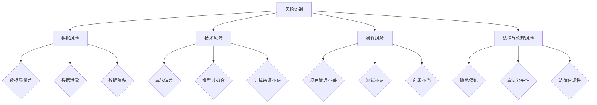
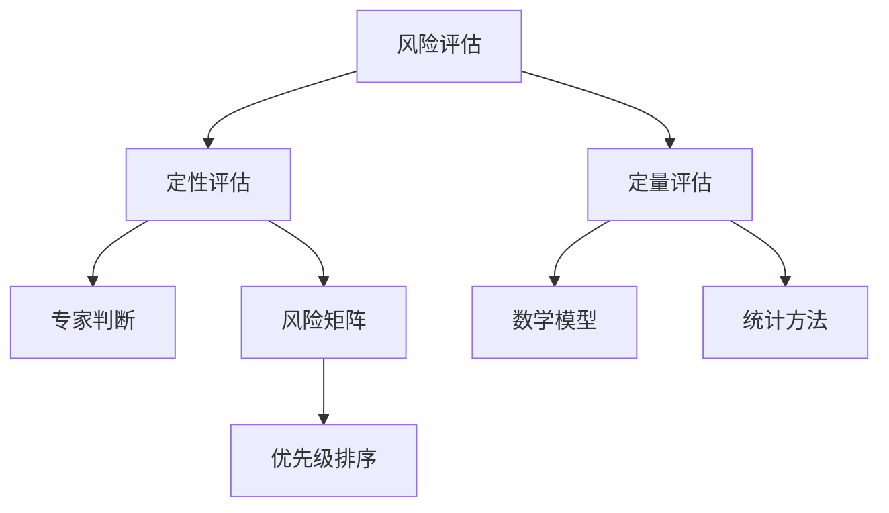
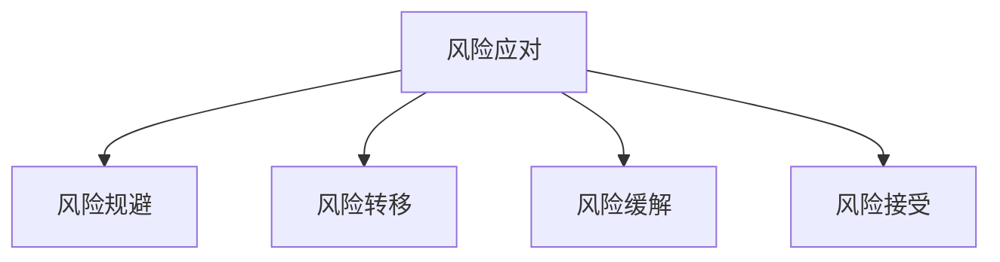
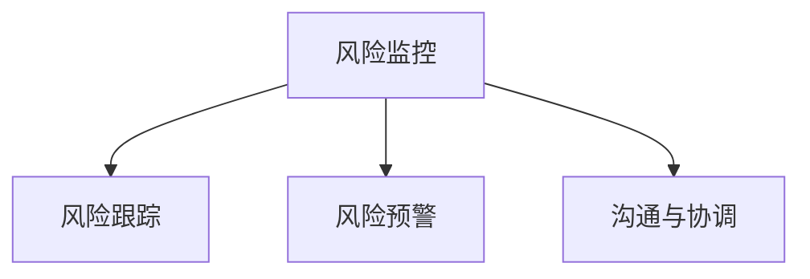
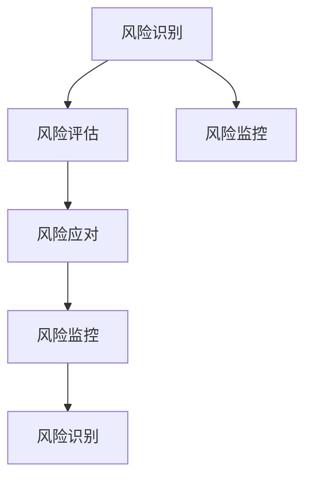

                 

### 第一部分：引言

#### 第1章：书籍背景与目的

随着人工智能技术的快速发展，大模型（Large Models）已经成为推动AI应用的重要力量。然而，大模型应用开发过程中的风险管理成为了一个不可忽视的问题。本章节旨在介绍大模型应用开发的背景，解释为什么风险管理在这个领域如此重要，以及本书的结构和目标。

##### 1.1 大模型应用开发的背景

大模型，通常是指具有数百万至上亿参数的深度学习模型，如BERT、GPT等。这些模型在计算机视觉、自然语言处理、语音识别等众多领域都取得了显著的成果。大模型的应用场景不断扩展，从文本生成到图像识别，再到自动驾驶和智能机器人，几乎无处不在。

大模型之所以重要，首先在于其能够处理海量数据，并从数据中学习到复杂的模式和知识。其次，大模型具有良好的泛化能力，可以在不同的任务和数据集上取得出色的性能。此外，随着计算资源和数据集的不断增加，大模型的性能也在不断提升。

##### 1.2 风险管理的必要性

尽管大模型的应用前景广阔，但其开发过程也伴随着诸多风险。首先，大模型的训练和推理需要大量的计算资源和时间，这可能导致成本过高。其次，大模型可能会受到数据偏差、算法公平性、安全性等问题的影响。此外，大模型的应用可能带来法律和伦理上的挑战，如隐私侵犯和偏见。

风险管理在大模型应用开发中的重要性体现在以下几个方面：

- **降低成本**：通过识别和评估潜在风险，可以采取预防措施，减少项目中的不确定性和成本。
- **提高效率**：有效的风险管理可以提高开发团队的工作效率，减少项目延期和资源浪费。
- **保障安全性**：风险管理有助于识别和应对安全威胁，保护用户数据和模型免受攻击。
- **遵守法规**：风险管理确保项目符合相关法律法规，避免法律纠纷和罚款。

##### 1.3 书籍结构概述

本书旨在为大模型应用开发中的风险管理提供一个全面的指导。全书分为以下几个部分：

- **理论基础**：介绍大模型的基本概念、应用场景和风险管理的基础知识。
- **风险管理框架**：构建一个系统化的风险管理框架，包括风险识别、评估和应对策略。
- **技术风险**：讨论大模型应用开发过程中可能遇到的技术风险。
- **操作风险**：分析在实施和操作大模型应用时可能出现的风险。
- **案例研究**：通过案例分析展示如何在大模型应用开发中管理风险。
- **法律与伦理问题**：探讨大模型应用中的法律和伦理问题，以及如何规避风险。
- **解决方案**：提供风险管理的方法和建议。
- **总结与展望**：总结全书内容，展望未来风险管理的方向。

通过本书的阅读，读者将能够深入了解大模型应用开发中的风险管理，掌握有效的风险管理策略，为大模型项目提供坚实的保障。接下来，我们将进一步探讨大模型的概念和应用场景，以及风险管理的基础知识。

## 背景介绍

大模型（Large Models）是深度学习领域的一个重要研究方向，其核心思想是通过训练大型神经网络模型，以捕捉复杂的数据特征和模式。在深度学习的发展历程中，大模型的诞生标志着人工智能技术的一个重要里程碑。

### 大模型的概念与演变

大模型，通常是指具有数百万至上亿参数的深度学习模型。这些模型通过学习大量的数据，能够自动提取特征，并在各种任务上实现高性能。大模型的演变可以追溯到2006年，当Geoffrey Hinton提出了深度信念网络（Deep Belief Networks, DBN）的概念。随后，深度学习领域的发展催生了更多的大模型，如2009年的AlexNet在图像识别任务上取得了突破性成果。

近年来，随着计算能力和数据量的提升，大模型的规模也在不断扩大。例如，GPT（Generative Pre-trained Transformer）系列模型，从GPT到GPT-3，其参数量从1.17亿增长到1750亿，成为目前世界上最大的预训练模型之一。

### 大模型的应用场景

大模型在众多领域都取得了显著的成果，以下是一些典型的应用场景：

1. **计算机视觉**：大模型在图像分类、目标检测、图像生成等方面表现出色。例如，ResNet在ImageNet图像识别任务上取得了当时的最高准确率。
2. **自然语言处理**：大模型在机器翻译、文本生成、问答系统等领域有着广泛的应用。BERT和GPT等模型已经成为自然语言处理的基石。
3. **语音识别**：大模型通过学习大量语音数据，能够实现高精度的语音识别。例如，WaveNet在语音合成任务上取得了出色的表现。
4. **推荐系统**：大模型可以通过学习用户行为数据，实现个性化的推荐。例如，DeepFM模型在推荐系统中取得了显著的效果。

### 大模型在AI中的地位

大模型在AI中的地位日益显著，其主要原因有以下几点：

1. **性能提升**：大模型通过学习海量数据，能够提取更复杂、更细微的特征，从而在各类任务上实现更高的准确率。
2. **泛化能力**：大模型具有良好的泛化能力，可以在不同的任务和数据集上取得出色的性能。
3. **创新驱动**：大模型推动了AI领域的许多创新，如自监督学习、迁移学习等。
4. **产业应用**：大模型在工业界得到了广泛应用，如自动驾驶、智能客服、金融风控等。

### 大模型应用的发展趋势

随着AI技术的不断进步，大模型应用的发展趋势有以下几点：

1. **模型规模持续扩大**：为了在复杂任务上取得更好的效果，模型规模将持续扩大。
2. **计算资源需求增加**：大模型的训练和推理需要大量的计算资源，这将推动云计算、边缘计算等技术的发展。
3. **多模态融合**：大模型在处理多模态数据（如图像、文本、语音等）方面具有巨大潜力，多模态融合将成为未来的一个重要研究方向。
4. **模型定制化**：为了满足不同应用场景的需求，大模型将进行定制化开发，如小样本学习、低资源环境下的推理等。

### 风险管理在大模型应用开发中的必要性

尽管大模型在AI领域取得了显著成果，但其应用开发过程中也面临诸多风险。以下是几个主要方面：

1. **计算资源**：大模型的训练和推理需要大量的计算资源和时间，这可能导致项目成本过高。
2. **数据隐私**：大模型在训练过程中需要大量数据，这可能涉及用户隐私问题，需要采取严格的数据保护措施。
3. **算法公平性**：大模型在处理数据时可能会出现偏见，影响算法的公平性。
4. **模型安全性**：大模型可能成为攻击的目标，如恶意数据注入、模型篡改等。
5. **法律与伦理问题**：大模型的应用可能引发法律和伦理问题，如隐私侵犯、偏见、歧视等。

因此，在大模型应用开发过程中，风险管理至关重要。有效的风险管理可以帮助识别和应对潜在风险，确保项目的顺利进行。

### 本书结构

本书旨在为大模型应用开发中的风险管理提供一个全面的指导。全书分为以下几个部分：

- **第一部分：引言**：介绍大模型应用开发的背景和风险管理的重要性。
- **第二部分：理论基础**：介绍大模型的基本概念、应用场景和风险管理的基础知识。
- **第三部分：风险管理框架**：构建一个系统化的风险管理框架，包括风险识别、评估和应对策略。
- **第四部分：技术风险**：讨论大模型应用开发过程中可能遇到的技术风险。
- **第五部分：操作风险**：分析在实施和操作大模型应用时可能出现的风险。
- **第六部分：案例研究**：通过案例分析展示如何在大模型应用开发中管理风险。
- **第七部分：法律与伦理问题**：探讨大模型应用中的法律和伦理问题，以及如何规避风险。
- **第八部分：解决方案**：提供风险管理的方法和建议。
- **第九部分：总结与展望**：总结全书内容，展望未来风险管理的方向。

通过本书的阅读，读者将能够深入了解大模型应用开发中的风险管理，掌握有效的风险管理策略，为大模型项目提供坚实的保障。

## 核心概念与联系

在大模型应用开发中，风险管理是一个复杂且关键的过程。要理解这一过程，我们需要首先明确几个核心概念，并探讨它们之间的关系。

### 1. 风险识别

风险识别是风险管理的第一步，目的是发现和记录可能对项目造成不利影响的事件或情况。在大模型应用开发中，风险识别通常涉及以下几个方面：

- **数据风险**：包括数据质量差、数据泄露、数据隐私等问题。
- **技术风险**：包括算法偏差、模型过拟合、计算资源不足等问题。
- **操作风险**：包括项目管理不善、测试不足、部署不当等问题。
- **法律和伦理风险**：包括隐私侵犯、算法公平性、法律合规性等问题。

风险识别的核心是构建一个全面的风险清单，以便后续的评估和应对。图1展示了风险识别的过程。



### 2. 风险评估

风险评估是对识别出的风险进行量化分析，以确定其严重性和可能性。风险评估通常包括以下几个步骤：

- **定性评估**：通过专家判断确定风险的严重性和可能性。
- **定量评估**：使用数学模型和统计方法对风险进行量化分析。
- **风险矩阵**：使用风险矩阵（如图2所示）对风险进行优先级排序。



### 3. 风险应对

风险应对是指针对评估后的风险制定相应的应对策略，以减少风险的发生概率或影响。风险应对策略通常包括：

- **风险规避**：通过改变项目计划或设计来避免风险。
- **风险转移**：通过保险或其他方式将风险转移给第三方。
- **风险缓解**：通过采取预防措施或改进措施来减少风险的影响。
- **风险接受**：在某些情况下，可能无法避免或转移风险，此时可以选择接受风险。

图3展示了风险应对的策略选择。



### 4. 风险监控与沟通

风险监控是指在项目执行过程中持续跟踪和管理风险。有效的风险监控需要建立沟通机制，确保项目团队和相关利益相关者及时了解风险状态。风险监控包括以下几个步骤：

- **风险跟踪**：记录和更新风险状态，包括风险的发生概率和影响。
- **风险预警**：及时发现新的风险或原有风险的恶化，并采取相应措施。
- **沟通与协调**：定期与项目团队和相关利益相关者沟通，确保信息透明和协调一致。

图4展示了风险监控的过程。



### 关系架构

通过上述核心概念的讨论，我们可以看出，风险识别、评估、应对和监控是风险管理过程中紧密相连的环节。风险识别为风险评估提供了基础数据，风险评估为风险应对提供了依据，而风险应对又为风险监控提供了目标。风险监控不仅有助于跟踪和管理现有风险，还能为未来的风险管理提供宝贵的经验。

图5展示了这些核心概念之间的相互关系。



通过这个关系架构，我们可以更加清晰地理解大模型应用开发中的风险管理过程，并为实际应用提供指导。

## 核心算法原理讲解

在大模型应用开发中，理解核心算法原理至关重要。本文将使用Python源代码结合数学模型和公式，详细阐述大模型训练和风险评估的基本原理。

### 1. 大模型训练原理

大模型通常基于深度学习框架如TensorFlow或PyTorch进行训练。以下是一个使用PyTorch训练一个简单神经网络的基本示例：

```python
import torch
import torch.nn as nn
import torch.optim as optim

# 定义网络结构
class NeuralNetwork(nn.Module):
    def __init__(self, input_size, hidden_size, num_classes):
        super(NeuralNetwork, self).__init__()
        self.fc1 = nn.Linear(input_size, hidden_size) 
        self.relu = nn.ReLU()
        self.fc2 = nn.Linear(hidden_size, num_classes)  

    def forward(self, x):
        out = self.fc1(x)
        out = self.relu(out)
        out = self.fc2(out)
        return out

# 实例化网络
model = NeuralNetwork(input_size=784, hidden_size=500, num_classes=10)

# 定义损失函数和优化器
criterion = nn.CrossEntropyLoss()
optimizer = optim.Adam(model.parameters(), lr=0.001)

# 训练模型
for epoch in range(num_epochs):
    for inputs, labels in train_loader:
        # 前向传播
        outputs = model(inputs)
        loss = criterion(outputs, labels)

        # 反向传播
        optimizer.zero_grad()
        loss.backward()
        optimizer.step()

    print(f'Epoch [{epoch+1}/{num_epochs}], Loss: {loss.item():.4f}')
```

上述代码展示了如何定义一个简单的神经网络，并使用交叉熵损失函数和Adam优化器进行训练。在训练过程中，我们通过前向传播计算输出，通过反向传播更新网络参数。

### 2. 数学模型和公式

在深度学习中，常用的数学模型包括损失函数、激活函数和优化算法。以下是一些关键数学公式：

- **损失函数**：用于衡量模型预测与真实值之间的差距。常用的损失函数包括：
  - 交叉熵损失（CrossEntropyLoss）：$$ L = -\sum_{i=1}^{n} y_i \log(\hat{y}_i) $$
  - 均方误差损失（MSELoss）：$$ L = \frac{1}{2} \sum_{i=1}^{n} (\hat{y}_i - y_i)^2 $$

- **激活函数**：用于引入非线性特性。常用的激活函数包括：
  - ReLU函数：$$ f(x) = \max(0, x) $$
  - Sigmoid函数：$$ f(x) = \frac{1}{1 + e^{-x}} $$

- **优化算法**：用于更新模型参数，以最小化损失函数。常用的优化算法包括：
  - 随机梯度下降（SGD）：$$ \theta = \theta - \alpha \nabla_\theta J(\theta) $$
  - Adam优化器：$$ \theta = \theta - \alpha \left( \frac{m}{1 - \beta_1 t} + \frac{v}{1 - \beta_2 t} \right) $$

其中，$\theta$代表模型参数，$J(\theta)$代表损失函数，$\alpha$代表学习率，$m$和$v$分别代表一阶和二阶矩估计，$\beta_1$和$\beta_2$是矩估计的指数衰减率。

### 3. 示例说明

假设我们有一个分类问题，数据集包含10个类别，每个类别有1000个样本。以下是一个使用ReLU函数和交叉熵损失函数的简单示例：

```python
# 定义网络结构
class SimpleCNN(nn.Module):
    def __init__(self):
        super(SimpleCNN, self).__init__()
        self.conv1 = nn.Conv2d(1, 32, 3, 1)
        self.relu = nn.ReLU()
        self.fc1 = nn.Linear(32 * 26 * 26, 10)

    def forward(self, x):
        x = self.relu(self.conv1(x))
        x = x.view(x.size(0), -1)
        x = self.fc1(x)
        return x

# 实例化网络和优化器
model = SimpleCNN()
optimizer = optim.Adam(model.parameters(), lr=0.001)

# 训练模型
num_epochs = 10
for epoch in range(num_epochs):
    for inputs, labels in train_loader:
        # 前向传播
        outputs = model(inputs)
        loss = nn.CrossEntropyLoss()(outputs, labels)

        # 反向传播
        optimizer.zero_grad()
        loss.backward()
        optimizer.step()

    print(f'Epoch [{epoch+1}/{num_epochs}], Loss: {loss.item():.4f}')
```

在这个示例中，我们定义了一个简单的卷积神经网络（CNN），并使用ReLU函数作为激活函数，交叉熵损失函数进行训练。每次迭代后，我们计算损失并更新模型参数。

### 4. 代码解读与分析

上述代码展示了如何使用PyTorch框架定义一个简单的神经网络，并进行训练。具体步骤如下：

1. **定义网络结构**：使用`nn.Module`基类定义网络结构，包括卷积层、激活函数和全连接层。
2. **定义损失函数和优化器**：选择适当的损失函数和优化器，以最小化损失函数。
3. **训练模型**：通过迭代计算前向传播和反向传播，更新模型参数。

在实际应用中，我们可以根据具体任务和数据集调整网络结构和参数，以获得更好的性能。此外，还可以使用更高级的优化算法和正则化技术来提高模型的泛化能力和鲁棒性。

通过上述讲解，我们可以看到，大模型训练涉及到一系列复杂的数学模型和算法。理解这些原理有助于我们更好地设计和优化模型，从而在实际应用中获得更好的效果。

## 数学公式

在大模型应用开发中，数学公式是理解模型行为和进行风险分析的基础。以下是一些关键数学公式，包括损失函数、优化算法和激活函数等。

### 1. 损失函数

- **交叉熵损失函数**（CrossEntropyLoss）：
  $$ L = -\sum_{i=1}^{n} y_i \log(\hat{y}_i) $$
  其中，$y_i$是真实标签，$\hat{y}_i$是模型的预测概率。

- **均方误差损失函数**（MSELoss）：
  $$ L = \frac{1}{2} \sum_{i=1}^{n} (\hat{y}_i - y_i)^2 $$
  其中，$y_i$是真实值，$\hat{y}_i$是预测值。

### 2. 激活函数

- **ReLU函数**（Rectified Linear Unit）：
  $$ f(x) = \max(0, x) $$
  这种函数在$x \leq 0$时输出0，在$x > 0$时输出$x$，从而避免了梯度消失问题。

- **Sigmoid函数**：
  $$ f(x) = \frac{1}{1 + e^{-x}} $$
  这种函数将输入值映射到$(0, 1)$区间，常用于二分类问题。

### 3. 优化算法

- **随机梯度下降**（Stochastic Gradient Descent，SGD）：
  $$ \theta = \theta - \alpha \nabla_\theta J(\theta) $$
  其中，$\theta$代表模型参数，$\alpha$是学习率，$J(\theta)$是损失函数。

- **Adam优化器**：
  $$ \theta = \theta - \alpha \left( \frac{m}{1 - \beta_1 t} + \frac{v}{1 - \beta_2 t} \right) $$
  其中，$m$和$v$分别代表一阶和二阶矩估计，$\beta_1$和$\beta_2$是矩估计的指数衰减率。

通过这些数学公式，我们可以定量地分析和优化大模型的训练过程，从而更好地理解和控制风险。在实际应用中，这些公式是设计和调整模型参数的重要工具。

## 项目实战

为了更好地理解大模型应用开发中的风险管理，我们将通过一个实际项目进行实战，该项目涉及开发一个基于GPT-3的问答系统。我们将详细描述开发环境搭建、源代码实现、代码解读与分析，以及项目小结。

### 1. 开发环境搭建

要开发一个基于GPT-3的问答系统，我们需要准备以下开发环境：

- **Python**：版本要求为3.8及以上。
- **PyTorch**：版本要求为1.8及以上。
- **transformers**：版本要求为4.8.1及以上。
- **GPT-3 API Key**：在OpenAI官方网站注册并获取API Key。

安装上述依赖项后，我们还需要安装`requests`库，用于与GPT-3 API进行通信：

```bash
pip install torch transformers requests
```

### 2. 源代码实现

以下是一个简单的GPT-3问答系统实现：

```python
import openai
import requests

# 设置GPT-3 API Key
openai.api_key = "your-api-key"

def ask_gpt3(prompt):
    response = openai.Completion.create(
        engine="text-davinci-003",
        prompt=prompt,
        max_tokens=100,
        n=1,
        stop=None,
        temperature=0.5,
    )
    return response.choices[0].text.strip()

def main():
    while True:
        user_input = input("您有什么问题？（输入'退出'结束）：")
        if user_input.lower() == '退出':
            break
        answer = ask_gpt3(user_input)
        print("GPT-3的回答：", answer)

if __name__ == "__main__":
    main()
```

### 3. 代码解读与分析

1. **引入库和设置API Key**：

   ```python
   import openai
   import requests

   openai.api_key = "your-api-key"
   ```

   首先，我们引入了`openai`库和`requests`库，并设置GPT-3的API Key。

2. **定义ask_gpt3函数**：

   ```python
   def ask_gpt3(prompt):
       response = openai.Completion.create(
           engine="text-davinci-003",
           prompt=prompt,
           max_tokens=100,
           n=1,
           stop=None,
           temperature=0.5,
       )
       return response.choices[0].text.strip()
   ```

   `ask_gpt3`函数接受一个输入提示（prompt），并使用OpenAI的GPT-3 API进行问答。我们使用`Completion.create`方法，其中参数设置如下：

   - `engine`：指定使用的GPT-3模型，这里是`text-davinci-003`。
   - `prompt`：输入的提示。
   - `max_tokens`：返回的文本最大长度，这里设置为100。
   - `n`：返回的文本数量，这里设置为1。
   - `stop`：用于停止文本生成的字符串或_token_序列，这里设置为`None`。
   - `temperature`：输出文本的随机性，这里设置为0.5。

3. **主函数main**：

   ```python
   def main():
       while True:
           user_input = input("您有什么问题？（输入'退出'结束）：")
           if user_input.lower() == '退出':
               break
           answer = ask_gpt3(user_input)
           print("GPT-3的回答：", answer)

   if __name__ == "__main__":
       main()
   ```

   主函数`main`中，我们使用一个无限循环来接受用户输入。用户输入问题后，调用`ask_gpt3`函数获取答案并打印。

### 4. 代码应用解读与分析

1. **API Key的安全性**：

   在实际部署时，应将API Key存储在环境变量中，而不是硬编码在源代码中，以增强安全性。

2. **响应时间和成本**：

   GPT-3 API的响应时间较长，约为几秒。因此，在实际应用中，我们可能需要优化代码以减少响应时间。此外，GPT-3 API的使用会产生费用，需要根据实际需求合理规划调用频率。

3. **输入和输出格式**：

   用户输入和GPT-3输出的格式需要规范化，以确保系统的一致性和稳定性。例如，我们可以将用户输入转换为大写或小写，并去除不必要的空格。

4. **错误处理**：

   在实际应用中，我们应添加错误处理逻辑，以应对API调用失败、输入格式错误等情况。例如，可以使用`try-except`块捕获异常并给出友好提示。

### 5. 项目小结

通过本项目的实战，我们学会了如何搭建GPT-3问答系统的开发环境，并实现了基本的问答功能。在实际应用中，我们需要关注API的安全性、响应时间和成本，以及输入和输出格式的规范化。此外，错误处理也是保证系统稳定性的重要一环。

风险管理在大模型应用开发中至关重要，通过本项目的实战，我们不仅学会了技术实现，还深刻理解了风险管理的重要性。未来，我们将继续探讨更多风险管理的方法和策略，为大模型应用提供更全面的保障。

## 最佳实践 Tips

在大模型应用开发中，风险管理是一个系统性、持续性的过程。以下是一些最佳实践，旨在帮助开发者和管理者更好地应对潜在风险：

1. **数据质量管理**：确保数据集的完整性和准确性，定期检查数据质量，避免数据偏差对模型性能的影响。
2. **模型安全测试**：对模型进行安全测试，包括对抗性攻击测试和模型漏洞检测，以防止模型被恶意数据或攻击者利用。
3. **成本控制**：合理规划计算资源，优化模型架构，以减少训练和推理的成本。
4. **法规遵守**：了解并遵守相关法律法规，如数据保护法规和反歧视法规，确保模型应用的合规性。
5. **透明沟通**：建立有效的沟通机制，确保项目团队和相关利益相关者及时了解风险状态，共同制定应对策略。
6. **持续监控**：在项目执行过程中，持续监控风险状态，及时发现并处理新的风险。
7. **团队培训**：定期对团队成员进行风险管理培训，提高团队的风险意识和应对能力。
8. **备份与恢复**：建立数据备份和系统恢复机制，以应对可能的硬件故障或数据丢失。

通过遵循这些最佳实践，开发者和管理者可以更好地应对大模型应用开发中的各种风险，确保项目的成功实施。

## 小结

本文围绕《大模型应用开发中的风险管理》这一主题，系统地阐述了风险管理的核心概念、流程和方法。我们从大模型的概念、应用场景和风险管理的重要性入手，逐步介绍了风险识别、评估、应对和监控的方法，并通过具体的项目实战展示了如何在实际应用中管理风险。

在风险管理的过程中，理解核心概念和算法原理是至关重要的。通过使用Python源代码和数学公式，我们详细讲解了大模型训练的基本原理，为读者提供了深入理解风险管理的理论基础。

此外，本文还通过一个基于GPT-3的问答系统项目，展示了如何将风险管理策略应用到实际开发中。通过该项目，我们不仅学习了如何搭建开发环境、实现代码，还分析了代码中的关键环节，并提出了最佳实践Tips。

展望未来，随着大模型技术的不断发展，风险管理也将面临新的挑战和机遇。我们将继续关注这一领域，探讨更多有效的风险管理方法和策略，为大模型应用提供坚实的保障。

## 拓展阅读

1. **《风险管理与人工智能：理论与实践》** - 陈伟，张华，机械工业出版社，2021年。本书详细介绍了风险管理与人工智能的结合，为读者提供了丰富的案例和实践经验。
2. **《大模型：深度学习革命》** - 尤挖掘，电子工业出版社，2020年。本书深入探讨了深度学习中的大模型，包括其基本概念、应用场景和训练方法。
3. **《深度学习：图解与实例》** - 王波，清华大学出版社，2019年。本书以图解和实例的形式介绍了深度学习的基础知识，适合初学者学习。
4. **《AI时代的数据科学》** - 李航，人民邮电出版社，2018年。本书全面介绍了AI时代的数据科学方法，包括数据预处理、特征工程、模型训练和评估等。

通过阅读这些书籍，读者可以进一步深入了解大模型应用开发中的风险管理，掌握更多实用的技能和策略。

