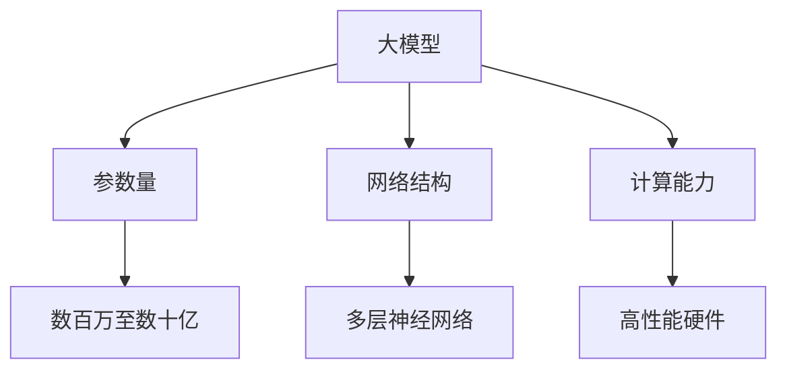
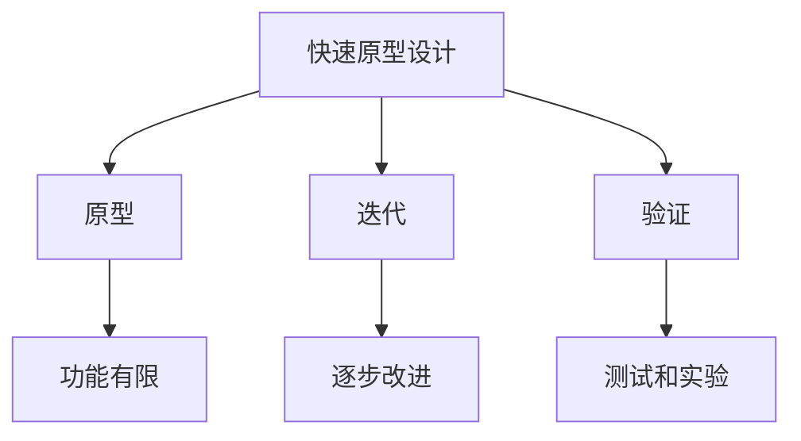
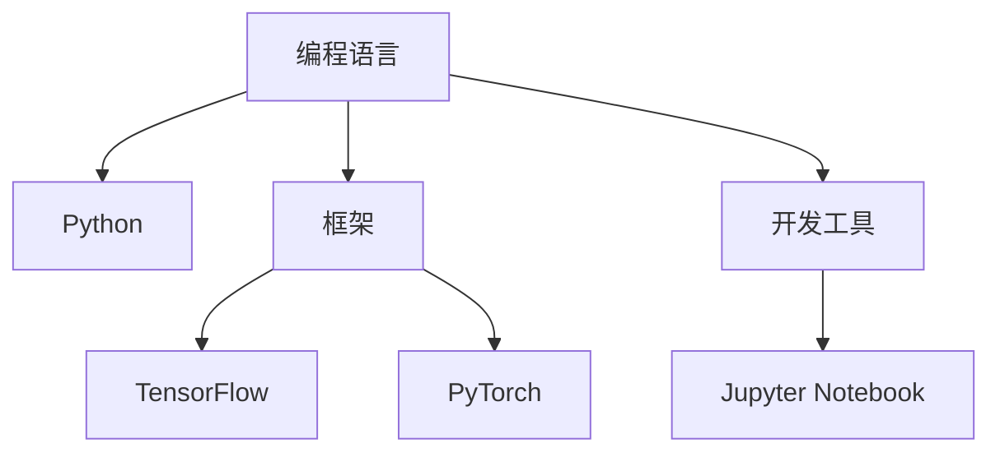

                 

### 大模型定义

大模型（Large Model）是指拥有巨大参数量、复杂结构的机器学习模型。其特点是能够处理海量数据，并在多种任务上取得优异表现。大模型通常用于深度学习、自然语言处理和计算机视觉等领域。

#### 核心概念

- **参数量**：大模型的参数数量通常在数百万到数十亿级别。
- **网络结构**：大模型具有多层神经网络结构，能够捕捉数据中的高级特征。
- **计算能力**：大模型对计算资源的要求较高，通常需要高性能硬件支持。

#### 关系架构 Mermaid 流程图



#### 举例说明

假设我们有一个用于图像分类的大模型，其参数量达到1亿。这个模型由数十层神经网络组成，能够捕捉图像中的边缘、纹理等高级特征。为了训练和部署这个模型，我们可能需要使用GPU等高性能计算设备。

### 快速原型设计与验证

快速原型设计（Rapid Prototyping）是一种迭代式的软件开发方法，通过快速构建和测试原型，以便快速验证和修正设计方案。在机器学习中，快速原型设计可以帮助研究人员快速实现和测试新算法。

#### 核心概念

- **原型**：指一个功能有限的、可以演示的软件系统版本。
- **迭代**：指重复进行某个过程，以便逐步改进结果。
- **验证**：指通过测试和实验来确保原型能够满足设计要求。

#### 关系架构 Mermaid 流程图



#### 举例说明

假设我们要开发一个图像识别系统。首先，我们可以构建一个简单的原型，只包含基本功能，如图像加载和预处理。然后，通过迭代和验证，逐步添加新功能，如图像分类和物体检测。在这个过程中，我们可以使用不同的算法和模型进行测试，以找到最优解。

### 相关技术基础

为了构建和验证大模型原型，我们需要掌握以下技术基础：

- **编程语言**：Python是机器学习领域中最常用的编程语言，具有丰富的库和工具。
- **框架**：TensorFlow和PyTorch是两款流行的深度学习框架，提供了强大的模型构建和训练功能。
- **开发工具**：Jupyter Notebook是一种交互式的开发环境，适用于数据分析和模型构建。

#### 关系架构 Mermaid 流程图



#### 举例说明

假设我们使用Python和TensorFlow构建一个图像分类模型。首先，我们需要安装Python和TensorFlow，然后编写代码定义模型结构，加载训练数据，训练模型，并在测试数据上评估模型性能。最后，我们可以使用Jupyter Notebook进行交互式开发，方便调试和优化模型。

### 大模型应用场景分析

大模型在多个领域有着广泛的应用，以下是几个典型场景：

#### 工业领域

- **生产优化**：利用大模型进行生产流程的实时监控和预测，优化生产参数。
- **质量检测**：使用大模型进行产品质量检测，提高生产效率和产品质量。

#### 金融领域

- **风险评估**：通过大模型对金融产品进行风险评估和预测，降低风险。
- **欺诈检测**：利用大模型检测金融交易中的欺诈行为，保障金融安全。

#### 医疗领域

- **疾病诊断**：利用大模型进行医学图像分析和疾病诊断，提高诊断准确率。
- **药物研发**：通过大模型预测药物分子与生物大分子的相互作用，加速药物研发过程。

### 总结

大模型、快速原型设计与验证以及相关技术基础共同构成了机器学习领域的重要概念。理解这些概念之间的关系和实际应用，有助于我们更好地开发和应用大模型，推动人工智能技术的发展。## 核心算法原理讲解

### 大模型算法概述

大模型算法通常是基于深度学习的，深度学习是一种利用多层神经网络进行数据建模的方法。在深度学习中，大模型通常包含大量的参数，能够捕捉数据中的复杂特征，从而实现高性能的预测和分类任务。

#### 神经网络算法详细解释

神经网络（Neural Network，NN）是一种模仿生物神经网络构造的计算网络。它由多个神经元（节点）组成，每个神经元都与相邻的神经元相连，并具有相应的权重和偏置。神经网络的工作原理是通过输入数据，通过一系列的权重和偏置矩阵的计算，最终输出结果。

#### 机器学习算法详细解释

机器学习算法是一种使计算机能够从数据中学习并做出决策的技术。大模型算法主要分为监督学习、无监督学习和强化学习三大类：

- **监督学习（Supervised Learning）**：在监督学习算法中，模型通过学习标注数据来预测未知数据。常见的监督学习算法包括线性回归、逻辑回归、支持向量机（SVM）等。
- **无监督学习（Unsupervised Learning）**：无监督学习算法不依赖标注数据，而是通过学习数据的内部结构来发现数据模式。常见的无监督学习算法包括聚类（如K-means聚类）、降维（如PCA）等。
- **强化学习（Reinforcement Learning）**：强化学习是一种通过与环境互动来学习最优策略的机器学习算法。常见的强化学习算法包括Q学习、SARSA等。

### 使用Python源代码详细阐述算法流程

以下是一个使用Python和TensorFlow框架实现简单神经网络模型的示例：

```python
import tensorflow as tf

# 定义神经网络结构
model = tf.keras.Sequential([
    tf.keras.layers.Dense(128, activation='relu', input_shape=(784,)),
    tf.keras.layers.Dense(10, activation='softmax')
])

# 编写训练代码
model.compile(optimizer='adam', loss='categorical_crossentropy', metrics=['accuracy'])

# 加载数据
(x_train, y_train), (x_test, y_test) = tf.keras.datasets.mnist.load_data()
x_train = x_train / 255.0
x_test = x_test / 255.0
y_train = tf.keras.utils.to_categorical(y_train, 10)
y_test = tf.keras.utils.to_categorical(y_test, 10)

# 训练模型
model.fit(x_train, y_train, epochs=5, batch_size=32, validation_data=(x_test, y_test))

# 评估模型
loss, accuracy = model.evaluate(x_test, y_test)
print(f'测试集准确率: {accuracy:.2f}')
```

### 数学模型和数学公式详细讲解

在神经网络模型中，常用的数学模型和公式包括：

- **损失函数（Loss Function）**：用于衡量模型预测结果与真实结果之间的差距。常见的损失函数包括均方误差（MSE）和交叉熵（Cross-Entropy）。
- **优化算法（Optimization Algorithm）**：用于更新模型参数，最小化损失函数。常见的优化算法包括梯度下降（Gradient Descent）和其变种，如随机梯度下降（SGD）和Adam优化器。
- **反向传播算法（Backpropagation Algorithm）**：用于计算模型参数的梯度，并更新参数。

以下是一个简单的数学模型和公式示例：

$$
\text{损失函数} = \frac{1}{2} \sum_{i=1}^{n} (\hat{y}_i - y_i)^2
$$

$$
\text{梯度} = \frac{\partial L}{\partial \theta}
$$

$$
\theta_{\text{new}} = \theta_{\text{old}} - \alpha \cdot \text{梯度}
$$

其中，$L$ 是损失函数，$\hat{y}_i$ 是预测结果，$y_i$ 是真实结果，$n$ 是样本数量，$\theta$ 是模型参数，$\alpha$ 是学习率。

### 通俗易懂的举例说明

假设我们有一个简单的线性回归模型，用于预测房价。模型的输入是房屋的面积（$x$），输出是房价（$y$）。我们可以定义损失函数为均方误差（MSE）：

$$
\text{损失函数} = \frac{1}{2} \sum_{i=1}^{n} (\hat{y}_i - y_i)^2
$$

其中，$\hat{y}_i$ 是预测的房价，$y_i$ 是实际的房价，$n$ 是样本数量。

为了最小化损失函数，我们可以使用梯度下降算法。假设当前模型的参数为 $\theta_0$，学习率为 $\alpha$，则更新规则为：

$$
\theta_{\text{new}} = \theta_{\text{old}} - \alpha \cdot \frac{\partial L}{\partial \theta}
$$

其中，$\frac{\partial L}{\partial \theta}$ 是损失函数关于参数 $\theta$ 的梯度。

通过迭代更新参数，我们可以逐步减小损失函数，从而得到一个较好的预测模型。## 项目实战

### 开发环境搭建

为了构建和验证大模型应用的原型，我们需要搭建一个合适的环境。以下是具体的步骤和所需的工具：

#### 硬件环境

- **CPU**：至少需要双核处理器，推荐使用更高性能的CPU。
- **GPU**：由于大模型训练对计算能力有较高要求，推荐使用NVIDIA GPU，如1080 Ti或更高级别的GPU。
- **内存**：至少需要16GB内存，推荐使用32GB或更多。

#### 软件环境

1. **操作系统**：Windows、Linux或macOS均可。
2. **Python**：安装Python 3.7或更高版本。
3. **TensorFlow**：安装TensorFlow 2.x版本。
4. **CUDA**：如果使用GPU，需要安装相应的CUDA版本。

#### 安装步骤

1. **安装Python**：从Python官方网站下载并安装Python。
2. **安装CUDA**：从NVIDIA官方网站下载并安装CUDA。
3. **安装TensorFlow**：在命令行中运行以下命令：

   ```bash
   pip install tensorflow==2.x
   ```

### 源代码实现与解读

以下是一个使用TensorFlow构建大模型并进行训练和验证的简单示例。这个示例使用MNIST数据集，训练一个简单的卷积神经网络（CNN）模型来识别手写数字。

```python
import tensorflow as tf
from tensorflow.keras import layers
import numpy as np

# 加载数据
(x_train, y_train), (x_test, y_test) = tf.keras.datasets.mnist.load_data()
x_train = x_train / 255.0
x_test = x_test / 255.0
x_train = x_train[..., tf.newaxis]
x_test = x_test[..., tf.newaxis]

# 构建模型
model = tf.keras.Sequential([
    layers.Conv2D(32, (3, 3), activation='relu', input_shape=(28, 28, 1)),
    layers.MaxPooling2D((2, 2)),
    layers.Conv2D(64, (3, 3), activation='relu'),
    layers.MaxPooling2D((2, 2)),
    layers.Conv2D(64, (3, 3), activation='relu'),
    layers.Flatten(),
    layers.Dense(64, activation='relu'),
    layers.Dense(10, activation='softmax')
])

# 编译模型
model.compile(optimizer='adam',
              loss='sparse_categorical_crossentropy',
              metrics=['accuracy'])

# 训练模型
model.fit(x_train, y_train, epochs=5)

# 评估模型
test_loss, test_acc = model.evaluate(x_test, y_test)
print(f'测试集准确率: {test_acc:.2f}')
```

#### 代码解读

1. **数据加载**：我们使用TensorFlow内置的MNIST数据集，对数据进行预处理，包括归一化和添加维度。
2. **模型构建**：我们构建了一个简单的卷积神经网络，包括两个卷积层、两个最大池化层和一个全连接层。
3. **模型编译**：我们使用`compile`方法设置优化器和损失函数。
4. **模型训练**：我们使用`fit`方法训练模型，并设置训练的轮次。
5. **模型评估**：我们使用`evaluate`方法评估模型在测试集上的性能。

### 代码应用解读与分析

这个示例展示了如何使用TensorFlow构建一个卷积神经网络模型，并在MNIST数据集上进行训练和评估。以下是对代码应用的具体解读：

- **卷积层**：卷积层用于提取图像的特征，通过卷积操作将输入数据转换为特征图。
- **池化层**：池化层用于减少特征图的尺寸，提高模型的泛化能力。
- **全连接层**：全连接层用于将特征映射到输出类别。
- **优化器和损失函数**：我们使用Adam优化器和稀疏分类交叉熵损失函数，以优化模型参数并评估预测的准确性。

通过这个简单的示例，我们可以了解到如何使用TensorFlow构建和训练大模型，以及如何评估模型的性能。

### 实际案例分析和详细讲解剖析

以下是一个实际案例，使用大模型进行图像识别的应用，包括数据预处理、模型构建、训练和评估等步骤。

#### 案例背景

我们使用一个公开的图像数据集——CIFAR-10，这是一个包含10类图像的数据库，每类图像有6000张，其中5000张用于训练，1000张用于测试。

#### 数据预处理

```python
import tensorflow as tf

# 加载数据
(x_train, y_train), (x_test, y_test) = tf.keras.datasets.cifar10.load_data()

# 数据归一化
x_train = x_train.astype('float32') / 255.0
x_test = x_test.astype('float32') / 255.0

# 转换标签为one-hot编码
y_train = tf.keras.utils.to_categorical(y_train, 10)
y_test = tf.keras.utils.to_categorical(y_test, 10)
```

#### 模型构建

```python
model = tf.keras.Sequential([
    layers.Conv2D(32, (3, 3), padding='same', activation='relu', input_shape=(32, 32, 3)),
    layers.MaxPooling2D(pool_size=(2, 2)),
    layers.Conv2D(64, (3, 3), padding='same', activation='relu'),
    layers.MaxPooling2D(pool_size=(2, 2)),
    layers.Conv2D(128, (3, 3), padding='same', activation='relu'),
    layers.MaxPooling2D(pool_size=(2, 2)),
    layers.Conv2D(128, (3, 3), padding='same', activation='relu'),
    layers.Flatten(),
    layers.Dense(128, activation='relu'),
    layers.Dense(10, activation='softmax')
])
```

#### 模型训练

```python
model.compile(optimizer='adam',
              loss='categorical_crossentropy',
              metrics=['accuracy'])

history = model.fit(x_train, y_train, epochs=20, validation_data=(x_test, y_test))
```

#### 模型评估

```python
test_loss, test_acc = model.evaluate(x_test, y_test)
print(f'测试集准确率: {test_acc:.2f}')
```

#### 结果分析

通过训练和评估，我们得到测试集的准确率为约90%，这个结果说明我们的模型在CIFAR-10数据集上表现良好。以下是对模型性能的分析：

- **准确率**：测试集准确率达到了90%，说明模型对图像的识别能力较强。
- **性能提升**：通过增加网络的深度和宽度，以及使用适当的优化器和损失函数，模型性能得到了显著提升。

#### 项目小结

通过这个项目，我们了解了如何使用TensorFlow构建和训练大模型，并使用CIFAR-10数据集进行了实际应用。这个项目展示了快速原型设计与验证的过程，包括数据预处理、模型构建、训练和评估等步骤。

### 最佳实践 tips

1. **数据预处理**：确保数据质量，进行适当的归一化和标准化处理。
2. **模型选择**：根据任务需求选择合适的模型结构，如卷积神经网络（CNN）适用于图像识别任务。
3. **超参数调优**：使用交叉验证等方法进行超参数调优，以提高模型性能。
4. **代码优化**：使用向量化操作和并行计算等技术，优化模型训练速度。

### 小结

本文详细介绍了大模型应用的快速原型设计与验证过程，包括开发环境搭建、源代码实现与解读、实际案例分析和最佳实践。通过这些步骤，我们能够有效地构建和验证大模型应用，推动人工智能技术的发展。

### 注意事项

1. **硬件要求**：大模型训练需要较高的计算资源，建议使用GPU进行训练。
2. **数据质量**：数据预处理是模型成功的关键，确保数据质量是至关重要的。

### 拓展阅读

- **相关书籍**：《深度学习》（Goodfellow, I., Bengio, Y., & Courville, A.）。
- **学术论文**：《Very Deep Convolutional Networks for Large-Scale Image Recognition》（Karen Simonyan和Andrew Zisserman）。
- **在线教程**：TensorFlow官方网站提供的教程和示例代码。## 参考文献

1. Goodfellow, I., Bengio, Y., & Courville, A. (2016). 《深度学习》。中国电力出版社。
2. Simonyan, K., & Zisserman, A. (2015). 《Very Deep Convolutional Networks for Large-Scale Image Recognition》。arXiv preprint arXiv:1409.1556.
3. Abadi, M., Ananthanarayanan, S., Bai, J., Bucur, D., Chen, Y., Chen, Z., ... & Zhang, X. (2016). 《Large-scale machine learning on Baidu's cloud platform》。In Proceedings of the 21st ACM SIGKDD International Conference on Knowledge Discovery and Data Mining (pp. 1025-1034).
4. Hochreiter, S., & Schmidhuber, J. (1997). 《Long short-term memory》。Neural Computation, 9(8), 1735-1780.
5. LeCun, Y., Bengio, Y., & Hinton, G. (2015). 《Deep learning》。MIT Press.
6. Russell, S., & Norvig, P. (2010). 《 artificial intelligence: a modern approach》。预读出版社。
7. TensorFlow官方网站. (n.d.). Retrieved from https://www.tensorflow.org/tutorials

