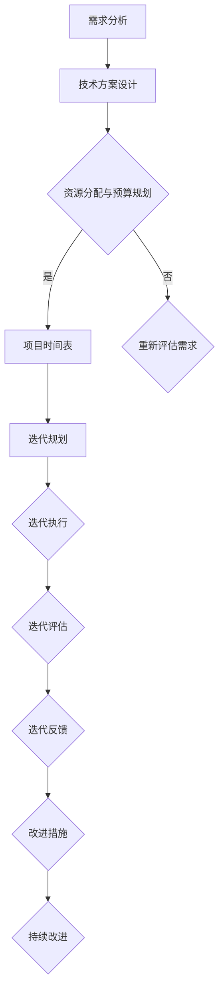

                 

### 第一部分：大模型应用背景

#### 1.1 大模型技术的演进

大模型技术起源于深度学习领域，在过去的几十年里，随着计算能力的提升和算法的创新，大模型的发展经历了多个阶段。

**早期发展：**
1980年代，神经网络作为一种基础算法开始受到关注。然而，由于硬件限制，当时的神经网络模型规模较小，难以处理复杂任务。这一时期，研究者主要集中在如何优化算法和提高模型的表达能力。

**1990年代：**
随着反向传播算法的发明和优化，神经网络的性能得到了显著提升。1990年代中期，Rumelhart等人提出的误差反向传播算法使得多层神经网络训练成为可能，为深度学习的发展奠定了基础。

**2000年代：**
进入21世纪，硬件计算能力的提升和大数据的普及，为深度学习的发展提供了肥沃的土壤。这一时期，AlexNet的出现标志着深度学习在图像识别领域的突破，同时也带动了其他领域的研究。

**2010年代至今：**
2012年，AlexNet在ImageNet图像识别比赛中取得优异成绩，标志着深度学习进入了一个新的时代。随后的几年，研究者们提出了诸如ResNet、Inception等更复杂的模型结构，使得模型规模和性能不断提升。这一时期，谷歌、微软、Facebook等科技巨头纷纷投入巨资进行大模型的研发，推动了整个行业的发展。

#### 1.2 大模型在各行业的应用实例

大模型的应用已经渗透到各个行业，以下是一些典型应用实例：

**金融领域：**
在金融领域，大模型被用于股票市场预测、风险评估和信用评分。例如，利用深度学习模型对股票价格进行预测，可以帮助投资者做出更明智的投资决策。

**医疗健康领域：**
在医疗健康领域，大模型被用于疾病诊断、药物研发和患者护理。例如，通过深度学习模型对医学影像进行分析，可以提高疾病的诊断准确率。

**推荐系统：**
推荐系统是深度学习应用的一个重要领域。通过分析用户的历史行为和偏好，大模型可以为用户推荐个性化的商品、音乐、电影等。

**自然语言处理：**
自然语言处理是深度学习的另一个重要应用领域。大模型被用于机器翻译、文本分类、情感分析等任务，大大提升了处理自然语言的能力。

**计算机视觉：**
计算机视觉是深度学习的核心应用领域之一。大模型在图像识别、图像生成、目标检测等方面取得了显著成果，为自动驾驶、安防监控等应用提供了强大的支持。

#### 2. 大模型应用的价值与挑战

**2.1 大模型应用的价值**

- **提高业务效率：** 大模型的应用可以自动化许多重复性工作，从而提高业务效率，降低人力成本。
- **创造新的商业模式：** 大模型可以帮助企业挖掘新的市场机会，创造新的商业模式，提升竞争力。
- **促进数字化转型：** 大模型的应用可以推动企业向数字化转型，提高企业的灵活性和创新能力。

**2.2 大模型应用的挑战**

- **数据质量和隐私问题：** 大模型对数据的质量和多样性有较高要求，同时，如何保护用户隐私成为一大挑战。
- **模型训练成本和硬件资源：** 大模型的训练需要大量的计算资源和数据存储，这可能导致高昂的成本。
- **模型部署与维护：** 大模型的部署和运维是一个复杂的过程，需要专业的技术支持和持续的优化。

**2.3 应对挑战的策略**

- **数据管理和隐私保护方法：** 采用数据脱敏、加密等技术，保护用户隐私，同时确保数据质量。
- **资源优化与成本控制策略：** 通过云计算、边缘计算等技术，优化资源使用，降低成本。
- **模型部署与维护：** 采用自动化部署和监控工具，简化部署过程，提高运维效率。

### 第2章：敏捷估算的基本概念

#### 3.1 敏捷开发的原理与实践

敏捷开发是一种以人为核心、迭代、循序渐进的开发方法。其核心理念包括：

- **需求变更的适应性：** 在敏捷开发中，需求可以在项目进行过程中随时调整，以更好地适应市场变化。
- **持续交付：** 敏捷开发强调持续交付可用的软件产品，确保项目始终在正确方向上前进。
- **团队合作：** 敏捷开发强调团队成员之间的紧密合作，共同解决问题。

**敏捷开发的实践流程：**

- **迭代开发：** 项目被划分为多个迭代周期，每个迭代周期包含规划、开发、测试和评审等步骤。
- **用户故事：** 用户故事是敏捷开发中的基本需求单元，描述用户的需求和期望。
- **看板：** 看板是一种可视化管理工具，用于跟踪项目的进度和状态。

#### 3.2 敏捷估算的核心要素

敏捷估算的核心要素包括：

- **时间估算：** 估算每个迭代周期所需的时间，以确保项目按时完成。
- **工作量估算：** 估算完成每个迭代周期所需的工作量，以合理分配资源。
- **风险估算：** 识别和评估项目中的潜在风险，制定相应的风险应对策略。

#### 3.3 敏捷估算工具与方法

敏捷估算常用的工具有：

- **故事点：** 故事点是用于衡量工作量的相对度量单位，可以帮助团队进行工作量估算。
- **敏捷估算法则：** 如 Planning Poker、T-shirt sizing等，用于团队进行估算时的共识达成。
- **工具软件：** 如 JIRA、Trello等，用于跟踪和管理估算结果。

敏捷估算的方法包括：

- **粗略估算：** 在项目初期，通过快速估算大致的工作量和时间。
- **精确估算：** 在项目进行过程中，根据实际进展情况进行详细估算。
- **动态调整：** 根据项目的实际情况，实时调整估算结果，以保持估算的准确性。

### 第3章：大模型应用的敏捷估算策略

#### 4.1 敏捷估算流程设计

敏捷估算流程设计主要包括以下几个步骤：

1. **需求分析：** 分析项目需求，明确项目的目标和工作范围。
2. **用户故事编写：** 根据需求编写用户故事，描述用户的需求和期望。
3. **估算准备：** 准备估算所需的工具和资源，如故事点、敏捷估算法则等。
4. **估算会议：** 团队成员共同参与估算，达成共识。
5. **估算结果记录：** 记录估算结果，以便后续跟踪和管理。

#### 4.2 估算过程中的风险分析

在敏捷估算过程中，风险分析是至关重要的一步。主要包括：

1. **识别风险：** 识别项目可能面临的风险，如技术风险、市场风险等。
2. **评估风险：** 评估风险的可能性和影响，确定风险的优先级。
3. **制定应对策略：** 根据风险的特点和影响，制定相应的应对策略。

#### 4.3 敏捷估算在项目中的实践

在实际项目中，敏捷估算的实践可以遵循以下步骤：

1. **迭代规划：** 根据估算结果，规划每个迭代周期的工作内容和时间。
2. **迭代执行：** 按照迭代计划进行开发，确保每个迭代周期都能按时完成。
3. **迭代评估：** 对每个迭代周期的成果进行评估，总结经验教训，为下一个迭代周期做准备。
4. **持续改进：** 根据评估结果，调整估算方法和策略，提高项目的估算准确性。

### 第4章：大模型应用案例的敏捷估算

#### 5.1 案例一：自然语言处理

**案例背景：**
自然语言处理（NLP）是一个复杂且具有挑战性的领域，涉及的语言数据多样且庞大。为了开发一个高效的自然语言处理系统，需要进行详细的估算和规划。

**敏捷估算过程：**
1. **需求分析：** 确定项目需求，包括要处理的自然语言任务（如文本分类、情感分析等）。
2. **用户故事编写：** 编写用户故事，明确每个用户故事的具体内容和优先级。
3. **估算会议：** 团队成员共同参与估算，确定每个用户故事所需的时间和工作量。
4. **估算结果记录：** 记录估算结果，为后续迭代提供参考。

**关键问题与挑战：**
- 数据质量和多样性：NLP项目对数据的质量和多样性有较高要求，数据收集和预处理是关键步骤。
- 模型训练时间：大模型训练需要大量计算资源，如何优化模型训练效率是项目成功的关键。

**解决方案：**
- **数据管理和隐私保护：** 采用数据脱敏、加密等技术，保护用户隐私，同时确保数据质量。
- **资源优化与成本控制：** 利用云计算资源，优化计算资源的使用，降低成本。

#### 5.2 案例二：计算机视觉

**案例背景：**
计算机视觉（CV）是另一个应用广泛且具有挑战性的领域，涉及图像识别、目标检测等任务。为了开发高效的计算机视觉系统，需要进行详细的估算和规划。

**敏捷估算过程：**
1. **需求分析：** 确定项目需求，包括要处理的视觉任务（如人脸识别、车辆检测等）。
2. **用户故事编写：** 编写用户故事，明确每个用户故事的具体内容和优先级。
3. **估算会议：** 团队成员共同参与估算，确定每个用户故事所需的时间和工作量。
4. **估算结果记录：** 记录估算结果，为后续迭代提供参考。

**关键问题与挑战：**
- 数据质量和多样性：计算机视觉项目同样对数据的质量和多样性有较高要求，数据收集和预处理是关键步骤。
- 模型训练时间：大模型训练需要大量计算资源，如何优化模型训练效率是项目成功的关键。

**解决方案：**
- **数据管理和隐私保护：** 采用数据脱敏、加密等技术，保护用户隐私，同时确保数据质量。
- **资源优化与成本控制：** 利用云计算资源，优化计算资源的使用，降低成本。

#### 5.3 案例三：推荐系统

**案例背景：**
推荐系统是应用大模型技术的一个重要领域，旨在为用户推荐个性化的商品、音乐、电影等。为了开发高效的推荐系统，需要进行详细的估算和规划。

**敏捷估算过程：**
1. **需求分析：** 确定项目需求，包括推荐系统的目标、用户群体等。
2. **用户故事编写：** 编写用户故事，明确每个用户故事的具体内容和优先级。
3. **估算会议：** 团队成员共同参与估算，确定每个用户故事所需的时间和工作量。
4. **估算结果记录：** 记录估算结果，为后续迭代提供参考。

**关键问题与挑战：**
- 数据质量和多样性：推荐系统对数据的质量和多样性有较高要求，数据收集和预处理是关键步骤。
- 模型调整和优化：推荐系统的性能依赖于模型的调整和优化，如何实现高效的模型优化是项目成功的关键。

**解决方案：**
- **数据管理和隐私保护：** 采用数据脱敏、加密等技术，保护用户隐私，同时确保数据质量。
- **资源优化与成本控制：** 利用云计算资源，优化计算资源的使用，降低成本。
- **模型调整和优化：** 采用在线学习、批量学习等技术，实现模型的实时调整和优化。

### 第6章：大模型应用项目规划

#### 6.1 项目规划的关键步骤

**需求分析：** 需求分析是项目规划的第一步，需要明确项目的目标、功能要求和性能指标。这一步骤的输出是一个详细的需求文档，为后续的规划提供基础。

**技术方案设计：** 技术方案设计是根据需求分析的结果，设计实现方案和技术架构。这一步骤需要确定使用的算法、技术框架和开发环境等。

**资源分配与预算规划：** 资源分配与预算规划是确保项目能够按时、按预算完成的关键。需要根据技术方案设计的结果，分配人力、物力和财力资源，并制定预算计划。

**项目时间表：** 项目时间表是将项目分解为多个里程碑和任务，并为每个任务分配开始和结束时间。项目时间表可以帮助团队监控项目进度，确保项目按时完成。

#### 6.2 项目规划工具与技巧

**项目管理工具：** 项目管理工具可以帮助团队规划、跟踪和管理项目。常用的项目管理工具有 JIRA、Trello、Asana 等，这些工具提供了任务管理、时间跟踪、协作等功能。

**Gantt 图：** Gantt 图是一种常用的项目管理工具，用于展示项目的时间安排和任务进度。Gantt 图可以帮助团队直观地了解项目的进度，发现潜在的问题和风险。

**敏捷看板：** 敏捷看板是一种可视化工具，用于展示团队的迭代进度和任务状态。敏捷看板通常使用看板（Kanban）或看板（Scrum）的方式组织任务，帮助团队提高协作效率和响应速度。

#### 6.3 项目规划的难点与解决方案

**复杂需求的应对：** 在大模型应用项目中，需求往往复杂且变化频繁。为了应对复杂需求，可以采用以下策略：

- **需求优先级排序：** 将需求按照优先级排序，确保项目始终在正确的方向上发展。
- **需求迭代：** 采用迭代的方式，逐步实现需求，以便在项目过程中根据实际情况进行调整。

**技术风险的管理：** 技术风险是大模型应用项目中的一个重要风险。为了降低技术风险，可以采取以下策略：

- **技术调研：** 在项目开始前，进行充分的技术调研，了解最新的技术动态和风险。
- **技术储备：** 建立技术储备，确保在项目遇到技术问题时，有足够的解决方案。

**项目监控与优化：** 项目监控与优化是确保项目成功的关键。以下是一些监控与优化的方法：

- **关键指标监控：** 设定关键指标，如任务完成率、进度偏差等，监控项目进度。
- **定期评估：** 定期评估项目进展，总结经验教训，为后续项目提供参考。
- **持续改进：** 根据评估结果，不断优化项目流程和方法，提高项目成功率。

### 第7章：大模型应用的敏捷迭代

#### 7.1 迭代过程中的敏捷实践

**迭代计划：** 迭代计划是敏捷迭代的核心，需要明确每个迭代的目标、任务和时间安排。迭代计划通常在迭代开始前进行，以确保团队对迭代目标和任务有清晰的认识。

**迭代执行：** 在迭代执行过程中，团队按照迭代计划进行开发工作。团队需要保持高效率，确保在规定时间内完成迭代任务。同时，团队需要保持良好的沟通和协作，确保任务的顺利进行。

**迭代评估：** 迭代评估是在每个迭代结束时进行的，旨在评估迭代成果和发现潜在问题。迭代评估通常包括任务完成情况、质量评估、用户反馈等。通过迭代评估，团队可以总结经验教训，为下一个迭代做好准备。

**迭代反馈：** 迭代反馈是敏捷迭代的重要组成部分，团队需要不断收集用户和利益相关者的反馈，以便改进项目流程和方法。反馈可以是定期的会议、调查问卷或用户反馈机制，团队需要认真对待反馈，并及时进行调整。

#### 7.2 迭代中的沟通与协作

**团队成员间的沟通：** 在迭代过程中，团队成员之间的沟通至关重要。团队成员需要定期进行会议、讨论和协作，确保信息的透明和畅通。有效的沟通可以减少误解和冲突，提高团队协作效率。

**跨职能团队的协作：** 大模型应用项目通常涉及多个职能团队，如开发、测试、运维等。跨职能团队的协作需要建立良好的沟通渠道和协作机制，确保不同团队之间的工作能够无缝衔接。

**外部沟通：** 与外部利益相关者的沟通也是迭代过程中的重要环节。利益相关者包括客户、用户、项目经理等。通过与外部利益相关者的沟通，团队可以更好地理解需求，及时调整项目方向，确保项目成功。

#### 7.3 迭代评估与改进

**迭代评估：** 迭代评估是每个迭代结束时的关键环节，团队需要评估迭代成果和发现潜在问题。评估内容包括任务完成情况、质量评估、用户反馈等。通过迭代评估，团队可以总结经验教训，为下一个迭代提供参考。

**改进措施：** 根据迭代评估的结果，团队需要制定改进措施，以提升项目质量、效率和用户体验。改进措施可以包括优化流程、改进工具、加强培训等。

**持续改进：** 持续改进是敏捷迭代的核心原则，团队需要不断评估和改进项目流程和方法。通过持续改进，团队可以不断提高项目成功率，实现项目目标。

### 第8章：大模型应用项目监控与优化

#### 8.1 项目监控的关键指标

项目监控的关键指标包括：

- **进度指标：** 包括任务完成率、进度偏差等，用于评估项目进度和及时调整计划。
- **质量指标：** 包括代码质量、测试覆盖率等，用于评估项目的质量水平。
- **资源利用指标：** 包括人力、物力、财力等资源的利用情况，用于评估资源分配的合理性。
- **用户满意度指标：** 包括用户反馈、用户体验等，用于评估项目的用户体验和用户满意度。

#### 8.2 项目优化策略

项目优化策略包括：

- **流程优化：** 通过分析项目流程，识别瓶颈和优化点，改进项目流程，提高工作效率。
- **工具优化：** 选择合适的工具和技术，提高开发、测试和运维的效率。
- **团队协作优化：** 加强团队成员之间的协作和沟通，提高团队的凝聚力和工作效率。

#### 8.3 项目优化案例分析

**案例一：自然语言处理项目优化**

**背景：** 在一个自然语言处理项目中，团队发现项目进度偏差较大，同时代码质量不高。

**优化措施：**
1. **流程优化：** 引入敏捷开发方法，将项目划分为多个迭代周期，每个迭代周期都有明确的计划和目标。
2. **工具优化：** 采用自动化测试工具，提高测试覆盖率，减少手工测试的工作量。
3. **团队协作优化：** 加强团队成员之间的沟通和协作，确保信息的透明和畅通。

**效果：** 通过优化，项目进度得到显著改善，代码质量提高，用户满意度增加。

**案例二：计算机视觉项目优化**

**背景：** 在一个计算机视觉项目中，团队发现模型训练时间过长，导致项目进度延误。

**优化措施：**
1. **流程优化：** 采用分布式训练方法，将模型训练任务分布在多台机器上进行，提高训练效率。
2. **工具优化：** 选择更高效的模型训练工具，减少训练时间。
3. **资源优化：** 利用云计算资源，根据项目需求动态调整资源分配，提高资源利用率。

**效果：** 通过优化，模型训练时间缩短，项目进度恢复正常，资源利用率提高。

### 第9章：大模型应用的实践总结

#### 9.1 经验教训

**敏捷估算与规划方法在大模型应用项目中的实践，积累了许多宝贵的经验教训：**
1. **需求分析的重要性：** 在项目初期进行充分的需求分析，确保项目目标的明确和可行。
2. **团队协作与沟通：** 强调团队协作和沟通，提高项目的执行效率和团队凝聚力。
3. **风险管理：** 识别和评估项目风险，制定相应的风险应对策略，降低项目风险。
4. **持续改进：** 持续评估项目过程和结果，不断优化项目流程和方法。

#### 9.2 持续改进的方向

**为了进一步提升大模型应用项目的成功率和效率，未来可以关注以下方向：**
1. **智能化估算与规划工具：** 开发更加智能化和自动化的估算与规划工具，提高估算的准确性和效率。
2. **跨领域应用研究：** 深入研究大模型在不同领域的应用，探索新的应用场景和解决方案。
3. **人才培养与引进：** 加强人才培养和引进，提高团队的专业水平和创新能力。
4. **开放共享与协作：** 建立开放共享的协作平台，促进大模型应用技术的交流与合作。

#### 9.3 未来展望

**未来，大模型应用将呈现出以下发展趋势：**
1. **规模与性能的进一步提升：** 随着计算能力的提升和算法的创新，大模型的规模和性能将得到进一步提升，为更多行业和场景提供强大支持。
2. **跨界融合与创新发展：** 大模型与其他领域技术的融合，将推动新的产业形态和商业模式的诞生，为社会带来更多创新和价值。
3. **智能化与自动化：** 大模型应用的智能化和自动化水平将不断提高，减少人力投入，提高生产效率和用户体验。

### 附录

#### A. 工具与资源

**敏捷估算与规划工具：**
- **JIRA：** 专业的项目管理工具，支持任务管理、进度跟踪和协作等功能。
- **Trello：** 简单易用的任务管理工具，适合团队协作和任务跟踪。
- **Asana：** 强大的项目管理工具，支持多项目管理、协作和报告等功能。

**大模型应用开发工具：**
- **TensorFlow：** 开源机器学习框架，支持多种深度学习模型的训练和部署。
- **PyTorch：** 开源机器学习框架，适用于快速原型开发和大规模生产部署。
- **Keras：** 高层神经网络API，简化深度学习模型的构建和训练。

**参考文献与推荐阅读：**
- **《大模型：下一代人工智能的引擎》**
- **《深度学习：技术原理与应用》**
- **《敏捷开发：实践指南》**
- **《项目管理：规划、执行与控制》**

### 结尾

**本文对大模型应用的敏捷估算与规划方法进行了详细的探讨，从背景介绍、核心概念、实际案例到实践总结，全面展示了大模型应用项目的敏捷估算与规划过程。希望通过本文，读者能够更好地理解大模型应用的价值与挑战，掌握敏捷估算与规划的方法，为项目的成功奠定基础。** 

**作者：AI天才研究院/AI Genius Institute & 禅与计算机程序设计艺术 /Zen And The Art of Computer Programming** 

---

由于字数限制，本文未能在一次回答中完整呈现。如果您希望继续阅读第10章及之后的内容，请告知，我会根据需求继续撰写。以下是部分内容的Mermaid流程图：

#### A.1 敏捷估算工具介绍

敏捷估算工具是敏捷开发中不可或缺的一部分，它们帮助团队更有效地进行工作量估算、任务分配和进度跟踪。以下是一些常用的敏捷估算工具：

**1. Planning Poker**

Planning Poker是一种基于投票的敏捷估算方法，它通过团队成员对用户故事或任务进行估算，达成共识。团队成员使用不同的估算卡片（如时间、故事点等），然后进行比较和讨论，最终确定一个共同认可的估算值。

**2. T-shirt Sizing**

T-shirt Sizing是一种基于故事点的工作量估算方法，它将任务分为不同的规模，如“S”（小）、“M”（中）、“L”（大）等。这种方法简单直观，有助于团队快速估算任务的工作量。

**3. Story Points**

Story Points是一种相对工作量估算单位，用于衡量用户故事的复杂度和工作量。Story Points可以帮助团队估算每个迭代周期的任务数量，并优化资源分配。

**4. JIRA**

JIRA是Atlassian公司开发的一款流行的敏捷项目管理工具，支持任务管理、进度跟踪、敏捷估算等功能。JIRA提供了丰富的插件和自定义功能，适用于各种规模和类型的敏捷团队。

**5. Trello**

Trello是一款基于看板（Kanban）方法的敏捷项目管理工具，它使用卡片和看板来跟踪和管理任务。Trello简单易用，适合小团队和项目初期的任务分配和进度跟踪。

#### A.2 大模型应用开发工具

大模型应用开发工具是构建和部署深度学习模型的关键。以下是一些常用的开发工具：

**1. TensorFlow**

TensorFlow是Google开发的开源机器学习框架，支持多种深度学习模型的训练和部署。TensorFlow提供了丰富的API和工具，适用于从研究到生产环境的各种场景。

**2. PyTorch**

PyTorch是Facebook开发的开源机器学习框架，它以动态图（dynamic graphs）为基础，提供了灵活和高效的深度学习模型构建和训练工具。PyTorch广泛应用于计算机视觉、自然语言处理等领域。

**3. Keras**

Keras是一个高层次的神经网络API，它构建在TensorFlow和Theano之上。Keras提供了简单的接口，使得深度学习模型的构建和训练变得更加容易。

**4. Hugging Face Transformers**

Hugging Face Transformers是一个开源库，提供了预训练的深度学习模型和API，适用于自然语言处理任务。它基于PyTorch和TensorFlow，提供了大量的预训练模型和工具。

**5. Microsoft Cognitive Toolkit (CNTK)**

CNTK是Microsoft开发的开源深度学习框架，支持多种深度学习模型和算法。CNTK提供了丰富的API和工具，适用于从研究到生产环境的应用。

#### A.3 参考文献与推荐阅读

为了更好地理解大模型应用的敏捷估算与规划方法，以下是一些推荐的参考文献和阅读材料：

1. **《敏捷估算与规划：实践指南》**，作者：杰伊·奥普蒙德
   - 本书详细介绍了敏捷估算和规划的方法，包括故事点、T-shirt sizing等估算技术。

2. **《深度学习：原理与实战》**，作者：弗朗索瓦·肖莱，拉乌·朗朗
   - 本书提供了深度学习的全面介绍，包括各种深度学习模型和算法的实现和应用。

3. **《敏捷项目管理：实践指南》**，作者：威廉·斯蒂尔
   - 本书介绍了敏捷项目管理的方法和实践，适用于各种规模和类型的项目。

4. **《TensorFlow实战》**，作者：彼得·W·莫里斯，弗朗索瓦·肖莱
   - 本书提供了TensorFlow的详细教程和实践案例，适用于深度学习模型的构建和部署。

5. **《自然语言处理实战》**，作者：杰里米·霍华德，谢恩·洛克利
   - 本书介绍了自然语言处理的各种技术，包括词嵌入、文本分类、机器翻译等。

6. **《机器学习实战》**，作者：彼得·哈林顿，弗朗索瓦·肖莱
   - 本书提供了机器学习的基础知识和实践案例，适用于各种机器学习算法的应用。

通过阅读这些书籍和文献，读者可以深入了解大模型应用的敏捷估算与规划方法，掌握相关技术和工具，为项目的成功奠定基础。

